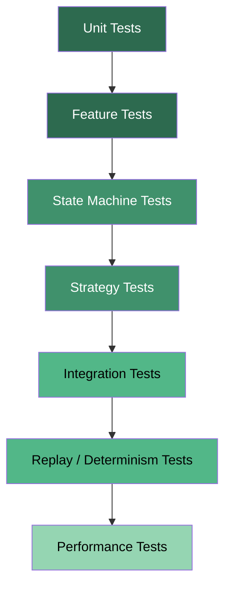
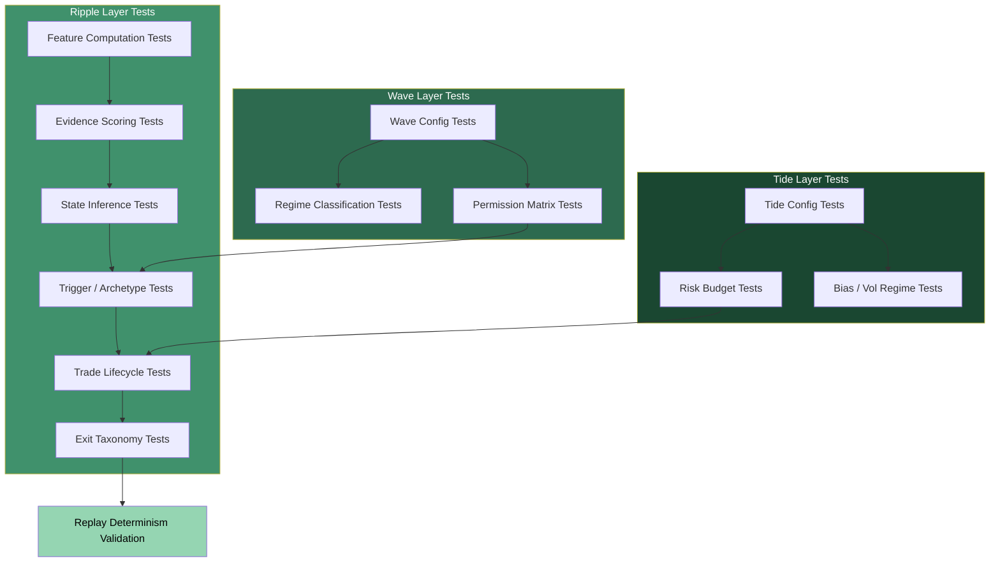

# Testing Guide

## 1. Overview

This document is the **canonical testing reference** for the Tide / Wave / Ripple quantitative trading system. It is intended for developers and coding agents working on the codebase.

The system is a mixed **C++ / Python** application that implements a layered trading strategy:

| Layer | Role | Language |
|---|---|---|
| **Tide** | Macro bias, capital allocation, risk budgets | Python (research); C++ proxy (live) |
| **Wave** | Market structure / regime classification | Python (research); C++ proxy (live) |
| **Ripple** | Execution: order flow analysis, liquidity transitions, trade lifecycle | C++ (hot path) |

The application operates in four modes: **data collection**, **backtest**, **optimise**, and **ui**. Backtest and optimise modes require strict determinism — identical inputs must produce identical outputs on every run.

Testing is critical because:

- The strategy must be **deterministic** in replay / backtest.
- We rely on **reproducible market simulations** for validation.
- Strategy **state machines must be stable** — no deadlocks, no unreachable states.
- **Risk limits must never be bypassed** — ES budgets, position caps, and permission checks are safety-critical.
- Future RL and context modules must be validated against the **deterministic baseline**.

**Source-of-truth hierarchy for testing:**

| Priority | Document | Role |
|---|---|---|
| 1 | `strategy.md` | Canonical strategy design, math, contracts |
| 2 | `implementation_plan.md` | Build plan, phases, acceptance criteria |
| 3 | Tests | Executable specification |
| 4 | `AGENT_STRATEGY_RULES.md` | Operational rules and guardrails |
| 5 | This document | How to run, write, and organize tests |

---

## 2. Testing Philosophy

### 2.1 Core Principles

1. **Correctness before performance.** Get behavior right, then optimize.
2. **Tests are executable specifications.** If a test contradicts `strategy.md`, the test is wrong — fix the test, not the strategy (unless the strategy has a bug).
3. **Every meaningful behavior change requires a test.** "Meaningful" means any change that alters outputs given the same inputs.
4. **Tests must be written before or alongside new features.** Never defer tests to a later commit.
5. **No test may be disabled without justification.** If a test fails, fix the code or the test — do not skip it.

### 2.2 Determinism Contract

For a given sequence of events and a given configuration, the strategy **must** produce identical outputs every time. This applies to:

- All features
- All state transitions
- All trade decisions
- All fills (in paper mode)

This means:

- **No wall-clock time** in decision logic — only event timestamps.
- **No unseeded random number generation** in decision logic.
- **No floating-point non-determinism** — use consistent rounding where needed.
- **All state that affects decisions must be serializable** for snapshot/restore.

### 2.3 Test-Driven Phase Progression

Each implementation phase has specific test requirements. A phase is not complete until its tests pass.

| Phase | Required Test Types |
|---|---|
| 1 — Schema & Contracts | Serialization round-trip, config load/save, pybind11 bindings |
| 2 — Deterministic Ripple | FSM transitions, exit types, scaling, event→decision, replay determinism |
| 3 — Liquidity Map | Map components, scores, map→targets, 1-week backtest, map update latency |
| 4 — Risk Budget | ES estimation, position sizing, risk check, rejection on exhaustion |
| 5 — Wave Baseline | Feature computation, regime rules, permissions→Ripple, replay determinism |
| 6 — Optimization & UI | Full pipeline, full parameter space, optimization convergence, UI integration |
| 7 — HMM Extensions | HMM math, model load, HMM vs rule-based, HMM determinism |
| 8 — Cross-Venue | Cross-venue features, multi-venue→Wave, multi-venue replay |

---

## 3. Test Categories

### 3.1 Unit Tests

**Purpose:** Validate individual functions and components in isolation.

**When required:** From Phase 1 onward. Every non-trivial function, feature computation, and state transition must have unit tests.

**Examples:**
- Enum `to_string` round-trip
- Config struct defaults match `strategy.md` §27
- `PermissionSet.get()` returns correct values
- Feature registry completeness against `strategy.md` §16
- Wall quality score computation

### 3.2 Feature Tests

**Purpose:** Validate that feature calculations produce correct values from known inputs.

**When required:** From Phase 2 onward for Ripple features; from Phase 5 onward for Wave features.

**What to test:**
- Microprice drift computation
- Order flow imbalance (top-1, top-5)
- Impact per unit volume
- CVD slope
- Wall persistence and cancellation rate
- Trend efficiency, dispersion, absorption ratio (Wave)

**Rule:** Every feature in `strategy.md` §16 that has a computation must have a test with known inputs and expected outputs.

### 3.3 State Machine Tests

**Purpose:** Validate trade lifecycle transitions, Ripple liquidity state inference, and any FSM in the system.

**When required:** From Phase 2 onward.

**What to test:**
- Every valid transition in the lifecycle FSM (SETUP → ENTRY → CONFIRMATION → ...)
- Invalid transitions are rejected
- Terminal states (CANCELLED, COOLDOWN → idle)
- No deadlocks — every non-terminal state has at least one outgoing transition
- No unreachable states
- Cooldown timer prevents re-entry

### 3.4 Replay / Determinism Tests

**Purpose:** Ensure that feeding identical event sequences produces identical outputs.

**When required:** From Phase 2 onward. Must pass after every behavioral change.

**What to test:**
- Same events + same config → same feature values
- Same events + same config → same trade decisions
- Same events + same config → same PnL

### 3.5 Integration Tests

**Purpose:** Ensure modules work together correctly end-to-end.

**When required:** From Phase 2 onward.

**What to test:**
- Event ingestion → feature computation → state inference → trade decision
- Wave permissions propagate correctly to Ripple
- Tide risk budgets propagate correctly to risk engine
- Fill events update trade lifecycle and risk state

### 3.6 Risk Tests

**Purpose:** Ensure capital limits, ES budgeting, and position caps are never violated.

**When required:** From Phase 4 onward.

**What to test:**
- No position exceeds `max_position_usd`
- No trade exceeds ES budget
- Risk-budget exit triggers when consumed ES reaches threshold
- Position sizing formula produces correct values
- Order rejected when budget is exhausted

### 3.7 Strategy Tests

**Purpose:** Validate bounce/breakout detection logic and trade management.

**When required:** From Phase 2 onward.

**What to test:**
- Bounce setup detection from wall + flow state
- Breakout setup detection from wall depletion + flow
- Confirmation logic for each archetype
- Exit type triggers (invalidation, target, exhaustion, time, risk-budget)
- Scale-in and scale-out conditions

### 3.8 Regression Tests

**Purpose:** Ensure behavior does not change unexpectedly when code is modified.

**When required:** Always. Before/after comparison for any behavioral change.

**Approach:** Capture known-good outputs (feature streams, trade logs, PnL) from a reference run. After changes, compare against the reference. Any difference must be explained and documented.

### 3.9 Performance Tests

**Purpose:** Ensure hot-path components remain efficient and meet latency targets.

**When required:** From Phase 6 onward for full benchmarks. Individual component benchmarks should be added as components are built.

**Latency targets (from `AGENT_STRATEGY_RULES.md` §9.2):**

| Operation | Target |
|---|---|
| Per-event feature update (C++) | < 10 µs |
| State machine transition (C++) | < 1 µs |
| Full Ripple tick-to-decision (C++) | < 100 µs |
| Risk check (C++) | < 1 µs |
| Wave update (Python, 5s cadence) | < 1 ms |
| Tide update (Python, 60s cadence) | < 10 ms |
| UI render cycle | < 50 ms |

**Rule:** Any regression > 20% on key latency metrics must be investigated and resolved.

### 3.10 Boundary / Adversarial Tests

**Purpose:** Validate correct behavior under edge cases and malformed inputs.

**When required:** From Phase 2 onward.

**What to test (from `strategy.md` §20.7):**
- NaN prices, negative quantities, zero timestamps
- Empty order book (no bids, no asks, or both)
- Single-level book
- Crossed book (best bid > best ask)
- Price gaps > 10% in a single event
- Timestamp discontinuities (gap > 60s, then burst)
- Maximum position reached mid-scale-in
- ES budget exhausted between entry and first scale-in
- Duplicate trade IDs in the event stream
- Out-of-order events (depth update with future timestamp)
- Zero-volume trade events

### 3.11 Property-Based Tests

**Purpose:** Verify mathematical invariants that must hold regardless of input.

**Invariants (from `strategy.md` §20.6):**
- ES >= VaR >= 0
- Final position quantity in [0, Q_max]
- Final position = 0 when risk budget = 0
- Imbalance in [-1, 1] for all order book states
- Wall quality score >= 0
- hold_score + break_score = 1
- Permissions matrix lookup never returns an undefined state
- Trade lifecycle FSM has no unreachable states and no deadlocks (except terminal states)

### 3.12 Cadence and Timing Tests

**Purpose:** Verify that layer update cadences are respected.

**What to test (from `strategy.md` §20.8):**
- Tide does not update more than once per `tide_update_interval_ms` (event-time)
- Wave does not update more than once per `wave_update_interval_ms` (event-time)
- Ripple processes every qualifying event
- Cooldown timer prevents re-entry for the configured duration
- Confirmation window expires at the correct event-time boundary

---

## 4. Running Tests

### 4.1 Prerequisites

**Python:**
```bash
# From the project root
pip install pytest
```

If `pytest` is not installed, you can also use the built-in `unittest` runner (see §6).

**Important:** pybind11 binding tests (e.g., `test_risk_bindings.py`, `test_wave_bindings.py`, `test_replay_determinism.py`, `test_hmm_bindings.py`) require the project's virtual environment Python (`.venv/bin/python`) because the C++ module is compiled against that Python version. If binding tests are skipped with the system Python, run them explicitly:
```bash
.venv/bin/python -m unittest tests.test_risk_bindings -v
.venv/bin/python -m unittest tests.test_wave_bindings -v
.venv/bin/python -m unittest tests.test_replay_determinism -v
.venv/bin/python -m unittest tests.test_hmm_bindings -v
```

**C++:**
The C++ tests are built through CMake. The build directory is at:
```
backtestingCpp/orderflow/build/
```

To set up the build system:
```bash
cd backtestingCpp/orderflow
mkdir -p build && cd build
cmake ..
```

### 4.2 Quick Start

Run everything from the project root:

```bash
# Python tests
python -m unittest discover -s tests -v

# C++ tests (after cmake setup)
cd backtestingCpp/orderflow/build
make test_schemas test_ripple test_trade_lifecycle test_liquidity_map test_risk_engine test_wave_integration test_hmm_inference
./test_schemas
./test_ripple
./test_trade_lifecycle
./test_liquidity_map
./test_risk_engine
./test_wave_integration
./test_hmm_inference

# Performance benchmark (Phase 6)
./benchmark_pipeline
```

---

## 5. C++ Test Commands

### 5.1 Build Tests

```bash
cd backtestingCpp/orderflow/build

# Reconfigure if CMakeLists.txt changed
cmake ..

# Build all test targets
make test_schemas test_ripple test_trade_lifecycle test_liquidity_map test_risk_engine test_wave_integration test_hmm_inference benchmark_pipeline

# Build everything (including pybind11 module)
make -j$(sysctl -n hw.ncpu)
```

### 5.2 Run Tests

```bash
# Schema and data contract tests (Phase 1)
./test_schemas

# Ripple pipeline tests (wall detection, features, evidence, inference, decisions)
./test_ripple

# Trade lifecycle FSM tests (Phase 2)
./test_trade_lifecycle

# Liquidity map, VP/CVD, and scale-out tests (Phase 3)
./test_liquidity_map

# Risk engine, ES throttle, position sizing tests (Phase 4)
./test_risk_engine

# Wave integration, permissions enforcement tests (Phase 5)
./test_wave_integration

# HMM inference: forward algorithm, posteriors, determinism, model load (Phase 7)
./test_hmm_inference

# Performance benchmark — tick-to-decision latency (Phase 6)
./benchmark_pipeline
```

### 5.3 Standalone Compilation (no cmake)

For quick iteration on schema tests without the full build system:

```bash
g++ -std=c++20 \
    -I backtestingCpp/orderflow \
    -o /tmp/test_schemas \
    backtestingCpp/orderflow/ripple/tests/test_schemas.cpp

/tmp/test_schemas
```

### 5.4 Available C++ Test Targets

| Target | File | What it tests | Phase |
|---|---|---|---|
| `test_schemas` | `ripple/tests/test_schemas.cpp` | Enums, data contracts, config defaults, feature registry, StrategySnapshot, pre-phase defaults | 1 |
| `test_ripple` | `ripple/tests/test_ripple.cpp` | RippleContext, WallDetector, RippleFeatureEngine, RippleEvidenceEngine, ScoreBasedInference, RippleStateTracker, TriggerDecisionEngine, RippleEngine full pipeline | 1 |
| `test_trade_lifecycle` | `ripple/tests/test_trade_lifecycle.cpp` | TradeLifecycleEngine FSM transitions, all 5 exit types, scale-in logic, trailing stop, permission checks, intent generation, determinism, TickContext, LifecycleConfig | 2 |
| `test_liquidity_map` | `ripple/tests/test_liquidity_map.cpp` | LiquidityMapEngine level collection (walls, VP, flow, structural), hold/break/dest scoring, void corridor detection, destinations query, CVD divergence boost, scale-out plan, determinism | 3 |
| `test_risk_engine` | `ripple/tests/test_risk_engine.cpp` | RiskEngine ES computation (§15.2), position sizing formula (§14.4), check_new_order, get_allowed_size, fill tracking, budget enforcement, unrealized PnL, boundary cases, determinism | 4 |
| `test_wave_integration` | `ripple/tests/test_wave_integration.cpp` | WaveSnapshot storage/reset on RippleEngine, PermissionSet is_allowed/size_fraction, §18 permissions matrix (all 12 rows), permission enforcement at entry, reduced-fraction custom values | 5 |
| `test_hmm_inference` | `ripple/tests/test_hmm_inference.cpp` | HMM forward algorithm, posterior distributions (sum-to-1, non-negative), Gaussian emission, model load/save, determinism, state transitions, confidence bounds, 3/5-state models, reset, observation recording | 7 |
| `benchmark_pipeline` | `ripple/tests/benchmark_pipeline.cpp` | Tick-to-decision latency benchmark: 5000 synthetic events, P99 < 100 µs target, mean/median/P95/P99/max statistics | 6 |

### 5.5 Discovering C++ Tests

All C++ test files live under:
```
backtestingCpp/orderflow/ripple/tests/
```

Test executables are declared in `backtestingCpp/orderflow/CMakeLists.txt` as `add_executable(...)` entries.

### 5.6 C++ Test Output Format

C++ tests use a lightweight `CHECK` macro that prints `FAIL: <message>` for failures and a final summary:

```
396 / 396 tests passed.
```

Exit code `0` means all tests passed; `1` means at least one failure.

---

## 6. Python Test Commands

### 6.1 Using pytest

```bash
# Run all Python tests
pytest tests/ -v

# Run a specific test file
pytest tests/test_schemas.py -v

# Run tests matching a keyword
pytest tests/ -k "feature" -v

# Stop on first failure
pytest tests/ --maxfail=1

# Run with short output
pytest tests/ -q

# Run a specific test class
pytest tests/test_schemas.py::TestStrategySnapshot -v

# Run a specific test method
pytest tests/test_schemas.py::TestFeatureRegistry::test_canonical_s16_completeness -v
```

### 6.2 Using unittest (no pytest required)

```bash
# Run all tests in the tests/ directory
python -m unittest discover -s tests -v

# Run a specific test file
python -m unittest tests.test_schemas -v

# Run a specific test class
python -m unittest tests.test_schemas.TestStrategySnapshot -v

# Run a specific test method
python -m unittest tests.test_schemas.TestFeatureRegistry.test_canonical_s16_completeness -v
```

### 6.3 Available Python Test Files

| File | What it tests |
|---|---|
| `tests/test_schemas.py` | Enums, data contracts, defaults, config JSON round-trip, feature registry completeness, StrategySnapshot construction/determinism/serialization, pre-phase defaults |
| `tests/test_tide_engine.py` | TideEngine risk multiplier by regime (§7.4.7), LSI stress penalty, cadence gating, snapshot fields, bias/vol passthrough, determinism, invariants |
| `tests/test_risk_bindings.py` | RiskEngine pybind11 bindings: construction, set_budget, check_new_order, get_allowed_size, compute_position_size, on_fill, PnL, reset, determinism |
| `tests/test_wave_engine.py` | WaveEngine trend efficiency (§8.5.4), distance-to-structure (§8.5.5), permissions matrix (§18, all 12 rows), regime state machine (§8.8, all transitions), cadence gating, determinism, property invariants, boundary cases |
| `tests/test_wave_bindings.py` | Wave pybind11 bindings: WaveSnapshot, PermissionSet, WaveConfig, WaveRegime/PermissionLevel enums, RippleEngine wave snapshot set/get/reset |
| `tests/test_replay_determinism.py` | Full-pipeline replay determinism: identical event sequences → identical StrategySnapshot output, multiple parameter configs, triple replay, paper-fills on/off |
| `tests/test_hmm_trainer.py` | HMM Baum-Welch trainer: convergence, BIC model selection, transition/variance validity, deterministic training, model JSON round-trip, save/load file, C++-compatible format |
| `tests/test_hmm_bindings.py` | HMM pybind11 bindings: HMMBasedInference class, model load from string, config hmm_enabled/hmm_model_path, RippleEngine set_hmm_backend/set_score_backend swap |
| `tests/test_crossvenue_engine.py` | CrossVenueEngine: Pearson correlation, lead/lag, divergence, cadence gating, window trimming, determinism, CSV store round-trip, replay determinism |
| `tests/test_crossvenue_wave.py` | Cross-venue → Wave integration: low correlation → BREAKDOWN, large divergence → BREAKDOWN, high correlation no breakdown, baseline preservation, reset, accessors, determinism |

### 6.4 Discovering Python Tests

All Python test files live under:
```
tests/
```

Test files follow the `test_*.py` naming convention. Test classes inherit from `unittest.TestCase`. Test methods are named `test_*`.

---

## 7. Strategy-Specific Tests

### 7.1 Liquidity Transition Tests

Liquidity transitions are the core of the Ripple execution layer. Each transition must be tested with synthetic order book and trade data.

**Absorption:**
- Wall retains quantity despite aggressive flow directed at it
- Evidence scoring: absorption score rises above threshold
- State transitions to ABSORBING when absorption dominates

**Exhaustion:**
- Wall being consumed (depletion percentage increasing)
- Refill rate low relative to depletion
- Impact per unit volume rising
- State transitions to EXHAUSTING

**Liquidity withdrawal:**
- Wall depth shrinks via cancellation, not fills
- Cancellation rate dominates total shrinkage
- Spread shock (liquidity pulled)
- State transitions to WITHDRAWING

**Refill:**
- Depth reappearing after depletion
- Refill rate exceeds depletion rate
- Aggression reversed or balanced
- State transitions to REFILLING

### 7.2 Trade Archetype Tests

**Bounce trade:**
- Wall detected with sufficient quality score
- Price within proximity zone (proximity_sigma)
- Microprice shifting away from wall (confirmation)
- Imbalance above threshold (bounce_imbalance_thresh)
- Risk evidence (breakout, withdrawal) below safety thresholds

**Breakout trade:**
- Wall detected with sufficient quality score
- Wall depth failing (below breakout_depth_fail_ratio)
- CVD slope above threshold (breakout_cvd_slope_thresh)
- Absorption evidence below safety threshold

### 7.3 Trade Lifecycle Tests

Test every transition in the lifecycle FSM defined in `strategy.md` §12:

```
SETUP → ENTRY → CONFIRMATION → EXPANSION → MATURATION → EXIT → COOLDOWN
                                                                   ↓
SETUP → CANCELLED                                               (idle)
```

| Transition | Trigger | Test |
|---|---|---|
| SETUP → ENTRY | Confirmation conditions met within window | Feed events that satisfy archetype-specific confirmation |
| SETUP → CANCELLED | Confirmation window expires | Feed events with timestamps past window |
| ENTRY → CONFIRMATION | Fill received | Feed a fill event |
| CONFIRMATION → EXPANSION | Favorable move > threshold | Feed price movement exceeding expand_threshold_sigma |
| EXPANSION → MATURATION | Max hold time reached or targets hit | Feed events at time boundary |
| Any active → EXIT | Exit signal fires | Feed conditions for each exit type |
| EXIT → COOLDOWN | Exit complete | Verify transition after exit |
| COOLDOWN → idle | Cooldown timer expires | Feed event after cooldown_ms elapsed |

### 7.4 Exit Type Tests

Test each exit type independently (from `strategy.md` §13):

| Exit Type | Trigger | Priority | Test |
|---|---|---|---|
| Risk-budget | consumed_es >= 90% budget OR risk_mult = 0 | Highest | Set risk budget near exhaustion, verify exit |
| Invalidation | Stop price hit | Highest | Move price through stop |
| Time | hold_time > max_hold_time_ms | Normal | Advance event timestamp past max hold time |
| Target | Price crosses target level | Normal | Move price through target |
| Exhaustion | CVD fading + rate declining + impact rising | Normal | Feed exhaustion pattern |

**Evaluation order:** Risk-budget → Invalidation → Time → Target → Exhaustion (first match fires).

---

## 8. Replay / Backtest Determinism Tests

### 8.1 Core Approach

1. Prepare a fixed sequence of events (trades + depth updates) with known timestamps.
2. Configure the strategy with a fixed configuration.
3. Run the event sequence through the full pipeline twice.
4. Assert that all outputs are bitwise identical.

### 8.2 What to Compare

| Output | Comparison |
|---|---|
| Feature values | Exact float equality (or within `testing.replay_tolerance`) |
| Liquidity state | Enum equality |
| Trade decisions | Identical intents, timestamps, prices, quantities |
| Lifecycle states | Identical state at every event |
| PnL | Exact equality |
| Fill events | Identical count, prices, quantities, sides |

### 8.3 Strategy for Implementation

```python
# Pseudocode for a replay determinism test
def test_replay_determinism():
    events = load_fixed_event_sequence()
    config = load_fixed_config()

    outputs_a = run_pipeline(events, config)
    outputs_b = run_pipeline(events, config)

    assert outputs_a.features == outputs_b.features
    assert outputs_a.decisions == outputs_b.decisions
    assert outputs_a.pnl == outputs_b.pnl
```

### 8.4 Common Determinism Violations

| Violation | Symptom | Fix |
|---|---|---|
| Wall-clock time in logic | Different outputs on different runs | Replace with event timestamps |
| Unseeded RNG | Different outputs on different runs | Seed all PRNGs from config |
| Map iteration order | Different outputs on different platforms | Use ordered containers |
| Float accumulation order | Tiny differences growing over time | Use consistent reduction order |
| Uninitialized memory | Non-deterministic initial values | Zero-initialize all structs |

---

## 9. Risk Engine Tests

### 9.1 Position Limits

- Verify that no position exceeds `tide.max_position_usd`.
- Verify that `RiskEngine::check_new_order` returns `false` when a new order would exceed the limit.
- Verify that `RiskEngine::get_allowed_size` clips the requested size to the available budget.

### 9.2 ES Budget Limits

- Verify that `consumed_es` never exceeds `es_budget`.
- Verify that the risk-budget exit triggers when `consumed_es >= budget_exit_threshold * es_budget`.
- Verify that `Q_final = 0` when `remaining_budget = 0`.

### 9.3 Position Sizing Formula

- Verify that position sizing respects `risk.target_risk_usd`, `risk.sigma_target`, and the Tide risk multiplier.
- Verify that `Q_final` is clamped to `[0, Q_max]`.
- Verify the vol-ratio clamp in `ripple.vol_ratio_clamp`.

### 9.4 Fee Accounting

- Verify that PnL calculations include maker and taker fees.
- Verify that fee configuration parameters propagate correctly from `risk.maker_fee_bps` and `risk.taker_fee_bps`.

### 9.5 Strategy Sleeve Budgets (V2+)

Not required in V1. Reserve test stubs for hierarchical ES decomposition.

---

## 10. Liquidity Map Tests

### 10.1 Component Tests

Each component of the liquidity map must be tested independently:

| Component | Test |
|---|---|
| Resting liquidity levels | Walls contribute depth at correct prices |
| Traded liquidity levels | Volume profile contributes profile_volume |
| Flow-pressure levels | Trade flow contributes net_flow |
| Structural anchors | VWAP, session high/low are correct |
| Void corridors | Corridors detected between significant levels |

### 10.2 Score Tests

- `hold_score + break_score = 1` for every level.
- `dest_score` ranks destinations correctly.
- Scores update correctly as new data arrives.

### 10.3 Integration

- Targets derived from the liquidity map match the highest-scoring destinations.
- Scale-out points align with destination levels.
- The map respects the bounded level count (max 100 levels per `strategy.md` §21.1).

### 10.4 Performance

- `LiquidityMapEngine::update` should complete in < 50 µs (bounded number of levels).
- Void corridor detection: < 10 µs.

---

## 11. Trade State Machine Tests

### 11.1 Lifecycle FSM Completeness

Verify that the FSM defined in `strategy.md` §12 is correctly implemented:

- All 8 states exist: SETUP, ENTRY, CONFIRMATION, EXPANSION, MATURATION, EXIT, COOLDOWN, CANCELLED.
- All valid transitions are reachable.
- No invalid transitions are possible.
- Terminal states (CANCELLED, COOLDOWN→idle) do not have outgoing transitions to active states.

### 11.2 Single-Trade Constraint (V1)

- At most one trade is active per symbol at any time.
- A new SETUP cannot begin while another trade is in any active or cooldown state.

### 11.3 Scaling Tests

- Scale-in only occurs in EXPANSION state.
- Scale-in requires favorable move > `scale_in_threshold_sigma` × σ.
- Scale-in requires CVD momentum intact.
- Scale-in requires risk budget allows additional size.
- Max scale-ins is enforced (default: 1 add, 2 tranches total).
- Stop moves to breakeven after scale-in fill.
- Scale-out targets are ranked by `dest_score`.
- Scale-out fractions sum to 1.0.
- Stop moves to breakeven after first scale-out.
- After all scale-outs, trailing stop engages.
- Trailing stop only tightens, never loosens.

---

## 12. Integration Tests

### 12.1 Event-to-Decision Pipeline

Feed a sequence of synthetic events and verify:
1. Order book updates correctly.
2. Features compute correctly.
3. Evidence scores are reasonable.
4. State inference transitions correctly.
5. Trigger decision fires at the right moment.
6. Trade lifecycle manages the trade correctly.
7. Exit triggers at the right condition.

### 12.2 Cross-Layer Integration

- Wave permissions propagate to Ripple: disabled archetype is never entered.
- Tide risk budgets propagate to risk engine: position size is throttled.
- Fill events propagate from execution layer back to trade lifecycle and risk engine.

### 12.3 Mode Compatibility

- **Backtest mode:** Uses `ReplayFeed`, produces deterministic results.
- **Optimise mode:** Runs backtest in a loop with parameter variation, each run is deterministic.
- **UI mode:** Strategy state exposed to widgets without blocking the render thread.

---

## 13. Performance Tests

### 13.1 Benchmarking Approach

Performance tests measure latency and throughput of hot-path components. They should:

1. Warm up the component (discard first N iterations).
2. Measure wall-clock time over many iterations.
3. Report median, p95, and p99 latencies.
4. Compare against target latencies from `AGENT_STRATEGY_RULES.md` §9.2.

### 13.2 What to Benchmark

| Component | Metric | Target |
|---|---|---|
| Order book update | Time per depth update | < 10 µs |
| Feature calculation | Time per event | < 10 µs |
| Evidence scoring | Time per event | < 5 µs |
| State inference | Time per event | < 1 µs |
| Full Ripple pipeline | Tick-to-decision latency | < 100 µs |
| Risk check | Time per check | < 1 µs |
| Liquidity map update | Time per update | < 50 µs |
| Memory usage | Per-symbol memory | < 50 MB |

### 13.3 Example C++ Benchmark

```cpp
#include <chrono>

void benchmark_feature_update() {
    RippleEngine engine(config);
    // ... setup with realistic book state ...

    constexpr int WARMUP = 1000;
    constexpr int ITERS  = 100000;

    for (int i = 0; i < WARMUP; ++i)
        engine.on_trade(make_trade(/* ... */));

    auto start = std::chrono::high_resolution_clock::now();
    for (int i = 0; i < ITERS; ++i)
        engine.on_trade(make_trade(/* ... */));
    auto end = std::chrono::high_resolution_clock::now();

    auto ns = std::chrono::duration_cast<std::chrono::nanoseconds>(end - start).count();
    double us_per_iter = static_cast<double>(ns) / ITERS / 1000.0;
    std::cout << "Feature update: " << us_per_iter << " µs/iter" << std::endl;
}
```

### 13.4 Memory Profiling

For sustained replay tests, monitor memory usage over time to ensure bounded data structures do not grow beyond limits defined in `strategy.md` §21.1:

| Data Structure | Maximum Size |
|---|---|
| Order book levels per side | 500 levels |
| Tracked walls | 50 per side |
| Liquidity map levels | 100 |
| Volume profile bins | 1000 |
| Trade history (rolling) | 100,000 events |
| CVD bins | 10,000 |

---

## 14. Regression Tests

### 14.1 Approach

1. **Capture a reference run:** Run the full pipeline on a known dataset with a known configuration. Save all outputs (features, decisions, fills, PnL).
2. **After any change:** Run the same pipeline on the same dataset with the same configuration. Compare outputs against the reference.
3. **Any difference must be explained.** If the difference is intentional, update the reference. If not, the change has introduced a regression.

### 14.2 What to Capture

- Feature snapshot stream (one per event)
- Trade lifecycle state stream
- Fill event log
- Final PnL and drawdown
- Risk budget utilization

### 14.3 Automation

Regression tests should be automated as part of the test suite once Phase 6 is reached. Before that, manual comparison is acceptable if documented.

---

## 15. Continuous Integration Expectations

### 15.1 Pre-Commit Requirements

Before submitting any change, the developer must:

1. Run the full Python test suite: `python -m unittest discover -s tests -v`
2. Build and run all C++ tests: `make test_schemas test_ripple test_trade_lifecycle test_liquidity_map test_risk_engine test_wave_integration test_hmm_inference benchmark_pipeline && ./test_schemas && ./test_ripple && ./test_trade_lifecycle && ./test_liquidity_map && ./test_risk_engine && ./test_wave_integration && ./test_hmm_inference && ./benchmark_pipeline`
3. Verify that the pybind11 module compiles: `make orderflow_engine`
4. Check for linter errors in changed files.

### 15.2 Definition of Done

A change is **done** when:

| Criterion | Check |
|---|---|
| Compiles | `cmake --build .` succeeds |
| Tests pass | All existing tests pass; new tests added for new behavior |
| Replay deterministic | Same events + config → same outputs |
| Linter clean | No new linter warnings in changed files |
| Docs updated | `strategy.md` / `implementation_plan.md` updated if needed |
| Performance acceptable | No regression > 20% on key metrics |
| Change is narrow | One logical unit; no unrelated modifications |

### 15.3 Post-Phase-6 Expectations

After Phase 6:
- Performance benchmarks become part of the test suite.
- Replay determinism tests cover the full parameter space.
- A paper-trade soak test (24+ hours) is required before live deployment.

---

## 16. Adding New Tests

### 16.1 Mandatory Rules

1. **Every new feature requires a unit test.**
2. **Every state machine transition must have a test.**
3. **Every exit type must have a test.**
4. **Every risk constraint must have a test.**
5. **Every feature computation must have a test** with known inputs and expected outputs.
6. **Strategy logic must be deterministic** — replay tests must pass after every behavioral change.
7. **Performance-sensitive code should have benchmarks.**

### 16.2 Where to Put Tests

| Language | Location | Naming |
|---|---|---|
| Python | `tests/test_*.py` | Classes inherit `unittest.TestCase`, methods named `test_*` |
| C++ | `backtestingCpp/orderflow/ripple/tests/test_*.cpp` | Functions named `test_*`, registered in `main()` |

### 16.3 C++ Test Template

```cpp
#include <cassert>
#include <iostream>
#include "../../Schemas.h"  // or whatever headers are needed

using namespace orderflow;

static int tests_run = 0;
static int tests_passed = 0;

#define CHECK(cond, msg)                                           \
    do {                                                           \
        tests_run++;                                               \
        if (!(cond)) {                                             \
            std::cerr << "FAIL: " << msg << " (" << __FILE__      \
                      << ":" << __LINE__ << ")" << std::endl;      \
        } else {                                                   \
            tests_passed++;                                        \
        }                                                          \
    } while (0)

void test_my_feature() {
    // Arrange
    // Act
    // Assert using CHECK()
}

int main() {
    test_my_feature();
    std::cout << tests_passed << " / " << tests_run << " tests passed." << std::endl;
    return (tests_passed == tests_run) ? 0 : 1;
}
```

After creating the file, add a build target in `backtestingCpp/orderflow/CMakeLists.txt`:

```cmake
add_executable(test_my_feature ripple/tests/test_my_feature.cpp)
target_link_libraries(test_my_feature PRIVATE orderflow_core)
```

### 16.4 Python Test Template

```python
import os
import sys
import unittest

sys.path.insert(0, os.path.dirname(os.path.dirname(os.path.abspath(__file__))))

from schemas import StrategySnapshot, TideBias  # import what you need


class TestMyFeature(unittest.TestCase):

    def test_basic_behavior(self):
        # Arrange
        # Act
        # Assert
        self.assertEqual(expected, actual)


if __name__ == "__main__":
    unittest.main()
```

### 16.5 Registering Tests

- **Python:** Place the file in `tests/` with a `test_` prefix. Both `pytest` and `unittest discover` will find it automatically.
- **C++:** Add an `add_executable` + `target_link_libraries` entry in `CMakeLists.txt`. Then rebuild with `cmake .. && make`.

---

## 17. Debugging Failed Tests

### 17.1 C++ Test Failures

When a C++ test fails, the output looks like:

```
FAIL: expected X but got Y (test_schemas.cpp:142)
395 / 396 tests passed.
```

Steps:
1. Read the failure message and line number.
2. Open the test file at the indicated line.
3. Run the specific test function in isolation if needed (comment out others in `main()`).
4. Use `std::cerr` to print intermediate values.
5. If the test is wrong (testing incorrect behavior per `strategy.md`), fix the test and document why.

### 17.2 Python Test Failures

```bash
# Run with verbose output
python -m unittest tests.test_schemas -v

# Run a single failing test
python -m unittest tests.test_schemas.TestMyClass.test_my_method -v
```

Steps:
1. Read the assertion error and traceback.
2. Add `print()` statements or use `pdb` for debugging.
3. Check that test expectations match `strategy.md`.

### 17.3 Build Failures After Schema Changes

If `Schemas.h` or `schemas.py` changes, you may see cascading failures:
1. Rebuild the C++ library: `cd build && cmake .. && make -j$(sysctl -n hw.ncpu)`
2. Rebuild the pybind11 module: `make orderflow_engine`
3. Run both C++ and Python test suites.
4. If a schema change is required, follow the update order: `strategy.md` §17 → C++ structs → Python dataclasses → pybind11 bindings → tests.

---

## 18. Test Data and Fixtures

### 18.1 Synthetic Data

Most tests use **synthetic data** — manually constructed order books, trades, and depth updates. This ensures tests are:
- Fast (no I/O).
- Deterministic (no market randomness).
- Portable (no external data dependencies).

C++ test helpers for creating synthetic data:

```cpp
// From test_ripple.cpp — reusable helpers
static DepthUpdate make_snapshot(int64_t ts,
    std::vector<std::pair<double,double>> bids,
    std::vector<std::pair<double,double>> asks);

static DepthUpdate make_depth_update(int64_t ts,
    std::vector<std::pair<double,double>> bids,
    std::vector<std::pair<double,double>> asks);

static Trade make_trade(int64_t ts, double price, double qty, bool is_buyer_maker);
```

### 18.2 Historical Data (Phase 3+)

For backtest validation tests, historical tick data is stored in HDF5 files:
```
data/<exchange>_ticks.h5
```

These are accessed through `TickStore` and `ReplayFeed`. Historical data tests are used from Phase 3 onward to validate that the strategy produces sensible results on real market data.

### 18.3 Configuration Fixtures

The default configuration file is:
```
config.json
```

Tests that depend on configuration should either:
- Use `StrategyConfig()` with defaults (preferred for unit tests).
- Load from a test-specific JSON file (for integration tests that need specific parameters).
- Never depend on the global `config.json` for correctness — it is a convenience default, not a test fixture.

---

## 19. Testing Roadmap

### 19.1 Current State

| Test Suite | Tests | Status | Phase |
|---|---|---|---|
| `test_schemas.py` (Python) | 56 tests | Passing | 1 |
| `test_schemas.cpp` (C++) | 396 checks | Passing | 1 |
| `test_ripple.cpp` (C++) | 163 checks | Passing | 1 |
| `test_trade_lifecycle.cpp` (C++) | 126 checks | Passing | 2 |
| `test_liquidity_map.cpp` (C++) | 112 checks | Passing | 3 |
| `test_risk_engine.cpp` (C++) | 190 checks | Passing | 4 |
| `test_tide_engine.py` (Python) | 19 tests | Passing | 4 |
| `test_risk_bindings.py` (Python) | 11 tests | Passing | 4 |
| `test_wave_integration.cpp` (C++) | 38 checks | Passing | 5 |
| `test_wave_engine.py` (Python) | 56 tests | Passing | 5 |
| `test_wave_bindings.py` (Python) | 11 tests | Passing | 5 |
| `test_replay_determinism.py` (Python) | 8 tests | Passing | 6 |
| `benchmark_pipeline` (C++) | 1 benchmark | Passing (P99 < 100 µs) | 6 |
| `test_hmm_inference.cpp` (C++) | 59 checks | Passing | 7 |
| `test_hmm_trainer.py` (Python) | 11 tests | Passing | 7 |
| `test_hmm_bindings.py` (Python) | 8 tests | Passing | 7 |
| `test_crossvenue_engine.py` (Python) | 21 tests | Passing | 8 |
| `test_crossvenue_wave.py` (Python) | 9 tests | Passing | 8 |
| `test_bubble_pipeline.py` (Python) | 63 checks | Passing | UI-Phase 1 |
| `test_bucket_model.py` (Python) | 64 checks | Passing | UI-Phase 1 |
| `test_strategy_ui.py` (Python) | 163 checks | Passing | UI-Phase 2 + Signal Log |
| `test_ui_cleanup.py` (Python) | 38 checks | Passing | UI-Phase 3 |
| `test_strategy_store.py` (Python) | 63 checks | Passing | UI-Phase 4 |
| `test_integration_e2e.py` (Python) | 57 checks | Passing | UI-Phase 5 |
| `test_performance_profile.py` (Python) | 13 checks | Passing | UI-Phase 5 |
| `test_replay_overlay.py` (Python) | 34 checks | Passing | UI-Phase 5 |
| `test_bubble_aggregation.py` (Python) | 67 checks | Passing | UI-Opt, PG, TS |

### 19.2 Planned Test Suites by Phase

| Phase | New Test Suite | Focus | Status |
|---|---|---|---|
| 2 | `test_trade_lifecycle.cpp` | Lifecycle FSM transitions, exit types, scaling, trailing stop, permissions, intents, determinism | **Done** (99 checks) |
| 2 | `test_trigger_detection.cpp` | Bounce/breakout detection (covered partially via lifecycle tests; dedicated suite deferred) | Deferred |
| 3 | `test_liquidity_map.cpp` | Map components, scores, void corridors, CVD divergence boost, scale-out plan, wall quality filter, determinism | **Done** (112 checks) |
| 4 | `test_risk_engine.cpp` | ES estimation, position sizing, budget enforcement, fill tracking, PnL, boundary cases, determinism | **Done** (190 checks) |
| 4 | `test_tide_engine.py` | Risk multiplier by regime (§7.4.7), LSI stress penalty, cadence gating, snapshot fields, determinism, invariants | **Done** (19 tests) |
| 4 | `test_risk_bindings.py` | RiskEngine pybind11 binding verification | **Done** (11 tests) |
| 5 | `test_wave_integration.cpp` | WaveSnapshot storage/reset, PermissionSet enforcement, §18 matrix (all 12 rows), reduced-fraction custom values | **Done** (38 checks) |
| 5 | `test_wave_engine.py` | Trend efficiency, distance-to-structure, regime state machine (all transitions), permissions matrix, cadence gating, determinism, property invariants, boundary cases | **Done** (56 tests) |
| 5 | `test_wave_bindings.py` | Wave pybind11 binding verification (WaveSnapshot, PermissionSet, RippleEngine wave accessors) | **Done** (11 tests) |
| 6 | `test_replay_determinism.py` | Full pipeline replay determinism: default config, tight thresholds, fast pipeline, paper-fills on/off, triple replay, multi-config (4 configs) | **Done** (8 tests) |
| 6 | `benchmark_pipeline` | Tick-to-decision latency: 5000 events, P99 < 100 µs target, mean/median/P95/P99/max | **Done** (PASS, P99 ≈ 0.04 µs) |
| 7 | `test_hmm_inference.cpp` | HMM forward algorithm, posterior distributions, Gaussian emission, model load/save, determinism, state transitions, confidence bounds, 3/5-state models | **Done** (59 checks) |
| 7 | `test_hmm_trainer.py` | Baum-Welch convergence, BIC model selection, transition/variance validity, deterministic training, JSON round-trip, save/load | **Done** (11 tests) |
| 7 | `test_hmm_bindings.py` | HMM pybind11 bindings: class, model load, config fields, RippleEngine backend swap (HMM ↔ ScoreBased) | **Done** (8 tests) |
| 8 | `test_crossvenue_engine.py` | CrossVenueEngine features (Pearson, lead/lag, divergence), cadence gating, window trimming, determinism, CSV store round-trip, replay determinism | **Done** (21 tests) |
| 8 | `test_crossvenue_wave.py` | Cross-venue → Wave integration: correlation/divergence → BREAKDOWN boost, baseline preservation, reset, accessors, determinism | **Done** (9 tests) |
| UI-1 | `test_bucket_model.py` | TimeBucket OHLC, bucket assignment/alignment, visible window computation, dynamic slice_ms, bucket axis rendering, backward compat, determinism | **Done** (64 checks) |
| UI-1 | `test_bubble_pipeline.py` (updated) | Bubble pipeline regression: pruning uses wider visible window (300s default), all existing checks preserved | **Done** (63 checks) |
| UI-2 | `test_strategy_ui.py` | StrategyMode/StrategyUIState enums, SignalCategory extensions (TIDE, WAVE, TRADE_LIFECYCLE), layer display map, SignalEntry metadata, state machine, ARM/DISARM, signal emission, layer-based blotter filters (Strategy/Trade/Ripple/Raw), diagnostics panel, heatmap overlay, settings migration, backward compat | **Done** (163 checks) |
| UI-3 | `test_ui_cleanup.py` | Hidden elements (Tick Size, Imbalance), sizing gating on strategy state, Replay disabled, account panel placeholder lifecycle, backward compat | **Done** (38 checks) |
| UI-4 | `test_strategy_store.py` | HDF5 schema versioning, signal write/read roundtrip, snapshot buffered write/flush, session event persistence, time-range filtering, legacy file detection, readonly open, reopen persistence, default fields | **Done** (63 checks) |
| UI-5 | `test_integration_e2e.py` | Cross-workstream integration: session lifecycle (bucketing + strategy + HDF5), state gating, blotter filtering, bucket + overlay coexistence, time-range filtering, diagnostics panel, deterministic replay, account panel lifecycle | **Done** (57 checks) |
| UI-5 | `test_performance_profile.py` | Heatmap paint timing, bucket update throughput, signal log throughput, HDF5 write throughput, overlay marginal cost, large trade set render | **Done** (13 checks) |
| UI-5 | `test_replay_overlay.py` | Replay overlay reconstruction, signal playback into blotter, event timeline, deterministic read-back, time-windowed partial replay, diagnostics panel from replay, heatmap with replay overlay | **Done** (34 checks) |
| UI-Opt, PG, TS | `test_bubble_aggregation.py` | Price-axis bucketing, time-axis merging (100 ms slices), volume aggregation, VWAP positioning, buy/sell imbalance coloring, deterministic aggregation, reduction ratio, viewport filtering, diagnostics, performance throughput, auto-scroll regression, time-ordering, hard caps, dynamic coarsening, volume culling, deque bounds, trade-slice incremental insert, slice pruning, slice rebuild, steady-state perf, boundary stability | **Done** (67 checks) |

### 19.3 Test Architecture



Tests form a **pyramid** — unit tests at the base are the most numerous and fastest. Each layer above builds on the confidence established below.

### 19.4 Test Coverage of Strategy Layers



---

## 20. UI / Order Flow View Tests

### 20.1 Overview

UI tests validate the heatmap rendering pipeline, time-bucketed axis, and visual components. They run headless using `QApplication` without requiring a visible display.

### 20.1a Data feed layer (Binance REST depth)

Initial / resync depth snapshots use `data_feed/binance_depth_rest.py` (HTTP + parsing only; `ui/live_trading_session.py` → `LiveTradingSession` applies `process_depth` on the C++ engine). Binance USD-M trade + `depth@100ms` WebSockets live in `data_feed/binance_futures_ws.py` with `data_feed/stream_health.py` (`FeedState`, `FeedStreamHealth`). `MainWindow` wires the UI and delegates live ingestion to `LiveTradingSession`. Mocked REST tests:

```bash
python -m pytest tests/test_binance_depth_rest.py -q
```

### 20.2 Running UI Tests

```bash
# Bucket model tests (64 checks)
python tests/test_bucket_model.py

# Bubble pipeline regression (63 checks)
python tests/test_bubble_pipeline.py

# Strategy UI tests (163 checks)
python tests/test_strategy_ui.py

# UI cleanup tests (38 checks)
python tests/test_ui_cleanup.py

# Strategy store / HDF5 tests (63 checks)
python tests/test_strategy_store.py

# Integration E2E tests (57 checks)
python tests/test_integration_e2e.py

# Performance profiling tests (13 checks)
python tests/test_performance_profile.py

# Replay overlay smoke tests (34 checks)
python tests/test_replay_overlay.py

# Bubble aggregation + trade slices (67 checks)
python tests/test_bubble_aggregation.py

# All UI tests together
python tests/test_bucket_model.py && python tests/test_bubble_pipeline.py && python tests/test_bubble_aggregation.py && python tests/test_strategy_ui.py && python tests/test_ui_cleanup.py && python tests/test_strategy_store.py && python tests/test_integration_e2e.py && python tests/test_performance_profile.py && python tests/test_replay_overlay.py
```

### 20.3 test_bucket_model.py

| Test | What It Validates |
|---|---|
| `test_time_bucket_defaults` | TimeBucket dataclass default field values |
| `test_time_bucket_fields` | TimeBucket explicit field assignment |
| `test_bucket_assignment_single_bucket` | Trades within one minute create a single bucket |
| `test_bucket_assignment_two_buckets` | Trades crossing a minute boundary create two buckets |
| `test_bucket_boundary_alignment` | Bucket boundaries align to wall-clock minute boundaries |
| `test_bucket_ohlc_incremental` | OHLC is updated incrementally (open/high/low/close/volume/buy/sell) |
| `test_stale_trade_ignored` | Trades older than the latest bucket are ignored |
| `test_default_visible_window` | Default: NUM_VISIBLE_BUCKETS × bucket_duration = visible window |
| `test_set_bucket_duration_updates_window` | Changing bucket size recomputes visible window |
| `test_set_bucket_duration_clears_buckets` | Bucket deque is cleared on duration change |
| `test_set_bucket_duration_minimum` | Minimum bucket duration is 5 seconds |
| `test_set_bucket_duration_no_op_same_value` | Same-value set does not clear buckets |
| `test_dynamic_slice_ms_default` | Default: max(100, 300000/1200) = 250ms |
| `test_dynamic_slice_ms_small_window` | Small window: slice_ms floors at 100ms |
| `test_dynamic_slice_ms_large_window` | Large window: slice_ms adapts proportionally |
| `test_intensity_cols_bounded` | Intensity image columns stay ≤ 1300 across all bucket sizes |
| `test_bucket_axis_boundary_positions` | Bucket separators are evenly spaced at correct x-positions |
| `test_bucket_axis_label_format_minutes` | Buckets ≥ 1 min use HH:MM labels |
| `test_bucket_axis_label_format_seconds` | Buckets < 1 min use HH:MM:SS labels |
| `test_visible_window_ms_constant_preserved` | Module-level VISIBLE_WINDOW_MS = 60000 preserved for test imports |
| `test_existing_trade_mechanics_unchanged` | Trade deque behavior identical to pre-bucket implementation |
| `test_chart_now_unchanged` | chart_now depth-trade skew cap unaffected by bucket model |
| `test_pruning_uses_wider_window` | Pruning respects the wider visible window (300s → 600s buffer) |
| `test_deterministic_bucket_replay` | Identical trade sequences produce identical bucket state |
| `test_render_column_count_reasonable` | Intensity columns in [200, 1300] across all bucket sizes |

### 20.4 test_strategy_ui.py

| Test | What It Validates |
|---|---|
| `test_strategy_mode_enum` | StrategyMode enum values: OBSERVE, PAPER, LIVE |
| `test_strategy_ui_state_enum` | StrategyUIState enum: all 7 states present |
| `test_signal_category_extensions` | STRATEGY_ARM, STRATEGY_DISARM, STRATEGY_STATE_CHANGE, TIDE, WAVE, TRADE_LIFECYCLE added; originals preserved |
| `test_signal_entry_strategy_fields` | New fields (wave_regime, tide_bias, risk_budget_pct, lifecycle_state, archetype) default correctly |
| `test_strategy_to_ripple_mapping` | StrategyMode → RippleMode mapping (OBSERVE→LOG_ONLY, PAPER→PAPER, LIVE→LOG_ONLY) |
| `test_blotter_strategy_categories` | _FILTER_STRATEGY includes strategy + ripple + TIDE/WAVE/TRADE_LIFECYCLE, excludes LEGACY_RAW/DIAGNOSTIC |
| `test_trade_filter` | _FILTER_TRADE contains TRADE_LIFECYCLE + EXECUTION only |
| `test_layer_display_map` | _CATEGORY_LAYER_MAP maps every SignalCategory to a display layer |
| `test_blotter_add_strategy_entries` | TradeBlotter accepts strategy SignalEntry rows |
| `test_diagnostics_panel_state_badge` | Badge defined for all 7 states; set_strategy_state updates; clear resets to DISARMED |
| `test_diagnostics_panel_snapshot` | Panel shows Tide bias, Archetype, Stop/Target, Hold time, ES Used from snapshot |
| `test_heatmap_overlay_set_clear` | set_strategy_overlay sets entry/stop/target; clear_strategy_overlay zeroes them |
| `test_heatmap_overlay_partial` | Setting only entry_price leaves stop/target at 0 |
| `test_state_transitions_validity` | armed_* states start with "armed", DISARMED does not |
| `test_lifecycle_to_ui_state_mapping` | Lifecycle states map to correct UI states (IDLE→WAITING, SETUP/ENTRY/...→ACTIVE, EXIT→EXITING, COOLDOWN) |
| `test_settings_migration` | _RIPPLE_TO_STRATEGY maps log_only→OBSERVE, paper→PAPER, disabled→OBSERVE |
| `test_signal_entry_with_full_context` | SignalEntry with all strategy fields round-trips correctly |
| `test_existing_signal_entry_compat` | Old-style SignalEntry has new fields defaulted (backward compat) |
| `test_existing_ripple_mode_preserved` | RippleMode enum values unchanged |
| `test_context_signal_reclassification` | EXHAUSTION/ABSORPTION reclassified as CONTEXT; STACKED_IMBALANCE stays LEGACY_RAW |
| `test_context_prefixes_defined` | _CONTEXT_SIGNAL_PREFIXES covers expected signal types |
| `test_blotter_default_strategy_filter` | Strategy checkbox checked by default; LEGACY_RAW hidden, strategy+context visible |
| `test_blotter_uncheck_strategy_shows_all` | Unchecking Strategy shows all signals |
| `test_left_col_widget_count_matches_chart_stack` | Left column widget count matches chart stack for splitter sync |

### 20.5 test_ui_cleanup.py

| Test | What It Validates |
|---|---|
| `test_tick_size_hidden` | Tick Size label and input both hidden, default value preserved |
| `test_imbalance_hidden` | Imbalance label and input both hidden, default value preserved |
| `test_sizing_disabled_when_disarmed` | Sizing mode combo and value input disabled when DISARMED |
| `test_sizing_enabled_when_armed` | Sizing controls enabled when armed, disabled again on disarm |
| `test_replay_greyed_out` | Replay combo item disabled, Live item enabled, default is Live |
| `test_account_panel_placeholder_on_init` | Placeholder visible, content hidden on construction |
| `test_account_panel_shows_content_on_update` | `update_account()` auto-connects, shows content |
| `test_account_panel_set_connected` | `set_connected(True/False)` toggles placeholder/content |
| `test_account_panel_clear_disconnects` | `clear()` reverts to placeholder |
| `test_hidden_elements_still_exist` | All hidden widgets still exist as attributes (no deletion) |
| `test_tick_size_still_readable_for_connect` | Hidden inputs still readable as floats for legacy engine |

### 20.6 test_strategy_store.py

| Test | What It Validates |
|---|---|
| `test_schema_version_written` | New files have `schema_version = 2`, all datasets created |
| `test_signal_write_read_roundtrip` | SignalEntry fields survive write/read cycle |
| `test_multiple_signals` | 10 signals written and read back in order |
| `test_snapshot_buffered_write` | Snapshots buffered, flushed explicitly, all fields correct |
| `test_snapshot_auto_flush` | Buffer auto-flushes at batch size threshold |
| `test_session_event_persistence` | CONNECT/ARM/DISARM/DISCONNECT events stored with details JSON |
| `test_read_signals_time_filter` | `from_ms`/`to_ms` filtering on read |
| `test_read_snapshots_time_filter` | Snapshot time-range filtering |
| `test_read_events_time_filter` | Event time-range filtering |
| `test_legacy_file_detection` | Files without schema_version or v1 detected as legacy |
| `test_legacy_file_readable` | Legacy file opens readonly, returns empty lists |
| `test_nonexistent_file` | `open_readonly` returns None for missing file |
| `test_missing_symbol_readonly` | `open_readonly` returns None for missing symbol group |
| `test_close_flushes_buffers` | `close()` flushes buffered snapshots to disk |
| `test_reopen_preserves_data` | Data persists across close/reopen cycle |
| `test_signal_with_defaults` | SignalEntry with default fields stores correctly (empty strings, zero floats) |

### 20.7 test_integration_e2e.py

| Test | What It Validates |
|---|---|
| `test_session_lifecycle` | Full connect→arm→trades→signals→snapshots→disarm→disconnect with HDF5 read-back |
| `test_strategy_state_gates_ui` | Strategy state changes correctly gate sizing controls, hidden elements, and panel state |
| `test_blotter_strategy_filter_with_mixed_signals` | Blotter category filter correctly separates strategy vs legacy vs execution signals |
| `test_bucket_and_overlay_coexist` | Bucketed OHLC and strategy overlay lines maintain independent state |
| `test_hdf5_time_range_filtering_cross_dataset` | Time-range queries produce consistent results across signals, snapshots, and events |
| `test_diagnostics_panel_from_snapshot` | StrategyDiagnosticsPanel renders all expected rows with correct values from snapshot |
| `test_deterministic_bucket_replay` | Two identical trade sequences produce identical bucket state |
| `test_account_panel_lifecycle` | AccountPanel transitions connect→disconnect correctly |

### 20.8 test_performance_profile.py

| Test | What It Validates |
|---|---|
| `test_heatmap_paint_time` | Full paintEvent (depth + bubbles + bucket axis + overlay) < 100ms avg |
| `test_bucket_update_throughput` | 10,000 trade insertions into bucket model < 500ms |
| `test_signal_log_throughput` | 2,000 signal appends to blotter model < 500ms |
| `test_hdf5_write_throughput` | 100 signals + 100 snapshots + 20 events < 2s |
| `test_overlay_marginal_cost` | Strategy overlay adds < 10ms marginal cost to paintEvent |
| `test_large_trade_set_render` | 5,000 trades + 500 depth columns renders in < 150ms |

### 20.9 test_replay_overlay.py

| Test | What It Validates |
|---|---|
| `test_replay_overlay_reconstruction` | Overlay reconstructed from persisted snapshot data |
| `test_replay_signal_playback` | Persisted signals played back into blotter with field roundtrip |
| `test_replay_event_timeline` | Session event sequence and JSON details survive roundtrip |
| `test_replay_deterministic_readback` | Two consecutive reads produce identical results |
| `test_replay_time_window` | Partial replay via time-range queries |
| `test_replay_diagnostics_panel` | Diagnostics panel populated from replay snapshot dict |
| `test_replay_heatmap_with_overlay` | Heatmap populated with replay trades and overlay from persisted data |

### 20.10 test_bubble_aggregation.py

| Test | What It Validates |
|---|---|
| `test_nearby_prices_aggregate` | Trades at close prices within one time bucket merge into fewer bubbles |
| `test_distant_prices_stay_separate` | Trades at far-apart prices produce separate aggregated bubbles |
| `test_price_bucket_size_derives_from_viewport` | Price bucket size scales correctly with viewport dimensions |
| `test_different_time_buckets_separate` | Trades in different candle buckets produce separate bubbles |
| `test_same_time_bucket_merges` | Trades in same time+price bucket merge into one bubble |
| `test_volume_aggregation_correctness` | Aggregated bubble radius reflects total volume |
| `test_buy_sell_separate_bubbles` | Buy and sell trades at same price/time → separate bubbles |
| `test_vwap_positions_bubble_correctly` | Close prices merge; far prices stay separate |
| `test_deterministic_aggregation` | Identical inputs → identical aggregated output |
| `test_high_volume_reduction` | 10k trades reduce to <50% rendered bubbles |
| `test_offscreen_trades_excluded` | Trades outside viewport filtered before aggregation |
| `test_old_trades_filtered_by_time` | Trades before t_start filtered, not aggregated |
| `test_diagnostics_agg_fields` | agg_cells and agg_raw_visible populated after draw |
| `test_aggregation_render_performance` | 10k trade draw completes in <50ms |
| `test_extreme_volume_stays_bounded` | 50k trades: deque capped, visible ≤ MAX_RENDERED_BUBBLES |
| `test_time_bucket_finer_than_candle` | REGRESSION: 5s-apart trades produce separate bubbles (not merged into candle) |
| `test_bubble_scrolls_with_time` | REGRESSION: bubble x-position moves left as time advances (auto-scroll) |
| `test_bubble_x_preserves_time_order` | Older bubbles left of newer bubbles (time ordering) |
| `test_rendered_never_exceeds_cap` | Rendered count ≤ MAX_RENDERED_BUBBLES under max load |
| `test_coarsening_activates_under_pressure` | Dynamic coarsening fires when grid exceeds cap |
| `test_volume_culling_removes_noise` | Negligible-volume cells removed by MIN_BUBBLE_QTY_FRAC |
| `test_deque_maxlen_bounded` | Trades deque never exceeds MAX_TRADES_RETAINED |
| `test_cap_preserves_largest_bubbles` | Largest-volume cells survive the hard cap |
| `test_empty_trades` | No trades → zero aggregated bubbles |
| `test_single_trade` | One trade → exactly one rendered bubble |
| `test_buy_sell_combined_bubble` | Buy + sell at same time/price → 1 bubble with buy/sell quantities tracked in `TradeBucketAggregate` |
| `test_trade_slice_incremental_insert` | Trades via `add_trade()` populate `_trade_slices` incrementally after first draw |
| `test_trade_slice_prune_expired` | Trade slices older than `trade_cutoff` are pruned in `add_depth_column` |
| `test_trade_slice_rebuild_on_param_change` | Slices rebuilt from deque when price bucket size changes significantly (>10%) |
| `test_trade_slice_steady_state_no_rebuild` | Repeated draws with same viewport skip rebuild; avg draw < 20ms |
| `test_trade_slice_renders_all_visible` | Trade slice store renders all visible trades correctly |
| `test_trade_slice_boundary_round_stability` | Prices on exact bucket boundaries map consistently via `round()` |

### 20.11 test_heatmap_continuity.py

| Test | What It Validates |
|---|---|
| `test_forward_fill_simple_gap` | Gap columns between two filled regions are forward-filled |
| `test_forward_fill_left_edge` | Left edge backward-filled from first known column |
| `test_forward_fill_continuous` | No-op when all columns already populated |
| `test_forward_fill_empty` | No-op when no data exists at all |
| `test_forward_fill_single_column` | Single filled column propagates everywhere |
| `test_forward_fill_preserves_different_data` | Different source patterns propagate correctly |
| `test_forward_fill_deterministic` | Identical inputs → identical outputs |
| `test_forward_fill_depth_update_replaces` | Newer depth replaces old forward-filled values |
| `test_forward_fill_removal_persists_correctly` | Explicit sparse data columns not overwritten |
| `test_widget_sparse_depth_produces_continuous_heatmap` | Integration: sparse depth → continuous intensity |
| `test_depth_removed_at_zero_stays_removed` | Empty book snapshot handled without crash |
| `test_forward_fill_does_not_affect_explicit_data` | Explicitly populated columns unchanged |

### 20.12 Key Regression Patterns

- **Bucket boundary alignment:** `bucket_ts = floor(ts / bucket_duration) * bucket_duration`. Must be wall-clock aligned.
- **Dynamic slice_ms:** `max(HEATMAP_SLICE_MS, visible_window_ms // 1200)`. Keeps intensity image bounded.
- **Pruning with wider window:** Trade cutoff = `trade_now - visible_window_ms * 2`. Wider window → more trades retained.
- **chart_now invariant:** `max(t, min(d, t + MAX_DEPTH_LEAD_MS))` — unchanged by bucket model.

---

## 20.13 Multi-View MVVM Architecture Tests

**Run commands:**

```bash
QT_QPA_PLATFORM=offscreen python tests/test_market_state.py
QT_QPA_PLATFORM=offscreen python tests/test_candle_chart_view.py
QT_QPA_PLATFORM=offscreen python tests/test_multi_view.py
```

### test_market_state.py (9 tests, 30 checks)

| Test | What It Validates |
|---|---|
| `test_defaults` | MarketState initializes with correct defaults (chart_now=0, disarmed, empty deques) |
| `test_mid_price` | mid_price property computes correctly for all bid/ask combinations |
| `test_has_candles` | has_candles reflects deque population |
| `test_has_strategy` | has_strategy reflects snapshot assignment |
| `test_shared_candle_deque` | HeatmapWidget and MarketState share the same candle deque object |
| `test_shared_candle_multiple_trades` | Multiple trades aggregate into shared candle bucket correctly |
| `test_signal_deque_bounded` | Signal deque respects maxlen of 2000 |
| `test_custom_params` | Custom bucket_duration_ms and visible_window_ms are respected |
| `test_external_candle_deque` | Externally-provided candle deque is used directly |

### test_candle_chart_view.py (11 tests, 23 checks)

| Test | What It Validates |
|---|---|
| `test_construction` | CandleChartView stores market state reference, auto-scale default, empty overlays |
| `test_paint_empty` | Painting with no candles does not crash |
| `test_paint_with_candles` | Painting with candle data records paint time |
| `test_auto_scale` | Auto-scale sets price_min/max from visible candles |
| `test_auto_scale_disabled` | Auto-scale off preserves manually set price range |
| `test_overlay_registration` | Overlays can be registered and are called by _draw_overlays |
| `test_ts_to_x_helper` | _ts_to_x maps timestamps to pixel coordinates correctly |
| `test_price_to_y_helper` | _price_to_y maps prices to pixel coordinates correctly |
| `test_shared_data_no_copy` | View sees new candles appended to MarketState.candles |
| `test_double_click_resets_auto_scale` | Double-click re-enables auto-scale |
| `test_nice_tick` | _nice_tick produces reasonable axis tick spacing |

### test_multi_view.py (12 tests, 34 checks)

| Test | What It Validates |
|---|---|
| `test_candle_deque_shared` | HeatmapWidget writes candles to MarketState.candles |
| `test_candle_deque_not_duplicated` | Two views reading same deque see same data |
| `test_strategy_dashboard_construction` | StrategyDashboardView creates strategy panel, blotter, account panel |
| `test_strategy_dashboard_update_from_state` | update_from_state pushes strategy_ui_state to panel |
| `test_signal_broadcast_to_both_blotters` | Signals are received by both OF and SD blotters |
| `test_blotter_instances_are_independent` | OF and SD blotters maintain independent data |
| `test_tab_widget_created` | QTabWidget has 3 tabs with correct labels |
| `test_tab_switching` | Tab switching changes currentIndex correctly |
| `test_market_state_sync_fields` | MarketState fields can be updated and read back |
| `test_candle_view_reads_latest` | CandleChartView reads from MarketState without needing push |
| `test_repaint_gating_logic` | Only the active tab index receives repaint calls |
| `test_deterministic_candle_sharing` | Same trades produce identical candle data regardless of view count |

---

## 21. Glossary

| Term | Definition |
|---|---|
| **Absorption** | A wall retaining its depth despite aggressive flow directed at it. |
| **Archetype** | A recognized trade setup pattern — currently BOUNCE or BREAKOUT. |
| **Boundary test** | A test that exercises edge cases (empty inputs, maximums, zeros). |
| **Breakout** | A trade archetype where price pushes through a failing wall. |
| **Bounce** | A trade archetype where price reverses at a wall that is holding. |
| **CVD** | Cumulative Volume Delta — running sum of (buy volume - sell volume). |
| **Determinism** | The property that identical inputs always produce identical outputs. |
| **ES** | Expected Shortfall — average loss in the worst α% of outcomes. |
| **Exhaustion** | Aggressive flow losing momentum; depletion without refill. |
| **Exit type** | One of: INVALIDATION, TARGET, EXHAUSTION, TIME, RISK_BUDGET. |
| **Feature** | A named numeric or categorical value computed from market data. |
| **FSM** | Finite State Machine — the lifecycle model for trades. |
| **Hot path** | The per-event C++ code path that must meet strict latency targets. |
| **HMM** | Hidden Markov Model — probabilistic state inference (V2+). |
| **Imbalance** | Ratio of bid-to-ask depth at the top of book, normalized to [-1, 1]. |
| **Lifecycle state** | One of: SETUP, ENTRY, CONFIRMATION, EXPANSION, MATURATION, EXIT, COOLDOWN, CANCELLED. |
| **Liquidity map** | A composite view of resting depth, traded volume, flow, and structural levels. |
| **LSI** | Liquidity Stress Index — a composite measure of market stress. |
| **Microprice** | A depth-weighted mid-price that reflects order book asymmetry. |
| **OFI** | Order Flow Imbalance — net aggressive volume per unit time. |
| **Permission** | FULL / REDUCED / DISABLED — Wave's control over which archetypes Ripple may execute. |
| **Property-based test** | A test that asserts a mathematical invariant holds for all inputs. |
| **Regression test** | A test that compares current outputs against a known-good reference. |
| **Replay** | Feeding stored historical events through the strategy pipeline deterministically. |
| **Ripple** | The execution layer — processes L2 data, detects setups, manages trades. |
| **Scale-in** | Adding to an existing position after confirmation in the EXPANSION state. |
| **Scale-out** | Partial exits at liquidity map destination levels. |
| **Tide** | The macro layer — bias, capital allocation, ES budgets. |
| **VPIN** | Volume-Synchronized Probability of Informed Trading. |
| **Wall** | A large resting order in the order book that acts as a structural level. |
| **Wave** | The regime layer — market structure classification and trade permissions. |
