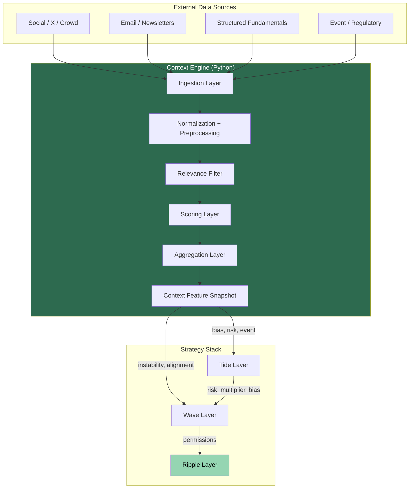
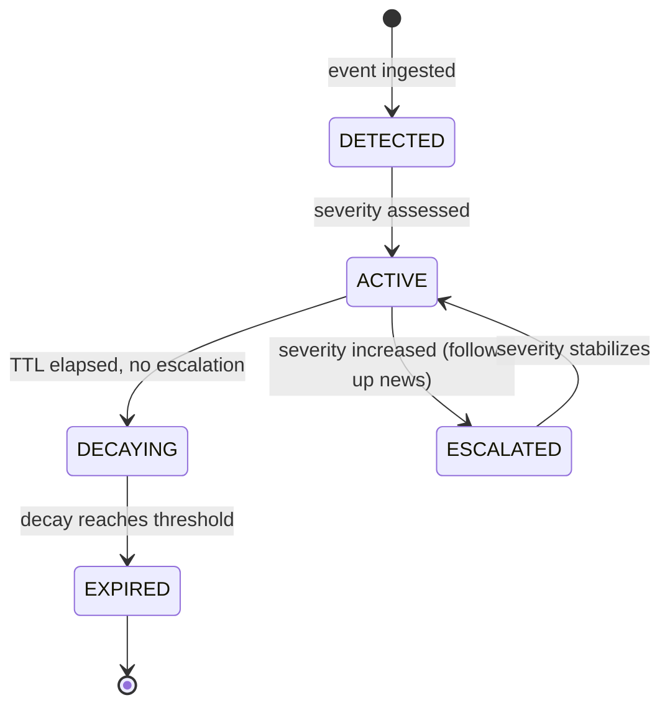
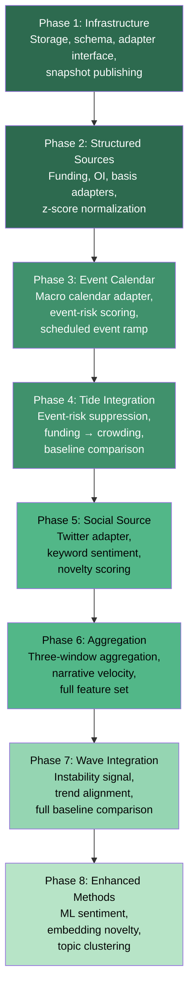

# Context Engine — Alternative and Unstructured Data Integration

## 1. Overview

The Context Engine is an auxiliary subsystem that ingests, transforms, and scores alternative and unstructured data sources — social sentiment, editorial commentary, structured fundamentals, and event-risk signals — into slow-moving, interpretable features consumed primarily by the Tide and Wave layers of the Tide / Wave / Ripple strategy.

It is **not** an execution engine. It does not trigger trades, manage positions, or interact with the order book. It is a **feature producer** that enriches the macro-bias and regime-classification layers with information that price and order flow alone cannot capture.

**Canonical strategy architecture** (from `strategy.md` §5):

| Layer | Horizon | Primary Inputs | Context Engine Role |
|---|---|---|---|
| **Tide** | Hours to days | L1 prices, macro, funding, volatility | **Primary consumer** — bias adjustment, risk suppression, event-risk flags |
| **Wave** | Minutes to hours | L1 prices, cross-asset features | **Selective consumer** — instability signals, narrative divergence |
| **Ripple** | Seconds to minutes | Binance L2, trades, CVD, VP | **Indirect only** — risk suppression via Tide, not direct feature input (see §12) |

**Source-of-truth hierarchy:**

| Priority | Document | Role |
|---|---|---|
| 1 | `strategy.md` | Canonical strategy design |
| 2 | `implementation_plan.md` | Build plan |
| 3 | Tests | Executable specification |
| 4 | `AGENT_STRATEGY_RULES.md` | Operational rules |
| 5 | `rl_extension.md` | RL extension design |
| 6 | This document (`context_engine.md`) | Context Engine design |

**Rule:** Context features are inputs to Tide and Wave, subject to the same architectural constraints as any other feature. They do not override risk rules (`strategy.md` §15), kill switches, or the deterministic execution logic in Ripple (`strategy.md` §9).

---

## 2. Dependencies on strategy.md

This document depends on the following `strategy.md` sections. Any change to these sections may require updates here.

| strategy.md Section | What This Document Depends On |
|---|---|
| §5 (Architecture) | Layer boundaries, information flow direction, cadence hierarchy. Context feeds Tide/Wave only; no direct Ripple feed. |
| §7 (Tide Layer) | Tide's bias computation, risk multiplier, ES budget — where context features are consumed |
| §7.5 (V1 Pre-Phase Defaults) | Default Tide/Wave snapshots used when layers or Context Engine are not yet implemented |
| §8 (Wave Layer) | Wave's regime classification and inputs — where context instability features are consumed |
| §10 (Liquidity Map) | Understanding of what Ripple already observes (no need to duplicate via context) |
| §13 (Exit Taxonomy) | Exit types — context never overrides exit logic |
| §15 (Risk Budgeting) | ES throttle — context can suppress risk multiplier but never increase it |
| §16 (Feature Schema) | Canonical feature namespaces (`tide.*`, `wave.*`, `ripple.*`, `risk.*`) — context features extend this schema |
| §17 (Data Contracts) | Struct definitions for snapshots — context publishes a new `ContextSnapshot` struct |
| §18 (Permissions Matrix) | `PermissionSet` and `PermissionLevel` enum — context influences permissions indirectly through Tide/Wave |
| §22 (V1 Boundaries) | Single symbol, max 1 trade, event-time only |
| §27 (Configuration) | Parameter namespaces — context config must not conflict with existing namespaces |
| §29 (Enum Reference) | Canonical enum names used when referencing layer outputs |

**Cross-reference to `rl_extension.md`:** The RL extension's state vector (§11 of `rl_extension.md`) does not include context features directly. Context influences RL indirectly through Tide/Wave snapshots. If context features are ever added to the RL state vector, both documents must be updated in sync.

---

## 3. Implementation Order Constraints

The Context Engine has strict ordering dependencies on the main strategy implementation phases defined in `implementation_plan.md`:

| Context Engine Phase | Requires Strategy Phase | Rationale |
|---|---|---|
| Phase 1 (Infrastructure) | Strategy Phase 1 complete (schemas, data contracts exist) | Context snapshot struct must conform to the canonical schema framework |
| Phases 2-3 (Structured sources, event calendar) | Strategy Phase 1 complete | Structured data features reference the canonical feature schema |
| Phase 4 (Tide integration) | Strategy Phase 4 complete (`TideEngine` exists) | Context features feed into Tide's bias and risk multiplier computation |
| Phases 5-6 (Social source, aggregation) | Strategy Phase 4 complete | Full aggregation features are consumed by Tide |
| Phase 7 (Wave integration) | Strategy Phase 5 complete (`WaveEngine` exists) | Context instability features feed into Wave's regime classification |
| Phase 8 (Enhanced methods) | Context Phase 7 validated | ML methods layer on top of validated rule-based pipeline |

**Hard rule:** The Context Engine is a **post-V1 enhancement**. The strategy's V1 deterministic baseline (`implementation_plan.md` Phases 1-6) must be complete and validated before Context Engine integration begins. The strategy must operate correctly without any context features, using neutral defaults for all `context.*` values. This is consistent with `strategy.md` §7.5 (pre-phase defaults) and the degradation-safe design principle.

**Relationship to RL extension:** The Context Engine and the RL extension (`rl_extension.md`) are independent extensions. Neither depends on the other. Both depend on the V1 deterministic baseline. They can be developed in parallel after Phase 6.

---

## 4. Role of the Context Engine in the Strategy Stack



**Key design points:**

1. The Context Engine runs **asynchronously** from the Ripple hot path. It publishes snapshots at Tide/Wave cadence (minutes), not per-event. This is consistent with the cadence hierarchy in `strategy.md` §5.3: Tide updates at 60,000ms minimum, Wave at 5,000ms.
2. Context features are **additive inputs** to Tide and Wave decision functions. They are combined with existing price-derived features, not substituted for them.
3. If the Context Engine is unavailable, the strategy operates normally using price-derived features only. Context is a **degradation-safe** enhancement. This aligns with `strategy.md` §7.5 (pre-phase defaults): the Tide and Wave layers must function with their default snapshots.
4. All context features pass through the same feature schema infrastructure as every other feature (`strategy.md` §16). Context features extend the schema with a new `context.*` namespace.

---

## 5. Data Source Categories

### 5.1 Social / Fast Narrative

| Source | Examples | Signal Extracted | Time Horizon | Primary Consumer | Noise Profile |
|---|---|---|---|---|---|
| Twitter / X | Crypto Twitter, fintwit | Crowd sentiment, panic/euphoria, narrative velocity | Minutes to hours | Tide, Wave | Very high — dominated by noise, bots, engagement farming |
| Reddit / forums | r/cryptocurrency, r/bitcoin | Crowd positioning, retail sentiment shift | Hours to days | Tide | High — slow-moving, often lagging |
| Telegram / Discord | Trading groups, project channels | Event awareness, pump signals | Minutes | Tide (event-risk only) | Extremely high — requires heavy filtering |

**What is valuable:** Not the sentiment polarity itself, but the **rate of change** of narrative (velocity), the **novelty** of topics entering discourse, and the **degree of consensus** vs. divergence across sources. A sudden spike in discussion volume about a previously quiet topic is more informative than the average positivity of BTC tweets.

**What is not valuable:** Aggregate positive/negative sentiment scores that are stable and slow-moving. These are dominated by base-rate noise and offer minimal edge at Tide cadence (`strategy.md` §5.3: 60,000ms update interval).

### 5.2 Editorial / Commentary

| Source | Examples | Signal Extracted | Time Horizon | Primary Consumer | Noise Profile |
|---|---|---|---|---|---|
| Finance newsletters | Emailed market commentary, research notes | Institutional narrative, risk framing, macro view | Hours to days | Tide | Low — curated, but infrequent and potentially stale |
| Broker research | Sell-side notes, strategy pieces | Positioning narratives, flow expectations | Days | Tide | Low-medium — filtered by source quality |
| Macro commentary | Central bank commentary, macro blogs | Rate expectations, risk-on/off framing | Days to weeks | Tide | Low — slow-moving, well-parsed |

**What is valuable:** Narrative framing shifts (e.g., "risk-off" language increasing in previously bullish sources), source disagreement (some commentators turning cautious while others remain bullish), and explicit event flags (e.g., "FOMC risk elevated this week").

**What is not valuable:** Stale commentary that repeats known information. The Context Engine must distinguish **novel** commentary from repeated takes.

### 5.3 Structured Fundamentals / Market Structure Data

| Source | Examples | Signal Extracted | Time Horizon | Primary Consumer | Noise Profile |
|---|---|---|---|---|---|
| Funding rates | Binance perpetual funding | Crowded positioning, squeeze risk | 8h (Binance cadence) | Tide | Low — direct observable |
| Basis | Spot-futures spread | Cash-carry, directional pressure | Minutes to hours | Tide | Low |
| Open interest | Aggregate OI, OI delta | Leverage buildup, liquidation risk | Minutes | Tide | Low-medium |
| Stablecoin flows | USDT/USDC supply, exchange inflows | Capital rotation, risk appetite | Hours to days | Tide | Medium — noisy, lagged on-chain |
| ETF flows | BTC ETF inflows/outflows (if available) | Institutional sentiment | Daily | Tide | Low — clean signal, daily cadence |
| On-chain metrics | Exchange reserves, whale movements | Structural supply/demand | Hours to days | Tide (later) | Medium-high — requires chain-specific logic |

**What is valuable:** These are direct observables with clear economic interpretation. Funding rate extremes indicate crowded positioning. OI spikes indicate leverage buildup. Basis collapse may precede liquidation cascades.

**What is not valuable:** Raw chain metrics without economic context. Transaction counts and hash rates are not directly useful for Tide-scale bias decisions.

**Note on overlap with `strategy.md` §16.1:** The features `tide.funding_rate` and `tide.oi_change_pct` are already defined in the canonical feature schema. The Context Engine z-scores these into `context.funding_zscore` and `context.oi_change_zscore` respectively, providing a normalized view. The raw values remain in the `tide.*` namespace per `strategy.md` §16.1; the Context Engine produces derived z-scored variants in the `context.*` namespace.

### 5.4 Event / Operational Risk

| Source | Examples | Signal Extracted | Time Horizon | Primary Consumer | Noise Profile |
|---|---|---|---|---|---|
| Exchange status pages | Binance incidents, maintenance | Execution risk, liquidity risk | Minutes | Tide (risk suppression) | Low — direct observable |
| Regulatory headlines | SEC actions, bans, approvals | Tail risk, regime change | Hours to days | Tide, Wave | Medium — requires relevance filtering |
| Token events | Unlocks, listings, delistings, hard forks | Event-specific risk | Hours to days | Tide (per-asset risk) | Low — scheduled events are known |
| Macro events | FOMC, CPI releases, employment data | Volatility spike risk | Hours (around event) | Tide | Low — calendar-driven |

**What is valuable:** Binary event-risk flags (FOMC in 2 hours → suppress risk), exchange operational status (Binance degraded → tighten), and scheduled liquidity events (large unlock in 24h → reduce position limits for that asset).

**What is not valuable:** Attempting to predict the direction of regulatory action or macro releases. The Context Engine should flag **risk**, not predict **outcome**.

---

## 6. Ingestion Layer

### 6.1 Responsibilities

The ingestion layer is responsible for:

1. Connecting to external data sources (APIs, email, RSS, webhooks, scrapers).
2. Receiving raw data items (tweets, articles, data points, alerts).
3. Assigning a monotonic arrival timestamp.
4. Deduplicating items (same content from multiple sources).
5. Persisting raw items to a durable store for replay and audit.
6. Passing items to the normalization layer.

### 6.2 Source Adapters

Each data source has a dedicated adapter. Adapters are Python classes with a common interface:

```python
class SourceAdapter(ABC):
    @abstractmethod
    def connect(self) -> None: ...

    @abstractmethod
    def poll(self) -> list[RawContextItem]: ...

    @abstractmethod
    def is_healthy(self) -> bool: ...

    @abstractmethod
    def source_id(self) -> str: ...
```

Planned adapters:

| Adapter | Source | Protocol | Cadence |
|---|---|---|---|
| `TwitterAdapter` | Twitter/X API v2 | REST / Streaming | Seconds (streaming) or 60s (polling) |
| `EmailAdapter` | IMAP inbox (newsletters) | IMAP poll | 300s |
| `BinanceFundingAdapter` | Binance Futures API | REST | 8h (funding) or 60s (OI) |
| `ExchangeStatusAdapter` | Binance status page / API | REST / webhook | 60s |
| `RegulatoryFeedAdapter` | RSS / curated feed | RSS poll | 300s |
| `MacroCalendarAdapter` | Economic calendar API | REST | Daily |
| `ManualEventAdapter` | Operator-entered events | Local file / API | On-demand |

### 6.3 Raw Context Item Schema

| Field | Type | Description |
|---|---|---|
| `item_id` | string | Unique identifier (hash of source_id + content + timestamp) |
| `source_id` | string | Adapter identifier (e.g., `twitter`, `email_newsletter`, `binance_funding`) |
| `source_category` | enum | `SOCIAL`, `EDITORIAL`, `STRUCTURED`, `EVENT` |
| `arrival_ts` | int64 | Monotonic arrival timestamp (ms) |
| `origin_ts` | int64 | Source-reported timestamp (ms), if available |
| `content_type` | enum | `TEXT`, `NUMERIC`, `EVENT_FLAG`, `STATUS` |
| `text` | string | Raw text content (if TEXT) |
| `numeric_value` | float64 | Numeric value (if NUMERIC, e.g., funding rate) |
| `metadata` | map | Source-specific metadata (author, follower count, asset tags, etc.) |

### 6.4 Storage

Raw items are persisted to an append-only store (SQLite file, Parquet partitions, or HDF5 group) with the following properties:
- Append-only: items are never modified after ingestion.
- Timestamped: queryable by arrival_ts range.
- Replayable: the same sequence of items can be replayed deterministically for backtest. This is consistent with the replay determinism requirement in `strategy.md` §22.1.
- Bounded: old items are archived after a configurable retention period (default: 90 days).

---

## 7. Normalization and Preprocessing

### 7.1 Text Normalization

For `TEXT` content items:

1. **Language detection:** Discard non-English items (V1 is English-only).
2. **Deduplication:** Fuzzy hash (e.g., SimHash) to detect near-duplicate content across sources.
3. **Truncation:** Limit text length to 1024 characters. Longer items are truncated with a flag.
4. **Entity extraction:** Extract asset mentions (BTC, ETH, SOL, etc.), venue mentions (Binance, Coinbase), and event types (FOMC, CPI, hack, exploit, unlock).
5. **Source quality tagging:** Assign a source quality score based on a whitelist/blacklist and historical accuracy (see §8).

### 7.2 Numeric Normalization

For `NUMERIC` content items (funding, OI, basis, flows):

1. **Z-score against rolling history:** Each numeric source is z-scored against its own rolling mean and standard deviation, computed over a configurable window (default: 7 days).
2. **Outlier clipping:** Z-scores are clipped to $ [-4, 4] $.
3. **Missing data:** If a source has not produced a value within its expected cadence x 3, the value is marked as `NaN` and excluded from aggregation. The feature defaults to 0.0 (neutral). This aligns with the degradation-safe design: missing context features default to neutral values (see §11.3).

### 7.3 Event Normalization

For `EVENT_FLAG` and `STATUS` items:

1. **Categorization:** Map to one of: `EXCHANGE_INCIDENT`, `REGULATORY`, `TOKEN_EVENT`, `MACRO_EVENT`, `OPERATIONAL`.
2. **Severity:** Assign a severity score in {0.0, 0.25, 0.5, 0.75, 1.0} based on heuristic rules or source-provided severity.
3. **Expiry:** Each event has a time-to-live (TTL). After TTL, the event's contribution decays exponentially.

---

## 8. Relevance Filtering

Not all ingested items are relevant to the strategy. The relevance filter gates which items proceed to scoring.

### 8.1 Source Quality Scoring

Each source is assigned a static quality score $ q_s \in [0, 1] $, maintained in a configuration file:

| Source Type | Quality Score Range | Rationale |
|---|---|---|
| Curated newsletter / research | 0.7 - 1.0 | Low noise, informed, edited |
| Exchange status API | 0.9 - 1.0 | Direct observable |
| Macro calendar | 0.9 - 1.0 | Scheduled, factual |
| Verified crypto analysts (whitelisted) | 0.5 - 0.8 | Informed but opinionated |
| General crypto Twitter | 0.1 - 0.3 | Extremely noisy |
| Unverified Telegram / Discord | 0.0 - 0.1 | Noise-dominated |
| Structured market data (funding, OI) | 1.0 | Direct observable, no interpretation needed |

Items from sources with $ q_s < q_{\min} $ (configurable, default 0.1) are discarded before scoring.

### 8.2 Entity Relevance

Items must mention at least one entity relevant to the current trading universe. In V1 (single-symbol, e.g., BTC-USDT per `strategy.md` §22.1):
- Items mentioning BTC, Bitcoin, or crypto-wide topics are relevant.
- Items mentioning only ETH, SOL, or other specific assets are tagged `low_relevance` and down-weighted.
- Items with no detectable asset or market reference are discarded.

### 8.3 Staleness Filter

Items older than the configured freshness window (default: 60 minutes for social, 24 hours for editorial, 7 days for structured) are excluded from the active scoring window.

---

## 9. Scoring Layer

### 9.1 Scoring Philosophy

Simple positive/negative sentiment is **not sufficient** for trading. The scoring layer must extract multiple orthogonal dimensions from each item, because the strategy's value comes from understanding **what kind** of information is in the market, not just whether it is "good" or "bad."

The most valuable dimensions for a trading strategy are:

| Dimension | Why It Matters |
|---|---|
| **Novelty** | New information moves markets. Repeated information does not. A topic that suddenly appears in discourse is more actionable than a topic discussed for weeks. |
| **Relevance** | An item about BTC regulation matters more to BTC-USDT than an item about a DeFi protocol hack. |
| **Event risk** | A regulatory action, exchange outage, or macro release creates tail risk independent of sentiment. |
| **Narrative velocity** | The rate of change of crowd narrative signals transition points. Accelerating bearish narrative after a period of calm is different from persistent bearish noise. |
| **Source consensus** | When diverse sources converge on a view, it signals crowding. When they diverge, it signals uncertainty. Both are informative. |
| **Crowding** | Extreme one-sided positioning (detectable via funding, OI, and social unanimity) signals squeeze risk. |

### 9.2 Per-Item Scoring

Each item that passes relevance filtering receives a score vector:

| Score | Range | Computation (V1) | Later |
|---|---|---|---|
| `sentiment_polarity` | $ [-1, 1] $ | Keyword rules + simple classifier | LLM-assisted |
| `relevance` | $ [0, 1] $ | Entity match strength x source quality | Learned relevance model |
| `novelty` | $ [0, 1] $ | 1 - cosine similarity to recent item embeddings (SimHash or TF-IDF) | Embedding-based novelty |
| `urgency` | $ [0, 1] $ | Heuristic: presence of urgency keywords x event category | Event-type classifier |
| `event_risk` | $ [0, 1] $ | Rule-based: keyword/category match for known risk events | Structured event model |
| `source_quality` | $ [0, 1] $ | From source quality config (§8.1) | Adaptive quality scoring |
| `scope` | enum | Rule-based entity extraction: `BTC`, `ETH`, `CRYPTO`, `MACRO`, `EXCHANGE` | NER-based |

### 9.3 V1 Scoring Methods

V1 of the Context Engine uses simple, interpretable, rule-based methods. (Note: "V1 of the Context Engine" is distinct from the strategy's V1 deterministic baseline. See §3 for ordering constraints.)

**Sentiment polarity:**
- Keyword dictionary with positive and negative word lists curated for crypto/finance.
- Score = (positive keyword count - negative keyword count) / total keyword count.
- Clipped to $ [-1, 1] $.

**Novelty:**
- Maintain a rolling buffer of SimHash fingerprints for the last N items (N = 1000).
- Novelty = 1 - (max Jaccard similarity to any item in the buffer).
- Items with novelty < 0.2 are effectively duplicates.

**Event risk:**
- Pattern matching against a curated list of event-risk patterns:
  - `"SEC"`, `"CFTC"`, `"ban"`, `"hack"`, `"exploit"`, `"FOMC"`, `"CPI"`, `"unlock"`, `"delist"`, `"maintenance"`, `"outage"`, `"liquidat"`
- If matched, event_risk = severity (from pattern config) x source_quality.

**Urgency:**
- Presence of urgency markers: `"breaking"`, `"just in"`, `"alert"`, `"emergency"`, `"halted"`.
- Urgency = 1.0 if matched, 0.0 otherwise.

### 9.4 Later Scoring Methods (Do Not Implement Yet)

| Method | Purpose | When |
|---|---|---|
| LLM-assisted classification | Replace keyword sentiment with instruction-tuned LLM scoring | After Context Engine V1 validated |
| Embedding-based novelty | Use sentence embeddings (e.g., all-MiniLM) for novelty detection | After Context Engine V1 validated |
| Entity-relation extraction | Structured extraction of "who did what to which asset" | V2+ |
| Topic clustering | Detect emerging topic clusters in social streams | V2+ |
| Source-adaptive quality | Learn source quality from historical accuracy | V2+ |

---

## 10. Aggregation Layer

### 10.1 Purpose

Individual item scores are noisy. The aggregation layer combines per-item scores into stable, slow-moving context features suitable for Tide and Wave consumption.

### 10.2 Aggregation Windows

| Window | Duration | Purpose |
|---|---|---|
| Fast | 15 minutes | Detect sudden narrative shifts, event spikes |
| Medium | 2 hours | Capture developing trends, building consensus |
| Slow | 24 hours | Baseline context, structural sentiment |

### 10.3 Aggregation Methods

For each scoring dimension, aggregate across all items in the window:

**Weighted mean (for polarity, relevance):**

$$
\bar{x}_w = \frac{\sum_{i \in W} q_i \cdot r_i \cdot x_i}{\sum_{i \in W} q_i \cdot r_i + \epsilon}
$$

where $ q_i $ is source quality, $ r_i $ is relevance, $ x_i $ is the score, and $ \epsilon = 10^{-8} $.

**Maximum (for event risk, urgency):**

$$
x_w^{\max} = \max_{i \in W} (x_i \cdot q_i)
$$

Event risk uses max because a single high-risk event dominates.

**Velocity (for narrative velocity):**

$$
v_w = \frac{\bar{x}_{\text{fast}} - \bar{x}_{\text{slow}}}{\sigma_{\text{slow}} + \epsilon}
$$

Narrative velocity is the z-scored difference between fast and slow sentiment. A large positive $ v_w $ means sentiment is becoming more positive faster than its baseline; a large negative $ v_w $ means the opposite.

**Dispersion (for source consensus):**

$$
d_w = \sqrt{\frac{\sum_{i \in W} q_i \cdot (x_i - \bar{x}_w)^2}{\sum_{i \in W} q_i + \epsilon}}
$$

High dispersion means sources disagree. Low dispersion means consensus (which may signal crowding).

**Item count / volume (for crowding):**

$$
n_w = \frac{|W_{\text{fast}}|}{|W_{\text{slow}}| / k + \epsilon}
$$

where $ k $ = ratio of slow window duration to fast window duration. A value > 1 indicates above-baseline activity volume.

### 10.4 Decay

Items within a window are weighted by exponential decay from their arrival time:

$$
w_i^{\text{decay}} = \exp\left(-\frac{t_{\text{now}} - t_i}{\tau}\right)
$$

where $ \tau $ is the decay half-life (configurable per window: fast = 5 min, medium = 30 min, slow = 6 hours).

---

## 11. Feature Outputs

### 11.1 Context Feature Namespace

All context features use the `context.*` namespace. This is a new namespace that extends the canonical feature schema defined in `strategy.md` §16. It follows the same naming conventions: `namespace.feature_name`, all lowercase with underscores, types and cadences documented.

Context features are published as a `ContextSnapshot` at Tide cadence (default: 60s, matching the Tide update interval in `strategy.md` §5.3).

| Feature | Type | Range | Description |
|---|---|---|---|
| `context.sentiment_market` | float64 | $ [-1, 1] $ | Overall market sentiment (slow window) |
| `context.sentiment_crypto` | float64 | $ [-1, 1] $ | Crypto-specific sentiment (slow window) |
| `context.sentiment_btc` | float64 | $ [-1, 1] $ | BTC-specific sentiment (slow window) |
| `context.sentiment_eth` | float64 | $ [-1, 1] $ | ETH-specific sentiment (slow window) |
| `context.sentiment_macro` | float64 | $ [-1, 1] $ | Macro sentiment (slow window) |
| `context.novelty_score` | float64 | $ [0, 1] $ | Aggregate novelty across recent items |
| `context.event_risk_score` | float64 | $ [0, 1] $ | Max event risk across active items |
| `context.narrative_velocity` | float64 | $ [-4, 4] $ | Z-scored fast-vs-slow sentiment shift |
| `context.source_consensus` | float64 | $ [0, 1] $ | 1 - normalized dispersion (1 = full agreement) |
| `context.source_dispersion` | float64 | $ [0, 1] $ | Normalized dispersion (1 = full disagreement) |
| `context.relevance_btc` | float64 | $ [0, 1] $ | Fraction of recent items mentioning BTC |
| `context.relevance_eth` | float64 | $ [0, 1] $ | Fraction mentioning ETH |
| `context.relevance_crypto` | float64 | $ [0, 1] $ | Fraction mentioning crypto generally |
| `context.relevance_macro` | float64 | $ [0, 1] $ | Fraction mentioning macro topics |
| `context.exchange_risk_score` | float64 | $ [0, 1] $ | Exchange operational risk (from status data) |
| `context.regulatory_risk_score` | float64 | $ [0, 1] $ | Regulatory event risk |
| `context.crowding_score` | float64 | $ [0, 1] $ | Crowd unanimity x volume anomaly |
| `context.activity_volume_ratio` | float64 | $ [0, \infty) $ | Fast-window item count / baseline |
| `context.funding_zscore` | float64 | $ [-4, 4] $ | Z-scored funding rate (derived from `tide.funding_rate` per `strategy.md` §16.1) |
| `context.oi_change_zscore` | float64 | $ [-4, 4] $ | Z-scored OI change (derived from `tide.oi_change_pct` per `strategy.md` §16.1) |
| `context.basis_zscore` | float64 | $ [-4, 4] $ | Z-scored spot-futures basis |
| `context.update_ts` | int64 | — | Timestamp of last context snapshot |
| `context.source_count` | int32 | — | Number of active sources contributing |

### 11.2 Strategy-Layer Mapped Features

Context features are further mapped into Tide and Wave namespaces by the strategy integration layer (not by the Context Engine itself). These mapped features extend the canonical feature schema in `strategy.md` §16.1 and §16.2 once the Context Engine is integrated:

| Mapped Feature | Computation | Consumer | Extends |
|---|---|---|---|
| `tide.context_bias_score` | Weighted combination of `context.sentiment_btc`, `context.narrative_velocity`, `context.funding_zscore` | Tide bias adjustment (`strategy.md` §7) | `strategy.md` §16.1 |
| `tide.context_event_risk` | max(`context.event_risk_score`, `context.exchange_risk_score`, `context.regulatory_risk_score`) | Tide risk suppression (`strategy.md` §7, §15) | `strategy.md` §16.1 |
| `tide.context_crowding` | `context.crowding_score` x `context.funding_zscore` sign alignment | Tide squeeze awareness | `strategy.md` §16.1 |
| `wave.context_instability` | `context.activity_volume_ratio` x `context.source_dispersion` | Wave `BREAKDOWN` probability boost (`strategy.md` §8) | `strategy.md` §16.2 |
| `wave.context_trend_alignment` | Sign agreement between `context.narrative_velocity` and `wave.trend_efficiency` direction (from `strategy.md` §16.2) | Wave trend continuation confidence | `strategy.md` §16.2 |
| `wave.context_sentiment_dispersion` | `context.source_dispersion` | Wave regime uncertainty input | `strategy.md` §16.2 |

**Important:** These mapped features do not exist in the current `strategy.md` §16 schema. They will be added to the canonical feature schema when the Context Engine is integrated. Until then, the strategy operates without them, using the pre-phase defaults from `strategy.md` §7.5.

### 11.3 Feature Properties

All context features must be:

- **Slow-moving:** Updated at Tide cadence (60s minimum, per `strategy.md` §5.3). No per-event updates.
- **Normalized:** Bounded or z-scored to known ranges. No raw counts or unbounded values in the feature vector.
- **Interpretable:** Each feature has a clear natural-language explanation of what it measures and what high/low values mean.
- **Defaultable:** If the Context Engine is unavailable, every feature has a neutral default (0.0 for signed features, 0.5 for [0,1] scores, NaN for indicators that should be ignored). This ensures the strategy operates identically to its pre-context baseline, consistent with `strategy.md` §7.5 (pre-phase defaults) and `strategy.md` §28.4 (keeping deterministic baseline).
- **Versioned:** The feature schema has a version number. Schema changes require version bumps and migration. This follows the same schema discipline as `strategy.md` §16.
- **Reproducible:** Given the same stored raw items and the same configuration, the features are identical. This supports the replay determinism requirement in `strategy.md` §22.1.

---

## 12. How Context Features Feed Tide

### 12.1 Directional Bias Adjustment

Tide's directional bias (`TideBias` enum: `LONG` / `SHORT` / `NEUTRAL`, per `strategy.md` §29.1) is currently determined by price-derived features (crypto beta return, trend efficiency, volatility regime — see `strategy.md` §7.4). Context adds a supplementary signal:

```
function adjust_tide_bias(base_bias, context, config):
    context_signal = (
        config.context.w_sentiment * context.sentiment_btc
        + config.context.w_velocity * tanh(context.narrative_velocity / 2)
        + config.context.w_funding * tanh(context.funding_zscore / 2)
    )

    if context.event_risk_score > config.context.event_risk_suppress_threshold:
        return NEUTRAL  # suppress bias during event risk

    if abs(context_signal) > config.context.bias_override_threshold:
        if sign(context_signal) != sign(base_bias):
            return NEUTRAL  # context contradicts price; reduce conviction
        else:
            return base_bias  # context confirms price; maintain bias

    return base_bias  # context too weak to influence
```

**Key principle:** Context never changes bias from `NEUTRAL` to directional on its own. It can only confirm, weaken, or suppress price-derived bias. This is consistent with the top-down information flow in `strategy.md` §5.2: Tide sets bias based on its own features; context is an input to those features, not an override.

### 12.2 Risk Multiplier Adjustment

Context can reduce the Tide `risk_multiplier` (see `strategy.md` §7.7 and §16.1) when event risk or crowding is elevated:

```
function adjust_risk_multiplier(base_mult, context, config):
    if context.event_risk_score > config.context.event_risk_high:
        return base_mult * config.context.event_risk_mult_factor  # e.g., 0.25

    if context.event_risk_score > config.context.event_risk_medium:
        return base_mult * config.context.event_risk_mult_factor_medium  # e.g., 0.5

    if context.crowding_score > config.context.crowding_suppress_threshold:
        return base_mult * config.context.crowding_mult_factor  # e.g., 0.6

    return base_mult  # no context-based suppression
```

**Key principle:** Context can reduce risk but never increase it beyond the price-derived baseline. This is asymmetric by design — the Context Engine is better at identifying danger than identifying opportunity. This preserves the constraint from `strategy.md` §15: risk budget is allocated top-down and can only be consumed or throttled, never expanded by downstream components.

### 12.3 Event-Risk Suppression

When `context.event_risk_score` exceeds a threshold, Tide can:
1. Reduce `risk_multiplier` to a configured floor (see `strategy.md` §27.1: `risk_multiplier_default`).
2. Set `TideBias` to `NEUTRAL` (suppress directional bets during uncertainty).
3. Tighten position limits (reduce effective `tide.max_position_usd` per `strategy.md` §16.1).

This is the highest-value context integration: preventing the strategy from being fully exposed when a known tail-risk event is imminent or unfolding.

### 12.4 Crowding / Squeeze Awareness

When social unanimity is extreme and funding is extended in the same direction, the strategy is at risk of a squeeze. Context feeds this into Tide's bias computation:

- If crowd is overwhelmingly bullish AND `context.funding_zscore` is highly positive → cautious about `LONG` bias.
- If crowd is overwhelmingly bearish AND `context.funding_zscore` is highly negative → cautious about `SHORT` bias.

This does not predict squeezes; it reduces exposure when squeeze conditions are elevated. The funding rate z-score is derived from the `tide.funding_rate` feature in `strategy.md` §16.1.

---

## 13. How Context Features Feed Wave

### 13.1 Instability Detection

Wave's `BREAKDOWN` regime (`WaveRegime.BREAKDOWN` per `strategy.md` §29.1) is currently detected via high dispersion, unstable correlations, and elevated absorption ratio (see `strategy.md` §8.5). Context adds:

- High `context.activity_volume_ratio` (social chatter spike) combined with high `context.source_dispersion` (disagreement) → boost `BREAKDOWN` probability.
- Sudden `context.narrative_velocity` reversal → boost regime transition probability.

### 13.2 Trend Continuation Confidence

When Wave identifies a `BREAKOUT` regime (`WaveRegime.BREAKOUT` per `strategy.md` §29.1), context can confirm or weaken confidence:

- If `context.narrative_velocity` aligns with the breakout direction → maintain permissions.
- If `context.narrative_velocity` diverges (narrative turning against the breakout) → consider reducing permissions.

### 13.3 Sentiment Dispersion as Uncertainty

`context.source_dispersion` can inform Wave's confidence in its own regime classification:

- Low dispersion → sources agree → higher confidence in current `WaveRegime`.
- High dispersion → sources disagree → consider widening `NEUTRAL` probability or adding uncertainty.

### 13.4 What Wave Should Not Do with Context

- Wave should not change `WaveRegime` classification based on context alone. Context is an input to the classification function, not an override. This preserves the layer boundary from `strategy.md` §5.
- Wave should not use context to create new regime types (e.g., "sentiment regime"). The `WaveRegime` enum is canonical: `MEAN_REVERSION`, `BREAKOUT`, `BREAKDOWN`, `NEUTRAL` (per `strategy.md` §29.1). Context influences existing regimes.

---

## 14. Why Context Should Not Directly Drive Ripple

### 14.1 The Architecture Prohibits It

Ripple operates per-event at microsecond to millisecond timescales (`strategy.md` §5.3: per-event update cadence). Context features update at minute timescales. There is a fundamental cadence mismatch. The Ripple hot path must complete within the latency budget defined in `AGENT_STRATEGY_RULES.md` §9.2.

### 14.2 Context Is Not Microstructure Information

Order book imbalance (`ripple.imbalance`, `strategy.md` §16.3), microprice (`ripple.microprice`), CVD slope (`ripple.cvd_slope`), and wall quality scores (`ripple.best_bid_wall_quality`, `ripple.best_ask_wall_quality`) are direct observables of the current execution environment. Tweet sentiment is not. Mixing these information types at the same decision level creates an incoherent signal.

### 14.3 Indirect Influence Is Sufficient and Safer

Context already influences Ripple through the layer hierarchy defined in `strategy.md` §5.2:
- **Tide `risk_multiplier` reduction** → smaller Ripple positions (via `strategy.md` §14.4, Step 3).
- **Tide `TideBias` shift to `NEUTRAL`** → Wave reduces permissions (`strategy.md` §18) → Ripple enters fewer trades.
- **Event-risk suppression** → Ripple receives a restricted `PermissionSet` (per `strategy.md` §17.12).

These are the architecturally correct paths for context to affect execution.

### 14.4 Limited Exception: Event-Risk Permission Gate

The one acceptable direct interaction is a **binary event-risk gate** at the Ripple level:

```
function check_context_gate(context, config):
    if context.event_risk_score > config.context.ripple_gate_threshold:
        return PermissionLevel.DISABLED  # block all new setups
    return None  # context does not interfere; normal permissions apply
```

This is not a feature input — it is a safety gate. It prevents Ripple from opening new trades during extreme event risk, even if Tide and Wave have not yet updated. The return value uses the `PermissionLevel` enum from `strategy.md` §29.1.

**Configuration:**

| Parameter | Type | Default | Description |
|---|---|---|---|
| `context.ripple_gate_threshold` | float64 | 0.9 | Event risk above this blocks Ripple setups via `PermissionLevel.DISABLED` |

---

## 15. Event-Risk Handling

### 15.1 Event Categories

| Category | Examples | TTL | Severity Range |
|---|---|---|---|
| `EXCHANGE_INCIDENT` | API outage, withdrawal suspension, matching engine lag | 2 hours | 0.5 - 1.0 |
| `REGULATORY` | SEC enforcement, ban announcement, ETF decision | 24 hours | 0.25 - 1.0 |
| `TOKEN_EVENT` | Major unlock, listing, delisting, hard fork | 12 hours | 0.25 - 0.75 |
| `MACRO_EVENT` | FOMC announcement, CPI release, bank failure | 4 hours | 0.5 - 1.0 |
| `SECURITY` | Exchange hack, smart contract exploit, oracle manipulation | 12 hours | 0.75 - 1.0 |

### 15.2 Event Lifecycle



### 15.3 Event-Risk Score Computation

The aggregate event-risk score is the decayed maximum across all active events:

$$
\text{event\_risk} = \max_{e \in \text{active\_events}} \left( \text{severity}_e \cdot \exp\left(-\frac{t_{\text{now}} - t_e}{\tau_e}\right) \right)
$$

where $ \tau_e $ is the event's TTL-derived decay constant.

### 15.4 Scheduled Events

Known future events (FOMC, CPI, scheduled unlocks) are ingested via the `MacroCalendarAdapter` and `ManualEventAdapter`. They produce event-risk signals that ramp up as the event approaches:

$$
\text{pre\_event\_risk} = \text{severity} \cdot \sigma\!\left(\frac{t_{\text{event}} - t_{\text{now}}}{\tau_{\text{pre}}}\right)
$$

where $ \sigma(\cdot) $ is the logistic function and $ \tau_{\text{pre}} $ controls how far in advance the risk ramp begins (default: 2 hours).

---

## 16. Integration with Structured Data

### 16.1 Blending Philosophy

The Context Engine treats structured market data (funding, OI, basis, flows) and unstructured data (text, events) as complementary inputs to the same aggregation framework:

- Structured data provides **direct, low-noise observables** that anchor the context signal.
- Unstructured data provides **early warnings, narrative context, and event detection** that structured data cannot capture.
- When structured and unstructured signals agree, confidence is higher.
- When they disagree, the structured signal is weighted more heavily (it has lower noise).

### 16.2 Structured Features as Context Inputs

| Structured Source | Context Feature | How It Enters | Canonical Source Feature |
|---|---|---|---|
| Funding rate | `context.funding_zscore` | Z-scored against 7-day rolling history | `tide.funding_rate` (`strategy.md` §16.1) |
| Open interest | `context.oi_change_zscore` | Z-scored OI change | `tide.oi_change_pct` (`strategy.md` §16.1) |
| Basis | `context.basis_zscore` | Z-scored spot-futures spread | — (new structured source) |
| Stablecoin exchange flows | `context.stablecoin_flow_zscore` (later) | Z-scored inflow/outflow | — |
| ETF flows | `context.etf_flow_zscore` (later) | Z-scored daily flow | — |

### 16.3 Cross-Validation

The scoring layer can cross-validate structured and unstructured signals:

- **Funding extreme + social unanimity** → strong crowding signal.
- **OI spike + event-risk flag** → elevated liquidation risk.
- **Basis collapse + negative narrative velocity** → potential cascade.

These cross-validations are implemented as derived features in the aggregation layer, not as ad-hoc rules.

---

## 17. Candidate Models / Methods

### 17.1 V1: Simple, Robust, Interpretable

| Component | V1 Method | Complexity | Rationale |
|---|---|---|---|
| Sentiment polarity | Keyword dictionary (VADER-like, crypto-adapted) | Low | Fast, interpretable, no model dependency |
| Relevance | Entity keyword matching + source quality config | Low | Deterministic, auditable |
| Novelty | SimHash fingerprinting + Jaccard similarity | Low | Fast, no ML required |
| Event risk | Pattern matching against curated event keyword list | Low | Explainable, easy to maintain |
| Urgency | Urgency keyword detection | Low | Simple heuristic |
| Aggregation | Weighted rolling mean/max with exponential decay | Low | Standard, reproducible |
| Structured scoring | Z-score against rolling statistics | Low | Standard normalization |

**Why V1 is intentionally simple:** The goal is to produce useful, interpretable context features without introducing opaque model dependencies. If keyword-based sentiment with z-scored structured data improves Tide decisions measurably, then the infrastructure is proven and more sophisticated methods can be layered on.

### 17.2 V2: Enhanced Classification

| Component | V2 Method | Rationale |
|---|---|---|
| Sentiment polarity | Fine-tuned DistilBERT or similar small transformer | Better accuracy than keyword-based |
| Entity extraction | SpaCy NER with crypto-domain fine-tuning | Structured entity relations |
| Novelty | Sentence embeddings (all-MiniLM) + cosine distance | Semantic novelty, not just lexical |
| Topic clustering | BERTopic or HDBSCAN on embeddings | Detect emerging narratives |
| Source quality | Historical accuracy tracking + adaptive scoring | Learn which sources are predictive |

### 17.3 V3+: LLM-Assisted and Advanced

| Component | V3+ Method | Rationale |
|---|---|---|
| Multi-dimensional scoring | Instruction-tuned LLM (local or API) with structured output | Rich, nuanced scoring |
| Event extraction | LLM-based event parsing with structured JSON output | Complex event understanding |
| Cross-source synthesis | LLM-generated narrative summaries for operator review | Human-in-the-loop context |
| On-chain integration | Chain-specific parsers + flow models | Whale tracking, exchange flow |

---

## 18. Validation and Testing

### 18.1 Unit Tests

| Test | Description |
|---|---|
| Source adapter connectivity | Each adapter can connect, poll, and return valid items |
| Deduplication | Near-duplicate items are correctly identified |
| Entity extraction | Known text → correct entity tags |
| Sentiment polarity | Known positive/negative texts → correct polarity sign |
| Novelty scoring | Duplicate text → novelty approximately 0; unique text → novelty > 0.5 |
| Event-risk pattern matching | Known event text → correct severity |
| Z-score normalization | Known numeric series → correct z-scores |
| Aggregation math | Known item set → correct weighted mean, max, velocity, dispersion |
| Decay computation | Items decay correctly over time |
| Missing data handling | Missing source → feature defaults to neutral value |

### 18.2 Integration Tests

| Test | Description |
|---|---|
| End-to-end pipeline | Ingest → normalize → filter → score → aggregate → snapshot |
| Feature snapshot format | Snapshot matches `ContextSnapshot` schema (cf. `strategy.md` §17 data contract conventions) |
| Tide consumption | Tide correctly reads context features and adjusts `TideBias` and `risk_multiplier` (cf. `strategy.md` §7, §16.1) |
| Wave consumption | Wave correctly reads context features and adjusts `WaveRegime` inputs (cf. `strategy.md` §8, §16.2) |
| Ripple gate | Ripple correctly blocks setups when event risk exceeds gate threshold (returns `PermissionLevel.DISABLED` per `strategy.md` §29.1) |

### 18.3 Backtest / Replay Consistency

| Test | Description |
|---|---|
| Deterministic replay | Same stored items + same config → same context features (consistent with `strategy.md` §22.1 replay determinism) |
| Snapshot alignment | Context snapshots align with event-time clock used by strategy (`strategy.md` §5.3) |
| No future leakage | Context features at time $ t $ use only items with arrival_ts <= $ t $ (consistent with `strategy.md` §28.3) |
| Mode consistency | Features identical across backtest, optimise, and live modes for same data |

### 18.4 Validation Against No-Context Baseline

The critical validation question: **Does context actually help?**

| Metric | How to Measure |
|---|---|
| Tide bias accuracy | Compare `TideBias` with/without context against subsequent price direction over Tide horizon |
| Risk multiplier timing | Compare risk suppression events with/without context against subsequent drawdown events |
| Event-risk value | Count instances where context-driven risk suppression prevented exposure to tail events |
| Sharpe ratio delta | Backtest Sharpe with context vs. without context over extended historical period |
| Drawdown delta | Maximum drawdown with context vs. without |
| False positive rate | Fraction of risk suppressions that were unnecessary (price moved favorably despite context alarm) |

**Rule:** If context does not improve at least one of Sharpe, max drawdown, or tail-event avoidance on out-of-sample data after 3 months of operation, either recalibrate or disable. The strategy must always be able to revert to its no-context baseline (per `strategy.md` §28.4: keeping deterministic baseline).

### 18.5 Drift and Stability Monitoring

| Monitor | What to Watch |
|---|---|
| Feature distribution drift | Z-scored features should have mean approximately 0, std approximately 1 over rolling windows. Drift indicates stale normalization. |
| Source volume anomaly | Sudden drop in item count from a source → source may be down. |
| Source quality decay | A source that was historically accurate starts producing noise. |
| Event-risk false alarm rate | Too many event-risk suppressions → thresholds may be too sensitive. |
| Sentiment baseline shift | Rolling mean of sentiment should be near zero. Persistent offset indicates model bias. |

---

## 19. Performance Considerations

### 19.1 Latency Budget

The Context Engine is not on the hot path. It runs asynchronously and publishes snapshots at Tide cadence (60s minimum, per `strategy.md` §5.3). There is no hard microsecond latency requirement.

| Operation | Target | Notes |
|---|---|---|
| Source poll cycle | < 5 seconds per source | Network-bound, not compute-bound |
| Item scoring (V1 keyword) | < 1 ms per item | Simple string operations |
| Item scoring (V2 ML) | < 50 ms per item | Small transformer inference |
| Aggregation + snapshot | < 100 ms per cycle | Rolling statistics |
| Total snapshot publish | < 10 seconds from latest ingest | End-to-end freshness |

### 19.2 Resource Budget

| Resource | Budget | Notes |
|---|---|---|
| Memory | < 200 MB | Rolling buffers, no large model in V1 |
| Disk (raw items) | < 1 GB per month | Append-only, compressed |
| CPU | < 1 core sustained | Async polling + scoring |
| Network | Moderate | API calls to Twitter, email server, exchange APIs |

### 19.3 What Must Not Happen

- Context Engine must not block the strategy hot path. It runs in a separate thread/process. This is critical for maintaining the Ripple latency budget (`AGENT_STRATEGY_RULES.md` §9.2).
- Context Engine must not introduce C++ dependencies for text processing. All NLP stays in Python. C++ only consumes the final `ContextSnapshot` numeric struct (consistent with the language partitioning in `implementation_plan.md` §4).
- Context features must not change faster than Tide cadence. If sources produce items faster, aggregation absorbs the frequency.
- Context Engine failures must not crash the strategy. If the Context Engine process dies, features default to neutral values (§11.3). This preserves the "deterministic baseline always functional" invariant from `strategy.md` §28.4.

---

## 20. Deployment / Operations

### 20.1 Source Reliability

| Concern | Mitigation |
|---|---|
| Twitter API rate limits | Respect rate limits; cache results; degrade gracefully |
| Email server unavailable | Retry with backoff; age out stale newsletter features |
| Exchange API changes | Version adapters; alert on parsing failures |
| Source goes permanently offline | Remove adapter; features from that source default to neutral |

### 20.2 Missing Data Behavior

When a source has not produced data within its expected cadence x 3:

1. Mark the source as `STALE` in health monitoring.
2. Exclude its items from aggregation (do not use stale items).
3. If all sources in a category are stale, the category's features default to neutral.
4. Log a warning but do not halt the strategy.

### 20.3 Delayed Data Behavior

If items arrive with `origin_ts` significantly before `arrival_ts` (delayed data):

1. Use `arrival_ts` for scoring recency (when the strategy learned about it).
2. Use `origin_ts` for novelty computation (to detect items that are old news repackaged).
3. If `arrival_ts - origin_ts` > staleness threshold, down-weight the item's relevance.

### 20.4 Snapshot Versioning

Each `ContextSnapshot` includes:
- Schema version number
- Feature list (names and types)
- Update timestamp
- Source count and health summary

If the schema changes (features added or removed), the version number increments and downstream consumers (Tide, Wave) must handle the new schema. This follows the same versioning discipline as the canonical feature schema in `strategy.md` §16.

### 20.5 Feature Reproducibility

For backtest and replay:
- Raw items are stored with arrival timestamps.
- Scoring and aggregation are deterministic given the same items and config.
- Context features can be precomputed and stored alongside price data, or recomputed from stored raw items during replay.

**Recommended approach for backtest:** Precompute context features and store as a time-series alongside the tick data. This avoids rerunning the Context Engine during every backtest but requires regeneration if scoring logic changes. This is consistent with the deterministic replay requirement in `strategy.md` §22.1.

### 20.6 Safe Failure

If the Context Engine is entirely unavailable:

1. All `context.*` features default to neutral values (see §11.3).
2. Strategy-layer mapped features (`tide.context_*`, `wave.context_*`) default to zero effect.
3. The strategy operates on price-derived features only — the same as before the Context Engine existed. This is equivalent to operating with the pre-phase defaults from `strategy.md` §7.5.
4. An alert is raised for the operator.

This is the most important operational property: **the Context Engine is a pure enhancement. Its absence must not degrade the strategy below its pre-context baseline.** This is required by `strategy.md` §28.4 (keeping deterministic baseline).

---

## 21. V1 Deterministic Baseline vs Context Engine Extension

### 21.1 What Belongs to the V1 Deterministic Baseline

The following components are part of the V1 deterministic baseline defined in `strategy.md` §22.2 and `implementation_plan.md` Phases 1-6. They must be complete and validated **before** any Context Engine work begins:

| Component | strategy.md Section | implementation_plan.md Phase |
|---|---|---|
| Canonical feature schema | §16 | Phase 1 |
| Tide bias and risk multiplier (price-derived) | §7 | Phase 4 |
| Tide ES budget and position limits | §15 | Phase 4 |
| Wave regime classifier (price-derived) | §8 | Phase 5 |
| Permissions matrix | §18 | Phase 5 |
| Ripple feature engine | §9 | Phase 2-3 |
| Trade lifecycle FSM | §12 | Phase 2 |
| Replay determinism | §22.1 | Phase 6 |

### 21.2 What Belongs to the Context Engine Extension (Post-V1)

| Component | When | Dependencies |
|---|---|---|
| Context infrastructure (storage, adapters) | After strategy Phase 1 | Schema framework exists |
| Structured source adapters (funding z-score, OI, basis) | After strategy Phase 1 | Feature schema conventions |
| Event calendar and event-risk scoring | After strategy Phase 1 | Schema framework exists |
| Tide integration (event-risk suppression, crowding) | After strategy Phase 4 | `TideEngine` exists and is validated |
| Social source adapters and keyword sentiment | After strategy Phase 1 | Infrastructure exists |
| Full aggregation and narrative velocity | After social adapters | Social source operational |
| Wave integration (instability, trend alignment) | After strategy Phase 5 | `WaveEngine` exists and is validated |
| ML-enhanced scoring (V2) | After Context Engine V1 validated | V1 provides baseline comparison |

### 21.3 Context Engine V1 Scope

| Component | Context Engine V1 Implementation |
|---|---|
| **Sources** | Binance funding rate, OI, basis (structured); curated Twitter keyword search (social); email newsletter poll (editorial); macro calendar (events) |
| **Scoring** | Keyword-based sentiment, pattern-based event risk, SimHash novelty |
| **Aggregation** | Weighted rolling mean/max with exponential decay, three windows |
| **Features** | Core 23 context features (§11.1) |
| **Tide integration** | Event-risk suppression, crowding signal, bias confirmation/weakening |
| **Wave integration** | Activity volume → instability input, narrative velocity → trend alignment |
| **Ripple integration** | Event-risk gate only (binary block via `PermissionLevel.DISABLED`) |
| **Storage** | SQLite for raw items, Parquet for snapshots |
| **Testing** | Unit tests, replay determinism, no-context baseline comparison |

### 21.4 Context Engine V2 Scope (Do Not Implement Yet)

| Component | V2 Enhancement |
|---|---|
| Sentiment model | Small transformer (DistilBERT fine-tuned on crypto text) |
| Entity extraction | SpaCy NER with crypto entities |
| Novelty detection | Sentence embedding similarity |
| Topic clustering | BERTopic for emerging narrative detection |
| Source quality | Historical accuracy tracking, adaptive weights |
| Stablecoin flows | On-chain data adapter |
| ETF flows | Daily ETF flow adapter |
| Telegram / Discord | Additional social adapters |

### 21.5 Context Engine V3+ Scope (Do Not Implement Yet)

| Component | V3+ Enhancement |
|---|---|
| LLM scoring | Instruction-tuned local LLM for multi-dimensional scoring |
| On-chain analytics | Exchange reserves, whale movement detection |
| Cross-source synthesis | LLM-generated narrative summaries |
| Real-time streaming | Replace polling with streaming adapters where available |
| Multi-language | Non-English source support |
| Adaptive aggregation | Learned aggregation weights from backtest optimization |

---

## 22. Open Research Questions

1. **Does keyword sentiment add value at Tide cadence?** Crypto Twitter sentiment is notoriously noisy. Is there a detectable signal at 60-second aggregation (matching Tide cadence per `strategy.md` §5.3), or does it require hourly+ windows?
2. **Which source categories have the highest information ratio?** Structured data (funding, OI) is likely higher Sharpe-per-feature than social text. When is the marginal cost of text processing justified?
3. **How should novelty be measured for financial text?** Lexical novelty (SimHash) may miss semantically novel items. Embedding-based novelty is expensive. What is the right tradeoff?
4. **What is the false positive rate of keyword-based event detection?** If the strategy suppresses risk too often due to false event-risk flags, the cost of missed trades may exceed the benefit of avoided losses.
5. **How fast does sentiment information decay?** A tweet from 5 minutes ago may be stale. A newsletter from 2 hours ago may still be relevant. What are the right decay constants per source category?
6. **Can context predict which `WaveRegime` should be active?** If social narrative velocity predicts `BREAKDOWN` transitions (per `strategy.md` §29.1), context should feed Wave directly rather than only through instability signals.
7. **Does crowding signal (funding + social unanimity) improve squeeze avoidance?** This is testable on historical funding rate extremes + social sentiment + subsequent price action.
8. **How should on-chain data be integrated?** Exchange reserve changes and whale movements are slow-moving but potentially informative. What is the right cadence and normalization?

---

## 23. Non-Goals for Initial Context Integration

1. **Real-time social media trading.** The Context Engine does not process tweets fast enough or with enough accuracy to trigger microstructure trades. Ripple operates per-event (`strategy.md` §5.3); context updates at 60s.
2. **News-based directional bets.** Context does not predict price direction. It provides bias, risk, and crowding context to Tide.
3. **Automated content generation.** The Context Engine reads; it does not write.
4. **Multi-language support.** V1 is English-only.
5. **Deep NLP / large model inference on the hot path.** All ML stays in the Python slow path. The C++ hot path consumes only numeric `ContextSnapshot` fields.
6. **Replacing structured data with unstructured proxies.** If `tide.funding_rate` (`strategy.md` §16.1) is available as a direct observable, do not try to infer it from Twitter.
7. **Source-of-truth for risk rules.** Context can suppress risk. It cannot override risk limits (`strategy.md` §15) or kill switches.
8. **Ripple-level execution influence.** No context feature should affect order placement, sizing, or microstructure decisions beyond the binary event-risk gate (§14.4). This preserves the layer boundary invariant from `strategy.md` §5.

---

## 24. Failure Modes to Watch

| Failure Mode | Symptom | Detection | Mitigation |
|---|---|---|---|
| **Source outage** | Feature defaults to neutral; no context signal | Source health monitoring; item count drops to 0 | Alert operator; strategy runs on price-only |
| **Stale normalization** | Z-scores drift from $ [-4, 4] $; features persistently biased | Monitor rolling feature statistics | Re-estimate normalization periodically |
| **False event-risk alarms** | Risk suppression triggers too often; missed profitable trades | Track suppression count and post-hoc price action | Raise threshold; improve pattern matching |
| **Sentiment model decay** | Keyword dictionary misses new crypto terminology | Monitor sentiment distribution stability | Update dictionary quarterly; plan for V2 model |
| **Social bot contamination** | Bot-driven sentiment spikes mislead aggregation | Volume anomaly detection; source quality filtering | Increase source quality thresholds; add bot filters |
| **API rate limiting** | Source adapter fails repeatedly; stale data | Adapter health logging; retry counters | Respect rate limits; reduce polling frequency |
| **Data poisoning** | Adversary manipulates social signals to influence strategy | Cross-validate social vs. structured signals | Weight structured data higher; flag disagreements |
| **Overfitting context to history** | Context improves backtest but not live | Out-of-sample validation; walk-forward testing | Use only out-of-sample metrics for go/no-go |
| **Feature creep** | Too many context features → noise overwhelms signal | Track marginal information value per feature | Remove features that do not improve Tide/Wave decisions |
| **Process crash** | Context Engine dies; features stuck at last values | Heartbeat monitoring; staleness check on snapshot timestamps | Auto-restart; features default to neutral on stale snapshot (§20.6) |

---

## 25. Minimum Viable Context Engine

The smallest useful version of the Context Engine that can be built, tested, and validated:

### 25.1 MVP Sources (3 sources)

1. **Binance structured data** — funding rate, OI change, basis. Already partially available in the codebase (cf. `tide.funding_rate` and `tide.oi_change_pct` in `strategy.md` §16.1).
2. **Macro event calendar** — Scheduled events (FOMC, CPI) with severity and TTL. Can be a static JSON file updated manually.
3. **One curated Twitter keyword search** — A single keyword query (e.g., `"BTC" OR "Bitcoin" -is:retweet lang:en`) returning top recent tweets, polled every 60 seconds.

### 25.2 MVP Scoring

- Keyword dictionary sentiment on tweets.
- Z-scored funding, OI, basis.
- Pattern-matched event risk from calendar.

### 25.3 MVP Features (7 features)

| Feature | Source |
|---|---|
| `context.sentiment_btc` | Twitter keyword sentiment |
| `context.event_risk_score` | Macro calendar + pattern matching |
| `context.funding_zscore` | Binance funding rate (z-scored from `tide.funding_rate`) |
| `context.oi_change_zscore` | Binance OI (z-scored from `tide.oi_change_pct`) |
| `context.basis_zscore` | Binance basis |
| `context.narrative_velocity` | Fast/slow sentiment ratio (from single Twitter source) |
| `context.update_ts` | Snapshot timestamp |

### 25.4 MVP Integration

- Tide consumes `context.event_risk_score` for risk suppression (adjusts `risk_multiplier` per `strategy.md` §7.7).
- Tide consumes `context.funding_zscore` as an input to crowding/squeeze awareness.
- Wave not integrated in MVP (too few features for meaningful contribution).
- Ripple event-risk gate active (blocks setups when `context.event_risk_score` > threshold, returns `PermissionLevel.DISABLED`).

### 25.5 MVP Validation

- Backtest comparison: strategy with MVP context vs. strategy without context, measured on Sharpe and max drawdown.
- Event-risk suppression accuracy: count of times event-risk suppression was followed by a > 2% adverse move within 4 hours.

---

## 26. Roadmap / Build Order



| Phase | Focus | Est. Effort | Dependencies |
|---|---|---|---|
| 1 | Storage, schema, adapter interface, snapshot publishing | 1 week | Strategy `implementation_plan.md` Phase 1 complete (schemas exist) |
| 2 | Structured source adapters (funding, OI, basis) | 1 week | Context Phase 1 |
| 3 | Macro event calendar + event-risk scoring | 1 week | Context Phase 1 |
| 4 | Tide integration (event-risk suppression, crowding) + baseline comparison | 1-2 weeks | Strategy `implementation_plan.md` Phase 4 (`TideEngine` exists), Context Phases 2-3 |
| 5 | Twitter adapter + keyword sentiment + novelty | 1-2 weeks | Context Phase 1, Twitter API access |
| 6 | Three-window aggregation, narrative velocity, full feature set | 1 week | Context Phase 5 |
| 7 | Wave integration + full baseline comparison | 1-2 weeks | Strategy `implementation_plan.md` Phase 5 (`WaveEngine` exists), Context Phase 6 |
| 8 | ML-enhanced sentiment, embedding novelty, topic clustering | 2-4 weeks | Context Phase 7 validated |

**Gate between phases:** Each phase must pass its tests before proceeding. Phase 4 must demonstrate measurable improvement (or no harm) on backtest before building social source infrastructure.

---

## 27. Implementation Guidance

### 27.1 Language Partitioning

| Component | Language | Rationale |
|---|---|---|
| Source adapters | Python | HTTP clients, IMAP, RSS — Python ecosystem |
| Text normalization / NLP | Python | NLTK, SpaCy, transformers — Python ecosystem |
| Scoring | Python | String operations, ML inference — Python |
| Aggregation | Python | NumPy rolling statistics — Python |
| Snapshot publishing | Python → C++ (via pybind11 or shared memory) | Context snapshot consumed by C++ Tide/Wave. Struct defined in `Schemas.h`. |
| Raw item storage | Python (SQLite / Parquet) | Append-only, query by timestamp |
| Feature snapshot storage | Python (Parquet / HDF5) | Aligned with existing tick data storage |
| Live monitoring | Python | Prometheus exporter or custom metrics |

This is consistent with the language responsibility mapping in `implementation_plan.md` §4: Python owns orchestration and analytics; C++ owns the hot path. The Context Engine is entirely a Python-side system that publishes numeric snapshots to C++ consumers.

### 27.2 C++ Should Not

- Parse raw text.
- Run NLP models.
- Poll external APIs.
- Maintain rolling text buffers.

C++ only consumes the final `ContextSnapshot` struct, which contains pre-computed numeric features. This struct is defined in `Schemas.h` (or a new `ContextSchemas.h`) and exposed to Python via pybind11.

### 27.3 App Mode Integration

| Mode | Context Engine Role |
|---|---|
| `data` | Run Context Engine to collect and store raw items alongside market data |
| `backtest` | Load precomputed context snapshots or recompute from stored raw items |
| `optimise` | Include context feature weights as optimizable parameters |
| `ui` | Display context features in a status panel; show event-risk flags |
| `execute` | Full live Context Engine pipeline; features fed to Tide and Wave in real time |

These modes align with the app mode mapping in `implementation_plan.md` §3.

### 27.4 File Structure

```
context/
    __init__.py
    schemas.py                # ContextSnapshot, RawContextItem dataclasses
    config.py                 # Context Engine configuration
    engine.py                 # Main Context Engine orchestrator
    ingestion/
        __init__.py
        base_adapter.py       # SourceAdapter ABC
        twitter_adapter.py
        email_adapter.py
        binance_structured.py
        macro_calendar.py
        exchange_status.py
        manual_event.py
    preprocessing/
        __init__.py
        text_normalizer.py
        deduplicator.py
        entity_extractor.py
    scoring/
        __init__.py
        sentiment.py          # Keyword-based sentiment (V1)
        novelty.py            # SimHash novelty
        event_risk.py         # Pattern-based event risk
        urgency.py            # Urgency keyword detection
    aggregation/
        __init__.py
        rolling_aggregator.py # Three-window aggregation
        decay.py              # Exponential decay
    storage/
        __init__.py
        item_store.py         # Raw item persistence
        snapshot_store.py     # Context snapshot persistence
    monitoring/
        __init__.py
        health.py             # Source health tracking
        metrics.py            # Feature stability monitoring
    tests/
        test_adapters.py
        test_preprocessing.py
        test_scoring.py
        test_aggregation.py
        test_integration.py
        test_determinism.py
```

### 27.5 Configuration

All Context Engine configuration parameters use the `context.*` namespace, consistent with the configuration grouping convention in `AGENT_STRATEGY_RULES.md` §20 and `strategy.md` §27.

| Parameter | Type | Default | Description |
|---|---|---|---|
| `context.enabled` | bool | false | Global Context Engine enable/disable |
| `context.snapshot_interval_ms` | int64 | 60000 | Context snapshot publish cadence (matches Tide cadence per `strategy.md` §5.3) |
| `context.fast_window_ms` | int64 | 900000 | Fast aggregation window (15 min) |
| `context.medium_window_ms` | int64 | 7200000 | Medium aggregation window (2 hours) |
| `context.slow_window_ms` | int64 | 86400000 | Slow aggregation window (24 hours) |
| `context.source_quality_min` | float64 | 0.1 | Minimum source quality to include |
| `context.event_risk_suppress_threshold` | float64 | 0.7 | Event risk above this suppresses `TideBias` to `NEUTRAL` |
| `context.event_risk_high` | float64 | 0.9 | Event risk above this triggers strong `risk_multiplier` reduction |
| `context.event_risk_medium` | float64 | 0.5 | Event risk above this triggers moderate `risk_multiplier` reduction |
| `context.event_risk_mult_factor` | float64 | 0.25 | `risk_multiplier` factor during high event risk |
| `context.event_risk_mult_factor_medium` | float64 | 0.5 | `risk_multiplier` factor during medium event risk |
| `context.crowding_suppress_threshold` | float64 | 0.8 | Crowding above this triggers `risk_multiplier` reduction |
| `context.crowding_mult_factor` | float64 | 0.6 | `risk_multiplier` factor during crowding |
| `context.ripple_gate_threshold` | float64 | 0.9 | Event risk above this blocks Ripple setups via `PermissionLevel.DISABLED` (§29.1) |
| `context.w_sentiment` | float64 | 0.3 | Weight of `context.sentiment_btc` in bias adjustment |
| `context.w_velocity` | float64 | 0.4 | Weight of `context.narrative_velocity` in bias adjustment |
| `context.w_funding` | float64 | 0.3 | Weight of `context.funding_zscore` in bias adjustment |
| `context.bias_override_threshold` | float64 | 0.5 | Context signal strength needed to influence `TideBias` |

---

## 28. Glossary

| Term | Definition |
|---|---|
| **Basis** | Spread between spot and futures prices; positive basis indicates contango |
| **Crowding** | Condition where market participants are overwhelmingly positioned in one direction, increasing squeeze risk |
| **Context snapshot** | A timestamped, fixed-schema struct containing all aggregated context features (extends `strategy.md` §17 data contract conventions) |
| **Decay** | Exponential time-weighting that reduces the influence of older items |
| **Entity extraction** | Identifying asset, venue, and event references in unstructured text |
| **Event-risk gate** | Binary safety mechanism that blocks Ripple setups during extreme event risk (returns `PermissionLevel.DISABLED` per `strategy.md` §29.1) |
| **Funding rate** | Periodic payment between long and short perpetual futures holders; extreme values indicate crowded positioning (canonical feature: `tide.funding_rate` per `strategy.md` §16.1) |
| **Narrative velocity** | Rate of change of crowd sentiment, computed as the z-scored difference between fast-window and slow-window sentiment |
| **Novelty** | Measure of how different an item is from recently seen items; high novelty indicates genuinely new information |
| **OI** | Open interest; total outstanding futures contracts (canonical feature: `tide.oi_change_pct` per `strategy.md` §16.1) |
| **Relevance** | Score indicating how applicable an item is to the current trading asset and strategy |
| **SimHash** | Locality-sensitive hash function used for approximate near-duplicate detection |
| **Source adapter** | Plugin component that connects to an external data source and produces raw context items |
| **Source quality** | Configurable score reflecting the historical reliability and information value of a data source |
| **TTL** | Time-to-live; duration after which an event's influence decays to zero |
| **VADER** | Valence Aware Dictionary and sEntiment Reasoner; a lexicon-based sentiment analysis tool |
