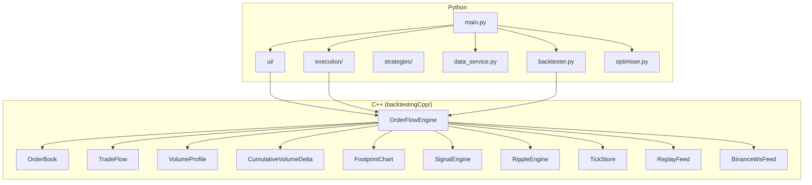
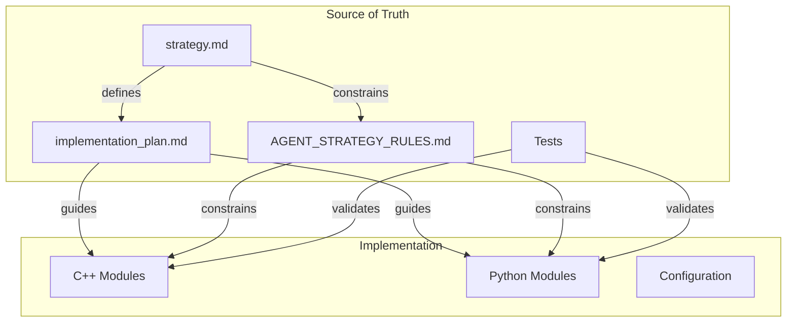
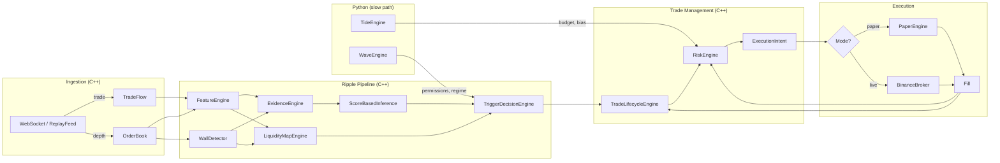

# Tide / Wave / Ripple — Implementation Plan

## 1. Purpose

This document translates the strategy design defined in `strategy.md` into a concrete, phased implementation program for the existing mixed C++ / Python application. It specifies module boundaries, language responsibilities, incremental build phases, testing requirements, performance targets, and acceptance criteria.

**Source of truth hierarchy:**
1. `strategy.md` — canonical strategy definition
2. `implementation_plan.md` — this document; how to build it
3. Tests — executable specification
4. `AGENT_STRATEGY_RULES.md` — operational rules for coding agents

---

## 2. Assumptions About the Existing Codebase

### 2.1 Current Architecture

The application is a mixed C++ / Python system with pybind11 bridging.



### 2.2 Existing Capabilities

| Capability | Status | Location |
|---|---|---|
| Binance L2 depth ingestion | Implemented | `BinanceWsFeed`, `OrderBook` |
| Binance trade ingestion | Implemented | `BinanceWsFeed`, `TradeFlow` |
| Order book maintenance | Implemented | `OrderBook` |
| Volume Profile | Implemented | `VolumeProfile` (C++), `volume_profile_widget.py` |
| CVD | Implemented | `CumulativeVolumeDelta` (C++), `cvd_widget.py` |
| Heatmap visualization | Implemented | `heatmap_widget.py` |
| Ripple engine (partial) | Implemented | `ripple/` subdirectory |
| Wall detection | Implemented | `WallDetector` |
| Feature extraction | Implemented | `RippleFeatureEngine` |
| Evidence scoring | Implemented | `RippleEvidenceEngine` |
| Score-based inference | Implemented | `ScoreBasedInference` |
| HMM inference | Stub only | `HMMBasedInference` |
| Tick data storage | Implemented | `TickStore` (HDF5) |
| Replay feed | Implemented | `ReplayFeed` |
| Paper trading engine | Implemented | `PaperEngine` |
| Binance broker | Implemented | `BinanceBroker` |
| Execution manager | Implemented | `ExecutionManager` |
| NSGA-II optimizer | Implemented | `optimiser.py` |
| Oanda L1 connector | Implemented | `exchanges/oanda.py` |
| Binance L1 connector | Implemented | `exchanges/binance.py` |

### 2.3 What Exists vs. What Needs Building

| Component | Exists | Needs Work | Phase |
|---|---|---|---|
| Feature schema | **Formalized** | — | 1 (done) |
| Data contracts / schemas | **Implemented** (C++ `Schemas.h`, Python `schemas.py`) | — | 1 (done) |
| Permissions matrix (data contract) | **Implemented** (`PermissionSet`) | Wire to Wave | 1 (done) |
| Trade lifecycle FSM | **Implemented** (`TradeLifecycleEngine`) | — | 2 (done) |
| Trade archetypes | **Implemented** (bounce/breakout in lifecycle + trigger) | — | 2 (done) |
| Exit taxonomy | **Implemented** (5 exit types) | — | 2 (done) |
| Scaling logic | **Implemented** (scale-in + scale-out + trailing stop) | — | 2+3 (done) |
| Ripple state machine | **Integrated** (ScoreBased + lifecycle FSM + liquidity map) | — | 2+3 (done) |
| Liquidity map | **Implemented** (`LiquidityMapEngine`) | Probabilistic hold/break (later) | 3 (done) |
| Hold/break/dest scoring | **Implemented** (deterministic thresholds) | Logistic model calibration (later) | 3 (done) |
| CVD integration in Ripple | **Integrated** (divergence → evidence boost, features) | — | 3 (done) |
| VP integration in Ripple | **Integrated** (POC, value area, HVN/LVN in map) | — | 3 (done) |
| Scale-out plan | **Implemented** (map destinations → up to 3 targets) | — | 3 (done) |
| Risk budgeting | Not implemented | Build ES throttle | 4 |
| Tide layer | Not implemented | Build macro bias, risk allocation | 4 |
| Wave layer | Not implemented | Build regime classifier | 5 |

---

## 3. App Mode Mapping

### 3.1 Mode Responsibilities

| Mode | Tide | Wave | Ripple | Execution | Storage |
|---|---|---|---|---|---|
| `data` | — | — | — | — | Collect and store raw events |
| `backtest` | Replay or fixed | Replay or deterministic | Full pipeline | Paper fills | Read stored events |
| `optimise` | Parameter search | Parameter search | Parameter search | Paper fills | Read stored events |
| `ui` | Display state | Display state | Full pipeline + display | Paper or live | Live or replay events |
| `execute` | Live computation | Live computation | Full pipeline | Live Binance | Live events |

### 3.2 Mode-Specific Constraints

- **`data`**: No strategy logic runs. Only event ingestion and storage.
- **`backtest`**: Must be deterministic. Uses `ReplayFeed`. All randomness seeded. Tide/Wave may be fixed or replayed.
- **`optimise`**: Runs `backtest` in a loop with parameter variation. Must be parallelizable. Each run is deterministic.
- **`ui`**: Real-time visualization. Strategy state exposed to UI widgets. Must not block the render thread.
- **`execute`**: Full live pipeline. Risk checks enforced. Fills routed to `BinanceBroker`.

---

## 4. Language Responsibility Mapping

### 4.1 C++ Responsibilities

| Module | Responsibility |
|---|---|
| `OrderBook` | L2 order book maintenance, snapshot, levels |
| `TradeFlow` | Trade event processing, aggressor classification |
| `VolumeProfile` | Volume-at-price aggregation |
| `CumulativeVolumeDelta` | CVD computation |
| `WallDetector` | Wall detection and quality scoring |
| `RippleFeatureEngine` | Microstructure feature computation (imbalance, microprice, OFI, impact) |
| `RippleEvidenceEngine` | Evidence scoring for liquidity transitions |
| `ScoreBasedInference` | Deterministic rule-based liquidity state inference |
| `HMMBasedInference` | Probabilistic latent-state inference (V2+) |
| `TriggerDecisionEngine` | Trade archetype detection and decision generation |
| `RippleStateTracker` | State dwell tracking, deduplication |
| `TradeLifecycleEngine` | **New**: trade lifecycle FSM (entry → exit) |
| `LiquidityMapEngine` | **New**: real-time liquidity map |
| `RiskEngine` | **New**: ES computation, budget checks on hot path |
| `TickStore` | HDF5 storage for events |
| `ReplayFeed` | Deterministic replay |
| `BinanceWsFeed` | Live data ingestion |
| `bindings.cpp` | pybind11 exports |

### 4.2 Python Responsibilities

| Module | Responsibility |
|---|---|
| `main.py` | CLI entry, mode dispatch |
| `ui/main_window.py` | UI orchestration, timer, data pipeline to widgets |
| `ui/heatmap_widget.py` | Heatmap rendering |
| `ui/cvd_widget.py` | CVD rendering |
| `ui/volume_profile_widget.py` | Volume profile rendering |
| `execution/models.py` | Order/position models, C++ → Python mapping |
| `execution/paper_engine.py` | Paper fills |
| `execution/binance_broker.py` | Live fills |
| `execution/execution_manager.py` | Execution orchestration |
| `strategies/orderflow.py` | Python wrapper for C++ backtest |
| `backtester.py` | Backtest orchestration |
| `optimiser.py` | NSGA-II parameter optimization |
| `data_service.py` | Data collection orchestration |
| `tide/` | **New**: Tide layer (Python for research; thin C++ proxy for live) |
| `wave/` | **New**: Wave layer (Python for research; thin C++ proxy for live) |
| `analytics/` | **New**: offline analytics, labeling, model training |

### 4.3 Why This Split

- **C++ for the hot path:** event-by-event processing, order book operations, feature computation, state machine transitions, risk checks — all must be fast and deterministic.
- **Python for research and orchestration:** model fitting, parameter optimization, analytics, UI, and any workflow that does not need per-event latency.
- **pybind11 bridge:** all C++ state machines and engines expose read-only snapshots and configuration setters to Python.

---

## 5. Canonical Source-of-Truth Architecture



**Rule:** If code behavior contradicts `strategy.md`, the code is wrong. If `implementation_plan.md` contradicts `strategy.md`, the plan must be updated. Tests are executable specifications and must agree with `strategy.md`.

---

## 5.1 Pre-Phase Defaults

Before each layer is implemented, downstream consumers use hardcoded defaults. These are defined in `strategy.md` §7.5.

**Before Tide is implemented (Phases 2–3):**

| Output | Default | Source |
|---|---|---|
| `tide.bias` | `NEUTRAL` | `DefaultTideSnapshot` (C++) |
| `tide.risk_multiplier` | `1.0` | `DefaultTideSnapshot` |
| `tide.max_position_usd` | From config file | `StrategyConfig.tide.max_position_usd` |
| `tide.es_budget` | From config file | `StrategyConfig.tide.es_budget_global` |
| `tide.vol_regime` | `NORMAL` | `DefaultTideSnapshot` |

**Before Wave is implemented (Phases 2–4):**

| Output | Default | Source |
|---|---|---|
| `wave.regime` | `NEUTRAL` | `DefaultWaveSnapshot` (C++) |
| `wave.permissions` | All `FULL` | `DefaultWaveSnapshot` |
| `wave.trend_efficiency` | `0.5` | `DefaultWaveSnapshot` |

**Implementation requirement:** Define `DefaultTideSnapshot` and `DefaultWaveSnapshot` as `static constexpr` structs in C++ (e.g., in `Schemas.h`) and as constants in Python (`schemas.py`). These must be used wherever Tide/Wave snapshots are consumed before those layers exist.

---

## 6. Required Modules and Interfaces

### 6.1 New C++ Modules

#### 6.1.1 `TradeLifecycleEngine`

Manages the lifecycle of a single trade from SETUP through COOLDOWN. In V1, at most one trade is active per symbol (see strategy.md §12.3).

```
class TradeLifecycleEngine {
public:
    // Attempt to begin a new trade. Returns false if a trade is already active.
    bool try_setup(TradeArchetype archetype, Side side, double wall_price,
                   double stop_price, int64_t timestamp);

    // Check whether the current archetype is allowed by Wave permissions.
    bool is_permitted(const PermissionSet& permissions) const;

    void on_fill(const Fill& fill);
    void on_tick(int64_t timestamp, const RippleSnapshot& ripple,
                 const LiquidityMapSnapshot& lmap, const PermissionSet& permissions);
    void on_exit_signal(ExitType type, int64_t timestamp);

    TradeState get_state() const;
    LifecycleState get_lifecycle_state() const;  // SETUP, ENTRY, CONFIRMATION, etc.
    bool is_active() const;       // true if in CONFIRMATION, EXPANSION, or MATURATION
    bool is_idle() const;         // true if no trade (terminal or COOLDOWN expired)
    bool should_scale_in() const;
    bool should_scale_out() const;
    double get_stop_price() const;
    double get_target_price() const;
    ExecutionIntent get_pending_intent() const;  // next action for execution layer
};
```

**Note:** `LifecycleState` is an enum with values matching strategy.md §12.1: `SETUP`, `ENTRY`, `CONFIRMATION`, `EXPANSION`, `MATURATION`, `EXIT`, `COOLDOWN`, `CANCELLED`.

#### 6.1.2 `LiquidityMapEngine`

Maintains a real-time liquidity map combining resting depth, traded volume, aggressive flow, and structural anchors. Maximum tracked levels is bounded (see strategy.md §21.1).

```
class LiquidityMapEngine {
public:
    void update(const OrderBook& book, const VolumeProfile& vp,
                const TradeFlow& trade_flow, const std::vector<Wall>& walls,
                double vwap, double session_high, double session_low,
                int64_t timestamp);

    LiquidityMapSnapshot get_snapshot() const;
    double get_hold_score(double price) const;
    double get_break_score(double price) const;   // = 1 - hold_score
    double get_dest_score(double price) const;
    std::vector<VoidCorridor> get_void_corridors() const;

    // Nearest significant levels relative to current price
    double get_nearest_bid_wall() const;
    double get_nearest_ask_wall() const;
    double get_poc() const;

    size_t level_count() const;  // for diagnostics
};
```

#### 6.1.3 `RiskEngine`

Enforces ES budget constraints on the hot path. Uses the parametric ES approximation from strategy.md §15.2 with configurable α (default 0.95).

```
class RiskEngine {
public:
    void set_budget(double es_budget, double max_position_usd, double risk_multiplier);
    void set_volatility(double realized_vol);  // updated by Tide at minute cadence
    void on_fill(const Fill& fill);
    void on_price_update(double price, int64_t timestamp);

    bool check_new_order(double quantity, double price) const;
    double get_allowed_size(double desired_quantity, double price) const;
    double get_consumed_es() const;
    double get_remaining_budget() const;
    bool is_budget_exhausted() const;  // consumed_es >= es_budget
    RiskBudgetSnapshot get_snapshot() const;
};
```

**Performance:** `check_new_order` and `get_allowed_size` are pure arithmetic — no allocation, no branching beyond a single comparison. Target: < 1 µs.

### 6.2 New Python Modules

#### 6.2.1 `tide/tide_engine.py`

```python
class TideEngine:
    def update(self, timestamp: int, market_data: dict) -> TideSnapshot:
        """Recompute Tide state from macro inputs."""

    def get_snapshot(self) -> TideSnapshot:
        """Return current Tide state."""

    def get_risk_budget(self, strategy: str, asset: str) -> RiskBudget:
        """Return ES budget for a strategy×asset cell."""
```

#### 6.2.2 `wave/wave_engine.py`

```python
class WaveEngine:
    def update(self, timestamp: int, l1_prices: dict) -> WaveSnapshot:
        """Recompute Wave state from L1 data."""

    def get_snapshot(self) -> WaveSnapshot:
        """Return current Wave state."""

    def get_permissions(self) -> PermissionSet:
        """Return current trade archetype permissions."""
```

### 6.3 Shared Schemas and Serialization

All data contracts defined in `strategy.md` §17 must have:
1. A C++ struct definition in `Types.h` (or a dedicated `Schemas.h`).
2. A Python dataclass in a shared `schemas.py` module.
3. pybind11 bindings for cross-language access.
4. Optional serialization to JSON or MessagePack for storage and diagnostics.

**Required contracts (strategy.md §17):**

| Contract | §17 ref | Primary consumer |
|---|---|---|
| Market Event | §17.1 | All engines |
| Trade Event | §17.2 | TradeFlow, RippleFeatureEngine |
| Depth Update | §17.3 | OrderBook |
| Feature Snapshot | §17.4 | Analytics, UI |
| Wave State | §17.5 | TriggerDecisionEngine |
| Ripple State | §17.6 | TriggerDecisionEngine, UI |
| Trade State | §17.7 | TradeLifecycleEngine, UI |
| Risk Budget Snapshot | §17.8 | RiskEngine, UI |
| Liquidity Map Snapshot | §17.9 | LiquidityMapEngine, TradeLifecycleEngine |
| Fill Event | §17.10 | TradeLifecycleEngine, RiskEngine |
| Wall | §17.11 | WallDetector, LiquidityMapEngine |
| Permission Set | §17.12 | WaveEngine, TriggerDecisionEngine |
| Tide Snapshot | §17.13 | TideEngine, RiskEngine |
| Execution Intent | §17.14 | TradeLifecycleEngine, Execution Layer |

**Consistency rule:** The C++ struct and Python dataclass must have identical field names, types, and semantics. Changes to one must be reflected in the other and in `strategy.md` §17.

### 6.4 Per-Event Data Flow



---

## 7. Incremental Implementation Phases

### Phase 1 — Schema, Contracts, and Configuration [COMPLETED]

**Objective:** Formalize the data contracts, feature schema, and configuration surface as code. No behavioral changes.

**Scope:**
- Define C++ structs for all data contracts (§17 of strategy.md).
- Define Python dataclasses mirroring the C++ structs.
- Define pybind11 bindings for all new types.
- Define a `StrategyConfig` struct/class with all configurable parameters organized by layer (tide, wave, ripple, risk, execution).
- Define the feature schema as a code-level registry (namespace → feature name → type, cadence, category).
- Add configuration loading/saving to the existing QSettings or a dedicated JSON config file.

**What NOT to implement yet:**
- No behavioral changes to existing Ripple logic.
- No new trade archetypes.
- No risk engine.
- No Tide or Wave computation.

**Test requirements:**
- Serialization round-trip tests for all new types.
- Config load/save tests.
- pybind11 binding tests (construct in Python, read fields).

**Success criteria:**
- All data contracts from strategy.md §17 exist as compilable C++ structs and Python dataclasses.
- All configurable parameters from strategy.md are present in `StrategyConfig` with sensible defaults.
- Feature schema is enumerable and queryable.
- No existing tests break.

**Performance considerations:**
- None; this phase is purely structural.

**Completion notes:**
- All data contracts from `strategy.md` §17 implemented as C++ structs in `Schemas.h` and Python dataclasses in `schemas.py`.
- Canonical enums: `TideBias`, `VolRegime`, `WaveRegime`, `Permission`, `TradeArchetype`, `TradeSide`, `LifecycleState`, `ExitType`, `RippleIntent`, `LiquidityState`, `FeatureCategory`.
- `StrategyConfig` with full layer-organized parameters and JSON serialization.
- Feature registry with 54 features matching `strategy.md` §16.
- `DefaultTideSnapshot` and `DefaultWaveSnapshot` as `static constexpr` structs.
- `StrategySnapshot` aggregation type with deterministic serialization.
- pybind11 bindings for all new types.
- Tests: 396 C++ checks (`test_schemas`), 56 Python tests (`test_schemas.py`).

---

### Phase 2 — Deterministic Ripple Baseline [COMPLETED]

**Objective:** Implement the core Ripple execution logic: trade archetypes, trade lifecycle state machine, exit taxonomy, and basic scaling.

**Scope:**
- Implement `TradeLifecycleEngine` in C++ with the state machine from strategy.md §12.
- Implement bounce and breakout trade archetype detection in `TriggerDecisionEngine` using the pseudocode from strategy.md §11.1.1 and §11.2.1.
- Implement five exit types using the detection conditions from strategy.md §13.3.
- Implement scale-in logic per strategy.md §14.1.1 (only after `CONFIRMATION` state, only in `EXPANSION`).
- Implement scale-out algorithm per strategy.md §14.2.1 (at predefined liquidity destination fractions).
- Implement trailing stop per strategy.md §14.3.
- Wire `TradeLifecycleEngine` into `RippleEngine` so that Ripple manages open trades.
- Wire `DefaultTideSnapshot` and `DefaultWaveSnapshot` as upstream inputs (see §5.1).
- Expose trade state to Python via pybind11.

**Explicit file deliverables:**

| File | What to create/modify |
|---|---|
| `backtestingCpp/orderflow/ripple/TradeLifecycleEngine.h/cpp` | New: lifecycle FSM, state transitions, exit checks |
| `backtestingCpp/orderflow/ripple/TriggerDecisionEngine.h/cpp` | Extend: bounce/breakout detection per §11.1.1, §11.2.1 |
| `backtestingCpp/orderflow/Schemas.h` | Add: `TradeState`, `ExecutionIntent`, `LifecycleState` enum, `DefaultTideSnapshot`, `DefaultWaveSnapshot` |
| `backtestingCpp/orderflow/ripple/RippleEngine.h/cpp` | Wire: lifecycle engine into per-event path |
| `backtestingCpp/bindings.cpp` | Extend: expose `TradeState`, `LifecycleState`, `ExecutionIntent` to Python |
| `tests/test_trade_lifecycle.cpp` | New: unit tests for all FSM transitions and exit types |
| `tests/test_trigger_detection.cpp` | New: unit tests for bounce/breakout detection |

**V1 operating assumptions enforced in this phase (see strategy.md §22.1):**
- Single symbol at a time.
- At most one concurrent trade per symbol.
- Event-time only (no wall-clock in decision logic).

**What NOT to implement yet:**
- No liquidity map (use simple distance-based targets).
- No hold/break/destination scoring.
- No VP/CVD integration in trade decisions (only in existing feature computation).
- No risk budget enforcement (accept all sizes).
- No Tide or Wave.

**Test requirements:**
- Unit tests for every state transition in the lifecycle FSM.
- Unit tests for each exit type trigger.
- Unit tests for scale-in and scale-out conditions.
- Integration test: feed a sequence of events → verify correct trade lifecycle progression.
- Replay determinism test: same events → same decisions.

**Success criteria:**
- Trade lifecycle FSM correctly transitions through all states.
- Bounce and breakout archetypes are detected and managed.
- All five exit types function correctly.
- Scale-in/out logic respects the rules in strategy.md §14.
- Replay produces identical results.

**Performance considerations:**
- `TradeLifecycleEngine::on_tick` must be < 1 µs (simple conditionals).
- No allocations in the per-tick path.

**Completion notes:**

Delivered files:

| File | Action |
|---|---|
| `backtestingCpp/orderflow/ripple/RippleConfig.h` | Extended: added `LifecycleConfig` struct with all lifecycle parameters |
| `backtestingCpp/orderflow/ripple/TradeLifecycleEngine.h` | New: `TickContext` struct, `TradeLifecycleEngine` class declaration |
| `backtestingCpp/orderflow/ripple/TradeLifecycleEngine.cpp` | New: full FSM implementation — state transitions, 5 exit types, scale-in, trailing stop, intent generation |
| `backtestingCpp/orderflow/ripple/RippleEngine.h` | Extended: `TradeLifecycleEngine` member, `on_fill()`, trade state accessors |
| `backtestingCpp/orderflow/ripple/RippleEngine.cpp` | Extended: lifecycle integration in `run_pipeline()`, `TickContext` population, intent mapping from `RippleDecision` |
| `backtestingCpp/orderflow/bindings.cpp` | Extended: pybind11 bindings for `TickContext`, `LifecycleConfig`, `TradeLifecycleEngine`, and `RippleEngine` trade accessors |
| `backtestingCpp/orderflow/CMakeLists.txt` | Extended: new source/header files, `test_trade_lifecycle` target |
| `backtestingCpp/orderflow/ripple/tests/test_trade_lifecycle.cpp` | New: 99 test checks covering all FSM transitions, exit types, scaling, trailing stop, permissions, intents, determinism |

Post-review consistency fixes (strategy.md cross-reference):
- TARGET exit now uses LIMIT order with `limit_price = target_price_` per §13.3.2 (was MARKET).
- EXHAUSTION exit now uses LIMIT order with `limit_price = last_microprice_` per §13.3.3 (was MARKET).
- `unrealized_pnl` now computed in `get_snapshot()` as `(microprice - entry) * side_sign * qty` per §17.7 (was always 0).
- Added MATURATION → EXPANSION re-acceleration transition per §12.2 (was missing).
- Added `scale_out_count_` member to guard re-acceleration (prepares for Phase 3 scale-out).
- Added `last_microprice_` member for PnL computation and exhaustion exit limit price.

Key design decisions:
- `TickContext` decouples lifecycle from full `RippleContext`/`RippleFeatures`, keeping the interface minimal and testable.
- `LifecycleConfig` nested inside `RippleConfig` for hierarchical configuration.
- `DefaultRiskBudgetSnapshot` and `DefaultPermissionSet` used as upstream inputs (Tide/Wave not yet implemented).
- Single-trade constraint enforced: `try_setup()` returns `false` if a trade is already active.
- All exit types evaluated in priority order: risk-budget > invalidation > time > target > exhaustion.
- Scale-in only in `EXPANSION` state with CVD momentum and volatility-threshold gates.
- Trailing stop tightens monotonically, never loosens.
- Intent-based execution model: lifecycle emits `StrategyExecutionIntent`, consumed by execution layer.

Tests: 126 C++ checks (`test_trade_lifecycle`) covering:
- Initial state, reset, idle/active queries
- `try_setup` (idle, active rejection, timeout cancellation)
- `confirm_entry` (success, failure, intent generation for BOUNCE/BREAKOUT)
- `on_fill` (entry fill → CONFIRMATION, entry price tracking)
- State progression: CONFIRMATION → EXPANSION → MATURATION
- All 5 exit types: invalidation (long/short), time, target, exhaustion, risk-budget
- Exit priority ordering
- Full exit flow: EXIT → COOLDOWN → idle
- Scale-in trigger, max scale-in limit, stop adjustment
- Trailing stop tightening
- Permission revocation exit
- External exit signals
- `TradeStateSnapshot` field validation
- Replay determinism (identical inputs → identical outputs)
- Post-cooldown re-entry
- Entry cancellation before fill
- Exit intent fields (`exit_reason`, `urgency`)
- Double exit signal protection
- Scale-in rejection outside EXPANSION state (CONFIRMATION guard)
- Scale-in rejection when CVD slope below threshold
- Exhaustion requires all three conditions simultaneously (partial condition tests)
- Exit from EXPANSION and MATURATION states specifically
- `unrealized_pnl` computation (LONG and SHORT)
- TARGET exit uses LIMIT order with `limit_price = target_price` (§13.3.2)
- EXHAUSTION exit uses LIMIT order with `limit_price = last microprice` (§13.3.3)
- INVALIDATION exit uses MARKET order (§13.3.1)
- MATURATION → EXPANSION re-acceleration (§12.2)
- Scale-in intent side correctness for SHORT trades

---

### Phase 3 — Liquidity Map and VP/CVD Integration [COMPLETED]

**Objective:** Build the real-time liquidity map and integrate Volume Profile and CVD signals into Ripple decision-making.

**Scope:**
- Implement `LiquidityMapEngine` in C++.
- Compute resting liquidity levels from walls.
- Compute traded liquidity levels from Volume Profile.
- Compute flow-pressure levels from trade flow.
- Compute structural anchors (VWAP, session high/low).
- Detect void corridors.
- Compute hold/break/destination scores per level.
- Wire CVD divergence into Ripple evidence scoring (extend `RippleEvidenceEngine`).
- Wire VP POC / value area into Ripple context.
- Use liquidity map destinations for target selection and scale-out.
- Backtest validation on historical data.

**What NOT to implement yet:**
- No probabilistic hold/break scoring (logistic model). Use deterministic thresholds.
- No Tide or Wave.
- No risk budget enforcement.

**Test requirements:**
- Unit tests for each liquidity map component (resting, traded, flow, structural, void).
- Unit tests for hold/break/destination score computation.
- Integration test: verify that liquidity map influences target selection.
- Backtest: run on at least 1 week of historical data, verify trade behavior is reasonable.
- Replay determinism test.

**Success criteria:**
- Liquidity map produces sensible levels for real market data.
- Targets and scale-out points are derived from the map.
- CVD divergence and VP context improve signal quality (measured by backtest).
- Replay deterministic.

**Performance considerations:**
- `LiquidityMapEngine::update` should be < 50 µs (bounded number of levels).
- Void corridor detection: < 10 µs.

**Completion notes:**

Delivered files:

| File | Action |
|---|---|
| `backtestingCpp/orderflow/ripple/RippleConfig.h` | Extended: added `LiquidityMapConfig` struct with scoring weights and void thresholds; added `scale_out_fractions` and `scale_out_count` to `LifecycleConfig`; added `cvd_divergence_boost` to `EvidenceWeights` |
| `backtestingCpp/orderflow/ripple/RippleTypes.h` | Extended: added `cvd_divergence_strength`, `cvd_divergence_detected`, `poc_price`, `distance_to_poc_ticks`, `vah`, `val` to `RippleFeatures` |
| `backtestingCpp/orderflow/ripple/LiquidityMapEngine.h` | New: `LiquidityMapInput` struct, `LiquidityMapEngine` class declaration |
| `backtestingCpp/orderflow/ripple/LiquidityMapEngine.cpp` | New: full implementation — wall level collection, VP profile levels (HVN/LVN/POC), structural anchors (VWAP), trade flow aggregation, void corridor detection, hold/break/dest scoring with min-max normalization, destination query |
| `backtestingCpp/orderflow/ripple/RippleEvidenceEngine.cpp` | Extended: added CVD divergence boost — bullish divergence strengthens absorption, bearish strengthens exhaustion (§9.9) |
| `backtestingCpp/orderflow/ripple/TradeLifecycleEngine.h` | Extended: added `ScaleOutTarget` struct, `set_scale_out_targets()` method, `check_scale_out()`, `emit_scale_out_intent()`, scale-out member variables |
| `backtestingCpp/orderflow/ripple/TradeLifecycleEngine.cpp` | Extended: scale-out plan storage, scale-out triggering in EXPANSION/MATURATION, scale-out fill handling with stop tightening and target advancement, `check_target_exit` defers to scale-out when targets remain |
| `backtestingCpp/orderflow/ripple/RippleEngine.h` | Extended: `LiquidityMapEngine` member, `VolumeProfile*`/`CumulativeVolumeDelta*` setters, liquidity map accessors, session VWAP/high/low tracking |
| `backtestingCpp/orderflow/ripple/RippleEngine.cpp` | Extended: VP/CVD feature overlay, liquidity map update in pipeline, map-based target selection and scale-out plan computation at trade entry, session VWAP tracking from trade flow |
| `backtestingCpp/orderflow/bindings.cpp` | Extended: pybind11 bindings for `LiquidityMapConfig`, `LiquidityMapEngine`, `ScaleOutTarget`, new `RippleFeatures` fields, new `TradeLifecycleEngine` scale-out methods, `RippleEngine.liquidity_map()` |
| `backtestingCpp/orderflow/CMakeLists.txt` | Extended: new source/header files, `test_liquidity_map` target |
| `backtestingCpp/orderflow/ripple/tests/test_liquidity_map.cpp` | New: 105 test checks covering all Phase 3 deliverables |

Key design decisions:
- `LiquidityMapInput` struct decouples the map engine from specific engine references, keeping it testable and deterministic.
- Void corridors detected by price gap analysis between significant levels (gap > `void_min_gap_sigma × σ_P`).
- Hold score computed only for wall levels; dest_score uses §10.3 weighted formula with min-max normalization.
- CVD divergence boost is additive and only activates when `cvd_divergence_detected` is true, preserving Phase 2 behavior when CVD engine is not available.
- Scale-out targets stored as a fixed-size array (max 3) in `TradeLifecycleEngine` — no heap allocation.
- Scale-out happens within EXPANSION/MATURATION without transitioning to EXIT; position reduces incrementally.
- VP and CVD are optional (non-owning pointers on RippleEngine); system degrades gracefully when not available.
- Session VWAP computed incrementally from trade flow (price × quantity accumulator).

Post-review consistency fixes (strategy.md cross-reference):
- `collect_wall_levels` now filters by `wall_min_quality` config per §10.2.1 (was accepting all active walls regardless of quality).
- First scale-out target's `new_stop` is updated to `entry_price` on entry fill per §14.2.1 (was using microprice at setup time, which may differ from actual fill price).
- Scale-out plan now adds remainder quantity to last target when fewer destinations than `scale_out_count`, per §14.2.1 pseudocode.
- Header comment on `LiquidityMapEngine` corrected: flow bucketing and profile classification use small transient allocations (not zero-alloc as previously stated).

Tests: 112 C++ checks (`test_liquidity_map`) covering:
- Empty input, wall-only levels, inactive wall exclusion
- VP profile levels (HVN, LVN, POC classification)
- Structural anchors (VWAP level)
- Trade flow merged into existing levels (net_flow computation)
- Void corridor detection (gap > threshold)
- No void when levels are close
- Hold score computation (wall quality, depth weighted)
- Dest score computation (depth, volume, VWAP proximity, structural flag)
- Destinations in direction (LONG and SHORT filtering)
- Max levels trimming
- Reset
- Determinism (identical inputs → identical outputs)
- Hold score zero for non-wall levels
- Mixed wall + profile levels
- Wall min quality filter: walls below `wall_min_quality` excluded (§10.2.1)
- Scale-out not triggered in CONFIRMATION state (guard test)
- First scale-out stop = `entry_price` after fill (§14.2.1 breakeven)
- CVD divergence boost: absorption strengthened by bullish divergence
- CVD divergence boost: exhaustion strengthened by bearish divergence
- No divergence → no change (Phase 2 backward compatibility)
- Scale-out target setup
- Scale-out triggers at target price with LIMIT order
- Scale-out fill advances target index and tightens stop
- All scale-outs done → trailing stop activates / cooldown
- Target exit deferred while scale-out targets remain
- Scale-out for SHORT trades (correct side)
- Invalidation exit takes priority during scale-out
- VP/CVD feature fields in RippleFeatures

---

### Phase 4 — Risk Budget Plumbing

**Objective:** Implement the risk engine, ES throttle, and Tide sizing interface.

**Scope:**
- Implement `RiskEngine` in C++ with simple global ES throttle (strategy.md §15.2).
- Implement position sizing formula (strategy.md §14.4).
- Wire risk checks into order submission path.
- Implement `TideEngine` in Python with basic risk multiplier and ES budget computation.
- Wire Tide outputs into Ripple via `RiskEngine`.
- Implement risk-budget exit type enforcement.

**What NOT to implement yet:**
- No hierarchical ES (sleeve/asset/cell budgets).
- No Euler decomposition.
- No dynamic risk multiplier from macro features.
- No Wave.

**Test requirements:**
- Unit tests for ES estimation.
- Unit tests for position sizing formula.
- Unit tests for risk check (order rejected when budget exhausted).
- Integration test: position size throttled as budget consumed.
- Test: risk-budget exit triggers when budget approaches limit.

**Success criteria:**
- No position can exceed the global ES budget.
- Position sizing scales correctly with risk multiplier.
- Risk-budget exit triggers appropriately.
- Existing trade lifecycle and liquidity map tests still pass.

**Performance considerations:**
- `RiskEngine::check_new_order` must be < 1 µs (arithmetic only).
- Risk state update on fill: < 1 µs.

---

### Phase 5 — Wave Regime Baseline

**Objective:** Implement a deterministic Wave regime classifier using L1 data.

**Scope:**
- Implement `WaveEngine` in Python.
- Compute trend efficiency, dispersion, and absorption ratio from L1 data.
- Implement deterministic threshold-based regime classification.
- Implement the permissions matrix (strategy.md §18).
- Wire Wave permissions into Ripple: Ripple checks permissions before creating setups.
- Implement distance-to-structure features.
- Expose Wave state to UI.

**What NOT to implement yet:**
- No HMM-based regime classification.
- No multi-factor PCA.
- No cross-venue data.
- No residual dislocation (needs multi-asset factor model).

**Test requirements:**
- Unit tests for each feature computation (trend efficiency, dispersion, AR).
- Unit tests for regime classification rules.
- Unit tests for permissions matrix lookups.
- Integration test: verify Ripple respects Wave permissions.
- Replay determinism test.

**Success criteria:**
- Wave correctly classifies regimes on historical data.
- Permissions matrix correctly enables/disables trade archetypes.
- Ripple respects permissions without breaking existing trade logic.
- Replay deterministic.

**Performance considerations:**
- Wave updates at 5s cadence; no tight latency requirement.
- Feature computation: < 1 ms per update.

---

### Phase 6 — Optimization, Replay Consistency, and UI Exposure

**Objective:** Validate the complete V1 pipeline via optimization, ensure replay consistency, and expose all states to the UI.

**Scope:**
- Run NSGA-II optimization over Ripple + Wave parameters.
- Verify replay determinism for all parameter combinations.
- Expose Tide, Wave, Ripple, trade lifecycle, liquidity map, and risk state to UI.
- Add diagnostics panels for strategy state.
- Add performance benchmarks for the full pipeline.
- Document V1 parameter ranges and defaults.

**What NOT to implement yet:**
- No HMM / ML.
- No cross-venue.

**Live execution readiness:** Phase 6 includes validation that the `execute` mode works end-to-end with the BinanceBroker. This means risk checks are enforced, fills are processed, and trade lifecycle transitions are correct with real market data. However, live deployment with real capital requires explicit sign-off after paper-trading validation.

**Test requirements:**
- Replay determinism across the full parameter space.
- Performance benchmark: tick-to-decision latency.
- UI integration tests (state displayed correctly).
- Optimization convergence test (objective functions improve).
- Paper-trade soak test: run for at least 24 hours without crash, memory leak, or silent pipeline stall.

**Success criteria:**
- Optimization produces parameter sets with positive expected value on backtest data.
- Full pipeline replay is deterministic.
- UI displays all strategy states clearly.
- Tick-to-decision latency < 100 µs (C++ hot path).

**Performance considerations:**
- Full optimization run should complete in reasonable time (hours, not days).
- Profiling and bottleneck identification.

---

### Phase 7 — Probabilistic / HMM / Latent-State Extensions

**Objective:** Add HMM-based state inference for Ripple and potentially Wave.

**Scope:**
- Implement `HMMBasedInference` in C++ (currently a stub).
- Train HMM on labeled data from V1 backtests.
- Implement model selection (number of hidden states via BIC).
- Run alongside `ScoreBasedInference` as an alternative backend.
- Compare HMM vs. rule-based on backtest metrics.
- If Wave HMM is warranted, implement similarly.

**What NOT to implement yet:**
- No cross-venue.
- No live model retraining.
- No adaptive Kelly sizing.

**Test requirements:**
- HMM produces valid probability distributions.
- HMM inference matches training data labels within tolerance.
- Deterministic given fixed model parameters and event sequence.
- Backtest comparison: HMM vs. rule-based.

**Success criteria:**
- HMM inference improves at least one key metric (win rate, Sharpe, risk-adjusted return) versus rule-based baseline.
- HMM can be toggled on/off via configuration.
- Rule-based baseline remains functional.

**Performance considerations:**
- HMM forward algorithm: O(K² · T) where K = states, T = sequence length. Must be bounded (fixed-window).
- Target: < 50 µs per event for K ≤ 5.

---

### Phase 8 — Cross-Venue Confirmation

**Objective:** Use L1 data from additional venues (Oanda, others) for cross-venue confirmation signals in Wave.

**Scope:**
- Ingest L1 data from Oanda and any other available venues.
- Compute cross-venue features: lead/lag, divergence, correlation.
- Wire cross-venue features into Wave regime classification.
- Evaluate information content via backtest.

**What NOT to implement yet:**
- No cross-venue execution.
- No multi-venue order routing.

**Test requirements:**
- Cross-venue features compute correctly from synthetic data.
- Wave regime classification changes appropriately with cross-venue signals.
- Replay determinism maintained (cross-venue data must be stored and replayable).

**Success criteria:**
- Cross-venue confirmation improves Wave regime classification quality.
- No degradation in Ripple execution quality.

**Performance considerations:**
- L1 ingestion is low-frequency; no tight latency requirement.
- Feature computation at Wave cadence (5s).

---

## 8. Test Plan Summary

| Phase | Unit Tests | Integration Tests | Replay Tests | Backtest Tests | Perf Benchmarks |
|---|---|---|---|---|---|
| 1 | Serialization, config | pybind11 bindings | — | — | — |
| 2 | FSM transitions, exits, scaling | Event → decision | Determinism | — | FSM transition latency |
| 3 | Map components, scores | Map → targets | Determinism | 1-week backtest | Map update latency |
| 4 | ES, sizing, risk check | Risk → sizing → rejection | Determinism | With risk limits | Risk check latency |
| 5 | Features, regime rules | Permissions → Ripple | Determinism | With Wave filter | Feature computation |
| 6 | — | Full pipeline | Full parameter space | Optimization | Full pipeline latency |
| 7 | HMM math, model load | HMM vs. rule-based | HMM determinism | HMM backtest | HMM inference latency |
| 8 | Cross-venue features | Multi-venue → Wave | Multi-venue replay | Cross-venue backtest | — |

---

## 9. Performance Concerns Per Phase

| Phase | Key Performance Concern | Mitigation |
|---|---|---|
| 2 | FSM on hot path | Simple conditionals, no allocation |
| 3 | Liquidity map rebuild per depth update | Incremental update, bounded levels |
| 4 | Risk check per order | Pre-computed budget state, arithmetic only |
| 5 | Wave feature computation | 5s cadence, batch computation |
| 6 | Full pipeline combined | Profile, identify bottleneck, optimize |
| 7 | HMM forward algorithm per event | Fixed window, bounded K |

---

## 10. Rollout / Acceptance Criteria Per Phase

| Phase | Acceptance Criteria |
|---|---|
| 1 | All types compile, round-trip, bind. No test regressions. |
| 2 | Trade lifecycle FSM correct. Replay deterministic. Archetypes detected. |
| 3 | Liquidity map sensible on real data. Targets improve backtest. |
| 4 | Risk limits enforced. No position exceeds budget. |
| 5 | Regime classification reasonable. Permissions respected. |
| 6 | Optimization converges. Replay consistent. UI displays all states. |
| 7 | HMM improves at least one metric. Toggle works. |
| 8 | Cross-venue features add information. No degradation. |

---

## 11. Documentation Synchronization Rules

1. **Before implementing a phase:** re-read the relevant sections of `strategy.md` and this plan.
2. **If implementation reveals a design issue:** update `strategy.md` first, then code.
3. **If a schema changes:** update `strategy.md` §17, then C++ structs, then Python dataclasses, then pybind11 bindings, then tests.
4. **After completing a phase:** update this plan's status table and `AGENT_STRATEGY_RULES.md` if any rules changed.
5. **Never let code drift from docs silently.** If you change behavior, document it.

---

## 12. Milestones

### V1 — Deterministic Baseline (Phases 1–6)

**Delivered capabilities:**
- Formalized schema and contracts.
- Deterministic Ripple with bounce/breakout archetypes.
- Full trade lifecycle management.
- Liquidity map with hold/break/dest scores.
- VP and CVD integration.
- Simple ES risk throttle.
- Deterministic Wave regime classifier.
- Permissions matrix.
- Optimization framework.
- Replay consistency.
- UI exposure.

### V2 — Probabilistic Extensions (Phase 7)

**Delivered capabilities:**
- HMM-based Ripple state inference.
- Optional HMM-based Wave regime.
- Model training and selection pipeline.

### V3+ — Multi-Venue and Advanced Risk (Phase 8+)

**Delivered capabilities:**
- Cross-venue confirmation.
- Hierarchical ES with Euler decomposition.
- Adaptive position sizing.
- Live model retraining.

---

## 13. Risks and Implementation Pitfalls

| Risk | Impact | Mitigation |
|---|---|---|
| Schema instability | Cascading changes across C++/Python/tests | Formalize schema fully in Phase 1 before building behavior |
| Over-engineering early | Delays V1 delivery | Stick to Phase 2 scope; no HMM, no cross-venue |
| Replay non-determinism | Cannot validate strategy | Enforce from Phase 2; test continuously |
| pybind11 type mismatch | Runtime errors | Automated binding tests in Phase 1 |
| Hot-path Python callbacks | Latency regression | All per-event logic in C++; Python reads snapshots |
| Unbounded data structures | Memory growth, performance degradation | Explicit maxlen/eviction on all rolling buffers |
| GIL contention | UI freeze during heavy processing | Minimize Python work on per-event path |
| Premature optimization | Incorrect behavior masked by fast code | Correctness first, then profile and optimize |
| Configuration sprawl | Untestable parameter space | Group configs by layer; test defaults; document ranges |
| Feature leakage in backtest | Overfitting | Use only causal features; strict lookback windows |
| Single-symbol assumption leaking | Shared state between symbols on future multi-symbol | Keep all state per-symbol from Phase 1; no globals |
| Leverage misconfiguration | Margin call / liquidation | Validate leverage at startup; cap per config |
| Fee model mismatch | Backtest PnL unrealistic | Maker/taker fees in paper engine from Phase 2 |
| Float vs double precision | Inconsistent results across platforms | Use `double` (float64) everywhere on hot path |

---

## 14. Module Ownership Suggestion

| Module | Owner | Language |
|---|---|---|
| Schema types, config | Shared (C++ primary) | C++ + Python mirror |
| RippleEngine, WallDetector, Features, Evidence | C++ | C++ |
| TradeLifecycleEngine | C++ | C++ |
| LiquidityMapEngine | C++ | C++ |
| RiskEngine | C++ | C++ |
| TriggerDecisionEngine | C++ | C++ |
| ScoreBasedInference | C++ | C++ |
| HMMBasedInference | C++ (V2) | C++ |
| TideEngine | Python (research) | Python |
| WaveEngine | Python (research) | Python |
| Analytics, labeling | Python | Python |
| UI widgets | Python | Python (PySide6) |
| Optimizer | Python | Python |
| pybind11 bindings | C++ | C++ |

---

## 15. Shared Schemas and Serialization

### 15.1 Schema Location

- C++ structs: `backtestingCpp/orderflow/Schemas.h` (new) or extend `Types.h`
- Python dataclasses: `schemas.py` (new) at project root or in a `shared/` package
- pybind11: `bindings.cpp` (extend existing)

### 15.2 Serialization Strategy

| Format | Use Case |
|---|---|
| In-memory C++ structs | Hot path processing |
| pybind11-exposed properties | Python ↔ C++ runtime bridge |
| JSON | Configuration, diagnostics, logging |
| HDF5 | Tick data storage (existing) |
| MessagePack (optional) | High-performance serialization for replay |

### 15.3 Consistency Enforcement

- A single source generator or manual review checklist ensures C++ and Python schemas match.
- Every schema change triggers: C++ struct update → Python dataclass update → binding update → test update → `strategy.md` §17 update.

---

## 16. Benchmark and Profiling Strategy

### 16.1 Per-Phase Benchmarks

Each phase adds benchmarks for its new components to a shared benchmark suite.

### 16.2 Profiling Tools

| Tool | Use |
|---|---|
| `perf` / `Instruments` | C++ hot path profiling |
| `cProfile` / `py-spy` | Python profiling |
| Custom `time.monotonic()` markers | Per-phase telemetry (existing in `main_window.py`) |
| Google Benchmark (optional) | Micro-benchmarks for C++ functions |

### 16.3 Continuous Performance Monitoring

- After Phase 6, performance benchmarks become part of the CI/test suite.
- Any regression > 20% on key metrics (tick-to-decision latency, memory) must be investigated.

---

## 17. Agent Instructions

Coding agents working on this codebase must:

1. **Read `strategy.md` and this plan before starting work on any phase.**
2. **Keep changes small.** One logical unit per commit. No multi-phase changes in a single PR.
3. **Keep the system compile-safe.** Every commit must compile. Every commit must pass existing tests.
4. **Avoid introducing HMM/ML before Phase 7.** The deterministic baseline must be complete and validated first.
5. **Preserve determinism and replayability.** No wall-clock time in decision logic. No unseeded randomness.
6. **Update tests with every meaningful behavior change.** No behavioral change without a test.
7. **Show only changed files** when making implementation steps.
8. **Update documentation** if assumptions or interfaces change.
9. **Profile before optimizing.** Do not optimize speculatively.
10. **Follow the phase order.** Dependencies are real. Do not skip phases.
