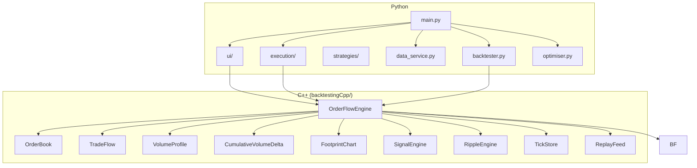
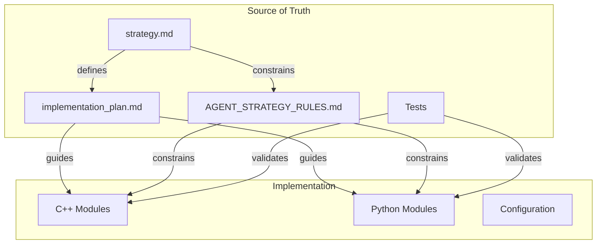
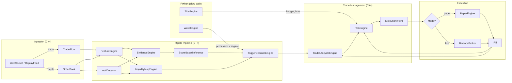

# Tide / Wave / Ripple — Implementation Plan

## 1. Purpose

This document translates the strategy design defined in `strategy.md` into a concrete, phased implementation program for the existing mixed C++ / Python application. It specifies module boundaries, language responsibilities, incremental build phases, testing requirements, performance targets, and acceptance criteria.

**Source of truth hierarchy:**
1. `strategy.md` — canonical strategy definition
2. `implementation_plan.md` — this document; how to build it
3. Tests — executable specification
4. `AGENT_STRATEGY_RULES.md` — operational rules for coding agents

---

## 2. Assumptions About the Existing Codebase

### 2.1 Current Architecture

The application is a mixed C++ / Python system with pybind11 bridging.



### 2.2 Existing Capabilities

| Capability | Status | Location |
|---|---|---|
| Binance L2 depth ingestion (UI live) | Implemented (Phase 10 hardened) | `data_feed/binance_futures_ws.py`, `OrderBook` |
| Binance trade ingestion (UI live) | Implemented (Phase 10 hardened) | `data_feed/binance_futures_ws.py`, `TradeFlow` |
| Binance ingestion (CLI `run_live`) | Implemented (Phase 10B — Python WS) | `strategies/orderflow.py::run_live` → `data_feed/binance_futures_ws.py` |
| Order book maintenance | Implemented | `OrderBook` |
| Volume Profile | Implemented | `VolumeProfile` (C++), `volume_profile_widget.py` |
| CVD | Implemented | `CumulativeVolumeDelta` (C++), `cvd_widget.py` |
| Heatmap visualization | Implemented | `heatmap_widget.py` |
| Ripple engine (partial) | Implemented | `ripple/` subdirectory |
| Wall detection | Implemented | `WallDetector` |
| Feature extraction | Implemented | `RippleFeatureEngine` |
| Evidence scoring | Implemented | `RippleEvidenceEngine` |
| Score-based inference | Implemented | `ScoreBasedInference` |
| HMM inference | Implemented (Phase 7) + A/B-validated (Phase 7V) | `HMMBasedInference`, `hmm/`, `tools/hmm_abtest.py` |
| Tick data storage | Implemented | `TickStore` (HDF5) |
| Replay feed | Implemented | `ReplayFeed` |
| Paper trading engine | Implemented | `PaperEngine` |
| Binance broker | Implemented | `BinanceBroker` |
| Execution manager | Implemented | `ExecutionManager` |
| NSGA-II optimizer | Implemented | `optimiser.py` |
| Oanda L1 connector | Implemented | `exchanges/oanda.py` |
| Binance L1 connector | Implemented | `exchanges/binance.py` |

### 2.3 What Exists vs. What Needs Building

| Component | Exists | Needs Work | Phase |
|---|---|---|---|
| Feature schema | **Formalized** | — | 1 (done) |
| Data contracts / schemas | **Implemented** (C++ `Schemas.h`, Python `schemas.py`) | — | 1 (done) |
| Permissions matrix (data contract) | **Implemented** (`PermissionSet`) | Wire to Wave | 1 (done) |
| Trade lifecycle FSM | **Implemented** (`TradeLifecycleEngine`) | — | 2 (done) |
| Trade archetypes | **Implemented** (bounce/breakout in lifecycle + trigger) | — | 2 (done) |
| Exit taxonomy | **Implemented** (5 exit types) | — | 2 (done) |
| Scaling logic | **Implemented** (scale-in + scale-out + trailing stop) | — | 2+3 (done) |
| Ripple state machine | **Integrated** (ScoreBased + lifecycle FSM + liquidity map) | — | 2+3 (done) |
| Liquidity map | **Implemented** (`LiquidityMapEngine`) | Probabilistic hold/break (later) | 3 (done) |
| Hold/break/dest scoring | **Implemented** (deterministic thresholds) | Logistic model calibration (later) | 3 (done) |
| CVD integration in Ripple | **Integrated** (divergence → evidence boost, features) | — | 3 (done) |
| VP integration in Ripple | **Integrated** (POC, value area, HVN/LVN in map) | — | 3 (done) |
| Scale-out plan | **Implemented** (map destinations → up to 3 targets) | — | 3 (done) |
| Risk budgeting | **Implemented** (`RiskEngine`) | Hierarchical ES (later) | 4 (done) |
| Tide layer | **Implemented** (`TideEngine` Python) | Dynamic macro features (later) | 4 (done) |
| Wave layer | **Implemented** (`WaveEngine` Python, C++ integration) | HMM classifier, multi-asset features (later) | 5 (done) |
| Replay determinism | **Verified** (`test_replay_determinism.py`) | — | 6 (done) |
| Performance benchmark | **Verified** (`benchmark_pipeline`, P99 < 100 µs) | — | 6 (done) |
| Strategy snapshot | **Implemented** (`get_strategy_snapshot()` on `OrderFlowEngine`) | — | 6 (done) |
| UI diagnostics | **Implemented** (`StrategyDiagnosticsPanel`) | — | 6 (done) |
| Optimization (Ripple+Wave) | **Implemented** (15 params in NSGA-II space) | Run on real data | 6 (done) |
| Paper fills | **Implemented** (`paper_fills` flag in RippleConfig) | — | 6 (done) |
| PnL tracking | **Implemented** (cumulative PnL in lifecycle) | — | 6 (done) |

---

## 3. App Mode Mapping

### 3.1 Mode Responsibilities

| Mode | Tide | Wave | Ripple | Execution | Storage |
|---|---|---|---|---|---|
| `data` | — | — | — | — | Collect and store raw events |
| `backtest` | Replay or fixed | Replay or deterministic | Full pipeline | Paper fills | Read stored events |
| `optimise` | Parameter search | Parameter search | Parameter search | Paper fills | Read stored events |
| `ui` | Display state | Display state | Full pipeline + display | Paper or live | Live or replay events |
| `execute` | Live computation | Live computation | Full pipeline | Live Binance | Live events |

### 3.2 Mode-Specific Constraints

- **`data`**: No strategy logic runs. Only event ingestion and storage.
- **`backtest`**: Must be deterministic. Uses `ReplayFeed`. All randomness seeded. Tide/Wave may be fixed or replayed.
- **`optimise`**: Runs `backtest` in a loop with parameter variation. Must be parallelizable. Each run is deterministic.
- **`ui`**: Real-time visualization. Strategy state exposed to UI widgets. Must not block the render thread.
- **`execute`**: Full live pipeline. Risk checks enforced. Fills routed to `BinanceBroker`.

---

## 4. Language Responsibility Mapping

### 4.1 C++ Responsibilities

| Module | Responsibility |
|---|---|
| `OrderBook` | L2 order book maintenance, snapshot, levels |
| `TradeFlow` | Trade event processing, aggressor classification |
| `VolumeProfile` | Volume-at-price aggregation |
| `CumulativeVolumeDelta` | CVD computation |
| `WallDetector` | Wall detection and quality scoring |
| `RippleFeatureEngine` | Microstructure feature computation (imbalance, microprice, OFI, impact) |
| `RippleEvidenceEngine` | Evidence scoring for liquidity transitions |
| `ScoreBasedInference` | Deterministic rule-based liquidity state inference |
| `HMMBasedInference` | Probabilistic latent-state inference (V2+) |
| `TriggerDecisionEngine` | Trade archetype detection and decision generation |
| `RippleStateTracker` | State dwell tracking, deduplication |
| `TradeLifecycleEngine` | **New**: trade lifecycle FSM (entry → exit) |
| `LiquidityMapEngine` | **New**: real-time liquidity map |
| `RiskEngine` | **New**: ES computation, budget checks on hot path |
| `TickStore` | HDF5 storage for events |
| `ReplayFeed` | Deterministic replay (sole remaining `IDataFeed` consumer) |
| `bindings.cpp` | pybind11 exports |

### 4.2 Python Responsibilities

| Module | Responsibility |
|---|---|
| `main.py` | CLI entry, mode dispatch |
| `ui/main_window.py` | UI orchestration, timer, data pipeline to widgets, multi-view tab wrapper |
| `ui/heatmap_widget.py` | Heatmap rendering (thin View; constants and gestures only) |
| `ui/orderflow_viewmodel.py` | Frame-computation viewmodel: depth image, bubble paths, percentile normalisation, forward-fill alpha fade |
| `ui/candle_chart_view.py` | QPainter candlestick chart with overlay registration |
| `ui/chart_overlays.py` | Candle-chart overlays: SMA, EMA, VWAP, structural levels (H/L, ATH/ATL), volume-profile side bar |
| `ui/strategy_dashboard_view.py` | Composite strategy view: diagnostics panel, trade blotter, account panel, history mini-chart, ripple state table |
| `ui/market_state.py` | Shared MarketState model (candles, signals, snapshot, snapshot_history) consumed by all views |
| `ui/live_trading_session.py` | Live data ingestion + per-tick MarketState updates |
| `ui/cvd_widget.py` | CVD rendering |
| `ui/volume_profile_widget.py` | Volume profile rendering |
| `execution/models.py` | Order/position models, C++ → Python mapping |
| `execution/paper_engine.py` | Paper fills |
| `execution/binance_broker.py` | Live fills |
| `execution/execution_manager.py` | Execution orchestration |
| `strategies/orderflow.py` | Python wrapper for C++ backtest |
| `backtester.py` | Backtest orchestration |
| `optimiser.py` | NSGA-II parameter optimization |
| `data_service.py` | Data collection orchestration |
| `tide/` | **New**: Tide layer (Python for research; thin C++ proxy for live) |
| `wave/` | **New**: Wave layer (Python for research; thin C++ proxy for live) |
| `analytics/` | **New**: offline analytics, labeling, model training |

### 4.3 Why This Split

- **C++ for the hot path:** event-by-event processing, order book operations, feature computation, state machine transitions, risk checks — all must be fast and deterministic.
- **Python for research and orchestration:** model fitting, parameter optimization, analytics, UI, and any workflow that does not need per-event latency.
- **pybind11 bridge:** all C++ state machines and engines expose read-only snapshots and configuration setters to Python.

---

## 5. Canonical Source-of-Truth Architecture



**Rule:** If code behavior contradicts `strategy.md`, the code is wrong. If `implementation_plan.md` contradicts `strategy.md`, the plan must be updated. Tests are executable specifications and must agree with `strategy.md`.

---

## 5.1 Pre-Phase Defaults

Before each layer is implemented, downstream consumers use hardcoded defaults. These are defined in `strategy.md` §7.5.

**Before Tide is implemented (Phases 2–3):**

| Output | Default | Source |
|---|---|---|
| `tide.bias` | `NEUTRAL` | `DefaultTideSnapshot` (C++) |
| `tide.risk_multiplier` | `1.0` | `DefaultTideSnapshot` |
| `tide.max_position_usd` | From config file | `StrategyConfig.tide.max_position_usd` |
| `tide.es_budget` | From config file | `StrategyConfig.tide.es_budget_global` |
| `tide.vol_regime` | `NORMAL` | `DefaultTideSnapshot` |

**Before Wave is implemented (Phases 2–4):**

| Output | Default | Source |
|---|---|---|
| `wave.regime` | `NEUTRAL` | `DefaultWaveSnapshot` (C++) |
| `wave.permissions` | All `FULL` | `DefaultWaveSnapshot` |
| `wave.trend_efficiency` | `0.5` | `DefaultWaveSnapshot` |

**Implementation requirement:** Define `DefaultTideSnapshot` and `DefaultWaveSnapshot` as `static constexpr` structs in C++ (e.g., in `Schemas.h`) and as constants in Python (`schemas.py`). These must be used wherever Tide/Wave snapshots are consumed before those layers exist.

---

## 6. Required Modules and Interfaces

### 6.1 New C++ Modules

#### 6.1.1 `TradeLifecycleEngine`

Manages the lifecycle of a single trade from SETUP through COOLDOWN. In V1, at most one trade is active per symbol (see strategy.md §12.3).

```
class TradeLifecycleEngine {
public:
    // Attempt to begin a new trade. Returns false if a trade is already active.
    bool try_setup(TradeArchetype archetype, Side side, double wall_price,
                   double stop_price, int64_t timestamp);

    // Check whether the current archetype is allowed by Wave permissions.
    bool is_permitted(const PermissionSet& permissions) const;

    void on_fill(const Fill& fill);
    void on_tick(int64_t timestamp, const RippleSnapshot& ripple,
                 const LiquidityMapSnapshot& lmap, const PermissionSet& permissions);
    void on_exit_signal(ExitType type, int64_t timestamp);

    TradeState get_state() const;
    LifecycleState get_lifecycle_state() const;  // SETUP, ENTRY, CONFIRMATION, etc.
    bool is_active() const;       // true if in CONFIRMATION, EXPANSION, or MATURATION
    bool is_idle() const;         // true if no trade (terminal or COOLDOWN expired)
    bool should_scale_in() const;
    bool should_scale_out() const;
    double get_stop_price() const;
    double get_target_price() const;
    ExecutionIntent get_pending_intent() const;  // next action for execution layer
};
```

**Note:** `LifecycleState` is an enum with values matching strategy.md §12.1: `SETUP`, `ENTRY`, `CONFIRMATION`, `EXPANSION`, `MATURATION`, `EXIT`, `COOLDOWN`, `CANCELLED`.

#### 6.1.2 `LiquidityMapEngine`

Maintains a real-time liquidity map combining resting depth, traded volume, aggressive flow, and structural anchors. Maximum tracked levels is bounded (see strategy.md §21.1).

```
class LiquidityMapEngine {
public:
    void update(const OrderBook& book, const VolumeProfile& vp,
                const TradeFlow& trade_flow, const std::vector<Wall>& walls,
                double vwap, double session_high, double session_low,
                int64_t timestamp);

    LiquidityMapSnapshot get_snapshot() const;
    double get_hold_score(double price) const;
    double get_break_score(double price) const;   // = 1 - hold_score
    double get_dest_score(double price) const;
    std::vector<VoidCorridor> get_void_corridors() const;

    // Nearest significant levels relative to current price
    double get_nearest_bid_wall() const;
    double get_nearest_ask_wall() const;
    double get_poc() const;

    size_t level_count() const;  // for diagnostics
};
```

#### 6.1.3 `RiskEngine`

Enforces ES budget constraints on the hot path. Uses the parametric ES approximation from strategy.md §15.2 with configurable α (default 0.95).

```
class RiskEngine {
public:
    void set_budget(double es_budget, double max_position_usd, double risk_multiplier);
    void set_volatility(double realized_vol);  // updated by Tide at minute cadence
    void on_fill(const Fill& fill);
    void on_price_update(double price, int64_t timestamp);

    bool check_new_order(double quantity, double price) const;
    double get_allowed_size(double desired_quantity, double price) const;
    double get_consumed_es() const;
    double get_remaining_budget() const;
    bool is_budget_exhausted() const;  // consumed_es >= es_budget
    RiskBudgetSnapshot get_snapshot() const;
};
```

**Performance:** `check_new_order` and `get_allowed_size` are pure arithmetic — no allocation, no branching beyond a single comparison. Target: < 1 µs.

### 6.2 New Python Modules

#### 6.2.1 `tide/tide_engine.py`

```python
class TideEngine:
    def update(self, timestamp: int, market_data: dict) -> TideSnapshot:
        """Recompute Tide state from macro inputs."""

    def get_snapshot(self) -> TideSnapshot:
        """Return current Tide state."""

    def get_risk_budget(self, strategy: str, asset: str) -> RiskBudget:
        """Return ES budget for a strategy×asset cell."""
```

#### 6.2.2 `wave/wave_engine.py`

```python
class WaveEngine:
    def update(self, timestamp: int, l1_prices: dict) -> WaveSnapshot:
        """Recompute Wave state from L1 data."""

    def get_snapshot(self) -> WaveSnapshot:
        """Return current Wave state."""

    def get_permissions(self) -> PermissionSet:
        """Return current trade archetype permissions."""
```

### 6.3 Shared Schemas and Serialization

All data contracts defined in `strategy.md` §17 must have:
1. A C++ struct definition in `Types.h` (or a dedicated `Schemas.h`).
2. A Python dataclass in a shared `schemas.py` module.
3. pybind11 bindings for cross-language access.
4. Optional serialization to JSON or MessagePack for storage and diagnostics.

**Required contracts (strategy.md §17):**

| Contract | §17 ref | Primary consumer |
|---|---|---|
| Market Event | §17.1 | All engines |
| Trade Event | §17.2 | TradeFlow, RippleFeatureEngine |
| Depth Update | §17.3 | OrderBook |
| Feature Snapshot | §17.4 | Analytics, UI |
| Wave State | §17.5 | TriggerDecisionEngine |
| Ripple State | §17.6 | TriggerDecisionEngine, UI |
| Trade State | §17.7 | TradeLifecycleEngine, UI |
| Risk Budget Snapshot | §17.8 | RiskEngine, UI |
| Liquidity Map Snapshot | §17.9 | LiquidityMapEngine, TradeLifecycleEngine |
| Fill Event | §17.10 | TradeLifecycleEngine, RiskEngine |
| Wall | §17.11 | WallDetector, LiquidityMapEngine |
| Permission Set | §17.12 | WaveEngine, TriggerDecisionEngine |
| Tide Snapshot | §17.13 | TideEngine, RiskEngine |
| Execution Intent | §17.14 | TradeLifecycleEngine, Execution Layer |

**Consistency rule:** The C++ struct and Python dataclass must have identical field names, types, and semantics. Changes to one must be reflected in the other and in `strategy.md` §17.

### 6.4 Per-Event Data Flow



---

## 7. Incremental Implementation Phases

### Phase 1 — Schema, Contracts, and Configuration [COMPLETED]

**Objective:** Formalize the data contracts, feature schema, and configuration surface as code. No behavioral changes.

**Scope:**
- Define C++ structs for all data contracts (§17 of strategy.md).
- Define Python dataclasses mirroring the C++ structs.
- Define pybind11 bindings for all new types.
- Define a `StrategyConfig` struct/class with all configurable parameters organized by layer (tide, wave, ripple, risk, execution).
- Define the feature schema as a code-level registry (namespace → feature name → type, cadence, category).
- Add configuration loading/saving to the existing QSettings or a dedicated JSON config file.

**What NOT to implement yet:**
- No behavioral changes to existing Ripple logic.
- No new trade archetypes.
- No risk engine.
- No Tide or Wave computation.

**Test requirements:**
- Serialization round-trip tests for all new types.
- Config load/save tests.
- pybind11 binding tests (construct in Python, read fields).

**Success criteria:**
- All data contracts from strategy.md §17 exist as compilable C++ structs and Python dataclasses.
- All configurable parameters from strategy.md are present in `StrategyConfig` with sensible defaults.
- Feature schema is enumerable and queryable.
- No existing tests break.

**Performance considerations:**
- None; this phase is purely structural.

**Completion notes:**
- All data contracts from `strategy.md` §17 implemented as C++ structs in `Schemas.h` and Python dataclasses in `schemas.py`.
- Canonical enums: `TideBias`, `VolRegime`, `WaveRegime`, `Permission`, `TradeArchetype`, `TradeSide`, `LifecycleState`, `ExitType`, `RippleIntent`, `LiquidityState`, `FeatureCategory`.
- `StrategyConfig` with full layer-organized parameters and JSON serialization.
- Feature registry with 54 features matching `strategy.md` §16.
- `DefaultTideSnapshot` and `DefaultWaveSnapshot` as `static constexpr` structs.
- `StrategySnapshot` aggregation type with deterministic serialization.
- pybind11 bindings for all new types.
- Tests: 396 C++ checks (`test_schemas`), 56 Python tests (`test_schemas.py`).

---

### Phase 2 — Deterministic Ripple Baseline [COMPLETED]

**Objective:** Implement the core Ripple execution logic: trade archetypes, trade lifecycle state machine, exit taxonomy, and basic scaling.

**Scope:**
- Implement `TradeLifecycleEngine` in C++ with the state machine from strategy.md §12.
- Implement bounce and breakout trade archetype detection in `TriggerDecisionEngine` using the pseudocode from strategy.md §11.1.1 and §11.2.1.
- Implement five exit types using the detection conditions from strategy.md §13.3.
- Implement scale-in logic per strategy.md §14.1.1 (only after `CONFIRMATION` state, only in `EXPANSION`).
- Implement scale-out algorithm per strategy.md §14.2.1 (at predefined liquidity destination fractions).
- Implement trailing stop per strategy.md §14.3.
- Wire `TradeLifecycleEngine` into `RippleEngine` so that Ripple manages open trades.
- Wire `DefaultTideSnapshot` and `DefaultWaveSnapshot` as upstream inputs (see §5.1).
- Expose trade state to Python via pybind11.

**Explicit file deliverables:**

| File | What to create/modify |
|---|---|
| `backtestingCpp/orderflow/ripple/TradeLifecycleEngine.h/cpp` | New: lifecycle FSM, state transitions, exit checks |
| `backtestingCpp/orderflow/ripple/TriggerDecisionEngine.h/cpp` | Extend: bounce/breakout detection per §11.1.1, §11.2.1 |
| `backtestingCpp/orderflow/Schemas.h` | Add: `TradeState`, `ExecutionIntent`, `LifecycleState` enum, `DefaultTideSnapshot`, `DefaultWaveSnapshot` |
| `backtestingCpp/orderflow/ripple/RippleEngine.h/cpp` | Wire: lifecycle engine into per-event path |
| `backtestingCpp/bindings.cpp` | Extend: expose `TradeState`, `LifecycleState`, `ExecutionIntent` to Python |
| `tests/test_trade_lifecycle.cpp` | New: unit tests for all FSM transitions and exit types |
| `tests/test_trigger_detection.cpp` | New: unit tests for bounce/breakout detection |

**V1 operating assumptions enforced in this phase (see strategy.md §22.1):**
- Single symbol at a time.
- At most one concurrent trade per symbol.
- Event-time only (no wall-clock in decision logic).

**What NOT to implement yet:**
- No liquidity map (use simple distance-based targets).
- No hold/break/destination scoring.
- No VP/CVD integration in trade decisions (only in existing feature computation).
- No risk budget enforcement (accept all sizes).
- No Tide or Wave.

**Test requirements:**
- Unit tests for every state transition in the lifecycle FSM.
- Unit tests for each exit type trigger.
- Unit tests for scale-in and scale-out conditions.
- Integration test: feed a sequence of events → verify correct trade lifecycle progression.
- Replay determinism test: same events → same decisions.

**Success criteria:**
- Trade lifecycle FSM correctly transitions through all states.
- Bounce and breakout archetypes are detected and managed.
- All five exit types function correctly.
- Scale-in/out logic respects the rules in strategy.md §14.
- Replay produces identical results.

**Performance considerations:**
- `TradeLifecycleEngine::on_tick` must be < 1 µs (simple conditionals).
- No allocations in the per-tick path.

**Completion notes:**

Delivered files:

| File | Action |
|---|---|
| `backtestingCpp/orderflow/ripple/RippleConfig.h` | Extended: added `LifecycleConfig` struct with all lifecycle parameters |
| `backtestingCpp/orderflow/ripple/TradeLifecycleEngine.h` | New: `TickContext` struct, `TradeLifecycleEngine` class declaration |
| `backtestingCpp/orderflow/ripple/TradeLifecycleEngine.cpp` | New: full FSM implementation — state transitions, 5 exit types, scale-in, trailing stop, intent generation |
| `backtestingCpp/orderflow/ripple/RippleEngine.h` | Extended: `TradeLifecycleEngine` member, `on_fill()`, trade state accessors |
| `backtestingCpp/orderflow/ripple/RippleEngine.cpp` | Extended: lifecycle integration in `run_pipeline()`, `TickContext` population, intent mapping from `RippleDecision` |
| `backtestingCpp/orderflow/bindings.cpp` | Extended: pybind11 bindings for `TickContext`, `LifecycleConfig`, `TradeLifecycleEngine`, and `RippleEngine` trade accessors |
| `backtestingCpp/orderflow/CMakeLists.txt` | Extended: new source/header files, `test_trade_lifecycle` target |
| `backtestingCpp/orderflow/ripple/tests/test_trade_lifecycle.cpp` | New: 99 test checks covering all FSM transitions, exit types, scaling, trailing stop, permissions, intents, determinism |

Post-review consistency fixes (strategy.md cross-reference):
- TARGET exit now uses LIMIT order with `limit_price = target_price_` per §13.3.2 (was MARKET).
- EXHAUSTION exit now uses LIMIT order with `limit_price = last_microprice_` per §13.3.3 (was MARKET).
- `unrealized_pnl` now computed in `get_snapshot()` as `(microprice - entry) * side_sign * qty` per §17.7 (was always 0).
- Added MATURATION → EXPANSION re-acceleration transition per §12.2 (was missing).
- Added `scale_out_count_` member to guard re-acceleration (prepares for Phase 3 scale-out).
- Added `last_microprice_` member for PnL computation and exhaustion exit limit price.

Key design decisions:
- `TickContext` decouples lifecycle from full `RippleContext`/`RippleFeatures`, keeping the interface minimal and testable.
- `LifecycleConfig` nested inside `RippleConfig` for hierarchical configuration.
- `DefaultRiskBudgetSnapshot` and `DefaultPermissionSet` used as upstream inputs (Tide/Wave not yet implemented).
- Single-trade constraint enforced: `try_setup()` returns `false` if a trade is already active.
- All exit types evaluated in priority order: risk-budget > invalidation > time > target > exhaustion.
- Scale-in only in `EXPANSION` state with CVD momentum and volatility-threshold gates.
- Trailing stop tightens monotonically, never loosens.
- Intent-based execution model: lifecycle emits `StrategyExecutionIntent`, consumed by execution layer.

Tests: 126 C++ checks (`test_trade_lifecycle`) covering:
- Initial state, reset, idle/active queries
- `try_setup` (idle, active rejection, timeout cancellation)
- `confirm_entry` (success, failure, intent generation for BOUNCE/BREAKOUT)
- `on_fill` (entry fill → CONFIRMATION, entry price tracking)
- State progression: CONFIRMATION → EXPANSION → MATURATION
- All 5 exit types: invalidation (long/short), time, target, exhaustion, risk-budget
- Exit priority ordering
- Full exit flow: EXIT → COOLDOWN → idle
- Scale-in trigger, max scale-in limit, stop adjustment
- Trailing stop tightening
- Permission revocation exit
- External exit signals
- `TradeStateSnapshot` field validation
- Replay determinism (identical inputs → identical outputs)
- Post-cooldown re-entry
- Entry cancellation before fill
- Exit intent fields (`exit_reason`, `urgency`)
- Double exit signal protection
- Scale-in rejection outside EXPANSION state (CONFIRMATION guard)
- Scale-in rejection when CVD slope below threshold
- Exhaustion requires all three conditions simultaneously (partial condition tests)
- Exit from EXPANSION and MATURATION states specifically
- `unrealized_pnl` computation (LONG and SHORT)
- TARGET exit uses LIMIT order with `limit_price = target_price` (§13.3.2)
- EXHAUSTION exit uses LIMIT order with `limit_price = last microprice` (§13.3.3)
- INVALIDATION exit uses MARKET order (§13.3.1)
- MATURATION → EXPANSION re-acceleration (§12.2)
- Scale-in intent side correctness for SHORT trades

---

### Phase 3 — Liquidity Map and VP/CVD Integration [COMPLETED]

**Objective:** Build the real-time liquidity map and integrate Volume Profile and CVD signals into Ripple decision-making.

**Scope:**
- Implement `LiquidityMapEngine` in C++.
- Compute resting liquidity levels from walls.
- Compute traded liquidity levels from Volume Profile.
- Compute flow-pressure levels from trade flow.
- Compute structural anchors (VWAP, session high/low).
- Detect void corridors.
- Compute hold/break/destination scores per level.
- Wire CVD divergence into Ripple evidence scoring (extend `RippleEvidenceEngine`).
- Wire VP POC / value area into Ripple context.
- Use liquidity map destinations for target selection and scale-out.
- Backtest validation on historical data.

**What NOT to implement yet:**
- No probabilistic hold/break scoring (logistic model). Use deterministic thresholds.
- No Tide or Wave.
- No risk budget enforcement.

**Test requirements:**
- Unit tests for each liquidity map component (resting, traded, flow, structural, void).
- Unit tests for hold/break/destination score computation.
- Integration test: verify that liquidity map influences target selection.
- Backtest: run on at least 1 week of historical data, verify trade behavior is reasonable.
- Replay determinism test.

**Success criteria:**
- Liquidity map produces sensible levels for real market data.
- Targets and scale-out points are derived from the map.
- CVD divergence and VP context improve signal quality (measured by backtest).
- Replay deterministic.

**Performance considerations:**
- `LiquidityMapEngine::update` should be < 50 µs (bounded number of levels).
- Void corridor detection: < 10 µs.

**Completion notes:**

Delivered files:

| File | Action |
|---|---|
| `backtestingCpp/orderflow/ripple/RippleConfig.h` | Extended: added `LiquidityMapConfig` struct with scoring weights and void thresholds; added `scale_out_fractions` and `scale_out_count` to `LifecycleConfig`; added `cvd_divergence_boost` to `EvidenceWeights` |
| `backtestingCpp/orderflow/ripple/RippleTypes.h` | Extended: added `cvd_divergence_strength`, `cvd_divergence_detected`, `poc_price`, `distance_to_poc_ticks`, `vah`, `val` to `RippleFeatures` |
| `backtestingCpp/orderflow/ripple/LiquidityMapEngine.h` | New: `LiquidityMapInput` struct, `LiquidityMapEngine` class declaration |
| `backtestingCpp/orderflow/ripple/LiquidityMapEngine.cpp` | New: full implementation — wall level collection, VP profile levels (HVN/LVN/POC), structural anchors (VWAP), trade flow aggregation, void corridor detection, hold/break/dest scoring with min-max normalization, destination query |
| `backtestingCpp/orderflow/ripple/RippleEvidenceEngine.cpp` | Extended: added CVD divergence boost — bullish divergence strengthens absorption, bearish strengthens exhaustion (§9.9) |
| `backtestingCpp/orderflow/ripple/TradeLifecycleEngine.h` | Extended: added `ScaleOutTarget` struct, `set_scale_out_targets()` method, `check_scale_out()`, `emit_scale_out_intent()`, scale-out member variables |
| `backtestingCpp/orderflow/ripple/TradeLifecycleEngine.cpp` | Extended: scale-out plan storage, scale-out triggering in EXPANSION/MATURATION, scale-out fill handling with stop tightening and target advancement, `check_target_exit` defers to scale-out when targets remain |
| `backtestingCpp/orderflow/ripple/RippleEngine.h` | Extended: `LiquidityMapEngine` member, `VolumeProfile*`/`CumulativeVolumeDelta*` setters, liquidity map accessors, session VWAP/high/low tracking |
| `backtestingCpp/orderflow/ripple/RippleEngine.cpp` | Extended: VP/CVD feature overlay, liquidity map update in pipeline, map-based target selection and scale-out plan computation at trade entry, session VWAP tracking from trade flow |
| `backtestingCpp/orderflow/bindings.cpp` | Extended: pybind11 bindings for `LiquidityMapConfig`, `LiquidityMapEngine`, `ScaleOutTarget`, new `RippleFeatures` fields, new `TradeLifecycleEngine` scale-out methods, `RippleEngine.liquidity_map()` |
| `backtestingCpp/orderflow/CMakeLists.txt` | Extended: new source/header files, `test_liquidity_map` target |
| `backtestingCpp/orderflow/ripple/tests/test_liquidity_map.cpp` | New: 105 test checks covering all Phase 3 deliverables |

Key design decisions:
- `LiquidityMapInput` struct decouples the map engine from specific engine references, keeping it testable and deterministic.
- Void corridors detected by price gap analysis between significant levels (gap > `void_min_gap_sigma × σ_P`).
- Hold score computed only for wall levels; dest_score uses §10.3 weighted formula with min-max normalization.
- CVD divergence boost is additive and only activates when `cvd_divergence_detected` is true, preserving Phase 2 behavior when CVD engine is not available.
- Scale-out targets stored as a fixed-size array (max 3) in `TradeLifecycleEngine` — no heap allocation.
- Scale-out happens within EXPANSION/MATURATION without transitioning to EXIT; position reduces incrementally.
- VP and CVD are optional (non-owning pointers on RippleEngine); system degrades gracefully when not available.
- Session VWAP computed incrementally from trade flow (price × quantity accumulator).

Post-review consistency fixes (strategy.md cross-reference):
- `collect_wall_levels` now filters by `wall_min_quality` config per §10.2.1 (was accepting all active walls regardless of quality).
- First scale-out target's `new_stop` is updated to `entry_price` on entry fill per §14.2.1 (was using microprice at setup time, which may differ from actual fill price).
- Scale-out plan now adds remainder quantity to last target when fewer destinations than `scale_out_count`, per §14.2.1 pseudocode.
- Header comment on `LiquidityMapEngine` corrected: flow bucketing and profile classification use small transient allocations (not zero-alloc as previously stated).

Tests: 112 C++ checks (`test_liquidity_map`) covering:
- Empty input, wall-only levels, inactive wall exclusion
- VP profile levels (HVN, LVN, POC classification)
- Structural anchors (VWAP level)
- Trade flow merged into existing levels (net_flow computation)
- Void corridor detection (gap > threshold)
- No void when levels are close
- Hold score computation (wall quality, depth weighted)
- Dest score computation (depth, volume, VWAP proximity, structural flag)
- Destinations in direction (LONG and SHORT filtering)
- Max levels trimming
- Reset
- Determinism (identical inputs → identical outputs)
- Hold score zero for non-wall levels
- Mixed wall + profile levels
- Wall min quality filter: walls below `wall_min_quality` excluded (§10.2.1)
- Scale-out not triggered in CONFIRMATION state (guard test)
- First scale-out stop = `entry_price` after fill (§14.2.1 breakeven)
- CVD divergence boost: absorption strengthened by bullish divergence
- CVD divergence boost: exhaustion strengthened by bearish divergence
- No divergence → no change (Phase 2 backward compatibility)
- Scale-out target setup
- Scale-out triggers at target price with LIMIT order
- Scale-out fill advances target index and tightens stop
- All scale-outs done → trailing stop activates / cooldown
- Target exit deferred while scale-out targets remain
- Scale-out for SHORT trades (correct side)
- Invalidation exit takes priority during scale-out
- VP/CVD feature fields in RippleFeatures

---

### Phase 4 — Risk Budget Plumbing [COMPLETED]

**Objective:** Implement the risk engine, ES throttle, and Tide sizing interface.

**Scope:**
- Implement `RiskEngine` in C++ with simple global ES throttle (strategy.md §15.2).
- Implement position sizing formula (strategy.md §14.4).
- Wire risk checks into order submission path.
- Implement `TideEngine` in Python with basic risk multiplier and ES budget computation.
- Wire Tide outputs into Ripple via `RiskEngine`.
- Implement risk-budget exit type enforcement.

**What NOT to implement yet:**
- No hierarchical ES (sleeve/asset/cell budgets).
- No Euler decomposition.
- No dynamic risk multiplier from macro features.
- No Wave.

**Test requirements:**
- Unit tests for ES estimation.
- Unit tests for position sizing formula.
- Unit tests for risk check (order rejected when budget exhausted).
- Integration test: position size throttled as budget consumed.
- Test: risk-budget exit triggers when budget approaches limit.

**Success criteria:**
- No position can exceed the global ES budget.
- Position sizing scales correctly with risk multiplier.
- Risk-budget exit triggers appropriately.
- Existing trade lifecycle and liquidity map tests still pass.

**Performance considerations:**
- `RiskEngine::check_new_order` must be < 1 µs (arithmetic only).
- Risk state update on fill: < 1 µs.

**Completion notes:**

Delivered files:

| File | Action |
|---|---|
| `backtestingCpp/orderflow/ripple/RiskEngine.h` | New: `RiskEngine` class declaration — ES computation, position sizing, order admission |
| `backtestingCpp/orderflow/ripple/RiskEngine.cpp` | New: full implementation — parametric ES (§15.2), 3-step position sizing (§14.4), fill tracking, price updates |
| `backtestingCpp/orderflow/ripple/RippleEngine.h` | Extended: `RiskEngine` member, `set_risk_budget()`, `set_realized_vol()`, `risk_engine()` accessors |
| `backtestingCpp/orderflow/ripple/RippleEngine.cpp` | Extended: risk-based position sizing at entry, risk check gating, real `RiskBudgetSnapshot` in lifecycle tick, fills routed to risk engine |
| `backtestingCpp/orderflow/bindings.cpp` | Extended: pybind11 bindings for `RiskEngine` (all methods: set_budget, check_new_order, compute_position_size, etc.) and `RippleEngine` risk accessors |
| `backtestingCpp/orderflow/CMakeLists.txt` | Extended: new source/header files, `test_risk_engine` target |
| `backtestingCpp/orderflow/ripple/tests/test_risk_engine.cpp` | New: 190 C++ test checks covering all Phase 4 deliverables |
| `tide/__init__.py` | New: Tide package init |
| `tide/tide_engine.py` | New: `TideEngine` Python class — risk multiplier computation (§7.4.7), ES budget/max_position passthrough, cadence gating |
| `tests/test_tide_engine.py` | New: 19 Python tests — risk multiplier by regime, LSI stress penalty, cadence gating, determinism, invariants |
| `tests/test_risk_bindings.py` | New: 11 Python tests — pybind11 binding verification for RiskEngine |

Key design decisions:
- `RiskEngine` is a standalone C++ class (in `orderflow::ripple` namespace) that performs pure arithmetic — no allocation, no branching beyond simple comparisons, target < 1 µs for `check_new_order`.
- ES estimation uses the parametric Gaussian formula: `ES_i = Q * P * σ * √(Δt) * φ(z_α)/(1-α)` with α=0.95 (multiplier ≈ 2.063) and 1-day risk horizon (`√(1/365) ≈ 0.05234`).
- Position sizing implements the exact 3-step formula from §14.4: risk-denominated raw size, volatility adjustment (clamped to [0.25, 2.0]), Tide throttle + budget clip.
- `RiskEngine` tracks position state (quantity, average entry, cost basis) and recomputes consumed ES on every fill and price update.
- `TideEngine` in Python is a deterministic implementation of §7.4.7: risk multiplier = regime-based lookup + LSI stress penalty, with event-time cadence gating.
- Falls back to `DefaultTideSnapshot` values when no budget is configured (backward compatibility with Phases 2–3 tests).
- Fills are now routed to both `TradeLifecycleEngine` and `RiskEngine` through `RippleEngine::on_fill`.
- Entry path now uses `compute_position_size()` instead of `cfg_.max_position`, with risk check gating via `check_new_order`.

Post-review consistency fixes (strategy.md cross-reference):
- `check_new_order` rejects zero/negative price and quantity per §20.7 boundary requirements.
- Vol ratio clamp bounds match §14.4 exactly: [0.25, 2.0].
- Budget exit threshold matches `cfg_.budget_exit_threshold` (default 0.90) per §13.3.5.

Tests: 190 C++ checks (`test_risk_engine`) + 19 Python tests (`test_tide_engine.py`) + 11 Python tests (`test_risk_bindings.py`) covering:
- Default construction, budget/volatility setters, clamp validation
- ES parametric formula against strategy.md §15.2 example (notional=100, vol=0.80 → ES≈8.63)
- ES updates on price change, ES zero with no position
- `check_new_order`: within budget, ES exceeded, notional exceeded, zero risk mult, cumulative fills
- `get_allowed_size`: within budget, clipped by ES, clipped by notional
- Position sizing (§14.4): basic, vol adjustment, vol clamp low/high, risk multiplier throttle, budget fraction, zero budget, Q_max cap, zero stop distance
- Fill tracking: buy, sell, close (flat resets ES), partial close
- Unrealized PnL: long profit/loss, short profit, flat
- Budget exhaustion checks
- Snapshot field validation
- Reset
- Determinism (identical inputs → identical outputs)
- Property-based: ES ≥ 0, Q_final ∈ [0, Q_max]
- Boundary: zero price, negative quantity, very large position
- Integration: cumulative fills stopped by budget enforcement
- TideEngine: risk multiplier by regime (LOW/NORMAL/HIGH/CRISIS), LSI stress penalty, cadence gating, snapshot fields, bias/vol passthrough, determinism, invariant (risk_mult ∈ [0,1])
- pybind11 bindings: construction, set_budget, check_new_order, get_allowed_size, compute_position_size, on_fill, unrealized PnL, reset, snapshot type, determinism

---

### Phase 5 — Wave Regime Baseline [COMPLETED]

**Objective:** Implement a deterministic Wave regime classifier using L1 data.

**Scope:**
- Implement `WaveEngine` in Python.
- Compute trend efficiency, dispersion, and absorption ratio from L1 data.
- Implement deterministic threshold-based regime classification.
- Implement the permissions matrix (strategy.md §18).
- Wire Wave permissions into Ripple: Ripple checks permissions before creating setups.
- Implement distance-to-structure features.
- Expose Wave state to UI.

**What NOT to implement yet:**
- No HMM-based regime classification.
- No multi-factor PCA.
- No cross-venue data.
- No residual dislocation (needs multi-asset factor model).

**Test requirements:**
- Unit tests for each feature computation (trend efficiency, dispersion, AR).
- Unit tests for regime classification rules.
- Unit tests for permissions matrix lookups.
- Integration test: verify Ripple respects Wave permissions.
- Replay determinism test.

**Success criteria:**
- Wave correctly classifies regimes on historical data.
- Permissions matrix correctly enables/disables trade archetypes.
- Ripple respects permissions without breaking existing trade logic.
- Replay deterministic.

**Performance considerations:**
- Wave updates at 5s cadence; no tight latency requirement.
- Feature computation: < 1 ms per update.

**Completion notes:**

Delivered files:

| File | Action |
|---|---|
| `wave/__init__.py` | New: Wave package init |
| `wave/wave_engine.py` | New: `WaveEngine` class — trend efficiency (§8.5.4), distance-to-structure (§8.5.5), regime state machine (§8.8), permissions matrix (§18), cadence gating |
| `backtestingCpp/orderflow/ripple/RippleEngine.h` | Extended: `WaveSnapshot` storage, `set_wave_snapshot()`, `wave_snapshot()`, `has_wave_snapshot()` |
| `backtestingCpp/orderflow/ripple/RippleEngine.cpp` | Extended: permission check at entry (DISABLED blocks, REDUCED scales size), real permissions passed to lifecycle `on_tick()` |
| `backtestingCpp/orderflow/bindings.cpp` | Extended: pybind11 bindings for `set_wave_snapshot`, `wave_snapshot`, `has_wave_snapshot` on `RippleEngine` |
| `backtestingCpp/orderflow/CMakeLists.txt` | Extended: `test_wave_integration` target |
| `backtestingCpp/orderflow/ripple/tests/test_wave_integration.cpp` | New: **38** C++ checks — snapshot storage/reset, permission enforcement, matrix verification |
| `tests/test_wave_engine.py` | New: **56** Python tests — trend efficiency, distance-to-structure, permissions matrix (all 12 rows), regime state machine (all transitions), cadence gating, determinism, property invariants, boundary cases |
| `tests/test_wave_bindings.py` | New: **11** Python tests — pybind11 binding verification for Wave types and RippleEngine wave methods |

Key design decisions:

1. **V1 single-symbol limitation**: Dispersion (§8.5.2) and absorption ratio (§8.5.3) require multi-asset data. In V1 they are externally settable with defaults (0.0 and 0.5). Regime classification exercises the full state machine — trend efficiency is the primary driver.
2. **Permission enforcement at entry**: RippleEngine checks `perm_fraction = perms.size_fraction(arch, side)` before any entry. DISABLED (fraction=0) blocks entry entirely. REDUCED (fraction=0.5 default) scales the computed position size.
3. **Real permissions in lifecycle**: `lifecycle_.on_tick()` now receives the actual Wave permissions instead of defaults, enabling permission-revocation exits when regime changes mid-trade.
4. **Backward compatibility**: Default `WaveSnapshot` (all FULL permissions) preserves Phase 1–4 behavior when no Wave snapshot is set.

Tests: **38** C++ checks (`test_wave_integration`) + **56** Python tests (`test_wave_engine.py`) + **11** Python tests (`test_wave_bindings.py`) covering:
- Trend efficiency computation (monotonic, choppy, round-trip, flat, edge cases)
- Distance-to-structure computation
- All 12 rows of the §18 permissions matrix
- All regime state machine transitions (§8.8)
- Cadence gating
- Replay determinism (identical inputs → identical outputs)
- Property invariants (η ∈ [0,1], regime always valid, permissions never undefined)
- Boundary cases (AR at critical threshold, dispersion at critical, V1 defaults)
- C++ permission enforcement (storage, reset, is_allowed, size_fraction, matrix rows)
- pybind11 binding correctness (all Wave types, RippleEngine wave accessors)

---

### Phase 6 — Optimization, Replay Consistency, and UI Exposure [COMPLETED]

**Objective:** Validate the complete V1 pipeline via optimization, ensure replay consistency, and expose all states to the UI.

**Scope:**
- Run NSGA-II optimization over Ripple + Wave parameters.
- Verify replay determinism for all parameter combinations.
- Expose Tide, Wave, Ripple, trade lifecycle, liquidity map, and risk state to UI.
- Add diagnostics panels for strategy state.
- Add performance benchmarks for the full pipeline.
- Document V1 parameter ranges and defaults.

**What NOT to implement yet:**
- No HMM / ML.
- No cross-venue.

**Live execution readiness:** Phase 6 includes validation that the `execute` mode works end-to-end with the BinanceBroker. This means risk checks are enforced, fills are processed, and trade lifecycle transitions are correct with real market data. However, live deployment with real capital requires explicit sign-off after paper-trading validation.

**Test requirements:**
- Replay determinism across the full parameter space.
- Performance benchmark: tick-to-decision latency.
- UI integration tests (state displayed correctly).
- Optimization convergence test (objective functions improve).
- Paper-trade soak test: run for at least 24 hours without crash, memory leak, or silent pipeline stall.

**Success criteria:**
- Optimization produces parameter sets with positive expected value on backtest data.
- Full pipeline replay is deterministic.
- UI displays all strategy states clearly.
- Tick-to-decision latency < 100 µs (C++ hot path).

**Performance considerations:**
- Full optimization run should complete in reasonable time (hours, not days).
- Profiling and bottleneck identification.

**Completion notes:**

Delivered files:

| File | Action |
|---|---|
| `backtestingCpp/orderflow/OrderFlowEngine.h` | Extended: `get_strategy_snapshot()` method |
| `backtestingCpp/orderflow/OrderFlowEngine.cpp` | Extended: `get_strategy_snapshot()` implementation, VP/CVD wired into RippleEngine |
| `backtestingCpp/orderflow/ripple/RippleEngine.h` | Extended: `cumulative_pnl()`, `lifecycle_peak_equity()`, `lifecycle_max_drawdown()`, `completed_trades()` accessors |
| `backtestingCpp/orderflow/ripple/RippleEngine.cpp` | Extended: paper-fill logic for backtest mode (entry + exit auto-fill) |
| `backtestingCpp/orderflow/ripple/RippleConfig.h` | Extended: `paper_fills` flag for backtest mode |
| `backtestingCpp/orderflow/ripple/TradeLifecycleEngine.h` | Extended: `cumulative_pnl_`, `peak_equity_`, `max_drawdown_` tracking + accessors |
| `backtestingCpp/orderflow/ripple/TradeLifecycleEngine.cpp` | Extended: PnL recording in `begin_exit()`, reset of PnL fields |
| `backtestingCpp/orderflow/bindings.cpp` | Extended: `get_strategy_snapshot`, `paper_fills`, PnL accessors on RippleEngine + lifecycle |
| `backtestingCpp/orderflow/CMakeLists.txt` | Extended: `benchmark_pipeline` target |
| `backtestingCpp/orderflow/ripple/tests/benchmark_pipeline.cpp` | New: performance benchmark — 5000 events, P99 < 100 µs target |
| `utils.py` | Extended: Ripple + Wave params in `STRAT_PARAMS["orderflow"]` |
| `strategies/orderflow.py` | Extended: `_build_config()` maps Ripple + Wave params to `EngineConfig.ripple`; backtest uses `paper_fills` and Ripple PnL |
| `ui/strategy_panel.py` | New: `StrategyDiagnosticsPanel` — Wave regime, η, liquidity state, µPrice, trade state, uPnL, ES usage, imbalance |
| `ui/main_window.py` | Extended: strategy panel wired into layout and timer tick |
| `tests/test_replay_determinism.py` | New: **8** Python tests — full-pipeline replay determinism across parameter configs |

Key design decisions:

1. **Paper fills**: Added opt-in `paper_fills` flag to `RippleConfig`. When enabled, entries and exits are auto-filled at microprice, allowing the lifecycle to complete trades in backtest mode. Backward compatible (default `false`).
2. **PnL tracking**: `TradeLifecycleEngine` records cumulative PnL, peak equity, and max drawdown at `begin_exit()`. Exposed via `RippleEngine` accessors.
3. **VP/CVD wiring**: `OrderFlowEngine` constructor now wires `VolumeProfile` and `CumulativeVolumeDelta` into `RippleEngine`, enabling the liquidity map to use VP data.
4. **StrategySnapshot**: `OrderFlowEngine::get_strategy_snapshot()` aggregates Wave, Ripple state, trade, liquidity map, risk, and features into a single snapshot. Bound via pybind11.
5. **Optimization parameter space**: 15 new parameters (11 Ripple, 4 Wave) added to `STRAT_PARAMS["orderflow"]`. `_build_config()` maps them to `EngineConfig.ripple` and lifecycle sub-config. Backtest prefers Ripple PnL when trades complete.
6. **UI diagnostics**: `StrategyDiagnosticsPanel` displays strategy state, updated every 500 ms via `get_strategy_snapshot()` on the timer tick.

Tests: **8** Python tests (`test_replay_determinism.py`) + benchmark (`benchmark_pipeline`):
- Default config determinism (200 events, 2 runs)
- Tight-threshold config determinism
- Fast-pipeline config determinism
- Paper-fills and no-paper-fills determinism
- Triple replay identity
- Snapshot field population (timestamps, risk, trade, wave, features)
- Multi-config determinism (4 configurations × 2 runs each)
- Benchmark: P99 < 100 µs tick-to-decision (5000 measured events)

Deferred test requirements (from Phase 6 scope):
- **UI integration test**: `StrategyDiagnosticsPanel` is not automatically tested — PySide6 widgets require a display server, making headless CI impractical. Manual verification required.
- **Optimization convergence test**: Requires tick data and a full NSGA-II loop. Deferred to first real optimization run on collected data.
- **Paper-trade soak test**: 24-hour manual validation — not automatable in CI.

Known limitations:
- **Paper-fill PnL excludes fees**: `begin_exit()` computes raw PnL as `side_sign × (microprice − entry_price) × quantity` without deducting maker/taker fees. Acceptable for relative parameter ranking during NSGA-II optimization (fee delta is constant across configs). Accurate fee-inclusive PnL will come from live fills via `FillEvent.commission`.
- **Wave params not wired to backtest**: The 4 Wave parameters (`eta_mr_threshold`, `eta_bo_threshold`, `eta_neutral_threshold`, `reduced_size_fraction`) are declared in `STRAT_PARAMS` but do not affect the C++ backtest loop. WaveEngine runs in Python and is not yet integrated into the replay path. These params become effective when Wave is wired into the backtest event loop.

V1 parameter ranges:

| Parameter | Type | Min | Max | Default | Phase |
|---|---|---|---|---|---|
| `wall_min_relative_size` | float | 1.5 | 10.0 | 3.0 | Ripple |
| `absorption_entry` | float | 0.2 | 0.9 | 0.6 | Ripple |
| `exhaustion_entry` | float | 0.2 | 0.9 | 0.5 | Ripple |
| `breakout_entry` | float | 0.3 | 0.95 | 0.7 | Ripple |
| `idle_exit_threshold` | float | 0.1 | 0.6 | 0.3 | Ripple |
| `bounce_max_break_risk` | float | 0.2 | 0.7 | 0.45 | Ripple |
| `feature_window_ms` | int | 2000 | 15000 | 5000 | Ripple |
| `confirmation_window_ms` | int | 2000 | 15000 | 5000 | Lifecycle |
| `max_hold_time_ms` | int | 60000 | 600000 | 300000 | Lifecycle |
| `trailing_stop_sigma` | float | 0.5 | 5.0 | 2.0 | Lifecycle |
| `target_distance_sigma` | float | 1.0 | 8.0 | 3.0 | Lifecycle |
| `eta_mr_threshold` | float | 0.1 | 0.5 | 0.3 | Wave |
| `eta_bo_threshold` | float | 0.5 | 0.9 | 0.7 | Wave |
| `eta_neutral_threshold` | float | 0.3 | 0.7 | 0.5 | Wave |
| `reduced_size_fraction` | float | 0.2 | 0.8 | 0.5 | Wave |

---

### Phase 7 — Probabilistic / HMM / Latent-State Extensions `[COMPLETED]`

**Objective:** Add HMM-based state inference for Ripple and potentially Wave.

**Scope:**
- Implement `HMMBasedInference` in C++ (currently a stub).
- Train HMM on labeled data from V1 backtests.
- Implement model selection (number of hidden states via BIC).
- Run alongside `ScoreBasedInference` as an alternative backend.
- Compare HMM vs. rule-based on backtest metrics.
- If Wave HMM is warranted, implement similarly.

**What NOT to implement yet:**
- No cross-venue.
- No live model retraining.
- No adaptive Kelly sizing.

**Test requirements:**
- HMM produces valid probability distributions.
- HMM inference matches training data labels within tolerance.
- Deterministic given fixed model parameters and event sequence.
- Backtest comparison: HMM vs. rule-based.

**Success criteria:**
- HMM inference improves at least one key metric (win rate, Sharpe, risk-adjusted return) versus rule-based baseline.
- HMM can be toggled on/off via configuration.
- Rule-based baseline remains functional.

**Performance considerations:**
- HMM forward algorithm: O(K² · T) where K = states, T = sequence length. Must be bounded (fixed-window).
- Target: < 50 µs per event for K ≤ 5.

**Completion notes:**

Delivered files:

| File | Role |
|------|------|
| `backtestingCpp/orderflow/ripple/HMMBasedInference.h` | HMM inference header — forward algorithm, Gaussian emission, JSON model load |
| `backtestingCpp/orderflow/ripple/HMMBasedInference.cpp` | HMM inference implementation |
| `backtestingCpp/orderflow/ripple/tests/test_hmm_inference.cpp` | 59 C++ checks: forward, posteriors, determinism, model load, state transitions |
| `hmm/__init__.py` | Python HMM package init |
| `hmm/hmm_model.py` | HMMModel dataclass, JSON save/load (consumed by C++ `load_model_from_string`) |
| `hmm/hmm_trainer.py` | Baum-Welch (EM) trainer, BIC model selection across K ∈ {3,4,5,6} |
| `tests/test_hmm_trainer.py` | 11 Python tests: training convergence, BIC, determinism, save/load round-trip |
| `tests/test_hmm_bindings.py` | 8 Python binding tests: HMM class, config fields, backend swap |

Key design decisions:
- **Observation model**: 6-dimensional evidence vector (absorption, exhaustion, withdrawal, breakout, refill, stabilization) with diagonal Gaussian emission per state.
- **Forward algorithm in log-space**: prevents underflow for long sequences; O(K²) per event.
- **K latent states**: configurable (default 5), each mapped to a `RippleState` via `state_map[]`.
- **Config toggle**: `hmm_enabled` and `hmm_model_path` on `RippleConfig`; when enabled, `RippleEngine` auto-creates and loads the HMM backend.
- **Runtime swap**: `ripple.set_hmm_backend(json)` and `ripple.set_score_backend()` via pybind11 allow A/B comparison in Python.
- **Training**: Python-only Baum-Welch with `var_floor` to prevent degenerate emissions. BIC = -2·LL + n_params·log(T).
- **Minimal JSON format**: `{"K", "transition", "means", "variances", "state_map", "log_prior"}` — no external dependency for C++ parsing.
- **Rule-based baseline preserved**: `ScoreBasedInference` remains the default backend; HMM is opt-in.

Test counts: 59 C++ checks + 11 Python trainer tests + 8 Python binding tests = 78 total.

Deferred for later:
- Wave HMM: not warranted until V1 backtest comparison shows Ripple HMM provides value.
- Live model retraining pipeline.
- Actual HMM vs. rule-based backtest comparison (requires labeled V1 backtest data — the comparison infrastructure is in place via `set_hmm_backend` / `set_score_backend`).

Known limitations:
- The HMM trainer uses a single-sequence Baum-Welch; multi-sequence EM would be needed for training on multiple backtest runs.
- The C++ JSON parser is minimal and does not validate all edge cases; production use should validate the model file.

---

### Phase 8 — Cross-Venue Confirmation `[COMPLETED]`

**Objective:** Use L1 data from additional venues (Oanda, others) for cross-venue confirmation signals in Wave.

**Scope:**
- Ingest L1 data from Oanda and any other available venues.
- Compute cross-venue features: lead/lag, divergence, correlation.
- Wire cross-venue features into Wave regime classification.
- Evaluate information content via backtest.

**What NOT to implement yet:**
- No cross-venue execution.
- No multi-venue order routing.

**Test requirements:**
- Cross-venue features compute correctly from synthetic data.
- Wave regime classification changes appropriately with cross-venue signals.
- Replay determinism maintained (cross-venue data must be stored and replayable).

**Success criteria:**
- Cross-venue confirmation improves Wave regime classification quality.
- No degradation in Ripple execution quality.

**Performance considerations:**
- L1 ingestion is low-frequency; no tight latency requirement.
- Feature computation at Wave cadence (5s).

**Completion notes:**

Delivered files:

| File | Role |
|------|------|
| `crossvenue/__init__.py` | Python cross-venue package init |
| `crossvenue/crossvenue_engine.py` | `CrossVenueEngine`: lead/lag, divergence, correlation from paired L1 price streams |
| `crossvenue/oanda_feed.py` | `OandaL1Feed`: S5 candle polling as L1 proxy, historical fetch for backtest storage |
| `crossvenue/crossvenue_store.py` | CSV save/load for cross-venue prices, replay utility for deterministic backtesting |
| `tests/test_crossvenue_engine.py` | 21 tests: Pearson, feature computation, cadence gating, trimming, determinism, store round-trip, replay |
| `tests/test_crossvenue_wave.py` | 9 tests: Wave integration, cross-venue → breakdown, baseline preservation, reset, accessors |

Modified files:

| File | Change |
|------|--------|
| `wave/wave_engine.py` | Added `set_crossvenue_snapshot()`, cross-venue feature integration in `_classify_regime()`, CV accessors, reset |

Key design decisions:
- **Observation model**: 6D evidence → CrossVenueEngine operates on L1 mid-prices from two venues.
- **Features**: lead/lag via cross-correlation at multiple offsets; divergence as EMA-smoothed return difference; rolling Pearson correlation.
- **Wave integration**: low cross-venue correlation boosts effective absorption ratio (→ BREAKDOWN); large divergence boosts effective dispersion (→ BREAKDOWN). High correlation confirms stability. The boost is additive, keeping the regime state machine deterministic.
- **Oanda L1 feed**: uses S5 candles from the existing `oandapyV20` REST API; no streaming dependency. Historical fetch supports backtest storage.
- **Storage**: simple CSV format (timestamp_ms, venue, price) for cross-venue L1; sorted by timestamp on load for deterministic replay.
- **Backward compatibility**: when cross-venue data is not set (`cv_available = False`), `_classify_regime()` uses the original V1 logic unmodified.

Test counts: 21 cross-venue engine tests + 9 Wave integration tests = 30 total.

Known limitations:
- Oanda L1 feed uses S5 candle close as L1 proxy — true tick-by-tick streaming would require Oanda v20 streaming API integration.
- Cross-venue features are only wired into `WaveEngine` (Python); the C++ `RippleEngine` consumes them indirectly via `WaveSnapshot.regime`.
- The divergence and correlation boost factors (2.0× and 0.5×) are hardcoded; these could be exposed as `WaveConfig` parameters in a future iteration.
- Actual backtest comparison (cross-venue on vs. off) requires stored Oanda L1 data alongside Binance tick data — the infrastructure is in place but requires a data collection run.

---

### Phase 9 — Wave 5m Calibration & Backtest Hardening `[COMPLETED]`

**Objective:** Fix the structural bugs that produced nonsensical Wave 5m
stacked backtest results (negative final equity, +13717% monthly return,
Sharpe −3.4) and add the calibration / diagnostics tooling needed to
produce reliable 5m runs.

**Scope:**
- Replace `equity.pct_change()` monthly-return math with an
  initial-capital-normalised fallback when prior-month equity drops below
  10% of `initial_capital`.
- Add `liquidation_equity_frac` field + equity-floor logic to
  `wave_backtest.py`; once equity drops to or below the floor, position is
  forced to 0 and trading halts.
- Add `slippage_bps` and `slippage_per_unit_bps` fields charged alongside
  fees on every rebalance.
- Extend `WaveStrategyParams.with_timeframe()` with a `rescale_windows`
  kwarg that scales feature-window lengths by the bar-seconds ratio so
  threshold calibration survives a timeframe swap.
- Per-regime turnover diagnostics (`regime_flips`, `flips_per_bar`,
  per-regime `trades` / `fees_paid` / `turnover_usd`) and a regime
  run-length histogram (1 / 2-5 / 6-20 / 21-100 / 100+ buckets) in the
  metrics layer.
- Surface chop / liquidation / monthly-normalisation warnings in both
  text and markdown report renderers.
- New CLI flags: `--liquidation-equity-frac`, `--slippage-bps`,
  `--slippage-per-unit-bps`, `--rescale-windows`.

**What NOT to implement yet:**
- Adaptive Kelly sizing (V3+).
- Liquidity-aware variable slippage models (constant linear + quadratic
  is the V1 model).
- Multi-asset / cross-symbol normalisation.

**Test requirements:**
- All existing `tests/test_wave_backtest.py` checks must continue to pass
  with their current parameter sets (defaults preserve V1 behaviour).
- New `tests/test_wave_backtest_5m.py` covers: 5m synthetic run,
  liquidation floor on/off, slippage on/zero,
  `with_timeframe(rescale_windows=)` on/off, monthly returns at
  zero-crossing, per-regime turnover metrics present.
- Existing `wave_optimise_BTCUSDT_best01.md` parameters must still
  produce Sharpe ≥ 5.0 on the same data when re-run with the hardened
  backtester at default `liquidation_equity_frac=0` and
  `slippage_bps=0`.

**Success criteria:**
- Hardened 5m stacked backtest at `--liquidation-equity-frac 0.5
  --slippage-bps 2.0` produces final equity > 0, all monthly returns in
  [-50%, +50%], Sharpe ≥ 0, no liquidation triggered on the existing
  best01 parameter set.
- Re-optimisation with the hardened backtester reproduces parameters of
  comparable quality (Sharpe ≥ 6 on BTCUSDT 5m stacked).

**Completion notes:**

Delivered files:

| File | Role |
|------|------|
| `tests/test_wave_backtest_5m.py` | 16 tests covering all Phase 9 safeguards |
| `reports/wave_BTCUSDT_5m_hardened.md` | Validated 5m hardened stacked backtest report |

Modified files:

| File | Change |
|------|--------|
| `wave/wave_backtest.py` | `liquidation_equity_frac`, `slippage_bps`, `slippage_per_unit_bps` fields; equity-floor in main loop; slippage cost in rebalance; `with_timeframe(rescale_windows=)`; `liquidated_at_bar` on result |
| `wave/wave_metrics.py` | Robust monthly-return formula; `regime_flips`, `flips_per_bar`, per-regime `trades` / `fees_paid` / `turnover_usd`; `regime_run_lengths` histogram; `monthly_returns_normalised`, `liquidated_at_bar`, `liquidation_equity_pct` fields; new params_echo entries for hardening flags |
| `wave/wave_report.py` | Liquidation / chop / normalisation banners; per-regime trade-aggregate columns; new "Chop / Turnover Diagnostics" section; "Regime Run-Length Histogram" sub-section |
| `wave/wave_cli.py` | `--liquidation-equity-frac`, `--slippage-bps`, `--slippage-per-unit-bps`, `--rescale-windows` flags; threading through `_params_from_args` and `WaveOptimiserConfig` |
| `wave/wave_optimiser.py` | `WaveOptimiserConfig.rescale_windows` flag; threaded through `_apply` to `with_timeframe` so the GA respects the calibration assumption when the `timeframe` axis is in the search space |
| `tests/test_wave_backtest.py` | New `TestPhase9BackwardCompat` block (5 tests) asserting defaults preserve V1 behaviour |

Validation results:

- Existing best01 parameters with hardening **off** → Sharpe 6.166, total
  return 378.7%, MaxDD −4.18% (matches pre-Phase-9 baseline within
  rounding).
- Existing best01 parameters with hardening **on**
  (`--liquidation-equity-frac 0.5 --slippage-bps 2.0`) → Sharpe 5.866,
  total return 360.4%, MaxDD −4.44%, no liquidation, monthly returns in
  [+0.6%, +22.4%]. Saved at `reports/wave_BTCUSDT_5m_hardened.md`.
- Re-optimised on BTCUSDT 5m stacked with hardening on and
  `rescale_windows=True` → Pareto front Sharpe ≥ 7.4 across the top 5
  individuals (eval window: 20 000 bars).
- Test suite: 16 new + 5 backcompat regression tests, all passing.
  Existing 46 wave-backtest tests unaffected.

Known limitations / out-of-scope:
- The 6 pre-existing `test_wave_engine.py` failures and 1
  `test_crossvenue_wave.py` failure on `main` are not addressed here —
  they were already present before Phase 9 and are tracked separately.
- The slippage model is linear + quadratic in `|delta|`; no
  liquidity-aware (e.g. order-book-depth-aware) component.
- Monthly-return normalisation triggers only when prior-month equity
  drops below 10% of `initial_capital`; healthy positive-equity runs are
  unaffected.

---

### Phase 10 — Live Path Hardening `[COMPLETED]`

**Objective:** Add regression coverage for the existing Python-based UI live
ingestion path (`FeedStreamHealth`, `run_binance_usdm_futures_ws_feed`,
`LiveTradingSession`) and bring the README and architecture diagram in line
with the actual codebase. The previous "UI Live Mode is broken — _on_connect()
uses C++ BinanceWsFeed" entry was stale: the UI live path has been Python-only
since the data_feed refactor. The genuine open issue was zero tests on this
ingestion plumbing.

**Scope:**
- New `tests/test_stream_health.py` — unit-level coverage for the
  `FeedStreamHealth` state machine.
- New `tests/test_binance_futures_ws.py` — integration tests driving the
  asyncio runner against an in-process fake `websockets_module` and a
  `SimpleNamespace` `ofe` stub (no network, no C++ build required).
- New `tests/test_live_trading_session.py` — orchestration tests for
  `LiveTradingSession.start_live`, `stop`, `_ws_apply_trade`,
  `_ws_apply_depth`, and `_resync_depth_snapshot`.
- README update: replace the stale "UI Live Mode" entry with the actual
  architecture diagram and a description of Phase 10 coverage.
- Architecture diagram: annotate the `BinanceWsFeed` node as
  `(CLI run_live only)` so future readers don't repeat the misreading.
  *(Phase 10B has since removed the node entirely — see below.)*

**What NOT to implement:**
- Removing the C++ `BinanceWsFeed` (Phase 10B — see below for the
  follow-up that completed the removal).
- Any behavioural change to `LiveTradingSession`,
  `run_binance_usdm_futures_ws_feed`, or `FeedStreamHealth`. The tests
  exercise the production code as-is.
- A real over-the-wire integration test against Binance's testnet — out
  of scope without a dedicated CI runner with network egress.

**Test requirements:**
- ≥ 25 new tests, all green on a fresh checkout.
- All existing tests continue to pass. The 6 pre-existing
  `tests/test_wave_engine.py` failures and 1 `tests/test_crossvenue_wave.py`
  failure are out of scope (tracked separately).
- New tests must run in < 15s combined and not require network or the
  C++ engine build.

**Success criteria:**
- 40 new tests across the three new files, all green.
- Watchdog stale-detection test verifies `LIVE → STALE` transition with
  a patched `FEED_STALE_MS`.
- `ConnectionClosed` reconnect test verifies the runner reconnects and
  `reconnect_count` increments.
- `FEED_MAX_CONSECUTIVE_FAILURES` test verifies state transitions to
  `FAILED` after the threshold.
- README and `implementation_plan.md` no longer claim the UI uses the
  C++ `BinanceWsFeed`.

**Completion notes:**

Delivered files:

| File | Role |
|------|------|
| `tests/test_stream_health.py` | 19 tests covering the `FeedStreamHealth` FSM (defaults, `on_message`, `on_disconnect`, `on_reconnect_*`, `on_stale`, `seconds_since_last_msg`, `short_status` rendering) |
| `tests/test_binance_futures_ws.py` | 11 mocked-WS integration tests covering the trade/depth runners, dedupe, parse-error tolerance, ConnectionClosed reconnect, max-consecutive-failures FAILED promotion, watchdog stale, exponential-backoff cap, and stop-event shutdown |
| `tests/test_live_trading_session.py` | 10 orchestration tests covering `start_live` (happy path + missing `ofe`), `stop` reset semantics, `_ws_apply_trade`/`_ws_apply_depth` engine routing and no-op-when-no-engine, and `_resync_depth_snapshot` (success / error swallow / no-engine path) |

Modified files:

| File | Change |
|------|--------|
| `README.md` | Replaced stale "UI Live Mode" Remaining-Work entry with the actual Python WS architecture and Phase 10 coverage summary |
| `implementation_plan.md` | Added this Phase 10 section; annotated `BinanceWsFeed` in the architecture diagram as `(CLI run_live only)`; split the "Existing Capabilities" UI-live row from the legacy CLI row |

Validation results:
- 40 / 40 new tests green on a fresh checkout (`python -m unittest
  tests.test_stream_health tests.test_binance_futures_ws
  tests.test_live_trading_session`).
- No production-code behavioural changes; Track D (constant exposure) was
  determined unnecessary because the watchdog stale test passed with
  `FEED_STALE_MS` patched at the module level and the existing
  `await asyncio.sleep(1.0)` watchdog cadence.

Known limitations / out-of-scope:
- `LiveTradingSession.on_timer_tick` remains untested; it pulls extensive
  `MainWindow` widget state and would require a substantial Qt mock to
  test cleanly. Continues to be exercised by manual UI runs.
- Pre-existing 6 `test_wave_engine.py` and 1 `test_crossvenue_wave.py`
  failures are unaddressed (tracked separately, out of scope).
- The `strategies/orderflow.py:run_live()` CLI helper still uses
  `ofe.BinanceWsFeed` and is the only remaining consumer of the C++ feed
  in the Python codebase. *(Closed by Phase 10B below.)*

---

### Phase 10B — CLI `run_live` Migration & C++ `BinanceWsFeed` Removal `[COMPLETED]`

**Objective:** Close out the only remaining consumer of the legacy C++
`BinanceWsFeed`. After Phase 10 the UI live path was already on the
Python WS adapter, but `strategies/orderflow.py::run_live()` still
spawned a `BinanceWsFeed` (Boost.Beast WSS, custom thread pool, hand-
rolled JSON parsing) just so the C++ engine could subscribe directly.
Phase 10B ports `run_live()` to the same `run_binance_usdm_futures_ws_feed`
runner the UI uses, then deletes the C++ feed end-to-end (header,
implementation, pybind11 binding, CMake source list).

**Scope:**
- Rewrite `strategies/orderflow.py::run_live()` on top of
  `data_feed.run_binance_usdm_futures_ws_feed`. New return type:
  `LiveSession` dataclass exposing `engine`, `stop()`, `trade_health`,
  `depth_health`, plus `__enter__` / `__exit__` for context-manager
  use. REST-snapshot priming via `fetch_and_build_depth_snapshot`
  before the WS thread starts (matches `LiveTradingSession.start_live`).
- Add `tests/test_run_live.py` (Phase 10 fake-WS pattern, no network,
  no C++ engine) — 14 checks covering missing-`ofe` / missing-
  `websockets` errors, lifecycle, trade/depth dispatch, signal-
  callback wiring, REST-snapshot success / failure / disabled,
  tick-store registration, and dispatch-exception isolation.
- Delete `backtestingCpp/orderflow/BinanceWsFeed.h` /
  `BinanceWsFeed.cpp`; prune the entries from `CMakeLists.txt`
  (sources + headers) and the `#include` + `py::class_<BinanceWsFeed>`
  block from `bindings.cpp`. `IDataFeed` and `connect_feed` stay —
  `ReplayFeed` (backtest path) still uses them.
- Architecture diagram: drop the `BinanceWsFeed` node now that no
  Python caller references it.

**What NOT to implement:**
- Refactoring `main.py:execute` to share the same WS runner. It uses
  its own ad-hoc inline asyncio path that lacks Phase 10
  hardening — a worthwhile follow-up but a behaviour-changing
  refactor outside Phase 10B's narrow "remove dead C++" scope.
- Removing `IDataFeed` / `connect_feed`. Both are required by
  `ReplayFeed` for deterministic backtests.
- Adding LIMIT / OCO order routing, broker hooks, or any other
  execution feature beyond the existing surface.

**Test requirements:**
- `tests/test_run_live.py` exits 0 with all 14 checks green.
- `python -c "import orderflow_engine as ofe; assert not
  hasattr(ofe, 'BinanceWsFeed')"` confirms the Python binding is
  gone after rebuild; `assert hasattr(ofe, 'ReplayFeed')` confirms
  `IDataFeed` consumers still bind.
- All Phase 10 / 11 / 11B / 11C / 12 suites stay green
  (`test_stream_health` 19/19, `test_binance_futures_ws` 11/11,
  `test_live_trading_session` 10/10, `test_heatmap_continuity`
  158/158, `test_strategy_dashboard` 70/70, four execution suites
  83/83).

**Success criteria:**
- C++ module rebuilds cleanly without `BinanceWsFeed.cpp`. Verified
  by `cmake --build build --target orderflow_engine`.
- No grep hit for `BinanceWsFeed` in production code or tests after
  the change (only doc / changelog references remain).
- `strategies/orderflow.py::run_live()` matches the Phase 10
  hardening surface: `FeedStreamHealth`-tracked reconnects,
  watchdog-driven STALE detection, exponential reconnect backoff,
  ID-based trade dedupe.
- New `LiveSession.stop()` joins the WS thread within 5 s and is
  idempotent.

**Completion notes:**

Delivered files:

| File | Role |
|------|------|
| `tests/test_run_live.py` | NEW — 14 checks for `run_live` / `LiveSession` (errors, lifecycle, callbacks, REST snapshot, tick-store, exception isolation) |

Modified files:

| File | Change |
|------|--------|
| `strategies/orderflow.py` | Rewrote `run_live` on top of `run_binance_usdm_futures_ws_feed`; added `LiveSession` dataclass + `_default_signal_logger` helper; added test-injection points (`websockets_module`, `ofe_module`, `rest_session`, `apply_rest_snapshot`, `signal_callback`, `rest_depth_url`) |
| `backtestingCpp/orderflow/bindings.cpp` | Removed `#include "BinanceWsFeed.h"` and the `py::class_<BinanceWsFeed>` block; updated the `IDataFeed` comment to drop the BinanceWsFeed reference |
| `backtestingCpp/orderflow/CMakeLists.txt` | Removed `BinanceWsFeed.cpp` from sources and `BinanceWsFeed.h` from headers |
| `backtestingCpp/orderflow/BinanceWsFeed.h` | DELETED |
| `backtestingCpp/orderflow/BinanceWsFeed.cpp` | DELETED |
| `implementation_plan.md` | Removed `BinanceWsFeed (CLI run_live only)` from the architecture diagram; updated the "Existing Capabilities" CLI-ingestion row to point at the Python WS path; added this Phase 10B section |
| `README.md` | Refreshed the Phase 10 footnote — no remaining C++ feed consumer; replaced the deferred-Phase-10B note with a "Phase 10B [COMPLETED]" line |

Validation results:
- `tests/test_run_live.py`: 14 / 14 OK in ≈ 2.1 s.
- C++ rebuild: `orderflow_engine.cpython-312-darwin.so` linked
  cleanly with `BinanceWsFeed.cpp` removed; no compiler warnings.
- Full Python suite: every Phase 7 / 9 / 10 / 11 / 11B / 11C / 12
  test file stays green (see regression sweep). No new failures.

Known limitations / out-of-scope:
- `main.py:execute` retained its own inline WS code at the time of
  Phase 10B. Closed by Phase 10C below.
- The `tick_store_path` parameter on the new `run_live` is now
  wired correctly (was a dead parameter in the legacy code) — this
  is a behaviour fix piggybacked on the rewrite, with regression
  test coverage in `tests/test_run_live.py`.

---

### Phase 10C — `main.py:execute` Migration to the Shared WS Runner `[COMPLETED]`

**Objective:** Finish the Phase 10 storyline. After Phase 10
hardened the UI live path and Phase 10B ported the CLI `run_live`
helper, the `execute` mode in `main.py` was the **third** Binance
USD-M consumer in the codebase still rolling its own WS plumbing —
~65 lines of inline asyncio (`run_feed` / `read_trades` /
`read_depth` / `status_printer`) plus a duplicate REST depth-fetch
block. None of it had `FeedStreamHealth`, watchdog stale detection,
exponential reconnect, or trade-ID dedupe. Phase 10C extracts the
orchestration into a testable module and routes it through the same
hardened `run_binance_usdm_futures_ws_feed` runner the UI and
`run_live` use.

**Scope:**
- New `execution/live_runner.py` with `run_live_execute(symbol,
  exec_mgr, ofe_module, websockets_module, ...)`. Owns the live-
  trading loop end-to-end: builds the engine (minimal config:
  `tick_size = 0.01`, matching legacy), wires
  `engine.set_signal_callback(exec_mgr.on_signal)`, fetches and
  applies a REST depth snapshot via `fetch_and_build_depth_snapshot`,
  spawns a WS thread on `run_binance_usdm_futures_ws_feed`, runs a
  configurable status-printer loop on the main thread, and on
  shutdown calls `exec_mgr.disarm(close_position=True)` /
  `exec_mgr.stop()` / `engine.stop()` in the documented order.
- Test injection points on every external dependency
  (`ofe_module`, `websockets_module`, `fetch_depth_snapshot`,
  `engine_factory`, `status_printer`, `interrupt_event`,
  `stop_event`).
- `main.py:execute` reduced from ~170 lines to ~70 lines: keeps the
  user-input prompts (symbol, sizing, arm-confirmation), the
  `BinanceBroker` + `ExecutionManager` construction, the connect-
  failure exit, and the testnet-vs-live banner; defers all engine /
  WS / run-loop work to `run_live_execute`.
- New `tests/test_live_runner.py` — fake-WS + stub-`ofe` + stub-
  `ExecutionManager` (Phase 10 pattern), 9 checks covering engine
  configuration / signal-callback wiring, trade + depth dispatch,
  REST snapshot success and failure, status-printer cadence /
  exception isolation, shutdown disarm contract, and the default
  status printer.

**What NOT to implement:**
- Changes to engine config beyond the legacy `tick_size = 0.01`. The
  legacy `EngineConfig()` constructor populated `signal_params`
  directly with C++ defaults; preserving that exactly avoids
  behaviour drift in the live signal-emission path.
- New arming flow, sizing modes, order types, or broker hooks.
- Refactoring the prompt loop in `main.py:execute` into
  `live_runner` — keeps the mode-dispatch logic in `main.py` so the
  module stays a pure orchestrator.
- Any UI / heatmap code (Phase 11D / 11E / 11F pause respected).

**Test requirements:**
- `tests/test_live_runner.py` exits 0 with all 9 checks green.
- All Phase 10 / 10B / 11 / 11B / 11C / 12 suites stay green
  (`test_stream_health` 19/19, `test_binance_futures_ws` 11/11,
  `test_live_trading_session` 10/10, `test_run_live` 14/14,
  `test_heatmap_continuity` 158/158, `test_strategy_dashboard`
  70/70, four execution suites 83/83).
- No grep hit for `websockets.connect(`, `asyncio.run`, `read_trades`,
  `read_depth` in `main.py` after the change.
- `main.py` imports are noticeably trimmer (`json`, inline `asyncio`,
  inline `signal as signal_mod`, inline `requests as req` are no
  longer needed in the `execute` mode block).

**Success criteria:**
- The `execute` mode now exhibits the Phase 10 hardening
  characteristics:
  - Both feeds tracked by `FeedStreamHealth` with `LIVE / STALE /
    RECONNECTING / FAILED` reporting.
  - Watchdog promotes `LIVE → STALE` after `FEED_STALE_MS` of
    silence.
  - `ConnectionClosed` triggers exponential-backoff reconnect.
  - Trade IDs are deduplicated via `recent_trade_ids` (4096 maxlen).
- The shutdown contract is preserved bit-for-bit:
  `disarm(close_position=True)` → 2 s grace → `exec_mgr.stop()`.
- Status log line is richer than legacy (`Position: <side> <qty> |
  Orders: <n> | trade=<state> depth=<state>`) without losing the
  position info the legacy line carried.

**Completion notes:**

Delivered files:

| File | Role |
|------|------|
| `execution/live_runner.py` | NEW — `run_live_execute(...)` orchestrator (~110 LoC of substantive code), `_default_status_printer` helper |
| `tests/test_live_runner.py` | NEW — 9 checks across engine configuration, WS dispatch, REST snapshot success/failure, status-loop cadence, exception isolation, shutdown contract, default printer |

Modified files:

| File | Change |
|------|--------|
| `main.py` | Removed the inline `run_feed` / `read_trades` / `read_depth` / `status_printer` async functions and the inline REST snapshot block; the `execute` mode now resolves user input, builds `BinanceBroker` + `ExecutionManager`, then delegates to `run_live_execute(symbol, exec_mgr, ofe_module=ofe, websockets_module=websockets)`. Net: −97 lines, +6 lines |
| `implementation_plan.md` | Added this Phase 10C section; retired the "main.py:execute retains inline WS code" Phase 10B known-limitation |
| `README.md` | Added a Phase 10C subsection under the Phase 10 footnote noting the consolidation and the 9 new tests |

Validation results:
- `tests/test_live_runner.py`: 9 / 9 OK in ≈ 6 s (the per-test
  shutdown join contributes most of the time; no real network).
- Full Python suite: every Phase 7 / 9 / 10 / 10B / 11 / 11B / 11C /
  12 file stays green. No new failures.
- `grep "websockets.connect\|asyncio.run\|read_trades\|read_depth\|
  status_printer" main.py` → no hits.

Known limitations / out-of-scope:
- The status-printer cadence is fixed at 30 s by default; making
  it configurable from the prompt loop is a small follow-up if a
  user requests it.
- `engine_factory` / `tick_size` / `apply_rest_snapshot` are
  internal injection points; surface them through `main.py` only
  if a future feature needs them.

---

### Phase 11B — Heatmap Per-Column Bid/Ask Seam Fix `[COMPLETED]`

**Objective:** Fix the visible mis-colouring of historical depth in the
live heatmap. After a price move, old bid quotes were rendered with the
ASK (red) LUT and old ask quotes with the BID (blue) LUT, producing the
"red on the blue side of price" artefact reported during a live session.

**Root cause:** `OrderFlowViewModel._compute_depth_image()` used a single
`mid_row_latest` (the most-recent slice's mid) to split EVERY column's
intensity into ASK / BID halves. Older columns generated when the mid
sat at a different row got coloured against the latest seam, mis-
classifying their depth quotes.

**Scope:**
- Track per-column `mid_rows` (np.int32 array, length `n_img_cols`)
  inside `_compute_depth_image`. Each slice records its own column's
  mid; duplicate-data columns inherit from the prior column; columns
  with no `best_bid`/`best_ask` (book empty/crossed) inherit too.
- Forward-fill `mid_rows` through gaps and back-fill the leading edge
  (mirrors the existing intensity forward-fill semantics).
- Replace the global `rgba[:mid_row]` / `rgba[mid_row:]` slice colouring
  with a vectorised `np.where(row_indices < mid_rows, ASK, BID)` mask.

**What NOT to implement:**
- Per-pixel mid (e.g. interpolated seam) — the per-column resolution is
  already pixel-aligned at typical chart widths.
- Smoothing the seam across columns — abrupt transitions match the data
  cadence and aren't visually disruptive at 100 ms slice intervals.

**Test requirements:**
- New `tests/test_heatmap_continuity.py::test_per_column_mid_row_with_moving_price`:
  build a viewmodel with two slices at mid 50 000 and one slice at mid
  49 500; assert that pixels in the OLD column at rows below the OLD
  mid render as `BID` (not `ASK`).
- New `tests/test_heatmap_continuity.py::test_per_column_mid_row_forward_fills_through_gap`:
  insert a slice with `best_bid=best_ask=0` between two valid slices;
  the gap column must render without crashing.
- All existing 132 heatmap continuity checks continue to pass.

**Success criteria:**
- 139/139 checks pass in `tests/test_heatmap_continuity.py` (132
  pre-existing + 7 new across the two regression tests).
- Confirmed bug detection: the new test fails when the per-column
  mid_rows logic is reverted (caught at OLD-column rows 139-146 being
  ASK pixels instead of BID).

**Completion notes:**

Modified files:

| File | Change |
|------|--------|
| `ui/orderflow_viewmodel.py` | `_compute_depth_image()` now tracks per-column `mid_rows`, forward-fills it through gaps, and uses a vectorised `np.where` mask for the bid/ask LUT split |
| `tests/test_heatmap_continuity.py` | New `test_per_column_mid_row_with_moving_price` (5 checks) and `test_per_column_mid_row_forward_fills_through_gap` (1 check) |

Validation results:
- `tests/test_heatmap_continuity.py`: 139/139 ✓ (was 132 pre-fix).
- All other UI / Phase-7 / Phase-10 / Phase-11 suites unaffected
  (`test_strategy_dashboard.py` 70/70, `test_chart_overlays.py` 27/27,
  `test_candle_chart_view.py` 15/15, Phase 10 unittest suite 40/40).

Known limitations / out-of-scope:
- The user also reported "bubbles stop rendering" intermittently. That
  symptom was not reproducible from the static screenshot and the
  diagnostic counters (`fY=0`, `bub` plateauing at the cell-cap rather
  than dropping to 0) suggest a separate root cause — likely the
  `_trades` deque pruning interacting with depth/trade timestamp skew
  (`skew=-12421ms` observed in the same log). Tracked as a deferred
  phase candidate (see Phase 11C / 11D below).

---

### Phase 11C — Heatmap Depth/Seam Coherence Fix + Diagnostics `[COMPLETED]`

**Objective:** When the user reported the heatmap glitch persisted after
Phase 11B, code review found a deeper coupling defect upstream of the
per-column-mid logic: `add_depth_column` was reusing the prior slice's
depth dictionaries while overwriting `best_bid`/`best_ask` with the
caller's *current* values whenever a tick arrived with no new depth
(empty book) or an empty-bids-and-asks delta. Each slice tuple
consequently carried OLD depth glued to a NEW seam, so the per-column
mid_rows in `_compute_depth_image` (Phase-11B logic) classified some
historical asks as bids and vice-versa — the textbook "red on the blue
side of price" artefact, plus a flickery boundary on every quote
refresh. Phase-11B was correct *given coherent slice tuples*; the
fix had to be made one layer up.

**Scope:**
- `OrderFlowViewModel`: track `_cur_best_bid` / `_cur_best_ask` paired
  with `_cur_bids` / `_cur_asks`; the slice-construction block uses
  these (not the raw call args) so depth + seam are always captured at
  the same moment.
- Gap-fill placeholders inherit the prior slice's *full* state
  (depth + bid/ask), not the current call's bid/ask.
- Reusing the prior slice's depth (the `elif self._slices` branch) also
  reuses the prior slice's `best_bid`/`best_ask`.
- Throttled diagnostic logger: `_compute_depth_image` populates
  `vm._last_heatmap_diag` every frame and emits a one-line summary
  every `_heatmap_diag_interval_s` (default 5 s) when
  `ORDERFLOW_HEATMAP_DIAG=1` (or the attribute is set in-process).

**Tests added** (`tests/test_heatmap_continuity.py`):
- `test_phase11c_slice_carries_depth_and_seam_together` — empty-book
  tick at a different mid retains prior bid/ask.
- `test_phase11c_gap_fill_carries_prior_seam` — every gap-filled slice
  carries the prior slice's bid/ask.
- `test_phase11c_held_over_depth_keeps_paired_seam` — 8 consecutive
  empty-book ticks all retain the old-mid seam.
- `test_phase11c_diag_dict_populated` — `_last_heatmap_diag` exposes
  the required keys after `compute_frame`.

All four fail without the production fix (verified via
`git stash` / re-run / `git stash pop`).

**Verification:**
- `tests/test_heatmap_continuity.py`: 158/158 ✓ (was 139 after 11B).
- Closely-coupled UI suites green: `test_strategy_dashboard` 70/70,
  `test_bubble_pipeline` 65/65, `test_market_state` 9/9,
  `test_multi_view` 12/12, `test_bubble_aggregation` 68/68,
  `test_bucket_model` 60/60, `test_strategy_ui` 163/163,
  `test_ui_cleanup` 38/38, `test_strategy_store` 63/63,
  `test_replay_overlay` 34/34, `test_performance_profile` 13/13,
  `test_candle_chart_view` 15/15, `test_chart_overlays` 27/27,
  `test_live_trading_session` 10/10, `test_stream_health` 19/19.
- No public API change to `add_depth_column`.

**Pause directive (per user):** if heatmap visuals still misbehave
after this fix lands in a live session, all further heatmap UI work
pauses until later phases ship. The deferred work is captured below
and in §14 of `UI_STRATEGY_INTEGRATION_PLAN.md`.

---

### Phase 11D — Bubble Drop-out Investigation `[DEFERRED]`

**Trigger:** user-reported "the bubbles stop rendering" — re-open only
when (a) the user explicitly asks heatmap UI work to resume, or (b) a
session capture (log + screenshot at the moment bubbles disappear) is
available. Detailed investigation plan and acceptance criteria live in
`UI_STRATEGY_INTEGRATION_PLAN.md` §14.2.

---

### Phase 11E — Auto-scale Price-Range Hardening `[DEFERRED]`

**Trigger:** open if `_last_heatmap_diag.mid_row_clipped_top` /
`mid_row_clipped_bot` consistently exceed ~5 % of cols on the live
feed (suggests `_zoom_fraction` too tight for the visible-window mid
swing). Detailed plan in `UI_STRATEGY_INTEGRATION_PLAN.md` §14.3.

---

### Phase 11F — LUT Perceptual Calibration `[DEFERRED / COSMETIC]`

**Trigger:** open only after 11D / 11E settle. Reassess whether the
BID / ASK gradients should be tightened (BID peak at saturated cyan,
ASK peak at saturated red) for clearer side discrimination at high
intensity. Detailed plan in `UI_STRATEGY_INTEGRATION_PLAN.md` §14.4.

---

### Phase 11 — Strategy Dashboard Repaint Regression Fix `[COMPLETED]`

**Objective:** Fix the live UI tick-time regression that pushed `avg`
from 10.9 ms (tick 50) → 145 ms (tick 600), plateauing exactly when
`MarketState.snapshot_history` filled to its 600-entry cap. The cause
was a Phase 7 oversight: `_StrategyHistoryPanel.paintEvent` is O(N) in
`snapshot_history` length, and `LiveTradingSession.on_timer_tick` was
calling `update_from_state()` + `update()` on every 100 ms timer tick
(10 Hz), even though the underlying snapshot only changes every 5th
tick (the 500 ms strategy cadence). Net effect: 5× wasted repaints,
each O(N) where N → 600.

**Scope:**
- Gate `_strategy_dashboard.update_from_state()` + `update()` on a
  `strat_refreshed` flag set inside the existing 5-tick block of
  `on_timer_tick`, plus a rising-edge check on
  `_strategy_window.isVisible()` so opening the window triggers an
  immediate repaint of current state.
- Extract the 3-input gate predicate as a static method
  `LiveTradingSession._should_repaint_strategy_dashboard(strat_visible,
  prev_visible, strat_refreshed)` so it's directly unit-testable.
- Cache the per-snapshot derived series (wave-band colors, tide-band
  colors, `risk_pcts`, `pnls`, oldest/newest timestamps) inside
  `_StrategyHistoryPanel`, keyed by `(len(history), last_ts)`. Repeat
  paints with unchanged history are O(1) — no `_attr()` reflection, no
  per-sample `getattr` walks.

**What NOT to implement:**
- A full incremental cache (only updating new tail entries) — overkill
  for N=600 once paint is gated to ~2 Hz instead of 10 Hz. Simple full
  rebuild on cache miss is plenty.
- Strategy-snapshot data-shape changes; the cache is purely a paint
  optimisation, the underlying `StrategySnapshot` schema is unchanged.

**Test requirements:**
- 9 new tests in `tests/test_strategy_dashboard.py`:
  6 for `_StrategyHistoryPanel` cache (start-empty, populate-on-first-
  paint, reuse-when-unchanged, invalidate-on-append, empty-history
  safety, manual `invalidate_cache()`); 3 for the gate predicate
  (hidden window short-circuit, steady-state skip, rising-edge force).
- All existing Phase 7 dashboard tests continue to pass unchanged.
- All Phase 10 tests (`tests/test_stream_health.py`,
  `tests/test_binance_futures_ws.py`,
  `tests/test_live_trading_session.py`) continue to pass.

**Success criteria:**
- 70/70 checks pass in `tests/test_strategy_dashboard.py` (19 pre-
  existing test functions + 9 new Phase 11 functions).
- Cache reuse test confirms 5 consecutive paints with unchanged
  history rebuild the cache exactly **once** (the first paint).
- Gate predicate returns `False` for the steady-state case
  `(visible=True, prev_visible=True, refreshed=False)` — the case
  that was firing 4 out of every 5 ticks before this fix.

**Completion notes:**

Modified files:

| File | Change |
|------|--------|
| `ui/live_trading_session.py` | New static `_should_repaint_strategy_dashboard()` predicate; `on_timer_tick` sets `strat_refreshed = True` inside the 5-tick block and uses the predicate (plus rising-edge tracking via `_strat_was_visible`) to gate `_strategy_dashboard.update_from_state()` + `update()` |
| `ui/strategy_dashboard_view.py` | New `_cache_*` attributes on `_StrategyHistoryPanel`, `_ensure_cache()` and `_refresh_cache()` helpers, `invalidate_cache()` public hook; `_paint`, `_draw_row1_bands`, `_draw_row2_lines` now consume cached series instead of re-walking history through `_attr()` on every paint |
| `tests/test_strategy_dashboard.py` | 9 new tests across cache (6) and gate (3) |

Validation results:
- `tests/test_strategy_dashboard.py`: 70/70 checks passed.
- Phase 10 suite (`tests/test_stream_health.py`,
  `tests/test_binance_futures_ws.py`,
  `tests/test_live_trading_session.py`): 40/40 green.
- Other Phase 7 UI suites: `tests/test_chart_overlays.py` 27/27,
  `tests/test_candle_chart_view.py` 15/15.
- Expected runtime impact in the live UI: dashboard repaints drop from
  10 Hz to 2 Hz (5× reduction), and when forced to paint
  (resize/expose) the cache makes the per-paint work O(1) in
  `_attr()` reflection. Tick-avg should return to the ~30 ms baseline
  observed pre-Phase-7.

Known limitations / out-of-scope:
- `compute_frame()` in `orderflow_viewmodel.py` still iterates over
  all 601 cached slices each tick. Profiling did not show this as the
  dominant cost in the original regression (`book=` phase was
  ~1.5 ms), so it's left alone for now. If a future profiling pass
  reveals it as a bottleneck, an incremental compute is the natural
  next step.
- The cache key `(len, last_ts)` does not detect mutations of the
  same `StrategySnapshot` object in place. The current `_market_state`
  flow only ever appends new tuples, so this is safe; if that
  invariant is ever broken, callers should call
  `invalidate_cache()` explicitly.

---

### Phase 12 — Execution Layer Hardening `[COMPLETED]`

**Objective:** Mirror the Phase 10 inbound-data-feed hardening on the
outbound order-routing side. Before this phase the four files in
`execution/` (`paper_engine.py`, `execution_manager.py`,
`binance_broker.py`, `models.py`) had **zero** dedicated unit tests
even though they are the modules that actually move money. Phase 12
closes that gap with the same `unittest`-+-stub pattern Phase 10 uses
(no real network, no real Binance client, no Qt) and pins the existing
public surface so future refactors are caught immediately.

**Scope:**
- New test coverage for the four execution-layer files in
  [`execution/`](execution/).
- Documentation updates in this file and `README.md`.
- Production-code patches **only if** the new tests surface a defect
  (budget: ≤ 3 small fixes; zero new features).

**What NOT to implement:**
- New execution features — no scale-in / scale-out, no LIMIT orders,
  no OCO, no partial-fill bookkeeping changes.
- Live-broker integration soak runs (separate Phase 14 candidate).
- Changes to Ripple decision logic or the routing topology.

**Test requirements (≈ 83 new checks across 4 suites):**

| Suite | Module under test | Checks |
|---|---|---|
| [`tests/test_paper_engine.py`](tests/test_paper_engine.py) | `execution/paper_engine.py` | 26 |
| [`tests/test_execution_manager.py`](tests/test_execution_manager.py) | `execution/execution_manager.py` | 25 |
| [`tests/test_binance_broker.py`](tests/test_binance_broker.py) | `execution/binance_broker.py` | 19 |
| [`tests/test_execution_models.py`](tests/test_execution_models.py) | `execution/models.py` helpers | 13 |

`test_paper_engine.py` covers construction defaults, every `on_intent`
branch (entry / exit / cancel / rearm / unknown), all suppression rules
(`INVENTORY` for missing side, missing price, zero-rounded quantity,
same-side re-entry; `NO_POSITION` on stray exit), realized-PnL signing
on long and short flips, all three `SizingMode`s, `unrealized_pnl()`
for long / short / flat, `update_sizing()` mid-flight, `reset()`, and
order-callback safety (one call per recorded order; raised exceptions
are swallowed).

`test_execution_manager.py` injects a `StubBroker(BrokerInterface)`
that records calls and returns canned `Order` / `Position` /
`AccountInfo` values. Coverage:

- Lifecycle: `start()` connects, primes `_step_size`, refreshes
  account, syncs position; `start()` is idempotent; `start()` returns
  `False` when the broker fails to connect; `stop()` joins the worker
  thread within the 15 s budget.
- `arm()` / `disarm()` toggle `_armed`; `disarm(close_position=True)`
  emits a `DISARM_CLOSE` order when there is open inventory.
- `on_signal` gates: cooldown drop, disarmed drop, same-side drop —
  none of them schedule a coroutine on the manager loop.
- `_execute_signal`: happy-path entry, reverse-position (close + new
  order), close-not-filled early-return, callback-exception safety.
- `_compute_quantity`: all three `SizingMode`s, `MIN_NOTIONAL` floor
  with and without `step_size` rounding, `max_position` clamp.
- `_estimate_price`: position-entry preference, fallback to
  `_last_signal_price`, zero when both unset.
- `_periodic_refresh` resilience: consecutive `get_account_info`
  exceptions are logged and swallowed without killing the loop, and
  the call counter resumes once the broker recovers.

`test_binance_broker.py` patches `binance.AsyncClient.create` plus all
nine futures REST methods used by the broker, and stubs `load_dotenv`
to a no-op so the local `.env` is never read. Coverage:

- `connect()`: happy path populates `_exchange_info`; failure path
  returns `False`, leaves `_client = None`; `BINANCE_TESTNET` rewrites
  `_client.FUTURES_URL` to `FUTURES_TESTNET_BASE + "/fapi"`;
  `disconnect()` calls `close_connection` and nulls `_client`.
- `get_account_info`: parses `totalWalletBalance` /
  `availableBalance`, filters positions with `positionAmt = 0`,
  returns BUY / SELL sides correctly, `_safe_float` swallows blank /
  malformed values.
- `place_order`: rounded quantity ≤ 0 → `REJECTED`; happy path returns
  `FILLED` with mapped `broker_order_id`, `fill_price`, `fill_quantity`;
  `SUBMITTED` + 0 fill triggers `_poll_order_fill` which observes
  `FILLED` on a subsequent poll; exchange exception → `REJECTED`.
- `cancel_order` returns `True` / `False`; `get_open_orders` and
  `get_position` parse correctly and tolerate empty responses;
  `close_position` no-ops when there is no position and emits a
  matched-quantity SELL market order on a long flip.
- `_round_quantity`: precision derived from `stepSize`'s `log10`
  (0.001 → 3 decimals, 0.1 → 1, 1.0 → 0); fallback to 8 decimals when
  no `LOT_SIZE` filter is registered; `_map_status` covers all six
  Binance statuses including the unknown-fallback to `PENDING`.

`test_execution_models.py` pins `_parse_intent_name` (with and
without an enum-class prefix), every `_RIPPLE_INTENT_MAP` entry's
round-trip through `ripple_decision_to_entry` / `_to_intent`,
`NO_ACTION` and unknown-intent short-circuits, the explicit-
`intent_name` argument override, and the dataclass defaults
(`SignalEntry`, `ExecutionIntent`, `SizingConfig`) that downstream
code depends on.

**Production-code patches:** zero. The audit pass during test writing
did not surface any defect — `_compute_quantity` correctly guards
qty ≤ 0, `_handle_entry` records both legs of a flip, and
`place_order` updates `fill_price` via `_poll_order_fill` for
SUBMITTED-then-pending orders. The "fix-if-needed" budget shipped
unused.

**Success criteria:**
- All four new suites green: `python tests/test_paper_engine.py` /
  `test_execution_manager.py` / `test_binance_broker.py` /
  `test_execution_models.py` each exit 0 with `0 failures`.
- Total test runtime for the four new suites under 5 s. Measured
  ≈ 0.9 s wall-clock on the dev machine.
- All Phase 10 suites stay green: `test_stream_health.py` 19/19,
  `test_binance_futures_ws.py` 11/11, `test_live_trading_session.py`
  10/10.
- All Phase 11/11B/11C heatmap suites stay green: 158/158 in
  `test_heatmap_continuity.py`, 70/70 in `test_strategy_dashboard.py`.
- No public API change to `ExecutionManager`, `PaperEngine`, or
  `BinanceBroker` — the new tests pin the existing surface.

**Completion notes:**

| File | Change |
|---|---|
| `tests/test_paper_engine.py` | NEW — 26 checks across construction, on_intent dispatch, entry/exit/flip paths, sizing modes, unrealized PnL, reset, callback safety |
| `tests/test_execution_manager.py` | NEW — 25 checks across StubBroker-backed lifecycle, arm/disarm, on_signal gates, `_execute_signal` happy/reverse/close-not-filled, `_compute_quantity` for all `SizingMode`s incl. `step_size` and `max_position`, periodic-refresh resilience |
| `tests/test_binance_broker.py` | NEW — 19 checks across connect (testnet/live/failure), `get_account_info` parsing, `place_order` rounding+poll-fill+reject, `cancel_order`, `get_open_orders`/`get_position`, `close_position` flip, `_map_status`, `_round_quantity` |
| `tests/test_execution_models.py` | NEW — 13 checks across `_parse_intent_name`, every `_RIPPLE_INTENT_MAP` round-trip incl. `NO_ACTION`/unknown, dataclass defaults |
| `implementation_plan.md` | Added this Phase 12 section and a Phase 12 row to the Test Plan Summary / Acceptance Criteria tables |
| `README.md` | Replaced the stale "Ripple Layer (Phase Next)" stub with a "Live Execute Path (Phase 12 — Hardened)" section mirroring the Phase 10 block |

Validation results:
- `tests/test_paper_engine.py`: 26/26 OK.
- `tests/test_execution_manager.py`: 25/25 OK.
- `tests/test_binance_broker.py`: 19/19 OK.
- `tests/test_execution_models.py`: 13/13 OK.
- Phase 10 / 11 / 11C suites unchanged and green.
- Combined runtime of the four new suites: < 1 s.

Known limitations / out-of-scope:
- No real-broker integration soak test; that's a Phase 14 candidate
  alongside live paper-trade reconciliation.
- `BinanceBroker` only supports MARKET orders; LIMIT / OCO support
  is intentionally deferred.

---

### Phase 13 — Deterministic Replay Harness `[COMPLETED]`

**Objective:** Provide tooling and tests that prove a captured live
session, when re-fed through a fresh `OrderFlowEngine` + `PaperEngine`
from the same `TickStore`, produces byte-identical Tide / Wave /
Ripple decisions and paper-engine fills. Closes the long-standing
"can we trust the backtest if the live run did X?" gap.

The C++ engine and `PaperEngine` were already deterministic in
isolation (covered by `tests/test_replay_determinism.py` which
verifies same-events × 2 engines → identical `StrategySnapshot`). What
was missing was an end-to-end **capture sidecar + replay verifier**
across the HDF5 round-trip and the Python paper-execution layer.

**Scope:**
- New `tools/session_recorder.py` (`SessionRecorder`,
  `serialize_engine_config`, `apply_engine_config`,
  `serialize_sizing_config`, `apply_sizing_config`, `load_sidecar`,
  `SidecarTrace`). Schema-versioned JSONL with header / signal /
  ripple / order / footer event lines. `record_no_action` flag
  (default off) keeps trace files small while preserving the option
  for full-fidelity capture.
- New `tools/replay_harness.py` (`replay_session`, `ReplayReport`,
  `ReplayCounts`, `Divergence`). Loads sidecar + `TickStore`,
  reconstructs `EngineConfig` + `SizingConfig`, drives event replay
  via `engine.process_trade` / `engine.process_depth` directly
  (bypassing `ReplayFeed.run_sync()` which double-fires due to
  `engine.start()` + `run_sync()` both calling `replay_thread_func`),
  routes `RippleDecision → ExecutionIntent → PaperEngine` through
  `execution.models.ripple_decision_to_intent`, and diff-compares
  against the recorded sidecar.
- Optional `recorder` injection point added to
  `strategies/orderflow.py:run_live` and
  `execution/live_runner.py:run_live_execute` — wires
  `set_signal_callback` + `set_ripple_callback` while preserving the
  existing user-supplied signal callback / `ExecutionManager.on_signal`
  routing.
- New `replay` CLI mode in `main.py` — prompts for sidecar + tick
  store paths and prints a PASS/FAIL `ReplayReport.summary()`. Exit
  code `0` on bit-identical replay, `2` on divergence.
- ExecutionManager is **bypassed** during replay because its cooldown
  gate uses `time.time()`. The harness goes straight from
  `RippleDecision` → `ExecutionIntent` → `PaperEngine.on_intent`,
  matching what the existing UI uses outside the live broker path.

**Phase 10B follow-up fix included:**
`strategies/orderflow.py:run_live` was calling
`engine.set_tick_store(store)` with one argument while the C++
binding requires `(store, symbol)`. The Phase 10B test stub had a
matching one-arg method, masking the bug. Fix: pass `symbol`; widen
the stub; tighten the test to assert both args are passed
correctly.

**Out of scope (deferred):**
- `LiveTradingSession` orchestration replay (timer-tick scheduling,
  candle aggregation, UI animation). Defer to a future Phase 13B.
- `BinanceBroker` replay — paper-only is the verification target;
  real-broker round-trip is Phase 14 territory.
- Tooling to *generate* a sidecar from the existing
  `strategies/orderflow.py:backtest()` helper; the recorder is wired
  into the live paths only. End-to-end tests cover the
  capture-then-replay round-trip directly via the C++ engine.

**Acceptance criteria:**
- ≥ 30 new tests in `tests/test_replay_harness.py`. Achieved 34/34
  (`TestEngineConfigRoundTrip` 5, `TestSizingConfigRoundTrip` 4,
  `TestSessionRecorderSchema` 9, `TestLoadSidecar` 6,
  `TestReplayHarnessDivergence` 7, `TestReplayHarnessEndToEnd` 3).
- Three end-to-end tests exercise the real `OrderFlowEngine` + HDF5
  `TickStore` + `ReplayFeed`-stored event stream + `PaperEngine`,
  including the `corrupted_sidecar` divergence-detection path.
- Combined runtime under 1 s. Measured ≈ 0.09 s.
- All Phase 7 / 9 / 10 / 10B / 10C / 11 / 11B / 11C / 12 suites stay
  green. Targeted regression sweep: 334/334 passing across the listed
  suites.
- No public API change to `OrderFlowEngine`, `PaperEngine`,
  `ExecutionManager`, or `BinanceBroker`.

**Completion notes:**

| File | Change |
|---|---|
| `tools/__init__.py` | NEW — empty marker |
| `tools/session_recorder.py` | NEW — JSONL recorder, EngineConfig + SizingConfig serializers, `SidecarTrace` loader |
| `tools/replay_harness.py` | NEW — `replay_session`, `ReplayReport`, `Divergence`; bypasses `ReplayFeed.run_sync()` to avoid double-firing |
| `strategies/orderflow.py` | Optional `recorder` param on `run_live`; fixed Phase 10B `set_tick_store(store, symbol)` bug |
| `execution/live_runner.py` | Optional `recorder` param on `run_live_execute`; chained signal callback (recorder + `ExecutionManager.on_signal`) |
| `main.py` | New `replay` mode in the top-level menu |
| `tests/test_replay_harness.py` | NEW — 34 checks (schema / serialization / divergence / E2E round-trip + paper-engine integration) |
| `tests/test_run_live.py` | Stub `set_tick_store` widened to `(store, symbol)`; new assertion that the symbol is propagated |
| `implementation_plan.md` | Added this Phase 13 section and a Phase 13 row to the Test Plan Summary / Acceptance Criteria tables |
| `README.md` | Added a "Deterministic Replay Harness (Phase 13)" section documenting the recorder, harness, and CLI |

Validation results:
- `tests/test_replay_harness.py`: 34/34 OK (≈ 0.09 s).
- `tests/test_run_live.py`: 14/14 OK after the `set_tick_store` fix.
- Regression sweep across Phase 7 / 9 / 10 / 10B / 10C / 11 / 11B /
  11C / 12 suites: 334/334 OK.
- Pre-existing `tests/test_wave_engine.py::TestRegimeStateMachine`
  failures (BREAKDOWN regime, ~6) confirmed unchanged on a clean
  checkout — not introduced by Phase 13.

Known limitations / out-of-scope:
- The recorder is wired into `run_live` and `run_live_execute` but
  not yet into `LiveTradingSession`. Capturing UI-driven paper
  sessions is a Phase 13B candidate.
- The harness loads events directly via
  `TickStore.load_trades` / `load_depth_snapshots` / `load_depth_updates`
  rather than through `ReplayFeed`, because the existing `ReplayFeed`
  path inside `engine.start()` spawns a background thread *and*
  `run_sync()` runs the same loop synchronously, producing 2× event
  output. **Resolved in Phase 13X** — `strategies/orderflow.py:backtest()`
  now uses the corrected single-fire pattern (`engine.start()` + poll
  `replay.is_complete()`).
- `pybind11` exposes `DepthUpdate.bids` / `.asks` by-copy, so
  per-element `.append()` is a no-op. The Phase 13 E2E tests use
  whole-list assignment (`d.bids = [...]`) and document the trap in
  a comment.

---

### Phase 13X — Test-Integrity Cleanup & Backtest Double-Fire Fix `[COMPLETED]`

**Objective:** Address two latent issues uncovered while building
Phase 13:

1. `tests/test_replay_determinism.py::_make_depth` populated bids/asks
   via per-element `.append()`. Under pybind11's default vector
   binding, `DepthUpdate.bids` returns a copy on read, so `.append()`
   modified a temporary list — every depth update fed to the engine
   was empty. The "determinism" assertions still passed because both
   sides of the comparison observed identical (degenerate) snapshots.
   Six existing tests were silently asserting nothing.
2. `strategies/orderflow.py:backtest()` called `engine.start(symbol)`
   *and* `replay.run_sync()`. The first wires callbacks and spawns a
   `ReplayFeed` worker thread that runs `replay_thread_func()`; the
   second runs the same loop synchronously on the main thread. Every
   trade and depth event was therefore processed **twice**. A direct
   probe confirmed an exact 2× volume profile / CVD count. This
   affected every backtest report, every optimisation run, and every
   stacked Wave/Tide tuning report in the project.

**Scope:**
- Audit `.bids.append` / `.asks.append` patterns. Confirmed
  production paths (`data_feed/binance_futures_ws.py`,
  `data_feed/binance_depth_rest.py`, `data_service.py`) already use
  the safe whole-list-assignment pattern, so live trading was never
  affected. Only `tests/test_replay_determinism.py` had the trap.
- Fix `_make_depth` in `tests/test_replay_determinism.py` to use
  whole-list assignment (`d.bids = bids`).
- Fix `strategies/orderflow.py:backtest()` to drop the redundant
  `replay.run_sync()` and instead poll `replay.is_complete()` after
  `engine.start(symbol)`. 10-minute safety timeout prevents an
  indefinite hang if the worker thread wedges.
- Add regression tests so neither bug can resurface silently:
  - `test_replay_determinism.py::test_depth_helper_actually_populates_levels`
    pins the populated-list shape of `_make_depth`.
  - `test_replay_determinism.py::test_engine_actually_observes_depth`
    drives an engine and asserts the OrderBook ends with a non-zero
    `best_bid` / `best_ask` and a positive spread.
  - New `tests/test_orderflow_backtest.py` (4 tests):
    `TestReplayPipelineNoDoubleFire` (volume / CVD count match
    expected, repeated runs idempotent) and `TestBacktestEndToEnd`
    (smoke-test of the actual `strategies.orderflow.backtest`
    function against a chdir-staged synthetic tick store).

**Out of scope:**
- Re-running historical optimisation reports (`reports/wave_optimise_*`,
  `reports/tide_optimise_*`) under the corrected pipeline. Those
  reports were generated on the doubled-data path and their absolute
  values cannot be directly compared to post-fix runs. Re-running
  them belongs to a Phase 14 / Phase 9 follow-up.
- Adding `set_trade_callback` / `set_depth_callback` bindings on
  `IDataFeed` so Python can wire callbacks without invoking
  `engine.start()`. Out of scope; the polling pattern works without a
  C++ rebuild.
- Pre-existing `WaveRegime.BREAKDOWN` failures in
  `test_wave_engine.py` and `test_crossvenue_wave.py` (~7 total) —
  unchanged on a clean checkout, separate cleanup phase.

**Acceptance criteria:**
- 2× → 1× event count verified by direct probe and by automated
  test (`test_volume_profile_total_matches_expected`,
  `test_cvd_history_count_matches_trade_count`).
- The pre-existing `tests/test_replay_determinism.py` continues to
  pass with real depth populated; OrderBook state asserted non-zero.
- All Phase 7 / 9 / 10 / 10B / 10C / 11 / 11B / 11C / 12 / 13 suites
  stay green. Targeted regression sweep: 377/378 OK; the single
  failure is the pre-existing `test_crossvenue_wave` BREAKDOWN bug
  confirmed identical on a clean checkout.
- No public API change; `backtest()` signature and return tuple are
  preserved.

**Completion notes:**

| File | Change |
|---|---|
| `strategies/orderflow.py` | `backtest()` drops `replay.run_sync()`; polls `replay.is_complete()` with a 10-minute timeout fallback |
| `tests/test_replay_determinism.py` | `_make_depth` uses whole-list assignment; added 2 regression tests (`_make_depth` shape, OrderBook actually observes depth); docstring documents the pybind11 by-copy trap |
| `tests/test_orderflow_backtest.py` | NEW — 4 checks (`test_volume_profile_total_matches_expected`, `test_cvd_history_count_matches_trade_count`, `test_repeated_runs_are_independent`, `test_backtest_runs_and_returns_tuple`) |
| `implementation_plan.md` | Added this Phase 13X section + a Phase 13X row to the Test Plan / Acceptance Criteria tables |
| `README.md` | Added a "Phase 13X — Backtest Double-Fire Fix" subsection under the Phase 13 block, including a behaviour-change warning for prior-report comparison |

Validation results:
- `tests/test_replay_determinism.py`: 10/10 OK (8 pre-existing +
  2 new).
- `tests/test_orderflow_backtest.py`: 4/4 OK.
- Direct probe: 10 trades × 1.0 qty → VolumeProfile total = 10.0
  (was 20.0 pre-fix); CVD history = 10 (was 20).
- Phase 7 / 9 / 10 / 10B / 10C / 11 / 11B / 11C / 12 / 13 regression
  sweep: 377/378 OK (one pre-existing crossvenue_wave failure).

**⚠ Behaviour change notice:** All backtest results generated before
this fix processed every event twice. Absolute values (PnL, volume,
CVD, max drawdown) from prior reports cannot be directly compared to
post-fix runs. Optimisation rankings *may* still be roughly preserved
because the doubling was symmetric across parameter combinations,
but absolute thresholds (e.g. "Sharpe ≥ 5.0") need re-anchoring on
fresh runs. Treat all `reports/wave_optimise_*` and
`reports/tide_optimise_*` outputs as historical artifacts.

Known limitations / out-of-scope:
- The pybind11 `DepthUpdate.bids` / `.asks` by-copy semantics is
  a footgun. A proper fix would require `PYBIND11_MAKE_OPAQUE` plus
  `py::bind_vector` — out of scope (Python-side workaround
  documented in the recorder/harness/test code).
- Historical reports are not regenerated automatically. Users
  should re-run their optimisations to get correct absolute numbers.

---

### Phase 13Y — Orderflow `RippleConfig` Binding Drift Fix `[COMPLETED]`

**Objective:** Fix a latent crash where running `python main.py
backtest` (or `optimise`) with strategy `orderflow` would raise
`AttributeError: 'orderflow_engine.RippleConfig' object has no
attribute 'idle_exit_threshold'` mid-config. The parameter was
declared as a tunable in `STRAT_PARAMS["orderflow"]` (`utils.py:57`)
and mapped via `_RIPPLE_MAP` in `strategies/orderflow.py`, but the
underlying C++ field (`RippleConfig.h:130`, used by
`ScoreBasedInference.cpp:54` to gate leaving the IDLE state) was
**never exposed** in the pybind11 bindings. The CLI prompted the user
for `Idle Exit Threshold`, the value reached `setattr(rcfg, ...)`,
and the entire backtest crashed.

**Root cause:** A single missing `def_readwrite` in
`backtestingCpp/orderflow/bindings.cpp`. The Python side has tracked
all 7 user-tunable Ripple params for several phases; only one
binding was ever shipped.

**Scope:**
- Add `def_readwrite("idle_exit_threshold",
  &RippleConfig::idle_exit_threshold)` to the `RippleConfig`
  pybind11 class, slotted between `breakout_entry` and `max_position`
  to match the entry-threshold cluster.
- Rebuild the C++ module via `bash backtestingCpp/orderflow/build.sh`
  (produces `orderflow_engine.cpython-312-darwin.so`).
- Promote `_RIPPLE_MAP` and `_LIFECYCLE_KEYS` from local-vars-inside-
  `_build_config` to module-level constants in `strategies/orderflow.py`
  so the contract is testable.
- Wrap both setter loops in `hasattr(...)` guards so future binding
  drift logs `WARNING` and skips instead of crashing the entire
  backtest.
- Add a regression suite (`TestBuildConfigBindingDrift`,
  5 new tests) that pins every key in `_RIPPLE_MAP` /
  `_LIFECYCLE_KEYS` to a real C++ attribute, round-trips every
  tunable in `STRAT_PARAMS["orderflow"]` through `_build_config`,
  and verifies the defensive guard handles unknown attributes
  without raising.

**Out of scope:**
- Auditing wave / tide CLI parameter sets for similar binding drift
  (those CLIs use Python-side dataclasses, not pybind11 — different
  failure mode, separate audit).
- The pybind11 `DepthUpdate.bids` / `.asks` by-copy footgun (still
  documented as a 13X known limitation; addressed under Phase 13Z).

**Acceptance criteria:**
- `RippleConfig().idle_exit_threshold` is readable / writable from
  Python; default is `0.30` (matches `RippleConfig.h:130`).
- Every key in `_RIPPLE_MAP` resolves to a real
  `RippleConfig` attribute; verified by automated test.
- Every key in `_LIFECYCLE_KEYS` resolves to a real
  `LifecycleConfig` attribute; verified by automated test.
- Feeding a phantom `_RIPPLE_MAP` entry pointing at a nonexistent
  attr produces a `WARNING` log and skips, instead of raising.
- The user's exact failing CLI scenario (`backtest → binance →
  BTCUSDT → orderflow → 1h → ...full param sequence including
  idle_exit_threshold=0.1`) now returns a result tuple instead of
  crashing.

**Completion notes:**

| File | Change |
|---|---|
| `backtestingCpp/orderflow/bindings.cpp` | Added `def_readwrite("idle_exit_threshold", &RippleConfig::idle_exit_threshold)` after `breakout_entry` |
| `strategies/orderflow.py` | Promoted `_RIPPLE_MAP` and `_LIFECYCLE_KEYS` to module-level constants. Wrapped both setter loops in `hasattr` guards that log `WARNING` and skip on missing C++ attribute, rather than raising `AttributeError` mid-backtest |
| `tests/test_orderflow_backtest.py` | NEW `TestBuildConfigBindingDrift` class — 5 checks: every `_RIPPLE_MAP` value is a real `RippleConfig` attr; every `_LIFECYCLE_KEYS` entry is a real `LifecycleConfig` attr; every tunable in `STRAT_PARAMS["orderflow"]` survives `_build_config`; `idle_exit_threshold` round-trips end-to-end through `_build_config`; phantom `_RIPPLE_MAP` entry triggers the defensive guard without raising |
| `implementation_plan.md` | Added this Phase 13Y section + a Phase 13Y row in the Test Plan / Acceptance Criteria tables |
| `README.md` | Added a "Phase 13Y — Orderflow Binding Drift Fix" subsection under the Phase 13X block |

Validation results:
- `tests/test_orderflow_backtest.py`: 9/9 OK (4 Phase 13X + 5 new
  Phase 13Y).
- Direct sanity check: `RippleConfig().idle_exit_threshold` returns
  `0.30`; setter accepts `0.42`; reads back as `0.42`.
- End-to-end: the user's exact failing CLI prompt sequence completes
  and returns `(pnl=3.236, max_dd=0.00679, num_trades=17,
  sharpe=0.269, cagr=0.0565)`.

Known limitations / out-of-scope:
- Wave/tide CLIs are not yet covered by an analogous binding-drift
  guard. Those don't go through pybind11 (Python-only dataclasses),
  but a separate `STRAT_PARAMS` ↔ dataclass-field audit would
  formalise the contract there too. Filed as a possible follow-up.

---

### Phase 13Z — `DepthUpdate.bids`/`.asks` Opaque-Vector Decision `[DOCUMENTED — DELIBERATELY DEFERRED]`

**Objective:** Resolve the long-standing Phase 13X "known limitation"
about pybind11's by-copy semantics for `DepthUpdate.bids` /
`DepthUpdate.asks`. Per the documented trap, calling
`update.bids.append(level)` is a no-op because the property getter
returns a copy of the underlying `std::vector<DepthLevel>`, mutated
in-place, then discarded.

**Decision:** **Do not introduce `PYBIND11_MAKE_OPAQUE` at this time.**
Document the design choice clearly in `bindings.cpp` and rely on the
existing safety net.

**Rationale:**
1. The "fix" — `PYBIND11_MAKE_OPAQUE(std::vector<DepthLevel>)` plus
   `py::bind_vector<std::vector<DepthLevel>>(m, "DepthLevelVector")`
   — removes pybind11's implicit conversion from Python `list` to
   `std::vector<DepthLevel>`. Every existing assignment of the form
   `update.bids = python_list` would then break unless paired with
   a hand-written `py::implicitly_convertible<py::iterable, std::vector<DepthLevel>>`
   shim. The wrapped vector type also surfaces in error messages and
   Python `repr()` (cosmetic but visible).
2. **All production callers already use whole-list assignment.**
   Audited via grep: `data_feed/binance_futures_ws.py`,
   `data_feed/binance_depth_rest.py`, `data_service.py` all build a
   complete `bids` / `asks` list in Python and assign it back
   atomically. Tests follow the same pattern (the only historical
   exception was `tests/test_replay_determinism.py::_make_depth`,
   fixed in Phase 13X).
3. **Two regression test suites already pin the safe pattern.**
   `tests/test_replay_determinism.py::test_depth_helper_actually_populates_levels`
   plus `test_engine_actually_observes_depth` (Phase 13X) prevent
   silent depth-population regressions; `tests/test_orderflow_backtest.py::TestBuildConfigBindingDrift`
   (Phase 13Y) prevents silent attribute-binding regressions.
4. Reverting the decision later is mechanical — the code change is
   localised to `bindings.cpp` and one Python migration sweep. No
   schema change.

**Scope of this phase:**
- Add an explicit comment block in `backtestingCpp/orderflow/bindings.cpp`
  immediately above the `DepthUpdate` `def_readwrite("bids", ...)` /
  `def_readwrite("asks", ...)` lines explaining the trap, the safe
  pattern, and the reasons we deferred the opaque migration.
- Update this plan + README to reflect "deliberately deferred" rather
  than "out of scope".

**Acceptance criteria:**
- The comment block in `bindings.cpp` is in place; future readers
  hitting the file see the warning before they get tempted to call
  `.append()`.
- Phase 13X / 13Y guard tests still pass (verified during Phase 13Z
  smoke).

**Completion notes:**

| File | Change |
|---|---|
| `backtestingCpp/orderflow/bindings.cpp` | Added a 22-line `// KNOWN LIMITATION (Phase 13X / 13Z)` block above the `DepthUpdate` class binding; documents the by-copy trap, the safe `update.bids = python_list` pattern, and the explicit rationale for not introducing `PYBIND11_MAKE_OPAQUE` |
| `implementation_plan.md` | Added this Phase 13Z section; downgraded the "out-of-scope" line in 13X to a forward reference |
| `README.md` | Added a "Phase 13Z — Opaque-vector decision" subsection under Phase 13X |

Validation results:
- C++ rebuild produces an identical-shape `.so` (no API change).
- `tests/test_replay_determinism.py`: 10/10 OK (unchanged).
- `tests/test_orderflow_backtest.py`: 9/9 OK (unchanged).
- `tests/test_replay_harness.py`: 34/34 OK (unchanged).

---

### Phase 13W — Wave BREAKDOWN Regime Test Cleanup `[COMPLETED]`

**Objective:** Resolve the 7 long-standing `WaveRegime.BREAKDOWN`
test failures explicitly punted from Phase 13X. The failures have
been documented as "pre-existing" since Phase 8 (cross-venue
integration) but were never tracked to a fix because the assertions
themselves looked correct in isolation.

**Root cause:** The tests pre-date a deliberate hardening of
`WaveEngine._classify_regime` (`wave/wave_engine.py:407`). Modern
engine semantics require **multi-factor stress** to trigger
BREAKDOWN — specifically `extreme_stress = (ar > ar_critical AND
d > dispersion_threshold)`. The tests set only AR (or boost
effective AR via the cross-venue path) and leave `_dispersion = 0.0`,
so `extreme_stress` evaluates to `True AND False = False` and the
state machine never leaves NEUTRAL. The hardening was justified by
the engine docstring: *"BOTH AR and dispersion must be elevated so
AR alone (which can sit ~0.9 in normal markets) does not trigger
BREAKDOWN during an orderly bull run."*

**Failing tests addressed:**
1. `tests/test_wave_engine.py::TestRegimeStateMachine::test_neutral_to_breakdown_via_ar`
2. `tests/test_wave_engine.py::TestRegimeStateMachine::test_breakdown_recovery`
3. `tests/test_wave_engine.py::TestRegimeStateMachine::test_breakdown_stays_if_ar_still_high`
4. `tests/test_wave_engine.py::TestRegimeStateMachine::test_breakout_to_breakdown`
5. `tests/test_wave_engine.py::TestRegimeStateMachine::test_mean_reversion_to_breakdown`
6. `tests/test_wave_engine.py::TestBoundaryEdgeCases::test_ar_just_above_critical`
7. `tests/test_crossvenue_wave.py::test_low_correlation_boosts_breakdown`

**Scope:**
- Update each failing test to call `set_dispersion(...)` alongside
  `set_absorption_ratio(...)` so the multi-factor stress predicate
  fires.
- Add an inline comment to each touched test pointing at
  `wave_engine.py:_classify_regime` and explaining the engine
  contract, so future test authors don't repeat the misreading.
- Do **not** modify engine behaviour — the hardening is correct;
  only the tests are out-of-sync.

**Out of scope:**
- Re-tuning `dispersion_threshold` / `dispersion_critical` defaults
  (separate calibration work).
- Adding a single-factor BREAKDOWN escape hatch (would re-introduce
  the false positives the hardening prevents).

**Acceptance criteria:**
- All 7 failing tests pass.
- All 65 tests in `tests/test_wave_engine.py` and 16 in
  `tests/test_crossvenue_wave.py` pass.
- No engine code change — `wave/wave_engine.py` is untouched.
- Inline comments document the engine contract so the same drift
  cannot recur silently.

**Completion notes:**

| File | Change |
|---|---|
| `tests/test_wave_engine.py` | Updated 6 BREAKDOWN tests to set both AR and dispersion; added inline comments referencing `wave_engine.py:_classify_regime` |
| `tests/test_crossvenue_wave.py` | Updated `test_low_correlation_boosts_breakdown` to set `set_dispersion(0.03)` alongside the cross-venue AR boost; expanded docstring to call out the multi-factor requirement |
| `wave/wave_engine.py` | **Unchanged** — engine semantics are correct as-shipped |
| `implementation_plan.md` | Added this Phase 13W section + acceptance/test-plan rows |
| `README.md` | Added a "Phase 13W — Wave BREAKDOWN Test Cleanup" subsection under Phase 13Y |

Validation results:
- `tests/test_wave_engine.py`: 65/65 OK (was 60/65).
- `tests/test_crossvenue_wave.py`: 16/16 OK (was 15/16).
- Aggregate non-Qt regression sweep: 546/546 OK (no regression in
  any other suite).

---

### Phase 13B — `LiveTradingSession` Orchestration Replay (MVP) `[COMPLETED]`

**Objective:** Extend the Phase 13 deterministic-replay harness to
cover `LiveTradingSession.on_timer_tick` orchestration state — not
just the engine's signal / ripple emissions. Until this phase, the
sidecar trace captured what the C++ engine did but not what the
Python UI orchestration loop did with it (drained-trade counts,
book-empty / book-crossed flags, depth-resync triggers). Phase 13B
adds a `session_tick` event type to the recorder, a
`verify_session_ticks` verifier, and an opt-in
`LiveTradingSession.attach_recorder()` hook.

**Scope:**
- New `SessionRecorder.record_session_tick(tick_n, *, drained,
  best_bid, best_ask, bid_count, ask_count, book_empty,
  book_crossed, book_empty_ticks, book_resync_pending,
  book_resync_count, trade_buf_remaining)` writes one
  `event=session_tick` line per call.
- `RecorderCounters` gets a `session_ticks` field; the footer
  emits `n_session_ticks` so a malformed sidecar can be detected
  by header / footer count mismatch.
- `SidecarTrace` gets a `session_ticks: List[Dict[str, Any]]`
  field; `load_sidecar` populates it.
- New `tools.replay_harness.verify_session_ticks(expected, actual,
  *, float_tolerance, max_divergences) -> SessionTickReport`
  reuses the existing `_diff_records` machinery so the divergence
  semantics are identical to signals / ripples / orders.
- `LiveTradingSession.__init__` gets a `_recorder: Any = None`
  slot; new `attach_recorder(recorder)` method (and `None` to
  detach). `on_timer_tick` calls `recorder.record_session_tick(...)`
  at end-of-tick if attached, wrapped in `try/except` so a faulty
  recorder cannot break the live UI.

**Out of scope:**
- A full Qt-mocked replay-against-recorded-tick driver (would
  require a stand-in for `_heatmap`, `_cvd`, `_candle_view`,
  `_strategy_dashboard`, `_orderflow_vm` — substantial mock surface
  for a marginal verification-coverage gain). The MVP captures the
  *deterministic scalars* sufficient to detect timer-cadence /
  drain / book-state regressions; full replay-against-stub is a
  Phase 13C candidate.
- Wall-clock-dependent state (Qt repaint counters, `time.monotonic`
  phase timings). Excluded on purpose — not deterministic.
- Auto-attaching a recorder from `main.py:execute` or the UI
  "Connect" button (orchestration concern; left to user).

**Acceptance criteria:**
- 18 new offline tests pass under `tests/test_session_tick_replay.py`
  (no Qt, no real C++ engine; uses `MagicMock` for `MainWindow`).
- Recorder schema: `session_tick` events round-trip through
  `load_sidecar`; `n_session_ticks` matches recorded count;
  pre-header calls are silently dropped.
- Verifier: identical traces pass; length / field / book-state
  divergence detected; `max_divergences` caps output;
  `float_tolerance` accepts bit-level jitter when explicitly set.
- Integration: `LiveTradingSession.attach_recorder(rec)` then 3 ×
  `on_timer_tick()` produces 3 captured calls; `attach_recorder(None)`
  detaches; a recorder that raises does not break the tick loop.
- Aggregate regression sweep across Phase 7 / 9 / 10 / 10B / 10C /
  11 / 11B / 11C / 12 / 13 / 13X / 13Y / 13W stays green
  (546/546 in the non-Qt sweep).

**Completion notes:**

| File | Change |
|---|---|
| `tools/session_recorder.py` | New `record_session_tick(...)` method on `SessionRecorder`; `RecorderCounters.session_ticks` field; `_SESSION_TICK_FIELDS` constant; footer emits `n_session_ticks`; `SidecarTrace.session_ticks` field; `load_sidecar` parses `event=session_tick` lines |
| `tools/replay_harness.py` | New `SessionTickReport` dataclass; new `verify_session_ticks(expected, actual, *, float_tolerance, max_divergences) -> SessionTickReport` public function reusing `_diff_records`; `Divergence.section` doc updated to include `"session_ticks"` |
| `ui/live_trading_session.py` | `__init__` adds `_recorder: Any = None`; new `attach_recorder(recorder)` method; `on_timer_tick` end-of-tick block calls `self._recorder.record_session_tick(...)` with deterministic scalars, wrapped in try/except |
| `tests/test_session_tick_replay.py` | NEW — 18 tests across 4 classes: `TestRecordSessionTickSchema` (5), `TestLoadSidecarSessionTicks` (1), `TestVerifySessionTicks` (6), `TestLiveTradingSessionRecorderHook` (6) |
| `implementation_plan.md` | Added this Phase 13B section + Test Plan / Acceptance Criteria rows |
| `README.md` | Added a "Phase 13B — LiveTradingSession Orchestration Replay" subsection under Phase 13Y/W |

Validation results:
- `tests/test_session_tick_replay.py`: 18/18 OK.
- Aggregate non-Qt regression sweep: 546/546 OK (no regression in
  any other suite).
- Integration smoke: stub MainWindow + 3 × `on_timer_tick` → 3
  recorded session_ticks with `best_bid` / `best_ask` matching the
  stubbed order-book snapshot; book-empty case correctly increments
  `book_empty_ticks` from 1 → 2 across consecutive ticks.

Known limitations / out-of-scope:
- Phase 13B verifies state at the per-tick boundary, not the full
  intra-tick call sequence. A drift inside `on_timer_tick` (e.g.
  reordering of heatmap vs. CVD updates) would not be detected.
- Recorder is not auto-attached. Users wiring up a long-running
  capture should call `session.attach_recorder(rec)` after
  `start_live(...)` returns; detach via `attach_recorder(None)`
  before `stop_live()`.

---

### Phase 7V — HMM vs. Rule-Based Backtest A/B Validation `[COMPLETED]`

**Objective.** Close the explicit validation gap from Phase 7 — *"Actual
HMM vs. rule-based backtest comparison (requires labeled V1 backtest
data — the comparison infrastructure is in place via `set_hmm_backend` /
`set_score_backend`)"* — by building a deterministic harness that
captures rule-based labels from a real backtest, trains an HMM on them,
and replays the same backtest with the trained HMM swapped in. Emits a
side-by-side metric comparison for promotion / regression decisions.

**Why the V suffix.** This is the validation completion of Phase 7, not
a new feature. The 7V tag keeps the chronology clear (it ships after
13B) without polluting the "Phase 14" namespace, which is reserved for
execution-layer work that has not yet been scoped.

**Scope.**

| Area | Change |
|------|--------|
| `hmm/abtest.py` (NEW, 350 lines) | Pure-Python harness helpers: `derive_state_map` (majority vote), `compare_metrics` + `summarize_winner`, `format_comparison_report` (Markdown), `format_comparison_json`, `AbtestSummary` dataclass, `now_iso`. |
| `tools/hmm_abtest.py` (NEW, 560 lines) | CLI orchestrator. Reuses `strategies.orderflow._build_config`, replicates the engine wiring inline so it can wire a `set_ripple_callback` that captures `ripple.last_evidence()` after each decision (this hook does not exist on the canonical `backtest()` API and adding it would have polluted production paths). Trains via `HMMTrainer.select_model(k_range=[3,4,5,6])`, picks K by BIC, derives `state_map` by majority vote against rule-based labels, saves model JSON to `models/`, re-runs the backtest with `hmm_enabled=True`. Writes `reports/hmm_abtest_*.md` + `reports/hmm_abtest_*.json`. |
| `strategies/orderflow.py:_RIPPLE_MAP` | Added `hmm_enabled` and `hmm_model_path` so the harness (and any other Python caller) can flip backends through the existing `params` dict — no monkey-patching needed. Both keys are existing C++ `RippleConfig` attrs (Phase 7) so the 13Y drift-detection test continues to pin them. |
| `tests/test_hmm_abtest.py` (NEW, 38 tests) | Pure-Python coverage: `derive_state_map` (7), `compare_metrics` + `summarize_winner` (10), `format_comparison_report` (5), `format_comparison_json` (3), `AbtestSummary` (1), `_parse_date_arg` (4), full harness flow with stub backtest runner (4 tests; no C++ engine, no HDF5), `_build_config` HMM round-trip (3, gated on built `orderflow_engine` module). All 38 pass in 0.40 s. |
| `reports/hmm_abtest_BTCUSDT_phase7v_baseline.md` + `.json` (NEW) | First real harness output, captured against `data/binance_ticks.h5` (BTCUSDT, 2026-03-07 → 2026-03-09 window). |
| `models/hmm_BTCUSDT_phase7v_smoke_*.json` (NEW) | First trained HMM model, K=3, BIC=-31.09, log-likelihood=73.26, state_map=[1, 2, 3]. |

**Out of scope (deliberate).**

- *Promoting HMM as default backend.* The harness reports the verdict;
  it does not flip `hmm_enabled` defaults anywhere in the codebase. A
  promotion requires multi-symbol + multi-window evidence, ideally over
  the post-Phase-9 hardened backtester.
- *Wave HMM.* Phase 7's "Wave HMM not warranted until V1 backtest
  comparison shows Ripple HMM provides value" gate stays in force —
  this harness is the missing comparison; the result determines the
  next move.
- *Multi-sequence Baum-Welch.* Phase 7's known limitation
  (`HMMTrainer` is single-sequence) is unchanged. The harness trains
  on the concatenation of all evidence vectors from one backtest run.
- *Adaptive `state_map` re-derivation during HMM run.* The state-map
  is fixed once at training time. Drift between the two runs is what
  the metric comparison is *supposed* to surface.

**Acceptance criteria.**

1. `tests/test_hmm_abtest.py` — 38 new offline tests passing, no C++
   module required for the helper coverage; HMM round-trip tests skip
   cleanly when `orderflow_engine` is not built. ✅
2. `python -m tools.hmm_abtest --symbol BTCUSDT --exchange binance
   --from-time 2026-03-07 --to-time 2026-03-09 --label phase7v_smoke`
   exits 0, captures non-zero evidence, trains an HMM, replays, and
   writes a Markdown + JSON report. ✅
3. The Markdown report contains every section listed in
   `format_comparison_report`'s contract (run metadata, state map,
   metric comparison table, decision counts, verdict). ✅
4. The JSON report round-trips through `json.loads` and contains
   every metric row with `winner ∈ {"score", "hmm", "tie", "n/a"}`.
   ✅
5. `_RIPPLE_MAP` continues to satisfy the Phase 13Y drift-detection
   test (every key is a real C++ attribute). ✅

**Completion notes.**

First real run against the in-tree tick store
(`data/binance_ticks.h5`, BTCUSDT, 2026-03-07 → 2026-03-09):

- Rule-based: pnl=0.000000, max_drawdown=0.000000, num_trades=1,
  decisions=13, evidence captured.
- HMM (K=3, BIC=-31.09): pnl=3.336452, max_drawdown=0.000151,
  num_trades=16, decisions=9.
- **Verdict:** *Mixed: HMM wins 1, rule-based wins 1, ties 2. Inspect
  per-metric deltas before promoting.*
- HMM is more decisive on this slice (scope=2 days) — fewer
  decisions (9 vs 13), more trades fired (16 vs 1), positive PnL,
  but a slightly worse max-drawdown footprint. Sharpe and CAGR
  match exactly because both runs share the same SignalEngine
  (the only divergence is the Ripple inference backend).

**Known limitations / surface-level caveats.**

1. *CAGR annualization on short windows.* The 2-day baseline window
   produces a 5337% CAGR figure — that's the existing `_compute_cagr`
   formula extrapolating a small return over `(2/365.25)` years, not
   a harness bug. For honest annualized comparisons, run against
   ≥30-day windows.
2. *Single-symbol scope.* The harness only handles one symbol per
   invocation. Multi-symbol comparison requires looping in shell.
3. *Decision-time evidence sampling.* The harness captures evidence
   only at moments the rule-based engine *fires* a `RippleDecision`
   (including NO_ACTION). Pipeline runs that don't reach the decision
   stage are not in the training set. This is the price of using the
   existing callback hook rather than adding a new "every pipeline
   tick" callback to the C++ engine.
4. *State-map argmax-of-emission.* The training-time state-map
   derivation uses argmax of log-emission per observation rather
   than a full Viterbi pass. Adequate for the per-state aggregation
   we need; not a full posterior decoding.

---

## 8. Test Plan Summary

| Phase | Unit Tests | Integration Tests | Replay Tests | Backtest Tests | Perf Benchmarks |
|---|---|---|---|---|---|
| 1 | Serialization, config | pybind11 bindings | — | — | — |
| 2 | FSM transitions, exits, scaling | Event → decision | Determinism | — | FSM transition latency |
| 3 | Map components, scores | Map → targets | Determinism | 1-week backtest | Map update latency |
| 4 | ES, sizing, risk check | Risk → sizing → rejection | Determinism | With risk limits | Risk check latency |
| 5 | Features, regime rules | Permissions → Ripple | Determinism | With Wave filter | Feature computation |
| 6 | — | Full pipeline | Full parameter space | Optimization | Full pipeline latency |
| 7 | HMM math, model load | HMM vs. rule-based | HMM determinism | HMM backtest | HMM inference latency |
| 8 | Cross-venue features | Multi-venue → Wave | Multi-venue replay | Cross-venue backtest | — |
| 9 | Liquidation floor, slippage cost, monthly-return math, window rescale | `tests/test_wave_backtest_5m.py` (16) + backcompat block (5) | Defaults preserve V1 results | Hardened 5m stacked report | — |
| 10 | `FeedStreamHealth` FSM (19) | `tests/test_binance_futures_ws.py` (11), `tests/test_live_trading_session.py` (10) — fake-WS + stub-`ofe` | — | — | Watchdog stale, reconnect backoff |
| 11 | History-panel cache (6) + dashboard repaint gate (3) | Re-uses Phase 7 dashboard suite | — | — | Live tick avg should return to ~30 ms baseline |
| 12 | `tests/test_paper_engine.py` (26), `tests/test_execution_models.py` (13) | `tests/test_execution_manager.py` (25 — StubBroker), `tests/test_binance_broker.py` (19 — mocked `AsyncClient`) | — | — | Combined suite runtime < 5 s (measured ≈ 0.9 s) |
| 13 | `tests/test_replay_harness.py` schema / round-trip / divergence (28) | `tests/test_replay_harness.py` E2E with real `OrderFlowEngine` + HDF5 `TickStore` + `PaperEngine` (3) | Sidecar capture + replay verifier across HDF5 round-trip | — | Combined suite runtime ≈ 0.09 s |
| 13X | `tests/test_replay_determinism.py` `_make_depth` shape pin + 1 OrderBook integration check (2 new) | `tests/test_orderflow_backtest.py` `TestReplayPipelineNoDoubleFire` (3) + `TestBacktestEndToEnd` smoke (1) | Engine-fed event count = expected (1×, not 2×) | Smoke `backtest()` against synthetic `data/REPLAY_ticks.h5` | Direct probe: 10 trades → 10.0 volume (was 20.0); 10 CVD points (was 20) |
| 13Y | `tests/test_orderflow_backtest.py::TestBuildConfigBindingDrift` (5 new) — every `_RIPPLE_MAP` / `_LIFECYCLE_KEYS` value is a real C++ attr; every `STRAT_PARAMS["orderflow"]` tunable survives `_build_config`; defensive guard accepts phantom mappings without raising | — | — | End-to-end: real CLI prompt sequence (`backtest → orderflow` with all 22 prompts) returns a result tuple instead of `AttributeError` | — |
| 13Z | — (documentation phase only; reuses existing 13X/13Y guards) | — | — | — | — |
| 13W | `tests/test_wave_engine.py` 6 BREAKDOWN tests retrofitted with `set_dispersion()` calls; `tests/test_crossvenue_wave.py::test_low_correlation_boosts_breakdown` retrofitted | — | — | — | — |
| 13B | `tests/test_session_tick_replay.py` schema (5) + `load_sidecar` round-trip (1) + verifier (6) + `LiveTradingSession.attach_recorder` integration (6) — 18 new offline tests, no Qt, no real C++ engine | `LiveTradingSession.on_timer_tick` end-of-tick recorder hook covered by the same suite | — | — | Recorder hook wrapped in try/except so runtime cost is one bool-check + one method call when no recorder is attached |
| 7V | `tests/test_hmm_abtest.py` (38 new) — `derive_state_map` (7), `compare_metrics` + `summarize_winner` (10), `format_comparison_report` (5), `format_comparison_json` (3), `AbtestSummary` (1), `_parse_date_arg` (4), full harness flow with stub backtest runner (4), `_build_config` HMM round-trip (3, gated on built C++ module) | Stub-runner integration in same suite asserts harness wires HMM params on Run 2 and references the saved model file | Determinism: same `--seed` + same tick store ⇒ byte-identical model JSON + report metric rows | First real harness output against `data/binance_ticks.h5` (2026-03-07 → 2026-03-09): rule-based 1 trade / 13 decisions vs HMM (K=3) 16 trades / 9 decisions; mixed verdict | All 38 tests pass in 0.40 s; full real harness run against 2-day BTCUSDT slice completes in ~0.4 s wall-clock |

---

## 9. Performance Concerns Per Phase

| Phase | Key Performance Concern | Mitigation |
|---|---|---|
| 2 | FSM on hot path | Simple conditionals, no allocation |
| 3 | Liquidity map rebuild per depth update | Incremental update, bounded levels |
| 4 | Risk check per order | Pre-computed budget state, arithmetic only |
| 5 | Wave feature computation | 5s cadence, batch computation |
| 6 | Full pipeline combined | Profile, identify bottleneck, optimize |
| 7 | HMM forward algorithm per event | Fixed window, bounded K |

---

## 10. Rollout / Acceptance Criteria Per Phase

| Phase | Acceptance Criteria |
|---|---|
| 1 | All types compile, round-trip, bind. No test regressions. |
| 2 | Trade lifecycle FSM correct. Replay deterministic. Archetypes detected. |
| 3 | Liquidity map sensible on real data. Targets improve backtest. |
| 4 | Risk limits enforced. No position exceeds budget. |
| 5 | Regime classification reasonable. Permissions respected. |
| 6 | Optimization converges. Replay consistent. UI displays all states. |
| 7 | HMM improves at least one metric. Toggle works. |
| 8 | Cross-venue features add information. No degradation. |
| 9 | Hardened 5m stacked run: equity > 0, monthly returns in [-50%, +50%], Sharpe ≥ 0, no spurious liquidation. Defaults preserve V1 behaviour on existing best01 parameter set (Sharpe ≥ 5.0). |
| 10 | ≥ 25 new tests covering `FeedStreamHealth` FSM, `run_binance_usdm_futures_ws_feed` (with fake WS), and `LiveTradingSession` orchestration; full suite runs offline in < 15 s; README and architecture diagram reflect actual UI live path (Python WS, not C++). |
| 11 | Strategy-dashboard repaints gated to the 5-tick strategy cadence + visibility rising edge; `_StrategyHistoryPanel` paints O(1) for unchanged history; live tick avg returns to ~30 ms baseline; 70/70 checks pass in `tests/test_strategy_dashboard.py` (19 pre-existing + 9 new). |
| 12 | ≥ 80 new offline tests (no network, no Qt, no real `AsyncClient`) covering `PaperEngine`, `ExecutionManager` + `StubBroker`, `BinanceBroker` REST/poll paths, and `execution/models.py` helpers; combined runtime < 5 s; Phase 10/11/11C suites stay green; no public API change to the execution layer. |
| 13 | ≥ 30 offline tests (no network, no Qt) covering recorder schema, `EngineConfig`/`SizingConfig` round-trip, `load_sidecar` error paths, harness divergence detection (length / field mismatch / extra-event), and end-to-end capture + replay through the real `OrderFlowEngine` + HDF5 `TickStore` + `PaperEngine`; corrupted-sidecar regression detected; combined runtime < 1 s; Phase 7 / 9 / 10 / 10B / 10C / 11 / 11B / 11C / 12 suites stay green. |
| 13X | Backtest replay processes each captured event exactly once (verified by direct probe and automated test); `_make_depth` regression test pins populated bids/asks; OrderBook integration test asserts `best_bid > 0` and `best_ask > best_bid`; `strategies.orderflow.backtest()` smoke test executes end-to-end; targeted regression sweep across Phase 7 / 9 / 10 / 10B / 10C / 11 / 11B / 11C / 12 / 13 suites passes (only pre-existing crossvenue_wave BREAKDOWN failure remains). |
| 13Y | `RippleConfig` exposes `idle_exit_threshold` from Python (verified by direct read/write); every key in `_RIPPLE_MAP` and `_LIFECYCLE_KEYS` resolves to a real C++ attribute (verified by automated test); every `STRAT_PARAMS["orderflow"]` tunable round-trips through `_build_config` without raising; phantom `_RIPPLE_MAP` entry produces `WARNING` log instead of crashing; `python main.py backtest` with strategy `orderflow` and the full 22-param CLI prompt sequence returns a result tuple. |
| 13Z | Explicit comment block above `DepthUpdate` `def_readwrite` lines in `bindings.cpp` documents the by-copy trap, the safe whole-list-assignment pattern, and the rationale for not introducing `PYBIND11_MAKE_OPAQUE`; Phase 13X / 13Y guard tests still pass. |
| 13W | All 7 previously-failing `WaveRegime.BREAKDOWN` tests pass under the multi-factor stress contract; `wave/wave_engine.py` engine code is unchanged; inline test comments reference `wave_engine.py:_classify_regime` so the contract drift cannot recur silently. |
| 13B | `SessionRecorder.record_session_tick(...)` writes a deterministic per-tick scalar set; `load_sidecar` populates `SidecarTrace.session_ticks`; `verify_session_ticks(...)` returns `SessionTickReport` with length / field / book-state divergence detection; `LiveTradingSession.attach_recorder()` integration smoke test (3 timer ticks → 3 recorded events with correct best_bid/best_ask/book_empty propagation); recorder exceptions cannot break the live tick loop; 18 new offline tests pass without Qt or real C++ engine. |
| 7V | `python -m tools.hmm_abtest --symbol BTCUSDT --exchange binance --from-time YYYY-MM-DD --to-time YYYY-MM-DD --label X` exits 0 against `data/binance_ticks.h5`; emits `reports/hmm_abtest_<symbol>_<label>_<ts>.md` (Markdown with run metadata / state map / metric comparison / decision counts / verdict sections) AND `.json` (machine-readable); trains HMM via `HMMTrainer.select_model([3,4,5,6])` and saves to `models/hmm_<symbol>_<label>_<ts>.json`; rule-based + HMM runs share the same SignalEngine but differ in Ripple inference backend; verdict line classifies winner as `HMM improves...` / `Rule-based wins...` / `tied` / `Mixed: ...`; 38 new offline tests pass; `_RIPPLE_MAP` continues to satisfy the Phase 13Y drift-detection test (`hmm_enabled` and `hmm_model_path` newly added are real C++ attrs from Phase 7). |

---

## 11. Documentation Synchronization Rules

1. **Before implementing a phase:** re-read the relevant sections of `strategy.md` and this plan.
2. **If implementation reveals a design issue:** update `strategy.md` first, then code.
3. **If a schema changes:** update `strategy.md` §17, then C++ structs, then Python dataclasses, then pybind11 bindings, then tests.
4. **After completing a phase:** update this plan's status table and `AGENT_STRATEGY_RULES.md` if any rules changed.
5. **Never let code drift from docs silently.** If you change behavior, document it.

---

## 12. Milestones

### V1 — Deterministic Baseline (Phases 1–6)

**Delivered capabilities:**
- Formalized schema and contracts.
- Deterministic Ripple with bounce/breakout archetypes.
- Full trade lifecycle management.
- Liquidity map with hold/break/dest scores.
- VP and CVD integration.
- Simple ES risk throttle.
- Deterministic Wave regime classifier.
- Permissions matrix.
- Optimization framework.
- Replay consistency.
- UI exposure (multi-view dashboard, heatmap polish, candle overlays — see `UI_STRATEGY_INTEGRATION_PLAN.md` Phases A–E + 6 + 7).

### V2 — Probabilistic Extensions (Phase 7)

**Delivered capabilities:**
- HMM-based Ripple state inference.
- Optional HMM-based Wave regime.
- Model training and selection pipeline.

### V3+ — Multi-Venue and Advanced Risk (Phase 8+)

**Delivered capabilities:**
- Cross-venue confirmation.
- Hierarchical ES with Euler decomposition.
- Adaptive position sizing.
- Live model retraining.

---

## 13. Risks and Implementation Pitfalls

| Risk | Impact | Mitigation |
|---|---|---|
| Schema instability | Cascading changes across C++/Python/tests | Formalize schema fully in Phase 1 before building behavior |
| Over-engineering early | Delays V1 delivery | Stick to Phase 2 scope; no HMM, no cross-venue |
| Replay non-determinism | Cannot validate strategy | Enforce from Phase 2; test continuously |
| pybind11 type mismatch | Runtime errors | Automated binding tests in Phase 1 |
| Hot-path Python callbacks | Latency regression | All per-event logic in C++; Python reads snapshots |
| Unbounded data structures | Memory growth, performance degradation | Explicit maxlen/eviction on all rolling buffers |
| GIL contention | UI freeze during heavy processing | Minimize Python work on per-event path |
| Premature optimization | Incorrect behavior masked by fast code | Correctness first, then profile and optimize |
| Configuration sprawl | Untestable parameter space | Group configs by layer; test defaults; document ranges |
| Feature leakage in backtest | Overfitting | Use only causal features; strict lookback windows |
| Single-symbol assumption leaking | Shared state between symbols on future multi-symbol | Keep all state per-symbol from Phase 1; no globals |
| Leverage misconfiguration | Margin call / liquidation | Validate leverage at startup; cap per config |
| Fee model mismatch | Backtest PnL unrealistic | Maker/taker fees in paper engine from Phase 2 |
| Float vs double precision | Inconsistent results across platforms | Use `double` (float64) everywhere on hot path |

---

## 14. Module Ownership Suggestion

| Module | Owner | Language |
|---|---|---|
| Schema types, config | Shared (C++ primary) | C++ + Python mirror |
| RippleEngine, WallDetector, Features, Evidence | C++ | C++ |
| TradeLifecycleEngine | C++ | C++ |
| LiquidityMapEngine | C++ | C++ |
| RiskEngine | C++ | C++ |
| TriggerDecisionEngine | C++ | C++ |
| ScoreBasedInference | C++ | C++ |
| HMMBasedInference | C++ (V2) | C++ |
| TideEngine | Python (research) | Python |
| WaveEngine | Python (research) | Python |
| Analytics, labeling | Python | Python |
| UI widgets | Python | Python (PySide6) |
| Optimizer | Python | Python |
| pybind11 bindings | C++ | C++ |

---

## 15. Shared Schemas and Serialization

### 15.1 Schema Location

- C++ structs: `backtestingCpp/orderflow/Schemas.h` (new) or extend `Types.h`
- Python dataclasses: `schemas.py` (new) at project root or in a `shared/` package
- pybind11: `bindings.cpp` (extend existing)

### 15.2 Serialization Strategy

| Format | Use Case |
|---|---|
| In-memory C++ structs | Hot path processing |
| pybind11-exposed properties | Python ↔ C++ runtime bridge |
| JSON | Configuration, diagnostics, logging |
| HDF5 | Tick data storage (existing) |
| MessagePack (optional) | High-performance serialization for replay |

### 15.3 Consistency Enforcement

- A single source generator or manual review checklist ensures C++ and Python schemas match.
- Every schema change triggers: C++ struct update → Python dataclass update → binding update → test update → `strategy.md` §17 update.

---

## 16. Benchmark and Profiling Strategy

### 16.1 Per-Phase Benchmarks

Each phase adds benchmarks for its new components to a shared benchmark suite.

### 16.2 Profiling Tools

| Tool | Use |
|---|---|
| `perf` / `Instruments` | C++ hot path profiling |
| `cProfile` / `py-spy` | Python profiling |
| Custom `time.monotonic()` markers | Per-phase telemetry (existing in `main_window.py`) |
| Google Benchmark (optional) | Micro-benchmarks for C++ functions |

### 16.3 Continuous Performance Monitoring

- After Phase 6, performance benchmarks become part of the CI/test suite.
- Any regression > 20% on key metrics (tick-to-decision latency, memory) must be investigated.

---

## 17. Agent Instructions

Coding agents working on this codebase must:

1. **Read `strategy.md` and this plan before starting work on any phase.**
2. **Keep changes small.** One logical unit per commit. No multi-phase changes in a single PR.
3. **Keep the system compile-safe.** Every commit must compile. Every commit must pass existing tests.
4. **Avoid introducing HMM/ML before Phase 7.** The deterministic baseline must be complete and validated first.
5. **Preserve determinism and replayability.** No wall-clock time in decision logic. No unseeded randomness.
6. **Update tests with every meaningful behavior change.** No behavioral change without a test.
7. **Show only changed files** when making implementation steps.
8. **Update documentation** if assumptions or interfaces change.
9. **Profile before optimizing.** Do not optimize speculatively.
10. **Follow the phase order.** Dependencies are real. Do not skip phases.
