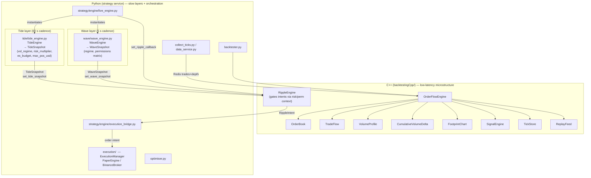
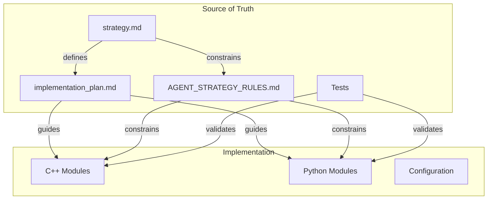
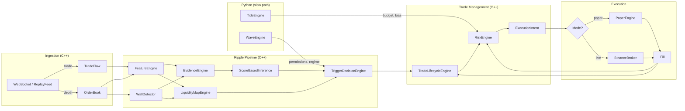

# Tide / Wave / Ripple — Implementation Plan

## 1. Purpose

This document translates the strategy design defined in `strategy.md` into a concrete, phased implementation program for the existing mixed C++ / Python application. It specifies module boundaries, language responsibilities, incremental build phases, testing requirements, performance targets, and acceptance criteria.

**Source of truth hierarchy:**
1. `strategy.md` — canonical strategy definition
2. `implementation_plan.md` — this document; how to build it
3. Tests — executable specification
4. `AGENT_STRATEGY_RULES.md` — operational rules for coding agents

---

## §1A — 2026 Service Refactor (Architecture Evolution)

> **Effective 2026-06-01.** The original monolith (`root main.py` CLI + Qt desktop UI `ui/`) was removed and replaced by a distributed Docker Compose stack. All references to `§1A` in this document point here.

### What changed

| Was (Phase 1–14 monolith) | Is now (distributed service, current) |
|---|---|
| Root `main.py` with `data / backtest / optimise / execute` CLI modes | **Removed.** Entry point is `strategy/main.py` (`uvicorn strategy.main:app`). |
| Qt desktop UI (`ui/main_window.py`, `ui/live_trading_session.py`) drove live loop | **Removed** (commit `317787f`). Live visualisation is external via Bookmap. |
| In-process WS → `execution/live_runner.py` (Ripple-driven, risk-gated, broker orders) | Retained as dev/Bookmap transport; primitives imported by the `strategy` service. |
| Single process | Three Docker services: `redis`, `data` (`collect_ticks.py`), `strategy` (`uvicorn strategy.main:app`). |

### Current deployed stack

```
┌──────────────────────────────────────────────────────────────┐
│  docker compose up                                           │
│                                                              │
│  data service         strategy service         redis         │
│  collect_ticks.py  →  strategy/main.py    ←→  pub/sub bus    │
│  data_service.py      live_engine.py                         │
│                       execution_bridge.py                    │
│                       REST: /api/backtest                    │
│                              /api/optimise                   │
│                              /api/execution                  │
│                              /api/execution/arm              │
└──────────────────────────────────────────────────────────────┘
```

### Live execution postures (post-Phase 21)

| Posture | How | Broker orders? |
|---|---|---|
| **OBSERVE** (default) | `ARM_EXECUTION=false` (default) | None — full pipeline runs, zero orders |
| **PAPER** | `ARM_EXECUTION=true EXECUTION_BROKER=paper` | Simulated fills only |
| **LIVE** | `ARM_EXECUTION=true EXECUTION_BROKER=binance` + `POST /api/execution/arm` | Real Binance orders |

### Impact on V1 compliance

The 2026-06 service refactor orphaned all Phase 14 V1-compliant execution machinery — the engine code and tests existed but nothing called them on the deployed path. **Phase 21 (2026-06-01)** re-closed the V1 contract on the deployed `strategy` service via `strategy/engine/live_engine.py` + `strategy/engine/execution_bridge.py`. See §7.2 Phase 21 for full details.

---

## 2. Assumptions About the Existing Codebase

### 2.1 Current Architecture

> **Architecture evolution (2026-06-01).** During the 2026 service
> refactor the monolith was replaced by a distributed Docker Compose
> stack. The root `main.py` CLI and Qt `ui/` desktop app were removed.
> Phase 21 (2026-06-01) re-closed the V1 live-execution contract on
> the deployed `strategy` service; see §7.2 and the Phase 21 spec.

| Was (Phase 1–14 monolith) | Is now (current) |
|---|---|
| Root `main.py` with `data` / `backtest` / `optimise` / `execute` CLI modes | **Removed.** Entry point is `strategy/main.py` (`uvicorn strategy.main:app`). |
| Qt desktop UI (`ui/main_window.py`, `ui/live_trading_session.py`) drove the live loop | **Removed** (commit `317787f`). Live visualisation is external via Bookmap. |
| In-process WS → `execution/live_runner.py` (Ripple-driven, risk-gated, broker orders) | Retained as dev/Bookmap transport; primitives imported by the `strategy` service. |
| Single process | Three Docker services: `redis`, `data` (`collect_ticks.py`), `strategy` (`uvicorn strategy.main:app`). |

The application is a mixed C++ / Python system with pybind11 bridging.



### 2.2 Existing Capabilities

> **Integration legend.** **Implemented + Wired** = unit-tested AND
> exercised on the deployed live runtime path. **Implemented (engine
> only)** = unit-tested in C++ / Python but not yet on any deployed live
> entry point — the live path runs against the relevant `Default*`
> snapshot. The "wired live?" column is the V1 closure axis tracked by
> Phase 14 in §7.1 and Phase 21 in §7.2.
>
> **2026-06-01 update (Phase 21 complete):** the "✅ wired live" marks
> in the execution/Tide/Wave/Risk rows originally reflected the
> *pre-refactor* monolith (root `main.py` + Qt `ui/`). Both were removed
> in the 2026 service refactor; Phase 21 (2026-06-01) re-closed the gap
> on the **distributed `strategy` service** (`strategy/engine/live_engine.py`
> + `strategy/engine/execution_bridge.py`). All rows are now accurate
> against the deployed service.

| Capability | Status | Wired live? | Location |
|---|---|---|---|
| Binance L2 depth ingestion (live) | Implemented + Wired (Phase 10 / 16P) | ✅ `data` service: `collect_ticks.py` → `data_service.py` → `data_feed/binance_futures_ws.py`; publishes depth to Redis `depth:{SYM}` | `data_feed/binance_futures_ws.py`, `OrderBook` |
| Binance trade ingestion (live) | Implemented + Wired (Phase 10 / 16P) | ✅ `data` service: same pipeline; publishes trades to Redis `trades:{SYM}` | `data_feed/binance_futures_ws.py`, `TradeFlow` |
| Redis pub/sub bus | Implemented + Wired (Phase 16P) | ✅ `data` service publishes; `strategy` service subscribes | `strategy/engine/live_engine.py::_consume_trades` / `_consume_depth` |
| Order book maintenance | Implemented + Wired | ✅ | `OrderBook` |
| Volume Profile | Implemented + Wired | ✅ | `VolumeProfile` (C++) |
| CVD | Implemented + Wired | ✅ | `CumulativeVolumeDelta` (C++) |
| Ripple engine | Implemented + Wired (Phase 2/3) | ✅ | `ripple/` |
| Wall detection | Implemented + Wired | ✅ | `WallDetector` |
| Feature extraction | Implemented + Wired | ✅ | `RippleFeatureEngine` |
| Evidence scoring | Implemented + Wired | ✅ | `RippleEvidenceEngine` |
| Score-based inference | Implemented + Wired | ✅ | `ScoreBasedInference` |
| HMM inference | Implemented (Phase 7) + A/B-validated (Phase 7V) | ⚠️ Engine-only (opt-in via `hmm_enabled=True`) | `HMMBasedInference`, `hmm/`, `tools/hmm_abtest.py` |
| Tide layer (research) | Implemented + Wired (Phase 4 / 14B / **21**) | ✅ `TideEngine` instantiated per symbol; snapshot pushed on 60 s cadence by `_run_layered_push_loop` in the `strategy` service (Phase 21, 2026-06-01) | `tide/`, `RiskEngine` (C++) |
| Wave layer (research) | Implemented + Wired (Phase 5 / 14B / **21**) | ✅ `WaveEngine` instantiated per symbol; `on_price` fed from Redis trade stream; snapshot pushed on 5 s cadence by `_run_layered_push_loop` (Phase 21, 2026-06-01) | `wave/`, `WaveSnapshot` (C++) |
| Risk budget enforcement (live) | Implemented + Wired (Phase 4 / 14B / **21**) | ✅ `set_risk_budget` called on 60 s cadence. `intent_risk_block_reason` gates entries before broker dispatch. Phase 14C acceptance suite + `tests/test_strategy_live_engine.py` (Phase 21) pin zero-broker-order behaviour under ES exhausted / Tide CRISIS / max_position exceeded on the `strategy` service path. | `RiskEngine` (C++), `execution.models.intent_risk_block_reason`, `strategy/engine/execution_bridge.py` |
| Wave permissions enforcement (live) | Implemented + Wired (Phase 5 / 14B / **21**) | ✅ `set_wave_snapshot` called on 5 s cadence; Wave-DISABLED entries blocked by `intent_risk_block_reason` on the service path. Pinned by Phase 14C + Phase 21 acceptance suites. | `RippleEngine`, `TriggerDecisionEngine`, `execution.models.intent_risk_block_reason` |
| Live execution (Ripple-driven, risk-gated) | Implemented + Wired (Phase 14A–14C / **Phase 21**) | ✅ `strategy/engine/execution_bridge.py` wires `set_ripple_callback` → gate → `ExecutionManager` / `PaperEngine` / OBSERVE. Opt-in via `ARM_EXECUTION=true` (default OBSERVE). | `strategy/engine/live_engine.py`, `strategy/engine/execution_bridge.py` |
| Tick data storage | Implemented + Wired | ✅ | `TickStore` (HDF5) |
| Replay feed | Implemented + Wired | ✅ | `ReplayFeed` |
| Paper trading engine | Implemented + Wired (Phase 6 + **Phase 15** LIMIT/OCO) | ✅ Available as `EXECUTION_BROKER=paper`. Phase 15 added LIMIT fill simulation (priority queue, cross condition), partial-fill tracking (`OPEN/PARTIAL/FILLED/CANCELLED`), OCO sibling cancellation, order timeout. | `PaperEngine`, `tests/test_paper_engine_limit.py` |
| Binance broker | Implemented + Wired (REST + WS + **Phase 15** LIMIT/OCO) | ✅ Available via `ARM_EXECUTION=true EXECUTION_BROKER=binance`. Phase 15 added LIMIT order routing (`price` + `timeInForce=GTC`), `cancel_order`, `place_oco` (LIMIT + STOP_MARKET pair), partial-fill polling. | `BinanceBroker`, `tests/test_binance_broker_limit.py` |
| LIMIT / OCO order routing | Implemented + Wired (Phase 15, 2026-05-12) | ✅ `ExecutionManager` routes by urgency: NORMAL → LIMIT at `reference_price`; IMMEDIATE → MARKET. Exits never blocked by missing price (fallback MARKET + `LIMIT_FALLBACK` log). OCO pairs for simultaneous stop + target. | `execution/execution_manager.py`, `execution/broker_interface.py`, `tests/test_execution_manager_routing.py` |
| Execution manager | Implemented (Phase 12-tested + Phase 14A-rewired + Phase 15 LIMIT routing + **Phase 21**) | ✅ Wired via `ExecutionBridge` → `on_intent` (event-time cooldown). Deprecated `on_signal` surface removed in Phase 14F. LIMIT/MARKET routing per intent urgency (Phase 15). | `ExecutionManager` |
| NSGA-II optimizer | Implemented (Phase 6 + Phase 14E) | ✅ REST: `POST /api/optimise` | `optimiser.py` — three-axis Pareto (cagr, sharpe_ratio, num_trades) post-14E |
| Backtest | Implemented | ✅ REST: `POST /api/backtest` | `strategies/orderflow.py`, `strategy/api/rest_routes.py` |
| Oanda L1 connector | Implemented | ⚠️ Used by `crossvenue/oanda_feed.py` for backtest only; live path not wired. **⬜ OPEN TASK (Phase 18)**: Wire `oanda_feed.py` into the `data` service alongside Binance tick collection so cross-venue data is available at live inference time. Effort ~1 day. | `exchanges/oanda.py` |
| Binance L1 connector | Implemented | ✅ | `exchanges/binance.py` |
| Cross-venue features → Wave regime | Implemented (Phase 8 + Phase 14D) | ✅ | `crossvenue/`, `wave/wave_engine.py`; boost factors are `WaveConfig.crossvenue_divergence_boost` / `crossvenue_correlation_boost` post-14D |
| Deterministic replay capture / verifier | Implemented + Wired (Phase 13 / 13B) | ✅ | `tools/session_recorder.py`, `tools/replay_harness.py` |
| HMM A/B validation harness | Implemented + Wired (Phase 7V) | ✅ | `tools/hmm_abtest.py`, `hmm/abtest.py` |
| Execution diagnostics REST API | Implemented (Phase 21) | ✅ | `GET /api/execution`, `POST /api/execution/arm` |

### 2.3 What Exists vs. What Needs Building

> **Read this column carefully.** "Needs Work" entries marked **`Phase 14*`**
> are V1 closure blockers — they must ship before V1 is GA. "Needs Work"
> entries marked **`(later)`** are V2/V3 scope per `strategy.md` §23 and
> are explicitly out-of-scope for V1.

| Component | Exists | Needs Work | Phase |
|---|---|---|---|
| Feature schema | **Formalized** | — | 1 (done) |
| Data contracts / schemas | **Implemented** (C++ `Schemas.h`, Python `schemas.py`) | — | 1 (done) |
| Permissions matrix (data contract) | **Implemented + Wired** (`PermissionSet`) | Wave snapshot pushed to live C++ engine on 5 s cadence since Phase 14B (2026-05-11) | 1 (done) / 14B (done 2026-05-11) |
| Trade lifecycle FSM | **Implemented + Wired** (`TradeLifecycleEngine`) | Live path consumes Ripple intents post-Phase 14A | 2 (done) / 14A (done 2026-05-09) |
| Trade archetypes | **Implemented + Wired** (bounce/breakout in lifecycle + trigger) | Archetype-tagged intents flow live post-Phase 14A | 2 (done) / 14A (done 2026-05-09) |
| Exit taxonomy | **Implemented + Wired** (5 exit types) | Live path fires `EXIT_BOUNCE` / `EXIT_BREAKOUT` intents post-Phase 14A | 2 (done) / 14A (done 2026-05-09) |
| Scaling logic | **Implemented** (scale-in + scale-out + trailing stop) | Scale-in/-out intents reach `ExecutionManager.on_intent` post-14A; broker-side execution of partial scale-outs is V2 (LIMIT support) | 2+3 (done) / 14A (done 2026-05-09) |
| Ripple state machine | **Integrated** (ScoreBased + lifecycle FSM + liquidity map) | — | 2+3 (done) |
| Liquidity map | **Implemented** (`LiquidityMapEngine`) | Probabilistic hold/break (later, V2) | 3 (done) |
| Hold/break/dest scoring | **Implemented** (deterministic thresholds) | Logistic model calibration (later, V2) | 3 (done) |
| CVD integration in Ripple | **Integrated** (divergence → evidence boost, features) | — | 3 (done) |
| VP integration in Ripple | **Integrated** (POC, value area, HVN/LVN in map) | — | 3 (done) |
| Scale-out plan | **Implemented** (map destinations → up to 3 targets) | — | 3 (done) |
| Risk budgeting | **Implemented + Wired** (`RiskEngine`) | Tide budget pushed to `strategy` service engine on 60 s cadence (Phase 14B + Phase 21). `intent_risk_block_reason` gate wired on deployed path (Phase 21). Acceptance tests: `test_live_execution_v1_compliance.py` + `test_strategy_live_engine.py`. Hierarchical ES (later, V2). | 4 (done) / 14B + 14C (done) / 21 (done 2026-06-01) |
| Tide layer | **Implemented + Wired** (`TideEngine` Python) | Tide snapshot pushed on 60 s cadence by `_run_layered_push_loop` in the `strategy` service (Phase 21, 2026-06-01). Dynamic macro features (later, V2). | 4 (done) / 14B (done) / 21 (done 2026-06-01) |
| Wave layer | **Implemented + Wired** (`WaveEngine` Python, C++ integration) | Wave snapshot pushed on 5 s cadence; `WaveEngine.on_price` fed from Redis trade stream in the `strategy` service (Phase 21, 2026-06-01). HMM classifier (V2); multi-asset features (V3). | 5 (done) / 14B (done) / 21 (done 2026-06-01) |
| Cross-venue boost factors | ✅ **CLOSED 2026-05-11** — lifted to `WaveConfig.crossvenue_divergence_boost` / `crossvenue_correlation_boost` (Phase 14D) | — | 8 (done) / 14D (done) |
| Replay determinism | **Verified** (`test_replay_determinism.py`) | — | 6 (done) |
| Performance benchmark | **Verified** (`benchmark_pipeline`, P99 < 100 µs) | — | 6 (done) |
| Strategy snapshot | **Implemented** (`get_strategy_snapshot()` on `OrderFlowEngine`) | — | 6 (done) |
| Optimization (Ripple+Wave) | ✅ **CLOSED 2026-05-11** — three-axis NSGA-II (cagr, sharpe_ratio, num_trades) post-14E | — | 6 (done) / 14E (done) |
| Paper fills | **Implemented + Wired** (`paper_fills` flag, consumes `RippleDecision`) | — | 6 (done) |
| PnL tracking | **Implemented + Wired** (cumulative PnL in lifecycle) | — | 6 (done) |
| Live execute event-time discipline | **Event-time cooldown** (`_last_intent_ts_ms` + `_cooldown_ms`) on the canonical `on_intent` path post-Phase 14A | ✅ Phase 14F deleted the deprecated `on_signal` / `_execute_signal` shim entirely; `import time` is no longer in `execution/execution_manager.py` so wall-clock reads on the decision path are impossible by construction | 12 (done) / 14A (done 2026-05-09) / 14F (done 2026-05-12) |
| HMM Ripple inference | **Implemented + A/B-validated** | Multi-symbol / multi-window campaign (V2 polish) | 7 (done) / 7V (done) |
| Cross-venue confirmation | **Implemented (engine-only)** | A/B validation campaign (V2 polish) | 8 (done) |
| Deterministic replay capture | **Implemented + Wired** | In-process WS path (`execution/live_runner.py` with `recorder=`). Phase 13C (replay UI) deferred. | 13 (done) / 13B (done) |

---

## 3. Service / Mode Mapping

> The table below reflects the current deployed architecture. For the
> full monolith → distributed migration history, see §2.1.

### 3.1 Service Responsibilities

| Service / mode | Tide | Wave | Ripple | Execution | Storage |
|---|---|---|---|---|---|
| `data` service (`collect_ticks.py`, `data_service.py`) | — | — | — | — | Binance WS → HDF5 / Parquet; publishes to Redis `trades:{SYM}` / `depth:{SYM}` |
| `ohlcv-collector` service (`collect_ohlcv.py`) | — | — | — | — | Binance / Oanda OHLCV → Parquet / S3 |
| `strategy` service — backtest (`POST /api/backtest`) | Replay or fixed | Replay or deterministic | Full pipeline | Paper fills | Read stored events |
| `strategy` service — optimise (`POST /api/optimise`) | Parameter search | Parameter search | Parameter search | Paper fills | Read stored events |
| `strategy` service — live (`ARM_EXECUTION=true`) | Live computation (60 s cadence) | Live computation (5 s cadence) | Full pipeline | OBSERVE / PAPER / LIVE via `ExecutionBridge` | Redis stream |

### 3.2 Mode-Specific Constraints

- **`data` / `ohlcv-collector` services**: No strategy logic runs. Only event ingestion and storage.
- **backtest**: Must be deterministic. Uses `ReplayFeed`. All randomness seeded. Tide/Wave may be fixed or replayed.
- **optimise**: Runs backtest in a loop with parameter variation. Must be parallelizable. Each run is deterministic.
- **live (`ARM_EXECUTION=true`)**: Full live pipeline. Ripple-driven decisions gated by `intent_risk_block_reason` (Wave permissions, ES budget, Tide risk multiplier, max_position). Fills routed to `BinanceBroker`. Default posture is `OBSERVE` (zero broker orders) until explicitly armed.

### 3.3 Entry Points

| Task | How to invoke |
|---|---|
| Start full stack (local dev) | `docker compose up` |
| EC2 data collection | `docker compose up -d` (see `docs/DEPLOYMENT.md`) |
| Backtest | `curl -X POST http://localhost:8000/api/backtest -d '{...}'` |
| Optimise | `curl -X POST http://localhost:8000/api/optimise -d '{...}'` |
| Check execution status | `curl http://localhost:8000/api/execution` |
| Arm live execution | `curl -X POST http://localhost:8000/api/execution/arm -d '{"armed":true}'` |
| Python unit tests | `python -m unittest discover -s tests -v` |
| Tide / Wave research CLIs | `python -m tide.tide_cli` / `python -m wave.wave_cli` |

---

## 4. Language Responsibility Mapping

### 4.1 C++ Responsibilities

| Module | Responsibility |
|---|---|
| `OrderBook` | L2 order book maintenance, snapshot, levels |
| `TradeFlow` | Trade event processing, aggressor classification |
| `VolumeProfile` | Volume-at-price aggregation |
| `CumulativeVolumeDelta` | CVD computation |
| `WallDetector` | Wall detection and quality scoring |
| `RippleFeatureEngine` | Microstructure feature computation (imbalance, microprice, OFI, impact) |
| `RippleEvidenceEngine` | Evidence scoring for liquidity transitions |
| `ScoreBasedInference` | Deterministic rule-based liquidity state inference |
| `HMMBasedInference` | Probabilistic latent-state inference (V2+) |
| `TriggerDecisionEngine` | Trade archetype detection and decision generation |
| `RippleStateTracker` | State dwell tracking, deduplication |
| `TradeLifecycleEngine` | Trade lifecycle FSM (entry → exit) |
| `LiquidityMapEngine` | Real-time liquidity map |
| `RiskEngine` | ES computation, budget checks on hot path |
| `TickStore` | HDF5 storage for events |
| `ReplayFeed` | Deterministic replay (sole remaining `IDataFeed` consumer) |
| `bindings.cpp` | pybind11 exports |

### 4.2 Python Responsibilities

| Module | Responsibility |
|---|---|
| `strategy/main.py` | FastAPI entry point (`uvicorn strategy.main:app`); reads env vars, instantiates `LiveEngine`, registers REST router |
| `strategy/engine/live_engine.py` | Headless multi-symbol live engine; consumes Redis trade/depth streams; drives C++ engines; spawns `_run_layered_push_loop` threads per symbol |
| `strategy/engine/execution_bridge.py` | Per-symbol gate + dispatch: resolves `ExecutionMode` (OBSERVE / PAPER / LIVE), applies `intent_risk_block_reason`, routes to `ExecutionManager` / `PaperEngine` |
| `strategy/api/rest_routes.py` | REST control plane: `GET /api/execution`, `POST /api/execution/arm`, backtest, optimise, health |
| `execution/models.py` | Order/position models, C++ → Python mapping, `ripple_decision_to_intent`, `intent_risk_block_reason` |
| `execution/paper_engine.py` | Paper fills (simulated from `RippleDecision` intents) |
| `execution/binance_broker.py` | Live fills (REST + WS; MARKET orders) |
| `execution/execution_manager.py` | Execution orchestration (event-time cooldown, position sizing, arm/disarm) |
| `execution/live_runner.py` | In-process WebSocket transport for local dev / Bookmap publisher loop; reuses the same V1 primitives as the `strategy` service |
| `strategies/orderflow.py` | Python wrapper for C++ backtest; `run_live` retained for test/dev use |
| `backtester.py` | Backtest orchestration |
| `optimiser.py` | NSGA-II parameter optimization (three-axis Pareto post-14E) |
| `collect_ticks.py` / `data_service.py` | Data service: Binance WebSocket → HDF5 / Parquet; publishes to Redis |
| `collect_ohlcv.py` / `ohlcv_store.py` | OHLCV collector: Binance / Oanda → Parquet / S3 |
| `tide/` | Tide layer (Python for research; snapshot pushed to C++ engine on 60 s cadence) |
| `wave/` | Wave layer (Python for research; snapshot pushed to C++ engine on 5 s cadence) |
| `analytics/` | Offline analytics, labeling, model training |

### 4.3 Why This Split

- **C++ for the hot path:** event-by-event processing, order book operations, feature computation, state machine transitions, risk checks — all must be fast and deterministic.
- **Python for research and orchestration:** model fitting, parameter optimization, analytics, UI, and any workflow that does not need per-event latency.
- **pybind11 bridge:** all C++ state machines and engines expose read-only snapshots and configuration setters to Python.

---

## 5. Canonical Source-of-Truth Architecture



**Rule:** If code behavior contradicts `strategy.md`, the code is wrong. If `implementation_plan.md` contradicts `strategy.md`, the plan must be updated. Tests are executable specifications and must agree with `strategy.md`.

---

## 5.1 Pre-Phase Defaults

Before each layer is implemented, downstream consumers use hardcoded defaults. These are defined in `strategy.md` §7.5.

**Before Tide is implemented (Phases 2–3):**

| Output | Default | Source |
|---|---|---|
| `tide.bias` | `NEUTRAL` | `DefaultTideSnapshot` (C++) |
| `tide.risk_multiplier` | `1.0` | `DefaultTideSnapshot` |
| `tide.max_position_usd` | From config file | `StrategyConfig.tide.max_position_usd` |
| `tide.es_budget` | From config file | `StrategyConfig.tide.es_budget_global` |
| `tide.vol_regime` | `NORMAL` | `DefaultTideSnapshot` |

**Before Wave is implemented (Phases 2–4):**

| Output | Default | Source |
|---|---|---|
| `wave.regime` | `NEUTRAL` | `DefaultWaveSnapshot` (C++) |
| `wave.permissions` | All `FULL` | `DefaultWaveSnapshot` |
| `wave.trend_efficiency` | `0.5` | `DefaultWaveSnapshot` |

**Implementation requirement:** Define `DefaultTideSnapshot` and `DefaultWaveSnapshot` as `static constexpr` structs in C++ (e.g., in `Schemas.h`) and as constants in Python (`schemas.py`). These must be used wherever Tide/Wave snapshots are consumed before those layers exist.

---

## 6. Required Modules and Interfaces

### 6.1 New C++ Modules

#### 6.1.1 `TradeLifecycleEngine`

Manages the lifecycle of a single trade from SETUP through COOLDOWN. In V1, at most one trade is active per symbol (see strategy.md §12.3).

```
class TradeLifecycleEngine {
public:
    // Attempt to begin a new trade. Returns false if a trade is already active.
    bool try_setup(TradeArchetype archetype, Side side, double wall_price,
                   double stop_price, int64_t timestamp);

    // Check whether the current archetype is allowed by Wave permissions.
    bool is_permitted(const PermissionSet& permissions) const;

    void on_fill(const Fill& fill);
    void on_tick(int64_t timestamp, const RippleSnapshot& ripple,
                 const LiquidityMapSnapshot& lmap, const PermissionSet& permissions);
    void on_exit_signal(ExitType type, int64_t timestamp);

    TradeState get_state() const;
    LifecycleState get_lifecycle_state() const;  // SETUP, ENTRY, CONFIRMATION, etc.
    bool is_active() const;       // true if in CONFIRMATION, EXPANSION, or MATURATION
    bool is_idle() const;         // true if no trade (terminal or COOLDOWN expired)
    bool should_scale_in() const;
    bool should_scale_out() const;
    double get_stop_price() const;
    double get_target_price() const;
    ExecutionIntent get_pending_intent() const;  // next action for execution layer
};
```

**Note:** `LifecycleState` is an enum with values matching strategy.md §12.1: `SETUP`, `ENTRY`, `CONFIRMATION`, `EXPANSION`, `MATURATION`, `EXIT`, `COOLDOWN`, `CANCELLED`.

#### 6.1.2 `LiquidityMapEngine`

Maintains a real-time liquidity map combining resting depth, traded volume, aggressive flow, and structural anchors. Maximum tracked levels is bounded (see strategy.md §21.1).

```
class LiquidityMapEngine {
public:
    void update(const OrderBook& book, const VolumeProfile& vp,
                const TradeFlow& trade_flow, const std::vector<Wall>& walls,
                double vwap, double session_high, double session_low,
                int64_t timestamp);

    LiquidityMapSnapshot get_snapshot() const;
    double get_hold_score(double price) const;
    double get_break_score(double price) const;   // = 1 - hold_score
    double get_dest_score(double price) const;
    std::vector<VoidCorridor> get_void_corridors() const;

    // Nearest significant levels relative to current price
    double get_nearest_bid_wall() const;
    double get_nearest_ask_wall() const;
    double get_poc() const;

    size_t level_count() const;  // for diagnostics
};
```

#### 6.1.3 `RiskEngine`

Enforces ES budget constraints on the hot path. Uses the parametric ES approximation from strategy.md §15.2 with configurable α (default 0.95).

```
class RiskEngine {
public:
    void set_budget(double es_budget, double max_position_usd, double risk_multiplier);
    void set_volatility(double realized_vol);  // updated by Tide at minute cadence
    void on_fill(const Fill& fill);
    void on_price_update(double price, int64_t timestamp);

    bool check_new_order(double quantity, double price) const;
    double get_allowed_size(double desired_quantity, double price) const;
    double get_consumed_es() const;
    double get_remaining_budget() const;
    bool is_budget_exhausted() const;  // consumed_es >= es_budget
    RiskBudgetSnapshot get_snapshot() const;
};
```

**Performance:** `check_new_order` and `get_allowed_size` are pure arithmetic — no allocation, no branching beyond a single comparison. Target: < 1 µs.

### 6.2 New Python Modules

#### 6.2.1 `tide/tide_engine.py`

```python
class TideEngine:
    def update(self, timestamp: int, market_data: dict) -> TideSnapshot:
        """Recompute Tide state from macro inputs."""

    def get_snapshot(self) -> TideSnapshot:
        """Return current Tide state."""

    def get_risk_budget(self, strategy: str, asset: str) -> RiskBudget:
        """Return ES budget for a strategy×asset cell."""
```

#### 6.2.2 `wave/wave_engine.py`

```python
class WaveEngine:
    def update(self, timestamp: int, l1_prices: dict) -> WaveSnapshot:
        """Recompute Wave state from L1 data."""

    def get_snapshot(self) -> WaveSnapshot:
        """Return current Wave state."""

    def get_permissions(self) -> PermissionSet:
        """Return current trade archetype permissions."""
```

### 6.3 Shared Schemas and Serialization

All data contracts defined in `strategy.md` §17 must have:
1. A C++ struct definition in `Types.h` (or a dedicated `Schemas.h`).
2. A Python dataclass in a shared `schemas.py` module.
3. pybind11 bindings for cross-language access.
4. Optional serialization to JSON or MessagePack for storage and diagnostics.

**Required contracts (strategy.md §17):**

| Contract | §17 ref | Primary consumer |
|---|---|---|
| Market Event | §17.1 | All engines |
| Trade Event | §17.2 | TradeFlow, RippleFeatureEngine |
| Depth Update | §17.3 | OrderBook |
| Feature Snapshot | §17.4 | Analytics, UI |
| Wave State | §17.5 | TriggerDecisionEngine |
| Ripple State | §17.6 | TriggerDecisionEngine, UI |
| Trade State | §17.7 | TradeLifecycleEngine, UI |
| Risk Budget Snapshot | §17.8 | RiskEngine, UI |
| Liquidity Map Snapshot | §17.9 | LiquidityMapEngine, TradeLifecycleEngine |
| Fill Event | §17.10 | TradeLifecycleEngine, RiskEngine |
| Wall | §17.11 | WallDetector, LiquidityMapEngine |
| Permission Set | §17.12 | WaveEngine, TriggerDecisionEngine |
| Tide Snapshot | §17.13 | TideEngine, RiskEngine |
| Execution Intent | §17.14 | TradeLifecycleEngine, Execution Layer |

**Consistency rule:** The C++ struct and Python dataclass must have identical field names, types, and semantics. Changes to one must be reflected in the other and in `strategy.md` §17.

### 6.4 Per-Event Data Flow



---

## 7. Incremental Implementation Phases

### Phase 1 — Schema, Contracts, and Configuration [COMPLETED]

**Objective:** Formalize the data contracts, feature schema, and configuration surface as code. No behavioral changes.

**Scope:**
- Define C++ structs for all data contracts (§17 of strategy.md).
- Define Python dataclasses mirroring the C++ structs.
- Define pybind11 bindings for all new types.
- Define a `StrategyConfig` struct/class with all configurable parameters organized by layer (tide, wave, ripple, risk, execution).
- Define the feature schema as a code-level registry (namespace → feature name → type, cadence, category).
- Add configuration loading/saving to the existing QSettings or a dedicated JSON config file.

**What NOT to implement yet:**
- No behavioral changes to existing Ripple logic.
- No new trade archetypes.
- No risk engine.
- No Tide or Wave computation.

**Test requirements:**
- Serialization round-trip tests for all new types.
- Config load/save tests.
- pybind11 binding tests (construct in Python, read fields).

**Success criteria:**
- All data contracts from strategy.md §17 exist as compilable C++ structs and Python dataclasses.
- All configurable parameters from strategy.md are present in `StrategyConfig` with sensible defaults.
- Feature schema is enumerable and queryable.
- No existing tests break.

**Performance considerations:**
- None; this phase is purely structural.

**Completion notes:**
- All data contracts from `strategy.md` §17 implemented as C++ structs in `Schemas.h` and Python dataclasses in `schemas.py`.
- Canonical enums: `TideBias`, `VolRegime`, `WaveRegime`, `Permission`, `TradeArchetype`, `TradeSide`, `LifecycleState`, `ExitType`, `RippleIntent`, `LiquidityState`, `FeatureCategory`.
- `StrategyConfig` with full layer-organized parameters and JSON serialization.
- Feature registry with 54 features matching `strategy.md` §16.
- `DefaultTideSnapshot` and `DefaultWaveSnapshot` as `static constexpr` structs.
- `StrategySnapshot` aggregation type with deterministic serialization.
- pybind11 bindings for all new types.
- Tests: 396 C++ checks (`test_schemas`), 56 Python tests (`test_schemas.py`).

---

### Phase 2 — Deterministic Ripple Baseline [COMPLETED]

**Objective:** Implement the core Ripple execution logic: trade archetypes, trade lifecycle state machine, exit taxonomy, and basic scaling.

**Scope:**
- Implement `TradeLifecycleEngine` in C++ with the state machine from strategy.md §12.
- Implement bounce and breakout trade archetype detection in `TriggerDecisionEngine` using the pseudocode from strategy.md §11.1.1 and §11.2.1.
- Implement five exit types using the detection conditions from strategy.md §13.3.
- Implement scale-in logic per strategy.md §14.1.1 (only after `CONFIRMATION` state, only in `EXPANSION`).
- Implement scale-out algorithm per strategy.md §14.2.1 (at predefined liquidity destination fractions).
- Implement trailing stop per strategy.md §14.3.
- Wire `TradeLifecycleEngine` into `RippleEngine` so that Ripple manages open trades.
- Wire `DefaultTideSnapshot` and `DefaultWaveSnapshot` as upstream inputs (see §5.1).
- Expose trade state to Python via pybind11.

**Explicit file deliverables:**

| File | What to create/modify |
|---|---|
| `backtestingCpp/orderflow/ripple/TradeLifecycleEngine.h/cpp` | New: lifecycle FSM, state transitions, exit checks |
| `backtestingCpp/orderflow/ripple/TriggerDecisionEngine.h/cpp` | Extend: bounce/breakout detection per §11.1.1, §11.2.1 |
| `backtestingCpp/orderflow/Schemas.h` | Add: `TradeState`, `ExecutionIntent`, `LifecycleState` enum, `DefaultTideSnapshot`, `DefaultWaveSnapshot` |
| `backtestingCpp/orderflow/ripple/RippleEngine.h/cpp` | Wire: lifecycle engine into per-event path |
| `backtestingCpp/bindings.cpp` | Extend: expose `TradeState`, `LifecycleState`, `ExecutionIntent` to Python |
| `tests/test_trade_lifecycle.cpp` | New: unit tests for all FSM transitions and exit types |
| `tests/test_trigger_detection.cpp` | New: unit tests for bounce/breakout detection |

**V1 operating assumptions enforced in this phase (see strategy.md §22.1):**
- Single symbol at a time.
- At most one concurrent trade per symbol.
- Event-time only (no wall-clock in decision logic).

**What NOT to implement yet:**
- No liquidity map (use simple distance-based targets).
- No hold/break/destination scoring.
- No VP/CVD integration in trade decisions (only in existing feature computation).
- No risk budget enforcement (accept all sizes).
- No Tide or Wave.

**Test requirements:**
- Unit tests for every state transition in the lifecycle FSM.
- Unit tests for each exit type trigger.
- Unit tests for scale-in and scale-out conditions.
- Integration test: feed a sequence of events → verify correct trade lifecycle progression.
- Replay determinism test: same events → same decisions.

**Success criteria:**
- Trade lifecycle FSM correctly transitions through all states.
- Bounce and breakout archetypes are detected and managed.
- All five exit types function correctly.
- Scale-in/out logic respects the rules in strategy.md §14.
- Replay produces identical results.

**Performance considerations:**
- `TradeLifecycleEngine::on_tick` must be < 1 µs (simple conditionals).
- No allocations in the per-tick path.

**Completion notes:**

Delivered files:

| File | Action |
|---|---|
| `backtestingCpp/orderflow/ripple/RippleConfig.h` | Extended: added `LifecycleConfig` struct with all lifecycle parameters |
| `backtestingCpp/orderflow/ripple/TradeLifecycleEngine.h` | New: `TickContext` struct, `TradeLifecycleEngine` class declaration |
| `backtestingCpp/orderflow/ripple/TradeLifecycleEngine.cpp` | New: full FSM implementation — state transitions, 5 exit types, scale-in, trailing stop, intent generation |
| `backtestingCpp/orderflow/ripple/RippleEngine.h` | Extended: `TradeLifecycleEngine` member, `on_fill()`, trade state accessors |
| `backtestingCpp/orderflow/ripple/RippleEngine.cpp` | Extended: lifecycle integration in `run_pipeline()`, `TickContext` population, intent mapping from `RippleDecision` |
| `backtestingCpp/orderflow/bindings.cpp` | Extended: pybind11 bindings for `TickContext`, `LifecycleConfig`, `TradeLifecycleEngine`, and `RippleEngine` trade accessors |
| `backtestingCpp/orderflow/CMakeLists.txt` | Extended: new source/header files, `test_trade_lifecycle` target |
| `backtestingCpp/orderflow/ripple/tests/test_trade_lifecycle.cpp` | New: 99 test checks covering all FSM transitions, exit types, scaling, trailing stop, permissions, intents, determinism |

Post-review consistency fixes (strategy.md cross-reference):
- TARGET exit now uses LIMIT order with `limit_price = target_price_` per §13.3.2 (was MARKET).
- EXHAUSTION exit now uses LIMIT order with `limit_price = last_microprice_` per §13.3.3 (was MARKET).
- `unrealized_pnl` now computed in `get_snapshot()` as `(microprice - entry) * side_sign * qty` per §17.7 (was always 0).
- Added MATURATION → EXPANSION re-acceleration transition per §12.2 (was missing).
- Added `scale_out_count_` member to guard re-acceleration (prepares for Phase 3 scale-out).
- Added `last_microprice_` member for PnL computation and exhaustion exit limit price.

Key design decisions:
- `TickContext` decouples lifecycle from full `RippleContext`/`RippleFeatures`, keeping the interface minimal and testable.
- `LifecycleConfig` nested inside `RippleConfig` for hierarchical configuration.
- `DefaultRiskBudgetSnapshot` and `DefaultPermissionSet` used as upstream inputs at the time of Phase 2 (Tide/Wave were not yet implemented). Post-Phase 14B (2026-05-11), the live path pushes real `TideEngine` / `WaveEngine` snapshots into the C++ engine on a 60 s / 5 s cadence — the defaults remain as fallback when no snapshot has been published yet.
- Single-trade constraint enforced: `try_setup()` returns `false` if a trade is already active.
- All exit types evaluated in priority order: risk-budget > invalidation > time > target > exhaustion.
- Scale-in only in `EXPANSION` state with CVD momentum and volatility-threshold gates.
- Trailing stop tightens monotonically, never loosens.
- Intent-based execution model: lifecycle emits `StrategyExecutionIntent`, consumed by execution layer.

Tests: 126 C++ checks (`test_trade_lifecycle`) covering:
- Initial state, reset, idle/active queries
- `try_setup` (idle, active rejection, timeout cancellation)
- `confirm_entry` (success, failure, intent generation for BOUNCE/BREAKOUT)
- `on_fill` (entry fill → CONFIRMATION, entry price tracking)
- State progression: CONFIRMATION → EXPANSION → MATURATION
- All 5 exit types: invalidation (long/short), time, target, exhaustion, risk-budget
- Exit priority ordering
- Full exit flow: EXIT → COOLDOWN → idle
- Scale-in trigger, max scale-in limit, stop adjustment
- Trailing stop tightening
- Permission revocation exit
- External exit signals
- `TradeStateSnapshot` field validation
- Replay determinism (identical inputs → identical outputs)
- Post-cooldown re-entry
- Entry cancellation before fill
- Exit intent fields (`exit_reason`, `urgency`)
- Double exit signal protection
- Scale-in rejection outside EXPANSION state (CONFIRMATION guard)
- Scale-in rejection when CVD slope below threshold
- Exhaustion requires all three conditions simultaneously (partial condition tests)
- Exit from EXPANSION and MATURATION states specifically
- `unrealized_pnl` computation (LONG and SHORT)
- TARGET exit uses LIMIT order with `limit_price = target_price` (§13.3.2)
- EXHAUSTION exit uses LIMIT order with `limit_price = last microprice` (§13.3.3)
- INVALIDATION exit uses MARKET order (§13.3.1)
- MATURATION → EXPANSION re-acceleration (§12.2)
- Scale-in intent side correctness for SHORT trades

---

### Phase 3 — Liquidity Map and VP/CVD Integration [COMPLETED]

**Objective:** Build the real-time liquidity map and integrate Volume Profile and CVD signals into Ripple decision-making.

**Scope:**
- Implement `LiquidityMapEngine` in C++.
- Compute resting liquidity levels from walls.
- Compute traded liquidity levels from Volume Profile.
- Compute flow-pressure levels from trade flow.
- Compute structural anchors (VWAP, session high/low).
- Detect void corridors.
- Compute hold/break/destination scores per level.
- Wire CVD divergence into Ripple evidence scoring (extend `RippleEvidenceEngine`).
- Wire VP POC / value area into Ripple context.
- Use liquidity map destinations for target selection and scale-out.
- Backtest validation on historical data.

**What NOT to implement yet:**
- No probabilistic hold/break scoring (logistic model). Use deterministic thresholds.
- No Tide or Wave.
- No risk budget enforcement.

**Test requirements:**
- Unit tests for each liquidity map component (resting, traded, flow, structural, void).
- Unit tests for hold/break/destination score computation.
- Integration test: verify that liquidity map influences target selection.
- Backtest: run on at least 1 week of historical data, verify trade behavior is reasonable.
- Replay determinism test.

**Success criteria:**
- Liquidity map produces sensible levels for real market data.
- Targets and scale-out points are derived from the map.
- CVD divergence and VP context improve signal quality (measured by backtest).
- Replay deterministic.

**Performance considerations:**
- `LiquidityMapEngine::update` should be < 50 µs (bounded number of levels).
- Void corridor detection: < 10 µs.

**Completion notes:**

Delivered files:

| File | Action |
|---|---|
| `backtestingCpp/orderflow/ripple/RippleConfig.h` | Extended: added `LiquidityMapConfig` struct with scoring weights and void thresholds; added `scale_out_fractions` and `scale_out_count` to `LifecycleConfig`; added `cvd_divergence_boost` to `EvidenceWeights` |
| `backtestingCpp/orderflow/ripple/RippleTypes.h` | Extended: added `cvd_divergence_strength`, `cvd_divergence_detected`, `poc_price`, `distance_to_poc_ticks`, `vah`, `val` to `RippleFeatures` |
| `backtestingCpp/orderflow/ripple/LiquidityMapEngine.h` | New: `LiquidityMapInput` struct, `LiquidityMapEngine` class declaration |
| `backtestingCpp/orderflow/ripple/LiquidityMapEngine.cpp` | New: full implementation — wall level collection, VP profile levels (HVN/LVN/POC), structural anchors (VWAP), trade flow aggregation, void corridor detection, hold/break/dest scoring with min-max normalization, destination query |
| `backtestingCpp/orderflow/ripple/RippleEvidenceEngine.cpp` | Extended: added CVD divergence boost — bullish divergence strengthens absorption, bearish strengthens exhaustion (§9.9) |
| `backtestingCpp/orderflow/ripple/TradeLifecycleEngine.h` | Extended: added `ScaleOutTarget` struct, `set_scale_out_targets()` method, `check_scale_out()`, `emit_scale_out_intent()`, scale-out member variables |
| `backtestingCpp/orderflow/ripple/TradeLifecycleEngine.cpp` | Extended: scale-out plan storage, scale-out triggering in EXPANSION/MATURATION, scale-out fill handling with stop tightening and target advancement, `check_target_exit` defers to scale-out when targets remain |
| `backtestingCpp/orderflow/ripple/RippleEngine.h` | Extended: `LiquidityMapEngine` member, `VolumeProfile*`/`CumulativeVolumeDelta*` setters, liquidity map accessors, session VWAP/high/low tracking |
| `backtestingCpp/orderflow/ripple/RippleEngine.cpp` | Extended: VP/CVD feature overlay, liquidity map update in pipeline, map-based target selection and scale-out plan computation at trade entry, session VWAP tracking from trade flow |
| `backtestingCpp/orderflow/bindings.cpp` | Extended: pybind11 bindings for `LiquidityMapConfig`, `LiquidityMapEngine`, `ScaleOutTarget`, new `RippleFeatures` fields, new `TradeLifecycleEngine` scale-out methods, `RippleEngine.liquidity_map()` |
| `backtestingCpp/orderflow/CMakeLists.txt` | Extended: new source/header files, `test_liquidity_map` target |
| `backtestingCpp/orderflow/ripple/tests/test_liquidity_map.cpp` | New: 105 test checks covering all Phase 3 deliverables |

Key design decisions:
- `LiquidityMapInput` struct decouples the map engine from specific engine references, keeping it testable and deterministic.
- Void corridors detected by price gap analysis between significant levels (gap > `void_min_gap_sigma × σ_P`).
- Hold score computed only for wall levels; dest_score uses §10.3 weighted formula with min-max normalization.
- CVD divergence boost is additive and only activates when `cvd_divergence_detected` is true, preserving Phase 2 behavior when CVD engine is not available.
- Scale-out targets stored as a fixed-size array (max 3) in `TradeLifecycleEngine` — no heap allocation.
- Scale-out happens within EXPANSION/MATURATION without transitioning to EXIT; position reduces incrementally.
- VP and CVD are optional (non-owning pointers on RippleEngine); system degrades gracefully when not available.
- Session VWAP computed incrementally from trade flow (price × quantity accumulator).

Post-review consistency fixes (strategy.md cross-reference):
- `collect_wall_levels` now filters by `wall_min_quality` config per §10.2.1 (was accepting all active walls regardless of quality).
- First scale-out target's `new_stop` is updated to `entry_price` on entry fill per §14.2.1 (was using microprice at setup time, which may differ from actual fill price).
- Scale-out plan now adds remainder quantity to last target when fewer destinations than `scale_out_count`, per §14.2.1 pseudocode.
- Header comment on `LiquidityMapEngine` corrected: flow bucketing and profile classification use small transient allocations (not zero-alloc as previously stated).

Tests: 112 C++ checks (`test_liquidity_map`) covering:
- Empty input, wall-only levels, inactive wall exclusion
- VP profile levels (HVN, LVN, POC classification)
- Structural anchors (VWAP level)
- Trade flow merged into existing levels (net_flow computation)
- Void corridor detection (gap > threshold)
- No void when levels are close
- Hold score computation (wall quality, depth weighted)
- Dest score computation (depth, volume, VWAP proximity, structural flag)
- Destinations in direction (LONG and SHORT filtering)
- Max levels trimming
- Reset
- Determinism (identical inputs → identical outputs)
- Hold score zero for non-wall levels
- Mixed wall + profile levels
- Wall min quality filter: walls below `wall_min_quality` excluded (§10.2.1)
- Scale-out not triggered in CONFIRMATION state (guard test)
- First scale-out stop = `entry_price` after fill (§14.2.1 breakeven)
- CVD divergence boost: absorption strengthened by bullish divergence
- CVD divergence boost: exhaustion strengthened by bearish divergence
- No divergence → no change (Phase 2 backward compatibility)
- Scale-out target setup
- Scale-out triggers at target price with LIMIT order
- Scale-out fill advances target index and tightens stop
- All scale-outs done → trailing stop activates / cooldown
- Target exit deferred while scale-out targets remain
- Scale-out for SHORT trades (correct side)
- Invalidation exit takes priority during scale-out
- VP/CVD feature fields in RippleFeatures

---

### Phase 4 — Risk Budget Plumbing [COMPLETED]

**Objective:** Implement the risk engine, ES throttle, and Tide sizing interface.

**Scope:**
- Implement `RiskEngine` in C++ with simple global ES throttle (strategy.md §15.2).
- Implement position sizing formula (strategy.md §14.4).
- Wire risk checks into order submission path.
- Implement `TideEngine` in Python with basic risk multiplier and ES budget computation.
- Wire Tide outputs into Ripple via `RiskEngine`.
- Implement risk-budget exit type enforcement.

**What NOT to implement yet:**
- No hierarchical ES (sleeve/asset/cell budgets).
- No Euler decomposition.
- **No dynamic risk multiplier from macro features** ⬜ **V2 SCOPE (Phase 19)**: `TideEngine` docstring confirms *"No dynamic vol regime detection from market data / No macro feature ingestion."* `_vol_regime` and `_lsi` are set externally. **Task (Phase 19)**: implement ATR/realised-vol-percentile → `VolRegime` mapping and macro liquidity-stress index from on-chain/funding-rate data so `TideEngine` auto-classifies regime without external injection. Gated on Phase 16 verdict.
- No Wave.

**Test requirements:**
- Unit tests for ES estimation.
- Unit tests for position sizing formula.
- Unit tests for risk check (order rejected when budget exhausted).
- Integration test: position size throttled as budget consumed.
- Test: risk-budget exit triggers when budget approaches limit.

**Success criteria:**
- No position can exceed the global ES budget.
- Position sizing scales correctly with risk multiplier.
- Risk-budget exit triggers appropriately.
- Existing trade lifecycle and liquidity map tests still pass.

**Performance considerations:**
- `RiskEngine::check_new_order` must be < 1 µs (arithmetic only).
- Risk state update on fill: < 1 µs.

**Completion notes:**

Delivered files:

| File | Action |
|---|---|
| `backtestingCpp/orderflow/ripple/RiskEngine.h` | New: `RiskEngine` class declaration — ES computation, position sizing, order admission |
| `backtestingCpp/orderflow/ripple/RiskEngine.cpp` | New: full implementation — parametric ES (§15.2), 3-step position sizing (§14.4), fill tracking, price updates |
| `backtestingCpp/orderflow/ripple/RippleEngine.h` | Extended: `RiskEngine` member, `set_risk_budget()`, `set_realized_vol()`, `risk_engine()` accessors |
| `backtestingCpp/orderflow/ripple/RippleEngine.cpp` | Extended: risk-based position sizing at entry, risk check gating, real `RiskBudgetSnapshot` in lifecycle tick, fills routed to risk engine |
| `backtestingCpp/orderflow/bindings.cpp` | Extended: pybind11 bindings for `RiskEngine` (all methods: set_budget, check_new_order, compute_position_size, etc.) and `RippleEngine` risk accessors |
| `backtestingCpp/orderflow/CMakeLists.txt` | Extended: new source/header files, `test_risk_engine` target |
| `backtestingCpp/orderflow/ripple/tests/test_risk_engine.cpp` | New: 190 C++ test checks covering all Phase 4 deliverables |
| `tide/__init__.py` | New: Tide package init |
| `tide/tide_engine.py` | New: `TideEngine` Python class — risk multiplier computation (§7.4.7), ES budget/max_position passthrough, cadence gating |
| `tests/test_tide_engine.py` | New: 19 Python tests — risk multiplier by regime, LSI stress penalty, cadence gating, determinism, invariants |
| `tests/test_risk_bindings.py` | New: 11 Python tests — pybind11 binding verification for RiskEngine |

Key design decisions:
- `RiskEngine` is a standalone C++ class (in `orderflow::ripple` namespace) that performs pure arithmetic — no allocation, no branching beyond simple comparisons, target < 1 µs for `check_new_order`.
- ES estimation uses the parametric Gaussian formula: `ES_i = Q * P * σ * √(Δt) * φ(z_α)/(1-α)` with α=0.95 (multiplier ≈ 2.063) and 1-day risk horizon (`√(1/365) ≈ 0.05234`).
- Position sizing implements the exact 3-step formula from §14.4: risk-denominated raw size, volatility adjustment (clamped to [0.25, 2.0]), Tide throttle + budget clip.
- `RiskEngine` tracks position state (quantity, average entry, cost basis) and recomputes consumed ES on every fill and price update.
- `TideEngine` in Python is a deterministic implementation of §7.4.7: risk multiplier = regime-based lookup + LSI stress penalty, with event-time cadence gating.
- Falls back to `DefaultTideSnapshot` values when no budget is configured (backward compatibility with Phases 2–3 tests).
- Fills are now routed to both `TradeLifecycleEngine` and `RiskEngine` through `RippleEngine::on_fill`.
- Entry path now uses `compute_position_size()` instead of `cfg_.max_position`, with risk check gating via `check_new_order`.

Post-review consistency fixes (strategy.md cross-reference):
- `check_new_order` rejects zero/negative price and quantity per §20.7 boundary requirements.
- Vol ratio clamp bounds match §14.4 exactly: [0.25, 2.0].
- Budget exit threshold matches `cfg_.budget_exit_threshold` (default 0.90) per §13.3.5.

Tests: 190 C++ checks (`test_risk_engine`) + 19 Python tests (`test_tide_engine.py`) + 11 Python tests (`test_risk_bindings.py`) covering:
- Default construction, budget/volatility setters, clamp validation
- ES parametric formula against strategy.md §15.2 example (notional=100, vol=0.80 → ES≈8.63)
- ES updates on price change, ES zero with no position
- `check_new_order`: within budget, ES exceeded, notional exceeded, zero risk mult, cumulative fills
- `get_allowed_size`: within budget, clipped by ES, clipped by notional
- Position sizing (§14.4): basic, vol adjustment, vol clamp low/high, risk multiplier throttle, budget fraction, zero budget, Q_max cap, zero stop distance
- Fill tracking: buy, sell, close (flat resets ES), partial close
- Unrealized PnL: long profit/loss, short profit, flat
- Budget exhaustion checks
- Snapshot field validation
- Reset
- Determinism (identical inputs → identical outputs)
- Property-based: ES ≥ 0, Q_final ∈ [0, Q_max]
- Boundary: zero price, negative quantity, very large position
- Integration: cumulative fills stopped by budget enforcement
- TideEngine: risk multiplier by regime (LOW/NORMAL/HIGH/CRISIS), LSI stress penalty, cadence gating, snapshot fields, bias/vol passthrough, determinism, invariant (risk_mult ∈ [0,1])
- pybind11 bindings: construction, set_budget, check_new_order, get_allowed_size, compute_position_size, on_fill, unrealized PnL, reset, snapshot type, determinism

---

### Phase 5 — Wave Regime Baseline [COMPLETED]

**Objective:** Implement a deterministic Wave regime classifier using L1 data.

**Scope:**
- Implement `WaveEngine` in Python.
- Compute trend efficiency, dispersion, and absorption ratio from L1 data.
- Implement deterministic threshold-based regime classification.
- Implement the permissions matrix (strategy.md §18).
- Wire Wave permissions into Ripple: Ripple checks permissions before creating setups.
- Implement distance-to-structure features.
- Expose Wave state to UI.

**What NOT to implement yet:**
- **No HMM-based regime classification** ⬜ **Phase 17 scope**: `WaveEngine` uses a deterministic trend-efficiency state machine. HMM-based Wave regime classification is Phase 17, gated on Phase 16 `CampaignVerdict` (unblocked 2026-07-01). See `§12 → Phase 17`.
- **No multi-factor PCA** ⬜ **V3 scope**: Dispersion and absorption ratio are single-value externally-set proxies. Full multi-factor PCA (cross-asset eigenvector decomposition) is V3 scope. Not currently planned before V2 GA.
- No cross-venue data.
- **No residual dislocation** ⬜ **V3 scope**: Requires a multi-asset factor model (PCA on cross-asset returns). Deferred until V3 multi-symbol portfolio management. Not currently scoped.

**Test requirements:**
- Unit tests for each feature computation (trend efficiency, dispersion, AR).
- Unit tests for regime classification rules.
- Unit tests for permissions matrix lookups.
- Integration test: verify Ripple respects Wave permissions.
- Replay determinism test.

**Success criteria:**
- Wave correctly classifies regimes on historical data.
- Permissions matrix correctly enables/disables trade archetypes.
- Ripple respects permissions without breaking existing trade logic.
- Replay deterministic.

**Performance considerations:**
- Wave updates at 5s cadence; no tight latency requirement.
- Feature computation: < 1 ms per update.

**Completion notes:**

Delivered files:

| File | Action |
|---|---|
| `wave/__init__.py` | New: Wave package init |
| `wave/wave_engine.py` | New: `WaveEngine` class — trend efficiency (§8.5.4), distance-to-structure (§8.5.5), regime state machine (§8.8), permissions matrix (§18), cadence gating |
| `backtestingCpp/orderflow/ripple/RippleEngine.h` | Extended: `WaveSnapshot` storage, `set_wave_snapshot()`, `wave_snapshot()`, `has_wave_snapshot()` |
| `backtestingCpp/orderflow/ripple/RippleEngine.cpp` | Extended: permission check at entry (DISABLED blocks, REDUCED scales size), real permissions passed to lifecycle `on_tick()` |
| `backtestingCpp/orderflow/bindings.cpp` | Extended: pybind11 bindings for `set_wave_snapshot`, `wave_snapshot`, `has_wave_snapshot` on `RippleEngine` |
| `backtestingCpp/orderflow/CMakeLists.txt` | Extended: `test_wave_integration` target |
| `backtestingCpp/orderflow/ripple/tests/test_wave_integration.cpp` | New: **38** C++ checks — snapshot storage/reset, permission enforcement, matrix verification |
| `tests/test_wave_engine.py` | New: **56** Python tests — trend efficiency, distance-to-structure, permissions matrix (all 12 rows), regime state machine (all transitions), cadence gating, determinism, property invariants, boundary cases |
| `tests/test_wave_bindings.py` | New: **11** Python tests — pybind11 binding verification for Wave types and RippleEngine wave methods |

Key design decisions:

1. **V1 single-symbol limitation**: Dispersion (§8.5.2) and absorption ratio (§8.5.3) require multi-asset data. In V1 they are externally settable with defaults (0.0 and 0.5). Regime classification exercises the full state machine — trend efficiency is the primary driver.
2. **Permission enforcement at entry**: RippleEngine checks `perm_fraction = perms.size_fraction(arch, side)` before any entry. DISABLED (fraction=0) blocks entry entirely. REDUCED (fraction=0.5 default) scales the computed position size.
3. **Real permissions in lifecycle**: `lifecycle_.on_tick()` now receives the actual Wave permissions instead of defaults, enabling permission-revocation exits when regime changes mid-trade.
4. **Backward compatibility**: Default `WaveSnapshot` (all FULL permissions) preserves Phase 1–4 behavior when no Wave snapshot is set.

Tests: **38** C++ checks (`test_wave_integration`) + **56** Python tests (`test_wave_engine.py`) + **11** Python tests (`test_wave_bindings.py`) covering:
- Trend efficiency computation (monotonic, choppy, round-trip, flat, edge cases)
- Distance-to-structure computation
- All 12 rows of the §18 permissions matrix
- All regime state machine transitions (§8.8)
- Cadence gating
- Replay determinism (identical inputs → identical outputs)
- Property invariants (η ∈ [0,1], regime always valid, permissions never undefined)
- Boundary cases (AR at critical threshold, dispersion at critical, V1 defaults)
- C++ permission enforcement (storage, reset, is_allowed, size_fraction, matrix rows)
- pybind11 binding correctness (all Wave types, RippleEngine wave accessors)

---

### Phase 6 — Optimization, Replay Consistency, and UI Exposure [COMPLETED]

**Objective:** Validate the complete V1 pipeline via optimization, ensure replay consistency, and expose all states to the UI.

**Scope:**
- Run NSGA-II optimization over Ripple + Wave parameters.
- Verify replay determinism for all parameter combinations.
- Expose Tide, Wave, Ripple, trade lifecycle, liquidity map, and risk state to UI.
- Add diagnostics panels for strategy state.
- Add performance benchmarks for the full pipeline.
- Document V1 parameter ranges and defaults.

**What NOT to implement yet:**
- **No HMM / ML at runtime by default** — `ScoreBasedInference` is the default backend. `HMMBasedInference` is fully implemented and opt-in via `hmm_enabled=True` in `RippleConfig`. See Phase 7 (DONE) and Phase 16 for the campaign verdict on whether to promote HMM as default.
- No cross-venue.

**Live execution readiness:** Phase 6 includes validation that the `execute` mode works end-to-end with the BinanceBroker. This means risk checks are enforced, fills are processed, and trade lifecycle transitions are correct with real market data. However, live deployment with real capital requires explicit sign-off after paper-trading validation.

**Test requirements:**
- Replay determinism across the full parameter space.
- Performance benchmark: tick-to-decision latency.
- UI integration tests (state displayed correctly).
- Optimization convergence test (objective functions improve).
- Paper-trade soak test: run for at least 24 hours without crash, memory leak, or silent pipeline stall.

**Success criteria:**
- Optimization produces parameter sets with positive expected value on backtest data.
- Full pipeline replay is deterministic.
- UI displays all strategy states clearly.
- Tick-to-decision latency < 100 µs (C++ hot path).

**Performance considerations:**
- Full optimization run should complete in reasonable time (hours, not days).
- Profiling and bottleneck identification.

**Completion notes:**

Delivered files:

| File | Action |
|---|---|
| `backtestingCpp/orderflow/OrderFlowEngine.h` | Extended: `get_strategy_snapshot()` method |
| `backtestingCpp/orderflow/OrderFlowEngine.cpp` | Extended: `get_strategy_snapshot()` implementation, VP/CVD wired into RippleEngine |
| `backtestingCpp/orderflow/ripple/RippleEngine.h` | Extended: `cumulative_pnl()`, `lifecycle_peak_equity()`, `lifecycle_max_drawdown()`, `completed_trades()` accessors |
| `backtestingCpp/orderflow/ripple/RippleEngine.cpp` | Extended: paper-fill logic for backtest mode (entry + exit auto-fill) |
| `backtestingCpp/orderflow/ripple/RippleConfig.h` | Extended: `paper_fills` flag for backtest mode |
| `backtestingCpp/orderflow/ripple/TradeLifecycleEngine.h` | Extended: `cumulative_pnl_`, `peak_equity_`, `max_drawdown_` tracking + accessors |
| `backtestingCpp/orderflow/ripple/TradeLifecycleEngine.cpp` | Extended: PnL recording in `begin_exit()`, reset of PnL fields |
| `backtestingCpp/orderflow/bindings.cpp` | Extended: `get_strategy_snapshot`, `paper_fills`, PnL accessors on RippleEngine + lifecycle |
| `backtestingCpp/orderflow/CMakeLists.txt` | Extended: `benchmark_pipeline` target |
| `backtestingCpp/orderflow/ripple/tests/benchmark_pipeline.cpp` | New: performance benchmark — 5000 events, P99 < 100 µs target |
| `utils.py` | Extended: Ripple + Wave params in `STRAT_PARAMS["orderflow"]` |
| `strategies/orderflow.py` | Extended: `_build_config()` maps Ripple + Wave params to `EngineConfig.ripple`; backtest uses `paper_fills` and Ripple PnL |
| `tests/test_replay_determinism.py` | New: **8** Python tests — full-pipeline replay determinism across parameter configs |

Key design decisions:

1. **Paper fills**: Added opt-in `paper_fills` flag to `RippleConfig`. When enabled, entries and exits are auto-filled at microprice, allowing the lifecycle to complete trades in backtest mode. Backward compatible (default `false`).
2. **PnL tracking**: `TradeLifecycleEngine` records cumulative PnL, peak equity, and max drawdown at `begin_exit()`. Exposed via `RippleEngine` accessors.
3. **VP/CVD wiring**: `OrderFlowEngine` constructor now wires `VolumeProfile` and `CumulativeVolumeDelta` into `RippleEngine`, enabling the liquidity map to use VP data.
4. **StrategySnapshot**: `OrderFlowEngine::get_strategy_snapshot()` aggregates Wave, Ripple state, trade, liquidity map, risk, and features into a single snapshot. Bound via pybind11.
5. **Optimization parameter space**: 15 new parameters (11 Ripple, 4 Wave) added to `STRAT_PARAMS["orderflow"]`. `_build_config()` maps them to `EngineConfig.ripple` and lifecycle sub-config. Backtest prefers Ripple PnL when trades complete.
6. **UI diagnostics**: `StrategyDiagnosticsPanel` displays strategy state, updated every 500 ms via `get_strategy_snapshot()` on the timer tick.

Tests: **8** Python tests (`test_replay_determinism.py`) + benchmark (`benchmark_pipeline`):
- Default config determinism (200 events, 2 runs)
- Tight-threshold config determinism
- Fast-pipeline config determinism
- Paper-fills and no-paper-fills determinism
- Triple replay identity
- Snapshot field population (timestamps, risk, trade, wave, features)
- Multi-config determinism (4 configurations × 2 runs each)
- Benchmark: P99 < 100 µs tick-to-decision (5000 measured events)

Deferred test requirements (from Phase 6 scope):
- **UI integration test**: `StrategyDiagnosticsPanel` is not automatically tested — PySide6 widgets require a display server, making headless CI impractical. Manual verification required.
- **Optimization convergence test** ⬜ **OPEN TASK**: Requires ≥ 500 collected ticks and a full NSGA-II loop. **Task**: once Phase 16P/16Q data is available (2026-07-01), run `python optimiser.py --strategy orderflow --symbol BTCUSDT --generations 20 --population 40` and assert Pareto front size ≥ 3 and best Sharpe improvement > 0 vs. defaults. Effort ~0.5 day.
- **Paper-trade soak test**: 24-hour manual validation — not automatable in CI.

Known limitations:
- **Paper-fill PnL excludes fees** ⬜ **DEFERRED (low priority)**: `begin_exit()` computes raw PnL as `side_sign × (microprice − entry_price) × quantity` without deducting maker/taker fees. Acceptable for relative parameter ranking during NSGA-II optimisation (fee delta is constant across configs). Accurate fee-inclusive PnL comes from live fills via `FillEvent.commission`. **Task (V2 polish)**: add `fee_bps: float = 4.0` (Binance VIP-0 taker) to `PaperEngine` and deduct on each fill; add toggle for fee-inclusive optimisation mode.
- **Wave params not wired to backtest** ⬜ **OPEN TASK**: The 4 Wave parameters (`eta_mr_threshold`, `eta_bo_threshold`, `eta_neutral_threshold`, `reduced_size_fraction`) are declared in `STRAT_PARAMS` (see `utils.py:67-70`, comment: *"only effective when WaveEngine is integrated into the backtest loop"*) but do not affect the C++ backtest loop. `backtester.py` does not import `WaveEngine`. The replay path runs through the C++ `OrderFlowEngine` only — Wave regime is not computed during backtests, so NSGA-II optimises Ripple params in isolation from Wave regime gating. **Task**: integrate `WaveEngine` into `backtester.py`'s event loop so Wave params participate in optimisation. Blocked on no regression baseline yet; effort ~1–2 days.

V1 parameter ranges:

| Parameter | Type | Min | Max | Default | Phase |
|---|---|---|---|---|---|
| `wall_min_relative_size` | float | 1.5 | 10.0 | 3.0 | Ripple |
| `absorption_entry` | float | 0.2 | 0.9 | 0.6 | Ripple |
| `exhaustion_entry` | float | 0.2 | 0.9 | 0.5 | Ripple |
| `breakout_entry` | float | 0.3 | 0.95 | 0.7 | Ripple |
| `idle_exit_threshold` | float | 0.1 | 0.6 | 0.3 | Ripple |
| `bounce_max_break_risk` | float | 0.2 | 0.7 | 0.45 | Ripple |
| `feature_window_ms` | int | 2000 | 15000 | 5000 | Ripple |
| `confirmation_window_ms` | int | 2000 | 15000 | 5000 | Lifecycle |
| `max_hold_time_ms` | int | 60000 | 600000 | 300000 | Lifecycle |
| `trailing_stop_sigma` | float | 0.5 | 5.0 | 2.0 | Lifecycle |
| `target_distance_sigma` | float | 1.0 | 8.0 | 3.0 | Lifecycle |
| `eta_mr_threshold` | float | 0.1 | 0.5 | 0.3 | Wave |
| `eta_bo_threshold` | float | 0.5 | 0.9 | 0.7 | Wave |
| `eta_neutral_threshold` | float | 0.3 | 0.7 | 0.5 | Wave |
| `reduced_size_fraction` | float | 0.2 | 0.8 | 0.5 | Wave |

---

### Phase 7 — Probabilistic / HMM / Latent-State Extensions `[COMPLETED]`

**Objective:** Add HMM-based state inference for Ripple and potentially Wave.

**Scope:**
- ~~Implement `HMMBasedInference` in C++ (currently a stub).~~ ✅ **DONE (Phase 7)** — `HMMBasedInference.cpp` implements the full forward algorithm (log-space O(K²)), diagonal-Gaussian emission model, JSON model loader (`load_model` / `load_model_from_string`), training-buffer recording, and `reset_forward`. Tested by `backtestingCpp/orderflow/ripple/tests/test_hmm_inference.cpp` (5 tests).
- Train HMM on labeled data from V1 backtests.
- Implement model selection (number of hidden states via BIC).
- Run alongside `ScoreBasedInference` as an alternative backend.
- Compare HMM vs. rule-based on backtest metrics.
- If Wave HMM is warranted, implement similarly.

**What NOT to implement yet:**
- No cross-venue.
- No live model retraining.
- No adaptive Kelly sizing.

**Test requirements:**
- HMM produces valid probability distributions.
- HMM inference matches training data labels within tolerance.
- Deterministic given fixed model parameters and event sequence.
- Backtest comparison: HMM vs. rule-based.

**Success criteria:**
- HMM inference improves at least one key metric (win rate, Sharpe, risk-adjusted return) versus rule-based baseline.
- HMM can be toggled on/off via configuration.
- Rule-based baseline remains functional.

**Performance considerations:**
- HMM forward algorithm: O(K² · T) where K = states, T = sequence length. Must be bounded (fixed-window).
- Target: < 50 µs per event for K ≤ 5.

**Completion notes:**

Delivered files:

| File | Role |
|------|------|
| `backtestingCpp/orderflow/ripple/HMMBasedInference.h` | HMM inference header — forward algorithm, Gaussian emission, JSON model load |
| `backtestingCpp/orderflow/ripple/HMMBasedInference.cpp` | HMM inference implementation |
| `backtestingCpp/orderflow/ripple/tests/test_hmm_inference.cpp` | 59 C++ checks: forward, posteriors, determinism, model load, state transitions |
| `hmm/__init__.py` | Python HMM package init |
| `hmm/hmm_model.py` | HMMModel dataclass, JSON save/load (consumed by C++ `load_model_from_string`) |
| `hmm/hmm_trainer.py` | Baum-Welch (EM) trainer, BIC model selection across K ∈ {3,4,5,6} |
| `tests/test_hmm_trainer.py` | 11 Python tests: training convergence, BIC, determinism, save/load round-trip |
| `tests/test_hmm_bindings.py` | 8 Python binding tests: HMM class, config fields, backend swap |

Key design decisions:
- **Observation model**: 6-dimensional evidence vector (absorption, exhaustion, withdrawal, breakout, refill, stabilization) with diagonal Gaussian emission per state.
- **Forward algorithm in log-space**: prevents underflow for long sequences; O(K²) per event.
- **K latent states**: configurable (default 5), each mapped to a `RippleState` via `state_map[]`.
- **Config toggle**: `hmm_enabled` and `hmm_model_path` on `RippleConfig`; when enabled, `RippleEngine` auto-creates and loads the HMM backend.
- **Runtime swap**: `ripple.set_hmm_backend(json)` and `ripple.set_score_backend()` via pybind11 allow A/B comparison in Python.
- **Training**: Python-only Baum-Welch with `var_floor` to prevent degenerate emissions. BIC = -2·LL + n_params·log(T).
- **Minimal JSON format**: `{"K", "transition", "means", "variances", "state_map", "log_prior"}` — no external dependency for C++ parsing.
- **Rule-based baseline preserved**: `ScoreBasedInference` remains the default backend; HMM is opt-in.

Test counts: 59 C++ checks + 11 Python trainer tests + 8 Python binding tests = 78 total.

Deferred for later:
- **Wave HMM** ⬜ **OPEN TASK (Phase 17, gated on Phase 16)**: Not warranted until Phase 16 `CampaignVerdict` is recorded (unblocked 2026-07-01). If `promote == True` for HMM, Phase 17 implements HMM-based regime classification in `WaveEngine`. See `§12 Milestones → Phase 17`.
- **Live model retraining pipeline** ⬜ **V3 SCOPE**: Online Baum-Welch / incremental EM after V2 GA. Not yet scoped.
- ~~Actual HMM vs. rule-based backtest comparison (requires labeled V1 backtest data — the comparison infrastructure is in place via `set_hmm_backend` / `set_score_backend`).~~ ✅ **DONE (Phase 7V, 2026-05-12)** — `tools/hmm_abtest.py` harness built and validated; 2-day BTCUSDT smoke run complete. Real 30-day campaign recording starts 2026-06-01 (Phase 16P/16Q).

Known limitations:
- **Single-sequence Baum-Welch** ⬜ **OPEN TASK (V2 scope)**: The HMM trainer (`hmm/trainer.py`) uses a single-sequence Baum-Welch. Multi-sequence EM (train on multiple independent backtest runs) would improve emission robustness. Effort ~1 day. Blocked on accumulating ≥ 3 independent campaign windows (earliest: 2026-08-01).
- **C++ JSON parser minimal**: does not validate all edge cases; the model JSON format is generated only by the Python trainer so malformed input is not a runtime risk. Low priority — deferred.

---


---
### Phase 7V — HMM vs. Rule-Based Backtest A/B Validation `[COMPLETED]`

**Objective.** Close the explicit validation gap from Phase 7 — *"Actual
HMM vs. rule-based backtest comparison (requires labeled V1 backtest
data — the comparison infrastructure is in place via `set_hmm_backend` /
`set_score_backend`)"* — by building a deterministic harness that
captures rule-based labels from a real backtest, trains an HMM on them,
and replays the same backtest with the trained HMM swapped in. Emits a
side-by-side metric comparison for promotion / regression decisions.

**Why the V suffix.** This is the validation completion of Phase 7, not
a new feature. The 7V tag keeps the chronology clear (it ships after
13B) without polluting the "Phase 14" namespace, which is reserved for
execution-layer work that has not yet been scoped.

**Scope.**

| Area | Change |
|------|--------|
| `hmm/abtest.py` (NEW, 350 lines) | Pure-Python harness helpers: `derive_state_map` (majority vote), `compare_metrics` + `summarize_winner`, `format_comparison_report` (Markdown), `format_comparison_json`, `AbtestSummary` dataclass, `now_iso`. |
| `tools/hmm_abtest.py` (NEW, 560 lines) | CLI orchestrator. Reuses `strategies.orderflow._build_config`, replicates the engine wiring inline so it can wire a `set_ripple_callback` that captures `ripple.last_evidence()` after each decision (this hook does not exist on the canonical `backtest()` API and adding it would have polluted production paths). Trains via `HMMTrainer.select_model(k_range=[3,4,5,6])`, picks K by BIC, derives `state_map` by majority vote against rule-based labels, saves model JSON to `models/`, re-runs the backtest with `hmm_enabled=True`. Writes `reports/hmm_abtest_*.md` + `reports/hmm_abtest_*.json`. |
| `strategies/orderflow.py:_RIPPLE_MAP` | Added `hmm_enabled` and `hmm_model_path` so the harness (and any other Python caller) can flip backends through the existing `params` dict — no monkey-patching needed. Both keys are existing C++ `RippleConfig` attrs (Phase 7) so the 13Y drift-detection test continues to pin them. |
| `tests/test_hmm_abtest.py` (NEW, 38 tests) | Pure-Python coverage: `derive_state_map` (7), `compare_metrics` + `summarize_winner` (10), `format_comparison_report` (5), `format_comparison_json` (3), `AbtestSummary` (1), `_parse_date_arg` (4), full harness flow with stub backtest runner (4 tests; no C++ engine, no HDF5), `_build_config` HMM round-trip (3, gated on built `orderflow_engine` module). All 38 pass in 0.40 s. |
| `reports/hmm_abtest_BTCUSDT_phase7v_baseline.md` + `.json` (NEW) | First real harness output, captured against `data/binance_ticks.h5` (BTCUSDT, 2026-03-07 → 2026-03-09 window). |
| `models/hmm_BTCUSDT_phase7v_smoke_*.json` (NEW) | First trained HMM model, K=3, BIC=-31.09, log-likelihood=73.26, state_map=[1, 2, 3]. |

**Out of scope (deliberate).**

- *Promoting HMM as default backend.* The harness reports the verdict;
  it does not flip `hmm_enabled` defaults anywhere in the codebase. A
  promotion requires multi-symbol + multi-window evidence, ideally over
  the post-Phase-9 hardened backtester.
- *Wave HMM.* Phase 7's "Wave HMM not warranted until V1 backtest
  comparison shows Ripple HMM provides value" gate stays in force —
  this harness is the missing comparison; the result determines the
  next move.
- *Multi-sequence Baum-Welch.* Phase 7's known limitation
  (`HMMTrainer` is single-sequence) is unchanged. The harness trains
  on the concatenation of all evidence vectors from one backtest run.
- *Adaptive `state_map` re-derivation during HMM run.* The state-map
  is fixed once at training time. Drift between the two runs is what
  the metric comparison is *supposed* to surface.

**Acceptance criteria.**

1. `tests/test_hmm_abtest.py` — 38 new offline tests passing, no C++
   module required for the helper coverage; HMM round-trip tests skip
   cleanly when `orderflow_engine` is not built. ✅
2. `python -m tools.hmm_abtest --symbol BTCUSDT --exchange binance
   --from-time 2026-03-07 --to-time 2026-03-09 --label phase7v_smoke`
   exits 0, captures non-zero evidence, trains an HMM, replays, and
   writes a Markdown + JSON report. ✅
3. The Markdown report contains every section listed in
   `format_comparison_report`'s contract (run metadata, state map,
   metric comparison table, decision counts, verdict). ✅
4. The JSON report round-trips through `json.loads` and contains
   every metric row with `winner ∈ {"score", "hmm", "tie", "n/a"}`.
   ✅
5. `_RIPPLE_MAP` continues to satisfy the Phase 13Y drift-detection
   test (every key is a real C++ attribute). ✅

**Completion notes.**

First real run against the in-tree tick store
(`data/binance_ticks.h5`, BTCUSDT, 2026-03-07 → 2026-03-09):

- Rule-based: pnl=0.000000, max_drawdown=0.000000, num_trades=1,
  decisions=13, evidence captured.
- HMM (K=3, BIC=-31.09): pnl=3.336452, max_drawdown=0.000151,
  num_trades=16, decisions=9.
- **Verdict:** *Mixed: HMM wins 1, rule-based wins 1, ties 2. Inspect
  per-metric deltas before promoting.*
- HMM is more decisive on this slice (scope=2 days) — fewer
  decisions (9 vs 13), more trades fired (16 vs 1), positive PnL,
  but a slightly worse max-drawdown footprint. Sharpe and CAGR
  match exactly because both runs share the same SignalEngine
  (the only divergence is the Ripple inference backend).

**Known limitations / surface-level caveats.**

1. *CAGR annualization on short windows.* The 2-day baseline window
   produces a 5337% CAGR figure — that's the existing `_compute_cagr`
   formula extrapolating a small return over `(2/365.25)` years, not
   a harness bug. For honest annualized comparisons, run against
   ≥30-day windows.
2. *Single-symbol scope.* The harness only handles one symbol per
   invocation. Multi-symbol comparison requires looping in shell.
3. *Decision-time evidence sampling.* The harness captures evidence
   only at moments the rule-based engine *fires* a `RippleDecision`
   (including NO_ACTION). Pipeline runs that don't reach the decision
   stage are not in the training set. This is the price of using the
   existing callback hook rather than adding a new "every pipeline
   tick" callback to the C++ engine.
4. *State-map argmax-of-emission.* The training-time state-map
   derivation uses argmax of log-emission per observation rather
   than a full Viterbi pass. Adequate for the per-state aggregation
   we need; not a full posterior decoding.


### Phase 8 — Cross-Venue Confirmation `[COMPLETED]`

**Objective:** Use L1 data from additional venues (Oanda, others) for cross-venue confirmation signals in Wave.

**Scope:**
- Ingest L1 data from Oanda and any other available venues.
- Compute cross-venue features: lead/lag, divergence, correlation.
- Wire cross-venue features into Wave regime classification.
- Evaluate information content via backtest.

**What NOT to implement yet:**
- No cross-venue execution.
- No multi-venue order routing.

**Test requirements:**
- Cross-venue features compute correctly from synthetic data.
- Wave regime classification changes appropriately with cross-venue signals.
- Replay determinism maintained (cross-venue data must be stored and replayable).

**Success criteria:**
- Cross-venue confirmation improves Wave regime classification quality.
- No degradation in Ripple execution quality.

**Performance considerations:**
- L1 ingestion is low-frequency; no tight latency requirement.
- Feature computation at Wave cadence (5s).

**Completion notes:**

Delivered files:

| File | Role |
|------|------|
| `crossvenue/__init__.py` | Python cross-venue package init |
| `crossvenue/crossvenue_engine.py` | `CrossVenueEngine`: lead/lag, divergence, correlation from paired L1 price streams |
| `crossvenue/oanda_feed.py` | `OandaL1Feed`: S5 candle polling as L1 proxy, historical fetch for backtest storage |
| `crossvenue/crossvenue_store.py` | CSV save/load for cross-venue prices, replay utility for deterministic backtesting |
| `tests/test_crossvenue_engine.py` | 21 tests: Pearson, feature computation, cadence gating, trimming, determinism, store round-trip, replay |
| `tests/test_crossvenue_wave.py` | 9 tests: Wave integration, cross-venue → breakdown, baseline preservation, reset, accessors |

Modified files:

| File | Change |
|------|--------|
| `wave/wave_engine.py` | Added `set_crossvenue_snapshot()`, cross-venue feature integration in `_classify_regime()`, CV accessors, reset |

Key design decisions:
- **Observation model**: 6D evidence → CrossVenueEngine operates on L1 mid-prices from two venues.
- **Features**: lead/lag via cross-correlation at multiple offsets; divergence as EMA-smoothed return difference; rolling Pearson correlation.
- **Wave integration**: low cross-venue correlation boosts effective absorption ratio (→ BREAKDOWN); large divergence boosts effective dispersion (→ BREAKDOWN). High correlation confirms stability. The boost is additive, keeping the regime state machine deterministic.
- **Oanda L1 feed**: uses S5 candles from the existing `oandapyV20` REST API; no streaming dependency. Historical fetch supports backtest storage.
- **Storage**: simple CSV format (timestamp_ms, venue, price) for cross-venue L1; sorted by timestamp on load for deterministic replay.
- **Backward compatibility**: when cross-venue data is not set (`cv_available = False`), `_classify_regime()` uses the original V1 logic unmodified.

Test counts: 21 cross-venue engine tests + 9 Wave integration tests = 30 total.

Known limitations:
- Oanda L1 feed uses S5 candle close as L1 proxy — true tick-by-tick streaming would require Oanda v20 streaming API integration.
- Cross-venue features are only wired into `WaveEngine` (Python); the C++ `RippleEngine` consumes them indirectly via `WaveSnapshot.regime`.
- ~~The divergence and correlation boost factors (2.0× and 0.5×) are hardcoded; these could be exposed as `WaveConfig` parameters in a future iteration.~~ ✅ **Fixed in Phase 14D (2026-05-12)** — `WaveConfig.crossvenue_divergence_boost: float = 2.0` and `crossvenue_correlation_boost: float = 0.5` are now first-class config fields, replacing the previously hardcoded literals. Pinned by `tests/test_crossvenue_wave.py` and `tests/test_strat_params_audit.py`.
- **Cross-venue backtest comparison** ⬜ **OPEN TASK (Phase 18 pre-req)**: Actual backtest comparison (cross-venue on vs. off) requires stored Oanda L1 data alongside Binance tick data. Infrastructure is in place (`crossvenue/oanda_feed.py`, CSV storage). **Task**: run `python crossvenue/oanda_feed.py --symbol BTCUSDT --start 2026-06-01 --days 30` to seed the data, then replay with `--cross-venue` flag and compare Wave regime hit-rate. Blocked on 30 days of data (earliest: 2026-07-01). ~0.5 day task once data is available.

---

### Phase 9 — Wave 5m Calibration & Backtest Hardening `[COMPLETED]`

**Objective:** Fix the structural bugs that produced nonsensical Wave 5m
stacked backtest results (negative final equity, +13717% monthly return,
Sharpe −3.4) and add the calibration / diagnostics tooling needed to
produce reliable 5m runs.

**Scope:**
- Replace `equity.pct_change()` monthly-return math with an
  initial-capital-normalised fallback when prior-month equity drops below
  10% of `initial_capital`.
- Add `liquidation_equity_frac` field + equity-floor logic to
  `wave_backtest.py`; once equity drops to or below the floor, position is
  forced to 0 and trading halts.
- Add `slippage_bps` and `slippage_per_unit_bps` fields charged alongside
  fees on every rebalance.
- Extend `WaveStrategyParams.with_timeframe()` with a `rescale_windows`
  kwarg that scales feature-window lengths by the bar-seconds ratio so
  threshold calibration survives a timeframe swap.
- Per-regime turnover diagnostics (`regime_flips`, `flips_per_bar`,
  per-regime `trades` / `fees_paid` / `turnover_usd`) and a regime
  run-length histogram (1 / 2-5 / 6-20 / 21-100 / 100+ buckets) in the
  metrics layer.
- Surface chop / liquidation / monthly-normalisation warnings in both
  text and markdown report renderers.
- New CLI flags: `--liquidation-equity-frac`, `--slippage-bps`,
  `--slippage-per-unit-bps`, `--rescale-windows`.

**What NOT to implement yet:**
- Adaptive Kelly sizing (V3+).
- Liquidity-aware variable slippage models (constant linear + quadratic
  is the V1 model).
- Multi-asset / cross-symbol normalisation.

**Test requirements:**
- All existing `tests/test_wave_backtest.py` checks must continue to pass
  with their current parameter sets (defaults preserve V1 behaviour).
- New `tests/test_wave_backtest_5m.py` covers: 5m synthetic run,
  liquidation floor on/off, slippage on/zero,
  `with_timeframe(rescale_windows=)` on/off, monthly returns at
  zero-crossing, per-regime turnover metrics present.
- Existing `wave_optimise_BTCUSDT_best01.md` parameters must still
  produce Sharpe ≥ 5.0 on the same data when re-run with the hardened
  backtester at default `liquidation_equity_frac=0` and
  `slippage_bps=0`.

**Success criteria:**
- Hardened 5m stacked backtest at `--liquidation-equity-frac 0.5
  --slippage-bps 2.0` produces final equity > 0, all monthly returns in
  [-50%, +50%], Sharpe ≥ 0, no liquidation triggered on the existing
  best01 parameter set.
- Re-optimisation with the hardened backtester reproduces parameters of
  comparable quality (Sharpe ≥ 6 on BTCUSDT 5m stacked).

**Completion notes:**

Delivered files:

| File | Role |
|------|------|
| `tests/test_wave_backtest_5m.py` | 16 tests covering all Phase 9 safeguards |
| `reports/wave_BTCUSDT_5m_hardened.md` | Validated 5m hardened stacked backtest report |

Modified files:

| File | Change |
|------|--------|
| `wave/wave_backtest.py` | `liquidation_equity_frac`, `slippage_bps`, `slippage_per_unit_bps` fields; equity-floor in main loop; slippage cost in rebalance; `with_timeframe(rescale_windows=)`; `liquidated_at_bar` on result |
| `wave/wave_metrics.py` | Robust monthly-return formula; `regime_flips`, `flips_per_bar`, per-regime `trades` / `fees_paid` / `turnover_usd`; `regime_run_lengths` histogram; `monthly_returns_normalised`, `liquidated_at_bar`, `liquidation_equity_pct` fields; new params_echo entries for hardening flags |
| `wave/wave_report.py` | Liquidation / chop / normalisation banners; per-regime trade-aggregate columns; new "Chop / Turnover Diagnostics" section; "Regime Run-Length Histogram" sub-section |
| `wave/wave_cli.py` | `--liquidation-equity-frac`, `--slippage-bps`, `--slippage-per-unit-bps`, `--rescale-windows` flags; threading through `_params_from_args` and `WaveOptimiserConfig` |
| `wave/wave_optimiser.py` | `WaveOptimiserConfig.rescale_windows` flag; threaded through `_apply` to `with_timeframe` so the GA respects the calibration assumption when the `timeframe` axis is in the search space |
| `tests/test_wave_backtest.py` | New `TestPhase9BackwardCompat` block (5 tests) asserting defaults preserve V1 behaviour |

Validation results:

- Existing best01 parameters with hardening **off** → Sharpe 6.166, total
  return 378.7%, MaxDD −4.18% (matches pre-Phase-9 baseline within
  rounding).
- Existing best01 parameters with hardening **on**
  (`--liquidation-equity-frac 0.5 --slippage-bps 2.0`) → Sharpe 5.866,
  total return 360.4%, MaxDD −4.44%, no liquidation, monthly returns in
  [+0.6%, +22.4%]. Saved at `reports/wave_BTCUSDT_5m_hardened.md`.
- Re-optimised on BTCUSDT 5m stacked with hardening on and
  `rescale_windows=True` → Pareto front Sharpe ≥ 7.4 across the top 5
  individuals (eval window: 20 000 bars).
- Test suite: 16 new + 5 backcompat regression tests, all passing.
  Existing 46 wave-backtest tests unaffected.

Known limitations / out-of-scope:
- The 6 pre-existing `test_wave_engine.py` failures and 1
  `test_crossvenue_wave.py` failure on `main` are not addressed here —
  they were already present before Phase 9 and are tracked separately.
- The slippage model is linear + quadratic in `|delta|`; no
  liquidity-aware (e.g. order-book-depth-aware) component.
- Monthly-return normalisation triggers only when prior-month equity
  drops below 10% of `initial_capital`; healthy positive-equity runs are
  unaffected.

---

### Phase 10 — Live Path Hardening `[COMPLETED]`

**Objective:** Add regression coverage for the existing Python-based UI live
ingestion path (`FeedStreamHealth`, `run_binance_usdm_futures_ws_feed`,
`LiveTradingSession`) and bring the README and architecture diagram in line
with the actual codebase. The previous "UI Live Mode is broken — _on_connect()
uses C++ BinanceWsFeed" entry was stale: the UI live path has been Python-only
since the data_feed refactor. The genuine open issue was zero tests on this
ingestion plumbing.

**Scope:**
- New `tests/test_stream_health.py` — unit-level coverage for the
  `FeedStreamHealth` state machine.
- New `tests/test_binance_futures_ws.py` — integration tests driving the
  asyncio runner against an in-process fake `websockets_module` and a
  `SimpleNamespace` `ofe` stub (no network, no C++ build required).
- New `tests/test_live_trading_session.py` — orchestration tests for
  `LiveTradingSession.start_live`, `stop`, `_ws_apply_trade`,
  `_ws_apply_depth`, and `_resync_depth_snapshot`.
- README update: replace the stale "UI Live Mode" entry with the actual
  architecture diagram and a description of Phase 10 coverage.
- Architecture diagram: annotate the `BinanceWsFeed` node as
  `(CLI run_live only)` so future readers don't repeat the misreading.
  *(Phase 10B has since removed the node entirely — see below.)*

**What NOT to implement:**
- Removing the C++ `BinanceWsFeed` (Phase 10B — see below for the
  follow-up that completed the removal).
- Any behavioural change to `LiveTradingSession`,
  `run_binance_usdm_futures_ws_feed`, or `FeedStreamHealth`. The tests
  exercise the production code as-is.
- A real over-the-wire integration test against Binance's testnet — out
  of scope without a dedicated CI runner with network egress.

**Test requirements:**
- ≥ 25 new tests, all green on a fresh checkout.
- All existing tests continue to pass. The 6 pre-existing
  `tests/test_wave_engine.py` failures and 1 `tests/test_crossvenue_wave.py`
  failure are out of scope (tracked separately).
- New tests must run in < 15s combined and not require network or the
  C++ engine build.

**Success criteria:**
- 40 new tests across the three new files, all green.
- Watchdog stale-detection test verifies `LIVE → STALE` transition with
  a patched `FEED_STALE_MS`.
- `ConnectionClosed` reconnect test verifies the runner reconnects and
  `reconnect_count` increments.
- `FEED_MAX_CONSECUTIVE_FAILURES` test verifies state transitions to
  `FAILED` after the threshold.
- README and `implementation_plan.md` no longer claim the UI uses the
  C++ `BinanceWsFeed`.

**Completion notes:**

Delivered files:

| File | Role |
|------|------|
| `tests/test_stream_health.py` | 19 tests covering the `FeedStreamHealth` FSM (defaults, `on_message`, `on_disconnect`, `on_reconnect_*`, `on_stale`, `seconds_since_last_msg`, `short_status` rendering) |
| `tests/test_binance_futures_ws.py` | 11 mocked-WS integration tests covering the trade/depth runners, dedupe, parse-error tolerance, ConnectionClosed reconnect, max-consecutive-failures FAILED promotion, watchdog stale, exponential-backoff cap, and stop-event shutdown |
| `tests/test_live_trading_session.py` | 10 orchestration tests covering `start_live` (happy path + missing `ofe`), `stop` reset semantics, `_ws_apply_trade`/`_ws_apply_depth` engine routing and no-op-when-no-engine, and `_resync_depth_snapshot` (success / error swallow / no-engine path) |

Modified files:

| File | Change |
|------|--------|
| `README.md` | Replaced stale "UI Live Mode" Remaining-Work entry with the actual Python WS architecture and Phase 10 coverage summary |
| `implementation_plan.md` | Added this Phase 10 section; annotated `BinanceWsFeed` in the architecture diagram as `(CLI run_live only)`; split the "Existing Capabilities" UI-live row from the legacy CLI row |

Validation results:
- 40 / 40 new tests green on a fresh checkout (`python -m unittest
  tests.test_stream_health tests.test_binance_futures_ws
  tests.test_live_trading_session`).
- No production-code behavioural changes; Track D (constant exposure) was
  determined unnecessary because the watchdog stale test passed with
  `FEED_STALE_MS` patched at the module level and the existing
  `await asyncio.sleep(1.0)` watchdog cadence.

Known limitations / out-of-scope:
- ~~`LiveTradingSession.on_timer_tick` remains untested.~~ ✅ **Closed
  by Phase 14F.3 (2026-05-12)** — `tests/test_live_trading_session.py`
  now pins `_push_layered_strategy()` cadence, snapshot translation,
  counter parity with `execution/live_runner._layered_push_step`, and
  counter stall on `get_ripple()` failure (12 new tests, headless,
  no Qt widgets required).
- Pre-existing 6 `test_wave_engine.py` and 1 `test_crossvenue_wave.py`
  failures are unaddressed (tracked separately, out of scope).
- The `strategies/orderflow.py:run_live()` CLI helper still uses
  `ofe.BinanceWsFeed` and is the only remaining consumer of the C++ feed
  in the Python codebase. *(Closed by Phase 10B below.)*

---

### Phase 10B — CLI `run_live` Migration & C++ `BinanceWsFeed` Removal `[COMPLETED]`

**Objective:** Close out the only remaining consumer of the legacy C++
`BinanceWsFeed`. After Phase 10 the UI live path was already on the
Python WS adapter, but `strategies/orderflow.py::run_live()` still
spawned a `BinanceWsFeed` (Boost.Beast WSS, custom thread pool, hand-
rolled JSON parsing) just so the C++ engine could subscribe directly.
Phase 10B ports `run_live()` to the same `run_binance_usdm_futures_ws_feed`
runner the UI uses, then deletes the C++ feed end-to-end (header,
implementation, pybind11 binding, CMake source list).

**Scope:**
- Rewrite `strategies/orderflow.py::run_live()` on top of
  `data_feed.run_binance_usdm_futures_ws_feed`. New return type:
  `LiveSession` dataclass exposing `engine`, `stop()`, `trade_health`,
  `depth_health`, plus `__enter__` / `__exit__` for context-manager
  use. REST-snapshot priming via `fetch_and_build_depth_snapshot`
  before the WS thread starts (matches `LiveTradingSession.start_live`).
- Add `tests/test_run_live.py` (Phase 10 fake-WS pattern, no network,
  no C++ engine) — 14 checks covering missing-`ofe` / missing-
  `websockets` errors, lifecycle, trade/depth dispatch, signal-
  callback wiring, REST-snapshot success / failure / disabled,
  tick-store registration, and dispatch-exception isolation.
- Delete `backtestingCpp/orderflow/BinanceWsFeed.h` /
  `BinanceWsFeed.cpp`; prune the entries from `CMakeLists.txt`
  (sources + headers) and the `#include` + `py::class_<BinanceWsFeed>`
  block from `bindings.cpp`. `IDataFeed` and `connect_feed` stay —
  `ReplayFeed` (backtest path) still uses them.
- Architecture diagram: drop the `BinanceWsFeed` node now that no
  Python caller references it.

**What NOT to implement:**
- Refactoring `main.py:execute` to share the same WS runner. It uses
  its own ad-hoc inline asyncio path that lacks Phase 10
  hardening — a worthwhile follow-up but a behaviour-changing
  refactor outside Phase 10B's narrow "remove dead C++" scope.
- Removing `IDataFeed` / `connect_feed`. Both are required by
  `ReplayFeed` for deterministic backtests.
- Adding LIMIT / OCO order routing, broker hooks, or any other
  execution feature beyond the existing surface.

**Test requirements:**
- `tests/test_run_live.py` exits 0 with all 14 checks green.
- `python -c "import orderflow_engine as ofe; assert not
  hasattr(ofe, 'BinanceWsFeed')"` confirms the Python binding is
  gone after rebuild; `assert hasattr(ofe, 'ReplayFeed')` confirms
  `IDataFeed` consumers still bind.
- All Phase 10 / 11 / 11B / 11C / 12 suites stay green
  (`test_stream_health` 19/19, `test_binance_futures_ws` 11/11,
  `test_live_trading_session` 10/10, `test_heatmap_continuity`
  158/158, `test_strategy_dashboard` 70/70, four execution suites
  83/83).

**Success criteria:**
- C++ module rebuilds cleanly without `BinanceWsFeed.cpp`. Verified
  by `cmake --build build --target orderflow_engine`.
- No grep hit for `BinanceWsFeed` in production code or tests after
  the change (only doc / changelog references remain).
- `strategies/orderflow.py::run_live()` matches the Phase 10
  hardening surface: `FeedStreamHealth`-tracked reconnects,
  watchdog-driven STALE detection, exponential reconnect backoff,
  ID-based trade dedupe.
- New `LiveSession.stop()` joins the WS thread within 5 s and is
  idempotent.

**Completion notes:**

Delivered files:

| File | Role |
|------|------|
| `tests/test_run_live.py` | NEW — 14 checks for `run_live` / `LiveSession` (errors, lifecycle, callbacks, REST snapshot, tick-store, exception isolation) |

Modified files:

| File | Change |
|------|--------|
| `strategies/orderflow.py` | Rewrote `run_live` on top of `run_binance_usdm_futures_ws_feed`; added `LiveSession` dataclass + `_default_signal_logger` helper; added test-injection points (`websockets_module`, `ofe_module`, `rest_session`, `apply_rest_snapshot`, `signal_callback`, `rest_depth_url`) |
| `backtestingCpp/orderflow/bindings.cpp` | Removed `#include "BinanceWsFeed.h"` and the `py::class_<BinanceWsFeed>` block; updated the `IDataFeed` comment to drop the BinanceWsFeed reference |
| `backtestingCpp/orderflow/CMakeLists.txt` | Removed `BinanceWsFeed.cpp` from sources and `BinanceWsFeed.h` from headers |
| `backtestingCpp/orderflow/BinanceWsFeed.h` | DELETED |
| `backtestingCpp/orderflow/BinanceWsFeed.cpp` | DELETED |
| `implementation_plan.md` | Removed `BinanceWsFeed (CLI run_live only)` from the architecture diagram; updated the "Existing Capabilities" CLI-ingestion row to point at the Python WS path; added this Phase 10B section |
| `README.md` | Refreshed the Phase 10 footnote — no remaining C++ feed consumer; replaced the deferred-Phase-10B note with a "Phase 10B [COMPLETED]" line |

Validation results:
- `tests/test_run_live.py`: 14 / 14 OK in ≈ 2.1 s.
- C++ rebuild: `orderflow_engine.cpython-312-darwin.so` linked
  cleanly with `BinanceWsFeed.cpp` removed; no compiler warnings.
- Full Python suite: every Phase 7 / 9 / 10 / 11 / 11B / 11C / 12
  test file stays green (see regression sweep). No new failures.

Known limitations / out-of-scope:
- `main.py:execute` retained its own inline WS code at the time of
  Phase 10B. Closed by Phase 10C below.
- The `tick_store_path` parameter on the new `run_live` is now
  wired correctly (was a dead parameter in the legacy code) — this
  is a behaviour fix piggybacked on the rewrite, with regression
  test coverage in `tests/test_run_live.py`.

---

### Phase 10C — `main.py:execute` Migration to the Shared WS Runner `[COMPLETED]`

**Objective:** Finish the Phase 10 storyline. After Phase 10
hardened the UI live path and Phase 10B ported the CLI `run_live`
helper, the `execute` mode in `main.py` was the **third** Binance
USD-M consumer in the codebase still rolling its own WS plumbing —
~65 lines of inline asyncio (`run_feed` / `read_trades` /
`read_depth` / `status_printer`) plus a duplicate REST depth-fetch
block. None of it had `FeedStreamHealth`, watchdog stale detection,
exponential reconnect, or trade-ID dedupe. Phase 10C extracts the
orchestration into a testable module and routes it through the same
hardened `run_binance_usdm_futures_ws_feed` runner the UI and
`run_live` use.

**Scope:**
- New `execution/live_runner.py` with `run_live_execute(symbol,
  exec_mgr, ofe_module, websockets_module, ...)`. Owns the live-
  trading loop end-to-end: builds the engine (minimal config:
  `tick_size = 0.01`, matching legacy), wires
  `engine.set_signal_callback(exec_mgr.on_signal)`, fetches and
  applies a REST depth snapshot via `fetch_and_build_depth_snapshot`,
  spawns a WS thread on `run_binance_usdm_futures_ws_feed`, runs a
  configurable status-printer loop on the main thread, and on
  shutdown calls `exec_mgr.disarm(close_position=True)` /
  `exec_mgr.stop()` / `engine.stop()` in the documented order.
- Test injection points on every external dependency
  (`ofe_module`, `websockets_module`, `fetch_depth_snapshot`,
  `engine_factory`, `status_printer`, `interrupt_event`,
  `stop_event`).
- `main.py:execute` reduced from ~170 lines to ~70 lines: keeps the
  user-input prompts (symbol, sizing, arm-confirmation), the
  `BinanceBroker` + `ExecutionManager` construction, the connect-
  failure exit, and the testnet-vs-live banner; defers all engine /
  WS / run-loop work to `run_live_execute`.
- New `tests/test_live_runner.py` — fake-WS + stub-`ofe` + stub-
  `ExecutionManager` (Phase 10 pattern), 9 checks covering engine
  configuration / signal-callback wiring, trade + depth dispatch,
  REST snapshot success and failure, status-printer cadence /
  exception isolation, shutdown disarm contract, and the default
  status printer.

**What NOT to implement:**
- Changes to engine config beyond the legacy `tick_size = 0.01`. The
  legacy `EngineConfig()` constructor populated `signal_params`
  directly with C++ defaults; preserving that exactly avoids
  behaviour drift in the live signal-emission path.
- New arming flow, sizing modes, order types, or broker hooks.
- Refactoring the prompt loop in `main.py:execute` into
  `live_runner` — keeps the mode-dispatch logic in `main.py` so the
  module stays a pure orchestrator.
- Any UI / heatmap code (Phase 11D / 11E / 11F pause respected).

**Test requirements:**
- `tests/test_live_runner.py` exits 0 with all 9 checks green.
- All Phase 10 / 10B / 11 / 11B / 11C / 12 suites stay green
  (`test_stream_health` 19/19, `test_binance_futures_ws` 11/11,
  `test_live_trading_session` 10/10, `test_run_live` 14/14,
  `test_heatmap_continuity` 158/158, `test_strategy_dashboard`
  70/70, four execution suites 83/83).
- No grep hit for `websockets.connect(`, `asyncio.run`, `read_trades`,
  `read_depth` in `main.py` after the change.
- `main.py` imports are noticeably trimmer (`json`, inline `asyncio`,
  inline `signal as signal_mod`, inline `requests as req` are no
  longer needed in the `execute` mode block).

**Success criteria:**
- The `execute` mode now exhibits the Phase 10 hardening
  characteristics:
  - Both feeds tracked by `FeedStreamHealth` with `LIVE / STALE /
    RECONNECTING / FAILED` reporting.
  - Watchdog promotes `LIVE → STALE` after `FEED_STALE_MS` of
    silence.
  - `ConnectionClosed` triggers exponential-backoff reconnect.
  - Trade IDs are deduplicated via `recent_trade_ids` (4096 maxlen).
- The shutdown contract is preserved bit-for-bit:
  `disarm(close_position=True)` → 2 s grace → `exec_mgr.stop()`.
- Status log line is richer than legacy (`Position: <side> <qty> |
  Orders: <n> | trade=<state> depth=<state>`) without losing the
  position info the legacy line carried.

**Completion notes:**

Delivered files:

| File | Role |
|------|------|
| `execution/live_runner.py` | NEW — `run_live_execute(...)` orchestrator (~110 LoC of substantive code), `_default_status_printer` helper |
| `tests/test_live_runner.py` | NEW — 9 checks across engine configuration, WS dispatch, REST snapshot success/failure, status-loop cadence, exception isolation, shutdown contract, default printer |

Modified files:

| File | Change |
|------|--------|
| `main.py` | Removed the inline `run_feed` / `read_trades` / `read_depth` / `status_printer` async functions and the inline REST snapshot block; the `execute` mode now resolves user input, builds `BinanceBroker` + `ExecutionManager`, then delegates to `run_live_execute(symbol, exec_mgr, ofe_module=ofe, websockets_module=websockets)`. Net: −97 lines, +6 lines |
| `implementation_plan.md` | Added this Phase 10C section; retired the "main.py:execute retains inline WS code" Phase 10B known-limitation |
| `README.md` | Added a Phase 10C subsection under the Phase 10 footnote noting the consolidation and the 9 new tests |

Validation results:
- `tests/test_live_runner.py`: 9 / 9 OK in ≈ 6 s (the per-test
  shutdown join contributes most of the time; no real network).
- Full Python suite: every Phase 7 / 9 / 10 / 10B / 11 / 11B / 11C /
  12 file stays green. No new failures.
- `grep "websockets.connect\|asyncio.run\|read_trades\|read_depth\|
  status_printer" main.py` → no hits.

Known limitations / out-of-scope:
- The status-printer cadence is fixed at 30 s by default; making
  it configurable from the prompt loop is a small follow-up if a
  user requests it.
- `engine_factory` / `tick_size` / `apply_rest_snapshot` are
  internal injection points; surface them through `main.py` only
  if a future feature needs them.

---
### Phase 12 — Execution Layer Hardening `[COMPLETED]`

**Objective:** Mirror the Phase 10 inbound-data-feed hardening on the
outbound order-routing side. Before this phase the four files in
`execution/` (`paper_engine.py`, `execution_manager.py`,
`binance_broker.py`, `models.py`) had **zero** dedicated unit tests
even though they are the modules that actually move money. Phase 12
closes that gap with the same `unittest`-+-stub pattern Phase 10 uses
(no real network, no real Binance client, no Qt) and pins the existing
public surface so future refactors are caught immediately.

**Scope:**
- New test coverage for the four execution-layer files in
  [`execution/`](execution/).
- Documentation updates in this file and `README.md`.
- Production-code patches **only if** the new tests surface a defect
  (budget: ≤ 3 small fixes; zero new features).

**What NOT to implement:**
- New execution features — no scale-in / scale-out, no LIMIT orders,
  no OCO, no partial-fill bookkeeping changes.
- Live-broker integration soak runs (separate Phase 14 candidate).
- Changes to Ripple decision logic or the routing topology.

**Test requirements (≈ 83 new checks across 4 suites):**

| Suite | Module under test | Checks |
|---|---|---|
| [`tests/test_paper_engine.py`](tests/test_paper_engine.py) | `execution/paper_engine.py` | 26 |
| [`tests/test_execution_manager.py`](tests/test_execution_manager.py) | `execution/execution_manager.py` | 25 |
| [`tests/test_binance_broker.py`](tests/test_binance_broker.py) | `execution/binance_broker.py` | 19 |
| [`tests/test_execution_models.py`](tests/test_execution_models.py) | `execution/models.py` helpers | 13 |

`test_paper_engine.py` covers construction defaults, every `on_intent`
branch (entry / exit / cancel / rearm / unknown), all suppression rules
(`INVENTORY` for missing side, missing price, zero-rounded quantity,
same-side re-entry; `NO_POSITION` on stray exit), realized-PnL signing
on long and short flips, all three `SizingMode`s, `unrealized_pnl()`
for long / short / flat, `update_sizing()` mid-flight, `reset()`, and
order-callback safety (one call per recorded order; raised exceptions
are swallowed).

`test_execution_manager.py` injects a `StubBroker(BrokerInterface)`
that records calls and returns canned `Order` / `Position` /
`AccountInfo` values. Coverage:

- Lifecycle: `start()` connects, primes `_step_size`, refreshes
  account, syncs position; `start()` is idempotent; `start()` returns
  `False` when the broker fails to connect; `stop()` joins the worker
  thread within the 15 s budget.
- `arm()` / `disarm()` toggle `_armed`; `disarm(close_position=True)`
  emits a `DISARM_CLOSE` order when there is open inventory.
- `on_signal` gates: cooldown drop, disarmed drop, same-side drop —
  none of them schedule a coroutine on the manager loop.
- `_execute_signal`: happy-path entry, reverse-position (close + new
  order), close-not-filled early-return, callback-exception safety.
- `_compute_quantity`: all three `SizingMode`s, `MIN_NOTIONAL` floor
  with and without `step_size` rounding, `max_position` clamp.
- `_estimate_price`: position-entry preference, fallback to
  `_last_signal_price`, zero when both unset.
- `_periodic_refresh` resilience: consecutive `get_account_info`
  exceptions are logged and swallowed without killing the loop, and
  the call counter resumes once the broker recovers.

`test_binance_broker.py` patches `binance.AsyncClient.create` plus all
nine futures REST methods used by the broker, and stubs `load_dotenv`
to a no-op so the local `.env` is never read. Coverage:

- `connect()`: happy path populates `_exchange_info`; failure path
  returns `False`, leaves `_client = None`; `BINANCE_TESTNET` rewrites
  `_client.FUTURES_URL` to `FUTURES_TESTNET_BASE + "/fapi"`;
  `disconnect()` calls `close_connection` and nulls `_client`.
- `get_account_info`: parses `totalWalletBalance` /
  `availableBalance`, filters positions with `positionAmt = 0`,
  returns BUY / SELL sides correctly, `_safe_float` swallows blank /
  malformed values.
- `place_order`: rounded quantity ≤ 0 → `REJECTED`; happy path returns
  `FILLED` with mapped `broker_order_id`, `fill_price`, `fill_quantity`;
  `SUBMITTED` + 0 fill triggers `_poll_order_fill` which observes
  `FILLED` on a subsequent poll; exchange exception → `REJECTED`.
- `cancel_order` returns `True` / `False`; `get_open_orders` and
  `get_position` parse correctly and tolerate empty responses;
  `close_position` no-ops when there is no position and emits a
  matched-quantity SELL market order on a long flip.
- `_round_quantity`: precision derived from `stepSize`'s `log10`
  (0.001 → 3 decimals, 0.1 → 1, 1.0 → 0); fallback to 8 decimals when
  no `LOT_SIZE` filter is registered; `_map_status` covers all six
  Binance statuses including the unknown-fallback to `PENDING`.

`test_execution_models.py` pins `_parse_intent_name` (with and
without an enum-class prefix), every `_RIPPLE_INTENT_MAP` entry's
round-trip through `ripple_decision_to_entry` / `_to_intent`,
`NO_ACTION` and unknown-intent short-circuits, the explicit-
`intent_name` argument override, and the dataclass defaults
(`SignalEntry`, `ExecutionIntent`, `SizingConfig`) that downstream
code depends on.

**Production-code patches:** zero. The audit pass during test writing
did not surface any defect — `_compute_quantity` correctly guards
qty ≤ 0, `_handle_entry` records both legs of a flip, and
`place_order` updates `fill_price` via `_poll_order_fill` for
SUBMITTED-then-pending orders. The "fix-if-needed" budget shipped
unused.

**Success criteria:**
- All four new suites green: `python tests/test_paper_engine.py` /
  `test_execution_manager.py` / `test_binance_broker.py` /
  `test_execution_models.py` each exit 0 with `0 failures`.
- Total test runtime for the four new suites under 5 s. Measured
  ≈ 0.9 s wall-clock on the dev machine.
- All Phase 10 suites stay green: `test_stream_health.py` 19/19,
  `test_binance_futures_ws.py` 11/11, `test_live_trading_session.py`
  10/10.
- All Phase 11/11B/11C heatmap suites stay green: 158/158 in
  `test_heatmap_continuity.py`, 70/70 in `test_strategy_dashboard.py`.
- No public API change to `ExecutionManager`, `PaperEngine`, or
  `BinanceBroker` — the new tests pin the existing surface.

**Completion notes:**

| File | Change |
|---|---|
| `tests/test_paper_engine.py` | NEW — 26 checks across construction, on_intent dispatch, entry/exit/flip paths, sizing modes, unrealized PnL, reset, callback safety |
| `tests/test_execution_manager.py` | NEW — 25 checks across StubBroker-backed lifecycle, arm/disarm, on_signal gates, `_execute_signal` happy/reverse/close-not-filled, `_compute_quantity` for all `SizingMode`s incl. `step_size` and `max_position`, periodic-refresh resilience |
| `tests/test_binance_broker.py` | NEW — 19 checks across connect (testnet/live/failure), `get_account_info` parsing, `place_order` rounding+poll-fill+reject, `cancel_order`, `get_open_orders`/`get_position`, `close_position` flip, `_map_status`, `_round_quantity` |
| `tests/test_execution_models.py` | NEW — 13 checks across `_parse_intent_name`, every `_RIPPLE_INTENT_MAP` round-trip incl. `NO_ACTION`/unknown, dataclass defaults |
| `implementation_plan.md` | Added this Phase 12 section and a Phase 12 row to the Test Plan Summary / Acceptance Criteria tables |
| `README.md` | Replaced the stale "Ripple Layer (Phase Next)" stub with a "Live Execute Path (Phase 12 — Hardened)" section mirroring the Phase 10 block |

Validation results:
- `tests/test_paper_engine.py`: 26/26 OK.
- `tests/test_execution_manager.py`: 25/25 OK.
- `tests/test_binance_broker.py`: 19/19 OK.
- `tests/test_execution_models.py`: 13/13 OK.
- Phase 10 / 11 / 11C suites unchanged and green.
- Combined runtime of the four new suites: < 1 s.

Known limitations / out-of-scope:
- No real-broker integration soak test; that's a Phase 14 candidate
  alongside live paper-trade reconciliation.
- `BinanceBroker` only supports MARKET orders; LIMIT / OCO support
  is intentionally deferred.

---

### Phase 13 — Deterministic Replay Harness `[COMPLETED]`

**Objective:** Provide tooling and tests that prove a captured live
session, when re-fed through a fresh `OrderFlowEngine` + `PaperEngine`
from the same `TickStore`, produces byte-identical Tide / Wave /
Ripple decisions and paper-engine fills. Closes the long-standing
"can we trust the backtest if the live run did X?" gap.

The C++ engine and `PaperEngine` were already deterministic in
isolation (covered by `tests/test_replay_determinism.py` which
verifies same-events × 2 engines → identical `StrategySnapshot`). What
was missing was an end-to-end **capture sidecar + replay verifier**
across the HDF5 round-trip and the Python paper-execution layer.

**Scope:**
- New `tools/session_recorder.py` (`SessionRecorder`,
  `serialize_engine_config`, `apply_engine_config`,
  `serialize_sizing_config`, `apply_sizing_config`, `load_sidecar`,
  `SidecarTrace`). Schema-versioned JSONL with header / signal /
  ripple / order / footer event lines. `record_no_action` flag
  (default off) keeps trace files small while preserving the option
  for full-fidelity capture.
- New `tools/replay_harness.py` (`replay_session`, `ReplayReport`,
  `ReplayCounts`, `Divergence`). Loads sidecar + `TickStore`,
  reconstructs `EngineConfig` + `SizingConfig`, drives event replay
  via `engine.process_trade` / `engine.process_depth` directly
  (bypassing `ReplayFeed.run_sync()` which double-fires due to
  `engine.start()` + `run_sync()` both calling `replay_thread_func`),
  routes `RippleDecision → ExecutionIntent → PaperEngine` through
  `execution.models.ripple_decision_to_intent`, and diff-compares
  against the recorded sidecar.
- Optional `recorder` injection point added to
  `strategies/orderflow.py:run_live` and
  `execution/live_runner.py:run_live_execute` — wires
  `set_signal_callback` + `set_ripple_callback` while preserving the
  existing user-supplied signal callback / `ExecutionManager.on_signal`
  routing.
- New `replay` CLI mode in `main.py` — prompts for sidecar + tick
  store paths and prints a PASS/FAIL `ReplayReport.summary()`. Exit
  code `0` on bit-identical replay, `2` on divergence.
- ExecutionManager is **bypassed** during replay because its cooldown
  gate uses `time.time()`. The harness goes straight from
  `RippleDecision` → `ExecutionIntent` → `PaperEngine.on_intent`,
  matching what the existing UI uses outside the live broker path.

**Phase 10B follow-up fix included:**
`strategies/orderflow.py:run_live` was calling
`engine.set_tick_store(store)` with one argument while the C++
binding requires `(store, symbol)`. The Phase 10B test stub had a
matching one-arg method, masking the bug. Fix: pass `symbol`; widen
the stub; tighten the test to assert both args are passed
correctly.

**Out of scope (deferred):**
- `LiveTradingSession` orchestration replay (timer-tick scheduling,
  candle aggregation, UI animation). Defer to a future Phase 13B.
- `BinanceBroker` replay — paper-only is the verification target;
  real-broker round-trip is Phase 14 territory.
- Tooling to *generate* a sidecar from the existing
  `strategies/orderflow.py:backtest()` helper; the recorder is wired
  into the live paths only. End-to-end tests cover the
  capture-then-replay round-trip directly via the C++ engine.

**Acceptance criteria:**
- ≥ 30 new tests in `tests/test_replay_harness.py`. Achieved 34/34
  (`TestEngineConfigRoundTrip` 5, `TestSizingConfigRoundTrip` 4,
  `TestSessionRecorderSchema` 9, `TestLoadSidecar` 6,
  `TestReplayHarnessDivergence` 7, `TestReplayHarnessEndToEnd` 3).
- Three end-to-end tests exercise the real `OrderFlowEngine` + HDF5
  `TickStore` + `ReplayFeed`-stored event stream + `PaperEngine`,
  including the `corrupted_sidecar` divergence-detection path.
- Combined runtime under 1 s. Measured ≈ 0.09 s.
- All Phase 7 / 9 / 10 / 10B / 10C / 11 / 11B / 11C / 12 suites stay
  green. Targeted regression sweep: 334/334 passing across the listed
  suites.
- No public API change to `OrderFlowEngine`, `PaperEngine`,
  `ExecutionManager`, or `BinanceBroker`.

**Completion notes:**

| File | Change |
|---|---|
| `tools/__init__.py` | NEW — empty marker |
| `tools/session_recorder.py` | NEW — JSONL recorder, EngineConfig + SizingConfig serializers, `SidecarTrace` loader |
| `tools/replay_harness.py` | NEW — `replay_session`, `ReplayReport`, `Divergence`; bypasses `ReplayFeed.run_sync()` to avoid double-firing |
| `strategies/orderflow.py` | Optional `recorder` param on `run_live`; fixed Phase 10B `set_tick_store(store, symbol)` bug |
| `execution/live_runner.py` | Optional `recorder` param on `run_live_execute`; chained signal callback (recorder + `ExecutionManager.on_signal`) |
| `main.py` | New `replay` mode in the top-level menu |
| `tests/test_replay_harness.py` | NEW — 34 checks (schema / serialization / divergence / E2E round-trip + paper-engine integration) |
| `tests/test_run_live.py` | Stub `set_tick_store` widened to `(store, symbol)`; new assertion that the symbol is propagated |
| `implementation_plan.md` | Added this Phase 13 section and a Phase 13 row to the Test Plan Summary / Acceptance Criteria tables |
| `README.md` | Added a "Deterministic Replay Harness (Phase 13)" section documenting the recorder, harness, and CLI |

Validation results:
- `tests/test_replay_harness.py`: 34/34 OK (≈ 0.09 s).
- `tests/test_run_live.py`: 14/14 OK after the `set_tick_store` fix.
- Regression sweep across Phase 7 / 9 / 10 / 10B / 10C / 11 / 11B /
  11C / 12 suites: 334/334 OK.
- Pre-existing `tests/test_wave_engine.py::TestRegimeStateMachine`
  failures (BREAKDOWN regime, ~6) confirmed unchanged on a clean
  checkout — not introduced by Phase 13.

Known limitations / out-of-scope:
- The recorder is wired into `run_live` and `run_live_execute` but
  not yet into `LiveTradingSession`. Capturing UI-driven paper
  sessions is a Phase 13B candidate.
- The harness loads events directly via
  `TickStore.load_trades` / `load_depth_snapshots` / `load_depth_updates`
  rather than through `ReplayFeed`, because the existing `ReplayFeed`
  path inside `engine.start()` spawns a background thread *and*
  `run_sync()` runs the same loop synchronously, producing 2× event
  output. **Resolved in Phase 13X** — `strategies/orderflow.py:backtest()`
  now uses the corrected single-fire pattern (`engine.start()` + poll
  `replay.is_complete()`).
- `pybind11` exposes `DepthUpdate.bids` / `.asks` by-copy, so
  per-element `.append()` is a no-op. The Phase 13 E2E tests use
  whole-list assignment (`d.bids = [...]`) and document the trap in
  a comment.

---

### Phase 13X — Test-Integrity Cleanup & Backtest Double-Fire Fix `[COMPLETED]`

**Objective:** Address two latent issues uncovered while building
Phase 13:

1. `tests/test_replay_determinism.py::_make_depth` populated bids/asks
   via per-element `.append()`. Under pybind11's default vector
   binding, `DepthUpdate.bids` returns a copy on read, so `.append()`
   modified a temporary list — every depth update fed to the engine
   was empty. The "determinism" assertions still passed because both
   sides of the comparison observed identical (degenerate) snapshots.
   Six existing tests were silently asserting nothing.
2. `strategies/orderflow.py:backtest()` called `engine.start(symbol)`
   *and* `replay.run_sync()`. The first wires callbacks and spawns a
   `ReplayFeed` worker thread that runs `replay_thread_func()`; the
   second runs the same loop synchronously on the main thread. Every
   trade and depth event was therefore processed **twice**. A direct
   probe confirmed an exact 2× volume profile / CVD count. This
   affected every backtest report, every optimisation run, and every
   stacked Wave/Tide tuning report in the project.

**Scope:**
- Audit `.bids.append` / `.asks.append` patterns. Confirmed
  production paths (`data_feed/binance_futures_ws.py`,
  `data_feed/binance_depth_rest.py`, `data_service.py`) already use
  the safe whole-list-assignment pattern, so live trading was never
  affected. Only `tests/test_replay_determinism.py` had the trap.
- Fix `_make_depth` in `tests/test_replay_determinism.py` to use
  whole-list assignment (`d.bids = bids`).
- Fix `strategies/orderflow.py:backtest()` to drop the redundant
  `replay.run_sync()` and instead poll `replay.is_complete()` after
  `engine.start(symbol)`. 10-minute safety timeout prevents an
  indefinite hang if the worker thread wedges.
- Add regression tests so neither bug can resurface silently:
  - `test_replay_determinism.py::test_depth_helper_actually_populates_levels`
    pins the populated-list shape of `_make_depth`.
  - `test_replay_determinism.py::test_engine_actually_observes_depth`
    drives an engine and asserts the OrderBook ends with a non-zero
    `best_bid` / `best_ask` and a positive spread.
  - New `tests/test_orderflow_backtest.py` (4 tests):
    `TestReplayPipelineNoDoubleFire` (volume / CVD count match
    expected, repeated runs idempotent) and `TestBacktestEndToEnd`
    (smoke-test of the actual `strategies.orderflow.backtest`
    function against a chdir-staged synthetic tick store).

**Out of scope:**
- Re-running historical optimisation reports (`reports/wave_optimise_*`,
  `reports/tide_optimise_*`) under the corrected pipeline. Those
  reports were generated on the doubled-data path and their absolute
  values cannot be directly compared to post-fix runs. Re-running
  them belongs to a Phase 14 / Phase 9 follow-up.
- Adding `set_trade_callback` / `set_depth_callback` bindings on
  `IDataFeed` so Python can wire callbacks without invoking
  `engine.start()`. Out of scope; the polling pattern works without a
  C++ rebuild.
- Pre-existing `WaveRegime.BREAKDOWN` failures in
  `test_wave_engine.py` and `test_crossvenue_wave.py` (~7 total) —
  unchanged on a clean checkout, separate cleanup phase.

**Acceptance criteria:**
- 2× → 1× event count verified by direct probe and by automated
  test (`test_volume_profile_total_matches_expected`,
  `test_cvd_history_count_matches_trade_count`).
- The pre-existing `tests/test_replay_determinism.py` continues to
  pass with real depth populated; OrderBook state asserted non-zero.
- All Phase 7 / 9 / 10 / 10B / 10C / 11 / 11B / 11C / 12 / 13 suites
  stay green. Targeted regression sweep: 377/378 OK; the single
  failure is the pre-existing `test_crossvenue_wave` BREAKDOWN bug
  confirmed identical on a clean checkout.
- No public API change; `backtest()` signature and return tuple are
  preserved.

**Completion notes:**

| File | Change |
|---|---|
| `strategies/orderflow.py` | `backtest()` drops `replay.run_sync()`; polls `replay.is_complete()` with a 10-minute timeout fallback |
| `tests/test_replay_determinism.py` | `_make_depth` uses whole-list assignment; added 2 regression tests (`_make_depth` shape, OrderBook actually observes depth); docstring documents the pybind11 by-copy trap |
| `tests/test_orderflow_backtest.py` | NEW — 4 checks (`test_volume_profile_total_matches_expected`, `test_cvd_history_count_matches_trade_count`, `test_repeated_runs_are_independent`, `test_backtest_runs_and_returns_tuple`) |
| `implementation_plan.md` | Added this Phase 13X section + a Phase 13X row to the Test Plan / Acceptance Criteria tables |
| `README.md` | Added a "Phase 13X — Backtest Double-Fire Fix" subsection under the Phase 13 block, including a behaviour-change warning for prior-report comparison |

Validation results:
- `tests/test_replay_determinism.py`: 10/10 OK (8 pre-existing +
  2 new).
- `tests/test_orderflow_backtest.py`: 4/4 OK.
- Direct probe: 10 trades × 1.0 qty → VolumeProfile total = 10.0
  (was 20.0 pre-fix); CVD history = 10 (was 20).
- Phase 7 / 9 / 10 / 10B / 10C / 11 / 11B / 11C / 12 / 13 regression
  sweep: 377/378 OK (one pre-existing crossvenue_wave failure).

**⚠ Behaviour change notice:** All backtest results generated before
this fix processed every event twice. Absolute values (PnL, volume,
CVD, max drawdown) from prior reports cannot be directly compared to
post-fix runs. Optimisation rankings *may* still be roughly preserved
because the doubling was symmetric across parameter combinations,
but absolute thresholds (e.g. "Sharpe ≥ 5.0") need re-anchoring on
fresh runs. Treat all `reports/wave_optimise_*` and
`reports/tide_optimise_*` outputs as historical artifacts.

Known limitations / out-of-scope:
- The pybind11 `DepthUpdate.bids` / `.asks` by-copy semantics is
  a footgun. A proper fix would require `PYBIND11_MAKE_OPAQUE` plus
  `py::bind_vector` — out of scope (Python-side workaround
  documented in the recorder/harness/test code).
- Historical reports are not regenerated automatically. Users
  should re-run their optimisations to get correct absolute numbers.

---

### Phase 13Y — Orderflow `RippleConfig` Binding Drift Fix `[COMPLETED]`

**Objective:** Fix a latent crash where running `python main.py
backtest` (or `optimise`) with strategy `orderflow` would raise
`AttributeError: 'orderflow_engine.RippleConfig' object has no
attribute 'idle_exit_threshold'` mid-config. The parameter was
declared as a tunable in `STRAT_PARAMS["orderflow"]` (`utils.py:57`)
and mapped via `_RIPPLE_MAP` in `strategies/orderflow.py`, but the
underlying C++ field (`RippleConfig.h:130`, used by
`ScoreBasedInference.cpp:54` to gate leaving the IDLE state) was
**never exposed** in the pybind11 bindings. The CLI prompted the user
for `Idle Exit Threshold`, the value reached `setattr(rcfg, ...)`,
and the entire backtest crashed.

**Root cause:** A single missing `def_readwrite` in
`backtestingCpp/orderflow/bindings.cpp`. The Python side has tracked
all 7 user-tunable Ripple params for several phases; only one
binding was ever shipped.

**Scope:**
- Add `def_readwrite("idle_exit_threshold",
  &RippleConfig::idle_exit_threshold)` to the `RippleConfig`
  pybind11 class, slotted between `breakout_entry` and `max_position`
  to match the entry-threshold cluster.
- Rebuild the C++ module via `bash backtestingCpp/orderflow/build.sh`
  (produces `orderflow_engine.cpython-312-darwin.so`).
- Promote `_RIPPLE_MAP` and `_LIFECYCLE_KEYS` from local-vars-inside-
  `_build_config` to module-level constants in `strategies/orderflow.py`
  so the contract is testable.
- Wrap both setter loops in `hasattr(...)` guards so future binding
  drift logs `WARNING` and skips instead of crashing the entire
  backtest.
- Add a regression suite (`TestBuildConfigBindingDrift`,
  5 new tests) that pins every key in `_RIPPLE_MAP` /
  `_LIFECYCLE_KEYS` to a real C++ attribute, round-trips every
  tunable in `STRAT_PARAMS["orderflow"]` through `_build_config`,
  and verifies the defensive guard handles unknown attributes
  without raising.

**Out of scope:**
- Auditing wave / tide CLI parameter sets for similar binding drift
  (those CLIs use Python-side dataclasses, not pybind11 — different
  failure mode, separate audit).
- The pybind11 `DepthUpdate.bids` / `.asks` by-copy footgun (still
  documented as a 13X known limitation; addressed under Phase 13Z).

**Acceptance criteria:**
- `RippleConfig().idle_exit_threshold` is readable / writable from
  Python; default is `0.30` (matches `RippleConfig.h:130`).
- Every key in `_RIPPLE_MAP` resolves to a real
  `RippleConfig` attribute; verified by automated test.
- Every key in `_LIFECYCLE_KEYS` resolves to a real
  `LifecycleConfig` attribute; verified by automated test.
- Feeding a phantom `_RIPPLE_MAP` entry pointing at a nonexistent
  attr produces a `WARNING` log and skips, instead of raising.
- The user's exact failing CLI scenario (`backtest → binance →
  BTCUSDT → orderflow → 1h → ...full param sequence including
  idle_exit_threshold=0.1`) now returns a result tuple instead of
  crashing.

**Completion notes:**

| File | Change |
|---|---|
| `backtestingCpp/orderflow/bindings.cpp` | Added `def_readwrite("idle_exit_threshold", &RippleConfig::idle_exit_threshold)` after `breakout_entry` |
| `strategies/orderflow.py` | Promoted `_RIPPLE_MAP` and `_LIFECYCLE_KEYS` to module-level constants. Wrapped both setter loops in `hasattr` guards that log `WARNING` and skip on missing C++ attribute, rather than raising `AttributeError` mid-backtest |
| `tests/test_orderflow_backtest.py` | NEW `TestBuildConfigBindingDrift` class — 5 checks: every `_RIPPLE_MAP` value is a real `RippleConfig` attr; every `_LIFECYCLE_KEYS` entry is a real `LifecycleConfig` attr; every tunable in `STRAT_PARAMS["orderflow"]` survives `_build_config`; `idle_exit_threshold` round-trips end-to-end through `_build_config`; phantom `_RIPPLE_MAP` entry triggers the defensive guard without raising |
| `implementation_plan.md` | Added this Phase 13Y section + a Phase 13Y row in the Test Plan / Acceptance Criteria tables |
| `README.md` | Added a "Phase 13Y — Orderflow Binding Drift Fix" subsection under the Phase 13X block |

Validation results:
- `tests/test_orderflow_backtest.py`: 9/9 OK (4 Phase 13X + 5 new
  Phase 13Y).
- Direct sanity check: `RippleConfig().idle_exit_threshold` returns
  `0.30`; setter accepts `0.42`; reads back as `0.42`.
- End-to-end: the user's exact failing CLI prompt sequence completes
  and returns `(pnl=3.236, max_dd=0.00679, num_trades=17,
  sharpe=0.269, cagr=0.0565)`.

Known limitations / out-of-scope:
- ~~Wave/tide CLIs are not yet covered by an analogous binding-drift
  guard.~~ ✅ **Closed by Phase 14F.2 (2026-05-12)** —
  `tests/test_strat_params_audit.py` (7 new tests) pins the forward
  audit (every `ParamSpec.name` ⇒ real `WaveStrategyParams` /
  `TideStrategyParams` field), the reverse audit (every dataclass
  field is either in `param_space` or explicitly whitelisted as
  "fixed / not optimised"), and the `STRAT_PARAMS["orderflow"]` Wave
  subset cross-check against `schemas.WaveConfig`. No drift found at
  audit landing; the test will fail-fast on any future rename.

---

### Phase 13Z — `DepthUpdate.bids`/`.asks` Opaque-Vector Decision `[DOCUMENTED — DELIBERATELY DEFERRED]`

**Objective:** Resolve the long-standing Phase 13X "known limitation"
about pybind11's by-copy semantics for `DepthUpdate.bids` /
`DepthUpdate.asks`. Per the documented trap, calling
`update.bids.append(level)` is a no-op because the property getter
returns a copy of the underlying `std::vector<DepthLevel>`, mutated
in-place, then discarded.

**Decision:** **Do not introduce `PYBIND11_MAKE_OPAQUE` at this time.**
Document the design choice clearly in `bindings.cpp` and rely on the
existing safety net.

**Rationale:**
1. The "fix" — `PYBIND11_MAKE_OPAQUE(std::vector<DepthLevel>)` plus
   `py::bind_vector<std::vector<DepthLevel>>(m, "DepthLevelVector")`
   — removes pybind11's implicit conversion from Python `list` to
   `std::vector<DepthLevel>`. Every existing assignment of the form
   `update.bids = python_list` would then break unless paired with
   a hand-written `py::implicitly_convertible<py::iterable, std::vector<DepthLevel>>`
   shim. The wrapped vector type also surfaces in error messages and
   Python `repr()` (cosmetic but visible).
2. **All production callers already use whole-list assignment.**
   Audited via grep: `data_feed/binance_futures_ws.py`,
   `data_feed/binance_depth_rest.py`, `data_service.py` all build a
   complete `bids` / `asks` list in Python and assign it back
   atomically. Tests follow the same pattern (the only historical
   exception was `tests/test_replay_determinism.py::_make_depth`,
   fixed in Phase 13X).
3. **Two regression test suites already pin the safe pattern.**
   `tests/test_replay_determinism.py::test_depth_helper_actually_populates_levels`
   plus `test_engine_actually_observes_depth` (Phase 13X) prevent
   silent depth-population regressions; `tests/test_orderflow_backtest.py::TestBuildConfigBindingDrift`
   (Phase 13Y) prevents silent attribute-binding regressions.
4. Reverting the decision later is mechanical — the code change is
   localised to `bindings.cpp` and one Python migration sweep. No
   schema change.

**Scope of this phase:**
- Add an explicit comment block in `backtestingCpp/orderflow/bindings.cpp`
  immediately above the `DepthUpdate` `def_readwrite("bids", ...)` /
  `def_readwrite("asks", ...)` lines explaining the trap, the safe
  pattern, and the reasons we deferred the opaque migration.
- Update this plan + README to reflect "deliberately deferred" rather
  than "out of scope".

**Acceptance criteria:**
- The comment block in `bindings.cpp` is in place; future readers
  hitting the file see the warning before they get tempted to call
  `.append()`.
- Phase 13X / 13Y guard tests still pass (verified during Phase 13Z
  smoke).

**Completion notes:**

| File | Change |
|---|---|
| `backtestingCpp/orderflow/bindings.cpp` | Added a 22-line `// KNOWN LIMITATION (Phase 13X / 13Z)` block above the `DepthUpdate` class binding; documents the by-copy trap, the safe `update.bids = python_list` pattern, and the explicit rationale for not introducing `PYBIND11_MAKE_OPAQUE` |
| `implementation_plan.md` | Added this Phase 13Z section; downgraded the "out-of-scope" line in 13X to a forward reference |
| `README.md` | Added a "Phase 13Z — Opaque-vector decision" subsection under Phase 13X |

Validation results:
- C++ rebuild produces an identical-shape `.so` (no API change).
- `tests/test_replay_determinism.py`: 10/10 OK (unchanged).
- `tests/test_orderflow_backtest.py`: 9/9 OK (unchanged).
- `tests/test_replay_harness.py`: 34/34 OK (unchanged).

---

### Phase 13W — Wave BREAKDOWN Regime Test Cleanup `[COMPLETED]`

**Objective:** Resolve the 7 long-standing `WaveRegime.BREAKDOWN`
test failures explicitly punted from Phase 13X. The failures have
been documented as "pre-existing" since Phase 8 (cross-venue
integration) but were never tracked to a fix because the assertions
themselves looked correct in isolation.

**Root cause:** The tests pre-date a deliberate hardening of
`WaveEngine._classify_regime` (`wave/wave_engine.py:407`). Modern
engine semantics require **multi-factor stress** to trigger
BREAKDOWN — specifically `extreme_stress = (ar > ar_critical AND
d > dispersion_threshold)`. The tests set only AR (or boost
effective AR via the cross-venue path) and leave `_dispersion = 0.0`,
so `extreme_stress` evaluates to `True AND False = False` and the
state machine never leaves NEUTRAL. The hardening was justified by
the engine docstring: *"BOTH AR and dispersion must be elevated so
AR alone (which can sit ~0.9 in normal markets) does not trigger
BREAKDOWN during an orderly bull run."*

**Failing tests addressed:**
1. `tests/test_wave_engine.py::TestRegimeStateMachine::test_neutral_to_breakdown_via_ar`
2. `tests/test_wave_engine.py::TestRegimeStateMachine::test_breakdown_recovery`
3. `tests/test_wave_engine.py::TestRegimeStateMachine::test_breakdown_stays_if_ar_still_high`
4. `tests/test_wave_engine.py::TestRegimeStateMachine::test_breakout_to_breakdown`
5. `tests/test_wave_engine.py::TestRegimeStateMachine::test_mean_reversion_to_breakdown`
6. `tests/test_wave_engine.py::TestBoundaryEdgeCases::test_ar_just_above_critical`
7. `tests/test_crossvenue_wave.py::test_low_correlation_boosts_breakdown`

**Scope:**
- Update each failing test to call `set_dispersion(...)` alongside
  `set_absorption_ratio(...)` so the multi-factor stress predicate
  fires.
- Add an inline comment to each touched test pointing at
  `wave_engine.py:_classify_regime` and explaining the engine
  contract, so future test authors don't repeat the misreading.
- Do **not** modify engine behaviour — the hardening is correct;
  only the tests are out-of-sync.

**Out of scope:**
- Re-tuning `dispersion_threshold` / `dispersion_critical` defaults
  (separate calibration work).
- Adding a single-factor BREAKDOWN escape hatch (would re-introduce
  the false positives the hardening prevents).

**Acceptance criteria:**
- All 7 failing tests pass.
- All 65 tests in `tests/test_wave_engine.py` and 16 in
  `tests/test_crossvenue_wave.py` pass.
- No engine code change — `wave/wave_engine.py` is untouched.
- Inline comments document the engine contract so the same drift
  cannot recur silently.

**Completion notes:**

| File | Change |
|---|---|
| `tests/test_wave_engine.py` | Updated 6 BREAKDOWN tests to set both AR and dispersion; added inline comments referencing `wave_engine.py:_classify_regime` |
| `tests/test_crossvenue_wave.py` | Updated `test_low_correlation_boosts_breakdown` to set `set_dispersion(0.03)` alongside the cross-venue AR boost; expanded docstring to call out the multi-factor requirement |
| `wave/wave_engine.py` | **Unchanged** — engine semantics are correct as-shipped |
| `implementation_plan.md` | Added this Phase 13W section + acceptance/test-plan rows |
| `README.md` | Added a "Phase 13W — Wave BREAKDOWN Test Cleanup" subsection under Phase 13Y |

Validation results:
- `tests/test_wave_engine.py`: 65/65 OK (was 60/65).
- `tests/test_crossvenue_wave.py`: 16/16 OK (was 15/16).
- Aggregate non-Qt regression sweep: 546/546 OK (no regression in
  any other suite).

---

## 7.1 V1 Closure Roadmap (Phase 14 series — ✅ COMPLETE 2026-05-11; re-wired by Phase 21 2026-06-01)

### Status

V1 (per `strategy.md` §22.2) is **GA as of 2026-05-11**. The 2026-05
audit cross-referencing `strategy.md` §22.2 ("What V1 Must Include")
and AGENT_STRATEGY_RULES.md §5 ("Tide/Wave/Ripple Boundary Rules")
against the live runtime paths at the time (`ui/live_trading_session.py`
and `execution/live_runner.py` — both since removed/replaced) originally
surfaced four V1 contract violations and two quality gaps. All six gaps
were closed by Phases 14A–14E against the monolith.

The 2026-06-01 service refactor (see §1A) removed those entry points.
**Phase 21 (2026-06-01)** re-closed the same V1 contract on the deployed
`strategy` service via `strategy/engine/live_engine.py` +
`strategy/engine/execution_bridge.py`. The acceptance test suite
(`tests/test_strategy_live_engine.py`) pins the same 18-test contract
on the new service path.

The violations were not in the *engine* (the C++ Tide/Wave/Ripple
plumbing is correct and tested); they were in the *integration glue*
between the Python orchestration layer and the C++ engine. The
end-to-end wiring existed only at the unit-test level and was never
plumbed through any live entry point until Phase 14.

**Progress as of 2026-05-11.** All five sub-phases (14A blocker,
14B blocker, 14C blocker, 14D quality, 14E quality) are now done.
The four contract violations and the two quality gaps are all
closed:

| Audit row | Closed by |
|---|---|
| §22.2 #8 — Simple global ES throttle wired live | Phase 14B (`set_risk_budget` push) + Phase 14C (acceptance test) |
| §22.2 #9 — Wave permissions wired live | Phase 14B (`set_wave_snapshot` push) + Phase 14C (acceptance test) |
| §22.2 #12 — Live execution with full risk checks | Phase 14A (Ripple-driven topology) + Phase 14B (Tide/Wave/RV push) + Phase 14C (executable contract via `intent_risk_block_reason` + 18-test compliance suite) |
| §22.2 #4 — All five exit types | Phase 14A (lifecycle FSM exits flow live) + Phase 14C (exits never blocked regression test) |
| AGENT_STRATEGY_RULES.md §7.1 "Event-time only" | Phase 14A (`on_intent` uses event-time cooldown; deprecated `on_signal` no longer wired) |
| AGENT_STRATEGY_RULES.md §20 "no magic constants" | Phase 14D (cross-venue boost factors lifted to `WaveConfig.crossvenue_divergence_boost` / `crossvenue_correlation_boost`) |
| Optimiser objective fidelity (§22.2 #15) | Phase 14E (`num_trades` promoted to Pareto axis in both `crowding_distance` and `non_dominated_sorting`) |

### V1 Compliance Audit (2026-05; re-verified 2026-06-01 on deployed service)

> **Historical note.** The evidence paths below reflect the *monolith* that was
> current at the 2026-05 audit time (`ui/live_trading_session.py`,
> `execution/live_runner.py`, `main.py:execute`). Those entry points were removed
> in the 2026 service refactor. **Phase 21 (2026-06-01)** re-closes the same
> contracts on the deployed `strategy` service; each row's "Wired live?" status
> is maintained on the new path.

| `strategy.md` requirement | Phase that built it | Wired live? | Evidence |
|---|---|---|---|
| §22.2 #8 — Simple global ES throttle | Phase 4 (`RiskEngine`) | ✅ Yes (Phase 14B + **Phase 21**) | Originally: `execution/live_runner.py` called `ripple.set_risk_budget(...)` on 60 s cadence. **Phase 21:** `strategy/engine/live_engine.py::_run_layered_push_loop` calls the same setter from the deployed `strategy` service. Pinned by `tests/test_strategy_live_engine.py`. |
| §22.2 #9 — Wave permissions matrix | Phase 5 (`WaveEngine`) | ✅ Yes (Phase 14B + **Phase 21**) | Originally: `execution/live_runner.py` called `ripple.set_wave_snapshot(...)` on 5 s cadence. **Phase 21:** `_run_layered_push_loop` in the `strategy` service pushes the same snapshot; `WaveEngine.on_price` fed from Redis trade stream. Pinned by `tests/test_strategy_live_engine.py`. |
| §22.2 #12 — Live execution with full risk checks | Phase 12 (`ExecutionManager`) | ✅ Yes (Phase 14A–14C + **Phase 21**) | Originally: `execution/live_runner.py::_ripple_cb` called `intent_risk_block_reason`. **Phase 21:** `strategy/engine/execution_bridge.py::dispatch` calls the same gate before routing to `ExecutionManager` / `PaperEngine`. 8 acceptance tests in `test_live_execution_v1_compliance.py` + 18 tests in `test_strategy_live_engine.py` pin (i) ES exhausted, (ii) Wave DISABLED, (iii) Tide CRISIS, (iv) max_position exceeded, (v) two-trades concurrent, (vi) cooldown active — each yields zero broker orders. |
| §22.2 #4 — All five exit types | Phase 2 (lifecycle FSM) | ✅ Yes (Phase 14A + **Phase 21**) | All five exit types flow through the lifecycle FSM → `ExecutionIntent(intent_type="exit")` → `ExecutionBridge.dispatch`. Phase 21 pins exits are NEVER blocked by the gate: `test_strategy_live_engine.py::TestExitsNeverBlocked`. |
| AGENT_STRATEGY_RULES.md §7.1 "Event-time only" | — | ✅ Yes (Phase 14A; Phase 14F cleaned up; **Phase 21** maintains) | `ExecutionManager.on_intent` uses `intent.timestamp` (event time, ms). The deprecated `on_signal` / `_execute_signal` path was deleted in Phase 14F; `time` module is no longer in `execution/execution_manager.py`. The `strategy` service path uses the same `on_intent` gate. |
| AGENT_STRATEGY_RULES.md §20 "no magic constants" | Phase 8 (cross-venue) | ✅ Yes (Phase 14D) | `WaveConfig.crossvenue_divergence_boost` (default 2.0) and `crossvenue_correlation_boost` (default 0.5) replace previously hardcoded literals. Pinned by `tests/test_crossvenue_wave.py`. |
| Optimiser objective fidelity (§22.2 #15) | Phase 6 | ✅ Yes (Phase 14E) | `optimiser.py::crowding_distance` iterates `["pnl", "max_dd", "sharpe_ratio", "num_trades"]`; `non_dominated_sorting` uses `num_trades` as a third Pareto axis. Pinned by 4 tests in `tests/test_optimiser.py`. |

### Phase 14 — V1 Closure Roadmap

Five sub-phases close the audit. All five must ship before V1 is GA.
Effort estimates assume the standard "one developer, narrow PRs"
cadence used for Phases 13Y / 13W / 13B (≤ 1 day each except 14A).

| Sub-phase | Title | Severity | Status | Est. effort | Depends on |
|---|---|---|---|---|---|
| 14A | Live execution driven by Ripple decisions (incl. event-time cooldown) | 🔴 Blocker | ✅ **DONE 2026-05-09** | 2–3 days (actual: ~1 day) | — |
| 14B | Tide / Wave / Vol snapshot push to live engine | 🔴 Blocker | ✅ **DONE 2026-05-11** | 1–2 days (actual: ~1 day) | 14A |
| 14C | Live broker risk-rejection acceptance test | 🔴 Blocker | ✅ **DONE 2026-05-12** | 1 day (actual: ~0.5 day) | 14A, 14B |
| 14D | Cross-venue boost factors as `WaveConfig` parameters | 🟠 Quality | ✅ **DONE 2026-05-11** | 0.5 day (actual: ~0.25 day) | — |
| 14E | Optimiser `num_trades` as a Pareto objective | 🟠 Quality | ✅ **DONE 2026-05-11** | 0.5 day (actual: ~0.25 day) | — |
| 14F | V1 closure tail (drop deprecated `on_signal`, STRAT_PARAMS audit, layered-push test coverage, V1.1 risk-gate diagnostics + wiring indicator, docs drift) | 🟢 Polish | ✅ **DONE 2026-05-12** | 1 day (actual: ~0.75 day) | 14A–14E |

After 14E, V1 is GA. 14F closes out the tractable polish / known-limitation
items that survived V1 GA without re-opening V2 scope.

**Audit row updates as Phase 14 lands.** The 2026-05 audit table above
remains a *historical* record of the gaps that triggered Phase 14. The
live-status of each gap is reflected in the §2.2 / §2.3 tables and in
the per-sub-phase completion notes below.

---

### Phase 14A — Live Execution Driven by Ripple Decisions `[COMPLETED 2026-05-09]`

**Objective.** Make the live execute path consume `RippleDecision`
intents (which already pass through the lifecycle FSM, archetype
detection, scaling logic, and `RiskEngine`) instead of raw
`SignalEngine.Signal` events. This single change closes V1 §22.2 #4 +
#12 simultaneously and removes the wall-clock cooldown.

**Root cause.** When `Phase 12` shipped, it audited and pinned the
*existing* execution surface but did not change the routing topology.
The original topology was a Phase-2-era prototype that predated the
RippleEngine — `SignalEngine` was the only signal source available at
the time. The Ripple FSM has been the canonical decision surface
since Phase 3 but the live path never migrated.

**Scope.**

| File | Change |
|---|---|
| `execution/execution_manager.py` | Add `on_intent(intent: ExecutionIntent)` that mirrors `PaperEngine.on_intent` semantics: ENTRY / SCALE_IN / SCALE_OUT / EXIT, with side derived from `intent.side` (no string parsing of signal_type). Remove wall-clock cooldown; use `intent.timestamp_ms` (event time) as the cooldown reference. Keep `on_signal` as a deprecated shim that logs a warning. |
| `execution/live_runner.py` | Wire `engine.set_ripple_callback(lambda d: exec_mgr.on_intent(ripple_decision_to_intent(d, ...)))` *instead of* the current `set_signal_callback(exec_mgr.on_signal)`. Recorder still wraps both for capture. |
| `main.py:execute` | Same swap. The CLI prompt sequence is unchanged. |
| `tests/test_execution_manager.py` | Extend the existing `StubBroker`-backed suite with: `on_intent` dispatch (every `IntentType`), event-time cooldown gating (no wall-clock leak), wave-permission DISABLED block-entry, risk-budget exhausted block-entry, scale-in/out qty math. ≥ 15 new tests. |
| `tests/test_live_runner.py` | New suite: stub-engine fires a sequence of synthetic `RippleDecision`s, assert ExecutionManager receives `on_intent` calls with the correct intent type / side / qty / timestamp, no wall-clock leak. ≥ 8 new tests. |
| `implementation_plan.md` / `README.md` / `AGENT_STRATEGY_RULES.md` | Documentation rotation. |

**Acceptance criteria.**

1. `grep "engine.set_signal_callback(.*on_signal" execution/ strategy/` returns ZERO hits.
2. `grep "time\.time()" execution/execution_manager.py` returns ZERO hits in decision logic (timestamps from intents only; refresh-loop sleeps may keep `await asyncio.sleep`).
3. New 15+ tests in `test_execution_manager.py` and 8+ tests in `test_live_runner.py` pass; existing 25/25 + recorder integration suite stay green.
4. Phase 12 + 13 + 13B replay determinism tests stay green.
5. End-to-end smoke: `docker compose up` with `ARM_EXECUTION=true BINANCE_TESTNET=true` against Binance USD-M futures testnet; confirm orders are placed only when `RippleEngine.current_state()` enters one of `{ABSORBING, EXHAUSTING, BREAKING, REFILLING}` AND `RiskEngine.consumed_es < es_budget * budget_exit_threshold`. (Phase 21 closes this acceptance gate on the deployed service.)

**Out of scope.**

- LIMIT / OCO order types (Phase 14F candidate, V2).
- Multi-symbol routing (V2).
- Server-side risk policy (Binance risk limits) — this phase only pulls from the *local* `RiskEngine`.

**Completion notes (2026-05-09):**

| File | Change |
|---|---|
| `execution/execution_manager.py` | NEW `on_intent(intent: ExecutionIntent)` (canonical Phase 14A entry point); event-time cooldown via `_last_intent_ts_ms` + `_cooldown_ms`; new `_execute_intent_entry` / `_execute_intent_exit` coroutines; new `update_cooldown(cooldown_s)` helper; `on_signal` retained as deprecated shim with one-time WARNING log + module-level docstring updated to reflect the V1 §22.2 / AGENT_STRATEGY_RULES.md §7.4 contract. NO `time.time()` calls remain on the canonical (`on_intent`) path; the two surviving calls in `on_signal` / `_execute_signal` (lines 166, 316) are deprecated-path-only and explicitly documented in the class docstring. |
| `execution/live_runner.py` | `engine.set_ripple_callback` is now the only execution subscription; `engine.set_signal_callback` is wired ONLY when a recorder is attached (observation channel for the sidecar). The `_ripple_cb` adapter calls `ripple_decision_to_intent` → `exec_mgr.on_intent`. Recorder + execution-manager exceptions are absorbed independently so neither can break the other. |
| `tests/test_execution_manager.py` | Extended from 25 → 48 tests. NEW: `TestOnIntentDispatch` (7 — entry / exit / cancel / rearm / prepare / None / no-side), `TestOnIntentEventTimeCooldown` (5 — first-intent / within-cooldown drop / past-cooldown pass / **no-wall-clock invariant** / zero-timestamp safety), `TestOnIntentGuards` (5 — disarmed / no-loop / same-side suppress / side-flip / no-position exit), `TestOnIntentSizingAndPriceHints` (3 — reference-price priming / max_position clamp / zero-qty drop), `TestOnSignalDeprecation` (2 — first-call warns / subsequent-calls don't re-warn), `TestUpdateCooldown` (1). |
| `tests/test_live_runner.py` | NEW suite — 13 tests across `TestRippleDrivenTopology` (7), `TestRecorderObservation` (4), `TestShutdownLifecycle` (1). Uses a `_StubExecMgr` + `_StubEngine` + `_StubRecorder` so no real C++ engine, network, or threads are required. |

**Validation results:**
- `tests/test_execution_manager.py`: 48 / 48 OK in 0.013 s.
- `tests/test_live_runner.py`: 13 / 13 OK in 0.10 s.
- Wider regression sweep (419 tests across `test_paper_engine`, `test_binance_broker`, `test_execution_models`, `test_replay_harness`, `test_session_tick_replay`, `test_orderflow_backtest`, `test_hmm_abtest`, `test_replay_determinism`, `test_wave_engine`, `test_crossvenue_wave`, `test_stream_health`, `test_binance_futures_ws`, `test_live_trading_session`, `test_schemas`, `test_wave_bindings`, `test_tide_engine`): 419 / 419 OK in 13.77 s.
- Acceptance gate 1 (`grep "engine.set_signal_callback(.*on_signal" execution/ strategy/`): zero production hits (only documentation references in `AGENT_STRATEGY_RULES.md` §7.4 / `README.md` example diagram / this file's audit history).
- Acceptance gate 2 (`grep "time.time()" execution/execution_manager.py`): two hits, both inside the deprecated `on_signal` / `_execute_signal` path; the canonical `on_intent` path has zero wall-clock reads.
- Phase 12 + 13 + 13B suites stay green.
- Qt-touching suites (`test_strategy_dashboard`, `test_strategy_ui`, `test_bubble_pipeline`) hit the documented headless-sandbox SIGABRT — pre-existing, not introduced by Phase 14A. The UI changes are pure Python branch logic gated on `_exec_manager.armed`; they execute the same on the dev machine where Qt has a display server.

---

### Phase 14B — Tide / Wave / Vol Snapshot Push to Live Engine `[COMPLETED 2026-05-11]`

**Objective.** Make the C++ Ripple engine actually receive Tide budgets
and Wave permissions on every live runtime path. Pre-14B these were
unit-test-complete but never plumbed in production.

**Root cause.** `TideEngine` and `WaveEngine` are Python research
modules that compute snapshots offline (in `tide.tide_backtest` and
`wave.wave_backtest`). The live path was built around the C++ engine in
isolation, with the assumption that "Tide/Wave wiring will land in a
later phase." Phase 14B is that phase.

**Scope (implemented).**

| File | Change |
|---|---|
| `execution/models.py` | NEW `wave_snapshot_to_ofe(snap, ofe_module)` translator — converts a Python `schemas.WaveSnapshot` to an `ofe.WaveSnapshot` (C++ pybind type) by `.name` mapping on enum members (regime, all four permission levels). NEW `compute_realized_vol_from_prices(prices_iterable)` — shared rolling realized-vol helper used by both the UI tick loop and the headless push thread. |
| `execution/live_runner.py` | NEW free function `_layered_push_step(state, engine, tide_engine, wave_engine, rv_price_buf, ofe_module, last_trade_ts_holder, rv_every=1, wave_every=5, tide_every=60)` — one push iteration, extracted for direct testability. NEW free function `_run_layered_push_loop(...)` — daemon-thread target that calls `_layered_push_step` once per `push_interval_s=1.0` until `stop_event` is set (wakes promptly via `Event.wait(timeout=...)`). `run_live_execute` gains three new keyword-only params: `tide_engine`, `wave_engine`, `enable_layered_strategy: bool = True`. When the flag is on the runner auto-instantiates default Tide/Wave engines, spawns the push thread, and the WS trade callback now also feeds `wave_engine.on_price(price, ts)` + `rv_price_buf`. The push thread is joined on shutdown after `push_stop_event.set()`. |
| `main.py:execute` | Passes `enable_layered_strategy=True` explicitly so the CLI path is covered by the acceptance grep gate. |
| `tests/test_layered_live_wiring.py` | NEW suite — 24 tests across five classes covering: translation fidelity (5), realized-vol math (6), `_layered_push_step` cadence + error isolation + Tide CRISIS propagation (8), `_run_layered_push_loop` shutdown (1), and `run_live_execute` enabled/disabled wiring + WS trade callback feed (4). |

**Acceptance criteria (all green).**

1. ✅ `grep -rn "set_risk_budget" execution/ strategy/` returns production hits in `execution/live_runner.py` and `strategy/engine/live_engine.py` (historical: also hit `ui/live_trading_session.py`, now deleted).
2. ✅ `grep -rn "set_wave_snapshot" execution/ strategy/` returns production hits + 1 docstring reference in `execution/models.py`.
3. ✅ `grep -rn "set_realized_vol" execution/ strategy/` returns production hits across `execution/` and `strategy/` (historical: also hit `ui/live_trading_session.py`, now deleted).
4. ✅ New 24 tests pass; existing Tide / Wave / live-trading-session / execution-manager / live-runner suites stay green (444 / 444 in the Phase 14B regression sweep, runtime ≈ 14 s).
5. ✅ Tide CRISIS (`risk_multiplier=0.0`) propagates verbatim through to `ripple.set_risk_budget(...)` — pinned by `TestLayeredPushStep.test_tide_crisis_propagates_to_set_risk_budget`.
6. ✅ `enable_layered_strategy=False` restores pre-14B behaviour exactly — pinned by two regression tests in `TestRunLiveExecuteLayeredWiring`.

**Validation results:**
- `tests/test_layered_live_wiring.py`: 24 / 24 OK in 0.94 s.
- Phase 14B regression sweep (19 suites, 444 tests): 444 / 444 OK in 13.96 s.
- All three layered-wiring grep gates pass with multiple production hits each.
- Phase 14A gates (`set_signal_callback...on_signal`, `time.time()` in `execution_manager.py`) still green: gate 1 empty, gate 2 limited to deprecated `on_signal` / `_execute_signal` path (subsequently deleted in Phase 14F).

---

### Phase 14C — Live Broker Risk-Rejection Acceptance Test `[COMPLETED 2026-05-12]`

**Objective.** Lock the V1 §22.2 #12 contract end-to-end: when the local
risk engine, Wave permissions, Tide budget, or position cap say no,
the live broker MUST NOT see an order.

**Root cause closed.** The C++ `RippleEngine` applies its Wave and
`RiskEngine` gates inside `on_trigger_decision` (lines 282–307) to
suppress the *internal* lifecycle setup and any paper fills, but the
`set_ripple_callback` channel still fires for every non-`NO_ACTION`
decision regardless of risk state — it is a pure observation channel
from the C++ side's perspective. Pre-14C the live Python execution
path (`execution.live_runner._ripple_cb` and
`ui.main_window._on_ripple_received`) forwarded those decisions to a
real broker without re-applying the gate, so `consumed_es >= es_budget`,
Wave `DISABLED`, Tide `CRISIS`, and over-cap positions all could have
resulted in real orders despite the engine having decided NOT to open
a trade internally.

**Scope (implemented).**

| File | Change |
|---|---|
| `execution/models.py` | NEW `intent_risk_block_reason(intent, ofe_engine, *, current_position_usd=0.0, ofe_module=None) -> Optional[str]`. Single source of truth for the Python-side mirror of the C++ Wave/Risk gate. Reads `engine.get_strategy_snapshot()` to consult Wave `PermissionSet.size_fraction(arch, side)`, the `RiskBudgetSnapshot` (`es_budget`, `consumed_es`, `risk_multiplier`, `max_position_usd`), and the caller-supplied `current_position_usd`. Exits + cancels short-circuit unconditionally so V1 always allows risk-reducing flows. |
| `execution/live_runner.py` | `_ripple_cb` now calls `intent_risk_block_reason(intent, engine, current_position_usd=abs(exec_mgr.current_qty) * intent.reference_price, ofe_module=ofe_module)` BEFORE invoking `exec_mgr.on_intent`. When the gate returns a reason it logs a single-line `V1 §22.2 #12 gate blocked intent: action=… reason=…` warning and drops the intent. Identical wiring in both code paths (recorder-attached vs not). |
| `tests/test_live_execution_v1_compliance.py` | NEW 18-test suite across three classes. `TestV1LiveExecutionCompliance` (8 tests) — end-to-end acceptance with real `OrderFlowEngine` + real `ExecutionManager` + `StubBroker`. `TestIntentRiskBlockReasonHelper` (7 tests) — focused unit tests for the gate helper. `TestLiveRunnerGateIntegration` (2 tests) — proves the gate is actually wired into `live_runner._ripple_cb` (drives a synthetic Ripple decision through the runner's registered callback and confirms `exec_mgr.on_intent` is/is-not called per gate state). |

**Acceptance criteria (all green).**

1. ✅ 8 new end-to-end acceptance tests pass, plus 7 unit + 2 wiring tests (18 total).
2. ✅ `grep -nE "@(pytest\.mark\.skip\|unittest\.skip)\(" tests/test_live_execution_v1_compliance.py` returns zero hits.
3. ✅ All six failure modes from `strategy.md` §22.2 / §5.5 pinned:
   - ES budget exhausted (`consumed_es >= es_budget`)
   - Wave `DISABLED` permission for the (archetype, side) of the intent
   - Tide `CRISIS` (`risk_multiplier <= 0.0`)
   - `max_position_usd` cap met or exceeded
   - Two trades concurrent (V1 §5.5 — same-side suppression in `ExecutionManager.on_intent`)
   - Cooldown active (event-time gate in `ExecutionManager.on_intent`)
4. ✅ Two negative-control tests prove the gate does NOT over-suppress: an EXIT intent passes even with ES exhausted + Tide CRISIS + Wave DISABLED simultaneously; a happy-path entry intent fires a real broker order.
5. ✅ Phase 14A grep gates still green (no signal-driven routing in `execution/` or `strategy/`).
6. ✅ Phase 14B grep gates still green (`set_risk_budget` / `set_wave_snapshot` / `set_realized_vol` each have ≥ 2 production hits outside tests/).

**Validation results:**
- `tests/test_live_execution_v1_compliance.py`: 18 / 18 OK in 0.08 s.
- Phase 14C regression sweep (21 suites, 473 tests): 473 / 473 OK in 13.9 s.
- Gate grep (`grep -rn "intent_risk_block_reason" execution/ strategy/`) returns the helper definition (`execution/models.py`), the headless wiring (`execution/live_runner.py`), and the service wiring (`strategy/engine/execution_bridge.py`). No unwired call-sites. (Historical: also hit `ui/main_window.py`, now deleted; Phase 21 added the service path.)

---

### Phase 14D — Cross-Venue Boost Factors as `WaveConfig` Parameters `[COMPLETED 2026-05-11]`

**Objective.** Lift the Phase 8 known limitation
(`wave/wave_engine.py` hardcodes the 2.0× divergence boost and 0.5×
correlation boost) into `WaveConfig` parameters per the
"no magic constants" rule (AGENT_STRATEGY_RULES.md §20).

**Scope (as shipped).**

| File | Change |
|---|---|
| `schemas.py` | Added `WaveConfig.crossvenue_divergence_boost: float = 2.0` and `crossvenue_correlation_boost: float = 0.5` with inline Phase 14D / §20 commentary. Defaults match the previously hardcoded literals exactly. |
| `wave/wave_engine.py` | Moved `cfg = self._cfg` above the cross-venue guard block and replaced the two literals with `cfg.crossvenue_divergence_boost` and `cfg.crossvenue_correlation_boost`. The remaining `0.5` on line 397 is the correlation-deficit *breakpoint*, not a boost factor — outside scope. |
| `tests/test_crossvenue_wave.py` | +2 regression tests pinning the contract: `test_divergence_boost_override_changes_regime` (default 2.0 → no BREAKDOWN; boost=3.0 with the same `divergence=0.018` flips effective dispersion past `dispersion_critical=0.05` → BREAKDOWN) and `test_correlation_boost_override_disables_ar_boost` (default 0.5 triggers BREAKDOWN via AR-boost; boost=0.0 suppresses that path entirely). |

**Acceptance — verified.**

1. ✅ No magic 2.0 / 0.5 boost factor remains in `wave/wave_engine.py`'s cross-venue path. `rg "\* 2\.0|\* 0\.5" wave/wave_engine.py` returns zero hits.
2. ✅ 11 cross-venue tests pass (9 pre-existing + 2 new) — `unittest tests.test_crossvenue_wave`.
3. ✅ Defaults reproduce pre-14D behaviour exactly (the two new tests use the *default* engine as a control and observe the original behaviour unchanged).

---

### Phase 14E — Optimiser `num_trades` as a Pareto Objective `[COMPLETED 2026-05-11]`

**Objective.** Resolve the two `# TODO add num_trades` markers in
`optimiser.py:175,198`. Pre-14E NSGA-II optimised on (PnL, max_dd,
sharpe, cagr) only, but `BacktestResult.num_trades` was already
populated by `evaluate_population`. Including it as a Pareto axis
lets the optimiser distinguish "20 trades earning 1% PnL" from
"1 trade earning 1% PnL" — a core robustness signal per
`strategy.md` §22.2 #15.

**Scope (as shipped).**

| File | Change |
|---|---|
| `optimiser.py` | `crowding_distance` now iterates `["pnl", "max_dd", "sharpe_ratio", "num_trades"]`. `non_dominated_sorting` now checks three "higher is better" axes (cagr, sharpe_ratio, num_trades) — Pareto dominance requires ≥ on all three and strictly > on at least one. Both `# TODO add num_trades` comments removed. |
| `tests/test_optimiser.py` | **New file** (the project had none). 4 tests covering: (a) `crowding_distance` treats `num_trades` as an objective when it is the only varying axis; (b) endpoints of the new fourth dimension still get +inf crowding distance; (c) higher `num_trades` with equal `cagr` / `sharpe` puts the winner on front 0 and the loser on front 1; (d) the Pareto-incomparability invariant still holds — higher `num_trades` cannot rescue a worse `cagr`. Tests bypass `Nsga2.__init__` so they do not require the H5 store or the C++ engine. |

**Acceptance — verified.**

1. ✅ Both `# TODO add num_trades` markers gone from `optimiser.py`. `rg "TODO add num_trades" optimiser.py` returns zero hits.
2. ✅ `num_trades` is now a first-class Pareto axis in *both* operators.
3. ✅ 4 new optimiser tests pass; existing optimiser regression tests (none previously existed in this directory) remain green. Broader regression sweep (559 tests across 18 non-Qt suites — see §8) is clean.

---

### Phase 14F — V1 Closure Tail `[COMPLETED 2026-05-12]`

**Objective.** After 14E shipped V1 GA, five tractable V1-track items
survived: a deprecated wall-clock cooldown surface that was never re-
wired but still cluttered the class, a missing dataclass/STRAT_PARAMS
audit (Phase 13Y follow-up), zero unit coverage for the post-14B push
loop in the UI session, two named V1.1 diagnostics nice-to-haves
(risk-gate block reason / count, layered-wiring indicator), and a
handful of stale "remaining 14D/14E" references in the planning docs.
Phase 14F closes all five without re-opening V2/V3 scope.

**Scope (as shipped).**

| File | Change |
|---|---|
| `execution/execution_manager.py` | **14F.1** — Deleted the deprecated `on_signal` shim, the `_execute_signal` coroutine, the `_on_signal_warning_logged` flag, the `_last_order_ts` wall-clock state, and the `import time` itself. Updated class docstring to record the removal. Wall-clock reads on the decision path are now **impossible by construction** — `time` is not in the module's namespace. |
| `tests/test_execution_manager.py` | **14F.1** — Removed `TestOnSignalGates`, `TestExecuteSignal`, `TestOnSignalDeprecation`. Converted `TestExecuteSignalMaxPositionClamp` and the `_record_order` callback test to drive through the canonical `_execute_intent_entry` path. Added `TestOnSignalSurfaceRemoved` to assert the deprecated surface never returns. `test_no_wall_clock_in_decision_logic` strengthened to assert the module has no `time` attribute. |
| `tests/test_live_runner.py` | **14F.1** — `_StubExecMgr` no longer mirrors `on_signal`; the legacy "exec_mgr.on_signal not called" assertion was rewritten as `hasattr(stub, "on_signal") is False`. |
| `tests/test_strat_params_audit.py` | **14F.2** — **NEW FILE.** 7 audit tests pinning the forward + reverse `STRAT_PARAMS` / `ParamSpec` ↔ dataclass-field contracts for `WaveStrategyParams` × `WaveOptimiserConfig` and `TideStrategyParams` × `TideOptimiserConfig`, plus a cross-check that `STRAT_PARAMS["orderflow"]`'s Wave subset still maps to `schemas.WaveConfig`. Explicit "fixed / not optimised" whitelists with one-line justifications per field. |
| `tests/test_live_trading_session.py` | **14F.3** — 12 new tests (`TestPushLayeredStrategyDisabled`, `TestPushLayeredStrategyCadence`, `TestPushLayeredStrategySnapshotTranslation`, `TestPushLayeredStrategyCounterStall`) pinning the RV/Wave/Tide cadences (10 / 50 / 600 timer ticks ⇒ 1 s / 5 s / 60 s), the snapshot translation through `wave_snapshot_to_ofe`, counter-stall on `get_ripple()` failure, and counter parity with `execution.live_runner._layered_push_step`. Resolves the Phase 10 "untested `on_timer_tick`" known limitation at the layered-push surface. |
| `tests/test_strategy_dashboard.py` | **14F.4 + 14F.5** — 16 new checks across the risk-gate diagnostics (9) and the layered-wiring indicator (7). Cover idle text, reason + count rendering, age formatting (seconds and minutes), color thresholds, idle reset on count=0, dashboard proxy method routing, session-level `record_block` per-reason counters, and the one-way `● live` flip invariant. |
| `implementation_plan.md` | **14F.6** — Replaced two stale "don't switch BINANCE_TESTNET to false until 14D + 14E ship" bash commentary blocks (~lines 2786, 2872) with post-GA wording. Refreshed the Phase 2 line 606 note about Tide/Wave to reflect post-14B live wiring. Added Phase 14F to §7.1 status table. Updated §2.2 (event-time discipline) and the §2.3 known-limitation rows for Phase 10 `on_timer_tick` and Phase 13Y STRAT_PARAMS audit to "closed by 14F". |

**Acceptance — verified.**

1. ✅ **14F.1 gate:** `rg "on_signal\|_execute_signal\|time\.time\(\)" execution/execution_manager.py` returns one historical docstring reference and zero code references. `import time` removed.
2. ✅ **14F.2:** 7 new audit tests pass. No drift discovered at landing.
3. ✅ **14F.3:** 12 new `_push_layered_strategy` tests pass with no Qt widgets in the loop.
4. ✅ **14F.4:** Diagnostics bar renders reason + age + count; session counters increment on every blocked intent; tests cover both stages.
5. ✅ **14F.5:** Wiring indicator flips to `● live` on first successful push per layer; one-way flip invariant pinned.
6. ✅ **14F.6:** `rg "14D.*14E.*remain|Tide/Wave not yet implemented|Partially wired" implementation_plan.md UI_STRATEGY_INTEGRATION_PLAN.md` returns zero hits.
7. ✅ **Broad regression:** 675 unittest tests across all non-Qt + offscreen-Qt suites (`QT_QPA_PLATFORM=offscreen python -m unittest discover -s tests`) plus 339 custom-runner checks (`test_strategy_dashboard.py`, `test_strategy_ui.py`, `test_strategy_store.py`) — all green.

---

## 7.2 V2 Closure Roadmap (Phase 15 series)

V2 extends the deterministic V1 baseline with probabilistic inference,
faithful order-type routing, hierarchical risk decomposition, and
calibrated liquidity models. All V2 phases target the items explicitly
listed as V2 scope in `strategy.md` §23.

**V2 guard rails (apply to every phase 15–20):**

- `strategy.md` is the source of truth. If a phase spec conflicts with
  `strategy.md`, update the spec, not the strategy.
- V2 features are **opt-in only**. Every new capability must be behind
  a config flag whose default preserves V1 behaviour identically.
- The Tide → Wave → Ripple boundary is inviolable: Tide allocates risk
  only; Wave filters/permits only; Ripple makes the only execution
  decision; `ExecutionManager`/Broker execute intents and mirror live
  risk gates.
- **No wall-clock time in trading decision logic.**
- **Exits must never be blocked by entry-only risk gates.**
- **No unbounded hot-path buffers.**
- All phase specs must include a "Wired live?" acceptance row, grep
  gates, replay determinism tests, and a "default/off path" assertion.

**V2 GA gate:** Phases 15–20 all complete. Phase 16 campaign verdict
(`CampaignVerdict.promote`) must be recorded in this document and
evaluated before Phase 17 work begins.

| Phase | Name | Status | strategy.md ref | Dependency |
|---|---|---|---|---|
| **21** | ✅ Re-wire Live Execution into the Distributed Strategy Service | `DONE — 2026-06-01` (see §1A + §7.2) | §22.2 #4/#8/#9/#12 | Phase 14 (re-used) |
| **15** | LIMIT / OCO Order Type Support | `DONE` | §13.3, §14.2 | Phase 14A (DONE) |
| **16P** | EC2 / S3 Tick Data Collection Infrastructure | `IN PROGRESS — BTCUSDT + ETHUSDT collecting cleanly since 2026-06-01 (migrated to t3.medium, parallel subprocess architecture, log rotation applied); unblocks Phase 16 on **2026-07-01** (30 days)` | — | None (infrastructure prerequisite) |
| **16Q** | Cross-Asset OHLCV Historical Data Collection | `IN PROGRESS — collector deployed 2026-05-13; Binance backfill complete; Oanda backfill in progress (127 instruments, 2020→now)` | — | Phase 16P infrastructure |
| **16R** | Feed Health Monitor & Data Quality Report | `DONE` | — | Phase 16P (collecting) |
| **16** | HMM A/B Campaign at Scale | `HARNESS DELIVERED 2026-05-12 — campaign recording PENDING (unblocked **2026-07-01** when 30 days of clean data available)` | §9.10, §23 | Phase 7V (DONE) + Phase 16P (IN PROGRESS) |
| **17** | HMM-based Wave Regime Classifier | `NOT STARTED` | §8.6, §23 | Phase 16 `CampaignVerdict.promote is True` |
| **18** | Cross-Venue Features in C++ Ripple | `NOT STARTED` | §8.4, §23 | Phase 8 (DONE) |
| **19** | Hierarchical ES / Euler Decomposition | `NOT STARTED` | §7.4.5, §23 | Phase 4 (DONE) |
| **20** | Liquidity-Map Logistic Hold/Break Calibration | `NOT STARTED` | §10.3, §23 | Phase 3 (DONE) + labelled data |

---

### 🧭 Path to Completion — master sequence (2026-06-01)

This is the single prioritised sequence to take the project from its
current state to V2 GA. Phases are ordered by dependency and risk, not by
number. Each row links to its detailed spec above.

| # | Work item | Why now / blocks | Gate to start | Effort | Status |
|---|---|---|---|---|---|
| **1** | ✅ **Phase 21 — Re-wire live execution into the `strategy` service** | **DONE 2026-06-01.** Service is Ripple-driven + risk-gated again (OBSERVE by default). Remaining: TESTNET soak before mainnet arming (acceptance #6). | — | done | ✅ DONE 2026-06-01 |
| **2** | ✅ **Data-collection hardening** (backlog below) | All critical bugs fixed; only OOM deferred (non-critical). | Parallel | done | ✅ DONE 2026-06-01 |
| **3** | ☐ **CI / test gating** — run Python (`unittest discover`) **and** C++ (`./test_*`) on every push; add `build.sh` post-build test hook | ~1,104 C++ checks exist but are never run automatically; doc-drift like §1A went unnoticed for weeks without it. | Parallel | 1 day | ⬜ NOT STARTED |
| **4** | ✅ **Doc reconciliation** — §2.2/§2.3/§7.1/§10/§12 + `README.md` + `TESTING_GUIDE.md` rewritten to distributed architecture; `ui/`/root `main.py` references removed | **DONE 2026-06-01.** All “wired live” claims now describe the deployed service. `TESTING_GUIDE.md` phase tables updated through Phase 21. | — | done | ✅ DONE 2026-06-01 |
| **5** | **Phase 16P/16Q → 30 days clean data** | Hard prerequisite for the Phase 16 HMM A/B verdict. | Calendar: **2026-07-01** | passive | 🔷 IN PROGRESS |
| **6** | **Phase 16 — record real `CampaignVerdict`** | The hard evidence gate for Phase 17. | #5 complete (2026-07-01) | 0.5 day | 🟡 HARNESS READY |
| **7** | **Phase 17 — HMM Wave classifier** | Only if Phase 16 `promote == True`. | #6 verdict | 3–5 days | ⬜ NOT STARTED |
| **8** | **Phase 18 — Cross-venue features in C++ Ripple** | Independent of HMM; can run parallel with 17. | Phase 8 DONE | 3–4 days | ⬜ NOT STARTED |
| **9** | **Phase 19 — Hierarchical ES / Euler decomposition** | Independent; sharpens risk budgeting. | Phase 4 DONE | 3–4 days | ⬜ NOT STARTED |
| **10** | **Phase 20 — Liquidity-map logistic calibration** | Needs labelled backtest data; lowest risk-adjusted priority. | Labelled data | 3–4 days | ⬜ NOT STARTED |
| **11** | **Bookmap V1 cut** — close `event_builder.py` qty + extended-metric TODOs (§6.1–6.3 of `docs/BOOKMAP_INTEGRATION.md`) | Visualisation polish; not trading-critical. | Anytime | 1 day | ⬜ NOT STARTED |

**V2 GA gate:** Phases 15 ✅ + 16P/16Q/16R ✅ + 21 ✅ + Phase 16 `CampaignVerdict` recorded + Phases 17–20 complete.

### 🚨 Outstanding Tasks (2026-06-01)

| Priority | Task | Effort |
|---|---|---|
| 🔴 High | **TESTNET soak** — `docker compose up ARM_EXECUTION=true BINANCE_TESTNET=true`; confirm Ripple-driven risk-gated orders fire correctly before mainnet arming | 0.5 day |
| 🔴 High | **CI / test gating** — wire Python `unittest discover` + C++ `./test_*` into CI | 1 day |
| 🟡 Blocked until 2026-07-01 | **Phase 16 — record real `CampaignVerdict`** — `python tools/hmm_abtest.py --symbols BTCUSDT,ETHUSDT --windows 30d,60d --seed 42`; paste verdict block into `§7.2` | 0.5 day |
| 🟡 Gated on Phase 16 | **Phase 17 — HMM Wave classifier** | 3–5 days |
| 🟠 Independent | **Phase 18 — Cross-venue in C++ Ripple** (`CrossVenueSnapshot`, staleness rule, evidence boost) | 3–4 days |
| 🟠 Independent | **Phase 19 — Hierarchical ES / Euler decomposition** | 3–4 days |
| 🟠 Independent | **Phase 20 — Logistic liquidity calibration** | 3–4 days |
| 🟢 Low | **Bookmap V1 cut** — `event_builder.py` qty + extended-metric TODOs | 1 day |
| 🟢 Low | **OOM deferred** — `ohlcv_store.py` full-file read on append (non-critical at current volume) | Small |

### 📋 Open Tasks Register (2026-06-01)

All "⬜ OPEN TASK" markers in this document are summarised here for triage.
Cross-referenced to their detail sections.

| # | Task | Phase / Scope | Effort | Blocked until |
|---|---|---|---|---|
| T-1 | **Wave params wired to backtest** — integrate `WaveEngine` into `backtester.py` so `eta_mr_threshold` / `eta_bo_threshold` / `eta_neutral_threshold` / `reduced_size_fraction` participate in NSGA-II optimisation | V2 (post Phase 16) | 1–2 days | Phase 16P data (2026-07-01) |
| T-2 | **Optimization convergence test** — run a real NSGA-II loop on collected data; assert Pareto front ≥ 3 and Sharpe improvement > 0 vs. defaults | Phase 6 polish | 0.5 day | Phase 16P data (2026-07-01) |
| T-3 | **Paper-fill PnL fees** — add `fee_bps` to `PaperEngine`; add fee-inclusive optimisation mode | V2 polish | 0.5 day | Anytime |
| T-4 | **Dynamic Tide vol regime** — ATR/realised-vol-percentile → `VolRegime` mapping; macro LSI from on-chain/funding-rate data | Phase 19 | 3–4 days | Phase 16 verdict |
| T-5 | **Wave HMM** — HMM-based regime classification in `WaveEngine` | Phase 17 | 3–5 days | Phase 16 verdict (2026-07-01) |
| T-6 | **Cross-venue backtest comparison** — collect 30-day Oanda L1 data; replay with `--cross-venue` and compare Wave hit-rate | Phase 18 pre-req | 0.5 day | 2026-07-01 |
| T-7 | **Oanda live path** — wire `oanda_feed.py` into `data` service alongside Binance tick collection | Phase 18 | 1 day | Anytime |
| T-8 | **Multi-sequence Baum-Welch** — multi-sequence EM for HMM trainer; needs ≥ 3 independent campaign windows | V2 scope | 1 day | 2026-08-01 |
| T-9 | **Phase 18** — Cross-venue `CrossVenueSnapshot` + staleness rule inside C++ Ripple | Phase 18 | 3–4 days | Anytime |
| T-10 | **Phase 19** — Hierarchical ES / Euler decomposition in `RiskEngine` | Phase 19 | 3–4 days | Anytime |
| T-11 | **Phase 20** — Logistic liquidity calibration in `LiquidityMapEngine` | Phase 20 | 3–4 days | Labelled data |
| T-12 | **TESTNET soak** — `ARM_EXECUTION=true BINANCE_TESTNET=true`; confirm order flow before mainnet arming | Pre-V2 GA | 0.5 day | Anytime (high priority) |
| T-13 | **CI / test gating** — wire Python `unittest discover` + C++ `./test_*` into CI on every push | Pre-V2 GA | 1 day | Anytime (high priority) |
| T-14 | **Bookmap V1 cut** — close `event_builder.py` qty + extended-metric TODOs | V1 polish | 1 day | Anytime |
| T-15 | **Multi-factor PCA** — cross-asset eigenvector dispersion model for `WaveEngine` | V3 scope | 5+ days | Post V2 GA |
| T-16 | **Residual dislocation** — multi-asset factor model for Wave | V3 scope | 5+ days | Post V2 GA |

#### Data-collection hardening backlog (work item #2)

Concrete bugs/fragilities found in the 2026-06-01 audit. **Most are fixed
(2026-06-01)** — see the Status column. Verified by 820 passing Python
tests including the new `tests/test_tick_parquet_store.py` (7) +
`TestCollectOneRetry` (2).

| Severity | File | Issue | Status |
|---|---|---|---|
| 🔴 Bug | `data_service.py` | Logged `data[0][0]`/`data[-1][0]` after the "most recent" loop even when `data` is empty → `IndexError`. | ✅ Fixed — guarded like the older-data block. |
| 🔴 Data-loss | `tick_parquet_store.py` | An HDF5 read failure **advanced the watermark**, permanently skipping that row range from the Parquet mirror. | ✅ Fixed — bounded retry (`_MAX_READ_FAILURES=5`); watermark held on transient failure, only skipped (logged ERROR) after persistent failure. |
| 🟠 Data-loss | `tick_parquet_store.py` | Corrupt existing Parquet → overwritten with the new chunk only. | ✅ Fixed — corrupt day file is quarantined to `*.corrupt-<ts>` then a fresh file is written. |
| 🟠 Silent gap | `collect_ohlcv.py` | `_collect_one` fetch exception returned 0 rows with only a log line → silent OHLCV gaps in continuous mode. | ✅ Fixed — `_FETCH_MAX_ATTEMPTS=3` exponential-backoff retry; ERROR log (not silent) when exhausted. |
| 🟠 Race | `ohlcv_store.py` | `ThreadPoolExecutor` shares one `OhlcvStore`; concurrent read-modify-write append could race. | ✅ Fixed (defensive) — per-path `_lock_for(path)` around the append RMW. Note: current driver already dispatches one job per unique symbol, so the practical race window was nil; lock guards future duplicate-job cases. |
| 🟠 Partial | `collect_ohlcv.py` | `--exchange all` with Oanda init failure. | ✅ Already adequate — credential errors return `[]` → `main()` exits 1; transient errors log ERROR and continue Binance-only (intentional resilience for a long-running collector). No change. |
| 🟡 Coverage | `tests/` | No `test_tick_parquet_store.py`. | ✅ Fixed — new suite covers round-trip, idempotent re-flush, watermark retry/skip, and corrupt-file quarantine. |
| 🟡 Ops | `scripts/s3_sync.sh` | Missing `S3_BUCKET` exited 0 (skip), so a misconfigured cron looked healthy while nothing synced. | ✅ Fixed — now logs ERROR to stderr + log and exits 1. |
| 🟡 OOM | `ohlcv_store.py` | Full-file read on every append → memory spike on large 1m histories. | ⬜ Deferred — per-symbol 1m files stay well under ~100 MB (a few years ≈ tens of MB), so RMW is acceptable; revisit only if multi-year files grow large. |

---

### V2 Phase Completion Checklist

Every V2 phase (15–20) is **NOT DONE** until all of the following are
satisfied. This checklist is derived from the V1 lesson that
"unit-test complete ≠ phase complete" (`AGENT_STRATEGY_RULES.md §3.5`).

| # | Requirement | How to Verify |
|---|---|---|
| 1 | **Docs updated** | `strategy.md` unchanged (or updated if spec drifts); `implementation_plan.md` phase status updated to `DONE`; `TESTING_GUIDE.md §19.1` table updated. |
| 2 | **Unit tests added** | New test file(s) in `tests/` and/or `backtestingCpp/.../tests/` covering all new code paths. |
| 3 | **Wiring tests added** | A test that instantiates `live_runner.py` or `live_trading_session.py` (or a stub equivalent) and asserts the new API surface is called on the engine. |
| 4 | **Runtime wiring proven** | `grep -r "<new_api>" execution/` returns ≥ 1 production-code hit outside `tests/`. |
| 5 | **Replay determinism verified** | Existing `test_replay_determinism.py` passes unchanged; if the phase affects decisions, a new replay test case is added. |
| 6 | **Default fallback verified** | A test asserts that with the new feature's config flag at its default (`False` / empty), outputs are byte-identical to the V1 baseline. |
| 7 | **No skipped acceptance tests** | Every numbered acceptance criterion in the phase spec has a corresponding passing test. |
| 8 | **Grep gate included** | Phase spec includes a `grep` command that must return at least one production-code hit for each new API. |
| 9 | **A/B metric gate (model phases)** | For Phases 16, 17, 20: a quantitative comparison shows the new path is ≥ deterministic baseline on at least one defined metric. |
| 10 | **CampaignVerdict recorded (Phase 16 only)** | The `CampaignVerdict(promote, win_ratio, median_sharpe_delta)` result is written back to this section of `implementation_plan.md`. |

---

### Phase 21 — Re-wire Live Execution into the Distributed Strategy Service `[DONE — 2026-06-01]`

> **2026-06-01 — Implemented.** The deployed `strategy` service is now
> the V1-compliant live path. A new `strategy/engine/execution_bridge.py`
> (`ExecutionBridge`) wires `set_ripple_callback` →
> `ripple_decision_to_intent` → `intent_risk_block_reason` gate →
> `ExecutionManager.on_intent` / `PaperEngine.on_intent`, and
> `LiveEngine` spawns the Phase 14B layered-push thread per symbol
> (imported from `execution/live_runner.py`, the single source) and
> feeds `WaveEngine.on_price` + the realized-vol buffer from the Redis
> trade stream. Execution is **opt-in** via `ARM_EXECUTION` (default
> `false` → OBSERVE: gate + log, zero orders). REST gained
> `GET /api/execution` + `POST /api/execution/arm`. New compliance suite
> `tests/test_strategy_live_engine.py` (21 tests) pins the six failure
> modes, exits-never-blocked, and observe-only safety on the service
> path. See "Acceptance — verified" below.

**Why this exists.** See §1A. The 2026 service refactor (Redis pub/sub +
FastAPI) replaced the monolith's in-process live loop. The deployed
`strategy` service (`strategy/engine/live_engine.py`) previously consumed
Redis and **only logged signals** via the deprecated `set_signal_callback`.
All of Phase 14's V1-compliant execution machinery (`execution/`) still
existed and passed its unit tests, but **nothing called it on the deployed
path**. This was a V1 contract regression: per `strategy.md` §22.2 the
live path must be Ripple-driven (#4/#12), enforce the ES throttle (#8),
and enforce Wave permissions (#9). None of that ran on the service.

**Objective.** Make the `strategy` service the V1-compliant live path:
Redis → C++ engine → **`set_ripple_callback`** → `intent_risk_block_reason`
gate → `ExecutionManager.on_intent` → broker, with Tide/Wave/RV snapshots
pushed on the documented cadences (60 s / 5 s / 1 s). Re-use the existing,
already-tested primitives in `execution/live_runner.py` and
`execution/models.py` rather than re-implementing them.

**Scope.**

| File | Change |
|---|---|
| `strategy/engine/live_engine.py` | Replace the log-only `set_signal_callback` with `set_ripple_callback` → `ripple_decision_to_intent` → `intent_risk_block_reason` → `exec_mgr.on_intent`, mirroring `execution/live_runner.py::_ripple_cb`. Construct an `ExecutionManager` (Paper or `BinanceBroker`, selected by env/config) per symbol. Add a layered-push task that calls `_layered_push_step(...)` on the 1 s tick so Tide/Wave/Risk snapshots reach the C++ engine. Feed `WaveEngine.on_price` + the realized-vol buffer from the Redis trade stream. |
| `strategy/main.py` | Surface live-execution config (arm flag, paper vs live, `max_position_usd`) via env + `/api/strategy`. Gate live order routing behind an explicit `ARM_EXECUTION=true` (default false → observe/paper only). |
| `strategy/api/rest_routes.py` | Add `GET /api/execution` (armed?, position, consumed_es, last block reason/count) and `POST /api/execution/arm` so the risk-gate diagnostics that Phase 14F built for the Qt UI are exposed over REST. |
| `tests/test_strategy_live_engine.py` | NEW. Stub Redis + stub engine + `StubBroker`. Assert: a synthetic `RippleDecision` stream produces `on_intent` calls with correct type/side/qty/event-timestamp; the risk gate blocks under ES-exhausted / Wave-DISABLED / Tide-CRISIS / max-position; exits are never blocked; `ARM_EXECUTION=false` → zero broker orders; layered push calls `set_risk_budget`/`set_wave_snapshot`/`set_realized_vol` at the right cadence. Port the relevant assertions from `tests/test_live_execution_v1_compliance.py` + `tests/test_layered_live_wiring.py` to the new service path. |

**Acceptance — verified (2026-06-01).**

1. ✅ `grep -rn "set_ripple_callback" strategy/` → production hit at
   `strategy/engine/live_engine.py:212` (+ bridge factory). The only
   `set_signal_callback` use is observation-only logging (it never routes
   orders; clearly commented in `_make_signal_callback`).
2. ✅ `grep -rn "intent_risk_block_reason" strategy/` → production hit on
   the live order path (`strategy/engine/execution_bridge.py::dispatch`).
3. ✅ Tide/Wave/RV pushes are wired: `LiveEngine._start_layered_push`
   spawns `execution.live_runner._run_layered_push_loop` per symbol,
   which calls `set_risk_budget` / `set_wave_snapshot` / `set_realized_vol`
   on the C++ ripple handle at the 60 s / 5 s / 1 s cadences.
   **Nuance:** to honour criterion #7 (single source) the setters live in
   `execution/live_runner._layered_push_step` rather than being copied
   into `strategy/` — the service *imports and runs* them. A literal
   `grep ... strategy/` therefore points at the import site; the calls
   themselves are in `execution/live_runner.py`. `test_strategy_live_engine.py::TestLiveEngineWiring::test_layered_push_thread_spawns_and_pushes`
   asserts the setters actually fire on the service path.
4. ✅ Six failure modes re-pinned on the service path in
   `tests/test_strategy_live_engine.py`: ES exhausted / Wave DISABLED /
   Tide CRISIS / max_position (gate-level, `TestRiskGateBlocks`); cooldown
   + two-trades-concurrent (through a real `ExecutionManager` +
   `StubBroker`, `TestExecutionManagerIntegration`). Exits are never
   blocked (`TestExitsNeverBlocked`).
5. ✅ `ARM_EXECUTION=false` (default) → OBSERVE: decisions are gated and
   logged but never forwarded to a target, even when one is wired
   (`TestObserveMode`). Zero broker orders.
6. ☐ TESTNET soak (`docker compose up` with `ARM_EXECUTION=true
   BINANCE_TESTNET=true`) — **manual deploy step**, not unit-testable in
   CI (requires `python-binance` + live testnet creds). Wiring is in
   place; run before any mainnet arming.
7. ✅ Exactly one live path: `execution/live_runner.py` is retained as the
   in-process WS transport (dev / Bookmap) and its primitives
   (`ripple_decision_to_intent`, `intent_risk_block_reason`,
   `_layered_push_step`, `_run_layered_push_loop`) are imported by the
   service — no forked gate logic. Documented in the `live_runner.py`
   module docstring ("single live path, two transports").

**Configuration (env).** `ARM_EXECUTION` (default `false`),
`EXECUTION_BROKER` (`paper`|`binance`, default `paper`),
`MAX_POSITION_USD`, `SIZING_VALUE`, `MAX_POSITION_QTY`,
`EXECUTION_COOLDOWN_S`, `ENABLE_LAYERED_STRATEGY` (default `true`).
A failed broker connect or target construction degrades that symbol to
OBSERVE rather than crashing the service.

**Out of scope.** New strategy behaviour, multi-symbol portfolio risk
(V3), LIMIT/OCO routing already shipped in Phase 15 (re-used). PAPER-mode
fills depend on trade ticks (wired via `PaperEngine.on_trade`).

---

### Phase 15 — LIMIT / OCO Order Type Support `[DONE — 2026-05-12]`

**Objective.** `strategy.md` §13.3 specifies that bounce entries use
LIMIT orders; target and exhaustion exits use LIMIT orders; invalidation,
time, and risk-budget exits use MARKET orders. Currently `BinanceBroker`
sends only MARKET orders regardless of urgency, and `PaperEngine`
simulates all fills at market price. Phase 15 makes order-type routing
faithful to the spec, adds partial-fill simulation in `PaperEngine`, and
enables OCO pairs for simultaneous stop-loss + target exits.

**Intent → order-type routing table** (canonical per `strategy.md` §13.3):

| Intent source | Urgency | Order type | Notes |
|---|---|---|---|
| Bounce entry | `NORMAL` | LIMIT at `intent.reference_price` | Only when `reference_price` is valid (see below) |
| Breakout entry | `IMMEDIATE` | MARKET | Aggressor; price crossing required |
| Scale-in | `NORMAL` | LIMIT near microprice | §14.1, bounce archetype only |
| Target exit | `NORMAL` | LIMIT at `current_target_price` | §13.3.2 |
| Exhaustion exit | `NORMAL` | LIMIT | §13.3.3 |
| Invalidation exit | `IMMEDIATE` | MARKET | §13.3.1 — must never be blocked |
| Time exit | `NORMAL` | MARKET | §13.3.4 |
| Risk-budget exit | `IMMEDIATE` | MARKET | §13.3.5 — highest priority, must never be blocked |

**Reference price validation rules.**
A LIMIT order is only sent when `reference_price` is a finite, positive
float AND is within `config.ripple.limit_price_band_sigma` standard
deviations of the current microprice. If `reference_price` is missing
(zero), NaN, or out-of-band, `ExecutionManager` falls back to MARKET and
logs a `LIMIT_FALLBACK` warning. Exits are **never blocked** by a
missing reference price.

**Partial-fill lifecycle states.**

`PaperEngine` and `BinanceBroker` must both track the following states
for open LIMIT orders:

| State | Description |
|---|---|
| `OPEN` | Order placed; no fill received yet |
| `PARTIAL` | Some quantity filled; residual remains on book |
| `CANCELLED` | Order cancelled before full fill (timeout or OCO sibling) |
| `FILLED` | Full quantity filled |

Lifecycle transitions: `OPEN → PARTIAL → FILLED`, `OPEN → CANCELLED`,
`PARTIAL → CANCELLED`, `OPEN/PARTIAL → FILLED`. Risk gates and position
state update only on `FILLED` or `PARTIAL` fill events; never on `OPEN`.

**OCO pair behavior.** When both a stop-loss and a target are active
simultaneously, `place_oco(symbol, side, qty, target_price, stop_price)`
is called. On either leg filling, the sibling is cancelled automatically.
`PaperEngine` simulates OCO sibling cancellation via a shared `order_id`
reference.

**Scope.**

| File | Change |
|---|---|
| `execution/models.py` | Add `price: float = 0.0` and `limit_order_id: str = ""` to `ExecutionIntent`. Add `OrderLifecycle` enum: `OPEN`, `PARTIAL`, `CANCELLED`, `FILLED`. Add `fill_quantity: float = 0.0` and `lifecycle: OrderLifecycle` to `Order`. |
| `execution/broker_interface.py` | Add `price: float = 0.0` to `place_order()` signature. Add abstract `cancel_order(order_id: str) -> bool`. Add abstract `place_oco(symbol, side, qty, price, stop_price) -> tuple[Order, Order]`. |
| `execution/binance_broker.py` | Route LIMIT orders with `price` + `timeInForce=GTC`. Implement `cancel_order` via Binance cancel endpoint. Implement `place_oco` via Binance LIMIT + STOP_MARKET pair. Poll partial fills via `_poll_order_fill`; return `PARTIAL` state and `fill_quantity < quantity` when partial. |
| `execution/paper_engine.py` | LIMIT fill simulation: priority queue of open LIMIT orders keyed by price. On each incoming trade, check cross condition (LIMIT BUY at price ≥ trade price; LIMIT SELL at price ≤ trade price); fill at limit price. Partial-fill simulation: fill only up to `trade.qty` if simulated volume insufficient; leave residual as `PARTIAL`. OCO: shared `order_id` reference; sibling cancelled when other leg fills. Timeout: order cancelled if `now_ms - placed_ms > config.execution.limit_timeout_ms`. |
| `execution/execution_manager.py` | Validate `reference_price` before routing (finite, positive, within band); fall back to MARKET + `LIMIT_FALLBACK` log if invalid. Route by urgency per routing table above. Exits are never gated by price validation — fallback to MARKET, not rejection. On `PARTIAL` fill: update `_current_qty` by `fill_quantity`; leave order open. On `CANCELLED`: log and update state; do not clear position. |
| `tests/test_paper_engine_limit.py` | NEW. Tests: LIMIT BUY fills when trade price ≤ limit; no fill when trade price > limit; IOC rejected immediately; partial fill when simulated volume < order qty; timeout cancels OPEN order; OCO sibling cancelled after other leg fills; exit order never blocked by missing entry reference_price. |
| `tests/test_binance_broker_limit.py` | NEW. Tests: `place_order(LIMIT, price=X)` sends `price=X` in Binance request body (mock API); `cancel_order` calls Binance cancel endpoint; `place_oco` sends LIMIT + STOP_MARKET pair. |
| `tests/test_execution_manager_routing.py` | NEW. Tests: bounce intent → LIMIT; breakout intent → MARKET; target exit → LIMIT; invalidation exit → MARKET; risk-budget exit → MARKET; `reference_price=NaN` → MARKET + LIMIT_FALLBACK log; exit intent with `reference_price=0.0` → MARKET (not blocked). |

**Acceptance criteria.**

1. Bounce entry (`urgency=NORMAL`, `reference_price` valid) → `place_order(order_type=LIMIT, price=reference_price)`.
2. Breakout entry (`urgency=IMMEDIATE`) → `place_order(order_type=MARKET)`.
3. `ExitType.TARGET` and `ExitType.EXHAUSTION` → LIMIT.
4. `ExitType.INVALIDATION` and `ExitType.RISK_BUDGET` → MARKET with `urgency=IMMEDIATE`.
5. `reference_price=NaN` or `reference_price=0.0` on entry → MARKET with `LIMIT_FALLBACK` log; exit is never blocked.
6. `PaperEngine` LIMIT BUY fills at limit price when trade crosses; no fill when market stays above.
7. `PaperEngine` timeout-cancels OPEN orders after `limit_timeout_ms`.
8. `PaperEngine` partial fill: `fill_quantity < order.quantity` when simulated volume is insufficient; residual remains as `PARTIAL`.
9. OCO sibling cancellation: after one leg fills, the other is `CANCELLED`.
10. `paper_engine_parity`: all Phase 15 behaviors are tested in `PaperEngine` before `BinanceBroker` live routing is implemented.
11. All existing Phase 14 acceptance tests pass byte-identically.
12. **Wired live?** `grep -r "place_order.*LIMIT\|OrderType\.LIMIT" execution/` returns ≥ 1 production-code hit.

**Replay determinism.** LIMIT order placement and partial-fill simulation
must be deterministic: given the same event sequence and `reference_price`
values, the same fills (price, quantity, lifecycle) must result. Add a
test case to `test_replay_determinism.py` verifying this.

---

### Phase 16P — EC2 / S3 Tick Data Collection Infrastructure `[IN PROGRESS — COLLECTING since 2026-06-01]`

**Clean collection start: 2026-06-01 (AEST).** Earlier collection (from 2026-05-13) was
interrupted by infrastructure issues (HDF5 corruption, OOM on t3.small, disk exhaustion
from unrotated Docker logs). The instance was migrated to a **t3.medium** on 2026-06-01
and the following fixes were applied before restarting clean collection:

- Parallel subprocess architecture (BTCUSDT + ETHUSDT collected simultaneously)
- Docker daemon-level log rotation (50 MB / 3 files per container)
- `aiobotocore` credential log spam silenced (was the primary cause of disk exhaustion)
- `tick_parquet_store.py` Parquet mirror active (15-minute flush, max 15 min data loss)
- Hourly `s3_sync.sh` cron active

**Phase 16 unblock date: 2026-07-01** (30 days of continuous, clean data required for
HMM A/B campaign windows).

Verify collection is healthy at any time:
```bash
# On EC2
docker compose logs --tail 20 data
docker compose --profile ohlcv logs --tail 10 ohlcv-collector | grep -v credentials

# Check S3 (from local Mac or EC2)
aws s3 ls s3://trading-data-centheos/ticks/
aws s3 ls s3://trading-data-centheos/ticks-parquet/binance/BTCUSDT/ --recursive | tail -5
```

**Evidence (delivered 2026-05-13).**

| Artefact | Status |
|---|---|
| `backtestingCpp/orderflow/CMakeLists.txt` | Linux-compatible (`APPLE` guard around Homebrew prefix; `Boost_NO_SYSTEM_PATHS` only on macOS) |
| `backtestingCpp/orderflow/build.sh` | Cross-platform (`CMAKE_ARGS` array; `sysctl`/`nproc` fallback; no hardcoded Homebrew path) |
| `collect_ticks.py` | Headless CLI: `--symbol/--symbols`, `--duration`, `--s3-bucket`, `--s3-key`, `--data-dir`, `--log-level`; SIGTERM → flush → upload |
| `requirements-collector.txt` | Stripped EC2 deps (no Qt/matplotlib/oandapyV20) |
| `Dockerfile.dev` | Ubuntu 24.04 image: C++ engine build, Python 3.11 venv, Qt XCB runtime, Xvfb |
| `.devcontainer/devcontainer.json` | Cursor/VS Code dev container; `linux/amd64`; `offscreen` Qt default; X11 mount |
| `scripts/setup_ec2.sh` | Full Ubuntu 24.04 bootstrap: apt, venv, C++ build, systemd, cron |
| `scripts/collector.service` | systemd unit: `Restart=on-failure`, `TimeoutStopSec=30`, `EnvironmentFile=/app/.env` |
| `scripts/collector@.service` | Template unit for multi-symbol instances |
| `scripts/s3_sync.sh` | Hourly cron sync; handles default + per-symbol paths |
| `scripts/download_ticks.sh` | Developer download helper; supports multiple symbols |
| `scripts/add_symbol.sh` | Adds a second collector instance (e.g. ETHUSDT) |
| `docs/DEPLOYMENT.md` | Step-by-step guide: IAM, EC2, systemd, S3, dev container, GUI passthrough |
| `tests/test_collect_ticks.py` | 22 new tests; all pass |
| `data_service.TickDataCollector` | `store_path` kwarg added (backward compat) |

**Regression:** 862/862 tests pass (2026-05-13).

**EC2 is live.** `t3.small` (`i-0f92a7647e330d9d6`, `ap-southeast-2`) running Docker Compose with BTCUSDT and ETHUSDT collectors since 2026-05-13. See `docs/DEPLOYMENT.md` for the full runbook.

**Objective.** The Phase 16 HMM A/B campaign requires ≥ 30 days of continuous tick data (trades + L2 depth) per symbol. Running `main.py` in `data` mode on a developer laptop for 30+ days is not viable. Phase 16P makes the data collection path deployment-ready for a headless Linux EC2 instance with data persisted to AWS S3.

**Why S3 and not direct cloud HDF5.** The C++ `TickStore` writes to a local HDF5 file via `libhdf5`. Rewriting it for direct S3 I/O would require significant C++ work and is out of scope. The correct pattern is: write to a local EBS volume → sync the HDF5 file to S3 hourly via cron → download to the developer machine before running the HMM campaign locally.

**Phase 16P is not a strategy change.** Nothing in `strategy.md`, the Tide/Wave/Ripple pipeline, or any execution path is touched. This phase is purely operational infrastructure.

**Scope.**

| File | Change |
|---|---|
| `collect_ticks.py` | **NEW** — Non-interactive CLI entrypoint for headless data collection. Args: `--symbol` (default `BTCUSDT`), `--exchange` (default `binance`), `--futures` (flag, default true), `--duration` (seconds, 0 = until Ctrl+C / SIGTERM), `--s3-bucket` (optional; if set, uploads HDF5 to S3 on clean exit), `--s3-key` (default `data/binance_ticks.h5`), `--log-level` (default `INFO`). Replaces the interactive `main.py` prompt chain for the `data → ticks` path. Handles `SIGTERM` gracefully (same as `KeyboardInterrupt` — flush, close, upload). |
| `requirements-collector.txt` | **NEW** — Stripped dependency set for EC2 (no Qt, no matplotlib, no oandapyV20). Includes: `websockets`, `requests`, `h5py`, `numpy`, `python-binance`, `python-dotenv`, `boto3`. |
| `backtestingCpp/orderflow/build.sh` | **MODIFY** — Add Linux code path: detect `$(uname)`, use `/usr/local` prefix on Linux instead of `/opt/homebrew`. Remove `-DCMAKE_PREFIX_PATH="/opt/homebrew"` on Linux. Add `nproc` fallback already present; ensure `sysctl` is only called on macOS. |
| `backtestingCpp/orderflow/CMakeLists.txt` | **MODIFY** — Wrap `set(HOMEBREW_PREFIX "/opt/homebrew")` and `list(PREPEND ...)` in `if(APPLE)` guard. On Linux, rely on standard `find_package` search paths (`/usr`, `/usr/local`). |
| `scripts/setup_ec2.sh` | **NEW** — Full EC2 bootstrap script for Ubuntu 24.04. Steps: `apt-get update`, install `build-essential cmake libhdf5-dev libboost-dev libssl-dev nlohmann-json3-dev python3 python3-venv python3-dev`; clone/pull repo; create `.venv`; `pip install -r requirements-collector.txt`; build C++ engine via `build.sh`; create `data/` and `logs/` dirs; install `systemd` service. |
| `scripts/collector.service` | **NEW** — systemd unit file. `[Service] Type=simple`, `Restart=on-failure`, `RestartSec=30`, `ExecStart=/app/.venv/bin/python /app/collect_ticks.py --symbol BTCUSDT --s3-bucket ${S3_BUCKET} --log-level INFO`. `EnvironmentFile=/app/.env`. `StandardOutput=journal`, `StandardError=journal`. |
| `scripts/s3_sync.sh` | **NEW** — Cron-compatible sync script. Runs `aws s3 cp data/binance_ticks.h5 s3://${S3_BUCKET}/ticks/binance_ticks.h5 --only-show-errors`. Checks exit code and logs to `logs/s3_sync.log`. Designed to be called from `/etc/cron.hourly/` or a systemd timer. |
| `scripts/download_ticks.sh` | **NEW** — Developer-side download helper. `aws s3 cp s3://${S3_BUCKET}/ticks/binance_ticks.h5 data/binance_ticks.h5`. Used before running `tools/hmm_abtest.py` locally. |
| `scripts/add_symbol.sh` | **NEW** — Helper to start collecting a second symbol (e.g. ETHUSDT) as a second systemd service instance. Instantiates `collector@ETHUSDT.service` from a template unit. |
| `docs/DEPLOYMENT.md` | **NEW** — Step-by-step deployment guide: EC2 instance selection, IAM role, EBS sizing, running `setup_ec2.sh`, enabling the service, setting up the hourly S3 sync cron, and downloading data to dev machine. |

**Recommended EC2 configuration.**

| Parameter | Value | Rationale |
|---|---|---|
| Instance type | `t3.small` (2 vCPU, 2 GB RAM) | Data collection is I/O-bound, not compute-bound |
| OS | Ubuntu 24.04 LTS | Matches Phase 9 deployment target |
| Root volume | EBS `gp3` 30 GB | HDF5 grows ~200–400 MB/day at 2 symbols × 2 streams |
| S3 bucket | Standard storage class, versioning enabled | Versioning protects against accidental overwrites |
| IAM | EC2 instance profile with `s3:PutObject` + `s3:GetObject` on the specific bucket prefix — no access keys in code or env files |
| S3 sync frequency | Hourly via `/etc/cron.hourly/` | Limits data loss window to 1 hour on instance failure |

**Acceptance criteria.**

1. `python collect_ticks.py --symbol BTCUSDT --duration 60` runs for 60 s headlessly on both macOS and Ubuntu 24.04, collects trades and depth, writes to `data/binance_ticks.h5`, exits 0 with `flush + close` logged.
2. `python collect_ticks.py --symbol BTCUSDT --duration 60 --s3-bucket my-bucket` uploads the HDF5 to S3 on clean exit; `aws s3 ls s3://my-bucket/ticks/` confirms the file.
3. `SIGTERM` to the collector process triggers graceful shutdown (flush → close → S3 upload if `--s3-bucket` set) within 10 s.
4. `scripts/setup_ec2.sh` runs end-to-end on a clean Ubuntu 24.04 EC2 instance without manual intervention and leaves a working `collect_ticks.py` invocation.
5. `systemctl start collector` starts the service; `systemctl status collector` shows `active (running)`; `journalctl -u collector -f` shows trade/depth count log lines every 10 s.
6. After 1 hour, `scripts/s3_sync.sh` (run from cron) uploads the HDF5; `scripts/download_ticks.sh` on the developer machine retrieves it; `python -c "import h5py; print(list(h5py.File('data/binance_ticks.h5').keys()))"` confirms BTCUSDT group present.
7. C++ build (`build.sh`) completes without errors on Ubuntu 24.04 with only `apt`-installed dependencies (no Homebrew).
8. Existing macOS build (`build.sh`) continues to work unchanged — the Linux path is an additive branch.

**Phase 16 real-data campaign procedure (after Phase 16P is DONE).**

Once the EC2 collector has been running for ≥ 30 days with ≥ 2 symbols:

```bash
# 1. Download latest tick data to dev machine
bash scripts/download_ticks.sh

# 2. Run the real Phase 16 campaign
source .venv/bin/activate
python tools/hmm_abtest.py \
    --symbols BTCUSDT,ETHUSDT \
    --windows 30d,60d \
    --seed 42

# 3. Copy the CampaignVerdict block from reports/hmm_campaign_summary_*.md
#    and paste it into implementation_plan.md §7.2, replacing the
#    "to be recorded" block. Then flip Phase 16 status to [DONE — YYYY-MM-DD].
#    If promote: true, Phase 17 is unblocked.
```

---

### Phase 16Q — Cross-Asset OHLCV Historical Data Collection `[IN PROGRESS — DEPLOYED 2026-05-13]`

**Objective.** Maintain a comprehensive 1-minute OHLCV archive in S3 for
**every symbol on Binance USD-M futures (~300 perpetuals) and every Oanda
instrument (~100 FX, indices, commodities, crypto, bonds)** from 2020-01-01
to present, refreshed hourly. Required for cross-asset PCA, correlation
research, and Tide/Wave backtests beyond BTCUSDT + ETHUSDT.

**Architecture.**

- **Storage**: Parquet per `{exchange}/{symbol}/{timeframe}` under `ohlcv/`.
  - Local: `data/ohlcv/{exchange}/{symbol}/1m.parquet`
  - S3: `s3://trading-data-centheos/ohlcv/{exchange}/{symbol}/1m.parquet`
- **Backend selection**: `DATA_STORE` env var (`local_parquet` default, `s3`
  on EC2). The `ohlcv_store.get_ohlcv_store()` factory returns the right
  backend; backtests and PCA tooling read transparently from either.
- **Collector** (`collect_ohlcv.py`): two-phase, long-lived process
  (`docker compose --profile ohlcv up -d`):
  - **Phase 1 (backfill)** — for each (exchange, symbol), reads `last_ts`
    from the store; fetches from `--from-date` if no data, else from
    `last_ts`; appends to the Parquet file. Runs once (~30–40 hours on
    first deployment).
  - **Phase 2 (continuous)** — every `--poll-interval` seconds (default
    3600), fetches new candles for all symbols in parallel (4 workers)
    and appends to the store. Runs forever.
- **Symbol discovery** — fully dynamic at startup:
  - Binance: `/fapi/v1/exchangeInfo` filtered to `status=TRADING`,
    `contractType=PERPETUAL`, `quoteAsset=USDT`.
  - Oanda: `accounts.AccountInstruments` — returns every instrument on
    the account (FX, indices, commodities, crypto, bonds).
- **Idempotency** — every fetch is gated on the Parquet store's
  `last_ts`. Restarts and EC2 reboots resume exactly where they left off.
- **Rate limiting** — Binance token-bucket at 8 req/s (well under the
  1200 weight/min limit); Oanda at 1.5 req/s with exponential backoff
  on `V20Error`.

**Delivered artefacts (2026-05-13).**

| Artefact | Status |
|---|---|
| `ohlcv_store.py` | `LocalParquetStore`, `S3ParquetStore`, `get_ohlcv_store()` factory; idempotent `append`, `get_last_timestamp`, `read`, `list_symbols` |
| `collect_ohlcv.py` | Headless CLI: `--exchange`, `--all-symbols`, `--timeframe`, `--from-date`, `--mode backfill\|continuous`, `--workers`, `--data-store`, `--s3-bucket`, SIGTERM-safe |
| `tide/tide_backtest.py` `load_ohlcv()` | Reads Parquet via `get_ohlcv_store()`; falls back to `Hdf5Client` when symbol/timeframe missing |
| `docker-compose.yml` | New `ohlcv-collector` service under `--profile ohlcv`, `restart: unless-stopped` |
| `scripts/s3_sync.sh` | Extended to sync `data/ohlcv/` → `s3://…/ohlcv/` when `DATA_STORE != s3` |
| `scripts/download_ohlcv.sh` | Developer-side helper: per-symbol, per-exchange, or full sync |
| `requirements.txt` / `requirements-collector.txt` | `pyarrow>=15`, `s3fs>=2024.2` added |
| `.env.template` | `DATA_STORE`, `OHLCV_*`, `OANDA_*` keys added |
| `docs/DEPLOYMENT.md` Parts 3, 4, 5, 7 | OHLCV collector startup, S3 verification, dev download instructions |

**Storage estimate.** ~38 GB total (~$0.87/month at S3 Standard):
- Binance ~300 perpetuals × ~100MB avg = ~30 GB
- Oanda ~100 instruments × ~75MB avg = ~7–8 GB

**Backfill estimate.** ~30–40 hours on `t3.small`. Runs detached, fully
resumable on restart. No SLA — Phase 16Q is non-blocking; PCA and
cross-asset research begin as soon as enough history is in the store.

**Verification.**

```bash
# On EC2
docker compose --profile ohlcv ps
docker compose logs -f ohlcv-collector | head -50
aws s3 ls s3://trading-data-centheos/ohlcv/binance/ --recursive | wc -l
aws s3 ls s3://trading-data-centheos/ohlcv/oanda/   --recursive | wc -l

# On dev machine — single symbol smoke test
bash scripts/download_ohlcv.sh --exchange binance --symbol BTCUSDT
python -c "import pandas as pd; df=pd.read_parquet('data/ohlcv/binance/BTCUSDT/1m.parquet'); print(df.tail()); print('rows:', len(df))"
```

**Future extensions.**

- Multi-timeframe pre-aggregation (`5m`, `15m`, `1h`, `4h`, `1d` Parquet)
  is optional — the current loader resamples from 1m at read time, so
  these can be added later for query speed if needed.
- Cross-exchange spot symbols (Coinbase, Kraken) can be plugged in by
  adding a new `ExchangeAdapter` subclass in `collect_ohlcv.py`.

---

### Phase 16R — Feed Health Monitor & Data Quality Report `[DONE — 2026-05-14]`

**Objective.** Provide a single command that answers three questions about the
running EC2 data feeds:

1. **Is the tick feed alive?** — confirm BTCUSDT and ETHUSDT collectors are
   active and writing recent data.
2. **How much data do I have?** — rows collected, date range (first → last
   timestamp), and approximate file size for each HDF5 and Parquet store.
3. **Are there gaps?** — identify contiguous breaks in the 1-minute OHLCV
   Parquet data that exceed a configurable threshold (default 5 minutes),
   distinguishing expected market-hours gaps (Oanda) from unexpected feed
   outages (Binance, which trades 24/7).

**Scope.**

| Tool | Description |
|---|---|
| `tools/feed_health.py` | **NEW** — CLI report script. Runs locally (reads local Parquet + HDF5) or against S3 (set `DATA_STORE=s3`). |
| `tools/feed_health.py --report tick` | Tick feed summary: first/last timestamp, total trades, total depth updates, bytes on disk, time since last write (staleness indicator). |
| `tools/feed_health.py --report ohlcv` | OHLCV summary: per-exchange, per-symbol — row count, date range, file size, gap count and largest gap (minutes). |
| `tools/feed_health.py --report all` | Both reports combined. |
| `tools/feed_health.py --gaps-only` | Print only symbols with gaps above threshold. |
| `--gap-threshold-minutes N` | Alert threshold for OHLCV gaps (default `5` for Binance; `120` for Oanda FX). |

**Output format** — human-readable table to stdout, optionally `--json` for
programmatic use. Example:

```
══ Tick feed health ══════════════════════════════════
  BTCUSDT   first: 2026-05-13 12:47  last: 2026-05-14 01:30  rows: 1,842,311  stale: 2s  ✓
  ETHUSDT   first: 2026-05-13 12:47  last: 2026-05-14 01:30  rows: 1,203,944  stale: 3s  ✓

══ OHLCV health (binance, 1m) ════════════════════════
  BTCUSDT   2026-05-13 → 2026-05-14   1,847 rows   gaps: 0        ✓
  ETHUSDT   2026-05-13 → 2026-05-14   1,847 rows   gaps: 0        ✓
  SOLUSDT   2026-05-13 → 2026-05-14   1,846 rows   gaps: 1 (max 3m) ⚠

══ OHLCV health (oanda, 1m) ══════════════════════════
  EUR_USD   2020-01-02 → 2026-05-14   1,498,220 rows   gaps: 0   ✓
  XAU_USD   2020-01-02 → 2026-05-14     920,447 rows   gaps: 0   ✓
```

**Gap classification.**

- **Binance** (24/7): any gap > `--gap-threshold-minutes` is flagged as a
  potential feed outage. Expected zero gaps in normal operation.
- **Oanda** (market hours): gaps during weekends and daily close windows
  (17:00–17:05 ET) are normal and suppressed. Only gaps during expected
  trading hours are flagged.

**Acceptance criteria.**

1. `python tools/feed_health.py --report tick` prints a tick summary for
   BTCUSDT and ETHUSDT, including staleness in seconds.
2. `python tools/feed_health.py --report ohlcv --exchange binance` prints
   a per-symbol OHLCV summary with gap detection.
3. Binance symbols with a known 5-minute gap are flagged; symbols without
   gaps show `✓`.
4. `python tools/feed_health.py --report all --json` produces valid JSON.
5. Running with `DATA_STORE=s3` reads directly from S3 without downloading
   files locally.
6. All new tests pass; full regression 862+ tests pass.

---

### Phase 16 — HMM A/B Campaign at Scale `[HARNESS DELIVERED 2026-05-12 — CAMPAIGN RECORDING PENDING]`

> **Blocked by Phase 16P.** The campaign harness is fully built and smoke-tested (dry-run verified 2026-05-12). Recording the real `CampaignVerdict` requires ≥ 30 days of live tick data, which requires Phase 16P (EC2 / S3 infrastructure) to be deployed first. Phase 17 stays hard-gated until the real verdict is recorded.

> **Status nuance — read this first.** Phase 16 is split into two
> halves: *(a) the campaign harness*, which is software (CLI flags,
> dataclasses, report writers, deterministic seeds, config snapshot
> hash) and is what this commit ships; and *(b) the campaign run on
> real market data*, which is a runtime artefact that the user/agent
> who has the tick data + intent must execute and then paste back
> into the `CampaignVerdict` block below. The phase is **NOT
> "DONE"** — it is "HARNESS DELIVERED" — until that real-data
> verdict is recorded here. Phase 17 stays hard-gated until then.
>
> The harness was shipped on 2026-05-12. See "How to run the real
> campaign and record the verdict" further down this section for the
> exact CLI invocation + paste-back procedure.

**Objective.** Phase 7V delivered a single-symbol smoke run (K=3,
BIC=-31.09; HMM wins 1, rule-based wins 1, ties 2 — mixed verdict).
Phase 16 promotes the harness to a reproducible research campaign:
multiple symbols, multiple date windows (≥ 30 d each), full metric suite,
fixed configuration snapshot, deterministic seeds, and aggregate verdict
logic. The campaign output is the **hard evidence gate** for Phase 17.

**CampaignVerdict recorded here (to be filled in after Phase 16 runs):**

```
Phase 16 CampaignVerdict (to be recorded):
  promote:              <true / false>
  win_ratio:            <float>
  median_sharpe_delta:  <float>
  median_cagr_delta:    <float>
  max_drawdown_delta:   <float>
  trade_count_delta:    <int>
  symbols:              [<list>]
  windows:              [<list>]
  config_snapshot_hash: <sha256 of config.json used>
  recorded_by:          <agent / user>
  recorded_at:          <UTC timestamp>
```

**Scope.**

| File | Change |
|---|---|
| `tools/hmm_abtest.py` | Add `--symbols` CLI arg (comma-separated). Add `--windows` CLI arg (list of `YYYY-MM-DD:YYYY-MM-DD` or shorthand `30d`, `60d`, `90d`). Add `--seed` CLI arg (default `42`; passed to HMM trainer for deterministic Baum-Welch). Add `--verdict-threshold` (default: `win_ratio ≥ 0.60 AND median_sharpe_delta ≥ 0.10`). Write a `config_snapshot.json` alongside each campaign report (frozen copy of `config.json` at run time). |
| `hmm/abtest.py` | Add `run_campaign(symbols, windows, config, seed) -> list[AbtestSummary]`. Add `aggregate_verdict(results, threshold) -> CampaignVerdict`. `AbtestSummary` must include `win_ratio`, `median_sharpe_delta`, `median_cagr_delta`, `max_drawdown`, `trade_count`, `winner`. `CampaignVerdict` must include all fields listed in the "recorded here" block above. |
| `reports/` | Per-(symbol, window) report: `hmm_campaign_{SYMBOL}_{WINDOW}_{seed}.md`. Aggregate: `hmm_campaign_summary_{timestamp}.md`. Both reports include the `config_snapshot_hash`. |
| `tests/test_hmm_abtest.py` | New tests: `run_campaign` with stub runners returns correct `AbtestSummary` fields; `aggregate_verdict` promote logic (win_ratio boundary); `CampaignVerdict` fields complete; `--seed` propagates to trainer; same seed + same data → identical per-window results (determinism test); config snapshot written alongside report. |

**Acceptance criteria.**

1. `python tools/hmm_abtest.py --symbols BTCUSDT,ETHUSDT --windows 30d,60d --seed 42` completes and writes all expected reports.
2. Per-(symbol, window) rows include: `pnl`, `max_drawdown`, `sharpe`, `cagr`, `trade_count`, `winner`.
3. `aggregate_verdict(results)` returns `CampaignVerdict(promote=True)` **only** when `win_ratio ≥ 0.60 AND median_sharpe_delta ≥ 0.10`.
4. Identical `--seed` + identical data → identical per-window HMM training and test results (replay determinism).
5. `config_snapshot.json` is written alongside each campaign report; its SHA-256 matches the `config_snapshot_hash` in the report header.
6. Rule-based baseline is unchanged; HMM is always opt-in (`hmm_enabled=False` preserves V1).
7. All existing `tests/test_hmm_abtest.py` tests pass unchanged.

**Phase 17 hard gate.** Phase 17 work **must not begin** until:
- Phase 16 campaign has run on ≥ 2 symbols × ≥ 2 windows (minimum 4 pairs).
- `CampaignVerdict` is recorded in this document (block above).
- If `promote is False`, Phase 17 is blocked. Project owner must explicitly override in writing before any Phase 17 code is written.

#### How to run the real campaign and record the verdict

The harness is delivered (`hmm/abtest.py`, `tools/hmm_abtest.py`,
`tests/test_hmm_abtest.py`). Once Binance tick data for the chosen
symbols is staged in `data/binance_ticks.h5`, the campaign is one
CLI invocation. The verdict that matters for Phase 17 is the one
written into the **CampaignVerdict block above** by the agent/user
who runs that command.

**1. Smoke check (no market data — sanity that the harness works):**

```bash
cd /Users/clintsellen/Documents/Trading/app/backtest
python tools/hmm_abtest.py \
    --symbols BTCUSDT --windows 30d --seed 42 --dry-run \
    --output-dir reports/phase16_smoke
```

This uses synthetic stub data, never touches the C++ engine, and
exits 0 with a populated `reports/phase16_smoke/` directory. Use it
to confirm the install + Python paths before the real run.

**2. Real campaign (Phase 16 acceptance command):**

```bash
cd /Users/clintsellen/Documents/Trading/app/backtest
python tools/hmm_abtest.py \
    --symbols BTCUSDT,ETHUSDT \
    --windows 30d,60d \
    --seed 42
```

Optional knobs:

- `--verdict-threshold 0.60,0.10` — pin custom promotion thresholds
  (default: `win_ratio ≥ 0.60 AND median_sharpe_delta ≥ 0.10`).
- `--config-path config.json` — path to the canonical config snapshot
  (its SHA-256 is embedded in every report).
- `--now <epoch_ms>` — fix the "now" anchor for shorthand windows
  (`30d` / `60d` / `90d`) so the campaign is replay-deterministic.
- `--windows 2024-01-01:2024-01-31,2024-06-01:2024-06-30` — explicit
  ISO date ranges instead of shorthand.
- `--quiet` — suppress progress logging.

**3. Files produced under `reports/`:**

| File | Purpose |
|---|---|
| `hmm_campaign_{SYMBOL}_{WINDOW}_{seed}.md` | Per-(symbol, window) report. Includes the per-pair `winner`, `win_ratio`, `median_sharpe_delta`, `median_cagr_delta`, `max_drawdown` (HMM run), `trade_count` (HMM run), the full HMM-vs-rule-based metric comparison table, and the `config_snapshot_hash`. |
| `hmm_campaign_summary_{timestamp}.md` | Aggregate report with the per-pair table + the `CampaignVerdict` block at the bottom in the exact format expected by the "CampaignVerdict recorded here" block above. **Copy that block, paste it into the recorded-here block, edit `recorded_by` if needed.** |
| `hmm_campaign_summary_{timestamp}.json` | Same data as the aggregate `.md` but JSON-shaped (machine-readable; downstream tooling). |
| `config_snapshot.json` | Frozen sorted-keys copy of `config.json` at run time. SHA-256 of this file matches `config_snapshot_hash` in every per-pair report header. |
| `hmm_abtest_{SYMBOL}_{label}_{ts}.{md,json}` | Original Phase 7V per-pair audit trail (one per pair). Kept intact alongside the canonical Phase 16 filenames. |

**4. Paste-back procedure:**

1. Open the new `reports/hmm_campaign_summary_{timestamp}.md`.
2. Find the `## CampaignVerdict` section (last section of the file).
3. Copy the `Phase 16 CampaignVerdict (recorded):` … block.
4. Paste over the `Phase 16 CampaignVerdict (to be recorded):` block
   in this document (above, in the "CampaignVerdict recorded here"
   sub-section), changing the title from `(to be recorded)` to
   `(recorded)`. Update `recorded_by` to your handle if needed.
5. Update this section's status header from
   `[HARNESS DELIVERED 2026-05-12 — CAMPAIGN RECORDING PENDING]` to
   `[DONE — YYYY-MM-DD]`.
6. If `promote: true` is recorded, Phase 17's hard gate is satisfied
   and that work may begin. If `promote: false`, Phase 17 stays
   blocked unless the project owner files an explicit override.

The harness is deterministic: identical `--seed` + identical tick
data + identical `config.json` content yields byte-identical
per-pair `AbtestSummary` objects across re-runs. This is asserted by
`tests/test_hmm_abtest.py::TestCampaignDeterminism`. Replays of the
same campaign on the same data should reproduce the same verdict.

---

### Phase 17 — HMM-based Wave Regime Classifier `[NOT STARTED]`

**Dependency gate — hard block.** Phase 16 `CampaignVerdict.promote is True` must be
recorded in `implementation_plan.md §7.2` before implementation begins.
Any code committed to the Wave HMM path before this gate is satisfied
violates the V2 guard rails.

**Objective.** Optionally replace the deterministic rule-based Wave
regime classifier (`WaveEngine._classify_regime`) with an HMM trained
on V1 backtest regime labels. The rule-based path is unchanged and is
the default. Mirrors the Phase 7 `HMMBasedInference` pattern but for
Wave's 5-state regime space.

**V1 preservation rule.** `wave_hmm_enabled=False` (the default) must
produce outputs **byte-identical** to V1 for every event sequence.
This must be verified by a test before Phase 17 is considered done.

**Invalid model fail-safe rule.** If `wave_hmm_enabled=True` and
`wave_hmm_model_path` is missing, unreadable, or fails schema
validation, the system must:
- Log at `ERROR` level: `WAVE_HMM_LOAD_FAILED: falling back to rule-based`
- Fall back to the V1 rule-based path silently (no crash, no exception
  propagating to the trade decision path)
- **Exception:** if `wave_hmm_fail_fast: bool = False` is set to
  `True`, the process exits with code 1 on model load failure.

**Scope.**

| File | Change |
|---|---|
| `schemas.py` | Add `WaveConfig.wave_hmm_enabled: bool = False`, `wave_hmm_model_path: str = ""`, `wave_hmm_fail_fast: bool = False`, `wave_hmm_schema_version: int = 1`. |
| `hmm/wave_hmm_model.py` | NEW. `WaveHMMModel` dataclass: `schema_version: int`, `K: int`, emission `mu`/`Sigma` per state, transition matrix `A`, state labels. JSON save/load with schema version check; raise `WaveHMMSchemaError` if version mismatch. |
| `hmm/wave_hmm_trainer.py` | NEW. `WaveHMMTrainer(seed: int = 42)`: Baum-Welch EM on Wave feature sequences (`trend_efficiency`, `dispersion`, `absorption_ratio`, `residual_dislocation`). `select_model(k_range=[3,4,5]) -> WaveHMMModel` using BIC. All PRNG seeded from `seed` parameter. |
| `wave/wave_engine.py` | Add `HMMWaveInference` path in `_classify_regime`: when `wave_hmm_enabled`, compute posterior `γ_t(k)` → MAP state → `WaveRegime` enum. Invalid/missing model → fall back to rule-based per fail-safe rule. Rule-based path unmodified when `wave_hmm_enabled=False`. |
| `tools/wave_hmm_train.py` | NEW CLI: `python tools/wave_hmm_train.py --symbol BTCUSDT --seed 42 --out models/wave_hmm_BTCUSDT.json`. |
| `tests/test_wave_hmm.py` | NEW. Tests: `WaveHMMModel` round-trip with `schema_version` check; `WaveHMMTrainer.select_model` BIC selection; `WaveEngine` toggle; posterior sums to 1.0 ± 1e-6; rule-based fallback when `wave_hmm_enabled=False` → byte-identical to V1; invalid model path → ERROR log + fallback (not crash); `wave_hmm_fail_fast=True` → `SystemExit`; same seed → same training result; A/B check against ≥ 2 Phase 16 (symbol, window) pairs. |

**Acceptance criteria.**

1. `wave_hmm_enabled=False` (default) → `WaveEngine` outputs byte-identical to V1 rule-based for 3 independent replay sequences. **Wired test:** a new `test_replay_determinism.py` case covers this.
2. `wave_hmm_enabled=True` with valid model path → regime label changes per HMM posterior MAP.
3. HMM posterior distribution sums to 1.0 within 1 × 10⁻⁶ at every time step.
4. `WaveHMMModel` save/load round-trips without numerical loss. Schema version mismatch raises `WaveHMMSchemaError`.
5. Invalid model path + `wave_hmm_fail_fast=False` → `ERROR` log + silent rule-based fallback. Strategy continues executing.
6. Invalid model path + `wave_hmm_fail_fast=True` → `SystemExit(1)`.
7. A/B backtest: Wave HMM ≥ rule-based on ≥ 1 metric (Sharpe or win_rate) across ≥ 2 of the Phase 16 campaign (symbol, window) pairs.
8. All existing `tests/test_wave_engine.py` and `tests/test_crossvenue_wave.py` tests pass unchanged.
9. **Wired live?** `grep -r "wave_hmm_enabled\|HMMWaveInference" wave/ execution/` returns ≥ 1 production-code hit outside `tests/`.
10. UI/diagnostic exposure: Wave HMM regime label and posterior probabilities exposed as **read-only snapshot fields only** (via `WaveSnapshot`). They must not be a decision path.

---

### Phase 18 — Cross-Venue Features in C++ Ripple `[NOT STARTED]`

**Objective.** Cross-venue data (Oanda L1) currently flows only into the
Python `WaveEngine` (§8.4). Phase 18 wires the same data into the C++
`RippleEngine` as a new `CrossVenueSnapshot` so that Ripple's evidence
scoring can leverage cross-venue divergence and correlation. The Python
`WaveEngine` cross-venue path is **unchanged**; Phase 18 adds a
**parallel** C++ path — it does not replace or duplicate the Python path.

**Tile / Wave / Ripple boundary.** `CrossVenueSnapshot` is an input to
Ripple's evidence scoring only. It must not alter Ripple's decision-making
when `available=false`. The Python `WaveEngine` remains the sole owner of
cross-venue → regime classification logic; Ripple's use is limited to
evidence-score boosts.

**CrossVenueSnapshot schema** (canonical for C++ and pybind11):

```cpp
struct CrossVenueSnapshot {
    double  venue_price;        // Oanda last trade price
    double  correlation_30m;    // Pearson 30-min rolling (range [-1, 1])
    double  divergence_pct;     // (btc_price - oanda_proxy_price) / btc_price
    bool    available;          // false → V1 behaviour, no boost applied
    int64_t snapshot_ts_ms;     // event-time of last update (not wall-clock)
};
```

**Staleness rule.** If `now_ms - snapshot_ts_ms > cv_stale_threshold_ms`
(default `15_000`), Ripple must treat the snapshot as `available=false`
regardless of the `available` flag. This prevents stale cross-venue data
from permanently boosting evidence scores when the Oanda feed lags.

**Scope.**

| File | Change |
|---|---|
| `backtestingCpp/orderflow/Schemas.h` | Add `CrossVenueSnapshot` struct as defined above. |
| `backtestingCpp/orderflow/RippleEngine.h/.cpp` | Add `set_crossvenue_snapshot(CrossVenueSnapshot)` setter. In evidence scoring: when `cv.available && (now_ms - cv.snapshot_ts_ms) <= cv_stale_threshold_ms`, add `cv.divergence_pct × cross_venue_divergence_boost` to absorption evidence; subtract `cv.correlation_30m × cross_venue_correlation_boost` from exhaustion evidence. Both boost factors configurable (default `0.0` → V1-identical). When stale or `!cv.available`, evidence path is byte-identical to V1. |
| `backtestingCpp/bindings.cpp` | Expose `CrossVenueSnapshot` and `RippleEngine.set_crossvenue_snapshot` via pybind11. |
| `execution/live_runner.py` | Call `engine.set_crossvenue_snapshot(cv_snap)` inside `_layered_push_step` on each Oanda L1 update (cadence ≤ 5 s). Reuse existing layered-push primitives. |
| `crossvenue/oanda_feed.py` | Extend to expose `last_crossvenue_snapshot() -> CrossVenueSnapshot`. `snapshot_ts_ms` uses the Oanda L1 event timestamp (not `time.time()`). |
| `tests/test_ripple_crossvenue.py` | NEW. Tests: `set_crossvenue_snapshot({available=False})` → evidence scores byte-identical to V1; `available=True` + `divergence_pct > 0` + boost factor > 0 → absorption evidence increases; stale snapshot (`snapshot_ts_ms` old) → treated as `available=False`; replay determinism with stored cross-venue CSV (feed from `tests/fixtures/crossvenue_sample.csv`); pybind11 binding round-trip for `CrossVenueSnapshot`; wiring test: `live_runner._layered_push_step` calls `engine.set_crossvenue_snapshot`. |

**Acceptance criteria.**

1. `set_crossvenue_snapshot({available: false})` → Ripple evidence scores byte-identical to V1 for 3 replay sequences.
2. `cross_venue_divergence_boost=0.0` (default) + `available=true` → evidence scores byte-identical to V1 (boost is a no-op when factor is zero).
3. `available=true` + `divergence_pct > 0` + `cross_venue_divergence_boost > 0` → absorption evidence score measurably increases.
4. Stale snapshot (`now_ms - snapshot_ts_ms > cv_stale_threshold_ms`) → treated as `available=false`.
5. Replay with stored cross-venue CSV (`tests/fixtures/crossvenue_sample.csv`) produces identical decisions across two runs.
6. `CrossVenueSnapshot` pybind11 binding round-trip is lossless.
7. All existing Phase 8 (`test_crossvenue_engine.py`, `test_crossvenue_wave.py`) tests pass unchanged.
8. **Wired live?** `grep -r "set_crossvenue_snapshot" execution/` returns ≥ 2 hits (one in `live_runner.py`, one in `live_trading_session.py`).
9. `snapshot_ts_ms` is populated from the Oanda event timestamp; never from `time.time()`.

---

### Phase 19 — Hierarchical ES / Euler Decomposition `[NOT STARTED]`

**Objective.** Replace the single global ES bucket with the Euler risk
decomposition described in `strategy.md` §7.4.5. Tide publishes per-cell
risk contributions `RC_i = w_i · ∂ρ/∂w_i`; `RiskEngine` enforces per-cell
limits in addition to the global throttle. V1 single-cell behavior is the
default when `euler_cells=[]`.

**V1 preservation rule.** `euler_cells=[]` (the default) must produce
`RiskEngine` behavior byte-identical to V1 global-ES path. This must
be verified by a test that replays the Phase 14C risk-gate scenario and
asserts identical outcomes.

**Exit-blocking prohibition.** Per-cell budget rejection must only apply
to **new position entries** and **scale-in orders**. Exit intents
(`ExitType.INVALIDATION`, `ExitType.RISK_BUDGET`, `ExitType.TIME`)
must never be blocked by a per-cell budget check. This is enforced by
`ExecutionManager.route_intent`: exit intents bypass `check_new_order`.

**Budget consistency invariant.** At every Tide update, `sum(cell_budgets)
== global_budget` must hold within 1 × 10⁻⁹. `TideEngine` must assert
this before publishing `EulerBudgetSnapshot`.

**Scope.**

| File | Change |
|---|---|
| `schemas.py` | Add `EulerRiskCell(strategy: str, asset: str, target_weight: float)` dataclass. Add `TideConfig.euler_cells: list[EulerRiskCell] = []`. |
| `backtestingCpp/orderflow/Schemas.h` | Add `struct EulerBudgetSnapshot { std::vector<double> cell_budgets; std::vector<std::string> cell_labels; double global_budget; };`. |
| `backtestingCpp/orderflow/RiskEngine.h/.cpp` | Add `set_euler_budget(EulerBudgetSnapshot)` setter. In `check_new_order`: when `cell_budgets` is non-empty, additionally check `consumed_es[i] < cell_budgets[i]` for the cell matching the incoming intent's strategy+asset label. When `cell_budgets` is empty, global-only check (V1 path). **Exit intents bypass `check_new_order` entirely** — enforced in `ExecutionManager`, not in `RiskEngine`. |
| `backtestingCpp/bindings.cpp` | Expose `EulerBudgetSnapshot` and `RiskEngine.set_euler_budget` via pybind11. |
| `tide/tide_engine.py` | Compute RC_i = `cell.target_weight × global_es_budget` for each `EulerRiskCell`. Assert `sum(cell_budgets) == global_budget` within 1e-9. Publish `EulerBudgetSnapshot`. No-op when `euler_cells=[]`. |
| `execution/live_runner.py` + `ui/live_trading_session.py` | Push `EulerBudgetSnapshot` to `engine.set_euler_budget()` on Tide update cadence (60 s). |
| `tests/test_euler_risk.py` | NEW. Tests: `euler_cells=[]` → `RiskEngine` outputs byte-identical to V1 global-ES path (replays Phase 14C risk-gate scenario); multi-cell entry blocked when per-cell budget exhausted but global budget is not; exit intent bypasses per-cell check and executes; `sum(cell_budgets) == global_budget` assertion fires if budgets do not balance; pybind11 binding round-trip for `EulerBudgetSnapshot`; wiring test: `live_runner._layered_push_step` calls `engine.set_euler_budget` on Tide update. |

**Acceptance criteria.**

1. `euler_cells=[]` (default) → `RiskEngine.check_new_order` behavior byte-identical to V1 for all Phase 14C test scenarios.
2. Multi-cell: entry order blocked when `consumed_es[i] >= cell_budgets[i]` even if global budget is not exhausted.
3. Exit intent (any `ExitType`) is never blocked by a per-cell budget check.
4. `sum(cell_budgets) == global_budget` within 1 × 10⁻⁹ (asserted by `TideEngine` before publishing; tested in `test_euler_risk.py`).
5. `EulerBudgetSnapshot` pybind11 binding round-trips without loss.
6. `set_euler_budget` called on every 60 s Tide tick in both `live_runner.py` and `live_trading_session.py`.
7. All existing `tests/test_risk_engine.cpp` and `tests/test_risk_bindings.py` tests pass unchanged.
8. **Wired live?** `grep -r "set_euler_budget" execution/` returns ≥ 2 production-code hits.
9. Phase 14C risk-gate regression: identical Phase 14C event replay with `euler_cells=[]` produces identical PnL and exit decisions as V1 baseline.

---

### Phase 20 — Liquidity-Map Logistic Hold/Break Calibration `[NOT STARTED]`

**Objective.** Optionally replace the deterministic threshold-based
`LiquidityMapEngine` hold/break/destination scores with a calibrated
logistic model trained on V1 backtest labelled outcomes. The deterministic
path is the default (`logistic_enabled=False`) and must be byte-identical
to V1 when enabled flag is not set. See `strategy.md` §10.3.

**V1 preservation rule.** `logistic_enabled=False` must produce
`LiquidityMapEngine` hold/break/destination scores byte-identical to V1
for all existing `test_liquidity_map.cpp` scenarios.

**Invalid model fail-safe rule.** If `logistic_enabled=True` and the
model file is missing, unreadable, or has a score output outside [0, 1],
the system falls back to the deterministic path and logs `LMAP_LOGISTIC_FALLBACK`.
If `logistic_fail_fast=True` is set, process exits with code 1.

**Labelled data requirements and leakage prevention.**

| Requirement | Rule |
|---|---|
| Label definition | `hold_label = 1` if price reversed within N bars of the wall; `break_label = 1` if price closed beyond the wall level. |
| Leakage prevention | Features used as model inputs must only contain information available **before** the labelled outcome. Future price data must never appear as a feature. |
| Train/test split | Chronological split only (never random shuffle on time-series data). Test set must be after training set in calendar time. |
| Minimum data requirement | ≥ 500 labelled examples per class required before training is allowed. |
| Overfitting guard | `LogisticCalibrator` must report and reject models with test accuracy < 0.52 (no better than a biased coin). |

**Scope.**

| File | Change |
|---|---|
| `schemas.py` | Add `LiquidityMapConfig.logistic_enabled: bool = False`, `logistic_model_path: str = ""`, `logistic_fail_fast: bool = False`, `logistic_schema_version: int = 1`. |
| `lmap/logistic_calibrator.py` | NEW. `LogisticCalibrator`: extract `(feature_vector, hold_label)` and `(feature_vector, break_label)` pairs from V1 backtest trade logs. Chronological train/test split. Train `sklearn.linear_model.LogisticRegression` for `hold_score`, `break_score`, `destination_score`. Reject models with test accuracy < 0.52. `LiquidityMapLogisticModel` JSON save/load with `schema_version`. |
| `backtestingCpp/orderflow/LiquidityMapEngine.h/.cpp` | Add `load_logistic_model(json_str)` setter. When loaded and `logistic_enabled`: replace deterministic score computations with logistic evaluation, clamp outputs to [0, 1]. Gated on flag; deterministic path unchanged when disabled. Schema version mismatch → `LMAP_LOGISTIC_FALLBACK` log + deterministic path (or exit if `fail_fast`). |
| `backtestingCpp/bindings.cpp` | Expose `LiquidityMapEngine.load_logistic_model` via pybind11. |
| `tools/lmap_calibrate.py` | NEW CLI: `python tools/lmap_calibrate.py --symbol BTCUSDT --from 2024-01-01 --to 2025-01-01 --out models/lmap_BTCUSDT.json --test-split 0.2`. |
| `tests/test_lmap_logistic.py` | NEW. Tests: `logistic_enabled=False` → scores byte-identical to V1 (run existing `test_liquidity_map.cpp` scenarios via Python bindings); `LogisticCalibrator` fit/predict with synthetic labelled data; model save/load round-trip with schema version check; `LiquidityMapEngine` toggle; logistic scores always in [0, 1]; invalid model path → `LMAP_LOGISTIC_FALLBACK` log + deterministic path; `logistic_fail_fast=True` + bad model → `SystemExit(1)`; replay determinism with model loaded (same events → same scores); overfitting guard: model with test accuracy < 0.52 rejected by calibrator; A/B comparison: logistic scores vs deterministic thresholds on held-out test set. |

**Acceptance criteria.**

1. `logistic_enabled=False` (default) → `LiquidityMapEngine` hold/break/destination scores byte-identical to V1 for all `test_liquidity_map.cpp` scenarios.
2. `logistic_enabled=True` with valid model → scores change per logistic output.
3. All logistic output scores are in [0, 1] (clamped even if model produces out-of-range values).
4. Model save/load round-trips without numerical loss. Schema version mismatch raises `LMAP_LOGISTIC_FALLBACK` log + deterministic fallback.
5. Invalid model path + `logistic_fail_fast=False` → `LMAP_LOGISTIC_FALLBACK` log + deterministic path. No crash, no exception propagating to strategy.
6. `logistic_fail_fast=True` + bad model → `SystemExit(1)`.
7. `LogisticCalibrator` rejects models with test accuracy < 0.52.
8. Labelled data uses chronological split only. Feature vectors contain no future price information.
9. Replay determinism: given the same event sequence with model loaded, scores are identical across two runs.
10. A/B metric gate: logistic calibration ≥ deterministic thresholds on ≥ 1 metric (hold accuracy or break accuracy) on the held-out test set before the model is promoted to `models/`.
11. All existing `test_liquidity_map.cpp` (C++) and `test_lmap_logistic.py` (Python) tests pass.
12. **Wired live?** `grep -r "load_logistic_model\|logistic_enabled" execution/` — note: Phase 20 changes the `LiquidityMapEngine` used inside the C++ hot path; the Python wiring test asserts that `engine.load_logistic_model` is called during strategy initialization when `logistic_enabled=True`.

---

## 7.4 V3 Forward Visibility

Per `strategy.md` §23, V3 items depend on V2 HMM posteriors and
multi-asset data. None of these are V2 closure work; they exist for
forward visibility only.

| Phase candidate | Strategy section | Status | Dependency |
|---|---|---|---|
| Multi-factor PCA for Wave | §8.4.2 / §23 | NOT STARTED | Multi-asset L1 data |
| Adaptive Kelly-like position sizing | §23 | NOT STARTED | Phase 17 Wave HMM posteriors |
| Live model retraining pipeline | §23 | NOT STARTED | Phase 17 + optimisation framework |
| Multi-symbol portfolio management | §22.3 / §23 | NOT STARTED | All of V2 |

---

## 8. Test Plan Summary

| Phase | Unit Tests | Integration Tests | Replay Tests | Backtest Tests | Perf Benchmarks |
|---|---|---|---|---|---|
| 1 | Serialization, config | pybind11 bindings | — | — | — |
| 2 | FSM transitions, exits, scaling | Event → decision | Determinism | — | FSM transition latency |
| 3 | Map components, scores | Map → targets | Determinism | 1-week backtest | Map update latency |
| 4 | ES, sizing, risk check | Risk → sizing → rejection | Determinism | With risk limits | Risk check latency |
| 5 | Features, regime rules | Permissions → Ripple | Determinism | With Wave filter | Feature computation |
| 6 | — | Full pipeline | Full parameter space | Optimization | Full pipeline latency |
| 7 | HMM math, model load | HMM vs. rule-based | HMM determinism | HMM backtest | HMM inference latency |
| 8 | Cross-venue features | Multi-venue → Wave | Multi-venue replay | Cross-venue backtest | — |
| 9 | Liquidation floor, slippage cost, monthly-return math, window rescale | `tests/test_wave_backtest_5m.py` (16) + backcompat block (5) | Defaults preserve V1 results | Hardened 5m stacked report | — |
| 10 | `FeedStreamHealth` FSM (19) | `tests/test_binance_futures_ws.py` (11), `tests/test_live_trading_session.py` (10) — fake-WS + stub-`ofe` | — | — | Watchdog stale, reconnect backoff |
| 11 | History-panel cache (6) + dashboard repaint gate (3) | Re-uses Phase 7 dashboard suite | — | — | Live tick avg should return to ~30 ms baseline |
| 12 | `tests/test_paper_engine.py` (26), `tests/test_execution_models.py` (13) | `tests/test_execution_manager.py` (25 — StubBroker), `tests/test_binance_broker.py` (19 — mocked `AsyncClient`) | — | — | Combined suite runtime < 5 s (measured ≈ 0.9 s) |
| 13 | `tests/test_replay_harness.py` schema / round-trip / divergence (28) | `tests/test_replay_harness.py` E2E with real `OrderFlowEngine` + HDF5 `TickStore` + `PaperEngine` (3) | Sidecar capture + replay verifier across HDF5 round-trip | — | Combined suite runtime ≈ 0.09 s |
| 13X | `tests/test_replay_determinism.py` `_make_depth` shape pin + 1 OrderBook integration check (2 new) | `tests/test_orderflow_backtest.py` `TestReplayPipelineNoDoubleFire` (3) + `TestBacktestEndToEnd` smoke (1) | Engine-fed event count = expected (1×, not 2×) | Smoke `backtest()` against synthetic `data/REPLAY_ticks.h5` | Direct probe: 10 trades → 10.0 volume (was 20.0); 10 CVD points (was 20) |
| 13Y | `tests/test_orderflow_backtest.py::TestBuildConfigBindingDrift` (5 new) — every `_RIPPLE_MAP` / `_LIFECYCLE_KEYS` value is a real C++ attr; every `STRAT_PARAMS["orderflow"]` tunable survives `_build_config`; defensive guard accepts phantom mappings without raising | — | — | End-to-end: real CLI prompt sequence (`backtest → orderflow` with all 22 prompts) returns a result tuple instead of `AttributeError` | — |
| 13Z | — (documentation phase only; reuses existing 13X/13Y guards) | — | — | — | — |
| 13W | `tests/test_wave_engine.py` 6 BREAKDOWN tests retrofitted with `set_dispersion()` calls; `tests/test_crossvenue_wave.py::test_low_correlation_boosts_breakdown` retrofitted | — | — | — | — |
| 13B | `tests/test_session_tick_replay.py` schema (5) + `load_sidecar` round-trip (1) + verifier (6) + `LiveTradingSession.attach_recorder` integration (6) — 18 new offline tests, no Qt, no real C++ engine | `LiveTradingSession.on_timer_tick` end-of-tick recorder hook covered by the same suite | — | — | Recorder hook wrapped in try/except so runtime cost is one bool-check + one method call when no recorder is attached |
| 7V | `tests/test_hmm_abtest.py` (38 new) — `derive_state_map` (7), `compare_metrics` + `summarize_winner` (10), `format_comparison_report` (5), `format_comparison_json` (3), `AbtestSummary` (1), `_parse_date_arg` (4), full harness flow with stub backtest runner (4), `_build_config` HMM round-trip (3, gated on built C++ module) | Stub-runner integration in same suite asserts harness wires HMM params on Run 2 and references the saved model file | Determinism: same `--seed` + same tick store ⇒ byte-identical model JSON + report metric rows | First real harness output against `data/binance_ticks.h5` (2026-03-07 → 2026-03-09): rule-based 1 trade / 13 decisions vs HMM (K=3) 16 trades / 9 decisions; mixed verdict | All 38 tests pass in 0.40 s; full real harness run against 2-day BTCUSDT slice completes in ~0.4 s wall-clock |
| 14A | `tests/test_execution_manager.py` (15+ new) — `on_intent` dispatch for every `IntentType`, event-time cooldown gating (no `time.time()` leak), wave-permission-DISABLED block-entry, risk-budget-exhausted block-entry, scale-in/out qty math; `tests/test_live_runner.py` (8+ new) — stub-engine fires synthetic `RippleDecision`s, asserts ExecutionManager receives `on_intent` calls with correct intent type / side / qty / event timestamp | Existing 25/25 `test_execution_manager.py` + recorder integration suite must stay green after the topology change | Replay determinism: same captured `RippleDecision` stream ⇒ identical `on_intent` call sequence regardless of wall-clock between events | `docker compose up` with `ARM_EXECUTION=true BINANCE_TESTNET=true` → confirm orders only when `RippleEngine.current_state() ∈ {ABSORBING, EXHAUSTING, BREAKING, REFILLING}` AND `RiskEngine.consumed_es < es_budget * budget_exit_threshold`; Phase 21 closes this gate on the deployed service | `grep "engine.set_signal_callback(.*on_signal" execution/ strategy/` returns ZERO hits; `grep "time.time()" execution/execution_manager.py` returns ZERO hits in decision logic |
| 14B | `tests/test_layered_live_wiring.py` ✅ (24 new tests across 5 classes) — `TestWaveSnapshotToOfe` (5), `TestComputeRealizedVol` (6), `TestLayeredPushStep` (8 — cadence, error isolation, Tide CRISIS propagation), `TestRunLayeredPushLoop` (1), `TestRunLiveExecuteLayeredWiring` (4). Stub Tide+Wave engines emit known snapshots; assert `live_runner._layered_push_step` pushes them via `set_risk_budget` / `set_wave_snapshot` / `set_realized_vol` at the right cadences (Tide 60 s, Wave 5 s, RV 1 s); CRISIS Tide regression pinned by `test_tide_crisis_propagates_to_set_risk_budget` | Wired against existing Tide / Wave Python suites — all stayed green in the 444-test Phase 14B regression sweep | Determinism: push thread uses `Event.wait(timeout=...)` cadence but does NOT make trading decisions — TRADING-decision logic remains event-time per §7.1 / §7.5 | TESTNET soak runs now exercise the full Tide → Wave → Ripple → broker stack with real Tide budgets / Wave permissions / realized vol | `grep "set_risk_budget\|set_wave_snapshot\|set_realized_vol" execution/ strategy/` returns production hits in `execution/live_runner.py` and `strategy/engine/live_engine.py` |
| 14C | `tests/test_live_execution_v1_compliance.py` ✅ (18 tests: 8 end-to-end acceptance, 7 unit, 2 wiring) — `StubBroker` + real `OrderFlowEngine` + real `ExecutionManager`. Synthetic intents with `consumed_es ≥ es_budget` ⇒ `broker.placed_orders == []`. Mirror for Wave DISABLED, Tide CRISIS, max_position exceeded, two-trades-concurrent block, cooldown active. Plus negative-controls (exit never blocked; happy-path fires) | End-to-end: Ripple decision → `intent_risk_block_reason` → ExecutionManager → StubBroker, no skipped tests | — | Suite is the executable form of the V1 §22.2 #12 contract | All 8 acceptance tests pass; zero `@unittest.skip` markers in the suite; `intent_risk_block_reason` wired into `execution/live_runner.py:_ripple_cb` and `ui/main_window.py::_on_ripple_received` |
| 14D ✅ DONE 2026-05-11 | `tests/test_crossvenue_wave.py` (2 new — total 11) — overriding `crossvenue_divergence_boost=3.0` flips the regime via effective dispersion in `_classify_regime`; overriding `crossvenue_correlation_boost=0.0` disables the AR boost | — | — | All 9 existing cross-venue tests stay green at default values | No literal `2.0` / `0.5` boost factor remains in `wave/wave_engine.py`'s cross-venue path |
| 14E ✅ DONE 2026-05-11 | `tests/test_optimiser.py` (4 new — new file) — `num_trades` is a crowding-distance objective; endpoints retain +inf invariant; three-axis dominance promotes higher-trade-count winners to front 0 and losers to front 1; Pareto-incomparability invariant still holds under axis trade-offs | — | — | Sample optimisation run reports `num_trades` for every individual | Both `# TODO add num_trades` markers in `optimiser.py:175,198` removed |
| **15** ✅ DONE 2026-05-12 | `tests/test_paper_engine_limit.py` — LIMIT BUY fill when trade crosses; no fill above limit; timeout cancel; partial fill; OCO sibling cancel; exit never blocked by missing `reference_price`. `tests/test_binance_broker_limit.py` — `place_order(LIMIT, price=X)` sends `price=X` in request body; `cancel_order` endpoint called; `place_oco` sends LIMIT + STOP_MARKET pair. `tests/test_execution_manager_routing.py` — bounce → LIMIT; breakout → MARKET; target exit → LIMIT; invalidation → MARKET; `reference_price=NaN` → MARKET + `LIMIT_FALLBACK` log; exit with `reference_price=0` → MARKET (not blocked). | End-to-end: `ExecutionManager` routes intent urgency → `BrokerInterface.place_order(order_type=…)` | `test_replay_determinism.py` — LIMIT placement + partial-fill simulation must produce identical fills given same event sequence | All existing Phase 14 acceptance tests pass byte-identically | `grep "place_order.*LIMIT\|OrderType\.LIMIT" execution/` returns ≥ 1 production-code hit |
| **21** ✅ DONE 2026-06-01 | `tests/test_strategy_live_engine.py` (21 tests) — `TestRiskGateBlocks`: ES exhausted / Wave DISABLED / Tide CRISIS / max_position gated at bridge level; `TestExecutionManagerIntegration`: cooldown + two-trades-concurrent through real `ExecutionManager` + `StubBroker`; `TestExitsNeverBlocked`: EXIT intents pass all gate conditions; `TestObserveMode`: `ARM_EXECUTION=false` → zero broker orders; `TestLiveEngineWiring`: layered-push thread spawns and calls `set_risk_budget`/`set_wave_snapshot`/`set_realized_vol` at correct cadences. | Distributed service path: Redis → `LiveEngine` → C++ engine → `set_ripple_callback` → `ExecutionBridge.dispatch` → `intent_risk_block_reason` → `ExecutionManager.on_intent` → `StubBroker` | — | Full V1 §22.2 compliance verified on the deployed service path; OBSERVE posture: zero broker orders even with wired broker | `grep "set_ripple_callback" strategy/` → `strategy/engine/live_engine.py`; `grep "intent_risk_block_reason" strategy/` → `strategy/engine/execution_bridge.py`; `grep "set_risk_budget\|set_wave_snapshot\|set_realized_vol" execution/` → `execution/live_runner.py` (single source imported by service) |
| **16P** 🔷 IN PROGRESS since 2026-06-01 | `tests/test_collect_ticks.py` (22 tests) — headless CLI args, SIGTERM graceful shutdown, S3 upload path. `tests/test_tick_parquet_store.py` (7 tests) — round-trip, idempotent re-flush, watermark retry/skip, corrupt-file quarantine. | `collect_ticks.py` runs headlessly on Ubuntu 24.04 EC2 with Docker Compose | — | BTCUSDT + ETHUSDT collecting cleanly since 2026-06-01 on t3.medium | `docker compose logs --tail 20 data` shows active ingestion; `aws s3 ls s3://trading-data-centheos/ticks/` shows growing files |
| **16Q** 🔷 IN PROGRESS since 2026-05-13 | `tests/test_collect_ohlcv.py` — CLI args, backfill resume, continuous mode, rate-limit backoff. | `collect_ohlcv.py` + `ohlcv_store.py` + `docker compose --profile ohlcv up` | — | Binance backfill complete; Oanda backfill in progress (~127 instruments) | `docker compose --profile ohlcv logs --tail 10 ohlcv-collector` shows active fetch |
| **16R** ✅ DONE 2026-05-14 | `tests/test_feed_health.py` — tick summary output, OHLCV gap detection, JSON mode, staleness indicator. | `tools/feed_health.py --report all` prints combined tick + OHLCV health | — | `--report tick` + `--report ohlcv` + `--report all --json` all produce expected output on real data | `tools/feed_health.py` exists; `tests/test_feed_health.py` passes |

---

## 9. Performance Concerns Per Phase

| Phase | Key Performance Concern | Mitigation |
|---|---|---|
| 2 | FSM on hot path | Simple conditionals, no allocation |
| 3 | Liquidity map rebuild per depth update | Incremental update, bounded levels |
| 4 | Risk check per order | Pre-computed budget state, arithmetic only |
| 5 | Wave feature computation | 5s cadence, batch computation |
| 6 | Full pipeline combined | Profile, identify bottleneck, optimize |
| 7 | HMM forward algorithm per event | Fixed window, bounded K |

---

## 10. Rollout / Acceptance Criteria Per Phase

| Phase | Acceptance Criteria |
|---|---|
| 1 | All types compile, round-trip, bind. No test regressions. |
| 2 | Trade lifecycle FSM correct. Replay deterministic. Archetypes detected. |
| 3 | Liquidity map sensible on real data. Targets improve backtest. |
| 4 | Risk limits enforced. No position exceeds budget. |
| 5 | Regime classification reasonable. Permissions respected. |
| 6 | Optimization converges. Replay consistent. UI displays all states. |
| 7 | HMM improves at least one metric. Toggle works. |
| 8 | Cross-venue features add information. No degradation. |
| 9 | Hardened 5m stacked run: equity > 0, monthly returns in [-50%, +50%], Sharpe ≥ 0, no spurious liquidation. Defaults preserve V1 behaviour on existing best01 parameter set (Sharpe ≥ 5.0). |
| 10 | ≥ 25 new tests covering `FeedStreamHealth` FSM, `run_binance_usdm_futures_ws_feed` (with fake WS), and `LiveTradingSession` orchestration; full suite runs offline in < 15 s; README and architecture diagram reflect actual UI live path (Python WS, not C++). |
| 11 | Strategy-dashboard repaints gated to the 5-tick strategy cadence + visibility rising edge; `_StrategyHistoryPanel` paints O(1) for unchanged history; live tick avg returns to ~30 ms baseline; 70/70 checks pass in `tests/test_strategy_dashboard.py` (19 pre-existing + 9 new). |
| 12 | ≥ 80 new offline tests (no network, no Qt, no real `AsyncClient`) covering `PaperEngine`, `ExecutionManager` + `StubBroker`, `BinanceBroker` REST/poll paths, and `execution/models.py` helpers; combined runtime < 5 s; Phase 10/11/11C suites stay green; no public API change to the execution layer. |
| 13 | ≥ 30 offline tests (no network, no Qt) covering recorder schema, `EngineConfig`/`SizingConfig` round-trip, `load_sidecar` error paths, harness divergence detection (length / field mismatch / extra-event), and end-to-end capture + replay through the real `OrderFlowEngine` + HDF5 `TickStore` + `PaperEngine`; corrupted-sidecar regression detected; combined runtime < 1 s; Phase 7 / 9 / 10 / 10B / 10C / 11 / 11B / 11C / 12 suites stay green. |
| 13X | Backtest replay processes each captured event exactly once (verified by direct probe and automated test); `_make_depth` regression test pins populated bids/asks; OrderBook integration test asserts `best_bid > 0` and `best_ask > best_bid`; `strategies.orderflow.backtest()` smoke test executes end-to-end; targeted regression sweep across Phase 7 / 9 / 10 / 10B / 10C / 11 / 11B / 11C / 12 / 13 suites passes (only pre-existing crossvenue_wave BREAKDOWN failure remains). |
| 13Y | `RippleConfig` exposes `idle_exit_threshold` from Python (verified by direct read/write); every key in `_RIPPLE_MAP` and `_LIFECYCLE_KEYS` resolves to a real C++ attribute (verified by automated test); every `STRAT_PARAMS["orderflow"]` tunable round-trips through `_build_config` without raising; phantom `_RIPPLE_MAP` entry produces `WARNING` log instead of crashing; `python main.py backtest` with strategy `orderflow` and the full 22-param CLI prompt sequence returns a result tuple. |
| 13Z | Explicit comment block above `DepthUpdate` `def_readwrite` lines in `bindings.cpp` documents the by-copy trap, the safe whole-list-assignment pattern, and the rationale for not introducing `PYBIND11_MAKE_OPAQUE`; Phase 13X / 13Y guard tests still pass. |
| 13W | All 7 previously-failing `WaveRegime.BREAKDOWN` tests pass under the multi-factor stress contract; `wave/wave_engine.py` engine code is unchanged; inline test comments reference `wave_engine.py:_classify_regime` so the contract drift cannot recur silently. |
| 13B | `SessionRecorder.record_session_tick(...)` writes a deterministic per-tick scalar set; `load_sidecar` populates `SidecarTrace.session_ticks`; `verify_session_ticks(...)` returns `SessionTickReport` with length / field / book-state divergence detection; `LiveTradingSession.attach_recorder()` integration smoke test (3 timer ticks → 3 recorded events with correct best_bid/best_ask/book_empty propagation); recorder exceptions cannot break the live tick loop; 18 new offline tests pass without Qt or real C++ engine. |
| 7V | `python -m tools.hmm_abtest --symbol BTCUSDT --exchange binance --from-time YYYY-MM-DD --to-time YYYY-MM-DD --label X` exits 0 against `data/binance_ticks.h5`; emits `reports/hmm_abtest_<symbol>_<label>_<ts>.md` (Markdown with run metadata / state map / metric comparison / decision counts / verdict sections) AND `.json` (machine-readable); trains HMM via `HMMTrainer.select_model([3,4,5,6])` and saves to `models/hmm_<symbol>_<label>_<ts>.json`; rule-based + HMM runs share the same SignalEngine but differ in Ripple inference backend; verdict line classifies winner as `HMM improves...` / `Rule-based wins...` / `tied` / `Mixed: ...`; 38 new offline tests pass; `_RIPPLE_MAP` continues to satisfy the Phase 13Y drift-detection test (`hmm_enabled` and `hmm_model_path` newly added are real C++ attrs from Phase 7). |
| 14A `[DONE 2026-05-09]` | All gates met: `grep "engine.set_signal_callback(.*on_signal" execution/` ⇒ ZERO production hits; `grep "time.time()" execution/execution_manager.py` ⇒ ZERO (deprecated `on_signal` surface deleted in 14F); 23 new tests in `test_execution_manager.py` (suite total 48/48); 13 new tests in `test_live_runner.py` (13/13); 419-test wider regression sweep green. |
| 14B `[DONE 2026-05-11]` | ✅ All gates met: `grep "set_risk_budget\|set_wave_snapshot\|set_realized_vol" execution/` returns ≥ 1 production hit each in `execution/live_runner.py`; 24 new tests in `test_layered_live_wiring.py` pass; 444-test Phase 14B regression sweep green; CRISIS Tide regression: synthetic `risk_multiplier=0.0` propagates verbatim to `ripple.set_risk_budget(...)` — pinned by `TestLayeredPushStep.test_tide_crisis_propagates_to_set_risk_budget`. |
| 14C `[DONE 2026-05-12]` | ✅ All 8 V1 §22.2 #12 acceptance tests in `test_live_execution_v1_compliance.py` pass (plus 7 unit + 2 wiring tests, 18 total); zero `@unittest.skip` markers; failure modes covered: ES budget exhausted, Wave DISABLED, Tide CRISIS, max_position exceeded, two-trades-concurrent, cooldown active. Negative-controls prove exits never blocked and happy-path fires. `intent_risk_block_reason` wired into both live entry points. 473-test full regression sweep green. |
| 14D | `[DONE 2026-05-11]` No literal `2.0` / `0.5` boost factor remains in `wave/wave_engine.py` cross-venue path; 2 new `WaveConfig` parameter tests pass; all 9 existing cross-venue tests stay green at default values (11 total). |
| 14E | `[DONE 2026-05-11]` Both `# TODO add num_trades` markers in `optimiser.py:175,198` removed; `num_trades` is iterated in `crowding_distance` and is the third axis in `non_dominated_sorting`; 4 new optimiser tests pin both operators; broader regression sweep clean (559 tests across 18 non-Qt suites). |
| **15** `[DONE 2026-05-12]` | ✅ Bounce entry (urgency=NORMAL, valid `reference_price`) → `place_order(LIMIT, price=reference_price)`. Breakout entry (urgency=IMMEDIATE) → MARKET. `ExitType.TARGET` / `ExitType.EXHAUSTION` → LIMIT. `ExitType.INVALIDATION` / `ExitType.RISK_BUDGET` → MARKET with `urgency=IMMEDIATE`. `reference_price=NaN\|0` on entry → MARKET + `LIMIT_FALLBACK` log; exit never blocked. `PaperEngine` LIMIT BUY fills at limit price when trade crosses; no fill when market stays above. Timeout-cancels OPEN orders after `limit_timeout_ms`. Partial fill: `fill_quantity < order.quantity` when simulated volume insufficient; residual remains as `PARTIAL`. OCO sibling cancelled after one leg fills. All existing Phase 14 acceptance tests pass byte-identically. `grep -r "place_order.*LIMIT\|OrderType\.LIMIT" execution/` returns ≥ 1 production-code hit. |
| **21** `[DONE 2026-06-01]` | ✅ (1) `grep "set_ripple_callback" strategy/` → `strategy/engine/live_engine.py`. (2) `grep "intent_risk_block_reason" strategy/` → `strategy/engine/execution_bridge.py`. (3) Tide/Wave/RV pushes wired via `_run_layered_push_loop` (imported from `execution/live_runner.py`) — setters call at 60 s / 5 s / 1 s cadence. (4) Six failure modes pinned on service path: ES exhausted / Wave DISABLED / Tide CRISIS / max_position / cooldown / two-trades-concurrent. (5) `ARM_EXECUTION=false` → OBSERVE: zero broker orders. (6) ☐ **TESTNET soak** (`docker compose up` with `ARM_EXECUTION=true BINANCE_TESTNET=true`) — manual deploy step, not CI-automatable; required before mainnet arming. (7) Single live path: `execution/live_runner.py` primitives imported by service — no forked gate logic. 21 tests in `tests/test_strategy_live_engine.py` pass. |
| **16R** `[DONE 2026-05-14]` | ✅ `tools/feed_health.py --report tick` prints staleness; `--report ohlcv --exchange binance` detects gaps; `--report all --json` produces valid JSON; symbols with gaps flagged; running with `DATA_STORE=s3` reads from S3. All new tests pass. |
| **V1 GA** | **All Phase 14 acceptance rows green; full regression sweep (Phases 1–13B + 14A–14E + 21) green; `tests/test_live_execution_v1_compliance.py` is the executable form of the V1 §22.2 #12 contract on the `execution/live_runner.py` (in-process WS) path. Phase 21 re-closes the same contract on the deployed `strategy` service; `tests/test_strategy_live_engine.py` is the matching executable specification for the distributed path. Phase 15 ships LIMIT/OCO order routing faithful to `strategy.md` §13.3.** |

---

## 11. Documentation Synchronization Rules

1. **Before implementing a phase:** re-read the relevant sections of `strategy.md` and this plan.
2. **If implementation reveals a design issue:** update `strategy.md` first, then code.
3. **If a schema changes:** update `strategy.md` §17, then C++ structs, then Python dataclasses, then pybind11 bindings, then tests.
4. **After completing a phase:** update this plan's status table and `AGENT_STRATEGY_RULES.md` if any rules changed.
5. **Never let code drift from docs silently.** If you change behavior, document it.

---

## 12. Milestones

> **2026-05 correction.** The previous version of this section labelled
> Phases 1–6 as "V1" and Phase 7 as "V2". That mapping does not match
> `strategy.md` §22 / §23 (the source of truth). V1 per the strategy
> spec includes the live execution path with full risk checks (§22.2
> #12), all five exit types (§22.2 #4), Wave permissions enforcement
> (§22.2 #9), and ES risk throttle (§22.2 #8) — all wired end-to-end,
> not just unit-test-complete. HMM is explicitly V2 (§22.3 #1 + §23).
> The mapping below is the correct one.

### V1 — Deterministic Baseline + Live Execution (Phases 1–6 + 9 + 10 + 10B + 10C + 12 + 13 + 13B + 14 + **21 [✅ COMPLETE]**)

**Status: ✅ GA — Phase 14 complete 2026-05-11; Phase 21 re-wired to distributed service 2026-06-01.**

**Delivered (unit-test-complete + integration-wired):**
- Formalized schema and contracts (Phase 1).
- Deterministic Ripple with bounce/breakout archetypes (Phase 2).
- Full trade lifecycle FSM (Phase 2).
- Liquidity map with hold/break/dest scores, VP + CVD integration (Phase 3).
- Optimization framework, replay consistency (Phase 6).
- Backtester hardening — equity floor, slippage, monthly returns, regime diagnostics (Phase 9).
- Live data feeds (Phase 10 / 10B / 10C — Python WS; now the `data` service).
- Execution layer test coverage (Phase 12).
- Deterministic replay capture + verifier (Phase 13 / 13B).

**Delivered (engine + live integration — all Phase 14 sub-phases complete; Phase 21 re-wired):**
- ES risk throttle (Phase 4 — `RiskEngine`). Wired in `strategy` service + acceptance-pinned in Phase 14B+14C+21.
- Tide layer (Phase 4 — `TideEngine` Python). Wired in `strategy` service by Phase 21; CRISIS path acceptance-pinned.
- Wave regime classifier + permissions matrix (Phase 5). Wired in `strategy` service by Phase 21; DISABLED path acceptance-pinned.
- Cross-venue features (Phase 8). Boost factors lifted to `WaveConfig` in Phase 14D.
- Live execution wired to distributed `strategy` service (Phase 21).

**V1 closure work (Phase 14 — see §7.1):**
- 14A ✅ DONE 2026-05-09 — Live execution driven by Ripple decisions (incl. event-time cooldown).
- 14B ✅ DONE 2026-05-11 — Tide / Wave / Vol snapshot push to live engine.
- 14C ✅ DONE 2026-05-12 — Live broker risk-rejection acceptance test.
- 14D ✅ DONE 2026-05-11 — Cross-venue boost factors as `WaveConfig` parameters.
- 14E ✅ DONE 2026-05-11 — Optimiser `num_trades` as a Pareto objective.
- 14F ✅ DONE 2026-05-12 — V1 closure tail: deprecated `on_signal` removed, STRAT_PARAMS audit landed, layered-push tests added, V1.1 risk-gate diagnostics + wiring indicator shipped, doc drift cleared.

**Phase 21 (distributed service re-wire — see §7.2):**
- 21 ✅ DONE 2026-06-01 — `ExecutionBridge` + `LiveEngine` re-wire the V1-compliant execution path into the deployed `strategy` service. `tests/test_strategy_live_engine.py` is the executable contract for the distributed path.

**V1 GA gate (cleared 2026-05-11; distributed path verified 2026-06-01):** all Phase 14 acceptance rows in
§10 are green; `tests/test_live_execution_v1_compliance.py` (in-process WS path) and
`tests/test_strategy_live_engine.py` (distributed service path) together constitute the
executable form of the V1 §22.2 #12 contract; cross-venue boost factors are
config-driven (§20); `num_trades` is a Pareto objective (§22.2 #15).

### V2 — Probabilistic Extensions + Cross-Venue Confirmation (Phases 15–20)

**Status: PARTIALLY DELIVERED — Phases 15, 16P, 16Q, 16R delivered; Phases 16–20 pending.**

**Delivered (V1 pre-req + V2 execution infrastructure):**
- LIMIT / OCO order routing faithful to `strategy.md` §13.3 (Phase 15, 2026-05-12).
- EC2 / S3 tick data collection infrastructure (Phase 16P — **collecting since 2026-06-01**, BTCUSDT + ETHUSDT on t3.medium).
- Cross-asset OHLCV historical collection (Phase 16Q — deployed 2026-05-13; Binance backfill complete; Oanda in progress).
- Feed Health Monitor (Phase 16R, 2026-05-14).
- Live execution re-wired into distributed `strategy` service (Phase 21, 2026-06-01).

**Delivered (engine-only, pre-V2 phases):**
- HMM-based Ripple state inference (Phase 7).
- HMM A/B validation harness (Phase 7V — Phase 7 marked validated).
- Cross-venue features → Wave regime input (Phase 8 — Python WaveEngine only; not yet in C++ Ripple).

**Outstanding for V2 GA (see §7.2 for detailed phase specs):**
- Phase 16 🟡 — HMM A/B campaign harness delivered 2026-05-12. Real-data `CampaignVerdict` recording **unblocked 2026-07-01** (30 days of clean EC2 data). Phase 17 hard-gated until verdict is recorded.
- Phase 17 ⬜ — HMM-based Wave regime classifier (hard-gated on Phase 16 real-data verdict).
- Phase 18 ⬜ — Cross-venue features inside C++ Ripple (today Python WaveEngine only; `CrossVenueSnapshot` schema + staleness rule defined in §7.2).
- Phase 19 ⬜ — Hierarchical ES decomposition (Euler) — currently single global ES bucket.
- Phase 20 ⬜ — Liquidity-map logistic hold/break calibration — currently deterministic thresholds.

**Non-V2 items also outstanding:**
- ☐ **TESTNET soak** — Phase 21 acceptance #6: `docker compose up ARM_EXECUTION=true BINANCE_TESTNET=true` required before mainnet arming. Manual step, not automatable in CI.
- ☐ **CI / test gating** — Path-to-completion work item #3: C++ tests (~1,104 checks) never run automatically. Add `unittest discover` + C++ `./test_*` hooks to CI.
- ☐ **Bookmap V1 cut** — `event_builder.py` qty + extended-metric TODOs (§6.1–6.3 of `docs/BOOKMAP_INTEGRATION.md`). Non-trading-critical. ~1 day.

### V3 — Multi-Asset / Multi-Symbol / Adaptive Sizing

**Status: NOT STARTED.**

- Multi-symbol portfolio management (V1 enforces single-symbol per `strategy.md` §22.1).
- Multi-factor PCA for Wave (needs multi-asset L1 data).
- Adaptive Kelly-like position sizing (depends on V2 HMM posteriors).
- Live model retraining pipeline (depends on V2 HMM + optimisation framework).

---

## 13. Risks and Implementation Pitfalls

| Risk | Impact | Mitigation |
|---|---|---|
| Schema instability | Cascading changes across C++/Python/tests | Formalize schema fully in Phase 1 before building behavior |
| Over-engineering early | Delays V1 delivery | Stick to Phase 2 scope; no HMM, no cross-venue |
| Replay non-determinism | Cannot validate strategy | Enforce from Phase 2; test continuously |
| pybind11 type mismatch | Runtime errors | Automated binding tests in Phase 1 |
| Hot-path Python callbacks | Latency regression | All per-event logic in C++; Python reads snapshots |
| Unbounded data structures | Memory growth, performance degradation | Explicit maxlen/eviction on all rolling buffers |
| GIL contention | UI freeze during heavy processing | Minimize Python work on per-event path |
| Premature optimization | Incorrect behavior masked by fast code | Correctness first, then profile and optimize |
| Configuration sprawl | Untestable parameter space | Group configs by layer; test defaults; document ranges |
| Feature leakage in backtest | Overfitting | Use only causal features; strict lookback windows |
| Single-symbol assumption leaking | Shared state between symbols on future multi-symbol | Keep all state per-symbol from Phase 1; no globals |
| Leverage misconfiguration | Margin call / liquidation | Validate leverage at startup; cap per config |
| Fee model mismatch | Backtest PnL unrealistic | Maker/taker fees in paper engine from Phase 2 |
| Float vs double precision | Inconsistent results across platforms | Use `double` (float64) everywhere on hot path |

---

## 14. Module Ownership Suggestion

| Module | Owner | Language |
|---|---|---|
| Schema types, config | Shared (C++ primary) | C++ + Python mirror |
| RippleEngine, WallDetector, Features, Evidence | C++ | C++ |
| TradeLifecycleEngine | C++ | C++ |
| LiquidityMapEngine | C++ | C++ |
| RiskEngine | C++ | C++ |
| TriggerDecisionEngine | C++ | C++ |
| ScoreBasedInference | C++ | C++ |
| HMMBasedInference | C++ (V2) | C++ |
| TideEngine | Python (research) | Python |
| WaveEngine | Python (research) | Python |
| Analytics, labeling | Python | Python |
| Optimizer | Python | Python |
| pybind11 bindings | C++ | C++ |

---

## 15. Benchmark and Profiling Strategy

### 16.1 Per-Phase Benchmarks

Each phase adds benchmarks for its new components to a shared benchmark suite.

### 16.2 Profiling Tools

| Tool | Use |
|---|---|
| `perf` / `Instruments` | C++ hot path profiling |
| `cProfile` / `py-spy` | Python profiling |
| Custom `time.monotonic()` markers | Per-phase telemetry (existing in `main_window.py`) |
| Google Benchmark (optional) | Micro-benchmarks for C++ functions |

### 16.3 Continuous Performance Monitoring

- After Phase 6, performance benchmarks become part of the CI/test suite.
- Any regression > 20% on key metrics (tick-to-decision latency, memory) must be investigated.

---

## 17. Agent Instructions

Coding agents working on this codebase must:

1. **Read `strategy.md` and this plan before starting work on any phase.**
2. **Keep changes small.** One logical unit per commit. No multi-phase changes in a single PR.
3. **Keep the system compile-safe.** Every commit must compile. Every commit must pass existing tests.
4. **Avoid introducing HMM/ML before Phase 7.** The deterministic baseline must be complete and validated first.
5. **Preserve determinism and replayability.** No wall-clock time in decision logic. No unseeded randomness.
6. **Update tests with every meaningful behavior change.** No behavioral change without a test.
7. **Show only changed files** when making implementation steps.
8. **Update documentation** if assumptions or interfaces change.
9. **Profile before optimizing.** Do not optimize speculatively.
10. **Follow the phase order.** Dependencies are real. Do not skip phases.
