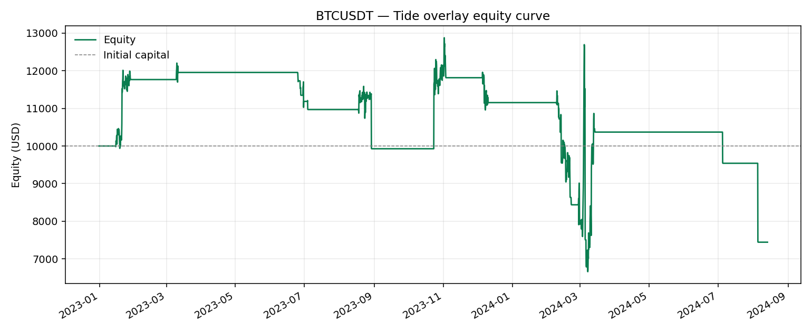
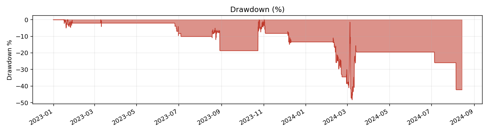
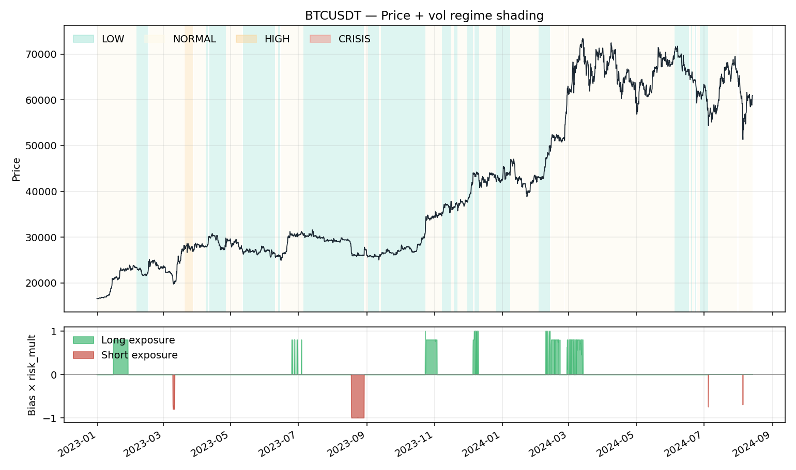

# Tide Overlay Backtest — BTCUSDT

- **Exchange / TF:** binance / `4h`
- **Period:** 2022-12-31 04:00:00 → 2024-08-13 20:00:00  (3,551 bars)
- **Capital:** $10,000.00 → $7,444.89  (**-25.55%**)

## Headline metrics

| Metric | Value | Metric | Value |
|---|---:|---|---:|
| CAGR        | -16.64%  | Max Drawdown      | -48.26% |
| Sharpe      | 0.000  | MDD duration      | 1,716 bars |
| Sortino     | 0.000  | MDD trough        | 2024-03-07 20:00:00 |
| Calmar      | -0.345  | Ann Volatility    | 58.35% |
| Omega (>0)  | 1.000  | Ann Downside Vol  | 44.54% |
| VaR 95 / 99 | 0.202% / 2.918%  | ES 95 / 99        | 2.198% / 6.851% |
| Ulcer Index | 16.003%  | Avg bar return    | 0.0000% |
| Skewness    | -5.285  | Kurtosis (excess) | 260.547 |

## Activity

| Metric | Value | Metric | Value |
|---|---:|---|---:|
| Rebalances     | 101 | Round-trips      | 30 |
| Turnover / year| 62.3 | Exposure         | 10.95% |
| Win rate       | 20.00% | Profit factor    | 0.80 |
| Avg win        | $1,355.30 | Avg loss         | $-425.42 |
| Largest win    | $3,819.95 | Largest loss     | $-2,080.90 |
| Expectancy/trip| $-69.28 | Fees paid        | $1,063.14 |
| Avg |position| | 0.0921 |  |  |

## Volatility-regime breakdown

| Category | Bars | Time % | Net PnL | Fees | Hit % | Sharpe |
|---|---:|---:|---:|---:|---:|---:|
| HIGH | 50 | 1.41% | $0.00 | $0.00 | 0.00% | 0.000 |
| NORMAL | 2,096 | 59.03% | $-1,104.98 | $817.50 | 6.87% | 0.145 |
| LOW | 1,405 | 39.57% | $-1,450.13 | $245.63 | 3.84% | -0.402 |

## Bias breakdown

| Category | Bars | Time % | Net PnL | Fees | Hit % | Sharpe |
|---|---:|---:|---:|---:|---:|---:|
| LONG | 307 | 8.65% | $1,648.71 | $537.15 | 51.14% | 1.617 |
| NEUTRAL | 3,162 | 89.05% | $-476.69 | $476.69 | 0.00% | -4.212 |
| SHORT | 82 | 2.31% | $-3,727.13 | $49.30 | 50.00% | -6.554 |

## Monthly returns

- **Best month:** 30.87%    **Worst month:** -28.95%    **% positive:** 20.00%

| Month | Return |
|---|---:|
| 2023-01 | 17.65% |
| 2023-02 | 0.00% |
| 2023-03 | 1.61% |
| 2023-04 | 0.00% |
| 2023-05 | 0.00% |
| 2023-06 | -6.43% |
| 2023-07 | -1.94% |
| 2023-08 | -9.49% |
| 2023-09 | 0.00% |
| 2023-10 | 20.55% |
| 2023-11 | -1.28% |
| 2023-12 | -5.60% |
| 2024-01 | 0.00% |
| 2024-02 | -28.95% |
| 2024-03 | 30.87% |
| 2024-04 | 0.00% |
| 2024-05 | 0.00% |
| 2024-06 | 0.00% |
| 2024-07 | -7.99% |
| 2024-08 | -21.97% |

## Tide signal accuracy

Forward-horizon analysis: is the bias at time *t* predictive for time *t+h*?

| h | Active | Neutral | Hit % | IC | Dir IC | Expectancy | Calmar | PnL proxy |
|---|---:|---:|---:|---:|---:|---:|---:|---:|
| 1 | 389 | 3,161 | 51.16% | -0.0016 | -0.0233 | 0.000166 | 0.016 | 223.6251 |
| 2 | 389 | 3,160 | 51.16% | 0.0019 | -0.0228 | 0.000506 | 0.037 | 6,675.3935 |
| 4 | 389 | 3,158 | 51.93% | -0.0041 | -0.0485 | 0.000595 | 0.031 | 9,283.3018 |
| 8 | 389 | 3,154 | 56.56% | 0.0070 | -0.0458 | 0.002272 | 0.093 | 42,380.4818 |
| 24 | 389 | 3,138 | 62.72% | -0.0134 | -0.1835 | 0.002976 | 0.059 | 74,211.7109 |

### Vol-regime × Bias — mean signed forward log-return (h=1)

| Regime / Bias | LONG | NEUTRAL | SHORT |
|---|---:|---:|---:|
| **HIGH** | 0.00000 | 0.00000 | 0.00000 |
| **LOW** | 0.00035 | 0.00000 | -0.00042 |
| **NORMAL** | 0.00053 | 0.00000 | -0.00509 |

### Hit rate % per cell (h=1)

| Regime / Bias | LONG | NEUTRAL | SHORT |
|---|---:|---:|---:|
| **HIGH** | 0.0% | 0.0% | 0.0% |
| **LOW** | 50.0% | 0.0% | 51.4% |
| **NORMAL** | 51.7% | 0.0% | 41.7% |

## Charts

### Equity curve

### Drawdown

### Regime overlay

## Parameters

| Parameter | Value |
|---|---:|
| `vol_window` | 90 |
| `eta_window` | 90 |
| `lsi_window` | 360 |
| `timeframe` | 4h |
| `bar_seconds` | 14400 |
| `vol_regime_thresholds` | [0.4, 0.8, 1.5] |
| `eta_threshold` | 0.3 |
| `bias_deadband` | 0 |
| `lsi_weights` | [0.333333, 0.333333, 0.333333] |
| `risk_mult_by_regime` | [1, 0.8, 0.5, 0] |
| `lsi_reduce_threshold` | 1.5 |
| `lsi_reduce_slope` | 0.2 |
| `es_budget_global` | 1000 |
| `sizing_mode` | base |
| `max_position_usd` | 10000 |
| `max_position_base` | 1 |
| `leverage` | 1 |
| `taker_fee_bps` | 4 |
| `maker_fee_bps` | 2 |
| `rebalance_threshold` | 0 |

