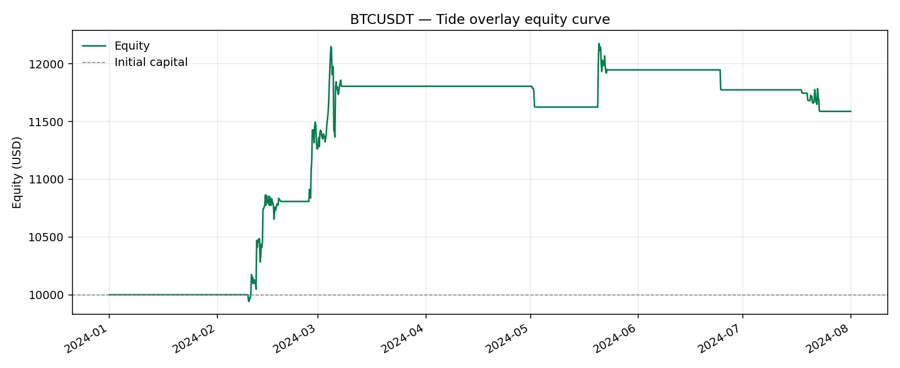
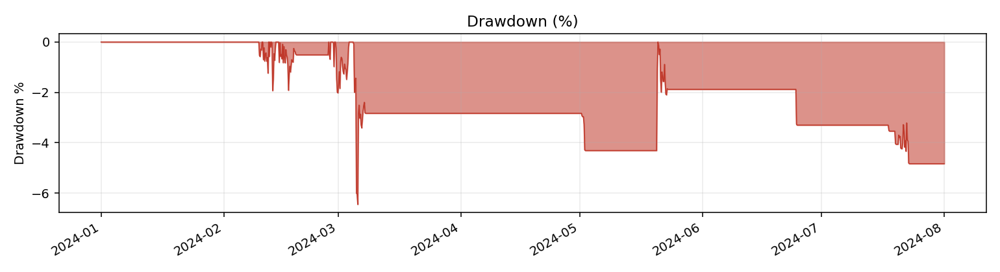
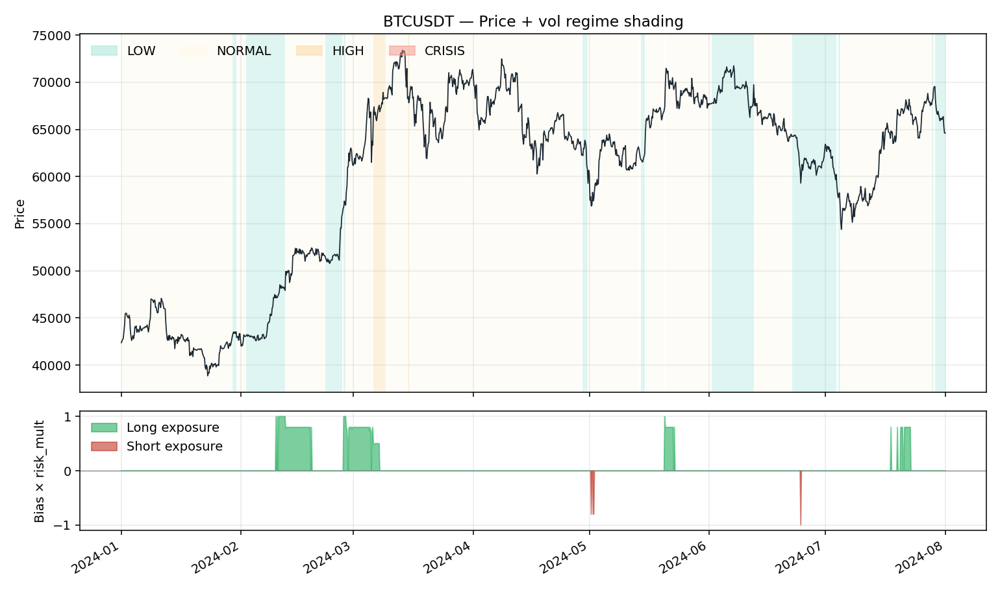

# Tide Overlay Backtest — BTCUSDT

- **Exchange / TF:** binance / `4h`
- **Period:** 2024-01-01 00:00:00 → 2024-08-01 00:00:00  (1,279 bars)
- **Capital:** $10,000.00 → $11,588.22  (**15.88%**)

## Headline metrics

| Metric | Value | Metric | Value |
|---|---:|---|---:|
| CAGR        | 28.74%  | Max Drawdown      | -6.45% |
| Sharpe      | 1.744  | MDD duration      | 462 bars |
| Sortino     | 2.934  | MDD trough        | 2024-03-05 20:00:00 |
| Calmar      | 4.455  | Ann Volatility    | 15.13% |
| Omega (>0)  | 1.421  | Ann Downside Vol  | 8.99% |
| VaR 95 / 99 | 0.064% / 0.712%  | ES 95 / 99        | 0.560% / 1.429% |
| Ulcer Index | 2.647%  | Avg bar return    | 0.0120% |
| Skewness    | 2.296  | Kurtosis (excess) | 88.491 |

## Activity

| Metric | Value | Metric | Value |
|---|---:|---|---:|
| Rebalances     | 158 | Round-trips      | 16 |
| Turnover / year| 270.5 | Exposure         | 11.10% |
| Win rate       | 37.50% | Profit factor    | 3.79 |
| Avg win        | $371.11 | Avg loss         | $-58.78 |
| Largest win    | $857.12 | Largest loss     | $-169.09 |
| Expectancy/trip| $102.43 | Fees paid        | $115.95 |
| Avg |position| | 0.0153 |  |  |

## Volatility-regime breakdown

| Category | Bars | Time % | Net PnL | Fees | Hit % | Sharpe |
|---|---:|---:|---:|---:|---:|---:|
| LOW | 277 | 21.66% | $945.48 | $36.35 | 3.97% | 3.946 |
| NORMAL | 978 | 76.47% | $636.80 | $76.09 | 5.62% | 0.994 |
| HIGH | 24 | 1.88% | $5.93 | $3.51 | 25.00% | 0.489 |

## Bias breakdown

| Category | Bars | Time % | Net PnL | Fees | Hit % | Sharpe |
|---|---:|---:|---:|---:|---:|---:|
| LONG | 139 | 10.87% | $1,979.25 | $56.99 | 51.80% | 6.547 |
| NEUTRAL | 1,136 | 88.82% | $-48.54 | $48.54 | 0.00% | -5.304 |
| SHORT | 4 | 0.31% | $-342.49 | $10.41 | 0.00% | -54.923 |

## Monthly returns

- **Best month:** 12.63%    **Worst month:** -1.58%    **% positive:** 42.86%

| Month | Return |
|---|---:|
| 2024-02 | 12.63% |
| 2024-03 | 4.82% |
| 2024-04 | 0.00% |
| 2024-05 | 1.21% |
| 2024-06 | -1.45% |
| 2024-07 | -1.58% |
| 2024-08 | 0.00% |

## Charts

### Equity curve

### Drawdown

### Regime overlay

## Parameters

| Parameter | Value |
|---|---:|
| `vol_window` | 60 |
| `eta_window` | 60 |
| `lsi_window` | 240 |
| `vol_regime_thresholds` | [0.4, 0.8, 1.5] |
| `eta_threshold` | 0.3 |
| `bias_deadband` | 0 |
| `lsi_weights` | [0.333333, 0.333333, 0.333333] |
| `risk_mult_by_regime` | [1, 0.8, 0.5, 0] |
| `lsi_reduce_threshold` | 1.5 |
| `lsi_reduce_slope` | 0.2 |
| `es_budget_global` | 1000 |
| `max_position_usd` | 10000 |
| `leverage` | 1 |
| `taker_fee_bps` | 4 |
| `maker_fee_bps` | 2 |
| `rebalance_threshold` | 0 |

