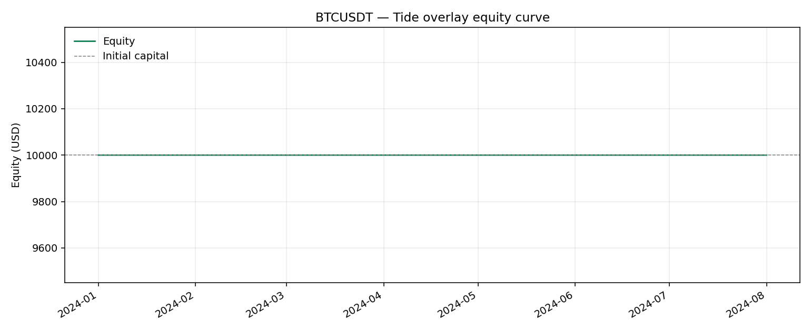
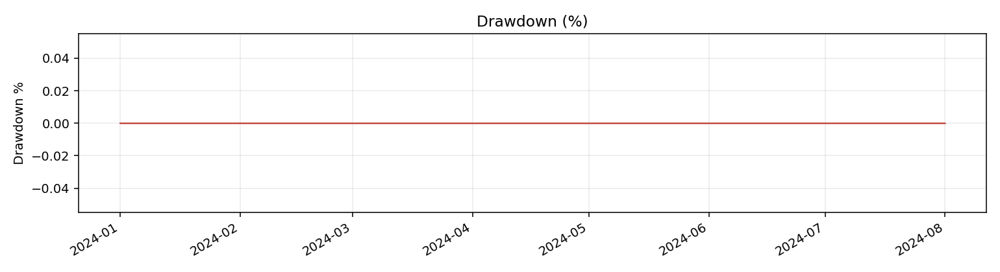
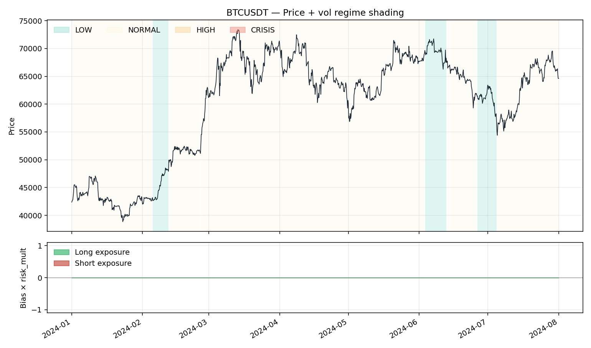

# Tide Overlay Backtest — BTCUSDT

- **Exchange / TF:** binance / `4h`
- **Period:** 2024-01-01 00:00:00 → 2024-08-01 00:00:00  (1,279 bars)
- **Capital:** $10,000.00 → $10,000.00  (**0.00%**)

## Headline metrics

| Metric | Value | Metric | Value |
|---|---:|---|---:|
| CAGR        | 0.00%  | Max Drawdown      | 0.00% |
| Sharpe      | 0.000  | MDD duration      | 1 bars |
| Sortino     | 0.000  | MDD trough        | 2024-01-01 00:00:00 |
| Calmar      | 0.000  | Ann Volatility    | 0.00% |
| Omega (>0)  | 0.000  | Ann Downside Vol  | 0.00% |
| VaR 95 / 99 | 0.000% / 0.000%  | ES 95 / 99        | 0.000% / 0.000% |
| Ulcer Index | 0.000%  | Avg bar return    | 0.0000% |
| Skewness    | 0.000  | Kurtosis (excess) | 0.000 |

## Activity

| Metric | Value | Metric | Value |
|---|---:|---|---:|
| Rebalances     | 0 | Round-trips      | 0 |
| Turnover / year| 0.0 | Exposure         | 0.00% |
| Win rate       | 0.00% | Profit factor    | 0.00 |
| Avg win        | $0.00 | Avg loss         | $0.00 |
| Largest win    | $0.00 | Largest loss     | $0.00 |
| Expectancy/trip| $0.00 | Fees paid        | $0.00 |
| Avg |position| | 0.0000 |  |  |

## Volatility-regime breakdown

| Category | Bars | Time % | Net PnL | Fees | Hit % | Sharpe |
|---|---:|---:|---:|---:|---:|---:|
| LOW | 152 | 11.88% | $0.00 | $0.00 | 0.00% | 0.000 |
| NORMAL | 1,127 | 88.12% | $0.00 | $0.00 | 0.00% | 0.000 |

## Bias breakdown

| Category | Bars | Time % | Net PnL | Fees | Hit % | Sharpe |
|---|---:|---:|---:|---:|---:|---:|
| NEUTRAL | 1,279 | 100.00% | $0.00 | $0.00 | 0.00% | 0.000 |

## Monthly returns

- **Best month:** 0.00%    **Worst month:** 0.00%    **% positive:** 0.00%

| Month | Return |
|---|---:|
| 2024-02 | 0.00% |
| 2024-03 | 0.00% |
| 2024-04 | 0.00% |
| 2024-05 | 0.00% |
| 2024-06 | 0.00% |
| 2024-07 | 0.00% |
| 2024-08 | 0.00% |

## Charts

### Equity curve

### Drawdown

### Regime overlay

## Parameters

| Parameter | Value |
|---|---:|
| `vol_window` | 83 |
| `eta_window` | 223 |
| `lsi_window` | 244 |
| `vol_regime_thresholds` | [0.39, 0.84, 2.3] |
| `eta_threshold` | 0.5 |
| `bias_deadband` | 12.2 |
| `lsi_weights` | [0.333333, 0.333333, 0.333333] |
| `risk_mult_by_regime` | [0.99, 0.47, 0.2, 0.15] |
| `lsi_reduce_threshold` | 3.05 |
| `lsi_reduce_slope` | 0.144 |
| `es_budget_global` | 1000 |
| `max_position_usd` | 10000 |
| `leverage` | 1 |
| `taker_fee_bps` | 4 |
| `maker_fee_bps` | 2 |
| `rebalance_threshold` | 0.0076 |

