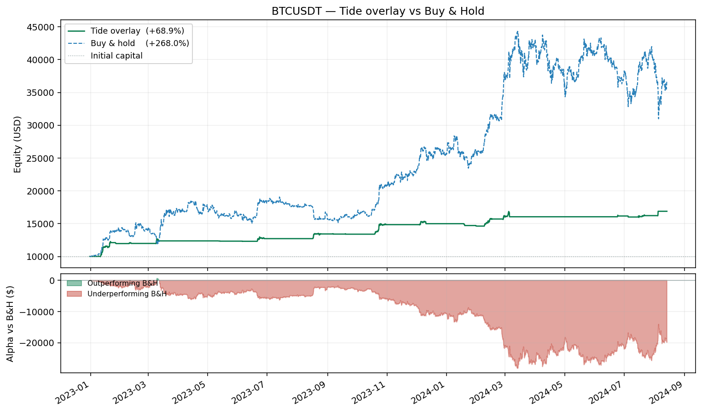
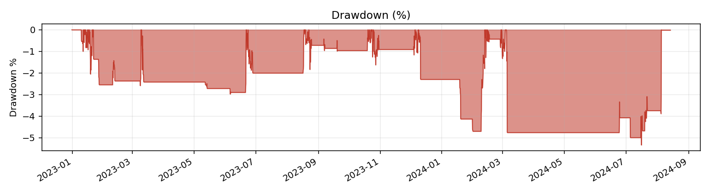
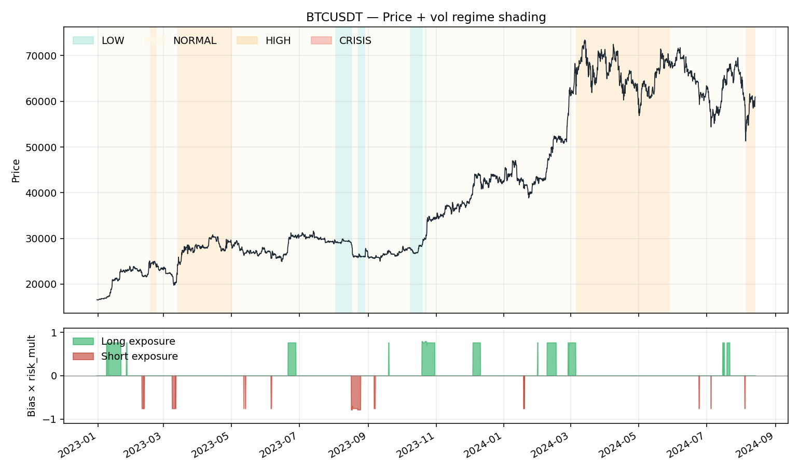
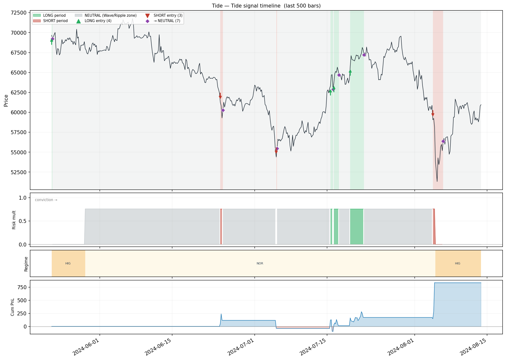
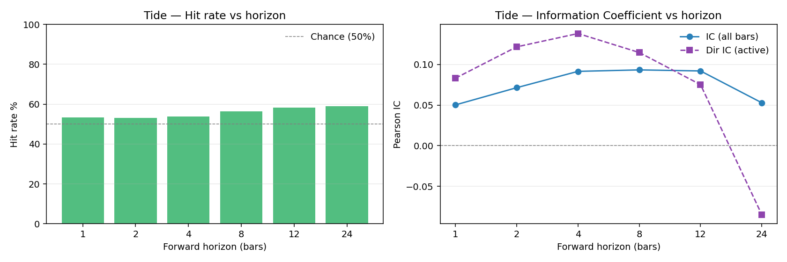
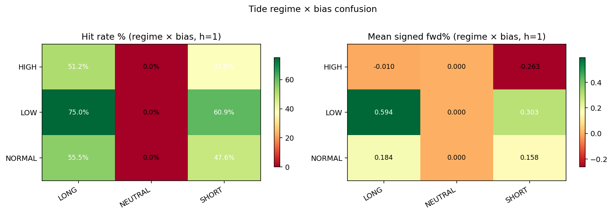

# Tide Overlay Backtest — BTCUSDT

- **Exchange / TF:** binance / `4h`
- **Period:** 2022-12-31 04:00:00 → 2024-08-13 20:00:00  (3,551 bars)
- **Capital:** $10,000.00 → $16,890.54  (**68.91%**)

## Headline metrics

| Metric | Value | Metric | Value |
|---|---:|---|---:|
| CAGR        | 38.18%  | Max Drawdown      | -5.34% |
| Sharpe      | 2.897  | MDD duration      | 919 bars |
| Sortino     | 5.815  | MDD trough        | 2024-07-16 04:00:00 |
| Calmar      | 7.152  | Ann Volatility    | 11.38% |
| Omega (>0)  | 1.779  | Ann Downside Vol  | 5.67% |
| VaR 95 / 99 | 0.056% / 0.509%  | ES 95 / 99        | 0.377% / 0.906% |
| Ulcer Index | 2.940%  | Avg bar return    | 0.0151% |
| Skewness    | 4.970  | Kurtosis (excess) | 93.483 |

## Activity

| Metric | Value | Metric | Value |
|---|---:|---|---:|
| Rebalances     | 74 | Round-trips      | 31 |
| Turnover / year| 45.6 | Exposure         | 12.90% |
| Win rate       | 45.16% | Profit factor    | 8.34 |
| Avg win        | $566.90 | Avg loss         | $-56.01 |
| Largest win    | $2,103.53 | Largest loss     | $-174.28 |
| Expectancy/trip| $225.30 | Fees paid        | $191.37 |
| Avg |position| | 0.0315 |  |  |

## Volatility-regime breakdown

| Category | Bars | Time % | Net PnL | Fees | Hit % | Sharpe |
|---|---:|---:|---:|---:|---:|---:|
| NORMAL | 2,441 | 68.74% | $5,620.02 | $176.32 | 9.22% | 3.006 |
| LOW | 214 | 6.03% | $1,276.20 | $9.38 | 12.15% | 7.184 |
| HIGH | 896 | 25.23% | $-5.67 | $5.67 | 0.00% | -2.210 |

## Bias breakdown

| Category | Bars | Time % | Net PnL | Fees | Hit % | Sharpe |
|---|---:|---:|---:|---:|---:|---:|
| LONG | 433 | 12.19% | $5,556.61 | $51.42 | 45.50% | 7.753 |
| SHORT | 144 | 4.06% | $1,425.01 | $48.87 | 37.50% | 6.041 |
| NEUTRAL | 2,974 | 83.75% | $-91.08 | $91.08 | 0.00% | -4.683 |

## Monthly returns

- **Best month:** 19.69%    **Worst month:** -2.46%    **% positive:** 60.00%

| Month | Return |
|---|---:|
| 2023-01 | 19.69% |
| 2023-02 | 0.18% |
| 2023-03 | 3.21% |
| 2023-04 | 0.00% |
| 2023-05 | -0.31% |
| 2023-06 | 3.10% |
| 2023-07 | 0.00% |
| 2023-08 | 5.60% |
| 2023-09 | -0.25% |
| 2023-10 | 10.84% |
| 2023-11 | 0.00% |
| 2023-12 | 1.00% |
| 2024-01 | -2.46% |
| 2024-02 | 9.48% |
| 2024-03 | 0.22% |
| 2024-04 | 0.00% |
| 2024-05 | 0.00% |
| 2024-06 | 0.72% |
| 2024-07 | 0.34% |
| 2024-08 | 4.09% |

## Tide signal accuracy

Forward-horizon analysis: is the bias at time *t* predictive for time *t+h*?

| h | Active | Neutral | Hit % | IC | Dir IC | Expectancy | Calmar | PnL proxy |
|---|---:|---:|---:|---:|---:|---:|---:|---:|
| 1 | 577 | 2,973 | 53.38% | 0.0502 | 0.0831 | 0.001400 | 0.115 | 8,075.1650 |
| 2 | 577 | 2,972 | 53.03% | 0.0714 | 0.1217 | 0.002823 | 0.163 | 16,288.5015 |
| 4 | 577 | 2,970 | 53.90% | 0.0915 | 0.1381 | 0.005241 | 0.208 | 30,240.9690 |
| 8 | 577 | 2,966 | 56.33% | 0.0933 | 0.1147 | 0.008018 | 0.235 | 46,266.2761 |
| 12 | 577 | 2,962 | 58.23% | 0.0920 | 0.0751 | 0.010155 | 0.240 | 58,593.7701 |
| 24 | 577 | 2,950 | 59.10% | 0.0528 | -0.0851 | 0.011048 | 0.169 | 63,749.6446 |

### Vol-regime × Bias — mean signed forward log-return (h=1)

| Regime / Bias | LONG | NEUTRAL | SHORT |
|---|---:|---:|---:|
| **HIGH** | -0.00010 | 0.00000 | -0.00263 |
| **LOW** | 0.00594 | 0.00000 | 0.00303 |
| **NORMAL** | 0.00184 | 0.00000 | 0.00158 |

### Hit rate % per cell (h=1)

| Regime / Bias | LONG | NEUTRAL | SHORT |
|---|---:|---:|---:|
| **HIGH** | 51.2% | 0.0% | 37.8% |
| **LOW** | 75.0% | 0.0% | 60.9% |
| **NORMAL** | 55.5% | 0.0% | 47.6% |

## Charts

### Equity curve

### Drawdown

### Regime overlay

### Signal timeline

### Hit rate vs horizon

### Forward return by bias

### Regime-bias confusion

### PnL proxy vs horizon

## Parameters

| Parameter | Value |
|---|---:|
| `vol_window` | 240 |
| `eta_window` | 47 |
| `lsi_window` | 454 |
| `timeframe` | 4h |
| `bar_seconds` | 14400 |
| `vol_regime_thresholds` | [0.29, 0.48, 1.13] |
| `eta_threshold` | 0.33 |
| `bias_deadband` | 24.7 |
| `lsi_weights` | [0.333333, 0.333333, 0.333333] |
| `risk_mult_by_regime` | [0.79, 0.76, 0, 0] |
| `lsi_reduce_threshold` | 3.03 |
| `lsi_reduce_slope` | 0.022 |
| `es_budget_global` | 1000 |
| `sizing_mode` | usd |
| `max_position_usd` | 10000 |
| `max_position_base` | 1 |
| `leverage` | 1 |
| `taker_fee_bps` | 4 |
| `maker_fee_bps` | 2 |
| `rebalance_threshold` | 0.0347 |

---

## Metric glossary

> Full derivations and plain-language definitions are in `METRICS_GLOSSARY.md`
> at the repository root.  The compact reference below covers every number in
> this report.

### Returns & growth

| Metric | Formula | Plain language |
|---|---|---|
| **Total Return** | (E_N − E_0) / E_0 | Simple % gain/loss over the full period, unadjusted for time |
| **CAGR** | (E_N/E_0)^(P/N) − 1 | Constant annual rate that produces the same terminal value; normalised for run length |
| **Avg bar return** | mean(r_t) | Arithmetic average return per bar; sanity check for per-bar edge |

### Risk

| Metric | Formula | Plain language |
|---|---|---|
| **Ann Volatility** | std(r) × √P | Annualised return fluctuation; penalises both up and down moves |
| **Ann Downside Vol** | std(min(r,0)) × √P | Volatility of losses only; preferred for skewed strategies |
| **Max Drawdown** | min( (E_t − peak_t) / peak_t ) | Worst peak-to-trough decline as a fraction of the prior peak |
| **MDD Duration** | bars from peak → recovery (or end) | How long the portfolio was underwater at its worst drawdown |
| **VaR 95 / 99** | −Q_(0.05/0.01)(r) | Worst loss exceeded on 5%/1% of bars; a threshold, not an average |
| **ES 95 / 99** | −E[r | r < VaR] | Average loss in the worst 5%/1% of bars; more informative tail measure than VaR |
| **Ulcer Index** | √( mean(D_t²) ) | RMS drawdown depth; captures both depth and duration of underwater periods |
| **Skewness** | 3rd standardised moment | +ve = rare large gains; −ve = rare large losses (left-tail risk) |
| **Kurtosis (excess)** | 4th moment − 3 | Fat-tailedness; +ve means extreme events are more frequent than a normal distribution predicts |

### Risk-adjusted

| Metric | Formula | Plain language |
|---|---|---|
| **Sharpe** | CAGR / σ_ann | Return per unit of total volatility; > 1 good, > 2 excellent |
| **Sortino** | CAGR / σ_d,ann | Return per unit of downside volatility; better for right-skewed strategies |
| **Calmar** | CAGR / |MDD| | Return per unit of worst drawdown; useful for hard drawdown-limit mandates |
| **Omega (>0)** | E[max(r,0)] / E[max(−r,0)] | Mean gain / mean loss per bar; no distributional assumption; > 1 means gains exceed losses |

### Activity & trades

| Metric | Formula | Plain language |
|---|---|---|
| **Rebalances** | count of position changes | Each change incurs fee drag |
| **Round trips** | count of open→close trade cycles | Equivalent to "number of trades" |
| **Turnover / yr** | rebalances × P / N | Times the full portfolio is repositioned per year |
| **Exposure %** | bars with position ≠ 0, as % | Time actually in the market; Tide overlays are typically sparse (< 15%) |
| **Win rate** | % round trips with PnL > 0 | A strategy can profit with < 50% win rate if wins are large |
| **Profit factor** | gross wins / gross losses | > 1 makes money overall; > 1.5 considered robust |
| **Expectancy / trip** | mean(PnL per round trip) | Average $ earned per trade; must be positive for long-run profitability |
| **Avg win / loss** | mean of winning / losing trip PnL | Combined with win rate determines expectancy |
| **Fees paid** | Σ(|Δunits| × price × fee_rate) | Total cost of trading over the backtest |

### Signal accuracy (forward-horizon analysis)

Each row corresponds to a forward horizon h (bars).
NEUTRAL bars are always excluded from directional accuracy metrics.

| Metric | Formula | Plain language |
|---|---|---|
| **Active** | count(LONG or SHORT bars) | Bars where the strategy took a directional stance |
| **Neutral** | count(NEUTRAL bars) | Bars where Tide withheld a call |
| **Hit %** | % active bars where sign(bias) = sign(fwd_return_h) | Directional accuracy; 50% = chance level |
| **IC** | Pearson(bias_sign, fwd_log_return_h) over all bars | Linear signal-to-return correlation; > 0.05 is considered good |
| **Dir IC** | Same Pearson, restricted to active bars | IC for the signal when it is actually active |
| **Expectancy** | mean(bias_sign × fwd_log_return_h) over active bars | Raw per-bar edge in log-return units before sizing and fees |
| **Calmar proxy** | Expectancy / std(signed_fwd) | Bar-level Sharpe of the raw signal |
| **PnL proxy** | Σ(bias_sign × fwd_return_h × sizing_base × close) | Gross cumulative value captured by the signal at 1× sizing; fees not deducted |

#### Confusion matrix

Shows mean signed forward return and hit rate for every (vol_regime × bias)
combination at h = 1.  Identifies which regime-bias combinations drive edge
and which are noise — useful for regime-filtering rules.

### Regime / bias breakdown columns

| Column | Meaning |
|---|---|
| **Bars** | Bar count in this group |
| **Time %** | Fraction of total backtest time in this group |
| **Net PnL** | Σ(gross_pnl − fee) for all bars in this group |
| **Fees** | Total fees charged in this group |
| **Hit %** | % of bars with bar_return > 0 within the group |
| **Sharpe** | mean(r) / std(r) × √P within the group |

