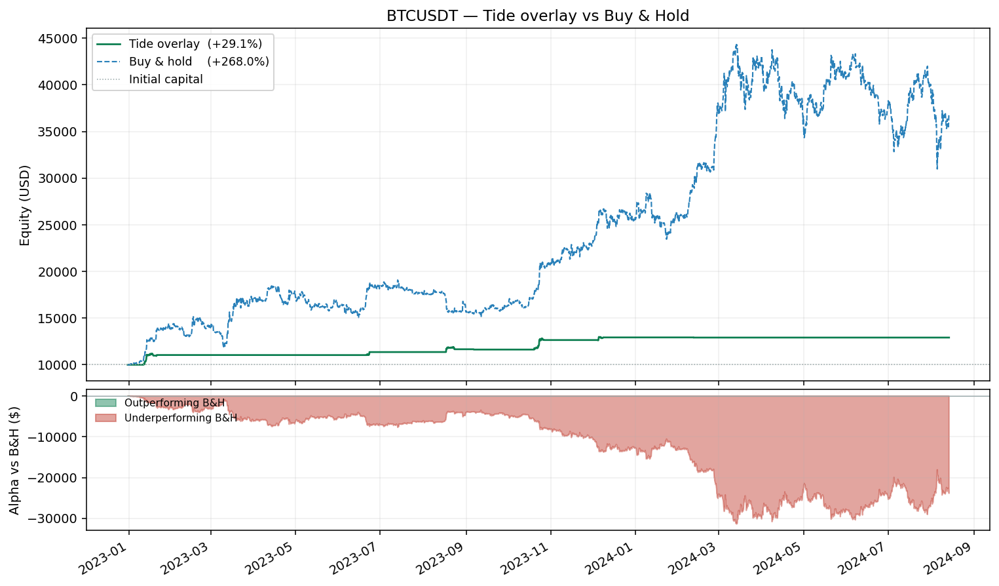
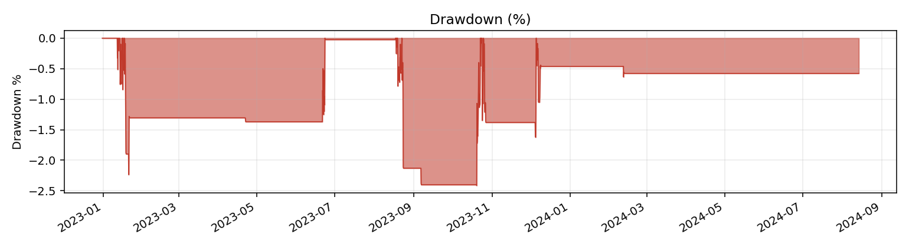
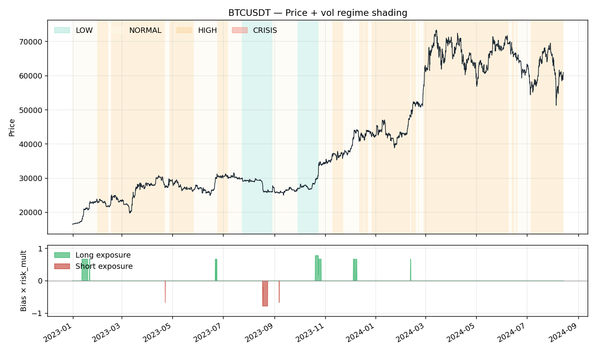
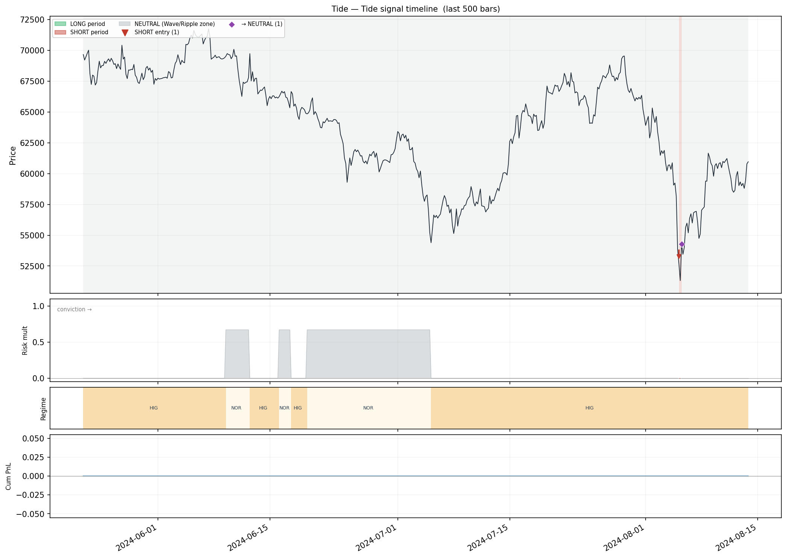
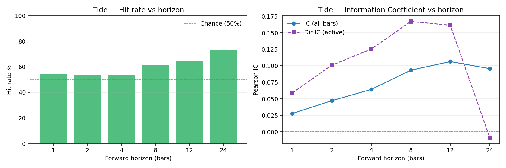
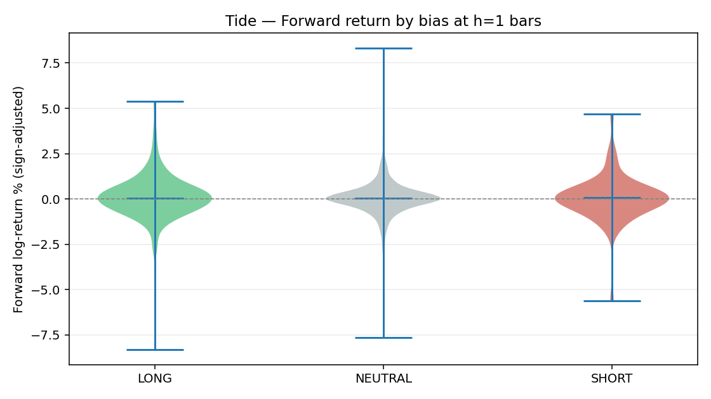
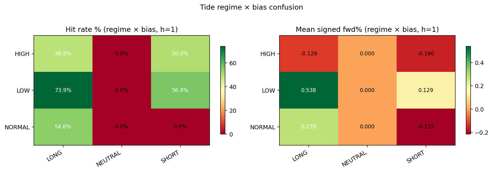
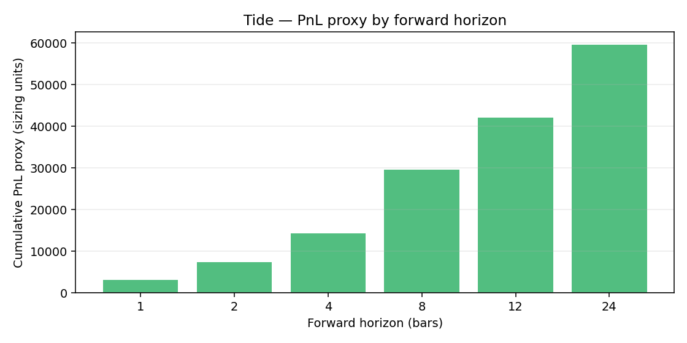

# Tide Overlay Backtest — BTCUSDT

- **Exchange / TF:** binance / `4h`
- **Period:** 2022-12-31 04:00:00 → 2024-08-13 20:00:00  (3,551 bars)
- **Capital:** $10,000.00 → $12,913.65  (**29.14%**)

## Headline metrics

| Metric | Value | Metric | Value |
|---|---:|---|---:|
| CAGR        | 17.09%  | Max Drawdown      | -2.42% |
| Sharpe      | 2.189  | MDD duration      | 368 bars |
| Sortino     | 5.835  | MDD trough        | 2023-10-20 00:00:00 |
| Calmar      | 7.073  | Ann Volatility    | 7.33% |
| Omega (>0)  | 2.181  | Ann Downside Vol  | 2.75% |
| VaR 95 / 99 | -0.000% / 0.221%  | ES 95 / 99        | 0.006% / 0.506% |
| Ulcer Index | 1.130%  | Avg bar return    | 0.0073% |
| Skewness    | 12.908  | Kurtosis (excess) | 256.806 |

## Activity

| Metric | Value | Metric | Value |
|---|---:|---|---:|
| Rebalances     | 33 | Round-trips      | 12 |
| Turnover / year| 20.4 | Exposure         | 4.48% |
| Win rate       | 66.67% | Profit factor    | 40.31 |
| Avg win        | $377.67 | Avg loss         | $-18.74 |
| Largest win    | $1,021.31 | Largest loss     | $-29.69 |
| Expectancy/trip| $245.53 | Fees paid        | $75.65 |
| Avg |position| | 0.0117 |  |  |

## Volatility-regime breakdown

| Category | Bars | Time % | Net PnL | Fees | Hit % | Sharpe |
|---|---:|---:|---:|---:|---:|---:|
| NORMAL | 1,080 | 30.41% | $1,618.87 | $58.71 | 4.91% | 2.991 |
| LOW | 374 | 10.53% | $1,297.59 | $14.13 | 9.89% | 4.459 |
| HIGH | 2,097 | 59.05% | $-2.81 | $2.81 | 0.00% | -1.022 |

## Bias breakdown

| Category | Bars | Time % | Net PnL | Fees | Hit % | Sharpe |
|---|---:|---:|---:|---:|---:|---:|
| LONG | 202 | 5.69% | $2,671.11 | $32.65 | 34.16% | 9.409 |
| SHORT | 51 | 1.44% | $272.46 | $13.07 | 41.18% | 4.069 |
| NEUTRAL | 3,298 | 92.88% | $-29.93 | $29.93 | 0.00% | -2.696 |

## Monthly returns

- **Best month:** 10.43%    **Worst month:** -0.28%    **% positive:** 25.00%

| Month | Return |
|---|---:|
| 2023-01 | 10.43% |
| 2023-02 | 0.00% |
| 2023-03 | 0.00% |
| 2023-04 | -0.07% |
| 2023-05 | 0.00% |
| 2023-06 | 2.91% |
| 2023-07 | 0.00% |
| 2023-08 | 2.67% |
| 2023-09 | -0.28% |
| 2023-10 | 8.76% |
| 2023-11 | 0.00% |
| 2023-12 | 2.23% |
| 2024-01 | 0.00% |
| 2024-02 | -0.12% |
| 2024-03 | 0.00% |
| 2024-04 | 0.00% |
| 2024-05 | 0.00% |
| 2024-06 | 0.00% |
| 2024-07 | 0.00% |
| 2024-08 | 0.00% |

## Tide signal accuracy

Forward-horizon analysis: is the bias at time *t* predictive for time *t+h*?

| h | Active | Neutral | Hit % | IC | Dir IC | Expectancy | Calmar | PnL proxy |
|---|---:|---:|---:|---:|---:|---:|---:|---:|
| 1 | 253 | 3,297 | 54.15% | 0.0277 | 0.0589 | 0.001242 | 0.095 | 3,142.5666 |
| 2 | 253 | 3,296 | 53.36% | 0.0471 | 0.1007 | 0.002903 | 0.164 | 7,343.5774 |
| 4 | 253 | 3,294 | 53.75% | 0.0641 | 0.1253 | 0.005677 | 0.227 | 14,363.0416 |
| 8 | 253 | 3,290 | 61.26% | 0.0931 | 0.1671 | 0.011710 | 0.351 | 29,625.8750 |
| 12 | 253 | 3,286 | 64.82% | 0.1063 | 0.1614 | 0.016622 | 0.400 | 42,053.6814 |
| 24 | 253 | 3,274 | 73.12% | 0.0955 | -0.0091 | 0.023588 | 0.339 | 59,677.6847 |

### Vol-regime × Bias — mean signed forward log-return (h=1)

| Regime / Bias | LONG | NEUTRAL | SHORT |
|---|---:|---:|---:|
| **HIGH** | -0.00126 | 0.00000 | -0.00160 |
| **LOW** | 0.00538 | 0.00000 | 0.00129 |
| **NORMAL** | 0.00278 | 0.00000 | -0.00215 |

### Hit rate % per cell (h=1)

| Regime / Bias | LONG | NEUTRAL | SHORT |
|---|---:|---:|---:|
| **HIGH** | 48.8% | 0.0% | 50.0% |
| **LOW** | 73.9% | 0.0% | 56.8% |
| **NORMAL** | 54.6% | 0.0% | 0.0% |

## Charts

### Equity curve

### Drawdown

### Regime overlay

### Signal timeline

### Hit rate vs horizon

### Forward return by bias

### Regime-bias confusion

### PnL proxy vs horizon

## Parameters

| Parameter | Value |
|---|---:|
| `vol_window` | 180 |
| `eta_window` | 47 |
| `lsi_window` | 513 |
| `timeframe` | 4h |
| `bar_seconds` | 14400 |
| `vol_regime_thresholds` | [0.32, 0.41, 0.97] |
| `eta_threshold` | 0.45 |
| `bias_deadband` | 45.8 |
| `lsi_weights` | [0.333333, 0.333333, 0.333333] |
| `risk_mult_by_regime` | [0.78, 0.67, 0, 0] |
| `lsi_reduce_threshold` | 3.81 |
| `lsi_reduce_slope` | 0.299 |
| `es_budget_global` | 1000 |
| `sizing_mode` | usd |
| `max_position_usd` | 10000 |
| `max_position_base` | 1 |
| `leverage` | 1 |
| `taker_fee_bps` | 4 |
| `maker_fee_bps` | 2 |
| `rebalance_threshold` | 0.0231 |

---

## Metric glossary

> Full derivations and plain-language definitions are in `METRICS_GLOSSARY.md`
> at the repository root.  The compact reference below covers every number in
> this report.

### Returns & growth

| Metric | Formula | Plain language |
|---|---|---|
| **Total Return** | (E_N − E_0) / E_0 | Simple % gain/loss over the full period, unadjusted for time |
| **CAGR** | (E_N/E_0)^(P/N) − 1 | Constant annual rate that produces the same terminal value; normalised for run length |
| **Avg bar return** | mean(r_t) | Arithmetic average return per bar; sanity check for per-bar edge |

### Risk

| Metric | Formula | Plain language |
|---|---|---|
| **Ann Volatility** | std(r) × √P | Annualised return fluctuation; penalises both up and down moves |
| **Ann Downside Vol** | std(min(r,0)) × √P | Volatility of losses only; preferred for skewed strategies |
| **Max Drawdown** | min( (E_t − peak_t) / peak_t ) | Worst peak-to-trough decline as a fraction of the prior peak |
| **MDD Duration** | bars from peak → recovery (or end) | How long the portfolio was underwater at its worst drawdown |
| **VaR 95 / 99** | −Q_(0.05/0.01)(r) | Worst loss exceeded on 5%/1% of bars; a threshold, not an average |
| **ES 95 / 99** | −E[r | r < VaR] | Average loss in the worst 5%/1% of bars; more informative tail measure than VaR |
| **Ulcer Index** | √( mean(D_t²) ) | RMS drawdown depth; captures both depth and duration of underwater periods |
| **Skewness** | 3rd standardised moment | +ve = rare large gains; −ve = rare large losses (left-tail risk) |
| **Kurtosis (excess)** | 4th moment − 3 | Fat-tailedness; +ve means extreme events are more frequent than a normal distribution predicts |

### Risk-adjusted

| Metric | Formula | Plain language |
|---|---|---|
| **Sharpe** | CAGR / σ_ann | Return per unit of total volatility; > 1 good, > 2 excellent |
| **Sortino** | CAGR / σ_d,ann | Return per unit of downside volatility; better for right-skewed strategies |
| **Calmar** | CAGR / |MDD| | Return per unit of worst drawdown; useful for hard drawdown-limit mandates |
| **Omega (>0)** | E[max(r,0)] / E[max(−r,0)] | Mean gain / mean loss per bar; no distributional assumption; > 1 means gains exceed losses |

### Activity & trades

| Metric | Formula | Plain language |
|---|---|---|
| **Rebalances** | count of position changes | Each change incurs fee drag |
| **Round trips** | count of open→close trade cycles | Equivalent to "number of trades" |
| **Turnover / yr** | rebalances × P / N | Times the full portfolio is repositioned per year |
| **Exposure %** | bars with position ≠ 0, as % | Time actually in the market; Tide overlays are typically sparse (< 15%) |
| **Win rate** | % round trips with PnL > 0 | A strategy can profit with < 50% win rate if wins are large |
| **Profit factor** | gross wins / gross losses | > 1 makes money overall; > 1.5 considered robust |
| **Expectancy / trip** | mean(PnL per round trip) | Average $ earned per trade; must be positive for long-run profitability |
| **Avg win / loss** | mean of winning / losing trip PnL | Combined with win rate determines expectancy |
| **Fees paid** | Σ(|Δunits| × price × fee_rate) | Total cost of trading over the backtest |

### Signal accuracy (forward-horizon analysis)

Each row corresponds to a forward horizon h (bars).
NEUTRAL bars are always excluded from directional accuracy metrics.

| Metric | Formula | Plain language |
|---|---|---|
| **Active** | count(LONG or SHORT bars) | Bars where the strategy took a directional stance |
| **Neutral** | count(NEUTRAL bars) | Bars where Tide withheld a call |
| **Hit %** | % active bars where sign(bias) = sign(fwd_return_h) | Directional accuracy; 50% = chance level |
| **IC** | Pearson(bias_sign, fwd_log_return_h) over all bars | Linear signal-to-return correlation; > 0.05 is considered good |
| **Dir IC** | Same Pearson, restricted to active bars | IC for the signal when it is actually active |
| **Expectancy** | mean(bias_sign × fwd_log_return_h) over active bars | Raw per-bar edge in log-return units before sizing and fees |
| **Calmar proxy** | Expectancy / std(signed_fwd) | Bar-level Sharpe of the raw signal |
| **PnL proxy** | Σ(bias_sign × fwd_return_h × sizing_base × close) | Gross cumulative value captured by the signal at 1× sizing; fees not deducted |

#### Confusion matrix

Shows mean signed forward return and hit rate for every (vol_regime × bias)
combination at h = 1.  Identifies which regime-bias combinations drive edge
and which are noise — useful for regime-filtering rules.

### Regime / bias breakdown columns

| Column | Meaning |
|---|---|
| **Bars** | Bar count in this group |
| **Time %** | Fraction of total backtest time in this group |
| **Net PnL** | Σ(gross_pnl − fee) for all bars in this group |
| **Fees** | Total fees charged in this group |
| **Hit %** | % of bars with bar_return > 0 within the group |
| **Sharpe** | mean(r) / std(r) × √P within the group |

