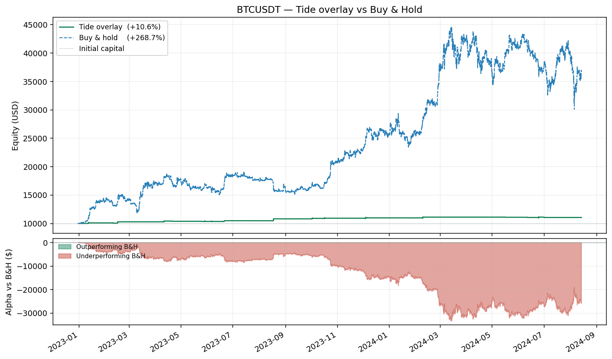
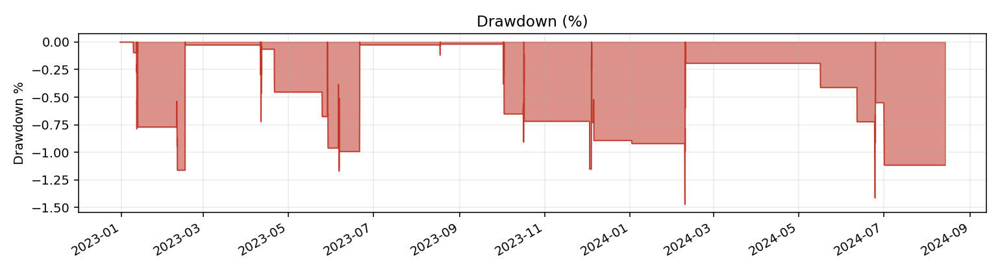
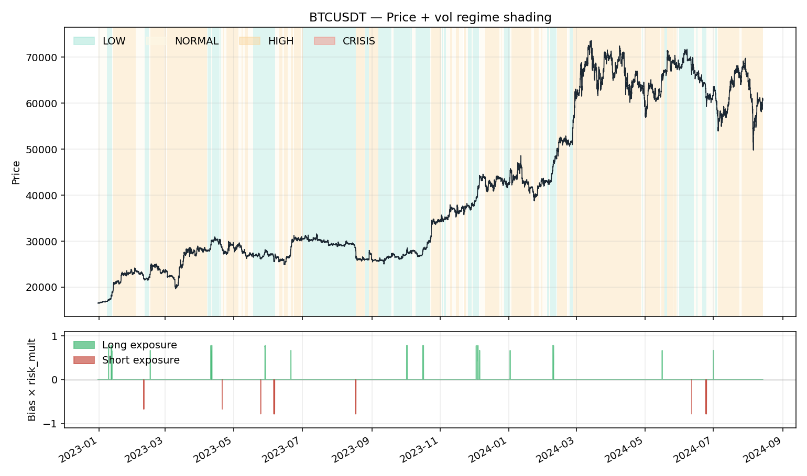
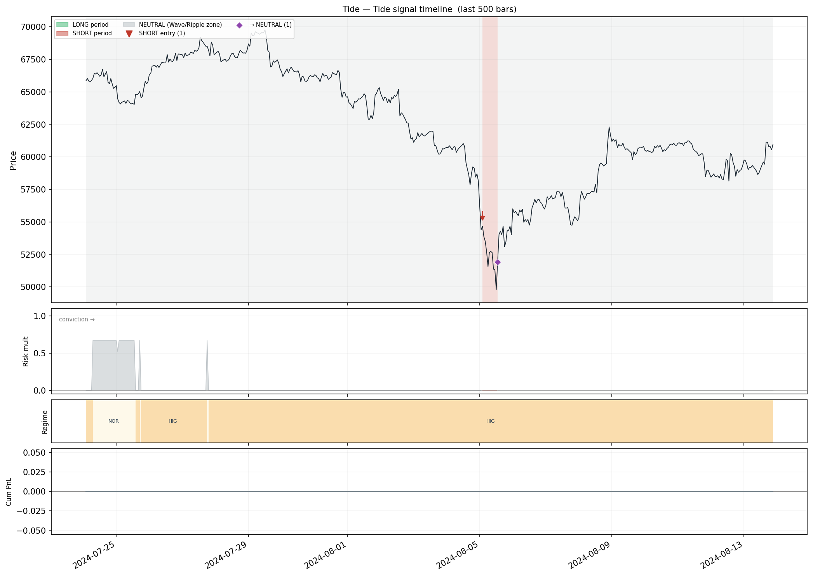
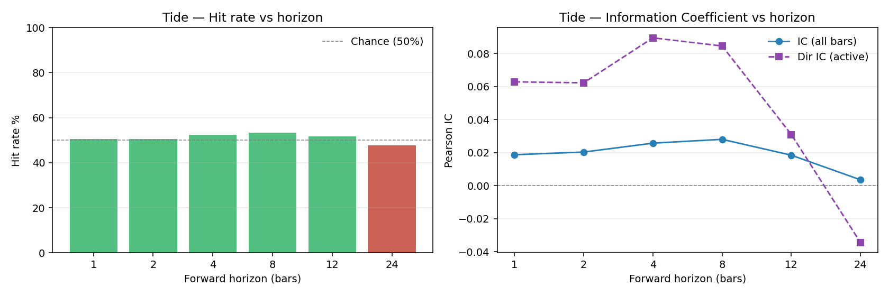
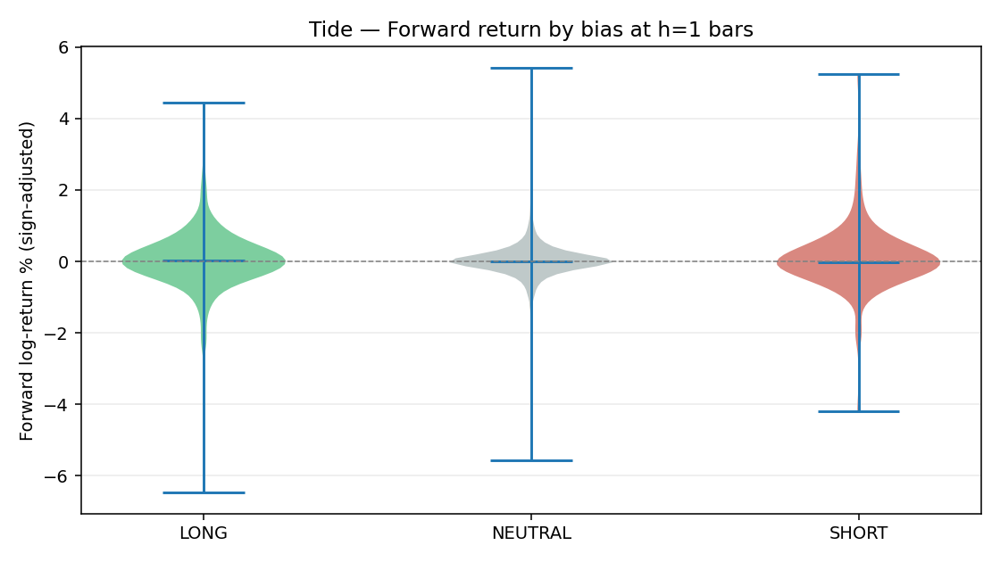
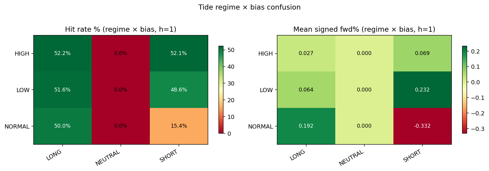
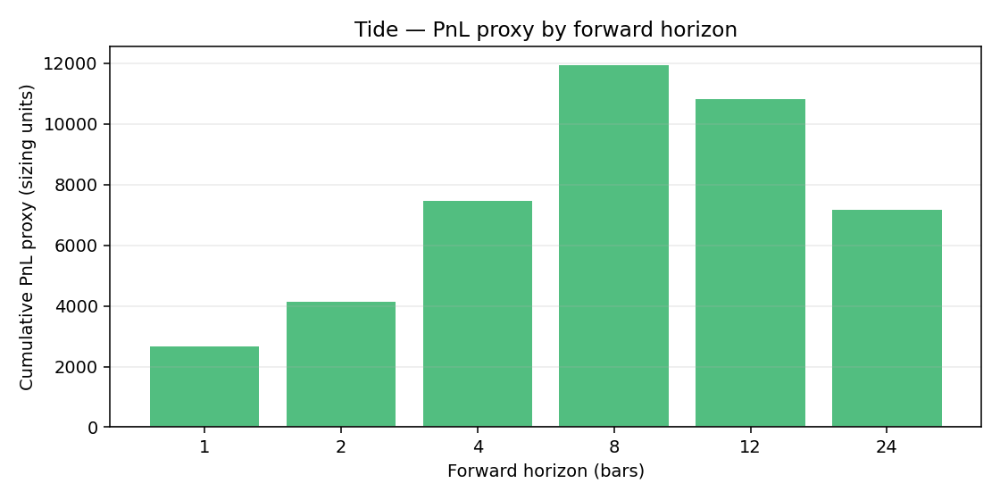

# Tide Overlay Backtest — BTCUSDT

- **Exchange / TF:** binance / `1h`
- **Period:** 2022-12-31 05:00:00 → 2024-08-13 21:00:00  (14,201 bars)
- **Capital:** $10,000.00 → $11,055.41  (**10.55%**)

## Headline metrics

| Metric | Value | Metric | Value |
|---|---:|---|---:|
| CAGR        | 6.39%  | Max Drawdown      | -1.47% |
| Sharpe      | 1.446  | MDD duration      | 1,609 bars |
| Sortino     | 3.419  | MDD trough        | 2024-02-09 05:00:00 |
| Calmar      | 4.340  | Ann Volatility    | 4.35% |
| Omega (>0)  | 1.585  | Ann Downside Vol  | 1.84% |
| VaR 95 / 99 | 0.000% / 0.000%  | ES 95 / 99        | 0.001% / 0.001% |
| Ulcer Index | 0.601%  | Avg bar return    | 0.0007% |
| Skewness    | 26.076  | Kurtosis (excess) | 1231.198 |

## Activity

| Metric | Value | Metric | Value |
|---|---:|---|---:|
| Rebalances     | 116 | Round-trips      | 38 |
| Turnover / year| 71.6 | Exposure         | 1.15% |
| Win rate       | 42.11% | Profit factor    | 3.28 |
| Avg win        | $104.71 | Avg loss         | $-23.23 |
| Largest win    | $340.62 | Largest loss     | $-50.34 |
| Expectancy/trip| $30.64 | Fees paid        | $239.76 |
| Avg |position| | 0.0028 |  |  |

## Volatility-regime breakdown

| Category | Bars | Time % | Net PnL | Fees | Hit % | Sharpe |
|---|---:|---:|---:|---:|---:|---:|
| LOW | 4,334 | 30.52% | $885.84 | $167.11 | 1.48% | 2.522 |
| NORMAL | 2,668 | 18.79% | $177.76 | $64.47 | 0.52% | 1.184 |
| HIGH | 7,199 | 50.69% | $-8.18 | $8.18 | 0.00% | -1.909 |

## Bias breakdown

| Category | Bars | Time % | Net PnL | Fees | Hit % | Sharpe |
|---|---:|---:|---:|---:|---:|---:|
| LONG | 349 | 2.46% | $863.24 | $101.76 | 17.19% | 9.412 |
| SHORT | 123 | 0.87% | $284.59 | $45.58 | 14.63% | 6.944 |
| NEUTRAL | 13,729 | 96.68% | $-92.42 | $92.42 | 0.00% | -4.488 |

## Monthly returns

- **Best month:** 3.18%    **Worst month:** -0.40%    **% positive:** 45.00%

| Month | Return |
|---|---:|
| 2023-01 | 1.02% |
| 2023-02 | 1.93% |
| 2023-03 | 0.00% |
| 2023-04 | 0.86% |
| 2023-05 | -0.26% |
| 2023-06 | 1.24% |
| 2023-07 | 0.00% |
| 2023-08 | 3.18% |
| 2023-09 | 0.00% |
| 2023-10 | 0.99% |
| 2023-11 | 0.00% |
| 2023-12 | 0.54% |
| 2024-01 | -0.03% |
| 2024-02 | 1.25% |
| 2024-03 | 0.00% |
| 2024-04 | 0.00% |
| 2024-05 | -0.22% |
| 2024-06 | 0.04% |
| 2024-07 | -0.40% |
| 2024-08 | 0.00% |

## Tide signal accuracy

Forward-horizon analysis: is the bias at time *t* predictive for time *t+h*?

| h | Active | Neutral | Hit % | IC | Dir IC | Expectancy | Calmar | PnL proxy |
|---|---:|---:|---:|---:|---:|---:|---:|---:|
| 1 | 472 | 13,728 | 50.64% | 0.0187 | 0.0628 | 0.000563 | 0.064 | 2,659.2454 |
| 2 | 472 | 13,727 | 50.64% | 0.0203 | 0.0622 | 0.000876 | 0.072 | 4,135.5618 |
| 4 | 472 | 13,725 | 52.33% | 0.0257 | 0.0894 | 0.001584 | 0.095 | 7,475.9146 |
| 8 | 472 | 13,721 | 53.39% | 0.0280 | 0.0845 | 0.002533 | 0.116 | 11,953.9500 |
| 12 | 472 | 13,717 | 51.69% | 0.0184 | 0.0309 | 0.002290 | 0.097 | 10,810.8490 |
| 24 | 472 | 13,705 | 47.67% | 0.0035 | -0.0345 | 0.001516 | 0.047 | 7,155.2416 |

### Vol-regime × Bias — mean signed forward log-return (h=1)

| Regime / Bias | LONG | NEUTRAL | SHORT |
|---|---:|---:|---:|
| **HIGH** | 0.00027 | 0.00000 | 0.00069 |
| **LOW** | 0.00064 | 0.00000 | 0.00232 |
| **NORMAL** | 0.00192 | 0.00000 | -0.00332 |

### Hit rate % per cell (h=1)

| Regime / Bias | LONG | NEUTRAL | SHORT |
|---|---:|---:|---:|
| **HIGH** | 52.2% | 0.0% | 52.1% |
| **LOW** | 51.6% | 0.0% | 48.6% |
| **NORMAL** | 50.0% | 0.0% | 15.4% |

## Charts

### Equity curve

### Drawdown

### Regime overlay

### Signal timeline

### Hit rate vs horizon

### Forward return by bias

### Regime-bias confusion

### PnL proxy vs horizon

## Parameters

| Parameter | Value |
|---|---:|
| `vol_window` | 193 |
| `eta_window` | 47 |
| `lsi_window` | 292 |
| `timeframe` | 1h |
| `bar_seconds` | 3600 |
| `vol_regime_thresholds` | [0.37, 0.42, 1.05] |
| `eta_threshold` | 0.45 |
| `bias_deadband` | 15 |
| `lsi_weights` | [0.333333, 0.333333, 0.333333] |
| `risk_mult_by_regime` | [0.78, 0.67, 0, 0] |
| `lsi_reduce_threshold` | 1.35 |
| `lsi_reduce_slope` | 0.206 |
| `es_budget_global` | 1000 |
| `sizing_mode` | usd |
| `max_position_usd` | 10000 |
| `max_position_base` | 1 |
| `leverage` | 1 |
| `taker_fee_bps` | 4 |
| `maker_fee_bps` | 2 |
| `rebalance_threshold` | 0.0231 |

---

## Metric glossary

> Full derivations and plain-language definitions are in `METRICS_GLOSSARY.md`
> at the repository root.  The compact reference below covers every number in
> this report.

### Returns & growth

| Metric | Formula | Plain language |
|---|---|---|
| **Total Return** | (E_N − E_0) / E_0 | Simple % gain/loss over the full period, unadjusted for time |
| **CAGR** | (E_N/E_0)^(P/N) − 1 | Constant annual rate that produces the same terminal value; normalised for run length |
| **Avg bar return** | mean(r_t) | Arithmetic average return per bar; sanity check for per-bar edge |

### Risk

| Metric | Formula | Plain language |
|---|---|---|
| **Ann Volatility** | std(r) × √P | Annualised return fluctuation; penalises both up and down moves |
| **Ann Downside Vol** | std(min(r,0)) × √P | Volatility of losses only; preferred for skewed strategies |
| **Max Drawdown** | min( (E_t − peak_t) / peak_t ) | Worst peak-to-trough decline as a fraction of the prior peak |
| **MDD Duration** | bars from peak → recovery (or end) | How long the portfolio was underwater at its worst drawdown |
| **VaR 95 / 99** | −Q_(0.05/0.01)(r) | Worst loss exceeded on 5%/1% of bars; a threshold, not an average |
| **ES 95 / 99** | −E[r | r < VaR] | Average loss in the worst 5%/1% of bars; more informative tail measure than VaR |
| **Ulcer Index** | √( mean(D_t²) ) | RMS drawdown depth; captures both depth and duration of underwater periods |
| **Skewness** | 3rd standardised moment | +ve = rare large gains; −ve = rare large losses (left-tail risk) |
| **Kurtosis (excess)** | 4th moment − 3 | Fat-tailedness; +ve means extreme events are more frequent than a normal distribution predicts |

### Risk-adjusted

| Metric | Formula | Plain language |
|---|---|---|
| **Sharpe** | CAGR / σ_ann | Return per unit of total volatility; > 1 good, > 2 excellent |
| **Sortino** | CAGR / σ_d,ann | Return per unit of downside volatility; better for right-skewed strategies |
| **Calmar** | CAGR / |MDD| | Return per unit of worst drawdown; useful for hard drawdown-limit mandates |
| **Omega (>0)** | E[max(r,0)] / E[max(−r,0)] | Mean gain / mean loss per bar; no distributional assumption; > 1 means gains exceed losses |

### Activity & trades

| Metric | Formula | Plain language |
|---|---|---|
| **Rebalances** | count of position changes | Each change incurs fee drag |
| **Round trips** | count of open→close trade cycles | Equivalent to "number of trades" |
| **Turnover / yr** | rebalances × P / N | Times the full portfolio is repositioned per year |
| **Exposure %** | bars with position ≠ 0, as % | Time actually in the market; Tide overlays are typically sparse (< 15%) |
| **Win rate** | % round trips with PnL > 0 | A strategy can profit with < 50% win rate if wins are large |
| **Profit factor** | gross wins / gross losses | > 1 makes money overall; > 1.5 considered robust |
| **Expectancy / trip** | mean(PnL per round trip) | Average $ earned per trade; must be positive for long-run profitability |
| **Avg win / loss** | mean of winning / losing trip PnL | Combined with win rate determines expectancy |
| **Fees paid** | Σ(|Δunits| × price × fee_rate) | Total cost of trading over the backtest |

### Signal accuracy (forward-horizon analysis)

Each row corresponds to a forward horizon h (bars).
NEUTRAL bars are always excluded from directional accuracy metrics.

| Metric | Formula | Plain language |
|---|---|---|
| **Active** | count(LONG or SHORT bars) | Bars where the strategy took a directional stance |
| **Neutral** | count(NEUTRAL bars) | Bars where Tide withheld a call |
| **Hit %** | % active bars where sign(bias) = sign(fwd_return_h) | Directional accuracy; 50% = chance level |
| **IC** | Pearson(bias_sign, fwd_log_return_h) over all bars | Linear signal-to-return correlation; > 0.05 is considered good |
| **Dir IC** | Same Pearson, restricted to active bars | IC for the signal when it is actually active |
| **Expectancy** | mean(bias_sign × fwd_log_return_h) over active bars | Raw per-bar edge in log-return units before sizing and fees |
| **Calmar proxy** | Expectancy / std(signed_fwd) | Bar-level Sharpe of the raw signal |
| **PnL proxy** | Σ(bias_sign × fwd_return_h × sizing_base × close) | Gross cumulative value captured by the signal at 1× sizing; fees not deducted |

#### Confusion matrix

Shows mean signed forward return and hit rate for every (vol_regime × bias)
combination at h = 1.  Identifies which regime-bias combinations drive edge
and which are noise — useful for regime-filtering rules.

### Regime / bias breakdown columns

| Column | Meaning |
|---|---|
| **Bars** | Bar count in this group |
| **Time %** | Fraction of total backtest time in this group |
| **Net PnL** | Σ(gross_pnl − fee) for all bars in this group |
| **Fees** | Total fees charged in this group |
| **Hit %** | % of bars with bar_return > 0 within the group |
| **Sharpe** | mean(r) / std(r) × √P within the group |

