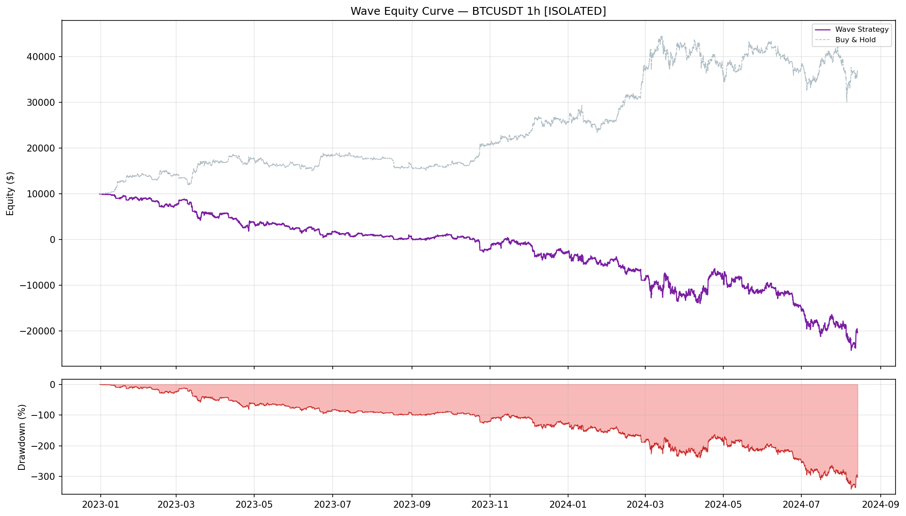
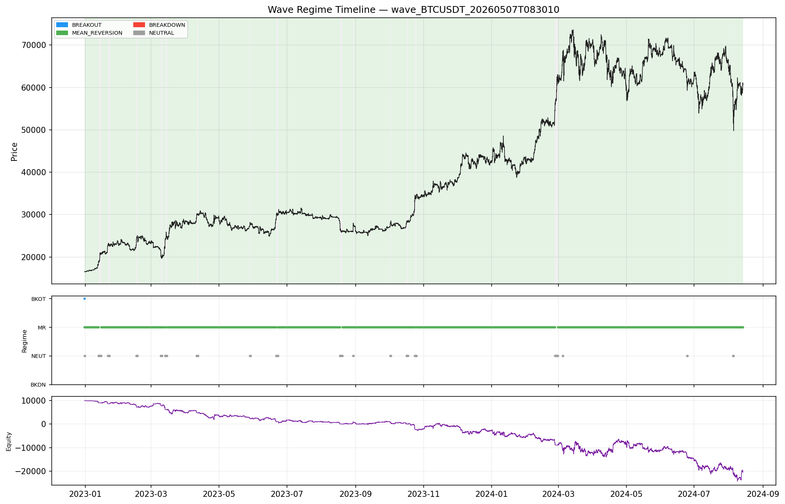
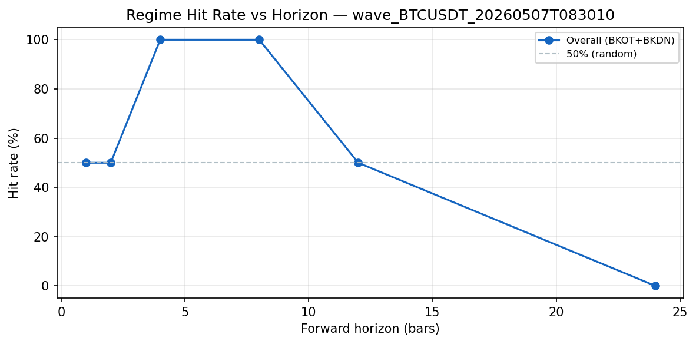
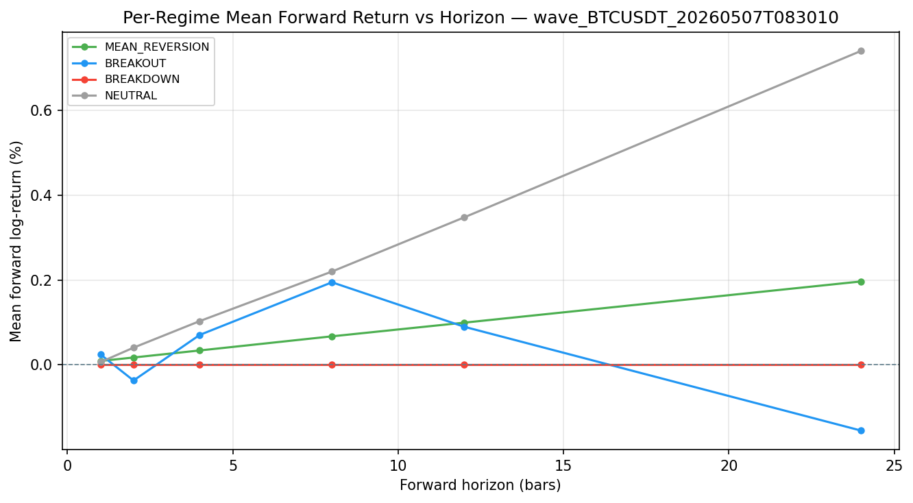
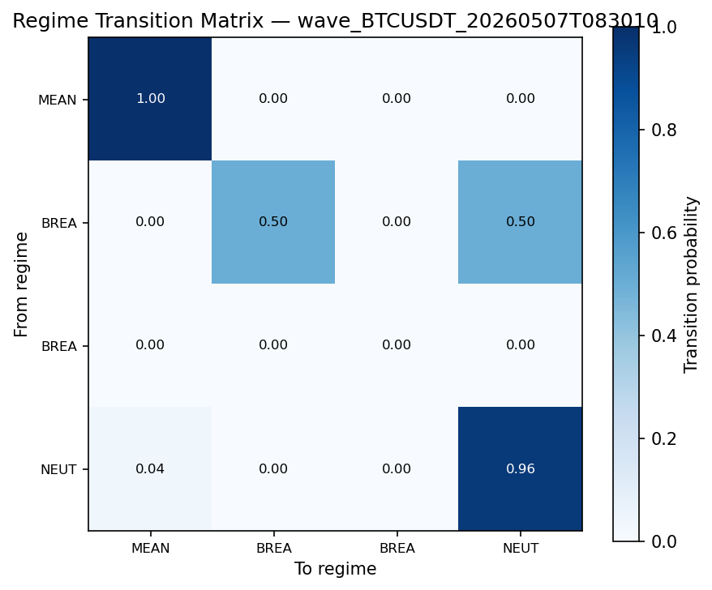
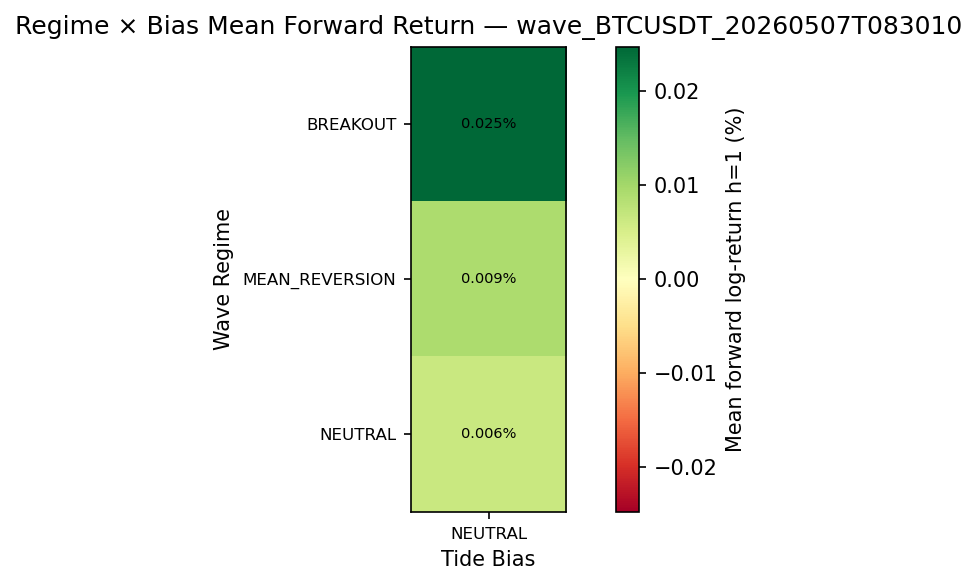

# Wave Backtest Report
**Symbol:** BTCUSDT | **Timeframe:** 1h | **Mode:** ISOLATED | **Exchange:** binance  
**Period:** 2022-12-31 05:00:00 → 2024-08-13 21:00:00 | **Bars:** 14,201

## Equity Curve

## Returns & Growth
| Metric | Formula | Value |
|---|---|---|
| Total Return | $\frac{E_N - E_0}{E_0}$ | -303.18% |
| CAGR | $(E_N/E_0)^{P/N} - 1$ | 0.00% |
| Initial Capital | $E_0$ | $10,000.00 |
| Final Equity | $E_N$ | $-20,317.97 |

## Risk
| Metric | Formula | Value |
|---|---|---|
| Ann. Volatility | $\sigma(r) \times \sqrt{P}$ | 109.22% |
| Ann. Downside Vol | $\sigma(\min(r,0)) \times \sqrt{P}$ | 80.46% |
| Max Drawdown | $\min_t (E_t - \text{peak}_t)/\text{peak}_t$ | -341.77% |
| Max DD Duration (bars) | 14,199 |
| VaR 95% | $-Q_{0.05}(r)$ | 1.65% |
| CVaR 95% (ES) | $-\mathbb{E}[r \mid r < \text{VaR}_{95}]$ | 3.07% |
| VaR 99% | $-Q_{0.01}(r)$ | 3.87% |
| CVaR 99% (ES) | $-\mathbb{E}[r \mid r < \text{VaR}_{99}]$ | 5.61% |
| Ulcer Index | $\sqrt{N^{-1}\sum D_t^2}$ | 1.4721 |
| Skewness | $\frac{1}{N}\sum((r_t-\bar r)/\sigma)^3$ | -0.1946 |
| Excess Kurtosis | $\frac{1}{N}\sum((r_t-\bar r)/\sigma)^4 - 3$ | 19.7920 |

## Risk-Adjusted
| Metric | Formula | Value |
|---|---|---|
| Sharpe Ratio | $(\bar{r} \cdot P - R_f)\,/\,(\sigma\sqrt{P})$ | -1.7123 |
| Sortino Ratio | $(\text{CAGR} - \text{MAR})\,/\,(\sigma_d\sqrt{P})$ | -2.3243 |
| Calmar Ratio | $\text{CAGR}\,/\,\lvert\text{MDD}\rvert$ | 0.0000 |

## Activity & Trades
| Metric | Value |
|---|---|
| Num Trades | 1,692 |
| Exposure % | 96.3% |
| Win Rate | 68.42% |
| Profit Factor | 0.7765 |
| Avg Win | $91.71 |
| Avg Loss | $-255.88 |
| Expectancy / Bar | -0.0213% |

## Per-Regime Breakdown
| Regime | Time % | PnL Contribution | Sharpe | N Bars |
|---|---|---|---|---|
| BREAKOUT | 0.0% | $4.89 | 9.61 | 2 |
| MEAN_REVERSION | 96.3% | $-30,196.23 | -1.74 | 13,677 |
| NEUTRAL | 3.7% | $-126.63 | -16.61 | 522 |

## Monthly Returns
Best month: 414.08%  |  Worst month: -283.00%  |  Positive months: 45.0%

| Month | Return |
|---|---|
| 2023-01 | -9.67% |
| 2023-02 | -15.64% |
| 2023-03 | -35.94% |
| 2023-04 | -22.17% |
| 2023-05 | -36.76% |
| 2023-06 | -24.92% |
| 2023-07 | -36.98% |
| 2023-08 | -81.29% |
| 2023-09 | 414.08% |
| 2023-10 | -283.00% |
| 2023-11 | -65.83% |
| 2023-12 | 279.50% |
| 2024-01 | 94.32% |
| 2024-02 | 72.22% |
| 2024-03 | 43.20% |
| 2024-04 | -33.73% |
| 2024-05 | 35.25% |
| 2024-06 | 37.82% |
| 2024-07 | 22.56% |
| 2024-08 | 8.47% |

## Regime Timeline

## Wave Regime Accuracy

Accuracy measures whether the Wave regime at time $t$ predicts the direction of price over the next $h$ bars.  For BREAKOUT and BREAKDOWN bars (where $g(\rho_t) \neq 0$):

$$\text{Hit Rate} = \frac{|\{t \in \mathcal{D} : g(\rho_t) \cdot f_t^{(h)} > 0\}|}{|\mathcal{D}|} \times 100\qquad \text{IC} = \text{corr}\!\left(g(\rho_t),\; f_t^{(h)}\right)$$

where $f_t^{(h)} = \log(c_{t+h}/c_t)$ and $\mathcal{D} = \{t : g(\rho_t) \neq 0\}$ (BREAKOUT + BREAKDOWN bars).

### Overall Hit Rate & IC
| Horizon $h$ (bars) | Hit Rate | IC |
|---|---|---|
| 1 | 50.00% | 0.0004 |
| 2 | 50.00% | -0.0009 |
| 4 | 100.00% | 0.0004 |
| 8 | 100.00% | 0.0010 |
| 12 | 50.00% | -0.0001 |
| 24 | 0.00% | -0.0017 |

### Per-Regime Forward Return

Mean forward log-return $\mathbb{E}[f_t^{(h)} \mid \rho_t = R]$ and regime hit rate per horizon:

**Horizon $h=1$**
| Regime | $N$ | Mean $f^{(h)}$ | Median $f^{(h)}$ | Hit Rate |
|---|---|---|---|---|
| MEAN_REVERSION | 13676 | 0.009% | 0.007% | 0.00% |
| BREAKOUT | 2 | 0.025% | 0.025% | 50.00% |
| BREAKDOWN | 0 | 0.000% | 0.000% | 0.00% |
| NEUTRAL | 522 | 0.006% | 0.042% | 0.00% |

**Horizon $h=2$**
| Regime | $N$ | Mean $f^{(h)}$ | Median $f^{(h)}$ | Hit Rate |
|---|---|---|---|---|
| MEAN_REVERSION | 13675 | 0.017% | 0.012% | 0.00% |
| BREAKOUT | 2 | -0.037% | -0.037% | 50.00% |
| BREAKDOWN | 0 | 0.000% | 0.000% | 0.00% |
| NEUTRAL | 522 | 0.041% | -0.004% | 0.00% |

**Horizon $h=4$**
| Regime | $N$ | Mean $f^{(h)}$ | Median $f^{(h)}$ | Hit Rate |
|---|---|---|---|---|
| MEAN_REVERSION | 13673 | 0.034% | 0.015% | 0.00% |
| BREAKOUT | 2 | 0.071% | 0.071% | 100.00% |
| BREAKDOWN | 0 | 0.000% | 0.000% | 0.00% |
| NEUTRAL | 522 | 0.103% | -0.004% | 0.00% |

**Horizon $h=8$**
| Regime | $N$ | Mean $f^{(h)}$ | Median $f^{(h)}$ | Hit Rate |
|---|---|---|---|---|
| MEAN_REVERSION | 13669 | 0.067% | 0.027% | 0.00% |
| BREAKOUT | 2 | 0.195% | 0.195% | 100.00% |
| BREAKDOWN | 0 | 0.000% | 0.000% | 0.00% |
| NEUTRAL | 522 | 0.220% | 0.085% | 0.00% |

**Horizon $h=12$**
| Regime | $N$ | Mean $f^{(h)}$ | Median $f^{(h)}$ | Hit Rate |
|---|---|---|---|---|
| MEAN_REVERSION | 13665 | 0.100% | 0.041% | 0.00% |
| BREAKOUT | 2 | 0.090% | 0.090% | 50.00% |
| BREAKDOWN | 0 | 0.000% | 0.000% | 0.00% |
| NEUTRAL | 522 | 0.348% | -0.013% | 0.00% |

**Horizon $h=24$**
| Regime | $N$ | Mean $f^{(h)}$ | Median $f^{(h)}$ | Hit Rate |
|---|---|---|---|---|
| MEAN_REVERSION | 13653 | 0.197% | 0.090% | 0.00% |
| BREAKOUT | 2 | -0.155% | -0.155% | 0.00% |
| BREAKDOWN | 0 | 0.000% | 0.000% | 0.00% |
| NEUTRAL | 522 | 0.741% | 0.047% | 0.00% |

### Regime Transition Matrix

Row-normalised probabilities $T_{ij} = P(\rho_{t+1}=j \mid \rho_t=i)$:

| From \ To | MEAN_REVERSION | BREAKOUT | BREAKDOWN | NEUTRAL |
|---|---|---|---|---|
| MEAN_REVERSION | 0.999 | 0.000 | 0.000 | 0.001 |
| BREAKOUT | 0.000 | 0.500 | 0.000 | 0.500 |
| BREAKDOWN | 0.000 | 0.000 | 0.000 | 0.000 |
| NEUTRAL | 0.036 | 0.000 | 0.000 | 0.964 |

### Regime Stability

Mean consecutive-bar run length per regime ($\approx 1/(1-T_{ii})$ from transition matrix diagonal):

| Regime | Mean Run (bars) |
|---|---|
| MEAN_REVERSION | 683.9 |
| BREAKOUT | 2.0 |
| BREAKDOWN | 0.0 |
| NEUTRAL | 27.5 |

### Regime × Tide Bias Confusion

Mean forward log-return at $h=1$ for each $(\rho_t, b_t)$ combination (stacked mode only):

| Wave Regime \ Tide Bias | NEUTRAL |
|---|---|
| BREAKOUT | 0.025% |
| MEAN_REVERSION | 0.009% |
| NEUTRAL | 0.006% |

## Parameters
| Parameter | Value |
|---|---|
| symbol | BTCUSDT |
| exchange | binance |
| timeframe | 1h |
| mode | isolated |
| sizing_mode | base |
| max_position_base | 1.0 |
| max_position_usd | 10000.0 |
| initial_capital | 10000.0 |
| leverage | 1.0 |
| taker_fee_bps | 4.0 |
| eta_window | 30 |
| vwap_window | 24 |
| disp_window | 30 |
| ar_window | 60 |
| disp_scale | 0.05 |
| eta_mr_threshold | 0.3 |
| eta_bo_threshold | 0.7 |
| eta_neutral_threshold | 0.5 |
| dispersion_threshold | 0.5 |
| dispersion_critical | 1.2 |
| ar_critical | 0.85 |
| ar_recover | 0.7 |
| reduced_size_fraction | 0.5 |
| update_interval_ms | 0 |
| accuracy_horizons | [1, 2, 4, 8, 12, 24] |
| bar_seconds | 3600.0 |

---

## Metric Glossary

> Full derivations and plain-language definitions are in `METRICS_GLOSSARY.md`
> at the repository root.  The compact reference below covers every number in
> this report.

### Returns & Growth

| Metric | Formula | Plain language |
|---|---|---|
| **Total Return** | $\frac{E_N - E_0}{E_0}$ | Simple % gain/loss over the full period |
| **CAGR** | $\left(\frac{E_N}{E_0}\right)^{P/N} - 1$ | Constant annual growth rate; normalised for run length |

### Risk

| Metric | Formula | Plain language |
|---|---|---|
| **Ann. Volatility** | $\sigma(r) \times \sqrt{P}$ | Annualised return std; penalises up and down moves equally |
| **Ann. Downside Vol** | $\sigma(\min(r,0)) \times \sqrt{P}$ | Volatility of losses only |
| **Max Drawdown** | $\min_t \frac{E_t - \max_{s\leq t} E_s}{\max_{s\leq t} E_s}$ | Worst peak-to-trough decline as a fraction of the prior peak |
| **VaR 95 / 99** | $-Q_{0.05/0.01}(r)$ | Loss exceeded on 5%/1% of bars |
| **CVaR / ES** | $-\mathbb{E}[r \mid r < \text{VaR}]$ | Average loss in the worst 5%/1% tail |
| **Ulcer Index** | $\sqrt{\frac{1}{N}\sum D_t^2}$ | RMS drawdown depth; penalises deep + prolonged drawdowns |

### Risk-Adjusted

| Metric | Formula | Plain language |
|---|---|---|
| **Sharpe** | $\frac{\bar{r} \cdot P - R_f}{\sigma \cdot \sqrt{P}}$ | Return per unit of total volatility, annualised |
| **Sortino** | $\frac{\text{CAGR} - \text{MAR}}{\sigma_d \cdot \sqrt{P}}$ | Like Sharpe but only penalises downside volatility |
| **Calmar** | $\frac{\text{CAGR}}{\lvert\text{MDD}\rvert}$ | Return per unit of worst drawdown |

### Wave Regime Accuracy

| Metric | Formula | Plain language |
|---|---|---|
| **Regime Hit Rate** | $\frac{\lvert\{t \in \mathcal{D} : g(\rho_t) \cdot f_t^{(h)} > 0\}\rvert}{\lvert\mathcal{D}\rvert} \times 100$ | % of BREAKOUT/BREAKDOWN bars where forward return aligned with regime direction |
| **Regime IC** | $\text{corr}(g(\rho_t),\; f_t^{(h)})$ | Pearson correlation of regime signal with forward log-returns |
| **Transition Prob** | $P(\rho_{t+1}=j \mid \rho_t=i)$ | Row-normalised probability of moving from regime $i$ to regime $j$ |
| **Regime Stability** | $\mathbb{E}[\text{consecutive bars in regime } R]$ | Mean run length per regime; higher = more persistent (less whipsaw) |

Where $g(\rho_t) \in \{+1, 0, -1\}$: BREAKOUT $\to +1$, BREAKDOWN $\to -1$, MR/NEUTRAL $\to 0$.

### Wave Sizing

$$\text{target\_units} = \underbrace{b_t}_{\text{Tide sign}} \times \underbrace{m_t}_{\text{Tide risk mult}} \times \underbrace{\phi(\rho_t)}_{\text{Wave size frac}} \times q_{\max}$$

| $\rho_t$ | $\phi(\rho_t)$ |
|---|---|
| BREAKOUT | $1.0$ |
| MEAN\_REVERSION | `reduced_size_fraction` |
| NEUTRAL | `reduced_size_fraction` |
| BREAKDOWN | $0.0$ |
