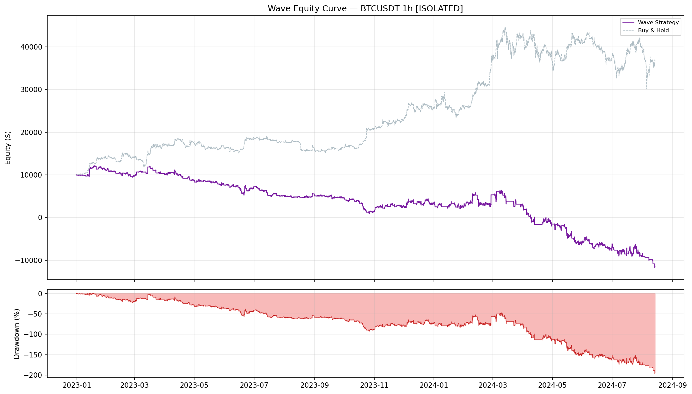
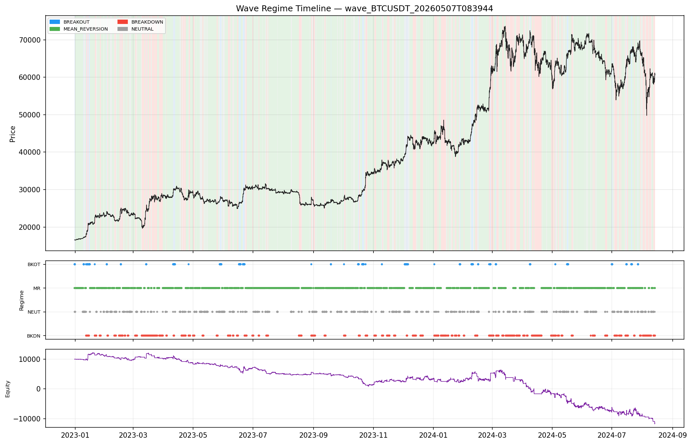
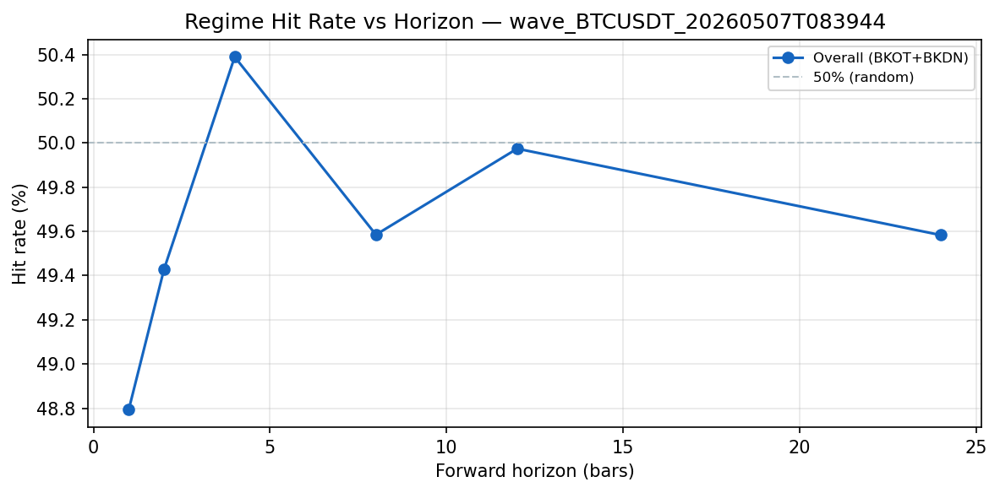
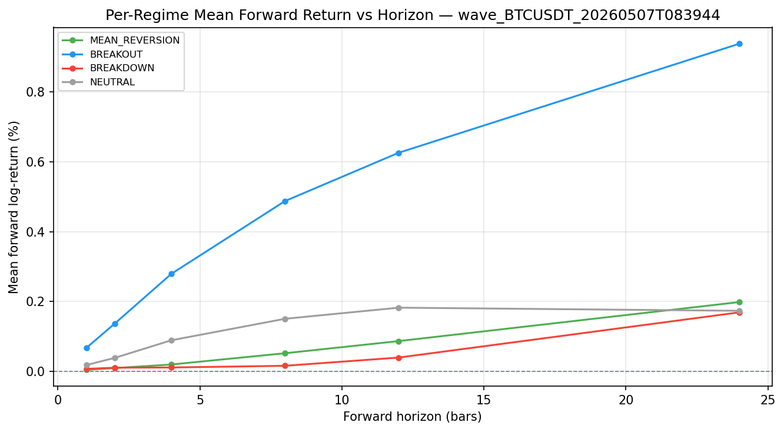
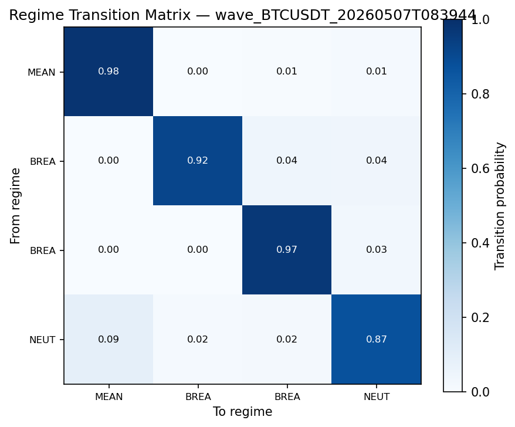
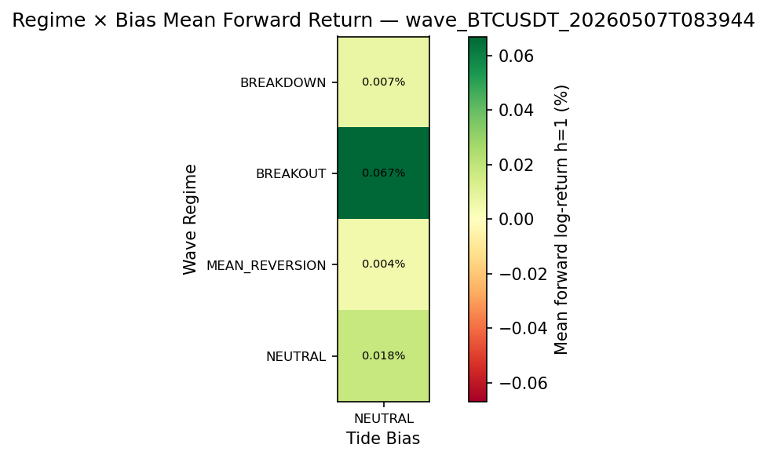

# Wave Backtest Report
**Symbol:** BTCUSDT | **Timeframe:** 1h | **Mode:** ISOLATED | **Exchange:** binance  
**Period:** 2022-12-31 05:00:00 → 2024-08-13 21:00:00 | **Bars:** 14,201

## Equity Curve

## Returns & Growth
| Metric | Formula | Value |
|---|---|---|
| Total Return | $\frac{E_N - E_0}{E_0}$ | -214.41% |
| CAGR | $(E_N/E_0)^{P/N} - 1$ | 0.00% |
| Initial Capital | $E_0$ | $10,000.00 |
| Final Equity | $E_N$ | $-11,440.73 |

## Risk
| Metric | Formula | Value |
|---|---|---|
| Ann. Volatility | $\sigma(r) \times \sqrt{P}$ | 78.38% |
| Ann. Downside Vol | $\sigma(\min(r,0)) \times \sqrt{P}$ | 56.06% |
| Max Drawdown | $\min_t (E_t - \text{peak}_t)/\text{peak}_t$ | -196.34% |
| Max DD Duration (bars) | 13,759 |
| VaR 95% | $-Q_{0.05}(r)$ | 1.09% |
| CVaR 95% (ES) | $-\mathbb{E}[r \mid r < \text{VaR}_{95}]$ | 2.18% |
| VaR 99% | $-Q_{0.01}(r)$ | 2.91% |
| CVaR 99% (ES) | $-\mathbb{E}[r \mid r < \text{VaR}_{99}]$ | 4.13% |
| Ulcer Index | $\sqrt{N^{-1}\sum D_t^2}$ | 0.8444 |
| Skewness | $\frac{1}{N}\sum((r_t-\bar r)/\sigma)^3$ | 0.6655 |
| Excess Kurtosis | $\frac{1}{N}\sum((r_t-\bar r)/\sigma)^4 - 3$ | 34.1276 |

## Risk-Adjusted
| Metric | Formula | Value |
|---|---|---|
| Sharpe Ratio | $(\bar{r} \cdot P - R_f)\,/\,(\sigma\sqrt{P})$ | -1.6873 |
| Sortino Ratio | $(\text{CAGR} - \text{MAR})\,/\,(\sigma_d\sqrt{P})$ | -2.3593 |
| Calmar Ratio | $\text{CAGR}\,/\,\lvert\text{MDD}\rvert$ | 0.0000 |

## Activity & Trades
| Metric | Value |
|---|---|
| Num Trades | 1,565 |
| Exposure % | 63.8% |
| Win Rate | 65.02% |
| Profit Factor | 0.8041 |
| Avg Win | $90.44 |
| Avg Loss | $-209.08 |
| Expectancy / Bar | -0.0151% |

## Per-Regime Breakdown
| Regime | Time % | PnL Contribution | Sharpe | N Bars |
|---|---|---|---|---|
| BREAKOUT | 3.9% | $10,042.92 | 7.64 | 547 |
| MEAN_REVERSION | 59.9% | $-29,494.43 | -3.53 | 8,512 |
| BREAKDOWN | 23.3% | $-773.91 | -12.96 | 3,309 |
| NEUTRAL | 12.9% | $-1,215.30 | -22.21 | 1,833 |

## Monthly Returns
Best month: 271.41%  |  Worst month: -158.18%  |  Positive months: 45.0%

| Month | Return |
|---|---|
| 2023-01 | 13.82% |
| 2023-02 | -13.99% |
| 2023-03 | 3.70% |
| 2023-04 | -13.84% |
| 2023-05 | -12.81% |
| 2023-06 | -5.39% |
| 2023-07 | -27.95% |
| 2023-08 | -2.30% |
| 2023-09 | -8.71% |
| 2023-10 | -67.70% |
| 2023-11 | 81.95% |
| 2023-12 | 28.87% |
| 2024-01 | -9.74% |
| 2024-02 | 68.25% |
| 2024-03 | -50.28% |
| 2024-04 | -158.18% |
| 2024-05 | 271.41% |
| 2024-06 | 19.36% |
| 2024-07 | 26.95% |
| 2024-08 | 32.08% |

## Regime Timeline

## Wave Regime Accuracy

Accuracy measures whether the Wave regime at time $t$ predicts the direction of price over the next $h$ bars.  For BREAKOUT and BREAKDOWN bars (where $g(\rho_t) \neq 0$):

$$\text{Hit Rate} = \frac{|\{t \in \mathcal{D} : g(\rho_t) \cdot f_t^{(h)} > 0\}|}{|\mathcal{D}|} \times 100\qquad \text{IC} = \text{corr}\!\left(g(\rho_t),\; f_t^{(h)}\right)$$

where $f_t^{(h)} = \log(c_{t+h}/c_t)$ and $\mathcal{D} = \{t : g(\rho_t) \neq 0\}$ (BREAKOUT + BREAKDOWN bars).

### Overall Hit Rate & IC
| Horizon $h$ | Bars | Hit Rate | IC |
|---|---|---|---|
| 1h | 1 | 48.79% | 0.0110 |
| 2h | 2 | 49.43% | 0.0185 |
| 4h | 4 | 50.39% | 0.0315 |
| 8h | 8 | 49.58% | 0.0424 |
| 12h | 12 | 49.97% | 0.0425 |
| 24h | 24 | 49.58% | 0.0319 |

### Per-Regime Forward Return

Mean forward log-return $\mathbb{E}[f_t^{(h)} \mid \rho_t = R]$ and regime hit rate per horizon:

**Horizon $h=1$ bars (1h)**
| Regime | $N$ | Mean $f^{(h)}$ | Median $f^{(h)}$ | Hit Rate |
|---|---|---|---|---|
| MEAN_REVERSION | 8512 | 0.004% | 0.006% | 0.00% |
| BREAKOUT | 547 | 0.067% | 0.002% | 50.27% |
| BREAKDOWN | 3308 | 0.007% | 0.019% | 48.55% |
| NEUTRAL | 1833 | 0.018% | 0.009% | 0.00% |

**Horizon $h=2$ bars (2h)**
| Regime | $N$ | Mean $f^{(h)}$ | Median $f^{(h)}$ | Hit Rate |
|---|---|---|---|---|
| MEAN_REVERSION | 8512 | 0.009% | 0.009% | 0.00% |
| BREAKOUT | 547 | 0.137% | 0.050% | 53.20% |
| BREAKDOWN | 3307 | 0.011% | 0.014% | 48.81% |
| NEUTRAL | 1833 | 0.039% | 0.021% | 0.00% |

**Horizon $h=4$ bars (4h)**
| Regime | $N$ | Mean $f^{(h)}$ | Median $f^{(h)}$ | Hit Rate |
|---|---|---|---|---|
| MEAN_REVERSION | 8510 | 0.020% | 0.006% | 0.00% |
| BREAKOUT | 547 | 0.280% | 0.100% | 55.58% |
| BREAKDOWN | 3307 | 0.011% | 0.010% | 49.53% |
| NEUTRAL | 1833 | 0.089% | 0.042% | 0.00% |

**Horizon $h=8$ bars (8h)**
| Regime | $N$ | Mean $f^{(h)}$ | Median $f^{(h)}$ | Hit Rate |
|---|---|---|---|---|
| MEAN_REVERSION | 8507 | 0.052% | 0.013% | 0.00% |
| BREAKOUT | 547 | 0.488% | 0.199% | 57.04% |
| BREAKDOWN | 3307 | 0.016% | 0.049% | 48.35% |
| NEUTRAL | 1832 | 0.151% | 0.076% | 0.00% |

**Horizon $h=12$ bars (12h)**
| Regime | $N$ | Mean $f^{(h)}$ | Median $f^{(h)}$ | Hit Rate |
|---|---|---|---|---|
| MEAN_REVERSION | 8507 | 0.087% | 0.025% | 0.00% |
| BREAKOUT | 547 | 0.626% | 0.214% | 57.22% |
| BREAKDOWN | 3303 | 0.040% | 0.048% | 48.77% |
| NEUTRAL | 1832 | 0.182% | 0.106% | 0.00% |

**Horizon $h=24$ bars (24h)**
| Regime | $N$ | Mean $f^{(h)}$ | Median $f^{(h)}$ | Hit Rate |
|---|---|---|---|---|
| MEAN_REVERSION | 8507 | 0.198% | 0.047% | 0.00% |
| BREAKOUT | 547 | 0.938% | 0.426% | 63.62% |
| BREAKDOWN | 3291 | 0.169% | 0.147% | 47.25% |
| NEUTRAL | 1832 | 0.173% | 0.186% | 0.00% |

### Regime Transition Matrix

Row-normalised probabilities $T_{ij} = P(\rho_{t+1}=j \mid \rho_t=i)$:

| From \ To | MEAN_REVERSION | BREAKOUT | BREAKDOWN | NEUTRAL |
|---|---|---|---|---|
| MEAN_REVERSION | 0.981 | 0.001 | 0.006 | 0.013 |
| BREAKOUT | 0.000 | 0.916 | 0.044 | 0.040 |
| BREAKDOWN | 0.000 | 0.004 | 0.966 | 0.031 |
| NEUTRAL | 0.089 | 0.015 | 0.021 | 0.874 |

### Regime Stability

Mean consecutive-bar run length per regime ($\approx 1/(1-T_{ii})$ from transition matrix diagonal):

| Regime | Mean Run (bars) |
|---|---|
| MEAN_REVERSION | 51.6 |
| BREAKOUT | 11.9 |
| BREAKDOWN | 28.8 |
| NEUTRAL | 7.9 |

### Regime × Tide Bias Confusion

Mean forward log-return at $h=1$ for each $(\rho_t, b_t)$ combination (stacked mode only):

| Wave Regime \ Tide Bias | NEUTRAL |
|---|---|
| BREAKDOWN | 0.007% |
| BREAKOUT | 0.067% |
| MEAN_REVERSION | 0.004% |
| NEUTRAL | 0.018% |

## Parameters
| Parameter | Value |
|---|---|
| symbol | BTCUSDT |
| exchange | binance |
| timeframe | 1h |
| mode | isolated |
| sizing_mode | base |
| max_position_base | 1.0 |
| max_position_usd | 10000.0 |
| initial_capital | 10000.0 |
| leverage | 1.0 |
| taker_fee_bps | 4.0 |
| eta_window | 24 |
| vwap_window | 24 |
| disp_window | 24 |
| ar_window | 48 |
| disp_scale | 0.05 |
| eta_mr_threshold | 0.15 |
| eta_bo_threshold | 0.4 |
| eta_neutral_threshold | 0.28 |
| dispersion_threshold | 0.12 |
| dispersion_critical | 0.22 |
| ar_critical | 0.95 |
| ar_recover | 0.65 |
| reduced_size_fraction | 0.5 |
| update_interval_ms | 0 |
| accuracy_horizons | [1, 2, 4, 8, 12, 24] |
| bar_seconds | 3600.0 |

---

## Metric Glossary

> Full derivations and plain-language definitions are in `METRICS_GLOSSARY.md`
> at the repository root.  The compact reference below covers every number in
> this report.

### Returns & Growth

| Metric | Formula | Plain language |
|---|---|---|
| **Total Return** | $\frac{E_N - E_0}{E_0}$ | Simple % gain/loss over the full period |
| **CAGR** | $\left(\frac{E_N}{E_0}\right)^{P/N} - 1$ | Constant annual growth rate; normalised for run length |

### Risk

| Metric | Formula | Plain language |
|---|---|---|
| **Ann. Volatility** | $\sigma(r) \times \sqrt{P}$ | Annualised return std; penalises up and down moves equally |
| **Ann. Downside Vol** | $\sigma(\min(r,0)) \times \sqrt{P}$ | Volatility of losses only |
| **Max Drawdown** | $\min_t \frac{E_t - \max_{s\leq t} E_s}{\max_{s\leq t} E_s}$ | Worst peak-to-trough decline as a fraction of the prior peak |
| **VaR 95 / 99** | $-Q_{0.05/0.01}(r)$ | Loss exceeded on 5%/1% of bars |
| **CVaR / ES** | $-\mathbb{E}[r \mid r < \text{VaR}]$ | Average loss in the worst 5%/1% tail |
| **Ulcer Index** | $\sqrt{\frac{1}{N}\sum D_t^2}$ | RMS drawdown depth; penalises deep + prolonged drawdowns |

### Risk-Adjusted

| Metric | Formula | Plain language |
|---|---|---|
| **Sharpe** | $\frac{\bar{r} \cdot P - R_f}{\sigma \cdot \sqrt{P}}$ | Return per unit of total volatility, annualised |
| **Sortino** | $\frac{\text{CAGR} - \text{MAR}}{\sigma_d \cdot \sqrt{P}}$ | Like Sharpe but only penalises downside volatility |
| **Calmar** | $\frac{\text{CAGR}}{\lvert\text{MDD}\rvert}$ | Return per unit of worst drawdown |

### Wave Regime Accuracy

| Metric | Formula | Plain language |
|---|---|---|
| **Regime Hit Rate** | $\frac{\lvert\{t \in \mathcal{D} : g(\rho_t) \cdot f_t^{(h)} > 0\}\rvert}{\lvert\mathcal{D}\rvert} \times 100$ | % of BREAKOUT/BREAKDOWN bars where forward return aligned with regime direction |
| **Regime IC** | $\text{corr}(g(\rho_t),\; f_t^{(h)})$ | Pearson correlation of regime signal with forward log-returns |
| **Transition Prob** | $P(\rho_{t+1}=j \mid \rho_t=i)$ | Row-normalised probability of moving from regime $i$ to regime $j$ |
| **Regime Stability** | $\mathbb{E}[\text{consecutive bars in regime } R]$ | Mean run length per regime; higher = more persistent (less whipsaw) |

Where $g(\rho_t) \in \{+1, 0, -1\}$: BREAKOUT $\to +1$, BREAKDOWN $\to -1$, MR/NEUTRAL $\to 0$.

### Wave Sizing

$$\text{target\_units} = \underbrace{b_t}_{\text{Tide sign}} \times \underbrace{m_t}_{\text{Tide risk mult}} \times \underbrace{\phi(\rho_t)}_{\text{Wave size frac}} \times q_{\max}$$

| $\rho_t$ | $\phi(\rho_t)$ |
|---|---|
| BREAKOUT | $1.0$ |
| MEAN\_REVERSION | `reduced_size_fraction` |
| NEUTRAL | `reduced_size_fraction` |
| BREAKDOWN | $0.0$ |
