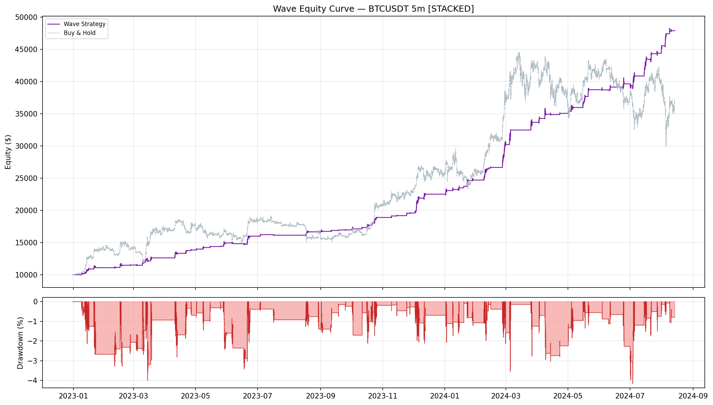
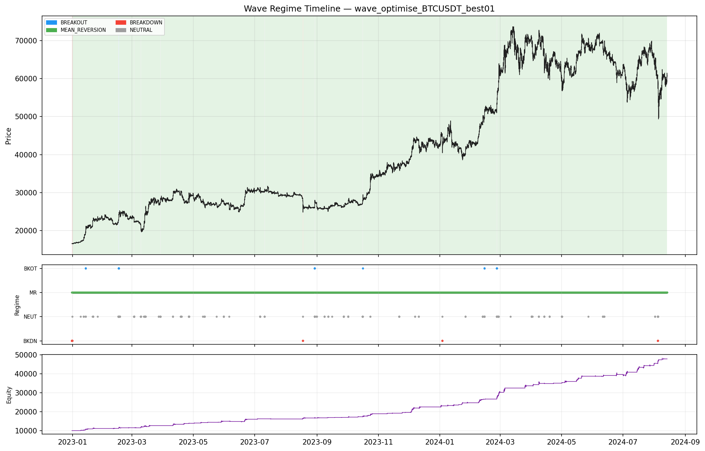
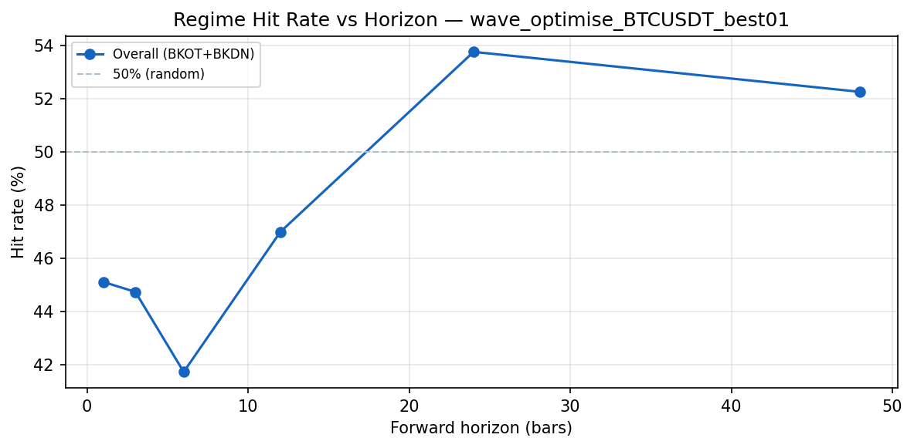
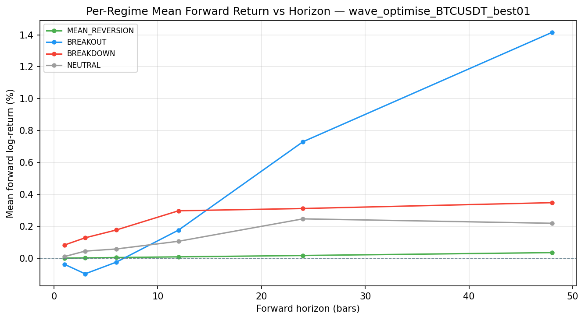
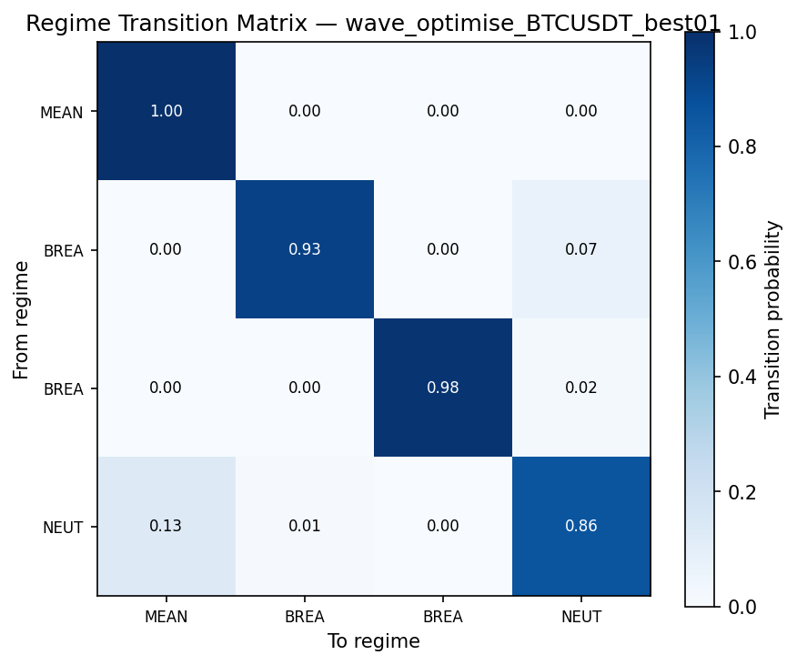
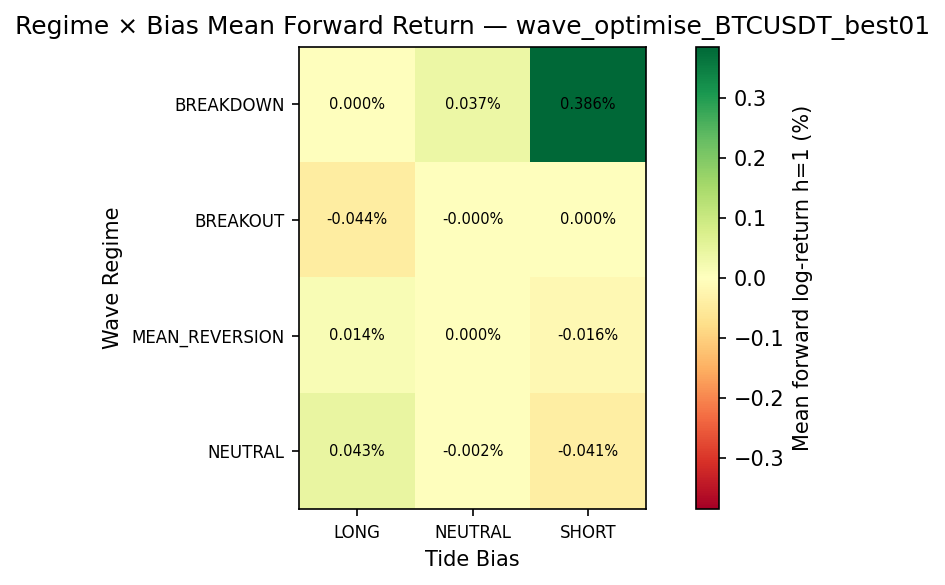

# Wave Backtest Report
**Symbol:** BTCUSDT | **Timeframe:** 5m | **Mode:** STACKED | **Exchange:** binance  
**Period:** 2022-12-31 05:40:00 → 2024-08-13 21:40:00 | **Bars:** 170,401

## Equity Curve

## Returns & Growth
| Metric | Formula | Value |
|---|---|---|
| Total Return | $\frac{E_N - E_0}{E_0}$ | 378.81% |
| CAGR | $(E_N/E_0)^{P/N} - 1$ | 162.78% |
| Initial Capital | $E_0$ | $10,000.00 |
| Final Equity | $E_N$ | $47,880.86 |

## Risk
| Metric | Formula | Value |
|---|---|---|
| Ann. Volatility | $\sigma(r) \times \sqrt{P}$ | 37.89% |
| Ann. Downside Vol | $\sigma(\min(r,0)) \times \sqrt{P}$ | 24.81% |
| Max Drawdown | $\min_t (E_t - \text{peak}_t)/\text{peak}_t$ | -4.18% |
| Max DD Duration (bars) | 2,746 |
| VaR 95% | $-Q_{0.05}(r)$ | 0.02% |
| CVaR 95% (ES) | $-\mathbb{E}[r \mid r < \text{VaR}_{95}]$ | 0.22% |
| VaR 99% | $-Q_{0.01}(r)$ | 0.33% |
| CVaR 99% (ES) | $-\mathbb{E}[r \mid r < \text{VaR}_{99}]$ | 0.62% |
| Ulcer Index | $\sqrt{N^{-1}\sum D_t^2}$ | 0.0127 |
| Skewness | $\frac{1}{N}\sum((r_t-\bar r)/\sigma)^3$ | 1.6313 |
| Excess Kurtosis | $\frac{1}{N}\sum((r_t-\bar r)/\sigma)^4 - 3$ | 130.1421 |

## Risk-Adjusted
| Metric | Formula | Value |
|---|---|---|
| Sharpe Ratio | $(\bar{r} \cdot P - R_f)\,/\,(\sigma\sqrt{P})$ | 6.1675 |
| Sortino Ratio | $(\text{CAGR} - \text{MAR})\,/\,(\sigma_d\sqrt{P})$ | 9.4208 |
| Calmar Ratio | $\text{CAGR}\,/\,\lvert\text{MDD}\rvert$ | 38.9888 |

## Activity & Trades
| Metric | Value |
|---|---|
| Num Trades | 658 |
| Exposure % | 11.5% |
| Win Rate | 80.63% |
| Profit Factor | 13.6730 |
| Avg Win | $276.65 |
| Avg Loss | $-84.21 |
| Expectancy / Bar | 0.0022% |

## Per-Regime Breakdown
| Regime | Time % | PnL Contribution | Sharpe | N Bars | Trades | Fees Paid | Turnover |
|---|---|---|---|---|---|---|---|
| BREAKOUT | 0.1% | $-343.13 | -27.28 | 88 | 6 | $31.10 | $77,742.26 |
| MEAN_REVERSION | 99.5% | $36,901.36 | 6.12 | 169,625 | 626 | $3,519.08 | $8,797,712.46 |
| BREAKDOWN | 0.1% | $-5.52 | -24.30 | 178 | 1 | $5.52 | $13,805.51 |
| NEUTRAL | 0.3% | $1,328.15 | 26.27 | 510 | 25 | $99.47 | $248,683.64 |

## Chop / Turnover Diagnostics
| Metric | Value |
|---|---|
| Total Regime Flips | 150 |
| Flips per Bar | 0.0009 |
| Total Trades | 658 |
| Trades per 100 Bars | 0.39 |

### Regime Run-Length Histogram

Counts of consecutive-bar runs per regime, bucketed by run length.  Frequent short runs (`1` and `2-5`) signal chop; long runs (`21-100` and `100+`) signal sustained regime expression.

| Regime | 1 | 2-5 | 6-20 | 21-100 | 100+ |
|---|---|---|---|---|---|
| MEAN_REVERSION | 1 | 3 | 2 | 4 | 58 |
| BREAKDOWN | 0 | 0 | 3 | 0 | 1 |
| NEUTRAL | 19 | 23 | 24 | 7 | 0 |
| BREAKOUT | 0 | 1 | 4 | 1 | 0 |

## Monthly Returns
Best month: 22.31%  |  Worst month: 0.93%  |  Positive months: 100.0%

| Month | Return |
|---|---|
| 2023-01 | 11.06% |
| 2023-02 | 3.65% |
| 2023-03 | 9.66% |
| 2023-04 | 9.73% |
| 2023-05 | 7.89% |
| 2023-06 | 7.00% |
| 2023-07 | 0.93% |
| 2023-08 | 3.20% |
| 2023-09 | 1.86% |
| 2023-10 | 11.37% |
| 2023-11 | 3.69% |
| 2023-12 | 14.88% |
| 2024-01 | 9.76% |
| 2024-02 | 22.31% |
| 2024-03 | 11.42% |
| 2024-04 | 4.11% |
| 2024-05 | 10.47% |
| 2024-06 | 2.36% |
| 2024-07 | 14.05% |
| 2024-08 | 5.91% |

## Regime Timeline

## Wave Regime Accuracy

Accuracy measures whether the Wave regime at time $t$ predicts the direction of price over the next $h$ bars.  For BREAKOUT and BREAKDOWN bars (where $g(\rho_t) \neq 0$):

$$\text{Hit Rate} = \frac{|\{t \in \mathcal{D} : g(\rho_t) \cdot f_t^{(h)} > 0\}|}{|\mathcal{D}|} \times 100\qquad \text{IC} = \text{corr}\!\left(g(\rho_t),\; f_t^{(h)}\right)$$

where $f_t^{(h)} = \log(c_{t+h}/c_t)$ and $\mathcal{D} = \{t : g(\rho_t) \neq 0\}$ (BREAKOUT + BREAKDOWN bars).

### Overall Hit Rate & IC
| Horizon $h$ | Bars | Hit Rate | IC |
|---|---|---|---|
| 5min | 1 | 45.11% | -0.0173 |
| 15min | 3 | 44.74% | -0.0179 |
| 30min | 6 | 41.73% | -0.0137 |
| 1h | 12 | 46.99% | -0.0107 |
| 2h | 24 | 53.76% | 0.0022 |
| 4h | 48 | 52.26% | 0.0097 |

### Per-Regime Forward Return

Mean forward log-return $\mathbb{E}[f_t^{(h)} \mid \rho_t = R]$ and regime hit rate per horizon:

**Horizon $h=1$ bars (5min)**
| Regime | $N$ | Mean $f^{(h)}$ | Median $f^{(h)}$ | Hit Rate |
|---|---|---|---|---|
| MEAN_REVERSION | 169624 | 0.001% | 0.000% | 0.00% |
| BREAKOUT | 88 | -0.038% | -0.018% | 45.45% |
| BREAKDOWN | 178 | 0.082% | 0.003% | 44.94% |
| NEUTRAL | 510 | 0.010% | 0.016% | 0.00% |

**Horizon $h=3$ bars (15min)**
| Regime | $N$ | Mean $f^{(h)}$ | Median $f^{(h)}$ | Hit Rate |
|---|---|---|---|---|
| MEAN_REVERSION | 169622 | 0.002% | 0.001% | 0.00% |
| BREAKOUT | 88 | -0.098% | 0.026% | 53.41% |
| BREAKDOWN | 178 | 0.128% | 0.019% | 40.45% |
| NEUTRAL | 510 | 0.044% | 0.023% | 0.00% |

**Horizon $h=6$ bars (30min)**
| Regime | $N$ | Mean $f^{(h)}$ | Median $f^{(h)}$ | Hit Rate |
|---|---|---|---|---|
| MEAN_REVERSION | 169619 | 0.004% | 0.002% | 0.00% |
| BREAKOUT | 88 | -0.025% | 0.071% | 55.68% |
| BREAKDOWN | 178 | 0.177% | 0.024% | 34.83% |
| NEUTRAL | 510 | 0.058% | 0.024% | 0.00% |

**Horizon $h=12$ bars (1h)**
| Regime | $N$ | Mean $f^{(h)}$ | Median $f^{(h)}$ | Hit Rate |
|---|---|---|---|---|
| MEAN_REVERSION | 169613 | 0.008% | 0.004% | 0.00% |
| BREAKOUT | 88 | 0.176% | 0.126% | 64.77% |
| BREAKDOWN | 178 | 0.297% | 0.043% | 38.20% |
| NEUTRAL | 510 | 0.106% | 0.052% | 0.00% |

**Horizon $h=24$ bars (2h)**
| Regime | $N$ | Mean $f^{(h)}$ | Median $f^{(h)}$ | Hit Rate |
|---|---|---|---|---|
| MEAN_REVERSION | 169601 | 0.017% | 0.010% | 0.00% |
| BREAKOUT | 88 | 0.730% | 0.688% | 86.36% |
| BREAKDOWN | 178 | 0.311% | 0.056% | 37.64% |
| NEUTRAL | 510 | 0.247% | 0.144% | 0.00% |

**Horizon $h=48$ bars (4h)**
| Regime | $N$ | Mean $f^{(h)}$ | Median $f^{(h)}$ | Hit Rate |
|---|---|---|---|---|
| MEAN_REVERSION | 169577 | 0.035% | 0.016% | 0.00% |
| BREAKOUT | 88 | 1.415% | 1.866% | 88.64% |
| BREAKDOWN | 178 | 0.348% | 0.118% | 34.27% |
| NEUTRAL | 510 | 0.219% | 0.185% | 0.00% |

### Regime Transition Matrix

Row-normalised probabilities $T_{ij} = P(\rho_{t+1}=j \mid \rho_t=i)$:

| From \ To | MEAN_REVERSION | BREAKOUT | BREAKDOWN | NEUTRAL |
|---|---|---|---|---|
| MEAN_REVERSION | 1.000 | 0.000 | 0.000 | 0.000 |
| BREAKOUT | 0.000 | 0.932 | 0.000 | 0.068 |
| BREAKDOWN | 0.000 | 0.000 | 0.978 | 0.022 |
| NEUTRAL | 0.131 | 0.010 | 0.002 | 0.857 |

### Regime Stability

Mean consecutive-bar run length per regime ($\approx 1/(1-T_{ii})$ from transition matrix diagonal):

| Regime | Mean Run (bars) |
|---|---|
| MEAN_REVERSION | 2494.5 |
| BREAKOUT | 14.7 |
| BREAKDOWN | 44.5 |
| NEUTRAL | 7.0 |

### Regime × Tide Bias Confusion

Mean forward log-return at $h=1$ for each $(\rho_t, b_t)$ combination (stacked mode only):

| Wave Regime \ Tide Bias | LONG | NEUTRAL | SHORT |
|---|---|---|---|
| BREAKDOWN | 0.000% | 0.037% | 0.386% |
| BREAKOUT | -0.044% | -0.000% | 0.000% |
| MEAN_REVERSION | 0.014% | 0.000% | -0.016% |
| NEUTRAL | 0.043% | -0.002% | -0.041% |

## Parameters
| Parameter | Value |
|---|---|
| symbol | BTCUSDT |
| exchange | binance |
| timeframe | 5m |
| mode | stacked |
| sizing_mode | base |
| max_position_base | 1.0 |
| max_position_usd | 10000.0 |
| initial_capital | 10000.0 |
| leverage | 1.0 |
| taker_fee_bps | 4.0 |
| eta_window | 29 |
| vwap_window | 8 |
| disp_window | 37 |
| ar_window | 34 |
| disp_scale | 0.099 |
| eta_mr_threshold | 0.43 |
| eta_bo_threshold | 0.63 |
| eta_neutral_threshold | 0.49 |
| dispersion_threshold | 1.288 |
| dispersion_critical | 3.0 |
| ar_critical | 0.6 |
| ar_recover | 0.41 |
| reduced_size_fraction | 0.6 |
| update_interval_ms | 0 |
| accuracy_horizons | [1, 3, 6, 12, 24, 48] |
| bar_seconds | 300.0 |
| liquidation_equity_frac | 0.0 |
| slippage_bps | 0.0 |
| slippage_per_unit_bps | 0.0 |

---

## Metric Glossary

> Full derivations and plain-language definitions are in `METRICS_GLOSSARY.md`
> at the repository root.  The compact reference below covers every number in
> this report.

### Returns & Growth

| Metric | Formula | Plain language |
|---|---|---|
| **Total Return** | $\frac{E_N - E_0}{E_0}$ | Simple % gain/loss over the full period |
| **CAGR** | $\left(\frac{E_N}{E_0}\right)^{P/N} - 1$ | Constant annual growth rate; normalised for run length |

### Risk

| Metric | Formula | Plain language |
|---|---|---|
| **Ann. Volatility** | $\sigma(r) \times \sqrt{P}$ | Annualised return std; penalises up and down moves equally |
| **Ann. Downside Vol** | $\sigma(\min(r,0)) \times \sqrt{P}$ | Volatility of losses only |
| **Max Drawdown** | $\min_t \frac{E_t - \max_{s\leq t} E_s}{\max_{s\leq t} E_s}$ | Worst peak-to-trough decline as a fraction of the prior peak |
| **VaR 95 / 99** | $-Q_{0.05/0.01}(r)$ | Loss exceeded on 5%/1% of bars |
| **CVaR / ES** | $-\mathbb{E}[r \mid r < \text{VaR}]$ | Average loss in the worst 5%/1% tail |
| **Ulcer Index** | $\sqrt{\frac{1}{N}\sum D_t^2}$ | RMS drawdown depth; penalises deep + prolonged drawdowns |

### Risk-Adjusted

| Metric | Formula | Plain language |
|---|---|---|
| **Sharpe** | $\frac{\bar{r} \cdot P - R_f}{\sigma \cdot \sqrt{P}}$ | Return per unit of total volatility, annualised |
| **Sortino** | $\frac{\text{CAGR} - \text{MAR}}{\sigma_d \cdot \sqrt{P}}$ | Like Sharpe but only penalises downside volatility |
| **Calmar** | $\frac{\text{CAGR}}{\lvert\text{MDD}\rvert}$ | Return per unit of worst drawdown |

### Wave Regime Accuracy

| Metric | Formula | Plain language |
|---|---|---|
| **Regime Hit Rate** | $\frac{\lvert\{t \in \mathcal{D} : g(\rho_t) \cdot f_t^{(h)} > 0\}\rvert}{\lvert\mathcal{D}\rvert} \times 100$ | % of BREAKOUT/BREAKDOWN bars where forward return aligned with regime direction |
| **Regime IC** | $\text{corr}(g(\rho_t),\; f_t^{(h)})$ | Pearson correlation of regime signal with forward log-returns |
| **Transition Prob** | $P(\rho_{t+1}=j \mid \rho_t=i)$ | Row-normalised probability of moving from regime $i$ to regime $j$ |
| **Regime Stability** | $\mathbb{E}[\text{consecutive bars in regime } R]$ | Mean run length per regime; higher = more persistent (less whipsaw) |

Where $g(\rho_t) \in \{+1, 0, -1\}$: BREAKOUT $\to +1$, BREAKDOWN $\to -1$, MR/NEUTRAL $\to 0$.

### Wave Sizing

$$\text{target\_units} = \underbrace{b_t}_{\text{Tide sign}} \times \underbrace{m_t}_{\text{Tide risk mult}} \times \underbrace{\phi(\rho_t)}_{\text{Wave size frac}} \times q_{\max}$$

| $\rho_t$ | $\phi(\rho_t)$ |
|---|---|
| BREAKOUT | $1.0$ |
| MEAN\_REVERSION | `reduced_size_fraction` |
| NEUTRAL | `reduced_size_fraction` |
| BREAKDOWN | $0.0$ |
