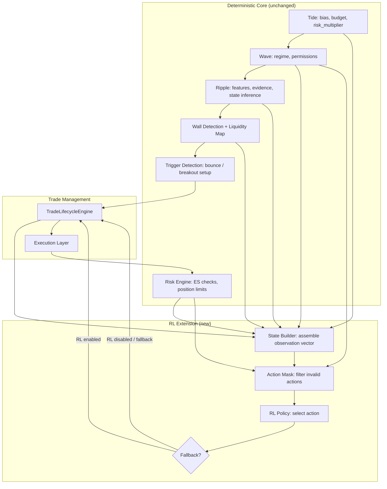
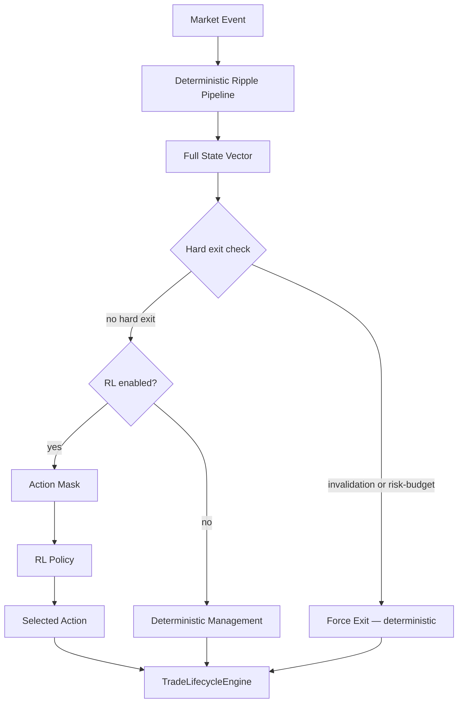
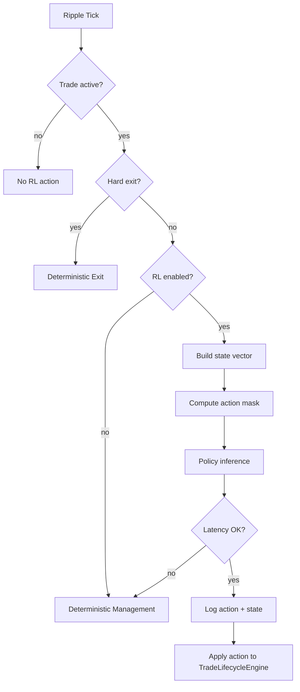

# Reinforcement Learning Extension — Tide / Wave / Ripple Strategy

## 1. Overview

This document defines how reinforcement learning (RL) can be integrated into the Tide / Wave / Ripple multi-layer crypto strategy as a **constrained policy extension** — not a replacement for the deterministic core.

The canonical strategy is defined in `strategy.md`. That document specifies a deterministic, rule-based system with explicit state machines, exit taxonomy, scaling logic, and risk budgeting. Every component has a testable, replayable baseline.

RL enters the picture only after the deterministic baseline is complete, validated, and producing measurable results on historical data. RL's role is to **improve specific decisions within the guardrails established by the deterministic system** — primarily post-entry trade management, exit timing, and scaling — not to replace the architecture.

**Source-of-truth hierarchy with RL:**

| Priority | Document | Role |
|---|---|---|
| 1 | `strategy.md` | Canonical strategy design, math, contracts, hard constraints |
| 2 | `implementation_plan.md` | Build plan, phases, module mapping |
| 3 | Tests | Executable specification |
| 4 | `AGENT_STRATEGY_RULES.md` | Operational rules for coding agents |
| 5 | This document (`rl_extension.md`) | RL extension design |
| 6 | `context_engine.md` | Context Engine design (separate extension) |

**Rule:** RL cannot override anything defined in documents with higher priority. If an RL policy produces an action that violates `strategy.md` constraints, the action is rejected.

---

## 2. Dependencies on strategy.md

This document depends on the following `strategy.md` sections. Any change to these sections may require updates here.

| strategy.md Section | What This Document Depends On |
|---|---|
| §5 (Architecture) | Layer boundaries, information flow direction, cadence hierarchy |
| §7.5 (V1 Pre-Phase Defaults) | Default Tide/Wave snapshots used when those layers are not yet implemented |
| §9.4 (Liquidity Transitions) | `LiquidityState` enum values: `STABLE`, `ABSORPTION`, `EXHAUSTION`, `WITHDRAWAL`, `REFILL` |
| §9.7 (State Inference) | `ScoreBasedInference` outputs that RL observes |
| §11 (Trade Archetypes) | `TradeArchetype` enum: `BOUNCE`, `BREAKOUT` — used in RL state encoding |
| §12 (Trade Lifecycle) | `LifecycleState` enum: `SETUP` through `CANCELLED` — determines when RL is active |
| §13 (Exit Taxonomy) | Five exit types and their priority order — determines hard exits that bypass RL |
| §14 (Scaling Logic) | Scale-in/out rules — determines which RL actions are valid |
| §15 (Risk Budgeting) | ES throttle — enforced as a hard constraint on RL actions |
| §16 (Feature Schema) | Canonical feature names and namespaces — RL state vector references these |
| §17 (Data Contracts) | Struct definitions consumed by the RL state builder |
| §18 (Permissions Matrix) | `PermissionSet` — enforced as a constraint, not overridable by RL |
| §22 (V1 Boundaries) | Single symbol, max 1 trade, event-time only |
| §27 (Configuration) | All parameter namespaces — RL config must not conflict |
| §29 (Enum Reference) | Canonical enum names used throughout this document |

---

## 3. Implementation Order Constraints

RL integration has strict ordering dependencies on the main strategy implementation phases defined in `implementation_plan.md`:

| RL Stage | Requires Strategy Phase | Rationale |
|---|---|---|
| RL environment design | Phase 2 complete (`TradeLifecycleEngine` exists) | RL episodes are defined by trade lifecycle boundaries |
| State vector assembly | Phase 3 complete (`LiquidityMapEngine` exists) | State includes liquidity map features |
| Risk-constrained action masking | Phase 4 complete (`RiskEngine` exists) | Action mask requires live risk budget queries |
| Full observation space | Phase 5 complete (`WaveEngine` exists) | State includes Wave regime and permissions |
| Replay-based training | Phase 6 complete (replay consistency validated) | Training requires deterministic replay |
| Shadow mode deployment | Phase 6 complete (full V1 pipeline operational) | Shadow mode runs alongside the validated deterministic system |

**Hard rule:** No RL code should be deployed or trained until `implementation_plan.md` Phases 1-6 are complete and validated. RL corresponds to a post-V1 extension, not part of the V1 deterministic baseline.

The RL implementation itself follows the staged rollout in §5 of this document. The first RL deliverable (offline training environment + behavioral cloning warmstart) maps to after Phase 7 of `implementation_plan.md` (HMM extensions), though it can be developed in parallel with Phase 7 since they are independent.

---

## 4. Why RL Fits This Strategy

The Tide / Wave / Ripple architecture is well-suited to constrained RL because:

1. **The state space is already well-defined.** The strategy computes a rich set of deterministic features (imbalance, microprice, CVD slope, wall quality, liquidity state, hold/break scores, trade lifecycle state, risk budget state) that form a natural observation vector. There is no need to learn state representations from raw data. See `strategy.md` §16 for the full feature schema.

2. **The action space is naturally discrete and small.** Trade management decisions (hold, reduce, exit, add, switch to runner mode) are a small, well-defined set. This avoids the curse of dimensionality in continuous action spaces and makes policy learning tractable.

3. **Hard constraints are already formalized.** Risk budgets (`strategy.md` §15), position limits (`strategy.md` §7), permission matrices (`strategy.md` §18), invalidation rules (`strategy.md` §13.3.1), and kill switches are already implemented as deterministic gates. RL can operate inside these constraints without needing to learn them.

4. **The deterministic baseline provides a strong benchmark.** The rule-based exit taxonomy (`strategy.md` §13), scaling logic (`strategy.md` §14), and trailing stop mechanics (`strategy.md` §14.3) already define a competent policy. RL needs only to beat this baseline — not solve the problem from scratch.

5. **Replay infrastructure exists.** The `ReplayFeed` and deterministic backtest engine provide a natural training environment. Episodes can be constructed from historical trades with consistent state transitions.

6. **The problem has natural episode boundaries.** Each trade lifecycle (`strategy.md` §12: `SETUP` through `COOLDOWN`) is a bounded episode with clear terminal states, making episodic RL formulations straightforward.

What RL adds that the deterministic system cannot easily achieve:

- **Adaptive exit timing.** The deterministic system uses fixed thresholds for exhaustion detection (`strategy.md` §13.3.3) and trailing stops (`strategy.md` §14.3). RL can learn state-dependent exit timing that adapts to the current liquidity environment.
- **Context-sensitive scaling.** The deterministic system scales at fixed fractions (`strategy.md` §14.2.1, default: `[0.33, 0.33, 0.34]`). RL can learn when scaling is more or less appropriate given the full state vector.
- **Implicit regime adaptation.** RL can discover non-obvious interactions between features (e.g., specific CVD-slope + imbalance + wall-quality combinations that favor early exit) without requiring hand-crafted rules.

---

## 5. Where RL Belongs in the Architecture



**Key architectural points:**

- RL sits **downstream** of all deterministic computation. It consumes the outputs of Tide, Wave, Ripple, the liquidity map, and the trade lifecycle engine. It does not replace any of these. This preserves the information flow invariant from `strategy.md` §5.2.
- RL outputs pass through an **action mask** before reaching the trade management engine. The mask enforces hard constraints from the risk engine (`strategy.md` §15), Wave permissions (`strategy.md` §18), and lifecycle state validity (`strategy.md` §12).
- A **fallback switch** allows the system to revert to the deterministic policy at any time — per trade, per session, or globally.
- RL never touches data ingestion, order book maintenance, feature computation, wall detection, or risk budget accounting. Those remain purely deterministic.

---

## 6. What RL Must Not Control

This section defines hard boundaries. These are not suggestions — they are architectural invariants derived from `strategy.md`.

| RL Must Not | Reason | Who Controls It | strategy.md Reference |
|---|---|---|---|
| Set arbitrary order prices | Price placement is constrained by market structure and fee model | Execution layer + deterministic logic | §22.1 (V1 order types) |
| Set arbitrary leverage | Leverage is a configuration parameter with safety implications | Configuration, validated at startup | §22.1, §27.4 (`risk.leverage`) |
| Override risk-budget exits | Risk exits are the ultimate safety mechanism | RiskEngine (C++) | §13.3.5, §15 |
| Override invalidation exits | Invalidation exits protect against thesis failure | TradeLifecycleEngine (C++) | §13.3.1 |
| Bypass Wave permissions | Permission gating is the architectural contract between layers | WaveEngine → TriggerDecisionEngine | §18 (permissions matrix) |
| Exceed Tide position limits | Capital allocation is top-down by design | TideEngine → RiskEngine | §7.7, §15.2 |
| Decide to ignore kill switches | Kill switches are operational safety features | Operator / configuration | — |
| Modify the order book or feature pipeline | Feature integrity is critical for all downstream logic | C++ hot path | §19.1 |
| Introduce non-determinism into replay | Replay determinism is a core invariant | Event-time clock, seeded RNGs only | §22.1, §28.3 |
| Act when no trade is open (in V1 scope) | V1 RL scope is post-entry management only | Action masking | §22.1 (max 1 trade) |

**Principle:** RL operates in the margin between "what the deterministic system would do" and "what is permissible within hard constraints." It can choose a different permissible action, but it cannot choose an impermissible one.

---

## 7. Safe Rollout Philosophy

RL integration follows a staged rollout with explicit gates between stages. No stage can be skipped.

```mermaid
flowchart LR
    S1[1. Deterministic baseline complete & validated] --> S2[2. Generate labeled replay datasets]
    S2 --> S3[3. Build offline RL environment]
    S3 --> S4[4. Train & evaluate offline]
    S4 --> S5[5. Shadow mode: RL runs alongside deterministic, no execution]
    S5 --> S6[6. Paper trade: RL drives decisions, paper fills only]
    S6 --> S7[7. Selective live: RL on one symbol, small budget, full monitoring]
    S7 --> S8[8. Expanded live: if metrics justify]
```



**Gate requirements between stages:**

| Gate | Requirement |
|---|---|
| 1 → 2 | `implementation_plan.md` Phases 1-6 complete; deterministic V1 validated |
| 2 → 3 | At least 4 weeks of labeled replay data; deterministic baseline Sharpe > 0 on validation set |
| 3 → 4 | Environment passes determinism tests; state construction matches live pipeline |
| 4 → 5 | RL policy beats deterministic baseline on at least 2 of 3 key metrics (Sharpe, max drawdown, profit factor) on out-of-sample data |
| 5 → 6 | Shadow mode running for >= 1 week with no crashes, no action-mask violations, policy-deterministic agreement logged |
| 6 → 7 | Paper trading for >= 2 weeks; RL metrics >= deterministic baseline; no anomalous behavior |
| 7 → 8 | Live trial for >= 4 weeks on constrained budget; positive risk-adjusted return; no operational incidents |

**At any stage, revert to deterministic baseline if:**
- RL policy produces > 5% action-mask violations in shadow mode
- RL paper-trade drawdown exceeds 2x deterministic drawdown
- Any operational failure (crash, hang, memory leak) in RL path
- Sharpe ratio degrades below 80% of deterministic baseline over a rolling 2-week window

---

## 8. RL Use Cases by Layer

### 8.1 Ripple Layer — Post-Entry Trade Management (V1 RL Scope)

This is the recommended first and primary RL use case. After a bounce or breakout trade is entered and confirmed (see `strategy.md` §12 for the trade lifecycle FSM), RL controls the management decisions: when to hold, when to scale, when to tighten, when to exit.

**Why this is the right first scope:**

1. **The entry decision is hard; the management decision is harder.** Bounce and breakout detection (`strategy.md` §11) are relatively crisp — walls either hold or break. But managing the trade through `CONFIRMATION` → `EXPANSION` → `MATURATION` requires continuous adaptation to a changing liquidity environment. Deterministic rules use fixed thresholds; RL can learn state-dependent policies.
2. **The state space is rich at this point.** During an open trade, the agent has access to trade-specific state (unrealized PnL, time in trade, distance to stop/target), plus the full Ripple feature vector (`strategy.md` §16.3). This is a natural observation space.
3. **The action space is small and well-bounded.** Six discrete actions (see §12) are sufficient for trade management and are easy to mask against constraints.
4. **Episodes are naturally bounded.** Each trade lifecycle (`strategy.md` §12) is an episode. Episodes are short (seconds to minutes). This avoids the sparse reward problem of long-horizon RL.
5. **The deterministic baseline provides strong supervision.** The rule-based exit taxonomy (`strategy.md` §13) and scaling logic (`strategy.md` §14) define exactly what the deterministic system would do. RL training can start from behavioral cloning of this policy, then improve via offline RL.

### 8.2 Ripple Layer — Archetype Selection (Later)

After post-entry management RL is validated, the next scope is action selection at the `SETUP` stage: given a detected wall interaction, should Ripple enter a bounce trade, a breakout trade, or pass?

This is a harder problem because:
- The state at setup time has higher uncertainty than during an open trade
- The consequence of a bad entry is a full losing trade, not just a suboptimal exit
- The action space is smaller (`BOUNCE` / `BREAKOUT` / `PASS`) but the reward signal is delayed

**Status:** Later extension. Requires validated post-entry RL first.

### 8.3 Wave Layer — Style Selection (Later)

RL at the Wave layer would modulate the permission matrix (`strategy.md` §18): given the current regime features, what blend of bounce vs. breakout permissions maximizes risk-adjusted return?

This is a slow-cadence decision (every 5-60 seconds, per `strategy.md` §5.3) with a large impact (it gates all Ripple activity). It requires:
- A substantial training dataset covering multiple regime transitions
- Confidence that the Wave feature space is informative
- Careful reward design that avoids overfitting to specific historical regimes

**Status:** Research extension. Requires validated Wave deterministic baseline (`implementation_plan.md` Phase 5) and Ripple-level RL.

### 8.4 Tide Layer — Budget Reweighting (Later)

RL at the Tide layer would adjust risk multipliers and sleeve budgets based on macro features. This is the slowest decision cadence (minutes to hours, per `strategy.md` §5.3) and has the broadest impact.

This requires:
- Multi-asset support (V2+)
- Long-horizon training data
- Extremely conservative constraints (RL adjustments bounded to, e.g., +/-20% of deterministic allocation)

**Status:** Research extension. Not part of V1 or V2.

---

## 9. Recommended First RL Implementation

### 9.1 Scope

**Name:** Ripple Trade Management Agent (RTMA)

**Objective:** Learn a post-entry trade management policy that improves upon the deterministic exit taxonomy (`strategy.md` §13) and scaling logic (`strategy.md` §14) for bounce and breakout trades.

**Inputs:** Assembled state vector from existing deterministic features (see §11).

**Outputs:** One of six discrete actions (see §12), subject to action masking.

**Applies to:** Active trades in `LifecycleState` values `CONFIRMATION`, `EXPANSION`, `MATURATION` (see `strategy.md` §12.1 for the full lifecycle FSM).

**Does not apply to:** `SETUP`, `ENTRY`, `EXIT`, `COOLDOWN`, `CANCELLED` — these are handled by deterministic logic.

### 9.2 Decision Cadence

RTMA is queried on every Ripple tick (per trade/depth event) while a trade is in an active management state. However, the action is only executed if it differs from the current management stance and passes the action mask.

In practice, this means the agent makes a decision every ~100ms (the Ripple feature update rate), but most decisions will be `HOLD` (no change to current management).

### 9.3 Interaction with Deterministic Logic



**Critical:** Hard exits (invalidation per `strategy.md` §13.3.1, risk-budget per `strategy.md` §13.3.5) are **always** checked first by the deterministic pipeline. RL is never consulted for these exits. The exit priority order from `strategy.md` §13 is: Risk-budget → Invalidation → Time → Target → Exhaustion. RL only operates on the residual management decisions: hold vs. reduce vs. exit vs. add vs. switch mode.

---

## 10. Environment Design

### 10.1 Training Environment

The RL training environment is built on top of the existing replay / backtest engine. It is not a separate simulation — it reuses the same `ReplayFeed`, `OrderBook`, `TradeFlow`, `RippleFeatureEngine`, `WallDetector`, `LiquidityMapEngine`, and `RiskEngine` that the deterministic strategy uses.

```
RLEnvironment(gym.Env):
    __init__(replay_path, config, start_ts, end_ts):
        self.replay = ReplayFeed(replay_path)
        self.engine = OrderFlowEngine(config)
        self.lifecycle = TradeLifecycleEngine(config)
        self.risk = RiskEngine(config)
        self.state_builder = RLStateBuilder(config)

    reset():
        advance replay to next trade entry event
        return initial state vector

    step(action):
        apply action to lifecycle engine (if valid)
        advance replay until next decision point or episode end
        compute reward
        return (next_state, reward, done, info)
```

### 10.2 Determinism Requirement

The training environment must be fully deterministic (per `strategy.md` §22.1 and §28.3):
- Same replay data + same config + same action sequence → identical state transitions, rewards, and terminal conditions.
- No wall-clock time in any logic (event-time only).
- No unseeded randomness in the environment (exploration noise is injected by the training algorithm, not the environment).
- State construction uses the same feature computation code as the live pipeline.

### 10.3 Episode Design

Three episode designs are viable, with different tradeoffs:

| Design | Boundary | Pros | Cons |
|---|---|---|---|
| **Per-trade** | One episode = one trade lifecycle (`ENTRY` → `EXIT`/`COOLDOWN`) | Clean reward attribution; natural terminal state; short episodes | Cannot learn to pass on bad entries; no inter-trade learning |
| **Per-session** | One episode = one trading session (e.g., 1 hour of market time) | Can learn inter-trade effects; richer context | Longer episodes; sparser reward; harder credit assignment |
| **Per-segment** | One episode = fixed-length replay segment (e.g., 10 minutes) | Consistent episode length; good for batching | Arbitrary boundary; trade may span episodes |

**Recommended starting point: per-trade episodes.**

Rationale:
- V1 RL scope is post-entry management, so the episode begins when the deterministic system enters a trade and ends when the trade exits (per `strategy.md` §12 lifecycle FSM).
- This gives clean reward signals: the reward is the risk-adjusted outcome of exactly one trade.
- Episodes are short (seconds to minutes in crypto markets), so training is efficient.
- No need to handle episode boundaries mid-trade.

**Episode structure:**

```
1. Deterministic pipeline detects setup and enters trade (strategy.md §11).
2. Once trade reaches CONFIRMATION state (strategy.md §12), RL takes over management.
3. On each tick, RL receives state and selects action.
4. Episode terminates when trade enters EXIT or COOLDOWN (strategy.md §12).
5. Terminal reward is computed from trade outcome.
```

### 10.4 Time Stepping

The environment does not step at a fixed wall-clock interval. It steps at each **Ripple decision point** — every market event (trade or depth update) that triggers a feature update while a trade is active.

This means:
- Steps are not uniformly spaced in time.
- Step frequency varies with market activity (higher during volatile periods, lower during quiet periods).
- The state includes `trade.hold_time_ms` (see `strategy.md` §16.6) so the agent can observe elapsed time.

The agent does not need to learn time — time is an input feature, not a hidden variable.

---

## 11. State Representation

### 11.1 Design Principle

The RL state vector is built exclusively from **already-computed deterministic features**. The agent does not observe raw order book arrays, raw trade tapes, or any data structure that is not already computed by the deterministic pipeline.

This ensures:
- State construction is cheap (assemble a fixed-size vector from existing snapshots).
- State semantics are well-defined and documented (`strategy.md` §16).
- No hidden feature engineering inside the RL pipeline.
- State is identical in training (replay) and inference (live).

### 11.2 State Vector Components

The state vector is assembled from six namespaces. All values are `float64`. Categorical features are one-hot encoded.

Features are sourced from the canonical feature schema (`strategy.md` §16) where possible. RL-specific derived features (not in the canonical schema) are clearly marked with `[RL-derived]`.

#### 11.2.1 Tide State

| Feature | Source | Type | Description |
|---|---|---|---|
| `tide.bias` | `strategy.md` §16.1 | float64 | Signed bias: +1 = `LONG`, 0 = `NEUTRAL`, -1 = `SHORT` (encoded from `TideBias` enum, §29.1) |
| `tide.vol_regime` | `strategy.md` §16.1 | one-hot[4] | `LOW`, `NORMAL`, `HIGH`, `CRISIS` (`VolRegime` enum, §29.1) |
| `tide.risk_multiplier` | `strategy.md` §16.1 | float64 | Current Tide risk multiplier in [0, 1] |
| `tide.budget_remaining` | [RL-derived] | float64 | (`es_budget` - `consumed_es`) / `es_budget` in [0, 1] |

**Dimensionality:** 1 + 4 + 1 + 1 = 7

#### 11.2.2 Wave State

| Feature | Source | Type | Description |
|---|---|---|---|
| `wave.regime` | `strategy.md` §16.2 | one-hot[4] | `MEAN_REVERSION`, `BREAKOUT`, `BREAKDOWN`, `NEUTRAL` (`WaveRegime` enum, §29.1). In V1 deterministic: exactly one is 1.0, rest 0.0. In V2+ HMM: may be soft probabilities. |
| `wave.trend_efficiency` | `strategy.md` §16.2 | float64 | $ \eta_{\text{wave}} \in [0, 1] $ (see `strategy.md` §8.5.4) |
| `wave.residual_dislocation` | `strategy.md` §16.2 | float64 | Z-scored residual dislocation $ \hat{\delta}_{i,t} $ (see `strategy.md` §8.5.1) |
| `wave.dispersion` | `strategy.md` §16.2 | float64 | Cross-sectional dispersion $ D_t $ (see `strategy.md` §8.5.2) |
| `wave.distance_to_structure` | [RL-derived] | float64 | Min signed distance to nearest structural level (positive = above). Derived from `wave.distance_vwap`, `wave.distance_session_high`, `wave.distance_session_low` in §16.2. |

**Dimensionality:** 4 + 1 + 1 + 1 + 1 = 8

#### 11.2.3 Ripple State

| Feature | Source | Type | Description |
|---|---|---|---|
| `ripple.hold_score` | [RL-derived] | float64 | Hold probability for nearest wall under pressure (see `strategy.md` §9.6.3 for the hold/break scoring formula) |
| `ripple.break_score` | [RL-derived] | float64 | Break probability (= 1 - `hold_score`) |
| `ripple.destination_score_up` | [RL-derived] | float64 | `dest_score` for next liquidity level above (from `LiquidityMapSnapshot`, `strategy.md` §10.4) |
| `ripple.destination_score_down` | [RL-derived] | float64 | `dest_score` for next liquidity level below |
| `ripple.absorption_score_bid` | [RL-derived] | float64 | Absorption evidence on bid side (from `RippleEvidence.absorption`, directionally split) |
| `ripple.absorption_score_ask` | [RL-derived] | float64 | Absorption evidence on ask side |
| `ripple.cvd_slope` | `strategy.md` §16.3 | float64 | CVD slope (signed, positive = buying) |
| `ripple.cvd_divergence` | [RL-derived] | float64 | Signed CVD-price divergence (CVD direction vs. price direction) |
| `ripple.microprice_drift` | [RL-derived] | float64 | Recent microprice change / $ \hat{\sigma}_P $ (normalized from `ripple.microprice` in §16.3) |
| `ripple.imbalance` | `strategy.md` §16.3 | float64 | Order book imbalance at best bid/ask $ I_t \in [-1, 1] $ |
| `ripple.imbalance_top5` | [RL-derived] | float64 | Imbalance across top 5 levels $ I_t^{(5)} \in [-1, 1] $ (see `strategy.md` §9.5.1 generalized formula) |
| `ripple.lsi` | `strategy.md` §16.3 | float64 | Ripple-level Liquidity Stress Index |
| `ripple.vpin` | `strategy.md` §16.3 | float64 | VPIN toxicity measure in [0, 1] |

**Dimensionality:** 13

#### 11.2.4 Liquidity Map State

| Feature | Source | Type | Description |
|---|---|---|---|
| `liquidity_map.distance_to_nearest_bid_wall` | [RL-derived] | float64 | Distance to `liquidity_map.nearest_bid_wall` (§16.4) / $ \hat{\sigma}_P $ (normalized) |
| `liquidity_map.distance_to_nearest_ask_wall` | [RL-derived] | float64 | Distance to `liquidity_map.nearest_ask_wall` (§16.4) / $ \hat{\sigma}_P $ |
| `liquidity_map.distance_to_poc` | [RL-derived] | float64 | Distance to `liquidity_map.poc` (§16.4) / $ \hat{\sigma}_P $ |
| `liquidity_map.distance_to_hvn_above` | [RL-derived] | float64 | Distance to nearest `HVN` level above / $ \hat{\sigma}_P $ (from `LiquidityMapSnapshot.levels`, §10.4) |
| `liquidity_map.distance_to_hvn_below` | [RL-derived] | float64 | Distance to nearest `HVN` level below / $ \hat{\sigma}_P $ |
| `liquidity_map.distance_to_lvn_above` | [RL-derived] | float64 | Distance to nearest `LVN` level above / $ \hat{\sigma}_P $ |
| `liquidity_map.distance_to_lvn_below` | [RL-derived] | float64 | Distance to nearest `LVN` level below / $ \hat{\sigma}_P $ |

**Dimensionality:** 7

**Note:** `HVN`, `LVN`, and `POC` are `LevelType` enum values from `strategy.md` §29.2. The liquidity map snapshot schema is defined in `strategy.md` §10.4.

#### 11.2.5 Trade State

| Feature | Source | Type | Description |
|---|---|---|---|
| `trade.archetype` | `strategy.md` §16.6 | one-hot[2] | `BOUNCE`, `BREAKOUT` (`TradeArchetype` enum, §29.3) |
| `trade.state` | `strategy.md` §16.6 | one-hot[3] | `CONFIRMATION`, `EXPANSION`, `MATURATION` (active management states from `LifecycleState` enum, §29.3) |
| `trade.side` | [RL-derived] | float64 | +1 = `LONG`, -1 = `SHORT` (encoded from `TradeSide` enum, §29.3) |
| `trade.hold_time_ms` | `strategy.md` §16.6 | float64 | Normalized: hold_time_ms / `ripple.max_hold_time_ms` in [0, 1+] |
| `trade.unrealized_pnl` | `strategy.md` §16.6 | float64 | Unrealized PnL / `risk.target_risk_usd` (normalized to risk units) |
| `trade.realized_pnl` | [RL-derived] | float64 | Realized PnL from partial exits / `risk.target_risk_usd` |
| `trade.current_size` | [RL-derived] | float64 | Current position / initial position in (0, 2] (can exceed 1 after scale-in) |
| `trade.first_target_hit` | [RL-derived] | float64 | 1.0 if first scale-out target reached, else 0.0 |
| `trade.confirmed` | [RL-derived] | float64 | 1.0 if in `EXPANSION` or `MATURATION`, else 0.0 |
| `trade.remaining_risk_to_invalidation` | [RL-derived] | float64 | (price - `trade.stop_price`) * side_sign / $ \hat{\sigma}_P $ |
| `trade.scale_count` | `strategy.md` §16.6 | float64 | Number of scale-ins executed / `ripple.max_scale_ins` (§27.3) |

**Dimensionality:** 2 + 3 + 1 + 1 + 1 + 1 + 1 + 1 + 1 + 1 + 1 = 14

#### 11.2.6 Risk State

| Feature | Source | Type | Description |
|---|---|---|---|
| `risk.portfolio_budget_remaining` | [RL-derived] | float64 | Global ES remaining / global ES budget in [0, 1] (from `RiskBudgetSnapshot`, §17.8) |
| `risk.asset_budget_remaining` | [RL-derived] | float64 | Asset-level ES remaining / asset ES budget in [0, 1] (= portfolio in V1 single-symbol) |
| `risk.strategy_budget_remaining` | [RL-derived] | float64 | Strategy-level ES remaining / strategy budget in [0, 1] (= portfolio in V1 single-sleeve) |
| `risk.inventory_usage` | [RL-derived] | float64 | Current notional / `tide.max_position_usd` in [0, 1] |
| `risk.drawdown_state` | [RL-derived] | float64 | Current drawdown from session peak / max acceptable drawdown |

**Dimensionality:** 5

#### 11.2.7 Total State Dimensionality

| Namespace | Dimensions |
|---|---|
| Tide | 7 |
| Wave | 8 |
| Ripple | 13 |
| Liquidity Map | 7 |
| Trade | 14 |
| Risk | 5 |
| **Total** | **54** |

This is a compact, fixed-size vector. No variable-length sequences, no images, no raw book snapshots.

### 11.3 Normalization

All features should be normalized to approximately $ [-1, 1] $ or $ [0, 1] $ before feeding to the policy network:
- Distances: divide by $ \hat{\sigma}_P $ (recent price standard deviation)
- PnL: divide by `risk.target_risk_usd` (`strategy.md` §27.4)
- Times: divide by `ripple.max_hold_time_ms` (`strategy.md` §27.3)
- Scores: already in [0, 1]
- Imbalances: already in [-1, 1] (see `strategy.md` §9.5.1)
- Categorical: one-hot encoded

Normalization parameters must be computed from the training dataset and frozen for deployment.

---

## 12. Action Space

### 12.1 V1 Action Space (Post-Entry Management)

The agent selects from six discrete actions:

| Action | ID | Effect | When Valid |
|---|---|---|---|
| `HOLD` | 0 | No change to current management stance | Always valid when trade is active |
| `REDUCE_25` | 1 | Scale out 25% of current position | Position size > minimum lot; in `EXPANSION` or `MATURATION` |
| `REDUCE_50` | 2 | Scale out 50% of current position | Position size > minimum lot; in `EXPANSION` or `MATURATION` |
| `EXIT` | 3 | Close entire remaining position | Always valid when trade is active |
| `ADD_SMALL` | 4 | Scale in one tranche (same size as initial) | In `EXPANSION`; `trade.scale_count` < `ripple.max_scale_ins` (§27.3); risk budget allows; CVD momentum intact (§14.1.1) |
| `SWITCH_TO_RUNNER` | 5 | Convert remaining position to a trailing-stop-only runner | In `EXPANSION` or `MATURATION`; at least one target hit |

**Action space size:** 6 (discrete)

### 12.2 Action Masking

Not all actions are valid at all times. The action mask is a binary vector $ m \in \{0, 1\}^6 $ computed deterministically from the current state:

```
function compute_action_mask(trade, risk, config):
    mask = [1, 0, 0, 1, 0, 0]  # HOLD and EXIT always valid

    if trade.state in {EXPANSION, MATURATION}:
        if trade.current_size > min_lot:
            mask[1] = 1  # REDUCE_25
            mask[2] = 1  # REDUCE_50

    if trade.state == EXPANSION:
        if trade.scale_count < config.ripple.max_scale_ins:
            if risk.check_new_order(trade.initial_quantity, current_price):
                if ripple.cvd_slope * trade.side_sign > config.ripple.scale_in_cvd_slope_min:
                    mask[4] = 1  # ADD_SMALL

    if trade.state in {EXPANSION, MATURATION}:
        if trade.first_target_hit:
            mask[5] = 1  # SWITCH_TO_RUNNER

    return mask
```

**Note:** `trade.state` uses the `LifecycleState` enum from `strategy.md` §29.3. Scale-in conditions reference `strategy.md` §14.1.1. Risk budget check references `strategy.md` §15.2.

**During training:** Invalid actions are masked out by setting their log-probabilities to $ -\infty $ before the softmax. The policy can never select a masked action.

**During inference:** The mask is applied identically. If the policy selects a masked action (implementation bug), the fallback is `HOLD`.

### 12.3 What RL Does Not Control

| Decision | Who Controls It | RL Involvement | strategy.md Reference |
|---|---|---|---|
| Whether to detect a setup | `TriggerDecisionEngine` (deterministic) | None | §11 |
| Whether to enter a trade | `TriggerDecisionEngine` + permissions (deterministic) | None (V1) | §11, §18 |
| Invalidation stop-loss | `TradeLifecycleEngine` (deterministic) | None — hard exit always fires | §13.3.1 |
| Risk-budget exit | `RiskEngine` (deterministic) | None — hard exit always fires | §13.3.5 |
| Exact order price | Execution layer (deterministic) | None | §22.1 |
| Leverage | Configuration | None | §27.4 |
| Position sizing at entry | Position sizing formula (deterministic) | None | §14.4 |

### 12.4 Later Action Spaces (Not V1)

| Scope | Actions | When |
|---|---|---|
| Archetype selection | `BOUNCE` / `BREAKOUT` / `PASS` | After post-entry RL validated |
| Quote aggressiveness | `AGGRESSIVE` / `PASSIVE` / `MID` | After execution analysis |
| Wave permission modulation | Continuous blend weights for bounce/breakout permissions | After Wave deterministic baseline validated (`implementation_plan.md` Phase 5) |
| Tide budget reweighting | Continuous adjustment factors in [0.8, 1.2] per sleeve | V3+ after multi-asset support |

---

## 13. Reward Design

### 13.1 Design Principles

1. **Reward must align with live trading objectives.** The goal is risk-adjusted return, not raw PnL.
2. **Reward must discourage pathological behavior.** Pure PnL reward encourages excessive risk-taking. The reward function must penalize adverse excursion, time decay, and capital inefficiency.
3. **Reward should be shaped, not purely sparse.** A single terminal reward makes credit assignment difficult in variable-length episodes. Per-step shaping provides denser signal.
4. **Reward must not leak future information.** The reward at time $ t $ may only depend on information available at or before $ t $. This is consistent with the causal feature constraint in `strategy.md` §28.3.

### 13.2 Composite Reward Function

The reward at each step $ t $ consists of a per-step component $ r_t^{\text{step}} $ and a terminal component $ r_T^{\text{term}} $ at episode end:

$$
R = \sum_{t=0}^{T} \gamma^t \cdot r_t^{\text{step}} + r_T^{\text{term}}
$$

where $ \gamma $ is the discount factor (recommended: 0.99 for per-event stepping).

#### 13.2.1 Per-Step Reward

$$
r_t^{\text{step}} = w_{\text{pnl}} \cdot \Delta \text{PnL}_t - w_{\text{ae}} \cdot \text{AE}_t - w_{\text{time}} \cdot \Delta t_{\text{norm}} - w_{\text{fee}} \cdot \text{fee}_t
$$

where:

| Term | Definition | Purpose |
|---|---|---|
| $ \Delta \text{PnL}_t $ | Change in unrealized + realized PnL from $ t-1 $ to $ t $, normalized by `risk.target_risk_usd` (`strategy.md` §27.4) | Reward favorable price movement |
| $ \text{AE}_t $ | Adverse excursion: $ \max(0, -\Delta \text{PnL}_t) $ when PnL hits a new low | Penalize drawdown expansion |
| $ \Delta t_{\text{norm}} $ | Time elapsed since last step / `ripple.max_hold_time_ms` (`strategy.md` §27.3) | Penalize holding without progress |
| $ \text{fee}_t $ | Commission paid this step / `risk.target_risk_usd`. Fees use `risk.maker_fee_bps` and `risk.taker_fee_bps` (`strategy.md` §27.4). | Penalize transaction costs from scaling |

**Recommended starting weights:**

| Weight | Default | Rationale |
|---|---|---|
| $ w_{\text{pnl}} $ | 1.0 | Primary signal |
| $ w_{\text{ae}} $ | 0.5 | Moderate drawdown penalty |
| $ w_{\text{time}} $ | 0.01 | Small time penalty to avoid indefinite holding |
| $ w_{\text{fee}} $ | 1.0 | Fees are real costs; no discount |

#### 13.2.2 Terminal Reward

$$
r_T^{\text{term}} = w_{\text{final}} \cdot \frac{\text{realized\_pnl}}{\text{target\_risk\_usd}} - w_{\text{inv}} \cdot \text{inv\_penalty} - w_{\text{budget}} \cdot \text{budget\_penalty}
$$

where:

| Term | Definition | Purpose |
|---|---|---|
| $ \text{realized\_pnl} / \text{target\_risk\_usd} $ | Final PnL in risk units | Overall trade quality |
| $ \text{inv\_penalty} $ | $ \max(0, \text{peak\_inventory} - 1)^2 $ (excess inventory beyond initial) | Discourage over-scaling (V1 allows max 1 scale-in per `strategy.md` §14.1) |
| $ \text{budget\_penalty} $ | $ \max(0, \text{consumed\_es} / \text{es\_budget} - 0.8)^2 $ | Penalize approaching budget limit (cf. `risk.budget_exit_threshold` = 0.90 in `strategy.md` §27.4) |

**Recommended starting weights:**

| Weight | Default |
|---|---|
| $ w_{\text{final}} $ | 2.0 |
| $ w_{\text{inv}} $ | 0.3 |
| $ w_{\text{budget}} $ | 0.5 |

### 13.3 Reward Leakage Risks

| Risk | Description | Mitigation |
|---|---|---|
| Unrealized PnL bias | Agent learns to hold losing trades to avoid crystallizing losses | AE penalty + time penalty + terminal realized PnL weight |
| Over-trading | Agent learns to churn for per-step PnL noise | Fee penalty + action change penalty (optional) |
| Survivorship bias | Training only on completed trades; agent never sees trades that would have been good if held longer | Include full lifecycle in replay, including counterfactual continuation |
| Future information | Reward computed using future prices | Strictly causal reward computation; assert no lookahead (per `strategy.md` §28.3) |
| Reward hacking | Agent finds degenerate strategy that exploits reward function (e.g., always exit immediately for zero loss) | Compare against deterministic baseline; reject policies with < 50% of baseline trade count |

### 13.4 Reward Normalization

Normalize rewards using running statistics from the training dataset:

$$
\hat{r}_t = \frac{r_t - \mu_r}{\sigma_r + \epsilon}
$$

where $ \mu_r $ and $ \sigma_r $ are the running mean and standard deviation of rewards, and $ \epsilon = 10^{-8} $ prevents division by zero. Update statistics using an exponential moving average.

---

## 14. Safety Constraints

### 14.1 Constraint Hierarchy

```
Level 0 — Inviolable:
    Kill switches (operator-controlled)
    Global position limits (strategy.md §22.1)
    Risk-budget exits (strategy.md §13.3.5)
    Invalidation exits (strategy.md §13.3.1)
    Leverage limits (strategy.md §27.4)

Level 1 — Deterministic gates (strategy.md constraints):
    Wave permission matrix (strategy.md §18)
    Tide ES budget (strategy.md §15)
    Lifecycle state validity (strategy.md §12)
    Max concurrent trades = 1 (V1, strategy.md §22.1)
    Scale-in limits (strategy.md §14.1)

Level 2 — Action masking (this document):
    Invalid actions masked to -inf
    RL can only select from valid actions
    Fallback to HOLD if mask is all-zero (should not happen)

Level 3 — RL policy:
    Selects from remaining valid actions
    Subject to monitoring and override
```

No constraint at a lower level can override a constraint at a higher level.

### 14.2 Deterministic Permission Gating

Before RL is consulted, the deterministic system checks:
1. Is a trade currently in an active management state (`CONFIRMATION`, `EXPANSION`, or `MATURATION` per `strategy.md` §12)? If not, RL is not queried.
2. Has a hard exit (invalidation per §13.3.1, risk-budget per §13.3.5) triggered? If yes, execute it immediately — RL is bypassed.
3. Is the RL subsystem healthy (loaded, responsive, within latency budget)? If not, fall back to deterministic management.

### 14.3 Action Masking Implementation

Action masking must be implemented in the environment, the policy network, and the inference path:

- **Environment:** `step()` raises an error if an invalid action is submitted (fail-fast in training).
- **Policy network:** Log-probabilities of masked actions are set to $ -\infty $ before softmax. The policy cannot assign probability to invalid actions.
- **Live inference:** Mask is recomputed on every tick from the current state. If the policy somehow selects an invalid action (bug), the system logs a warning and executes `HOLD`.

### 14.4 Fallback to Deterministic Policy

The system must support seamless fallback to the deterministic policy:

- **Global disable:** Configuration flag `rl.enabled = false` disables RL entirely. Deterministic logic handles all management.
- **Per-trade disable:** If RL latency exceeds the configured budget on any tick, that tick falls back to deterministic. If latency exceeds budget for 3 consecutive ticks, RL is disabled for the remainder of that trade.
- **Anomaly-based disable:** If the monitoring system detects anomalous RL behavior (see §18), RL is disabled and the current trade reverts to deterministic management mid-lifecycle.

### 14.5 Model Versioning

Every deployed RL model must have:
- A unique version identifier (e.g., `rtma-v0.3.2-20260301`)
- A training configuration snapshot
- A training dataset identifier
- Offline evaluation metrics
- A deterministic baseline comparison report
- An associated configuration specifying action masking rules and safety thresholds

Models are immutable after deployment. To update, deploy a new version and retire the old one.

### 14.6 Reproducibility

- Training must be reproducible given the same dataset, configuration, and random seed.
- Inference must be deterministic given the same state vector and model weights.
- The mapping from feature snapshots to state vector must be deterministic and identical across training and inference.
- This is consistent with `strategy.md` §22.1 (event-time only) and §28.3 (replay determinism).

---

## 15. Offline Training and Evaluation

### 15.1 Dataset Generation

Training datasets are generated from replay data using the deterministic pipeline:

```
1. Run ReplayFeed through the full deterministic pipeline.
2. For each trade that reaches CONFIRMATION (strategy.md §12):
   a. Record the state vector at each Ripple tick.
   b. Record the deterministic action taken.
   c. Record the reward components.
   d. Record the terminal outcome.
3. Store as episodes: [(s_0, a_0, r_0), (s_1, a_1, r_1), ..., (s_T, a_T, r_T)].
```

**Storage format:** Parquet or HDF5. One file per replay segment. Columns for all state features, action, reward components, timestamp, trade_id.

**Dataset size guidance:** Aim for at least 10,000 complete trade episodes for initial training. For BTC-USDT perpetual, this may require 2-4 weeks of tick data depending on market activity and strategy frequency.

### 15.2 Training Algorithm

**Recommended starting algorithm: Conservative Q-Learning (CQL)** or **Batch-Constrained Q-Learning (BCQ)**.

Rationale:
- The training data is generated by the deterministic policy (a fixed behavioral policy). Standard off-policy RL algorithms can fail with pure offline data due to distributional shift.
- CQL/BCQ are designed for offline RL and penalize the Q-function for unseen state-action pairs, reducing overestimation.
- The discrete, small action space (6 actions) makes tabular or simple network-based Q-learning practical.

**Alternative:** If behavioral cloning from the deterministic policy produces a good starting point, fine-tune with PPO in a simulated environment (using the replay-based environment from §10).

**Network architecture:**

| Component | Architecture |
|---|---|
| State encoder | MLP: 54 → 128 → 64 (ReLU) |
| Q-head (CQL) | 64 → 32 → 6 (linear output per action) |
| Policy head (PPO) | 64 → 32 → 6 (softmax output) |

This is a small network (~15K parameters). Training should converge in minutes on a modern GPU or hours on CPU.

### 15.3 Offline Evaluation

Before any online deployment, the trained policy must pass offline evaluation:

| Metric | Requirement |
|---|---|
| Average episode return | >= deterministic baseline |
| Sharpe ratio (across episodes) | >= deterministic baseline |
| Maximum single-episode loss | <= 1.5x deterministic baseline worst loss |
| Profit factor | >= deterministic baseline |
| Action distribution entropy | > 0.5 (not degenerate — agent uses multiple actions) |
| Action mask violation rate | 0% (hard requirement) |
| Win rate | Within 10% of deterministic baseline (avoid degenerate strategy) |

**Evaluation protocol:**
1. Split replay data into train (70%) and validation (30%) by time (not random).
2. Train on train set.
3. Evaluate on validation set.
4. Report all metrics above.
5. If any metric fails, do not proceed to shadow mode.

### 15.4 Behavioral Cloning Warmstart

Before RL training, train a behavioral cloning (BC) policy that imitates the deterministic system:

```
BC_policy = argmin_theta sum -log pi_theta(a_det | s)
```

where $ a_{\text{det}} $ is the action the deterministic system would have taken in state $ s $.

This BC policy serves as:
- A sanity check (BC should reproduce deterministic behavior with >90% accuracy)
- A warmstart for RL training (initialize RL policy from BC weights)
- A reference policy for KL-constrained RL (penalize large deviations from BC)

---

## 16. Backtesting and Replay Integration

### 16.1 App Mode Integration

| Mode | RL Role |
|---|---|
| `data` | None — data collection only |
| `backtest` | Run RL policy in replay to evaluate performance; generate comparison reports |
| `optimise` | Optimize RL hyperparameters (reward weights, network architecture) alongside strategy parameters |
| `ui` | Display RL action, deterministic action, and agreement/disagreement in the signal log |
| `execute` | Deploy RL policy if enabled; subject to all safety constraints |

These modes match the app mode mapping in `implementation_plan.md` §3.

### 16.2 Replay Equivalence

When RL is disabled (`rl.enabled = false`), the backtest must produce **identical** results to the deterministic baseline. This is a hard requirement and must be tested. This is consistent with the replay determinism invariant in `strategy.md` §22.1.

When RL is enabled, the backtest must still be deterministic given the same model weights, configuration, and replay data.

### 16.3 A/B Comparison Framework

The backtest engine must support running the deterministic policy and the RL policy on the same replay data and producing side-by-side comparison reports:

| Metric | Deterministic | RL | Delta |
|---|---|---|---|
| Total PnL | | | |
| Sharpe ratio | | | |
| Max drawdown | | | |
| Profit factor | | | |
| Win rate | | | |
| Avg hold time | | | |
| Avg adverse excursion | | | |
| Avg trade count | | | |
| Scale-in frequency | | | |
| Exit type distribution | | | |

Exit types in the distribution column use the `ExitType` enum from `strategy.md` §29.3: `INVALIDATION`, `TARGET`, `EXHAUSTION`, `TIME`, `RISK_BUDGET`.

This report must be generated automatically for every RL model evaluation.

---

## 17. Deployment Approach

### 17.1 Shadow Mode

In shadow mode:
- The RL policy runs alongside the deterministic policy.
- Both receive the same state on every tick.
- Both produce an action.
- Only the deterministic action is executed.
- The RL action is logged with full state context.
- Hypothetical RL outcomes are computed post-hoc by replaying the RL actions.

Shadow mode validates:
- RL latency is within budget.
- RL actions are sensible (not always HOLD, not always EXIT).
- RL agrees with deterministic policy on hard exits.
- No crashes or memory leaks in the RL inference path.

### 17.2 Paper Trading

In paper trading:
- RL actions are executed against the paper trading engine (`PaperEngine` in `execution/paper_engine.py`).
- Fills are simulated.
- All safety constraints remain active.
- Deterministic actions are logged in parallel for comparison.

### 17.3 Live Deployment

Live RL deployment requires:
1. All gate requirements met (§7).
2. RL enabled in configuration for the specific symbol and strategy sleeve.
3. Monitoring active (§18).
4. Fallback path tested and functional.
5. Risk budget allocated specifically for RL-managed trades (separate from deterministic budget, initially).

### 17.4 Inference Path



**Latency budget for inference:** < 500 us per tick. If inference exceeds this, the tick falls back to deterministic management.

---

## 18. Monitoring and Fallback

### 18.1 Metrics to Monitor (Live)

| Metric | Cadence | Alert Threshold |
|---|---|---|
| RL inference latency (p50, p99) | Per tick | p99 > 500 us |
| Action mask violation count | Per tick | Any violation |
| RL-deterministic agreement rate | Per trade | < 30% (RL always disagrees — suspicious) |
| RL action entropy | Per trade | < 0.1 (degenerate policy — always same action) |
| Cumulative PnL vs deterministic | Per trade | RL PnL < 80% of deterministic over rolling window |
| Maximum drawdown | Per session | Exceeds 2x deterministic max drawdown |
| RL crash count | Per session | Any crash |
| Memory usage of RL inference | Per minute | > 100 MB |
| Trade count ratio (RL / deterministic) | Per session | < 0.3 or > 3.0 (anomalous frequency) |

### 18.2 Automatic Fallback Triggers

| Trigger | Response |
|---|---|
| RL inference crash | Disable RL for remainder of session; deterministic fallback |
| Inference latency p99 > 1 ms for > 60 seconds | Disable RL for current trade |
| Action mask violation | Log + ignore RL action + fall back to HOLD |
| Cumulative RL drawdown > 2x deterministic max DD | Disable RL; alert operator |
| RL enabled but no model loaded | Deterministic fallback (safe default) |

### 18.3 Logging Requirements

Every RL decision must be logged with:

| Field | Type | Description |
|---|---|---|
| `timestamp` | int64 | Event-time |
| `trade_id` | string | Associated trade |
| `state_vector` | float64[54] | Full state observation |
| `action_mask` | bool[6] | Valid action mask |
| `action_selected` | int | RL action |
| `action_deterministic` | int | What the deterministic policy would have done |
| `action_probabilities` | float64[6] | Policy output probabilities |
| `reward_step` | float64 | Per-step reward |
| `inference_latency_us` | int64 | Inference time in microseconds |
| `model_version` | string | Model identifier |

This log enables:
- Post-hoc analysis of RL decisions.
- Counterfactual comparison with deterministic policy.
- Training data generation for the next model version.
- Debugging anomalous behavior.

---

## 19. Testing Requirements

### 19.1 State Construction Tests

| Test | Description |
|---|---|
| Dimension test | State vector has exactly 54 dimensions |
| Range test | All features within expected ranges after normalization |
| Determinism test | Same replay + config → same state sequence |
| Consistency test | State features match the corresponding deterministic pipeline outputs (cross-check against `strategy.md` §16 feature values) |
| Missing data test | State builder handles missing walls, empty liquidity map, no trade gracefully |

### 19.2 Reward Function Tests

| Test | Description |
|---|---|
| Positive trade reward | A winning trade produces positive terminal reward |
| Negative trade reward | A losing trade produces negative terminal reward |
| Fee accounting | Scaling in/out produces correct fee penalties (using `risk.maker_fee_bps` and `risk.taker_fee_bps` from `strategy.md` §27.4) |
| AE penalty | New PnL low triggers adverse excursion penalty |
| Time penalty | Longer trades accumulate more time penalty |
| No future leakage | Reward at $ t $ uses only information from $ \leq t $ |
| Deterministic | Same episode → same reward sequence |

### 19.3 Action Masking Tests

| Test | Description |
|---|---|
| HOLD always valid | In any active state, HOLD is valid |
| EXIT always valid | In any active state, EXIT is valid |
| ADD_SMALL gated | ADD_SMALL invalid unless in `EXPANSION` with budget and momentum (per `strategy.md` §14.1.1) |
| REDUCE gated | REDUCE invalid unless in `EXPANSION`/`MATURATION` with sufficient position |
| SWITCH gated | SWITCH_TO_RUNNER invalid unless target hit |
| Mask-policy consistency | Policy never assigns non-zero probability to masked actions |
| All-masked fallback | If all actions masked (should not happen), system returns HOLD |

### 19.4 Environment Tests

| Test | Description |
|---|---|
| Determinism | Same actions → same trajectory |
| Episode boundaries | Episode starts at `CONFIRMATION`, ends at `EXIT`/`COOLDOWN` (per `strategy.md` §12) |
| State transition | Environment state advances correctly with each step |
| Reset | Environment resets cleanly to next episode |
| Invalid action rejection | Environment rejects masked actions in training |

### 19.5 Regression Tests

| Test | Description |
|---|---|
| RL disabled = deterministic | With `rl.enabled = false`, backtest output is identical to deterministic baseline |
| BC policy reproduces deterministic | Behavioral cloning achieves > 90% action match rate |
| Model version matches | Deployed model version matches the evaluated version |
| No hidden state | RL inference is stateless (depends only on current state vector, not history) |

### 19.6 Fallback Tests

| Test | Description |
|---|---|
| Latency fallback | Simulated slow inference triggers deterministic fallback |
| Crash fallback | Simulated RL crash triggers deterministic fallback |
| Mask violation fallback | Simulated invalid action triggers HOLD |
| Global disable | `rl.enabled = false` disables all RL paths |

---

## 20. Performance Requirements

### 20.1 Training Performance

| Metric | Target | Notes |
|---|---|---|
| Dataset generation | < 1 hour for 4 weeks of tick data | Replay speed |
| BC training | < 10 minutes on GPU | Small network, supervised learning |
| CQL/BCQ training | < 1 hour on GPU | Offline RL, small action space |
| PPO training (if simulated) | < 4 hours on GPU | If using replay-based sim environment |
| Evaluation run | < 30 minutes for full validation set | Replay speed x 1 (real-time factor) |

### 20.2 Inference Performance

| Metric | Target | Notes |
|---|---|---|
| State vector assembly | < 10 us | Copy from existing snapshots |
| Action mask computation | < 1 us | Simple conditionals |
| Policy forward pass | < 500 us | Small MLP, CPU inference |
| Total RL tick overhead | < 600 us | Sum of above |

**Critical:** If total RL overhead exceeds 600 us on any tick, fall back to deterministic management for that tick. This is well within the overall Ripple tick-to-decision budget of < 100 us for deterministic logic (`AGENT_STRATEGY_RULES.md` §9.2), since RL runs as a separate post-decision step.

### 20.3 Memory

| Component | Budget |
|---|---|
| RL model weights | < 1 MB |
| State vector buffer | < 1 KB |
| Action log per trade | < 100 KB |
| Total RL memory overhead per symbol | < 5 MB |

### 20.4 No Deterministic Replay Breakage

The RL integration must not introduce:
- Non-determinism in the feature pipeline
- Wall-clock time dependencies in state construction (per `strategy.md` §22.1)
- Floating-point inconsistencies between training and inference (per `AGENT_STRATEGY_RULES.md` §7.1)
- Hidden mutable state that persists across episodes

---

## 21. V1 Deterministic Baseline vs RL Extension

### 21.1 What Belongs to the V1 Deterministic Baseline

The following components are part of the V1 deterministic baseline defined in `strategy.md` §22.2 and `implementation_plan.md` Phases 1-6. They must be complete and validated **before** any RL work begins:

| Component | strategy.md Section | implementation_plan.md Phase |
|---|---|---|
| Canonical feature schema | §16 | Phase 1 |
| Trade archetypes (bounce, breakout) | §11 | Phase 2 |
| Trade lifecycle FSM | §12 | Phase 2 |
| Exit taxonomy (5 types) | §13 | Phase 2 |
| Scaling logic (in/out) | §14 | Phase 2 |
| Liquidity map | §10 | Phase 3 |
| VP/CVD integration | §9.9 | Phase 3 |
| Risk engine (ES throttle) | §15 | Phase 4 |
| Wave regime classifier | §8 | Phase 5 |
| Permissions matrix | §18 | Phase 5 |
| Replay consistency | §22.1 | Phase 6 |
| NSGA-II optimization | — | Phase 6 |

### 21.2 V1 RL Scope (Post-V1 Baseline)

| Feature | Status |
|---|---|
| Post-entry trade management (RTMA) | V1 RL |
| Discrete 6-action space | V1 RL |
| State from existing features only | V1 RL |
| Per-trade episodes | V1 RL |
| Offline training (CQL/BCQ) | V1 RL |
| Shadow mode deployment | V1 RL |
| Paper trading | V1 RL |
| Deterministic fallback | V1 RL |
| Monitoring and logging | V1 RL |

### 21.3 V2 RL Extensions (Do Not Implement Yet)

| Feature | Status | Dependency |
|---|---|---|
| Archetype selection (bounce/breakout/pass) | V2 | Validated RTMA |
| Online fine-tuning from live data | V2 | Validated offline pipeline |
| Multi-episode training (session-level) | V2 | Validated per-trade episodes |
| Continuous action space (partial reduction %) | V2 | Validated discrete space |
| RL-informed Wave permission modulation | V2 | Validated Wave deterministic baseline (`implementation_plan.md` Phase 5) |

### 21.4 V3+ Research Extensions (Do Not Implement Yet)

| Feature | Status | Dependency |
|---|---|---|
| Tide-level budget reweighting | V3+ | Multi-asset support, validated V2 |
| Raw order book state encoding (CNN/attention) | V3+ | Substantial training infrastructure |
| Multi-agent RL (per-archetype agents) | V3+ | Validated single-agent RTMA |
| Meta-learning across market regimes | V3+ | Regime-tagged training dataset |
| Model-based RL with learned dynamics | V3+ | Validated model-free baseline |

---

## 22. Open Research Questions

1. **Offline vs. online RL.** CQL/BCQ are conservative by design. When is it safe to switch to online fine-tuning, and how should exploration be bounded?
2. **Reward weight sensitivity.** How sensitive is the trained policy to the relative weights in the composite reward function? Is there a robust Pareto front?
3. **Feature importance.** Which of the 54 state features actually matter for management decisions? Can the state be compressed without losing policy quality?
4. **Temporal structure.** Does an RNN/LSTM policy network outperform an MLP on the same state? Is there temporal structure in the management decision that a history-aware policy can exploit?
5. **Regime-dependent policies.** Should separate policies be trained for different `WaveRegime` values (`strategy.md` §29.1), or should the regime be part of the state and a single policy learn to adapt?
6. **Transfer across symbols.** Does an RTMA policy trained on BTC-USDT transfer to ETH-USDT or SOL-USDT, or does each symbol need its own policy?
7. **Counterfactual credit.** When the agent exits early and misses a further move, how should the counterfactual be handled in reward computation?
8. **Adversarial robustness.** How does the policy behave on out-of-distribution market conditions (flash crashes, exchange outages, liquidity vacuums)?

---

## 23. Non-Goals for Initial RL Integration

1. **End-to-end RL trading agent.** RL is not the strategy. It is a management optimizer inside a deterministic strategy.
2. **Raw market data as state.** No raw order book snapshots, no raw trade tapes, no images. State is built from computed features (`strategy.md` §16).
3. **Continuous action space.** V1 actions are discrete and small. Continuous sizing is a later extension.
4. **Multi-asset portfolio RL.** V1 operates on a single symbol (`strategy.md` §22.1). Portfolio RL is V3+.
5. **Real-time online learning.** V1 trains offline and deploys a fixed policy. Online adaptation is V2+.
6. **RL for data collection or feature engineering.** RL consumes features; it does not generate them.
7. **Replacing the risk engine.** Risk constraints (`strategy.md` §15) are deterministic and inviolable. RL does not learn risk management.
8. **RL for HMM replacement.** The HMM extension (`strategy.md` §9.10, `implementation_plan.md` Phase 7) is a separate research direction. RL and HMM may coexist but are not interchangeable.

---

## 24. Failure Modes to Watch

| Failure Mode | Symptom | Detection | Mitigation |
|---|---|---|---|
| **Degenerate policy** | Agent always selects HOLD or always selects EXIT | Action entropy < 0.1 over rolling window | Retrain with entropy bonus; reject policy |
| **Reward hacking** | Agent achieves high reward via pathological behavior (e.g., churn to collect per-step PnL noise) | Trade count anomaly; PnL inconsistent with trade quality | Add fee penalty; validate against baseline metrics |
| **Distribution shift** | Live market conditions differ from training data; policy degrades | Rolling Sharpe drops below threshold; action distribution shifts | Retrain on recent data; auto-disable if metrics degrade |
| **Overfitting to training data** | Strong training metrics, poor validation metrics | Train-validation gap > 20% on any key metric | Early stopping; regularization; more training data |
| **State normalization drift** | Feature distributions change over time; normalized state becomes meaningless | Monitor feature statistics vs. training-time baselines | Re-estimate normalization parameters periodically (not live) |
| **Latency regression** | RL inference slows down (e.g., model update, system load) | p99 latency monitoring | Auto-disable on latency breach |
| **Mask logic error** | Action mask allows an invalid action or blocks a valid one | Unit tests; shadow mode comparison with deterministic | Fix mask logic; retrain if mask semantics changed |
| **Stale model** | Deployed model is months old; market microstructure has shifted | Track model age and training data recency | Periodic retraining schedule |
| **Over-reliance** | Team stops monitoring RL because "it works" | No alerts triggered for weeks | Require periodic manual review; rotate alert ownership |

---

## 25. Readiness Checklist for Live Trial

Every item must be checked before RL is enabled on live capital.

| # | Item | Verified |
|---|---|---|
| 1 | Deterministic baseline complete and validated (`implementation_plan.md` Phases 1-6) | [ ] |
| 2 | At least 10,000 complete trade episodes in training dataset | [ ] |
| 3 | RL environment passes all determinism tests | [ ] |
| 4 | State builder produces correct output for all edge cases | [ ] |
| 5 | Action mask tests pass with 100% coverage | [ ] |
| 6 | Reward function tests pass, including no-future-leakage test | [ ] |
| 7 | Trained RL policy beats deterministic baseline on out-of-sample data | [ ] |
| 8 | Behavioral cloning warmstart achieves > 90% action match rate | [ ] |
| 9 | Shadow mode has run for >= 1 week without crashes or mask violations | [ ] |
| 10 | Paper trading has run for >= 2 weeks with RL metrics >= deterministic baseline | [ ] |
| 11 | Fallback to deterministic policy tested and functional | [ ] |
| 12 | Monitoring dashboards active with all metrics from §18 | [ ] |
| 13 | Automatic fallback triggers tested and functional | [ ] |
| 14 | RL decision logging active and producing complete records | [ ] |
| 15 | Model version documented, evaluation report signed off | [ ] |
| 16 | Risk budget allocated specifically for RL-managed trades | [ ] |
| 17 | Operator understands how to disable RL in < 30 seconds | [ ] |
| 18 | Rollback procedure documented and tested | [ ] |

---

## 26. Implementation Guidance

### 26.1 Language Partitioning

| Component | Language | Rationale |
|---|---|---|
| State vector assembly | C++ | Hot path; must be fast; reads from existing C++ snapshots |
| Action mask computation | C++ | Hot path; simple conditionals on existing state |
| Policy inference | Python (PyTorch/ONNX) or C++ (ONNX Runtime) | See §26.2 |
| Training pipeline | Python (PyTorch + tianshou or d3rlpy) | Ecosystem, iteration speed |
| Dataset generation | Python (orchestrate) + C++ (feature computation via pybind11) | Use existing replay engine |
| Evaluation and reporting | Python | Analytics, plotting |
| Experiment tracking | Python (MLflow or Weights & Biases) | Standard tools |
| Monitoring | Python (Prometheus exporter or custom) | Integrates with existing UI/status panels |

This partitioning is consistent with the language responsibility mapping in `implementation_plan.md` §4.

### 26.2 Inference Path Options

| Option | Latency | Complexity | Recommended For |
|---|---|---|---|
| **Python inference via pybind11 callback** | ~500 us | Low | Initial development, shadow mode, paper trading |
| **ONNX Runtime in C++** | ~50 us | Medium | Live deployment if latency matters |
| **PyTorch C++ (LibTorch)** | ~100 us | High | If ONNX conversion is problematic |

**Recommended path:** Start with Python inference (option 1) for shadow mode and paper trading. If live deployment is warranted and latency is a concern, export the model to ONNX and use ONNX Runtime in C++.

### 26.3 File Structure

```
rl/
    __init__.py
    state_builder.py         # Assembles state vector from snapshots
    action_mask.py           # Computes valid action mask
    reward.py                # Reward computation
    environment.py           # gym.Env wrapper around replay engine
    policy.py                # Policy network definition
    train_offline.py         # Offline training script (CQL/BCQ)
    train_bc.py              # Behavioral cloning warmstart
    evaluate.py              # Offline evaluation and reporting
    deploy.py                # Model export and versioning
    monitor.py               # Live monitoring metrics
    config.py                # RL-specific configuration
    tests/
        test_state_builder.py
        test_action_mask.py
        test_reward.py
        test_environment.py
        test_determinism.py
        test_fallback.py
```

### 26.4 Configuration

All RL configuration parameters use the `rl.*` namespace, consistent with the configuration grouping convention in `AGENT_STRATEGY_RULES.md` §20.

| Parameter | Type | Default | Description |
|---|---|---|---|
| `rl.enabled` | bool | false | Global RL enable/disable |
| `rl.model_path` | string | "" | Path to deployed model weights |
| `rl.model_version` | string | "" | Model version identifier |
| `rl.inference_latency_budget_us` | int64 | 500 | Max inference latency before fallback |
| `rl.fallback_on_consecutive_latency_breaches` | int32 | 3 | Consecutive breaches before per-trade disable |
| `rl.shadow_mode` | bool | false | Run RL in shadow mode (log only, no execution) |
| `rl.reward_weights` | float64[7] | [1.0, 0.5, 0.01, 1.0, 2.0, 0.3, 0.5] | $ [w_{\text{pnl}}, w_{\text{ae}}, w_{\text{time}}, w_{\text{fee}}, w_{\text{final}}, w_{\text{inv}}, w_{\text{budget}}] $ |
| `rl.discount_factor` | float64 | 0.99 | $ \gamma $ for return computation |
| `rl.state_normalization_path` | string | "" | Path to normalization statistics |

---

## 27. Glossary

| Term | Definition |
|---|---|
| **Action mask** | Binary vector indicating which actions are valid in the current state; invalid actions are blocked |
| **Adverse excursion** | Maximum unrealized loss during a trade |
| **Behavioral cloning (BC)** | Supervised learning to imitate a reference policy |
| **BCQ** | Batch-Constrained Q-Learning; offline RL algorithm that constrains policy to supported actions |
| **CQL** | Conservative Q-Learning; offline RL algorithm that penalizes Q-values for unseen actions |
| **Distribution shift** | Mismatch between training data distribution and deployment distribution |
| **Episode** | One complete RL interaction sequence (e.g., one trade lifecycle per `strategy.md` §12) |
| **Fallback** | Reverting to the deterministic policy when RL is disabled or unavailable |
| **Off-policy RL** | Learning from data generated by a different policy (here, the deterministic baseline) |
| **Offline RL** | RL trained entirely from a fixed dataset, with no online interaction |
| **ONNX** | Open Neural Network Exchange; portable model format for cross-platform inference |
| **PPO** | Proximal Policy Optimization; on-policy RL algorithm |
| **Reward shaping** | Adding intermediate rewards to guide learning beyond sparse terminal signals |
| **RTMA** | Ripple Trade Management Agent; the V1 RL component |
| **Runner mode** | A trade management mode where the remaining position rides only a trailing stop (see `strategy.md` §14.3) |
| **Shadow mode** | RL runs alongside deterministic policy but does not execute; used for validation |
| **State vector** | Fixed-size numeric representation of the current observation |
