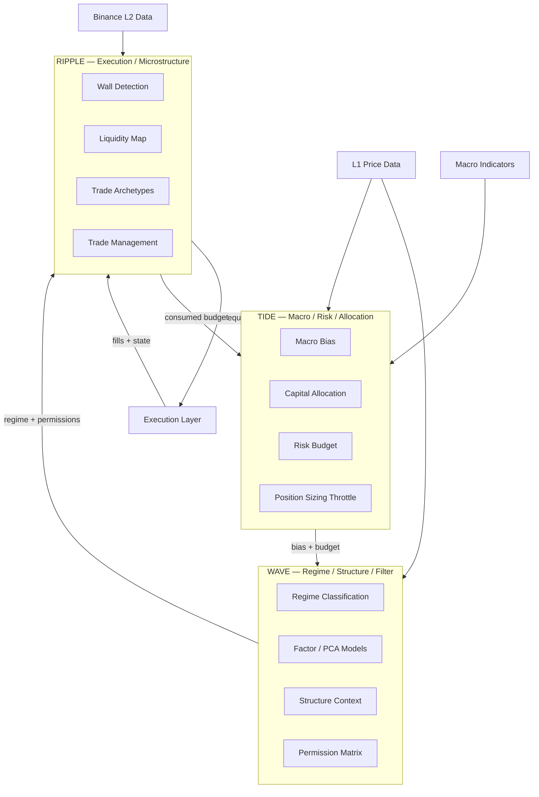
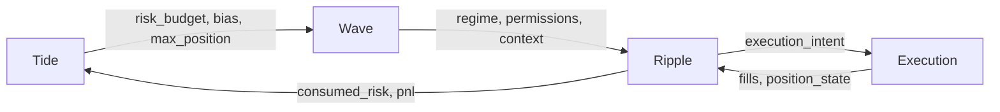
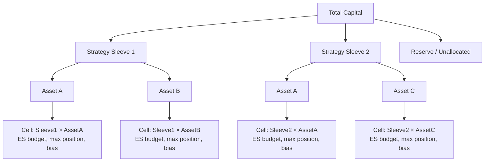
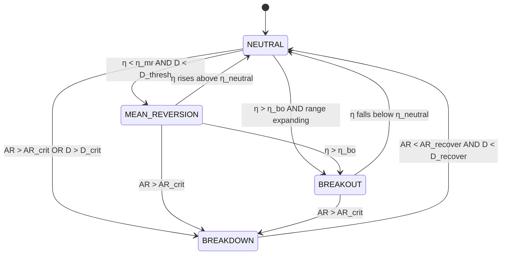
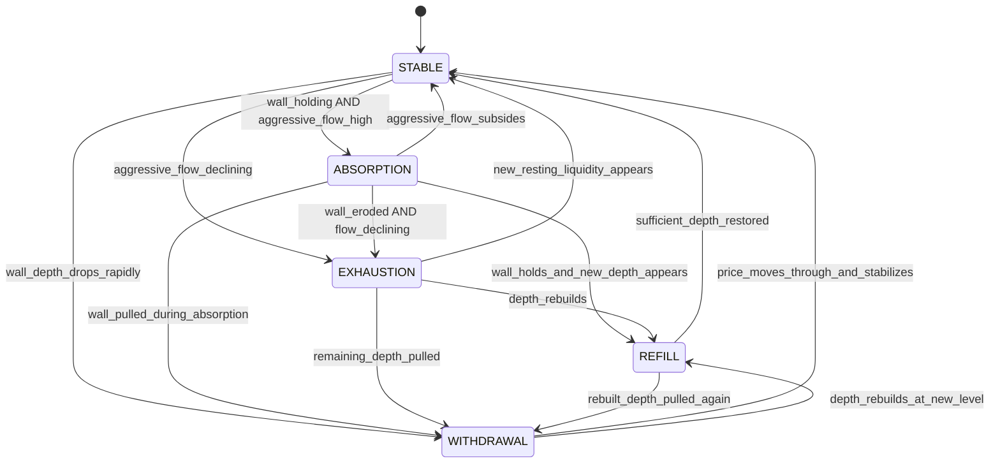
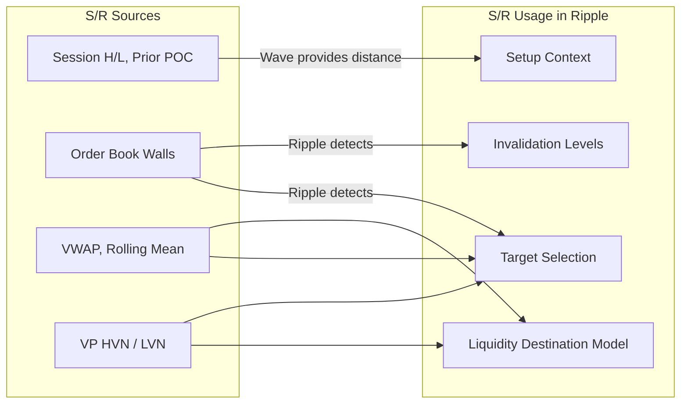
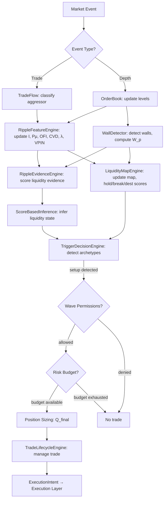
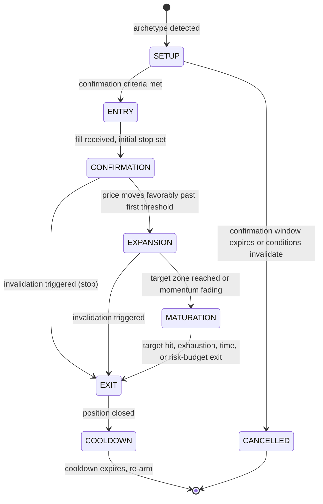
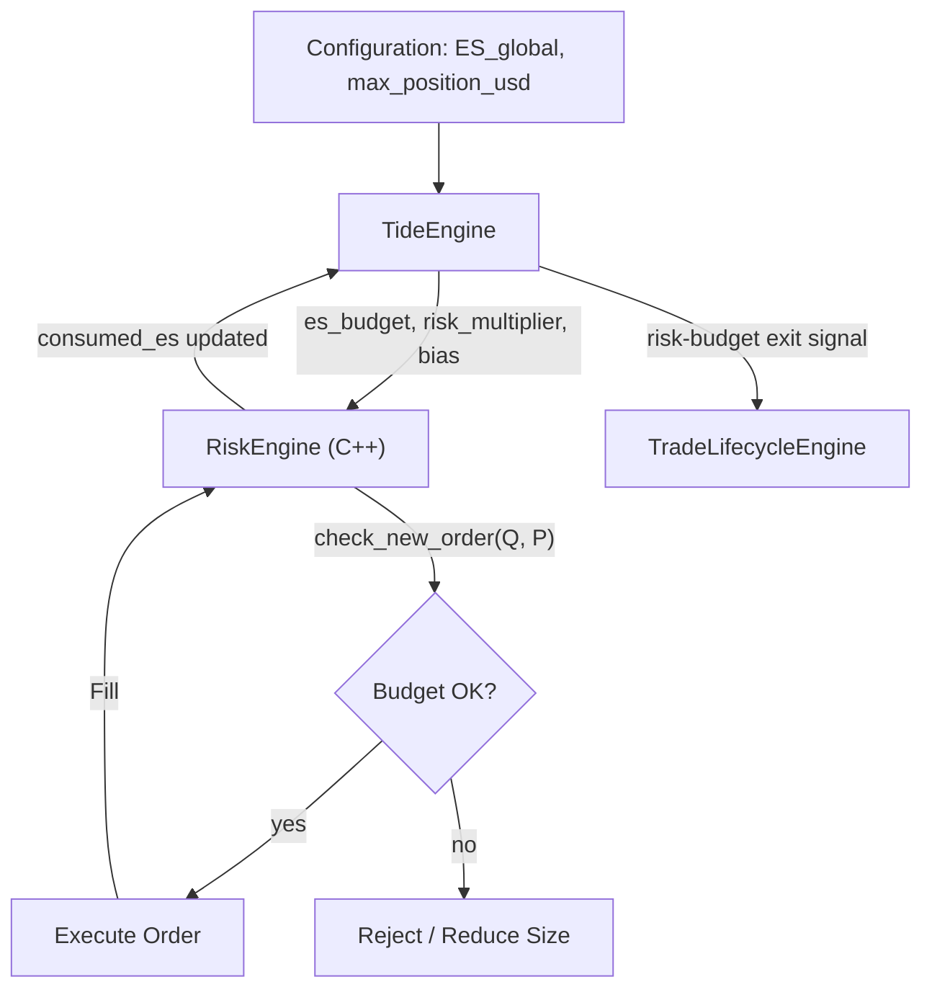
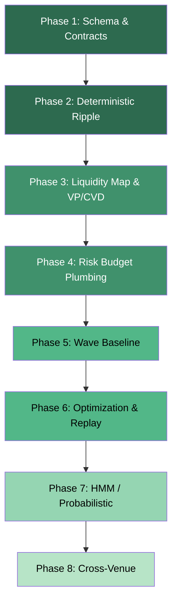

# Tide / Wave / Ripple — Multi-Layer Crypto Strategy Design

## 1. Title and Purpose

This document is the **canonical source of truth** for the Tide / Wave / Ripple hierarchical crypto strategy. It defines the architecture, mathematics, data contracts, state machines, trade lifecycle, risk framework, and implementation boundaries. All code, tests, and agent behavior must conform to this document.

## 2. Audience and Scope

**Primary audience:** quantitative developers and coding agents implementing, testing, optimizing, and operating the strategy within the existing mixed C++ / Python application.

**Scope:** This document covers the full strategy design from macro risk allocation (Tide) through meso-scale regime classification (Wave) to microstructure execution (Ripple). It specifies V1 deterministic baselines, deferred probabilistic extensions, and the boundary between the two.

**Out of scope:** Retail-oriented explanation, marketing material, or exchange-specific operational procedures (API key management, deployment infrastructure).

## 3. Strategy Philosophy

The strategy is built on these principles:

1. **Markets exhibit hierarchical structure.** Macro conditions, meso-scale regimes, and micro-scale execution environments each have distinct information sets, time horizons, and optimal decision frameworks.
2. **Liquidity is a first-class observable.** The order book is not decoration — it encodes resting intent, aggressive demand, and the interaction dynamics that create price movement.
3. **Execution quality dominates.** A mediocre signal executed well outperforms a superior signal executed poorly. Ripple exists to maximize execution quality.
4. **Risk is allocated top-down, consumed bottom-up.** Tide allocates risk budget. Wave filters permission. Ripple decides when and how to enter and exit. No layer may exceed the budget granted by the layer above it.
5. **Determinism before probability.** Every component must have a deterministic, testable, replayable baseline before probabilistic or ML-based extensions are layered on.
6. **Observability over opacity.** Every state, transition, and decision must be loggable, replayable, and diagnosable.

## 4. System Overview



## 5. Tide / Wave / Ripple Architecture

### 5.1 Layer Summary

| Property | Tide | Wave | Ripple |
|---|---|---|---|
| **Horizon** | Hours to days | Minutes to hours | Seconds to minutes |
| **Update cadence** | Minutes | Seconds to minutes | Per-event (trade, depth) |
| **Data requirements** | L1 prices, macro, funding, volatility | L1 prices, cross-asset | Binance L2, trades, CVD, VP |
| **Primary output** | Risk budget, bias, sizing throttle | Regime label, permission set | Trade decisions, management actions |
| **Triggers trades?** | No | No | Yes |
| **Owns risk budget?** | Yes (allocates) | No (filters) | No (consumes) |

### 5.2 Information Flow



**Invariant:** information flows downward (Tide → Wave → Ripple) for allocation and permission. Consumed risk and position state flow upward for accounting. No layer may override the constraints set by the layer above it.

### 5.3 Update Cadence and Clock

All layers share a common monotonic event clock for replay determinism. In live mode, this is wall-clock milliseconds. In replay mode, it is reconstructed from stored event timestamps.

| Layer | Minimum update interval | Triggered by |
|---|---|---|
| Tide | 60 000 ms | Timer or significant market move |
| Wave | 5 000 ms | Timer or structural change |
| Ripple | Per event | Trade, depth update, timer tick |

---

## 6. Mathematical Notation and Conventions

Unless otherwise specified:

| Symbol | Meaning |
|---|---|
| $ P_t $ | Mid-price at time $ t $ |
| $ P^b_t, P^a_t $ | Best bid and ask prices |
| $ V^b_t, V^a_t $ | Aggregate quantity at best bid and ask |
| $ V^b_{t,j} $ | Bid quantity at level $ j $ at time $ t $ (analogously for ask) |
| $ r_t $ | Log return: $ r_t = \ln(P_t / P_{t-1}) $ |
| $ r_{i,t} $ | Log return of asset $ i $ at time $ t $ |
| $ \Delta P_i $ | Price increment: $ P_i - P_{i-1} $ |
| $ \sigma $, $ \hat{\sigma} $ | Realized volatility (hat denotes an estimate) |
| $ \Delta t $ | Time interval (milliseconds unless stated) |
| $ N $ | Window length (number of observations) or number of assets (context-dependent) |
| $ Q $ | Quantity (base asset units) |
| $ I_t $ | Order book imbalance at time $ t $ |
| $ P_\mu $ | Microprice |
| $ W_p $ | Wall quality score at price level $ p $ |
| $ \mathcal{D}_p $ | Resting depth (quantity) at price level $ p $ |
| $ D_t $ | Cross-sectional return dispersion at time $ t $ (Wave context only) |
| $ \lambda_t $ | Price impact per unit aggressive volume |
| $ F_t $ | Normalized aggressive flow rate |
| $ \pi_p $ | Wall persistence at price $ p $ |
| $ c_p $ | Wall cancellation rate at price $ p $ |
| $ \eta $ | Directional efficiency ratio |
| $ \alpha $ | Confidence level for VaR/ES (default $ \alpha = 0.95 $ throughout) |
| $ \mathbb{1}[\cdot] $ | Indicator function |
| $ \sigma(\cdot) $ | Logistic function: $ \sigma(z) = 1/(1+e^{-z}) $ |
| $ \text{EMA}_\alpha(x) $ | Exponential moving average with decay $ \alpha $ |
| $ \lfloor \cdot \rfloor $ | Floor function |
| $ \text{clip}(x, a, b) $ | $ \max(a, \min(x, b)) $ |

**Disambiguation note:** $ \mathcal{D}_p $ always denotes resting depth at a price level. $ D_t $ always denotes cross-sectional dispersion. These are deliberately distinguished by font (calligraphic vs. italic) and subscript (price vs. time).

**Time units:** all timestamps are in milliseconds since Unix epoch unless a suffix indicates otherwise.

**Price precision:** all prices are in quote currency (e.g., USDT for BTC-USDT perpetual).

**Signed convention for flow:** buy-initiated flow is positive; sell-initiated flow is negative.

**Confidence level convention:** Unless stated otherwise, $ \alpha = 0.95 $ for both VaR and ES throughout this document. The parametric multiplier for the one-sided normal at 95% is $ z_{0.95} \approx 1.645 $, and at 99% is $ z_{0.99} \approx 2.326 $. Sections that override the default will state so explicitly.

---

## 7. Tide Layer

### 7.1 Purpose

Tide is the **macro bias, capital allocation, and risk budgeting layer**. It answers: *"Given current macro conditions, how much risk should the strategy take, in which direction, and on which assets?"*

Tide does **not** trigger trades. It produces directional bias, position sizing throttles, and risk budgets that constrain Wave and Ripple.

### 7.2 Responsibilities

1. Compute and publish a directional bias per asset (long, short, neutral).
2. Allocate capital across strategy sleeves and assets.
3. Set position sizing throttles (maximum notional, maximum units).
4. Compute expected shortfall budgets per sleeve and per asset.
5. Publish a risk multiplier that Ripple uses to scale position size.
6. Detect macro regime changes (risk-on, risk-off, crisis).

### 7.3 Candidate Features

| Feature | Namespace | Description | Cadence |
|---|---|---|---|
| Crypto beta return | `tide.crypto_beta_return` | Return of a synthetic crypto index (e.g., cap-weighted BTC+ETH basket) | 60s |
| Realized volatility | `tide.realized_vol` | Annualized realized vol of the index over a rolling window | 60s |
| Funding rate | `tide.funding_rate` | Perpetual funding rate for the asset | 8h (Binance cadence) |
| Open interest change | `tide.oi_change_pct` | Percentage change in aggregate open interest | 60s |
| Volatility regime | `tide.vol_regime` | Categorical: low / normal / high / crisis | 60s |
| Macro sentiment | `tide.macro_sentiment` | Composite score from available macro indicators | 300s |
| Liquidity stress | `tide.liquidity_stress` | Aggregate liquidity stress index (see §7.4.3) | 60s |

### 7.4 Mathematical Formalization

#### 7.4.1 Realized Volatility

Given a window of $ N $ log returns $ \{r_1, \ldots, r_N\} $ sampled at interval $ \Delta t $:

$$
\hat{\sigma}_{\text{realized}} = \sqrt{ \frac{1}{N} \sum_{i=1}^{N} r_i^2 } \cdot \sqrt{\frac{T}{\Delta t}}
$$

where $ T $ is the annualization factor (e.g., $ 365 \times 24 \times 3600 \times 1000 $ ms for continuous crypto markets).

#### 7.4.2 Directional Efficiency Ratio

Measures how efficiently price moves in one direction over a window:

$$
\eta = \frac{ \left| \sum_{i=1}^{N} \Delta P_i \right| }{ \sum_{i=1}^{N} |\Delta P_i| }
$$

where $ \Delta P_i = P_i - P_{i-1} $. Values near 1 indicate trending; values near 0 indicate mean-reverting.

#### 7.4.3 Liquidity Stress Index (Tide-Level)

A composite of spread, depth, and impact metrics aggregated over a longer horizon:

$$
\text{LSI}_{\text{tide}} = w_1 \cdot \frac{s_t - \bar{s}}{\sigma_s} + w_2 \cdot \frac{\bar{d} - d_t}{\sigma_d} + w_3 \cdot \frac{\lambda_t - \bar{\lambda}}{\sigma_\lambda}
$$

where:
- $ s_t $ = current spread normalized by tick size
- $ d_t $ = current top-of-book depth (sum of best bid and ask quantity)
- $ \lambda_t $ = estimated price impact per unit aggressive volume (see §9.5.5)
- Barred quantities ($ \bar{s}, \bar{d}, \bar{\lambda} $) are rolling means over the Tide window; $ \sigma_s, \sigma_d, \sigma_\lambda $ are rolling standard deviations
- $ w_1, w_2, w_3 $ are configurable weights (see `tide.lsi_weights` in §27.1, default: equal)
- **Sign convention:** each term is positive when conditions are stressed (wider spread, thinner depth, higher impact)

Higher LSI indicates stress; the Tide layer uses LSI to reduce risk allocation.

#### 7.4.4 Expected Shortfall

Let $ L $ denote portfolio **loss** (positive values = losses). Value at Risk at confidence level $ \alpha $:

$$
\text{VaR}_\alpha = \inf\{x : \Pr(L > x) \leq 1 - \alpha\}
$$

Expected Shortfall is the conditional tail expectation beyond VaR:

$$
\text{ES}_\alpha = \mathbb{E}[L \mid L > \text{VaR}_\alpha]
$$

By construction, $ \text{ES}_\alpha \geq \text{VaR}_\alpha \geq 0 $ for a portfolio with any positive loss probability. ES is sub-additive and therefore a coherent risk measure, unlike VaR.

**V1 parametric approximation:** Under a Gaussian assumption for portfolio returns:

$$
\text{ES}_\alpha \approx \sigma_{\text{portfolio}} \cdot \frac{\phi(z_\alpha)}{1 - \alpha}
$$

where $ \phi $ is the standard normal PDF and $ z_\alpha = \Phi^{-1}(\alpha) $. For the default $ \alpha = 0.95 $, $ z_{0.95} \approx 1.645 $ and $ \phi(1.645)/(1-0.95) \approx 2.063 $.

In later versions, historical simulation or Monte Carlo methods may replace the parametric approximation.

#### 7.4.5 Euler Decomposition of Risk Contributions

For a portfolio with weights $ \mathbf{w} $ and a homogeneous risk measure $ \rho(\mathbf{w}) $:

$$
\rho(\mathbf{w}) = \sum_{i} w_i \frac{\partial \rho}{\partial w_i}
$$

The **risk contribution** of component $ i $ is:

$$
\text{RC}_i = w_i \frac{\partial \rho}{\partial w_i}
$$

This decomposition applies to ES and allows Tide to budget risk across strategy sleeves and assets such that:

$$
\sum_{i} \text{RC}_i \leq \text{ES}_{\text{budget}}
$$

#### 7.4.6 Risk Budget Constraint

Tide publishes a risk budget snapshot with:

$$
\text{budget}_k = \text{ES}_{\text{total}} \cdot \frac{\text{RC}_k^{\text{target}}}{\sum_j \text{RC}_j^{\text{target}}}
$$

where $ k $ indexes the strategy × asset cell.

#### 7.4.7 V1 Risk Multiplier Computation

The risk multiplier is a single scalar ∈ [0, 1] that Tide publishes to throttle Ripple sizing. In V1, it is a deterministic function of `vol_regime` and `liquidity_stress`:

```
function compute_risk_multiplier(vol_regime, lsi_tide, config):
    # Base multiplier from volatility regime
    base = config.tide.risk_mult_by_regime[vol_regime]
    #   LOW    → 1.0
    #   NORMAL → 0.8
    #   HIGH   → 0.5
    #   CRISIS → 0.0

    # Stress adjustment: reduce further if LSI is elevated
    if lsi_tide > config.tide.lsi_reduce_threshold:
        stress_penalty = clip(
            (lsi_tide - config.tide.lsi_reduce_threshold) * config.tide.lsi_reduce_slope,
            0.0, base
        )
        base = base - stress_penalty

    return clip(base, 0.0, 1.0)
```

| Parameter | Type | Default | Description |
|---|---|---|---|
| `tide.risk_mult_by_regime` | float64[4] | [1.0, 0.8, 0.5, 0.0] | Base multiplier for LOW, NORMAL, HIGH, CRISIS |
| `tide.lsi_reduce_threshold` | float64 | 1.5 | LSI above this triggers additional reduction |
| `tide.lsi_reduce_slope` | float64 | 0.2 | Multiplier penalty per LSI unit above threshold |

**Invariant:** `risk_multiplier == 0` forces an immediate risk-budget exit on all open trades.

### 7.5 V1 Pre-Phase Defaults

Before Tide is implemented (Phases 2–3), Ripple and Wave use these hardcoded Tide defaults:

| Output | V1 Default | Rationale |
|---|---|---|
| `tide.bias` | `NEUTRAL` | No directional opinion |
| `tide.risk_multiplier` | `1.0` | Full sizing allowed |
| `tide.max_position_usd` | `config.tide.max_position_usd` | From config file |
| `tide.es_budget` | `config.tide.es_budget_global` | From config file |
| `tide.vol_regime` | `NORMAL` | Assume normal conditions |
| `tide.update_ts` | `0` | Never updated |

Before Wave is implemented (Phases 2–4), Ripple uses these hardcoded Wave defaults:

| Output | V1 Default | Rationale |
|---|---|---|
| `wave.regime` | `NEUTRAL` | No regime filter |
| `wave.permissions` | All `FULL` | All archetypes allowed |
| `wave.trend_efficiency` | `0.5` | Midpoint |
| `wave.dispersion` | `0.0` | No dispersion data |
| `wave.absorption_ratio` | `0.5` | Midpoint |
| `wave.update_ts` | `0` | Never updated |

These defaults must be defined as `static constexpr` in a `DefaultTideSnapshot` and `DefaultWaveSnapshot` in C++, and as constants in Python, so that phases can be developed and tested independently.

### 7.6 Outputs

| Output | Type | Description |
|---|---|---|
| `tide.bias` | `{LONG, SHORT, NEUTRAL}` | Directional bias |
| `tide.risk_multiplier` | `float ∈ [0, 1]` | Scaling factor for position sizing |
| `tide.max_position_usd` | `float` | Maximum notional exposure allowed |
| `tide.es_budget` | `float` | Expected shortfall budget for the sleeve |
| `tide.vol_regime` | `{LOW, NORMAL, HIGH, CRISIS}` | Volatility regime |
| `tide.update_ts` | `int64` | Timestamp of last Tide update |

### 7.7 Relationship to Risk and Sizing

Ripple computes a raw desired position size based on microstructure signal strength. The actual size is throttled:

$$
Q_{\text{final}} = Q_{\text{raw}} \cdot \text{tide.risk\_multiplier} \cdot \text{clip}\!\left(\frac{\text{tide.es\_budget} - \text{consumed\_es}}{\text{tide.es\_budget}},\; 0,\; 1\right)
$$

This ensures:
1. Tide's risk multiplier directly scales exposure.
2. As consumed ES approaches the budget, sizing decreases to zero.
3. Ripple can never exceed Tide's constraints.

### 7.8 Capital Allocation Hierarchy



**Why both strategy-level and asset-level risk matter:**

- **Strategy-level risk** prevents one strategy sleeve from consuming the entire ES budget (diversification across strategies).
- **Asset-level risk** prevents concentration in a single asset regardless of which strategy holds it (diversification across assets).
- **Cell-level risk** (strategy × asset) prevents a single cell from dominating both axes simultaneously.

Tide owns the top-down allocation. Ripple consumes the budget granted to its cell.

---

## 8. Wave Layer

### 8.1 Purpose

Wave is the **meso-scale regime classification and structural context layer**. It answers: *"What kind of market environment is this, and what types of execution should be permitted or suppressed?"*

Wave does **not** trigger trades. It produces regime labels and a permission matrix that modulates Ripple's behavior.

### 8.2 Responsibilities

1. Classify the current market regime (mean-reversion friendly, breakout friendly, unstable, neutral).
2. Compute factor and cross-sectional features from L1 data.
3. Detect structural context (distance to key levels, trend efficiency, dispersion).
4. Publish a permission set that enables or disables Ripple trade archetypes.

### 8.3 Data Requirements

Wave explicitly does **not** require L2 (order book depth) data. It operates on:

- L1 prices from Binance and potentially other venues (Oanda, etc.)
- Derived features: returns, volatility, correlations, factor loadings
- VWAP and range context at the Wave horizon

This separation ensures Wave can run on assets and venues where L2 data is unavailable.

### 8.4 Factor and PCA Concepts

#### 8.4.1 Single-Factor Model

Let $ r_{i,t} $ be the return of asset $ i $ at time $ t $. A single-factor model:

$$
r_{i,t} = \alpha_i + \beta_i \cdot r_{M,t} + \varepsilon_{i,t}
$$

where $ r_{M,t} $ is the return of the crypto market factor (synthetic index) and $ \varepsilon_{i,t} $ is the idiosyncratic residual.

#### 8.4.2 PCA-Based Factor Extraction

Given a cross-sectional return matrix $ \mathbf{R} \in \mathbb{R}^{T \times N} $ (T time steps, N assets), PCA extracts principal components:

$$
\mathbf{R} = \mathbf{U} \boldsymbol{\Sigma} \mathbf{V}^\top
$$

The first $ k $ columns of $ \mathbf{V} $ define factor loadings. The factor returns are the corresponding columns of $ \mathbf{U} \boldsymbol{\Sigma} $.

In V1, a single factor (cap-weighted crypto beta) suffices. Multi-factor PCA is a later extension.

#### 8.4.3 Synthetic Crypto Index

A simple cap-weighted index of liquid crypto assets:

$$
r_{M,t} = \sum_{i=1}^{N} w_i \cdot r_{i,t}, \quad w_i = \frac{\text{mcap}_i}{\sum_j \text{mcap}_j}
$$

In V1, this can be a simple BTC-dominated basket with fixed weights.

### 8.5 Structural Features

#### 8.5.1 Residual Dislocation

The deviation of an asset's return from its factor-predicted return:

$$
\delta_{i,t} = r_{i,t} - \hat{\beta}_i \cdot r_{M,t}
$$

Large positive $ \delta_{i,t} $ suggests the asset is outperforming its factor exposure (potential mean-reversion short). Large negative $ \delta_{i,t} $ suggests underperformance (potential mean-reversion long).

The rolling z-scored dislocation provides a regime-independent signal:

$$
\hat{\delta}_{i,t} = \frac{\delta_{i,t} - \bar{\delta}_i}{\sigma_{\delta_i}}
$$

where the bar and sigma are computed over a trailing window (e.g., 60 minutes at Wave cadence).

#### 8.5.2 Cross-Sectional Dispersion

$$
D_t = \sqrt{ \frac{1}{N} \sum_{i=1}^{N} (r_{i,t} - \bar{r}_t)^2 }
$$

where $ \bar{r}_t = \frac{1}{N}\sum_i r_{i,t} $ is the cross-sectional mean return and $ N $ is the number of assets in the universe.

**Note:** $ D_t $ here denotes dispersion (a Wave concept), not depth. See §6 disambiguation note.

High dispersion suggests idiosyncratic moves dominate; low dispersion suggests correlated moves (risk-on/off).

#### 8.5.3 Correlation Stability

Rolling pairwise correlation matrix $ \mathbf{C}_t $ with eigenvalues $ \lambda_1 \geq \lambda_2 \geq \ldots \geq \lambda_N $.

**Absorption ratio:**

$$
\text{AR}_t = \frac{\sum_{i=1}^{k} \lambda_i}{\sum_{i=1}^{N} \lambda_i}
$$

High AR indicates systemic co-movement (fragile). Low AR indicates diversified dynamics (stable).

#### 8.5.4 Trend Efficiency (Wave Scale)

Same formula as §7.4.2 but computed over a Wave-appropriate window (e.g., 15–60 minutes):

$$
\eta_{\text{wave}} = \frac{ \left| \sum_{i} \Delta P_i \right| }{ \sum_{i} |\Delta P_i| }
$$

#### 8.5.5 Distance to Structure

For key structural levels $ S_1, S_2, \ldots $ (e.g., session VWAP, rolling high/low, prior day close):

$$
\delta_j = \frac{P_t - S_j}{P_t}
$$

Wave publishes the distances to the nearest structural levels.

### 8.6 Regime Classification

Wave classifies the environment into one of four states:

| Regime | Label | Description |
|---|---|---|
| Mean-reversion friendly | `MEAN_REVERSION` | Low trend efficiency, contained range, stable correlations |
| Breakout / continuation | `BREAKOUT` | High trend efficiency, expanding range, directional momentum |
| Structural breakdown | `BREAKDOWN` | High dispersion, unstable correlations, elevated AR |
| Neutral / balanced | `NEUTRAL` | No strong signal in either direction |

In V1, regime classification is a deterministic rule-based system using thresholds on trend efficiency, dispersion, and absorption ratio. In later versions, this may become an HMM or classifier.

### 8.7 Regime Outputs

| Output | Type | Description |
|---|---|---|
| `wave.regime` | `{MEAN_REVERSION, BREAKOUT, BREAKDOWN, NEUTRAL}` | Current regime |
| `wave.trend_efficiency` | `float` | Trend efficiency at Wave scale |
| `wave.dispersion` | `float` | Cross-sectional dispersion |
| `wave.absorption_ratio` | `float` | Correlation absorption ratio |
| `wave.distance_to_structure` | `map<string, float>` | Distances to key structural levels |
| `wave.permissions` | `PermissionSet` | Allowed/disallowed trade archetypes |
| `wave.update_ts` | `int64` | Timestamp of last Wave update |

### 8.8 Wave State Machine



---

## 9. Ripple Layer

### 9.1 Purpose

Ripple is the **execution and microstructure layer**. It answers: *"Given current order book state, trade flow, and liquidity dynamics, should I enter, scale, manage, or exit a trade right now?"*

Ripple is the **only layer that triggers trades**.

### 9.2 Responsibilities

1. Detect and track order book walls (resting liquidity concentrations).
2. Model wall dynamics: persistence, refill, cancellation, absorption.
3. Classify liquidity transitions: absorption, exhaustion, withdrawal, refill.
4. Maintain a real-time liquidity map of key levels.
5. Generate bounce and breakout trade setups.
6. Manage open trades through a lifecycle state machine.
7. Execute scaling and exit logic.
8. Integrate CVD and Volume Profile signals.
9. Respect Wave permissions and Tide risk budgets.

### 9.3 Data Requirements

Ripple requires **Binance L2 data**:
- Full order book depth snapshots (top N levels)
- Incremental depth updates
- Individual trade events with aggressor flag
- Derived: CVD, Volume Profile, microprice, imbalance

### 9.4 Liquidity Transitions

Ripple models four fundamental liquidity transitions:

| Transition | Description | Observable Signature |
|---|---|---|
| **Absorption** | Aggressive flow is absorbed by resting liquidity at a wall. Price stalls despite heavy aggression. | High aggressive volume at price, wall maintains depth, CVD diverges from price. |
| **Exhaustion** | Aggressive flow weakens. The move runs out of fuel without hitting a wall. | Declining trade rate, declining CVD slope, trades shrinking. |
| **Withdrawal** | Resting liquidity vanishes (wall pulled). Price can gap through the vacated level. | Rapid depth decrease at level without proportional trading. |
| **Refill** | Resting liquidity reappears after a withdrawal or consumption event. Price stabilizes. | Depth rebuilding at or near the prior wall level. |

The system has **five states** (STABLE, ABSORPTION, EXHAUSTION, WITHDRAWAL, REFILL) and the four named transition types describe the dominant dynamics in the non-STABLE states.

#### 9.4.1 State Machine



**Dwell behavior:** Each state has an implicit self-transition (state remains unchanged if no trigger fires). The `RippleStateTracker` in C++ deduplicates consecutive emissions of the same state and tracks dwell time.

### 9.5 Mathematical Formalization (Ripple)

#### 9.5.1 Order Book Imbalance

At the top of book:

$$
I_t = \frac{V^b_t - V^a_t}{V^b_t + V^a_t}
$$

Generalized to $ k $ levels:

$$
I_t^{(k)} = \frac{\sum_{j=1}^{k} V^b_{t,j} - \sum_{j=1}^{k} V^a_{t,j}}{\sum_{j=1}^{k} V^b_{t,j} + \sum_{j=1}^{k} V^a_{t,j}}
$$

$ I_t \in [-1, 1] $. Positive values indicate bid-heavy imbalance (buying pressure); negative values indicate ask-heavy (selling pressure).

#### 9.5.2 Microprice

$$
P_\mu = P^a_t \cdot \frac{V^b_t}{V^b_t + V^a_t} + P^b_t \cdot \frac{V^a_t}{V^b_t + V^a_t}
$$

The microprice gives a size-weighted fair value that is more informative than mid for imbalanced books.

#### 9.5.3 Order Flow Imbalance (OFI)

The net change in top-of-book resting liquidity:

$$
\text{OFI}_t = \Delta V^b_t - \Delta V^a_t
$$

where $ \Delta V^b_t = V^b_t - V^b_{t-1} $ and similarly for asks. OFI captures the net directional pressure from resting order changes.

#### 9.5.4 Cumulative Volume Delta (CVD)

$$
\text{CVD}_t = \sum_{\tau=1}^{t} \left( Q_\tau^{\text{buy}} - Q_\tau^{\text{sell}} \right)
$$

where $ Q_\tau^{\text{buy}} $ and $ Q_\tau^{\text{sell}} $ are buy-initiated and sell-initiated trade volumes at time $ \tau $.

**CVD divergence** from price is a key signal:
- Price rising + CVD falling = bearish divergence (potential exhaustion).
- Price falling + CVD rising = bullish divergence (potential absorption).

#### 9.5.5 Impact per Unit Aggressive Volume

$$
\lambda_t = \frac{\Delta P_t}{Q_t^{\text{aggressor}}}
$$

where $ Q_t^{\text{aggressor}} $ is the signed aggressive volume over interval $ \Delta t $. High $ \lambda $ means the book is thin (easy to move price); low $ \lambda $ means the book is deep (absorptive).

#### 9.5.6 VPIN-Like Toxicity Measure

Volume-synchronized probability of informed trading (simplified):

$$
\text{VPIN}_t = \frac{1}{n} \sum_{i=1}^{n} \frac{|Q_i^{\text{buy}} - Q_i^{\text{sell}}|}{Q_i^{\text{buy}} + Q_i^{\text{sell}}}
$$

where the sum is over the most recent $ n $ volume-time bars, each containing fixed total volume $ V_{\text{bar}} $. Within each bar, trade volume is classified as buy- or sell-initiated using the aggressor flag.

**Range:** $ \text{VPIN}_t \in [0, 1] $. A value of 1 means all flow in every bucket was one-sided (maximally toxic). A value near 0 means flow was balanced in every bucket. In practice, liquid crypto markets show VPIN between 0.1 and 0.5.

High VPIN indicates informed / toxic flow; low VPIN indicates balanced flow.

#### 9.5.7 Wall Quality Score

For a detected wall at price level $ p $ with current depth $ \mathcal{D}_p $:

$$
W_p = w_{\mathcal{D}} \cdot \frac{\mathcal{D}_p}{\text{median}(\mathcal{D})} + w_\pi \cdot \pi_p + w_c \cdot (1 - c_p) + w_{\text{prox}} \cdot \frac{1}{1 + |p - P_t| / \hat{\sigma}_P}
$$

where:
- $ \mathcal{D}_p $ = resting depth (quantity) at the wall price level
- $ \text{median}(\mathcal{D}) $ = median depth across all non-trivial price levels in the visible book
- $ \pi_p \in [0, 1] $ = wall persistence (fraction of time the wall has been present over a rolling window)
- $ c_p \in [0, 1] $ = cancellation rate (fraction of depth removed by cancellation vs. by trading)
- $ \hat{\sigma}_P $ = recent price standard deviation (controls proximity weighting)
- $ w_{\mathcal{D}}, w_\pi, w_c, w_{\text{prox}} $ = configurable weights (defaults: all equal at 0.25)

**Range:** $ W_p \geq 0 $. A wall with $ W_p < W_{\min} $ (configurable, default 0.5) is not considered significant enough to trade against.

#### 9.5.8 Ripple Liquidity Stress Index

A faster, microstructure-level stress measure:

$$
\text{LSI}_{\text{ripple}} = w_s \cdot \hat{s}_t + w_d \cdot (1 - \hat{d}_t) + w_\lambda \cdot \hat{\lambda}_t + w_c \cdot \hat{c}_t
$$

where all hatted quantities are z-scored against recent rolling statistics (mean and standard deviation computed over a configurable Ripple-scale window, e.g., 60 seconds):
- $ \hat{s}_t $ = z-scored spread: $ (s_t - \bar{s}) / \sigma_s $
- $ \hat{d}_t $ = z-scored top-of-book depth (inverted: the $ (1 - \hat{d}_t) $ term makes low depth correspond to high stress)
- $ \hat{\lambda}_t $ = z-scored price impact
- $ \hat{c}_t $ = z-scored cancellation rate

**Range:** LSI is unbounded but typically in $ [-2, 4] $ for z-scored inputs. Values above 2 indicate significant microstructure stress.

### 9.6 Wall Detection Algorithm

Before walls can participate in trade logic, they must be detected and tracked. This section defines the V1 wall detection algorithm implemented in `WallDetector`.

#### 9.6.1 Wall Detection

A price level is classified as a wall if its resting depth significantly exceeds the local median:

```
function detect_walls(book, side, config, tracked_walls):
    levels = book.get_levels(side, config.ripple.wall_scan_depth)
    depths = [level.quantity for level in levels]
    median_depth = median(depths)
    threshold = median_depth * config.ripple.wall_depth_multiple

    new_walls = []
    for level in levels:
        if level.quantity >= threshold:
            existing = tracked_walls.find(level.price)
            if existing:
                # Update existing wall
                existing.depth = level.quantity
                existing.last_update_ts = book.timestamp
                # Persistence: fraction of snapshots where wall was present
                existing.persistence = existing.present_count / existing.total_snapshots
                new_walls.append(existing)
            else:
                # New wall
                wall = Wall(
                    price            = level.price,
                    depth            = level.quantity,
                    initial_depth    = level.quantity,
                    side             = side,
                    first_seen_ts    = book.timestamp,
                    last_update_ts   = book.timestamp,
                    persistence      = 1.0,
                    cancellation_rate = 0.0,
                    present_count    = 1,
                    total_snapshots  = 1,
                )
                new_walls.append(wall)

    # Compute quality score for each wall
    for wall in new_walls:
        wall.quality = compute_wall_quality(wall, median_depth, book.mid_price,
                                            ripple.recent_sigma_P, config)
    return new_walls
```

#### 9.6.2 Cancellation Rate Tracking

```
function update_cancellation_rate(wall, prev_depth, current_depth, trade_volume_at_price):
    depth_change = prev_depth - current_depth
    if depth_change <= 0:
        return  # depth increased or unchanged; no cancellation

    consumed_by_trading = trade_volume_at_price  # volume traded at this price since last update
    cancelled = max(0, depth_change - consumed_by_trading)
    total_removed = depth_change

    wall.cancel_history.append(cancelled / total_removed if total_removed > 0 else 0)
    wall.cancellation_rate = mean(wall.cancel_history[-config.ripple.wall_cancel_window:])
```

| Parameter | Type | Default | Description |
|---|---|---|---|
| `ripple.wall_scan_depth` | int32 | 50 | Number of book levels to scan per side |
| `ripple.wall_depth_multiple` | float64 | 3.0 | Depth must exceed median × this to be a wall |
| `ripple.wall_cancel_window` | int32 | 20 | Rolling window for cancellation rate |

### 9.7 V1 Evidence-to-State Mapping

The `RippleEvidenceEngine` computes a set of evidence scores, and the `ScoreBasedInference` engine maps them to one of the five liquidity states. In V1 this is a deterministic rule-based system.

#### 9.7.1 Evidence Scores

The evidence engine computes these intermediate scores on each tick:

| Score | Formula | Range | Meaning |
|---|---|---|---|
| `absorption_score` | $ \sigma(w_1 \cdot W_{p,\text{near}} + w_2 \cdot F_t - \frac{w_3 \cdot \mid \Delta P \mid} {\hat{\sigma}_P}) $ | [0, 1] | High when wall absorbs flow |
| `exhaustion_score` | $ \sigma(-w_4 \cdot \text{CVD\_slope} \cdot \text{sign}(\text{trend}) + w_5 \cdot (1 - F_t/F_{\text{peak}})) $ | [0, 1] | High when flow dying |
| `withdrawal_score` | $ \sigma(w_6 \cdot \Delta\mathcal{D}_{\text{wall}} / \mathcal{D}_{\text{wall,prev}} - w_7 \cdot \text{trade\_vol\_at\_wall}) $ | [0, 1] | High when wall pulled |
| `refill_score` | $ \sigma(w_8 \cdot \Delta\mathcal{D}_{\text{wall}} / \mathcal{D}_{\text{wall,prev}} + w_9 \cdot \pi_p) $ | [0, 1] | High when depth rebuilding |

All $ w_i $ are configurable. The logistic function $ \sigma(\cdot) $ maps scores to [0, 1].

#### 9.7.2 State Inference Rules

```
function infer_liquidity_state(evidence, config):
    scores = {
        ABSORPTION: evidence.absorption_score,
        EXHAUSTION: evidence.exhaustion_score,
        WITHDRAWAL: evidence.withdrawal_score,
        REFILL:     evidence.refill_score,
    }

    # Find the highest-scoring non-STABLE state
    best_state = argmax(scores)
    best_score = scores[best_state]

    # Must exceed activation threshold to leave STABLE
    if best_score < config.ripple.state_activation_threshold:
        return STABLE

    # Must exceed runner-up by margin to avoid flickering
    second_best = sorted(scores.values(), reverse=True)[1]
    if best_score - second_best < config.ripple.state_margin:
        return current_state  # stay in current state (hysteresis)

    return best_state
```

| Parameter | Type | Default | Description |
|---|---|---|---|
| `ripple.state_activation_threshold` | float64 | 0.6 | Min score to leave STABLE |
| `ripple.state_margin` | float64 | 0.15 | Min lead over runner-up |

**Hysteresis:** The margin requirement prevents rapid oscillation between states. Once a state is entered, it persists until another state exceeds it by the margin, or it falls below the activation threshold.

### 9.8 Dual-Mode Wall Logic

Walls create two distinct setups depending on whether they hold or fail:

#### 9.6.1 Wall Holds → Bounce Trade

When price approaches a wall and the wall absorbs aggressive flow:

1. **Detection:** Wall quality score $ W_p > W_{\min} $, price within proximity zone.
2. **Confirmation:** Aggressive flow rate decreasing (exhaustion beginning), CVD diverging, microprice shifting away from wall.
3. **Entry:** On confirmed reversal away from wall.
4. **Target:** Opposite liquidity destination on the liquidity map.
5. **Invalidation:** Wall breaks (depth drops below threshold while price trades through).

#### 9.6.2 Wall Fails → Breakout Trade

When price approaches a wall and the wall withdraws or is consumed:

1. **Detection:** Wall depth declining rapidly (withdrawal) or being traded through (consumption).
2. **Confirmation:** Aggressive flow accelerating through the level, CVD accelerating, trades enlarging.
3. **Entry:** On confirmed break through wall level.
4. **Target:** Next liquidity destination beyond the broken wall.
5. **Invalidation:** Price reverses back through the broken level and it re-forms (failed breakout).

#### 9.6.3 Hold vs Break Score

For a wall at price $ p $ under pressure, estimate the probability of holding:

$$
P(\text{hold} \mid \mathbf{x}) = \sigma\!\left( \beta_0 + \beta_1 W_p + \beta_2 F_t + \beta_3 R_p + \beta_4 I_t \right)
$$

where:
- $ \sigma(\cdot) $ is the logistic function
- $ W_p $ = wall quality score
- $ F_t $ = normalized aggressive flow rate (negative: high flow, harder to hold)
- $ R_p $ = refill rate at the wall
- $ I_t $ = order book imbalance

In V1, this is implemented as a deterministic threshold system. The logistic form is a later calibration target.

### 9.9 CVD and Volume Profile Integration

**CVD role in Ripple:**
- CVD slope confirms or contradicts price direction.
- CVD divergences (price vs. CVD) are primary signals for absorption and exhaustion.
- CVD level resets are tracked for session context.

**Volume Profile role in Ripple:**
- Point of Control (POC) acts as a structural anchor.
- Value Area boundaries provide context for mean-reversion vs. breakout.
- Low-volume nodes identify potential void corridors (areas price may move through quickly).
- High-volume nodes identify potential absorption zones.

### 9.10 HMM Framing for Latent-State Inference (V2+ Extension)

This section defines the mathematical framework that will replace the V1 rule-based Ripple inference in later versions. It is included here for forward-compatibility: V1 code should structure its state outputs to be compatible with the HMM observation model below.

**Latent states:** The Ripple liquidity environment is modeled as a Hidden Markov Model with $ K $ latent states $ z_t \in \{1, \ldots, K\} $. In the simplest formulation, these correspond to the five named states (STABLE, ABSORPTION, EXHAUSTION, WITHDRAWAL, REFILL), so $ K = 5 $.

**Transition matrix:** $ \mathbf{A} \in \mathbb{R}^{K \times K} $ where $ A_{ij} = \Pr(z_t = j \mid z_{t-1} = i) $. Rows sum to 1. The structure of $ \mathbf{A} $ should be sparse, reflecting the allowed transitions in §9.4.1 (disallowed transitions have $ A_{ij} = 0 $ or near-zero).

**Observation model:** At each time step, the system emits an observation vector $ \mathbf{x}_t $ drawn from a state-conditional distribution:

$$
\mathbf{x}_t \mid z_t = k \sim \mathcal{N}(\boldsymbol{\mu}_k, \boldsymbol{\Sigma}_k)
$$

where $ \mathbf{x}_t = [I_t, \; \text{OFI}_t, \; \text{CVD\_slope}_t, \; \lambda_t, \; W_{p,\text{nearest}}, \; F_t]^\top $ is the Ripple feature vector.

**Forward algorithm (filtering):** The posterior $ \gamma_t(k) = \Pr(z_t = k \mid \mathbf{x}_{1:t}) $ is computed recursively:

$$
\alpha_t(k) = \left[\sum_{j=1}^{K} \alpha_{t-1}(j) \cdot A_{jk}\right] \cdot b_k(\mathbf{x}_t)
$$

$$
\gamma_t(k) = \frac{\alpha_t(k)}{\sum_{j=1}^{K} \alpha_t(j)}
$$

where $ b_k(\mathbf{x}_t) $ is the emission probability (Gaussian PDF evaluated at $ \mathbf{x}_t $ with parameters $ \boldsymbol{\mu}_k, \boldsymbol{\Sigma}_k $).

**Complexity:** $ O(K^2) $ per event for the forward step. With $ K = 5 $, this is 25 multiply-adds plus a Gaussian PDF evaluation — well within the 50 µs target.

**Training:** Baum-Welch (EM) on labeled data from V1 backtests. Model selection via BIC across $ K \in \{3, 4, 5, 6\} $.

**V1 compatibility requirement:** V1's `ScoreBasedInference` must output the same state labels that the HMM will use, so that training data from V1 backtest runs can directly serve as HMM training labels.

### 9.11 Support and Resistance in Ripple

**Critical distinction:** Support and resistance in Ripple are used **primarily for exits, target selection, and liquidity destination modeling** — not as naive entry signals.

| S/R Type | Layer | Usage |
|---|---|---|
| Structural S/R (session high/low, prior POC) | Wave | Context, distance-to-structure |
| Order-book walls | Ripple | Entry setups (bounce/breakout), targets |
| Statistical anchors (VWAP, rolling mean) | Wave/Ripple | Target modeling, fair-value reference |
| Volume profile levels (HVN, LVN) | Ripple | Destination modeling, void detection |



Ripple uses identified S/R levels to:
1. Set profit targets (scale-out destinations).
2. Model where price is likely to travel (liquidity destination).
3. Set invalidation levels for risk management.
4. Contextualize whether a setup is a fade or a momentum play.

### 9.12 Ripple Decision Pipeline

The following diagram shows the complete per-event decision path within Ripple:



---

## 10. Liquidity Map

### 10.1 Purpose

The Liquidity Map is a real-time model of where significant liquidity exists, where it has been consumed, and where price is likely to travel next. It is maintained by Ripple and consumed for trade management.

### 10.2 Components

#### 10.2.1 Resting Liquidity Levels

Derived from order book walls:

$$
\mathcal{L}_{\text{rest}} = \{(p_j, \mathcal{D}_j, W_j, s_j) : W_j > W_{\min}\}
$$

where $ p_j $ is price, $ \mathcal{D}_j $ is resting depth at that level, $ W_j $ is wall quality score (§9.5.7), $ s_j \in \{\text{BID}, \text{ASK}\} $ is side.

#### 10.2.2 Traded Liquidity Levels

Derived from Volume Profile:

$$
\mathcal{L}_{\text{traded}} = \{(p_j, V_j^{\text{profile}}, \text{type}_j) : V_j > V_{\text{thresh}}\}
$$

where $ \text{type}_j \in \{\text{HVN}, \text{LVN}, \text{POC}\} $.

#### 10.2.3 Flow-Pressure Levels

Derived from trade flow concentration:

$$
\mathcal{L}_{\text{flow}} = \{(p_j, F_j^{\text{net}}) : |F_j^{\text{net}}| > F_{\text{thresh}}\}
$$

where $ F_j^{\text{net}} $ is net signed flow at price level $ j $.

#### 10.2.4 Structural Anchors

Session VWAP, rolling mean, session high/low, prior day close:

$$
\mathcal{L}_{\text{struct}} = \{(\text{VWAP}_t, \text{type}=\text{VWAP}), (\text{high}_t, \text{type}=\text{HIGH}), \ldots\}
$$

#### 10.2.5 Void Corridors

Price ranges with minimal resting and traded liquidity:

$$
\mathcal{V} = \{(p_{\text{lo}}, p_{\text{hi}}) : \max_{p \in [p_{\text{lo}}, p_{\text{hi}}]} \mathcal{D}_p < \mathcal{D}_{\text{void}} \text{ and } V_p^{\text{profile}} < V_{\text{void}}\}
$$

Price can move through void corridors quickly with minimal friction. The thresholds $ \mathcal{D}_{\text{void}} $ and $ V_{\text{void}} $ are configurable (defaults derived from rolling percentiles of the full book depth and profile volume distributions, e.g., 10th percentile).

### 10.3 Hold / Break / Destination Scores

For each level $ \ell $ in the liquidity map:

| Score | Definition | Usage |
|---|---|---|
| $ \text{hold}_\ell $ | Probability the level holds when approached | Bounce trade entry quality |
| $ \text{break}_\ell $ | $ 1 - \text{hold}_\ell $ | Breakout trade entry quality |
| $ \text{dest}_\ell $ | Score for this level as a price destination | Target selection, scale-out points |

Destination score:

$$
\text{dest}_\ell = w_{\text{dest}}^{\mathcal{D}} \cdot \hat{\mathcal{D}}_\ell + w_{\text{dest}}^{V} \cdot \hat{V}_\ell^{\text{profile}} + w_{\text{dest}}^{\text{vwap}} \cdot \frac{1}{1 + |\ell - \text{VWAP}| / \hat{\sigma}_P} + w_{\text{dest}}^{\text{struct}} \cdot \mathbb{1}[\ell \in \mathcal{L}_{\text{struct}}]
$$

where hatted quantities denote min-max normalized values within the current map snapshot.

### 10.4 Liquidity Map Snapshot

The liquidity map is published as a structured snapshot at Ripple cadence:

```
LiquidityMapSnapshot {
    timestamp: int64
    levels: [{
        price: float64
        depth: float64
        wall_quality: float64
        profile_volume: float64
        net_flow: float64
        hold_score: float64
        dest_score: float64
        type: {WALL_BID, WALL_ASK, HVN, LVN, POC, VWAP, VOID_BOUNDARY}
    }]
    void_corridors: [{lo: float64, hi: float64}]
    nearest_bid_wall: float64
    nearest_ask_wall: float64
    poc: float64
    vwap: float64
}
```

---

## 11. Trade Archetypes

### 11.1 Bounce Trade

**Setup:** Price approaches a significant wall, and the wall shows signs of absorbing aggressive flow.

| Phase | Condition |
|---|---|
| **Detection** | Wall with $ W_p > W_{\min} $; price within $ k \cdot \sigma $ of wall |
| **Confirmation** | Aggression declining; CVD diverging; microprice shifting away from wall |
| **Entry** | Confirmed reversal: e.g., microprice crossed back by $ \delta_{\text{entry}} $ |
| **Target** | Nearest destination level on the liquidity map in the bounce direction |
| **Stop** | Wall break level (price trades through + wall depth collapses) |

**Direction:** Always away from the wall. A bounce off a bid-side wall is a long entry. A bounce off an ask-side wall is a short entry.

#### 11.1.1 V1 Bounce Detection Algorithm

The following pseudocode defines the exact V1 detection and entry logic for `TriggerDecisionEngine`. All thresholds reference configuration parameters from §27.

```
function detect_bounce(walls, ripple, lmap, config):
    for wall in walls where wall.side matches approach direction:
        if wall.quality < config.ripple.wall_min_quality:
            continue

        # Proximity check: price must be within proximity_sigma * σ_P of wall
        distance = abs(ripple.microprice - wall.price)
        if distance > config.ripple.proximity_sigma * ripple.recent_sigma_P:
            continue

        # Wall must be absorbing: aggressive flow high but wall depth stable
        if ripple.liquidity_state not in {ABSORPTION, STABLE}:
            continue

        # SETUP detected — enter confirmation window
        setup = new BounceSetup(
            wall          = wall,
            side          = LONG if wall.side == BID else SHORT,
            setup_ts      = ripple.timestamp,
            stop_price    = wall.price,  # invalidation = wall break level
            target_price  = lmap.nearest_dest_in_direction(setup.side),
        )
        return setup

    return None

function confirm_bounce(setup, ripple, config):
    elapsed = ripple.timestamp - setup.setup_ts
    if elapsed > config.ripple.confirmation_window_ms:
        return CANCEL  # confirmation window expired

    # Three confirmation conditions — ALL must be true:
    # 1. Aggressive flow declining (toward exhaustion)
    flow_declining = ripple.cvd_slope * setup.side_sign < 0
        OR abs(ripple.cvd_slope) < config.ripple.exhaustion_cvd_slope_thresh

    # 2. Microprice shifting away from wall
    microprice_shift = (ripple.microprice - setup.wall.price) * setup.side_sign
    shifted = microprice_shift > config.ripple.bounce_microprice_shift_ticks * tick_size

    # 3. Imbalance favoring bounce direction
    imbalance_ok = ripple.imbalance * setup.side_sign > config.ripple.bounce_imbalance_thresh

    if flow_declining AND shifted AND imbalance_ok:
        return CONFIRMED
    return WAIT
```

**`side_sign`**: +1 for LONG, −1 for SHORT. This convention is used throughout.

**Config parameters used** (add to §27.3 if not present):

| Parameter | Type | Default | Description |
|---|---|---|---|
| `ripple.proximity_sigma` | float64 | 2.0 | Wall proximity zone in σ units |
| `ripple.bounce_microprice_shift_ticks` | float64 | 3.0 | Microprice ticks away from wall for confirmation |
| `ripple.bounce_imbalance_thresh` | float64 | 0.1 | Minimum signed imbalance for confirmation |
| `ripple.exhaustion_cvd_slope_thresh` | float64 | 0.01 | CVD slope below this = flow exhausting |

### 11.2 Breakout Trade

**Setup:** Price approaches a significant wall, and the wall shows signs of failing (withdrawal, rapid consumption).

| Phase | Condition |
|---|---|
| **Detection** | Wall with $ W_p > W_{\min} $; depth declining or being consumed |
| **Confirmation** | Aggressive flow accelerating; CVD accelerating; trade sizes increasing |
| **Entry** | Confirmed break: price through wall + depth < $ D_{\text{fail}} $ |
| **Target** | Next liquidity destination beyond the broken wall |
| **Stop** | Price reverses back through the broken level + wall re-forms |

**Direction:** Through the wall. A breakout through an ask-side wall is a long entry. A breakout through a bid-side wall is a short entry.

#### 11.2.1 V1 Breakout Detection Algorithm

```
function detect_breakout(walls, ripple, lmap, config):
    for wall in walls:
        if wall.quality < config.ripple.wall_min_quality:
            continue

        # Wall must be failing: depth declining rapidly or being consumed
        depth_ratio = wall.depth / wall.initial_depth_at_detection
        if depth_ratio > config.ripple.breakout_depth_fail_ratio:
            continue  # wall still healthy, not failing

        # Price must be at or through the wall
        if wall.side == ASK:
            if ripple.microprice < wall.price - tick_size:
                continue  # price hasn't reached wall yet
        else:  # BID wall
            if ripple.microprice > wall.price + tick_size:
                continue

        # SETUP detected
        setup = new BreakoutSetup(
            wall          = wall,
            side          = LONG if wall.side == ASK else SHORT,
            setup_ts      = ripple.timestamp,
            stop_price    = wall.price,  # invalidation = price reverses back through
            target_price  = lmap.nearest_dest_beyond(wall.price, setup.side),
        )
        return setup

    return None

function confirm_breakout(setup, ripple, config):
    elapsed = ripple.timestamp - setup.setup_ts
    if elapsed > config.ripple.confirmation_window_ms:
        return CANCEL

    # Three confirmation conditions — ALL must be true:
    # 1. Price has traded through the wall level
    through = (ripple.last_trade_price - setup.wall.price) * setup.side_sign > 0

    # 2. Wall depth collapsed below fail threshold
    wall_failed = setup.wall.depth < config.ripple.breakout_depth_fail_abs
        OR setup.wall.depth / setup.wall.initial_depth_at_detection
           < config.ripple.breakout_depth_fail_ratio

    # 3. Aggressive flow accelerating in breakout direction
    flow_accel = ripple.cvd_slope * setup.side_sign
                 > config.ripple.breakout_cvd_slope_thresh

    if through AND wall_failed AND flow_accel:
        return CONFIRMED
    return WAIT
```

**Config parameters used:**

| Parameter | Type | Default | Description |
|---|---|---|---|
| `ripple.breakout_depth_fail_ratio` | float64 | 0.3 | Wall depth / initial depth below this = failing |
| `ripple.breakout_depth_fail_abs` | float64 | 0.0 | Absolute depth below this = failed (0 = use ratio only) |
| `ripple.breakout_cvd_slope_thresh` | float64 | 0.05 | Min signed CVD slope for breakout confirmation |

---

## 12. Trade Lifecycle and State Machine

Every trade passes through a defined lifecycle:



### 12.1 State Definitions

| State | Description |
|---|---|
| `SETUP` | Archetype detected, awaiting confirmation |
| `ENTRY` | Confirmation met, order submitted or filled |
| `CONFIRMATION` | Position open, in initial risk zone, awaiting first favorable move |
| `EXPANSION` | Price has moved favorably; trail stop engaged, scaling may occur |
| `MATURATION` | Near target or momentum fading; tightening management |
| `EXIT` | Closing position; executing exit order(s) |
| `COOLDOWN` | Position closed; no new entries until cooldown expires |
| `CANCELLED` | Setup invalidated before entry |

### 12.2 Transition Triggers

| Transition | Trigger |
|---|---|
| SETUP → ENTRY | Confirmation criteria met within confirmation window |
| SETUP → CANCELLED | Confirmation window expires, wall state changes, permissions revoked |
| ENTRY → CONFIRMATION | Fill received |
| CONFIRMATION → EXPANSION | Unrealized PnL exceeds $ \theta_{\text{expand}} \cdot \hat{\sigma}_P $ |
| CONFIRMATION → EXIT | Price hits invalidation level |
| EXPANSION → EXPANSION | Scale-in fill received (self-transition: update position, set new tranche stop) |
| EXPANSION → MATURATION | Price enters target zone or momentum indicators fade |
| EXPANSION → EXIT | Trailing stop hit, risk budget exceeded, or time limit |
| MATURATION → EXPANSION | Price re-accelerates after reaching target zone (only if no scale-out yet) |
| MATURATION → EXIT | Any exit condition met (see §13) |
| EXIT → COOLDOWN | All exit fills received |
| COOLDOWN → [*] | Cooldown timer expires |
| *any active state* → EXIT | Risk-budget exit (Tide budget exhausted or risk multiplier drops to 0) |
| *any active state* → EXIT | Wave permissions revoked for current archetype while trade is open |

**Note on forced exits:** Risk-budget and permission-revocation exits can trigger from any active state (CONFIRMATION, EXPANSION, MATURATION). These have **highest** priority and override all other logic. The trade transitions directly to EXIT regardless of current state.

### 12.3 Concurrent Trades

In **V1**, Ripple manages **at most one open trade per symbol at a time.** A new setup cannot enter ENTRY while another trade is in any active state (CONFIRMATION, EXPANSION, MATURATION, EXIT). The COOLDOWN state also blocks new entries.

In later versions, concurrent trades (e.g., one bounce and one breakout on different walls) may be supported, subject to Tide position limits.

---

## 13. Exit Taxonomy

Every exit belongs to one of five categories:

| Exit Type | Trigger | Priority |
|---|---|---|
| **Invalidation** | Trade thesis disproven (stop hit, wall re-forms after breakout, wall breaks after bounce) | Highest — execute immediately |
| **Target** | Price reaches a liquidity destination on the map | Normal — scale out |
| **Exhaustion** | Momentum fading (CVD flattening, trade rate declining, impact increasing) | Normal — tighten or exit |
| **Time** | Trade has been open longer than $ T_{\max} $ without reaching target | Normal — exit at market |
| **Risk-budget** | Consumed ES approaching sleeve budget; Tide risk multiplier drops | Highest — reduce or exit |

### 13.1 Exit Priority

Risk-budget and invalidation exits override all other logic. If a risk-budget exit triggers, Ripple must reduce position regardless of other conditions.

**Evaluation order:** On each tick, the `TradeLifecycleEngine` checks exits in this exact order. The first match fires.

1. **Risk-budget** — `risk.consumed_es >= risk.es_budget * config.risk.budget_exit_threshold` OR `tide.risk_multiplier == 0`
2. **Invalidation** — price crosses stop\_price in the adverse direction
3. **Time** — `hold_time_ms > config.ripple.max_hold_time_ms`
4. **Target** — price crosses target\_price in the favorable direction
5. **Exhaustion** — momentum fading conditions (see §13.3)

### 13.2 Partial Exits

Target and exhaustion exits may be partial (scale-out). Invalidation and risk-budget exits are typically full (close 100% of remaining position).

### 13.3 V1 Exit Detection Conditions

Each exit type has explicit, deterministic detection logic:

#### 13.3.1 Invalidation Exit

```
function check_invalidation(trade, ripple):
    # Bounce: wall breaks — price trades through wall + wall depth collapsed
    if trade.archetype == BOUNCE:
        price_through = (ripple.last_trade_price - trade.wall_price) * (-trade.side_sign) > 0
        wall_gone = nearest_wall_at(trade.wall_price).depth
                    < config.ripple.breakout_depth_fail_abs
                    OR nearest_wall_at(trade.wall_price) is None
        return price_through AND wall_gone

    # Breakout: price reverses back through broken level + wall re-forms
    if trade.archetype == BREAKOUT:
        price_reversed = (trade.wall_price - ripple.last_trade_price) * trade.side_sign > 0
        wall_reformed = nearest_wall_at(trade.wall_price) is not None
                        AND nearest_wall_at(trade.wall_price).quality > config.ripple.wall_min_quality
        return price_reversed AND wall_reformed
```

**Order type:** MARKET. **Urgency:** IMMEDIATE. **Quantity:** 100% of remaining position.

#### 13.3.2 Target Exit

```
function check_target(trade, ripple, lmap):
    price_at_target = (ripple.microprice - trade.current_target_price) * trade.side_sign >= 0
    return price_at_target
```

When triggered, scale out the next fraction per `config.ripple.scale_out_fractions`. After each scale-out, advance `current_target_price` to the next liquidity map destination. See §14.2.

**Order type:** LIMIT at `current_target_price`. **Urgency:** NORMAL. **Quantity:** next scale-out fraction.

#### 13.3.3 Exhaustion Exit

```
function check_exhaustion(trade, ripple, config):
    # ALL three conditions must hold simultaneously:
    # 1. CVD slope near zero or adverse
    cvd_fading = ripple.cvd_slope * trade.side_sign
                 < config.ripple.exhaustion_cvd_slope_thresh

    # 2. Trade rate declining (current rate < 50% of rate at entry)
    rate_declining = ripple.trade_rate < trade.entry_trade_rate * 0.5

    # 3. Impact increasing (market becoming thinner)
    impact_rising = ripple.impact > trade.entry_impact * config.ripple.exhaustion_impact_ratio

    return cvd_fading AND rate_declining AND impact_rising
```

**Config parameters:**

| Parameter | Type | Default | Description |
|---|---|---|---|
| `ripple.exhaustion_impact_ratio` | float64 | 1.5 | Impact must be this × entry impact |

**Order type:** LIMIT. **Urgency:** NORMAL. **Quantity:** 100% of remaining position (full close on exhaustion).

#### 13.3.4 Time Exit

```
function check_time(trade, timestamp, config):
    return (timestamp - trade.entry_ts) > config.ripple.max_hold_time_ms
```

**Order type:** MARKET. **Urgency:** NORMAL. **Quantity:** 100% of remaining position.

#### 13.3.5 Risk-Budget Exit

```
function check_risk_budget(risk_snapshot, config):
    budget_fraction = risk_snapshot.consumed_es / risk_snapshot.es_budget
    return budget_fraction >= config.risk.budget_exit_threshold
        OR risk_snapshot.risk_multiplier == 0.0
```

| Parameter | Type | Default | Description |
|---|---|---|---|
| `risk.budget_exit_threshold` | float64 | 0.90 | Exit when consumed ES reaches this fraction of budget |

**Order type:** MARKET. **Urgency:** IMMEDIATE. **Quantity:** 100% of remaining position.

---

## 14. Scaling Logic

### 14.1 Scale-In Rules

1. **Scale-in occurs only after Confirmation state.** No adding to a position that has not yet proven its initial thesis.
2. Scale-in requires the trade to be in `EXPANSION` state.
3. Each scale-in tranche must have its own invalidation level.
4. Total position must remain within Tide's `max_position_usd` and ES budget.
5. **V1: maximum 1 scale-in per trade** (2 tranches total: initial + 1 add). Later versions may allow more.

#### 14.1.1 V1 Scale-In Trigger

```
function check_scale_in(trade, ripple, risk, config):
    if trade.lifecycle_state != EXPANSION:
        return False
    if trade.scale_count >= config.ripple.max_scale_ins:
        return False

    # Price must have moved favorably by at least scale_in_threshold * σ_P
    # beyond the entry price (not just beyond the expansion threshold)
    favorable_move = (ripple.microprice - trade.entry_price) * trade.side_sign
    if favorable_move < config.ripple.scale_in_threshold_sigma * ripple.recent_sigma_P:
        return False

    # Momentum must still be intact
    if ripple.cvd_slope * trade.side_sign < config.ripple.scale_in_cvd_slope_min:
        return False

    # Risk budget must allow the additional size
    additional_qty = trade.initial_quantity  # each tranche = same size as initial
    if not risk.check_new_order(additional_qty, ripple.microprice):
        return False

    return True
```

When scale-in triggers:
- Submit order for `additional_qty` at current market (or limit near microprice for bounce)
- Set the new tranche's invalidation at: `trade.entry_price` (breakeven for whole position)
- The combined stop\_price moves to `trade.entry_price` (breakeven) after scale-in fill

| Parameter | Type | Default | Description |
|---|---|---|---|
| `ripple.max_scale_ins` | int32 | 1 | Max scale-in tranches per trade |
| `ripple.scale_in_threshold_sigma` | float64 | 2.0 | Min favorable move in σ before scale-in |
| `ripple.scale_in_cvd_slope_min` | float64 | 0.02 | Min signed CVD slope to confirm momentum |

### 14.2 Scale-Out Rules

1. Scale-out targets are determined by the liquidity map's destination levels.
2. Scale-out is executed at predefined fractions (e.g., 1/3 at first target, 1/3 at second target, remainder at final target or trailing stop).
3. After each scale-out, the invalidation level is tightened.

#### 14.2.1 V1 Scale-Out Algorithm

At trade entry, the `TradeLifecycleEngine` selects up to 3 target levels from the liquidity map, ranked by `dest_score` in the favorable direction:

```
function compute_scale_out_plan(trade, lmap, config):
    destinations = lmap.get_destinations_in_direction(trade.side)
        .filter(d => d.price * trade.side_sign > trade.entry_price * trade.side_sign)
        .sort_by(dest_score, descending)
        .take(len(config.ripple.scale_out_fractions))

    plan = []
    remaining = trade.quantity
    for i, dest in enumerate(destinations):
        fraction = config.ripple.scale_out_fractions[i]
        qty = floor(trade.initial_quantity * fraction, lot_size)
        plan.append(ScaleOutLevel(
            target_price = dest.price,
            quantity      = min(qty, remaining),
            new_stop      = compute_tightened_stop(trade, i, config),
        ))
        remaining -= qty

    # If fewer destinations than fractions, last level gets remainder
    if remaining > 0 and len(plan) > 0:
        plan[-1].quantity += remaining

    return plan

function compute_tightened_stop(trade, scale_out_index, config):
    if scale_out_index == 0:
        return trade.entry_price  # move to breakeven after first scale-out
    else:
        # Move stop to prior target level (lock in profits)
        return trade.scale_out_plan[scale_out_index - 1].target_price
```

When a scale-out level is reached:
1. Submit LIMIT order for the planned quantity at the target price.
2. After fill, update `trade.stop_price` to the tightened level.
3. Advance `trade.current_target_index` to the next level.
4. If all scale-out levels are filled, the remaining position (if any) rides a trailing stop.

### 14.3 Trailing Stop

After all planned scale-out levels have been reached OR when the trade enters `MATURATION`, the stop becomes a trailing stop:

```
function update_trailing_stop(trade, ripple, config):
    if not trade.trailing_stop_active:
        return

    # Trail distance = config multiplier * recent σ_P
    trail_distance = config.ripple.trailing_stop_sigma * ripple.recent_sigma_P

    if trade.side == LONG:
        new_stop = ripple.microprice - trail_distance
        trade.stop_price = max(trade.stop_price, new_stop)  # only tighten, never loosen
    else:
        new_stop = ripple.microprice + trail_distance
        trade.stop_price = min(trade.stop_price, new_stop)
```

| Parameter | Type | Default | Description |
|---|---|---|---|
| `ripple.trailing_stop_sigma` | float64 | 2.0 | Trail distance in σ units |

### 14.4 Position Sizing Formula

**Step 1 — Risk-denominated raw size.** Given a dollar risk budget per trade (`target_risk_usd`, a configuration parameter, e.g., 50 USDT) and the distance to the invalidation level:

$$
Q_{\text{risk}} = \frac{\text{target\_risk\_usd}}{|P_{\text{entry}} - P_{\text{stop}}|}
$$

This is the position size such that a full stop-out loses exactly `target_risk_usd`.

**Step 2 — Volatility adjustment.** Scale by the ratio of a target volatility to the current realized volatility, so the strategy takes larger positions in calm markets and smaller positions in volatile ones:

$$
Q_{\text{raw}} = Q_{\text{risk}} \cdot \frac{\sigma_{\text{target}}}{\hat{\sigma}_{\text{realized}}}
$$

where:
- $ \sigma_{\text{target}} $ = the annualized volatility at which the strategy is designed to operate (configuration parameter, e.g., 0.60 for 60%)
- $ \hat{\sigma}_{\text{realized}} $ = the trailing realized annualized volatility of the asset (see §7.4.1)

When $ \hat{\sigma}_{\text{realized}} > \sigma_{\text{target}} $, sizing shrinks. When $ \hat{\sigma}_{\text{realized}} < \sigma_{\text{target}} $, sizing grows. The ratio is clamped to $ [0.25, 2.0] $ to prevent extreme sizing in degenerate volatility conditions.

**Step 3 — Tide throttle and budget clip.**

$$
Q_{\text{final}} = \text{clip}\!\left( Q_{\text{raw}} \cdot \text{tide.risk\_multiplier} \cdot R_{\text{budget}}, \; 0, \; Q_{\max} \right)
$$

where:
- $ R_{\text{budget}} = \text{clip}\!\left(\frac{\text{es\_budget} - \text{consumed\_es}}{\text{es\_budget}},\; 0,\; 1\right) $ — remaining budget fraction
- $ Q_{\max} = \text{tide.max\_position\_usd} / P_{\text{entry}} $ — hard cap from Tide

**Invariant:** $ Q_{\text{final}} \leq Q_{\max} $ always. If $ R_{\text{budget}} = 0 $, no new position is allowed.

---

## 15. Capital Allocation and Risk Budgeting

### 15.1 Implementation Choices

The system supports a hierarchy of risk constraints:

| Level | What it constrains | Who sets it |
|---|---|---|
| **Global** | Total portfolio ES | Configuration / user |
| **Strategy sleeve** | ES per strategy | Tide |
| **Asset** | ES per asset across all strategies | Tide |
| **Cell** (strategy × asset) | ES for a specific strategy on a specific asset | Tide |

### 15.2 Simple Global ES Throttle (V1)

In V1, a single global ES budget suffices:

$$
\sum_{\text{all positions}} \text{ES}_i \leq \text{ES}_{\text{global}}
$$

where $ \text{ES}_i $ is the parametric ES estimate for position $ i $:

$$
\text{ES}_i \approx Q_i \cdot P_i \cdot \hat{\sigma}_i \cdot \sqrt{\Delta t_{\text{horizon}}} \cdot \frac{\phi(z_\alpha)}{1 - \alpha}
$$

with the default $ \alpha = 0.95 $ (see §6). Here $ Q_i \cdot P_i $ is the notional exposure, $ \hat{\sigma}_i $ is the annualized realized volatility of asset $ i $, and $ \Delta t_{\text{horizon}} $ is the risk horizon expressed as a fraction of a year. The multiplier $ \phi(z_{0.95})/(1-0.95) \approx 2.063 $.

**Example:** For a 1-day horizon with 365-day year: $ \sqrt{1/365} \approx 0.0523 $. A 100 USDT notional on an asset with 80% annualized vol gives $ \text{ES}_i \approx 100 \times 0.80 \times 0.0523 \times 2.063 \approx 8.63 $ USDT.

### 15.3 Risk Budget Flow



### 15.4 Hierarchical ES (Later)

Full Euler decomposition as described in §7.4.5, with per-cell budgets and dynamic rebalancing.

---

## 16. Feature Schema

### 16.1 Namespace: `tide.*`

| Feature | Type | Cadence | Category |
|---|---|---|---|
| `tide.crypto_beta_return` | float64 | 60s | Raw |
| `tide.realized_vol` | float64 | 60s | Derived |
| `tide.funding_rate` | float64 | 8h | Raw |
| `tide.oi_change_pct` | float64 | 60s | Derived |
| `tide.vol_regime` | enum | 60s | Model output |
| `tide.macro_sentiment` | float64 | 300s | Derived |
| `tide.liquidity_stress` | float64 | 60s | Derived |
| `tide.bias` | enum | 60s | Model output |
| `tide.risk_multiplier` | float64 | 60s | Model output |
| `tide.max_position_usd` | float64 | 60s | Config-derived |
| `tide.es_budget` | float64 | 60s | Model output |

### 16.2 Namespace: `wave.*`

| Feature | Type | Cadence | Category |
|---|---|---|---|
| `wave.trend_efficiency` | float64 | 5s | Derived |
| `wave.dispersion` | float64 | 5s | Derived |
| `wave.absorption_ratio` | float64 | 60s | Derived |
| `wave.residual_dislocation` | float64 | 5s | Derived |
| `wave.distance_vwap` | float64 | 5s | Derived |
| `wave.distance_session_high` | float64 | 5s | Derived |
| `wave.distance_session_low` | float64 | 5s | Derived |
| `wave.regime` | enum | 5s | Model output |
| `wave.permissions` | bitfield | 5s | Model output |

### 16.3 Namespace: `ripple.*`

| Feature | Type | Cadence | Category |
|---|---|---|---|
| `ripple.imbalance` | float64 | per-event | Derived |
| `ripple.microprice` | float64 | per-event | Derived |
| `ripple.ofi` | float64 | per-event | Derived |
| `ripple.cvd` | float64 | per-event | Derived |
| `ripple.cvd_slope` | float64 | 100ms | Derived |
| `ripple.impact` | float64 | 100ms | Derived |
| `ripple.vpin` | float64 | 1s | Derived |
| `ripple.lsi` | float64 | 100ms | Derived |
| `ripple.liquidity_state` | enum | per-event | Model output |
| `ripple.best_bid_wall_quality` | float64 | per-event | Derived |
| `ripple.best_ask_wall_quality` | float64 | per-event | Derived |

### 16.4 Namespace: `liquidity_map.*`

| Feature | Type | Cadence | Category |
|---|---|---|---|
| `liquidity_map.nearest_bid_wall` | float64 | per-event | Derived |
| `liquidity_map.nearest_ask_wall` | float64 | per-event | Derived |
| `liquidity_map.poc` | float64 | 1s | Derived |
| `liquidity_map.vwap` | float64 | 1s | Derived |
| `liquidity_map.void_count` | int32 | 1s | Derived |
| `liquidity_map.levels` | array | per-event | Composite |

### 16.5 Namespace: `risk.*`

| Feature | Type | Cadence | Category |
|---|---|---|---|
| `risk.consumed_es` | float64 | per-fill | Derived |
| `risk.remaining_budget` | float64 | per-fill | Derived |
| `risk.position_usd` | float64 | per-fill | Derived |
| `risk.unrealized_pnl` | float64 | 100ms | Derived |

### 16.6 Namespace: `trade.*`

| Feature | Type | Cadence | Category |
|---|---|---|---|
| `trade.state` | enum | per-event | State |
| `trade.archetype` | enum | on-entry | Label |
| `trade.entry_price` | float64 | on-fill | Raw |
| `trade.stop_price` | float64 | per-event | Derived |
| `trade.target_price` | float64 | per-event | Derived |
| `trade.hold_time_ms` | int64 | per-event | Derived |
| `trade.unrealized_pnl` | float64 | per-event | Derived |
| `trade.scale_count` | int32 | on-fill | State |

---

## 17. Data Contracts

### 17.1 Market Event

| Field | Type | Description |
|---|---|---|
| `timestamp` | int64 | Exchange timestamp (ms) |
| `symbol` | string | Trading pair |
| `event_type` | enum | `TRADE`, `DEPTH_UPDATE`, `DEPTH_SNAPSHOT` |

### 17.2 Trade Event

| Field | Type | Description |
|---|---|---|
| `timestamp` | int64 | Exchange timestamp (ms) |
| `symbol` | string | Trading pair |
| `price` | float64 | Execution price |
| `quantity` | float64 | Executed quantity |
| `is_buyer_maker` | bool | True if the buyer was the maker (sell-initiated trade) |

### 17.3 Depth Update

| Field | Type | Description |
|---|---|---|
| `timestamp` | int64 | Exchange timestamp (ms) |
| `symbol` | string | Trading pair |
| `bids` | array of (price, qty) | Updated bid levels |
| `asks` | array of (price, qty) | Updated ask levels |
| `first_update_id` | int64 | Sequence number (for sync) |
| `last_update_id` | int64 | Sequence number |

### 17.4 Feature Snapshot

| Field | Type | Description |
|---|---|---|
| `timestamp` | int64 | Snapshot time |
| `features` | map<string, variant> | Feature namespace.name → value |

### 17.5 Wave State

| Field | Type | Description |
|---|---|---|
| `timestamp` | int64 | State time |
| `regime` | enum | Current Wave regime |
| `trend_efficiency` | float64 | |
| `dispersion` | float64 | |
| `absorption_ratio` | float64 | |
| `permissions` | PermissionSet | Allowed trade archetypes |

### 17.6 Ripple State

| Field | Type | Description |
|---|---|---|
| `timestamp` | int64 | State time |
| `liquidity_state` | enum | Current liquidity transition state |
| `walls` | array of Wall | Active walls |
| `microprice` | float64 | |
| `imbalance` | float64 | |
| `cvd` | float64 | |
| `ofi` | float64 | |
| `lsi` | float64 | |

### 17.7 Trade State

| Field | Type | Description |
|---|---|---|
| `trade_id` | string | Unique trade identifier |
| `archetype` | enum | BOUNCE / BREAKOUT |
| `side` | enum | LONG / SHORT |
| `state` | enum | Lifecycle state |
| `entry_price` | float64 | |
| `stop_price` | float64 | |
| `target_price` | float64 | |
| `quantity` | float64 | Current position size |
| `unrealized_pnl` | float64 | |
| `hold_time_ms` | int64 | |
| `scale_count` | int32 | |

### 17.8 Risk Budget Snapshot

| Field | Type | Description |
|---|---|---|
| `timestamp` | int64 | |
| `es_budget` | float64 | Total ES budget for this cell |
| `consumed_es` | float64 | ES currently consumed |
| `risk_multiplier` | float64 | Tide risk multiplier |
| `max_position_usd` | float64 | |
| `bias` | enum | Tide directional bias |
| `vol_regime` | enum | Tide volatility regime |

### 17.9 Liquidity Map Snapshot

See §10.4 for the full schema.

### 17.10 Fill Event

| Field | Type | Description |
|---|---|---|
| `timestamp` | int64 | Fill time (exchange timestamp, ms) |
| `trade_id` | string | Trade identifier this fill belongs to |
| `order_id` | string | Exchange order identifier |
| `symbol` | string | Trading pair |
| `side` | enum | `BUY` / `SELL` |
| `price` | float64 | Fill price |
| `quantity` | float64 | Filled quantity |
| `commission` | float64 | Commission paid (quote currency) |
| `is_maker` | bool | True if filled as maker |

### 17.11 Wall

| Field | Type | Description |
|---|---|---|
| `price` | float64 | Price level of the wall |
| `depth` | float64 | Current resting depth ($ \mathcal{D}_p $) |
| `side` | enum | `BID` / `ASK` |
| `quality` | float64 | Wall quality score $ W_p $ (§9.5.7) |
| `persistence` | float64 | $ \pi_p \in [0,1] $ |
| `cancellation_rate` | float64 | $ c_p \in [0,1] $ |
| `first_seen_ts` | int64 | Timestamp when wall was first detected |
| `last_update_ts` | int64 | Timestamp of last depth change at this level |

### 17.12 Permission Set

| Field | Type | Description |
|---|---|---|
| `long_bounce` | enum | `FULL` / `REDUCED` / `DISABLED` |
| `short_bounce` | enum | `FULL` / `REDUCED` / `DISABLED` |
| `long_breakout` | enum | `FULL` / `REDUCED` / `DISABLED` |
| `short_breakout` | enum | `FULL` / `REDUCED` / `DISABLED` |
| `reduced_size_fraction` | float64 | Fraction of normal size when `REDUCED` (default 0.5) |

**Encoding:** In C++, the permission set may be encoded as a bitfield for fast lookup. The `REDUCED` state carries an associated size fraction that Ripple applies to `Q_raw` before Tide throttling.

### 17.13 Tide Snapshot

| Field | Type | Description |
|---|---|---|
| `timestamp` | int64 | Snapshot time |
| `bias` | enum | `LONG` / `SHORT` / `NEUTRAL` |
| `risk_multiplier` | float64 | $ \in [0, 1] $ |
| `max_position_usd` | float64 | Per-cell maximum notional |
| `es_budget` | float64 | ES budget for this strategy × asset cell |
| `consumed_es` | float64 | Currently consumed ES |
| `vol_regime` | enum | `LOW` / `NORMAL` / `HIGH` / `CRISIS` |
| `crypto_beta_return` | float64 | Latest synthetic index return |
| `realized_vol` | float64 | Rolling realized volatility |
| `liquidity_stress` | float64 | Tide-level LSI |

### 17.14 Execution Intent

| Field | Type | Description |
|---|---|---|
| `timestamp` | int64 | Decision time |
| `trade_id` | string | Associated trade lifecycle ID |
| `symbol` | string | Trading pair |
| `side` | enum | `BUY` / `SELL` |
| `quantity` | float64 | Desired quantity |
| `order_type` | enum | `MARKET` / `LIMIT` |
| `limit_price` | float64 | Limit price (if order_type = LIMIT) |
| `intent_type` | enum | `ENTRY` / `SCALE_IN` / `SCALE_OUT` / `EXIT` |
| `exit_reason` | enum | `INVALIDATION` / `TARGET` / `EXHAUSTION` / `TIME` / `RISK_BUDGET` / `NONE` |
| `urgency` | enum | `IMMEDIATE` / `NORMAL` |

**Note:** `IMMEDIATE` urgency is used for invalidation and risk-budget exits. `NORMAL` is used for target and exhaustion exits, which may use limit orders.

---

## 18. Strategy Permissions Matrix

The permissions matrix determines which trade archetypes Ripple is allowed to execute, based on Tide bias and Wave regime.

| Tide Bias | Wave Regime | Long Bounce | Short Bounce | Long Breakout | Short Breakout |
|---|---|---|---|---|---|
| LONG | MEAN_REVERSION | ✅ Full | ⚠️ Reduced size | ✅ Full | ❌ Disabled |
| LONG | BREAKOUT | ⚠️ Reduced | ❌ Disabled | ✅ Full | ❌ Disabled |
| LONG | BREAKDOWN | ❌ Disabled | ❌ Disabled | ❌ Disabled | ❌ Disabled |
| LONG | NEUTRAL | ✅ Full | ⚠️ Reduced | ⚠️ Reduced | ❌ Disabled |
| SHORT | MEAN_REVERSION | ⚠️ Reduced | ✅ Full | ❌ Disabled | ✅ Full |
| SHORT | BREAKOUT | ❌ Disabled | ⚠️ Reduced | ❌ Disabled | ✅ Full |
| SHORT | BREAKDOWN | ❌ Disabled | ❌ Disabled | ❌ Disabled | ❌ Disabled |
| SHORT | NEUTRAL | ⚠️ Reduced | ✅ Full | ❌ Disabled | ⚠️ Reduced |
| NEUTRAL | MEAN_REVERSION | ✅ Full | ✅ Full | ⚠️ Reduced | ⚠️ Reduced |
| NEUTRAL | BREAKOUT | ⚠️ Reduced | ⚠️ Reduced | ✅ Full | ✅ Full |
| NEUTRAL | BREAKDOWN | ❌ Disabled | ❌ Disabled | ⚠️ Reduced | ⚠️ Reduced |
| NEUTRAL | NEUTRAL | ✅ Full | ✅ Full | ⚠️ Reduced | ⚠️ Reduced |

**Legend:**
- ✅ Full: archetype allowed at full Tide-allocated size
- ⚠️ Reduced: archetype allowed at reduced size (e.g., 50% of normal)
- ❌ Disabled: archetype not allowed

---

## 19. Implementation Guidance

### 19.1 Language Partitioning

| Responsibility | Language | Rationale |
|---|---|---|
| Event ingestion, order book, feature calculation on hot path | C++ | Latency, throughput |
| Live-capable state machines (Ripple, trade lifecycle) | C++ | Determinism, speed |
| Order management, risk checks on hot path | C++ | Speed for live execution |
| Deterministic replay execution path | C++ | Consistency across modes |
| Research, labeling, model fitting | Python | Flexibility, ecosystem |
| Optimization workflows (NSGA-II, etc.) | Python | Scipy, iteration speed |
| UI, analytics, offline diagnostics | Python (PySide6) | Existing stack |
| Configuration | Python / JSON | Flexibility |

### 19.2 App Mode Mapping

| Mode | What runs | Notes |
|---|---|---|
| `data` | Data collection → TickStore (HDF5) | No strategy logic |
| `backtest` | ReplayFeed → OrderFlowEngine → Ripple → paper fills | Deterministic replay |
| `optimise` | Backtest in loop with NSGA-II | Parameter search |
| `ui` | Live or replay with visualization | Heatmap, CVD, VP, status |
| `execute` | Live feed → Ripple → Binance broker | Real execution |

### 19.3 Deterministic Replay Contract

For a given sequence of events and configuration, the strategy must produce **identical** outputs. This requires:
1. No use of wall-clock time in decision logic (only event timestamps).
2. No floating-point non-determinism (use consistent rounding).
3. No random number generation without seeded PRNGs.
4. Serializable state at any point for snapshot/restore.

---

## 20. Testing Philosophy and Required Test Types

### 20.1 Unit Tests

Every non-trivial function, feature computation, and state transition must have unit tests.

### 20.2 Integration Tests

End-to-end tests from event ingestion through feature computation to trade decision output.

### 20.3 Replay Determinism Tests

Feed identical event sequences twice; assert identical output.

### 20.4 Boundary Tests

- Zero-volume trades
- Empty order book
- Single-level book
- Price gaps
- Timestamp discontinuities
- Maximum position reached
- ES budget exhausted

### 20.5 Regression Tests

Before/after comparison for any behavioral change.

### 20.6 Property-Based Tests

Mathematical invariants that must hold regardless of input:
- $ \text{ES}_\alpha \geq \text{VaR}_\alpha \geq 0 $
- $ Q_{\text{final}} \leq Q_{\max} $
- $ Q_{\text{final}} = 0 $ when $ R_{\text{budget}} = 0 $
- $ I_t \in [-1, 1] $ for all order book states
- $ W_p \geq 0 $ for all wall quality scores
- $ \text{hold}_\ell + \text{break}_\ell = 1 $
- Permissions matrix lookup never returns an undefined state
- Trade lifecycle state machine has no unreachable states and no deadlocks (except terminal states)

### 20.7 Adversarial / Edge-Case Tests

- Malformed market data (NaN prices, negative quantities, zero timestamps)
- Empty order book (no bids, no asks, or both)
- Single-level book
- Crossed book ($ P^b > P^a $)
- Price gaps > 10% in a single event
- Timestamp discontinuities (gap > 60s, then burst)
- Maximum position reached mid-scale-in
- ES budget exhausted between entry and first scale-in
- Duplicate trade IDs in the event stream
- Out-of-order events (depth update with future timestamp)
- Zero-volume trade events

### 20.8 Cadence and Timing Tests

- Tide does not update more than once per `tide_update_interval_ms` (event-time)
- Wave does not update more than once per `wave_update_interval_ms` (event-time)
- Ripple processes every qualifying event
- Cooldown timer prevents re-entry for the configured duration
- Confirmation window expires at the correct event-time boundary

### 20.9 Performance Benchmarks

- Feature computation latency per event
- State machine transition latency
- End-to-end tick-to-decision latency
- Liquidity map update latency
- Memory usage over a 1-hour sustained replay

---

## 21. Performance Engineering Expectations

| Metric | Target | Notes |
|---|---|---|
| Per-event feature update (C++) | < 10 µs | Amortized over batch |
| State machine transition (C++) | < 1 µs | Simple conditionals |
| Tick-to-decision (C++) | < 100 µs | Full Ripple pipeline |
| Python UI update | < 50 ms | 10–20 Hz render |
| Memory per symbol | < 50 MB | Rolling windows, bounded buffers |

### 21.1 Memory Constraints

| Data Structure | Maximum Size | Eviction Policy |
|---|---|---|
| Order book levels per side | 500 levels | Drop beyond depth limit |
| Tracked walls | 50 per side | Drop lowest quality beyond limit |
| Liquidity map levels | 100 | Drop lowest relevance |
| Volume profile bins | 1000 | Bounded by price range / tick size |
| Trade history (rolling) | 100 000 events | FIFO eviction |
| CVD bins | 10 000 | FIFO eviction by timestamp |
| Heatmap depth slices | 600 (configurable) | FIFO ring buffer |
| Feature history (per feature) | 10 000 samples | FIFO eviction |

All sizes are configurable. Memory usage per symbol must remain below 50 MB with default settings.

### 21.2 Performance Rules

1. No heap allocation on the hot path (use pre-allocated buffers).
2. No string operations on the hot path.
3. No Python callbacks on the per-event C++ hot path.
4. Bounded data structures with explicit eviction policies (see §21.1).
5. Profile before optimizing; do not optimize speculatively.
6. Liquidity map update must be incremental (not full rebuild per event).
7. Volume profile query must be O(1) for POC and O(log N) for arbitrary level lookup.

---

## 22. V1 Implementation Boundaries

### 22.1 V1 Operating Assumptions

These assumptions scope V1 and should be stated in code as compile-time or configuration-level assertions:

| Assumption | V1 Value | Rationale |
|---|---|---|
| **Symbols** | Single symbol at a time (e.g., BTCUSDT perp on Binance) | Simplifies state management; multi-symbol is V2 |
| **Venue** | Binance Futures only for L2; Binance + Oanda for L1 | Current data access |
| **Max concurrent trades** | 1 per symbol | Simplifies lifecycle engine; multi-trade is V2 |
| **Leverage** | Configuration parameter; default 1× (no leverage) | Leverage affects margin; must be explicit |
| **Order types (entry)** | Bounce → LIMIT; Breakout → MARKET | Bounce has time to use limit; breakout needs immediacy |
| **Order types (exit)** | Invalidation/Risk → MARKET; Target/Exhaustion → LIMIT; Time → MARKET | Urgency determines order type |
| **Fee model** | Maker fee, taker fee as configuration parameters | Affects PnL calculation and target placement |
| **Execution mode** | Paper fills in backtest/optimise; live Binance fills in execute mode | Matches app modes |
| **Clock** | Event-time only (no wall-clock in decision logic) | Replay determinism |

### 22.2 What V1 Must Include

1. Canonical feature schema (all namespaces defined, at least Ripple features implemented).
2. Deterministic Ripple baseline with rule-based state inference.
3. Bounce and breakout trade archetypes.
4. Trade lifecycle state machine with all five exit types.
5. Scale-in only after confirmation; scale-out into liquidity destinations.
6. Deterministic liquidity map with hold/break/destination scores.
7. Volume Profile and CVD integration in Ripple.
8. Simple global ES throttle for risk budgeting.
9. Deterministic Wave regime classifier with permissions matrix.
10. Replay determinism tests.
11. Backtest validation on historical data.
12. Live execution path (Binance Futures) with full risk checks.

### 22.3 What V1 Must NOT Include

1. HMM or ML-based state inference.
2. Cross-venue confirmation.
3. Full Euler risk decomposition.
4. Multi-factor PCA.
5. Live optimization loops.
6. Probabilistic position sizing beyond simple ES throttle.
7. Multiple concurrent trades per symbol.
8. Multi-symbol portfolio management.

---

## 23. Later Extensions

| Extension | Target Version | Dependencies |
|---|---|---|
| HMM-based Ripple state inference | V2 | Labeled training data from V1 |
| HMM-based Wave regime classification | V2 | V1 Wave baseline + training data |
| Cross-venue confirmation (Oanda L1) | V2 | V1 Wave factor plumbing |
| Full Euler risk decomposition | V2 | V1 global ES throttle |
| Multi-factor PCA for Wave | V3 | Multi-asset L1 data |
| Adaptive position sizing (Kelly-like) | V3 | V2 HMM posteriors |
| Live model retraining pipeline | V3 | V2 HMM + optimization framework |

---

## 24. Non-Goals for V1

1. Market-making or passive quoting strategies.
2. Statistical arbitrage across venues.
3. High-frequency sub-second holding periods.
4. DeFi / on-chain integration.
5. Portfolio optimization across dozens of assets.
6. Automated deployment / CI-CD pipelines.

---

## 25. Open Research Questions

1. What is the optimal wall quality weighting ($ w_{\mathcal{D}}, w_\pi, w_c, w_{\text{prox}} $)? → Optimize via backtest.
2. How many latent states does the Ripple HMM need? → Fit 2, 3, 4, 5 states; compare BIC.
3. Does CVD divergence add alpha beyond wall logic alone? → Ablation study.
4. What is the right confirmation window duration? → Grid search.
5. How should the ES budget respond to regime changes? → Research Tide–Wave coupling.
6. Is multi-factor PCA worth the complexity for a small crypto universe? → Evaluate explained variance.
7. What is the information content of funding rate and open interest for Tide? → Feature importance analysis.

---

## 26. Build Order / Roadmap



| Phase | Focus | Est. Effort |
|---|---|---|
| 1 | Schema, contracts, config surface | 1–2 weeks |
| 2 | Deterministic Ripple: archetypes, lifecycle, exits | 3–4 weeks |
| 3 | Liquidity map, hold/break/dest, VP/CVD integration | 2–3 weeks |
| 4 | Risk budget plumbing, ES throttle, Tide sizing interface | 1–2 weeks |
| 5 | Wave baseline: deterministic regime, factor features | 2–3 weeks |
| 6 | Optimization, replay consistency, UI exposure | 2–3 weeks |
| 7 | HMM / probabilistic extensions | 4–6 weeks |
| 8 | Cross-venue confirmation | 2–4 weeks |

---

## 27. Configuration Surface

All configurable parameters are organized into layer-specific groups. Every parameter has a documented default and valid range. Magic constants in code are not acceptable — all tunable values must be wired to configuration.

### 27.1 Tide Configuration

| Parameter | Type | Default | Range | Description |
|---|---|---|---|---|
| `tide.update_interval_ms` | int64 | 60000 | [10000, 600000] | Minimum update interval |
| `tide.risk_multiplier_default` | float64 | 1.0 | [0, 1] | Default risk multiplier when Tide has no signal |
| `tide.es_budget_global` | float64 | 1000.0 | [0, ∞) | Global ES budget (USDT) |
| `tide.max_position_usd` | float64 | 10000.0 | [0, ∞) | Per-cell max notional |
| `tide.vol_regime_thresholds` | float64[3] | [0.4, 0.8, 1.5] | ascending | Boundaries: LOW/NORMAL, NORMAL/HIGH, HIGH/CRISIS |
| `tide.lsi_weights` | float64[3] | [0.33, 0.33, 0.34] | sum to 1 | LSI component weights $ w_1, w_2, w_3 $ |
| `tide.risk_mult_by_regime` | float64[4] | [1.0, 0.8, 0.5, 0.0] | each ∈ [0,1] | Risk multiplier for LOW, NORMAL, HIGH, CRISIS |
| `tide.lsi_reduce_threshold` | float64 | 1.5 | (0, ∞) | LSI above this triggers additional risk reduction |
| `tide.lsi_reduce_slope` | float64 | 0.2 | (0, 1) | Multiplier penalty per LSI unit above threshold |

### 27.2 Wave Configuration

| Parameter | Type | Default | Range | Description |
|---|---|---|---|---|
| `wave.update_interval_ms` | int64 | 5000 | [1000, 60000] | Minimum update interval |
| `wave.eta_mr_threshold` | float64 | 0.3 | (0, 1) | Trend efficiency threshold for MEAN_REVERSION |
| `wave.eta_bo_threshold` | float64 | 0.7 | (0, 1) | Trend efficiency threshold for BREAKOUT |
| `wave.eta_neutral_threshold` | float64 | 0.5 | (0, 1) | Threshold for return to NEUTRAL |
| `wave.dispersion_threshold` | float64 | 0.02 | (0, 1) | Dispersion threshold for regime change |
| `wave.dispersion_critical` | float64 | 0.05 | (0, 1) | Critical dispersion for BREAKDOWN |
| `wave.ar_critical` | float64 | 0.85 | (0, 1) | Absorption ratio threshold for BREAKDOWN |
| `wave.ar_recover` | float64 | 0.70 | (0, 1) | AR threshold for BREAKDOWN recovery |
| `wave.reduced_size_fraction` | float64 | 0.5 | (0, 1) | Position size multiplier for REDUCED permission |

### 27.3 Ripple Configuration

| Parameter | Type | Default | Range | Description |
|---|---|---|---|---|
| `ripple.wall_min_quality` | float64 | 0.5 | [0, ∞) | Minimum $ W_p $ to consider a wall significant |
| `ripple.wall_quality_weights` | float64[4] | [0.25, 0.25, 0.25, 0.25] | each ≥ 0 | $ w_{\mathcal{D}}, w_\pi, w_c, w_{\text{prox}} $ |
| `ripple.confirmation_window_ms` | int64 | 30000 | [5000, 120000] | Max time in SETUP before cancel |
| `ripple.expand_threshold_sigma` | float64 | 1.0 | (0, 5) | $ \theta_{\text{expand}} $ for CONFIRMATION → EXPANSION |
| `ripple.max_hold_time_ms` | int64 | 300000 | [30000, 3600000] | Time exit threshold $ T_{\max} $ |
| `ripple.cooldown_ms` | int64 | 10000 | [0, 60000] | Post-exit cooldown |
| `ripple.scale_out_fractions` | float64[] | [0.33, 0.33, 0.34] | sum to 1 | Scale-out fractions at successive targets |
| `ripple.vol_ratio_clamp` | float64[2] | [0.25, 2.0] | lo < hi | Clamp for $ \sigma_{\text{target}} / \hat{\sigma}_{\text{realized}} $ |
| `ripple.proximity_sigma` | float64 | 2.0 | (0, 10) | Wall proximity zone in σ units (bounce detection) |
| `ripple.bounce_microprice_shift_ticks` | float64 | 3.0 | (0, 50) | Microprice ticks from wall for bounce confirmation |
| `ripple.bounce_imbalance_thresh` | float64 | 0.1 | [0, 1) | Min signed imbalance for bounce confirmation |
| `ripple.exhaustion_cvd_slope_thresh` | float64 | 0.01 | [0, 1) | CVD slope below this = flow exhausting |
| `ripple.breakout_depth_fail_ratio` | float64 | 0.3 | (0, 1) | Wall depth / initial below this = failing |
| `ripple.breakout_depth_fail_abs` | float64 | 0.0 | [0, ∞) | Absolute depth below this = failed (0 = ratio only) |
| `ripple.breakout_cvd_slope_thresh` | float64 | 0.05 | (0, 1) | Min signed CVD slope for breakout confirmation |
| `ripple.exhaustion_impact_ratio` | float64 | 1.5 | (1, 10) | Impact must be this × entry impact for exhaustion |
| `ripple.max_scale_ins` | int32 | 1 | [0, 5] | Max scale-in tranches per trade |
| `ripple.scale_in_threshold_sigma` | float64 | 2.0 | (0, 10) | Min favorable move in σ before scale-in |
| `ripple.scale_in_cvd_slope_min` | float64 | 0.02 | [0, 1) | Min signed CVD slope for scale-in |
| `ripple.trailing_stop_sigma` | float64 | 2.0 | (0, 10) | Trailing stop distance in σ units |
| `ripple.wall_scan_depth` | int32 | 50 | [10, 200] | Book levels to scan per side for walls |
| `ripple.wall_depth_multiple` | float64 | 3.0 | (1, 20) | Depth must exceed median × this to be a wall |
| `ripple.wall_cancel_window` | int32 | 20 | [5, 100] | Rolling window size for cancellation rate |
| `ripple.state_activation_threshold` | float64 | 0.6 | (0, 1) | Min evidence score to leave STABLE |
| `ripple.state_margin` | float64 | 0.15 | (0, 0.5) | Min lead over runner-up for state change |

### 27.4 Risk Configuration

| Parameter | Type | Default | Range | Description |
|---|---|---|---|---|
| `risk.es_confidence_level` | float64 | 0.95 | (0.9, 0.999) | $ \alpha $ for ES computation |
| `risk.target_risk_usd` | float64 | 50.0 | (0, ∞) | Dollar risk per trade |
| `risk.sigma_target` | float64 | 0.60 | (0, 5) | Target annualized volatility for sizing |
| `risk.maker_fee_bps` | float64 | 2.0 | [0, 100] | Maker fee in basis points |
| `risk.taker_fee_bps` | float64 | 4.0 | [0, 100] | Taker fee in basis points |
| `risk.leverage` | float64 | 1.0 | [1, 125] | Binance leverage setting |
| `risk.budget_exit_threshold` | float64 | 0.90 | (0, 1) | Exit when consumed ES reaches this fraction of budget |

### 27.5 Execution Configuration

| Parameter | Type | Default | Range | Description |
|---|---|---|---|---|
| `execution.bounce_order_type` | enum | LIMIT | {LIMIT, MARKET} | Order type for bounce entries |
| `execution.breakout_order_type` | enum | MARKET | {LIMIT, MARKET} | Order type for breakout entries |
| `execution.slippage_tolerance_bps` | float64 | 5.0 | [0, 100] | Max acceptable slippage for market orders |

### 27.6 Testing Configuration

| Parameter | Type | Default | Range | Description |
|---|---|---|---|---|
| `testing.replay_tolerance` | float64 | 0.0 | [0, 1e-6] | Acceptable floating-point deviation in replay |
| `testing.benchmark_latency_target_us` | int64 | 100 | [1, 10000] | Tick-to-decision latency target (µs) |

---

## 28. Developer Rules

### 28.1 Adding Features

1. Every new feature must be assigned to a namespace (`tide.*`, `wave.*`, `ripple.*`, etc.).
2. Features must have a defined type, cadence, and category (raw / derived / model output).
3. Feature names must be snake_case.
4. New features must be added to the schema table in this document before implementation.

### 28.2 Changing Schema

1. Schema changes must be documented in this file first.
2. All consumers of changed fields must be audited.
3. Backward-incompatible changes must include a migration path for stored data.

### 28.3 Preserving Replayability

1. Decision logic must use event timestamps, not wall-clock time.
2. Any state that affects decisions must be serializable.
3. Replay tests must pass after every behavioral change.

### 28.4 Keeping Deterministic Baseline

1. Probabilistic components must be opt-in behind a configuration flag.
2. The deterministic baseline must remain functional and testable at all times.
3. When an HMM or ML model is added, the rule-based fallback must be preserved.

---

## 29. Consolidated Enum Reference

All enum types used in data contracts, state machines, and configuration. These are the **canonical names**; C++ enums and Python constants must use these exact values.

### 29.1 Layer Enums

| Enum | Values | Used In |
|---|---|---|
| `TideBias` | `LONG`, `SHORT`, `NEUTRAL` | Tide snapshot, permissions matrix |
| `VolRegime` | `LOW`, `NORMAL`, `HIGH`, `CRISIS` | Tide snapshot |
| `WaveRegime` | `MEAN_REVERSION`, `BREAKOUT`, `BREAKDOWN`, `NEUTRAL` | Wave snapshot, permissions matrix |
| `PermissionLevel` | `FULL`, `REDUCED`, `DISABLED` | Permission set |

### 29.2 Ripple State Enums

| Enum | Values | Used In |
|---|---|---|
| `LiquidityState` | `STABLE`, `ABSORPTION`, `EXHAUSTION`, `WITHDRAWAL`, `REFILL` | Ripple state, evidence engine |
| `WallSide` | `BID`, `ASK` | Wall detection, liquidity map |
| `LevelType` | `WALL_BID`, `WALL_ASK`, `HVN`, `LVN`, `POC`, `VWAP`, `VOID_BOUNDARY` | Liquidity map |

### 29.3 Trade Enums

| Enum | Values | Used In |
|---|---|---|
| `TradeArchetype` | `BOUNCE`, `BREAKOUT` | Trade setup, lifecycle engine |
| `TradeSide` | `LONG`, `SHORT` | Trade state |
| `LifecycleState` | `SETUP`, `ENTRY`, `CONFIRMATION`, `EXPANSION`, `MATURATION`, `EXIT`, `COOLDOWN`, `CANCELLED` | Trade lifecycle FSM |
| `ExitType` | `INVALIDATION`, `TARGET`, `EXHAUSTION`, `TIME`, `RISK_BUDGET` | Exit taxonomy, execution intent |

### 29.4 Execution Enums

| Enum | Values | Used In |
|---|---|---|
| `OrderSide` | `BUY`, `SELL` | Execution intent, fill event |
| `OrderType` | `MARKET`, `LIMIT` | Execution intent, config |
| `IntentType` | `ENTRY`, `SCALE_IN`, `SCALE_OUT`, `EXIT` | Execution intent |
| `Urgency` | `IMMEDIATE`, `NORMAL` | Execution intent |
| `ExitReason` | `INVALIDATION`, `TARGET`, `EXHAUSTION`, `TIME`, `RISK_BUDGET`, `NONE` | Execution intent |

### 29.5 Market Data Enums

| Enum | Values | Used In |
|---|---|---|
| `EventType` | `TRADE`, `DEPTH_UPDATE`, `DEPTH_SNAPSHOT` | Market event |
| `AggressorSide` | `BUY`, `SELL` | Trade event (derived from `is_buyer_maker`) |

---

## 30. Glossary

| Term | Definition |
|---|---|
| **Absorption** | Aggressive flow consumed by resting liquidity; price stalls |
| **Ask wall** | Large resting sell order concentration at a price level |
| **Bid wall** | Large resting buy order concentration at a price level |
| **Bounce trade** | Trade entered when a wall holds and price reverses |
| **Breakout trade** | Trade entered when a wall fails and price breaks through |
| **CVD** | Cumulative Volume Delta: running sum of signed trade volumes |
| **Destination** | A liquidity level where price is likely to travel |
| **ES** | Expected Shortfall: average loss beyond VaR |
| **Euler decomposition** | Additive decomposition of a risk measure into component contributions |
| **Exhaustion** | Aggressive flow weakening; momentum dying |
| **HMM** | Hidden Markov Model: latent-state probabilistic model |
| **HVN** | High Volume Node in a volume profile |
| **Imbalance** | Ratio of bid to ask depth |
| **Liquidity map** | Real-time model of significant liquidity levels |
| **LSI** | Liquidity Stress Index |
| **LVN** | Low Volume Node in a volume profile |
| **Microprice** | Size-weighted mid-price |
| **OFI** | Order Flow Imbalance: net change in resting liquidity |
| **POC** | Point of Control: price with highest traded volume |
| **Refill** | Liquidity reappearing after withdrawal or consumption |
| **Ripple** | Fastest layer; execution and microstructure |
| **Sleeve** | A strategy sub-allocation within the portfolio |
| **Tide** | Slowest layer; macro bias and risk budgeting |
| **Void corridor** | Price range with minimal liquidity |
| **VPIN** | Volume-synchronized probability of informed trading |
| **VWAP** | Volume-weighted average price |
| **Wall** | Significant resting order concentration at a price level |
| **Wall quality** | Composite score of wall size, persistence, refill, and proximity |
| **Wave** | Middle layer; regime classification and structure context |
| **Withdrawal** | Resting liquidity removed (wall pulled) |
