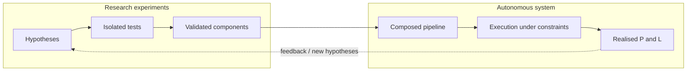
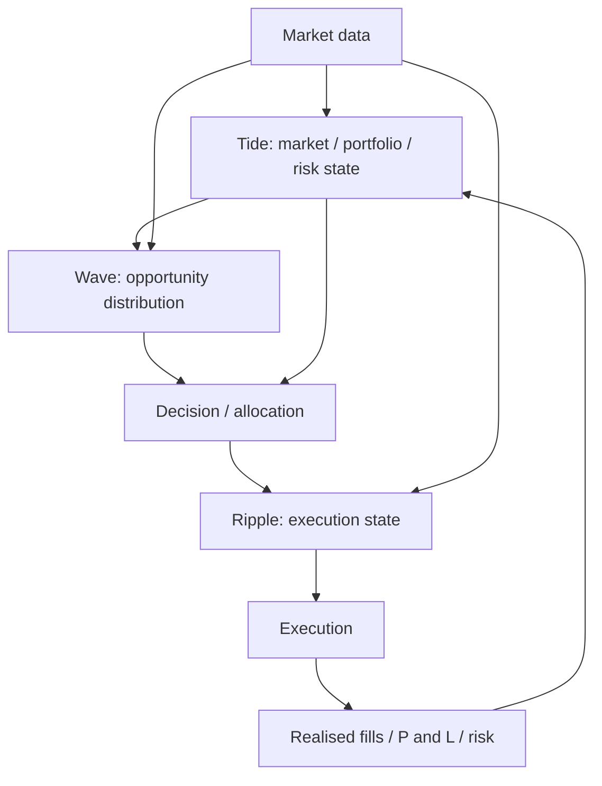
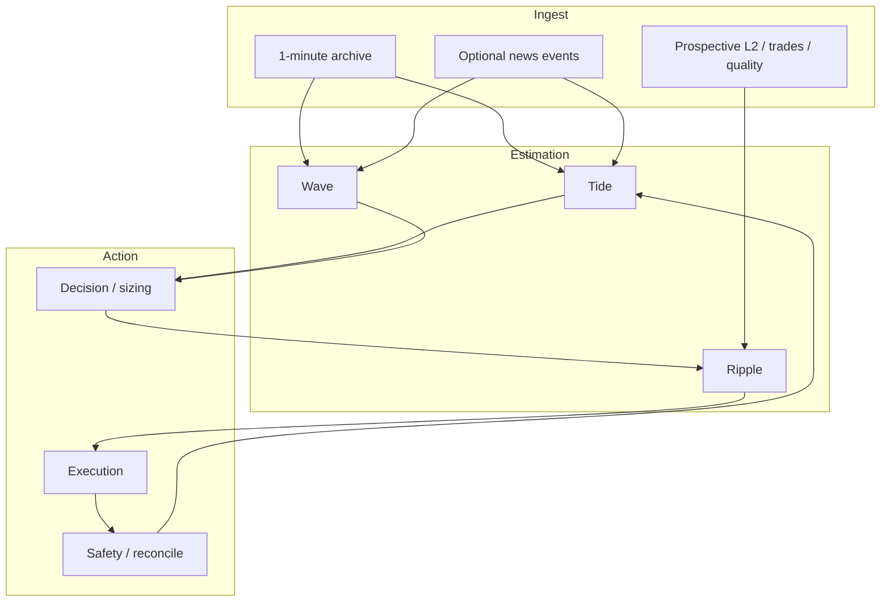
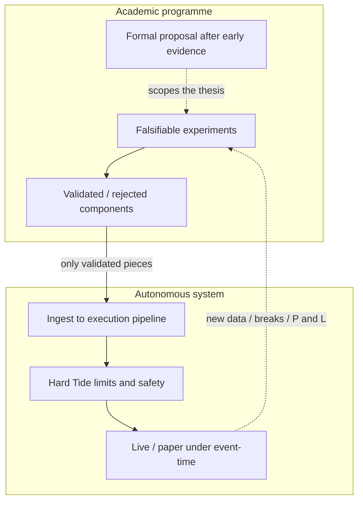

# Tide / Wave / Ripple — Canonical Strategy Specification

## Status of this document

This file is the **canonical conceptual specification** for the current Tide / Wave / Ripple research programme and the intended autonomous trading system.

It is **not** an implementation contract, a configuration catalogue, or a claim that any component is economically validated.

| Status | Meaning in this document |
|---|---|
| **Current design** | Architectural commitments that subsequent research, data, implementation, and testing documents must respect. |
| **Candidate hypothesis** | A falsifiable claim. Not a fact. May be rejected. |
| **Validated component** | A claim that has survived a declared experiment protocol. None of the economic hypotheses below are validated at the time of writing. |
| **Future extension** | Intentionally deferred. Must not become a hidden assumption of the initial research programme. |

The historical design document `strategy.md` records an earlier, implementation-oriented V1 (deterministic Tide bias, Wave permission matrix, Ripple bounce/breakout). It may be used for terminology, feature definitions, and engineering history. **It is not the current strategy specification.** Do not treat its defaults, state machines, or trade archetypes as established truth.

Separate documents should later specialise this specification:

- research protocol and experiment log
- data architecture and quality
- implementation / module mapping
- testing and replay contracts

If those documents contradict this specification, this specification wins until it is deliberately revised.

---

## 1. Dual objectives

The programme has two connected objectives.

### 1.1 Academic

Complete a Master's quantitative finance research project with a defensible programme:

- explicit hypotheses and nulls
- declared information sets
- nested benchmarks and ablations
- out-of-sample validation
- statistical *and* economic evaluation
- calibration of probabilistic forecasts and risk measures

A formal research proposal will be finalised **after** initial experimentation shows which hypotheses are worth concentrating on. Early work is exploratory in *topic selection*, not sloppy in *protocol*.

### 1.2 Practical

Develop a genuinely profitable autonomous trading strategy spanning:

data ingestion → market/portfolio state → opportunity modelling → decision/allocation → execution → fills / P&L / risk → feedback.

Profitability is an **empirical objective**, not an assumption. A well-specified system that cannot beat nested benchmarks after costs is a valid research outcome.

### 1.3 Coupling

Research experiments validate *components*. Validated components may be composed into the autonomous system. Composition is itself a hypothesis: independently useful modules need not remain useful together.



---

## 2. Architectural principles

### 2.1 Three layers of information and responsibility

| Layer | Role | Typical horizon |
|---|---|---|
| **Tide** | Market and portfolio *state*: risk, capital, budgets, tails, factors, regime probabilities, hedges | Hours to days (slow state) |
| **Wave** | Conditional *opportunity*: market-state modelling, return/first-passage distributions | Minutes to hours (meso) |
| **Ripple** | Microstructure *expression*: order flow, liquidity, timing, method, fill/impact | Event scale (fast) |

The hierarchy is **information and responsibility**, not unquestioned causal superiority. Tide does not “know the truth” about Wave; Wave does not render Ripple irrelevant. Lower layers may contain incremental information after conditioning on higher layers. That increment is a research question, not a design axiom.

### 2.2 Prediction ≠ decision ≠ execution

This is the central operating principle.

1. **Models estimate distributions** (or functionals of distributions).
2. The **decision layer** asks whether an action has sufficient expected economic value subject to risk, capacity, and execution constraints.
3. **Ripple** asks how and when an *approved* exposure should be expressed.

A high probability of a favourable first passage is not a trade. A trade is not a fill. A fill is not a realised economic outcome after risk.

Wave must **not** be reduced to `{LONG, SHORT, NEUTRAL}`. Those labels may appear as *derived summaries* of a distribution; they are not the Wave object.

### 2.3 Complexity is not progress

Each modelling extension is a hypothesis to be tested against a simpler nested model. Additional complexity is justified only by incremental statistical or economic value after costs, leakage controls, and multiple-testing discipline.

### 2.4 Deterministic baselines remain useful

Rule-based Tide/Wave/Ripple artefacts from the historical V1 are **baselines and candidate policies**, not the destination. They exist to be beaten, matched, or retained if they survive comparison.

---

## 3. System overview

### 3.1 Fundamental flow



Narrative form:

```
market data
  → Tide market/risk state
  → Wave opportunity distribution
  → decision / allocation
  → Ripple execution state
  → execution
  → realised fills / P&L / risk
  → feedback to portfolio state
```

News/event state, if used, enters as structured information into Tide/Wave/Ripple — never as a direct order (see §12).

### 3.2 Layer questions

| Layer | Question it answers |
|---|---|
| Tide | What is the current market and *portfolio* situation, and how much risk may be taken? |
| Wave | Conditional on $\mathcal{F}_t$, what is the distribution of future returns / first-passage outcomes? |
| Decision | Does any feasible action $a$ have sufficient expected utility after costs, subject to Tide constraints? |
| Ripple | Given approved $a$, what is the liquidity state and how should the exposure be timed and routed? |

Ripple is the only layer that **submits** orders. Tide and Wave do not trade.

---

## 4. Mathematical foundation

### 4.1 Price convention

Work in log price:

$$
X_t = \ln P_t
$$

Log returns over horizon $h$:

$$
R_{t:t+h} = X_{t+h} - X_t
$$

### 4.2 Initial stochastic model

The starting continuous-time description is a diffusion

$$
dX_t = \mu_t\, dt + \sigma_t\, dW_t
$$

with drift and diffusion that may later be conditioned on slow state $Z_t$ (Tide/Wave) and microstructure $O_t$ (Ripple).

This is a **working model**, not a claim that prices are Gaussian, continuous, or Markov.

### 4.3 Fokker–Planck equation

If $p(x,t)$ is the density of $X_t$, the Fokker–Planck (forward Kolmogorov) equation associated with the diffusion is

$$
\frac{\partial p}{\partial t}
= -\frac{\partial}{\partial x}(\mu p)
+ \frac{1}{2}\frac{\partial^2}{\partial x^2}(\sigma^2 p)
$$

Probability flux (useful for first-passage and barrier problems):

$$
J(x,t) = \mu p - \frac{1}{2}\frac{\partial}{\partial x}(\sigma^2 p)
$$

Flux is a **research object**: it may clarify how probability mass moves toward a target or stop. It is not required for V1 experiments.

### 4.4 Wave objects

Wave may estimate one or both of:

$$
p(R_{t:t+h} \mid \mathcal{F}_t)
$$

$$
\mathbb{P}(\tau_{\text{target}} < \tau_{\text{stop}} \mid \mathcal{F}_t)
$$

where $\tau$ denotes a first-passage time to a target or stop barrier in $X$ (or in $P$). Barrier definition, horizon, and whether barriers are state-dependent are experimental choices.

Expected-return and risk functionals are derived from these objects, not substitutes for them.

### 4.5 Ripple conditioning

A candidate microstructure-conditioned diffusion is

$$
\mu_t = f_\theta(Z_t, O_t), \qquad
\sigma_t = g_\theta(Z_t, O_t)
$$

where $Z_t$ is slow/meso state (Tide/Wave) and $O_t$ is order-book / order-flow information.

**Central Ripple question:** after conditioning on Wave/Tide information, does $O_t$ still move $p(R\mid\mathcal{F}_t)$, first-passage probabilities, or execution-quality distributions?

### 4.6 Model progression (hypotheses, not a ladder of truth)

1. Gaussian baseline  
2. Student-$t$ return model  
3. Regime-conditioned Student-$t$  
4. Conditional diffusion ($\mu_t,\sigma_t$ functions of $\mathcal{F}_t$)  
5. Microstructure-conditioned diffusion  
6. Jump-diffusion / Lévy extensions **if justified by evidence**

Do not assume that every extension improves decisions. Nested comparison is mandatory.

### 4.7 Schrödinger representation

A Schrödinger-equation rewriting of the diffusion is an **experimental analogy only**. It is not a foundational assumption of the strategy, not a claim about quantum markets, and not a prerequisite for any other workstream.

---

## 5. Tide — market and portfolio state

### 5.1 Current design

Tide owns **portfolio-level state and constraints**. It does not originate trades.

Responsibilities:

- market and portfolio state
- risk estimation
- capital allocation
- risk budgeting
- tail-risk estimation
- factor exposure
- regime probabilities (as *inputs* to risk, not as trade signals)
- hedge requirements (including later FX; see §13)

Tide should evolve from simple deterministic controls toward **probabilistic portfolio risk**. Hard LONG/SHORT “macro bias” as a primary Tide output is a historical V1 device, not the current target.

### 5.2 Risk-model progression

Again nested hypotheses:

Gaussian risk → Student-$t$ → regime-conditioned Student-$t$ → Monte Carlo / conditional simulation → jump models if evidence requires them.

Candidate metrics (none is mandatory until evaluated):

- volatility
- VaR
- Expected Shortfall (ES)
- stress ES
- factor exposure
- Euler risk contribution
- RORAC (evaluated at opportunity/allocation time; not a Tide “signal”)
- drawdown
- margin / liquidation risk

VaR and ES of a loss $L$ at level $\alpha$:

$$
\mathrm{VaR}_\alpha = \inf\{x:\mathbb{P}(L>x)\le 1-\alpha\}
$$

$$
\mathrm{ES}_\alpha = \mathbb{E}[L \mid L > \mathrm{VaR}_\alpha]
$$

ES is preferred as a *constraint* object because it is coherent (subadditive) under standard conditions; VaR remains useful for diagnostics and regulatory-style backtests.

### 5.3 Risk budget

Decisions are constrained by a live budget $B_t$:

$$
\mathrm{ES}_\alpha(R_p) \le B_t
$$

Euler contributions for a homogeneous risk measure $\rho$:

$$
\rho(\mathbf{w}) = \sum_i w_i \frac{\partial \rho}{\partial w_i}, \qquad
\mathrm{RC}_i = w_i \frac{\partial \rho}{\partial w_i}
$$

Hierarchical budgeting (strategy sleeve × asset × cell) remains a **candidate design** from the historical programme: it is conceptually sound diversification accounting, not yet a validated allocation policy.

### 5.4 Allocation as a research design decision

The eventual problem may be written

$$
\max_a \mathbb{E}[U(R_p \mid a)]
\quad\text{s.t.}\quad
\mathrm{ES}_\alpha(R_p \mid a) \le B_t
$$

plus margin, liquidity, maximum exposure, and execution-feasibility constraints.

**Do not hard-code $U$.** Utility, including mean–ES, growth-optimal, or constraint-only (feasibility) formulations, is a research design decision. RORAC-like ratios may appear as *evaluation* or as *one candidate* objective, not as Tide’s native output.

### 5.5 Uncertainty in risk

Tide estimates must distinguish (see §11):

1. market uncertainty (the random $R_p$)
2. parameter uncertainty
3. model uncertainty

Point ES with no interval or stress overlay implies false precision.

---

## 6. Wave — conditional opportunity

### 6.1 Current design

Wave models **conditional market state and the opportunity distribution**. It does not trade.

It should ultimately publish probabilistic objects, for example:

- $p(R_{t:t+h}\mid\mathcal{F}_t)$ or a parametric family
- $\mathbb{P}(\tau_{\text{target}}<\tau_{\text{stop}}\mid\mathcal{F}_t)$
- $\mathbb{E}[R_{t:t+h}\mid\mathcal{F}_t]$, $\mathrm{ES}_\alpha(R_{t:t+h}\mid\mathcal{F}_t)$
- regime probability vector $\pi_t$
- factor / residual state

Hard regime labels (`MEAN_REVERSION`, `BREAKOUT`, …) may exist as *argmax summaries* of $\pi_t$. Relying solely on a hard label is a degraded interface.

HMM (or similar latent-state) output:

$$
\pi_t = \bigl[\mathbb{P}(S_1\mid\mathcal{F}_t),\ldots,\mathbb{P}(S_K\mid\mathcal{F}_t)\bigr]
$$

State count $K$, emission family, and whether states are economically named are experimental.

### 6.2 Candidate information

Potential $\mathcal{F}_t$ contents (include only with evidence of incremental information):

- OHLCV and returns
- realised volatility and volatility clustering
- market-structure / session features
- trend efficiency
- VWAP and other statistical anchors
- classical technicals (Bollinger / RSI / MACD) **only if they add information beyond simpler features**
- cross-asset returns
- PCA / factor exposures and residuals
- HMM regime probabilities
- macro variables
- structured news/event state (§12)

Avoid indicator accumulation. Each feature class is an ablation candidate.

Useful structural quantities from the historical programme, retained as *candidates*:

- trend efficiency $\eta = |\sum \Delta P_i| / \sum |\Delta P_i|$
- factor residual dislocation $\delta_{i,t} = r_{i,t} - \hat\beta_i r_{M,t}$
- cross-sectional dispersion $D_t$
- absorption ratio of the correlation spectrum

### 6.3 Wave research question

Does conditional probabilistic modelling improve **decision quality** — not merely in-sample likelihood — relative to unconditional or simple rule-based Wave?

Decision quality is measured after Tide constraints and a declared cost model, on untouched test data.

---

## 7. Ripple — microstructure and execution

### 7.1 Current design

Ripple models **how the market is trading right now** and **how an approved exposure should be expressed**.

It investigates:

- bid/ask depth, spread, depth
- order-book imbalance, microprice
- OFI, CVD, aggressive trade flow
- wall persistence, cancellation, absorption, exhaustion, withdrawal, refill
- volume profile, liquidity voids
- market impact, latency, fill probability
- first-passage *refinement* given $O_t$

Ripple is not merely “the layer that fires bounce and breakout.” Those archetypes are **historical baselines and candidate policies**.

### 7.2 Candidate observables

Notation retained from the historical programme where still useful:

$$
I_t = \frac{V^b_t - V^a_t}{V^b_t + V^a_t}
$$

$$
P_\mu = P^a_t \frac{V^b_t}{V^b_t+V^a_t} + P^b_t \frac{V^a_t}{V^b_t+V^a_t}
$$

OFI, CVD, impact per unit aggressive volume, and wall-quality scores are **candidate features**. Their incremental value after Wave/Tide conditioning is the scientific question.

Liquidity-state labels (stable, absorption, exhaustion, withdrawal, refill) are a **candidate latent taxonomy**, not a required ontology.

### 7.3 Central Ripple research question

Does microstructure information provide incremental information about:

1. short-horizon price movement,
2. first-passage / target-vs-stop probability, or
3. execution quality (fill, slippage, impact),

after conditioning on Wave and Tide information?

A feature that predicts mid-price ticks but does not improve post-cost allocation or execution may still be scientifically interesting; it is not automatically a trading edge.

### 7.4 Execution as a separate problem

Even a correctly signed Wave distribution can be destroyed by costs. Model execution cost as a research object:

$$
C_{\text{execution}}
= \text{spread}
+ \text{commission}
+ \text{slippage}
+ \text{market impact}
+ \text{funding}
+ \text{latency effects}
$$

The final strategy is evaluated **after** a realistic $C_{\text{execution}}$. Optimistic fills are not results.

Ripple may propose method (limit vs market, passive vs aggressive, slicing) and timing; the decision layer may reject an exposure whose expected edge does not cover $C_{\text{execution}}$.

---

## 8. Decision layer and position sizing

### 8.1 Current design

The decision layer sits between Wave’s distribution and Ripple’s expression.

It maps

$$
\bigl(p(\cdot\mid\mathcal{F}_t),\; \text{Tide state},\; \widehat{C}_{\text{execution}},\; \text{constraints}\bigr)
\;\to\;
a_t
$$

where $a_t$ may be “do nothing.” Doing nothing is a first-class action.

### 8.2 Position sizing is a decision problem

Sizing is not a fixed formula (fixed fractional, raw signal strength, historical V1 ES throttle) unless that formula wins a nested comparison.

Candidate inputs:

- expected return / expected utility
- $\mathbb{P}(\tau_{\text{target}}<\tau_{\text{stop}}\mid\mathcal{F}_t)$
- ES of the candidate position
- liquidity and estimated execution cost
- regime probabilities $\pi_t$
- model confidence / calibration
- margin
- hedge cost

RORAC-like quantities belong **here** (opportunity vs risk capital), not as a Tide broadcast that Ripple blindly follows.

### 8.3 Permissions vs probabilities

The historical Wave “permission matrix” (enable/disable bounce vs breakout) is a crude decision policy. A probabilistic Wave plus an explicit utility/constraint problem is the intended replacement. Permissions may remain as hard safety interlocks (e.g. flatten-only under Tide crisis), which is an operational constraint, not a market model.

---

## 9. Data

### 9.1 Current design

**Initial research dataset:** approximately five years of 1-minute price data. This is the starting information set for Wave/Tide statistical work and for simple execution-cost *proxies*.

**Level-2 / order-flow history is scarce.** L2 must be accumulated **prospectively**. Ripple research that requires true L2 cannot be backdated beyond the collected archive. Do not invent synthetic books and then treat them as historical truth.

**Raw events are retained** so derived datasets (books, CVD, OFI, bars) can be regenerated. Derived products are not the source of truth.

### 9.2 What must be preserved

- exchange timestamp
- local receipt timestamp
- sequence / update IDs where available
- raw depth updates
- snapshots
- trades
- instrument identity
- session / connection metadata
- data-quality information

Two clocks matter: **exchange event time** and **local receipt time**. Latency, staleness, and look-ahead errors are undefined if only one exists.

### 9.3 Data quality is a research concern

Detect and count, at minimum:

- missing events
- sequence gaps
- duplicates
- out-of-order events
- stale books
- reconnects
- timestamp anomalies

Quality filters change the sample. Every skip/quarantine must be counted. “Clean data” without a quality paper is a specification of a different process than live trading.

Survivorship, listing/delisting, and contract specification changes (tick size, fees, funding) are part of the data generating process.

---

## 10. Research methodology

### 10.1 Experiment contract

Every experiment defines:

| Field | Content |
|---|---|
| Hypothesis | What is claimed |
| Null | What would count as no effect |
| Dataset | Universe, venue, frequency, quality filters |
| Information set $\mathcal{F}_t$ | Features allowed at decision time |
| Training period | Fit / estimate |
| Validation period | Model selection, early stopping, calibration |
| Untouched test period | Final evaluation only |
| Benchmark | Nested simpler alternative |
| Model | Family and estimation method |
| Parameters | Free vs frozen |
| Evaluation metrics | Statistical |
| Statistical tests | Including multiple-testing handling |
| Economic metrics | After declared costs, risk, capacity |
| Result | What was observed |
| Decision | Adopt / reject / revise / defer |

Exploratory analysis that violates this contract may generate hypotheses. It may not be reported as a confirmatory result.

### 10.2 Explicit controls

The programme must control for:

- look-ahead bias
- survivorship bias
- data leakage (including label leakage and same-bar features)
- multiple testing
- parameter overfitting
- model-selection bias
- non-stationarity
- transaction costs, slippage, market impact
- latency
- capacity

Event timestamps for news must be the **earliest available** timestamp, not publication scrape time if that is later (see §12).

### 10.3 Calibration

Probabilistic predictions are evaluated for **calibration**, not only directional accuracy.

Relevant diagnostics:

- log-likelihood
- Brier score (for events such as $\tau_{\text{target}}<\tau_{\text{stop}}$)
- reliability diagrams
- probability calibration
- distributional calibration (PIT, interval coverage)
- VaR exceedance tests
- ES backtesting

A sharp but miscalibrated model is not a risk model.

### 10.4 Benchmark hierarchy

Compare increasing complexity. A suggested ladder (items may be added or skipped; none is sacred):

1. Random / unconditional baseline  
2. Buy-and-hold  
3. Simple momentum  
4. Simple mean reversion  
5. Volatility targeting  
6. Simple regime strategy  
7. Simple ML model  
8. Hierarchical (Tide/Wave) model without microstructure  
9. Full Tide / Wave / Ripple system after costs  

The scientific claim is always **incremental economic value** of the additional layer.

### 10.5 Ablation

Support staged information sets, for example:

```
market data only
  → + technical / structural features
  → + HMM
  → + PCA / factors
  → + Tide risk state
  → + news/event state
  → + order flow
  → + execution model
```

Do not assume every layer adds value. Negative ablations are first-class results.

### 10.6 Statistical vs economic significance

A significant likelihood-ratio improvement that does not survive costs, capacity, or ES constraints does not promote a component into the autonomous system. Conversely, a noisy economic edge without a coherent statistical story is treated as provisional, not validated.

---

## 11. Non-stationarity and model uncertainty

### 11.1 Two different failures

Distinguish:

| Phenomenon | Meaning |
|---|---|
| **Regime change** | The latent market state $S_t$ moves; the *same* model family remains appropriate. |
| **Structural / model change** | The mapping from $\mathcal{F}_t$ to outcomes itself changes (new microstructure, fee regime, participant mix, product spec). |

HMM $\pi_t$ addresses the first only if the emission model is stable. Walk-forward degradation, concept-drift diagnostics, and explicit “model break” tests address the second.

The system must investigate whether performance degrades when market structure changes — not only whether average OOS metrics look acceptable.

### 11.2 Three uncertainties

1. **Market uncertainty** — irreducible randomness of $R$ given a true model.  
2. **Parameter uncertainty** — $\theta$ is estimated.  
3. **Model uncertainty** — the family is wrong.

Risk numbers used for live limits should not be presented as if only (1) existed.

---

## 12. News / LLM (experimental information layer)

**Current design:** optional, experimental, structured.

```
news → structured event extraction → event state → Tide / Wave / Ripple
```

The LLM **must not** output trading instructions, sizes, or “buy/sell” recommendations.

Candidate event-state fields:

- event type
- entities
- direction
- magnitude
- confidence
- novelty
- surprise
- horizon
- persistence
- event timestamp (earliest available)

Look-ahead is the default failure mode. If the timestamp protocol is not watertight, the layer is invalid for confirmatory tests.

---

## 13. Options and FX hedging (deferred)

**Future extension**, not a foundation of the initial programme.

The book may be AUD-based while BTC is quoted/traded in USD. Distinguish:

- BTC/USD market risk  
- USD/AUD currency risk  

Options, if used later, transform the portfolio distribution, conceptually

$$
R_p = R_{\mathrm{BTC}} + H(\mathrm{FX}_T) - C_{\text{option}}
$$

(or an analogous decomposition). Physical measure $P$ (forecasting, decisions) and risk-neutral measure $Q$ (option valuation, implied surfaces) **must remain distinct**.

Do not turn the initial project into an options-pricing thesis. FX hedging is a later portfolio-risk experiment.

---

## 14. Operational safety (autonomous system)

The eventual live system is not a research notebook. It must support:

- stale-data detection
- broker/exchange disconnection handling
- position reconciliation
- duplicate-order protection
- model-failure fallback
- risk-limit enforcement
- emergency flattening
- a defined safe state (no new risk, flatten or hold per policy)

Research models that cannot fail closed are not deployable components, regardless of backtest Sharpe.

Replay and live decision logic must be **event-time**. Wall-clock may exist for operations; it must not leak into simulated decisions.

---

## 15. Relationship to the historical V1 and the existing platform

| Historical V1 (see `strategy.md`) | Current specification |
|---|---|
| Tide: LONG/SHORT/NEUTRAL bias + scalar risk multiplier | Tide: probabilistic portfolio/risk state and constraints |
| Wave: hard regime + permission matrix | Wave: conditional distributions and $\pi_t$ |
| Ripple: bounce/breakout lifecycle as the strategy | Ripple: microstructure model + execution; archetypes are hypotheses |
| Determinism before probability as a *build* rule | Deterministic policies as *baselines* in a research ladder |
| Prediction, permission, and firing collapsed in practice | Prediction ≠ decision ≠ execution |

The existing mixed C++/Python platform, collectors, replay harness, and HMM tooling are **engineering substrate**. Their existence does not validate the economic hypotheses in §17.

---

## 16. Current architecture

**Commitments (current design):**

- Hierarchical Tide / Wave / Ripple information architecture with an explicit decision layer.
- Models output distributions (or well-defined functionals); they do not fire orders.
- Tide constrains risk; Wave describes opportunity; Ripple expresses approved exposure.
- Initial empirical work uses ~five years of 1-minute prices.
- L2/order-flow research depends on prospective capture of raw events with dual timestamps and quality telemetry.
- Nested baselines, ablations, calibration, and after-cost evaluation are mandatory.
- News/LLM, options, and FX hedging are optional/deferred layers with the interfaces above.

**Not yet architecture (still research):**

- the utility $U$
- the production emission family (Gaussian vs $t$ vs jumps)
- bounce/breakout as the live policy
- the live feature set
- the claim of profitability



---

## 17. Research progression

### 17.1 Modelling depth (apply per layer as relevant)

1. Unconditional / Gaussian baseline  
2. Heavy tails (Student-$t$)  
3. Regime-conditioned tails ($\pi_t$)  
4. Conditional diffusion in $X_t$  
5. Microstructure-conditioned $\mu_t,\sigma_t$  
6. Jumps / Lévy only if residuals demand them  

### 17.2 Tide depth

Gaussian risk → $t$ → regime-conditioned $t$ → conditional simulation → jumps if needed.

### 17.3 Information depth (ablation)

Price history → structure/vol → latent regimes → factors → portfolio risk state → events → order flow → execution model.

### 17.4 Decision depth

No-trade / buy-and-hold → simple rules → distribution-aware decisions under ES → cost-aware Ripple expression.

### 17.5 Proposal timing

Concentrate the formal Master’s proposal on the hypotheses that survive this early ladder — not on the full stack a priori.

---

## 18. Explicit research hypotheses

Each is a **candidate**. The null in each case is “no incremental value relative to the nested simpler model,” on the declared test set, after the declared costs and multiple-testing rule.

**H1 (tails).** A Student-$t$ model of $R_{t:t+h}$ is better calibrated than Gaussian for VaR/ES and density, at 1-minute-derived horizons.

**H2 (regimes).** Regime probabilities $\pi_t$ improve density/first-passage forecasts relative to an unconditional $t$ model.

**H3 (factors).** PCA/factor residuals contain incremental information about $R_{t:t+h}$ beyond own-price history.

**H4 (Wave decisions).** Decisions using $p(R\mid\mathcal{F}_t)$ or $\mathbb{P}(\tau_{\text{target}}<\tau_{\text{stop}}\mid\mathcal{F}_t)$ improve after-cost risk-adjusted outcomes versus hard-label Wave or always-in-market baselines.

**H5 (Tide constraints).** Imposing $\mathrm{ES}_\alpha(R_p)\le B_t$ (and liquidation/margin constraints) improves left-tail outcomes without fully destroying mean performance relative to unconstrained Wave.

**H6 (RORAC allocation).** Allocation using an opportunity/risk ratio evaluated at decision time outperforms naive equal or volatility-targeted sizing under the same ES budget.

**H7 (Ripple increment).** $O_t$ improves short-horizon forecasts or first-passage probabilities after conditioning on Wave/Tide.

**H8 (execution).** A Ripple execution model reduces $C_{\text{execution}}$ or improves fill quality versus naive market-on-signal, holding the parent decision fixed.

**H9 (archetypes).** Bounce and/or breakout policies beat nested non-microstructure policies after costs. Either or both may fail.

**H10 (complexity).** The full hierarchical system beats the best simpler rung on the benchmark ladder after costs and on untouched data.

**H11 (non-stationarity).** Predictive maps degrade across identified structural breaks more than across ordinary regime switches; monitoring for model change has value.

**H12 (news).** Structured event state improves Wave/Tide forecasts after timestamp-safe construction. The LLM-as-trader null is that unconstrained LLM actions add only noise or leakage.

**H13 (FX, deferred).** Separating USD/AUD from BTC/USD risk improves AUD-denominated ES relative to ignoring FX.

Rejection of H7–H9 still leaves a viable Tide/Wave research thesis. Rejection of H10 is an acceptable academic outcome and a practical stop-ship condition for autonomy.

---

## 19. Validation methodology

Minimum standard for promoting a component toward the autonomous system:

1. **Protocol registered** in the experiment contract (§10.1).  
2. **Nested benchmark** present; complexity justified by increment.  
3. **Split discipline:** train / validate / untouched test. Walk-forward where stationarity is in doubt.  
4. **Leakage audit:** timestamps, labels, cross-asset alignment, news, L2 reconstruction.  
5. **Statistical evaluation:** likelihood / calibration / appropriate tests; multiple-testing control across the family of experiments.  
6. **Economic evaluation:** after $C_{\text{execution}}$, with capacity and latency sensitivity.  
7. **Risk evaluation:** VaR/ES backtests; constraint adherence; drawdown and liquidation proxies.  
8. **Ablation:** remove the component; the increment must vanish in the expected direction.  
9. **Failure path:** what the component does when data are stale or the model is uncalibrated.  
10. **Composition test:** the component still helps *inside* the stack, not only in isolation.

Engineering tests (replay determinism, unit tests) are necessary for implementation integrity. They do **not** substitute for (1)–(10).

---

## 20. Deferred extensions

| Extension | Why deferred |
|---|---|
| Full L2-conditional diffusion as the *initial* Wave model | L2 archive is prospective |
| Jump-diffusion / Lévy as default | Must be evidence-led |
| Schrödinger / quantum analogy | Experimental curiosity only |
| Options book / $Q$-measure pricing thesis | Wrong scope for the initial degree project |
| FX overlay as a core signal | Later AUD portfolio-risk experiment |
| LLM direct trading | Architectural prohibition |
| Market-making / passive quoting as the primary strategy | Different problem |
| Multi-venue statistical arbitrage | Different identification problem |
| High-frequency sub-second holding as the research target | Data and execution assumptions not yet met |
| Hard-coded live utility $U$ | Research design decision |
| Treating historical bounce/breakout V1 as the product | Circumvents H9–H10 |

---

## 21. Open questions

These are unanswered by design.

1. Which forecast horizon $h$ and which barrier definition make first-passage objects decision-relevant on 1-minute data?  
2. Is $\pi_t$ better implemented as HMM, change-point, or another latent-state model? What $K$?  
3. Does factor structure in a small crypto universe justify PCA beyond a single market factor?  
4. What $\alpha$ and what $B_t$ policy (static vs vol-targeted vs stress-scaled) are operationally meaningful?  
5. Can ES be estimated well enough, with parameter and model uncertainty, to bind live decisions without false precision?  
6. What is the right decision criterion if $U$ is left unspecified — constraint satisfaction, growth, or a family of utilities with robustness checks?  
7. On 1-minute data alone, is there *any* after-cost edge, or does the practical objective require L2?  
8. Which Ripple observables survive conditioning on Wave?  
9. How should capacity and impact be estimated before a large L2 sample exists?  
10. How will prospective L2 be aligned with the 1-minute research sample without mixing incomparable information sets in a single “result”?  
11. What constitutes a structural break in this market, and how should live models be retired?  
12. When (if ever) does news event state survive a timestamp-safe test?  
13. How should academic reporting handle a negative practical result (no deployable edge) while still composing a complete thesis?

---

## 22. Relationship between strategy research and the autonomous trading system



**Research** produces beliefs about distributions, incremental information, and decision rules, with error bars and rejections.

**The autonomous system** is a composition of those beliefs with non-negotiable safety: risk limits, stale-data handling, reconciliation, and fail-closed execution.

Rules of promotion:

- A component may enter paper/live *observation* for data collection before it is economically validated; it must not silently take risk.
- A component may enter *armed* trading only after §19 validation, after-cost, with documented fallback.
- The full Tide/Wave/Ripple stack is not entitled to live risk merely because the parts exist in code.
- Academic success does not require a profitable bot; practical success does. The documents, experiments, and code should make that distinction impossible to blur.

This specification is the conceptual contract for both tracks. Implementation details, numerical defaults, and experiment results belong in the documents that will follow from it — not as unspoken amendments here.
